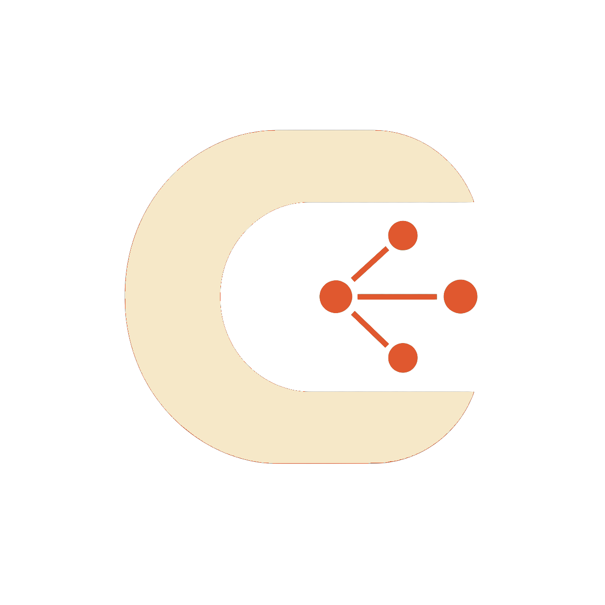

<div align="center">
  

  <h1>Caplets</h1>

  <p>
    <strong>Capability cards for coding agents.</strong><br />
    Wrap sprawling tool stacks behind focused, progressive-disclosure interfaces.
  </p>

  <p>
    <a href="https://www.npmjs.com/package/caplets"></a>
    <a href="https://github.com/spiritledsoftware/caplets/actions/workflows/ci.yml"></a>
    <a href="LICENSE"></a>
    
  </p>

  <p>
    <code>MCP</code> · <code>OpenAPI</code> · <code>GraphQL</code> · <code>HTTP</code> · <code>CLI</code>
  </p>
</div>

---

Caplets turns sprawling tool setups into focused capability cards for coding agents.
Connect MCP servers, OpenAPI specs, GraphQL endpoints, HTTP actions, and curated CLI
commands without flooding the model with every downstream operation up front.

Instead of exposing a flat wall of tools, Caplets shows one top-level tool per capability.
The agent chooses a domain first, then uses scoped operations like `search_tools`,
`get_tool`, and `call_tool` only when it needs more detail.

For MCP-backed Caplets, the scoped operation set also includes resource discovery/reading,
prompt listing/rendering, resource-template discovery, and completion for prompt or template
arguments. Non-MCP backends continue to expose only tool/action operations.

## Quick Start

Caplets requires Node.js 22 or newer.

```sh
pnpm add -g caplets
caplets init
```

Add a capability from an existing system:

```sh
# Wrap an MCP server
caplets add mcp docs --command npx --arg -y --arg @upstash/context7-mcp

# Convert useful repository commands into curated tools
caplets add cli repo-tools --repo . --include git,gh,package

# Install ready-made Caplets from a repository
caplets install spiritledsoftware/caplets github linear context7
```

Connect Caplets to any MCP client:

```json
{
  "mcpServers": {
    "caplets": {
      "command": "caplets",
      "args": ["serve"]
    }
  }
}
```

Ask your agent to use Caplets. It will see a compact capability list first, then inspect
only the backend it needs.

You can also invoke configured Caplets directly from the CLI for agent-friendly scripts and smoke tests:

```sh
caplets get-caplet context7
caplets list-tools context7
caplets get-tool context7.resolve-library-id
caplets call-tool context7.resolve-library-id --args '{"libraryName":"react"}'
caplets call-tool context7.resolve-library-id --args '{"libraryName":"react"}' --field result.id --format json
caplets list-resources docs
caplets read-resource docs file:///repo/README.md
caplets list-prompts linear
caplets get-prompt linear.review_issue --args '{"issueId":"CAP-123"}'
caplets complete docs --resource-template 'file:///repo/{path}' --argument path --value src/
```

Direct CLI operation commands print Markdown summaries by default. Add `--format plain` for plain text or `--format json` for machine-readable JSON (`md` is accepted as an alias for `markdown`). If a downstream tool returns `isError: true`, Caplets still exits with status code 1.

### Shell completions

The npm package ships shell completion generators for Bash, Zsh, Fish, PowerShell, and cmd. Installation is explicit: `npm install -g caplets` does not modify shell startup files or system completion directories.

```sh
# Bash
mkdir -p ~/.local/share/bash-completion/completions
caplets completion bash > ~/.local/share/bash-completion/completions/caplets

# Zsh
mkdir -p ~/.zsh/completions
caplets completion zsh > ~/.zsh/completions/_caplets

# Fish
mkdir -p ~/.config/fish/completions
caplets completion fish > ~/.config/fish/completions/caplets.fish

# PowerShell
caplets completion powershell | Out-String | Invoke-Expression

# cmd.exe
caplets completion cmd > %USERPROFILE%\caplets-completion.cmd
%USERPROFILE%\caplets-completion.cmd
```

Completions include command names, options, common enum values, and configured Caplet IDs. They do not probe downstream MCP servers, HTTP APIs, GraphQL endpoints, OpenAPI specs, or configured CLI tools during tab completion.

## Agent Plugins

Use Caplets as a normal MCP server everywhere, or install a native agent integration when
your coding agent supports one.

| Agent          | Install                                                                                             | What It Provides                                                   |
| -------------- | --------------------------------------------------------------------------------------------------- | ------------------------------------------------------------------ |
| Any MCP client | Add `caplets serve` as a stdio MCP server                                                           | Universal progressive-disclosure gateway                           |
| Claude Code    | `claude plugin marketplace add spiritledsoftware/caplets && claude plugin install caplets@caplets`  | Claude Code plugin metadata, MCP config, and shared skill guidance |
| Codex          | `codex plugin marketplace add spiritledsoftware/caplets`, then install `caplets` from Codex plugins | Codex plugin metadata, MCP config, and shared skill guidance       |
| OpenCode       | Install [`@caplets/opencode`](packages/opencode/README.md)                                          | Native `caplets_<id>` tools and prompt guidance hooks              |
| Pi             | Install [`@caplets/pi`](packages/pi/README.md)                                                      | Native `caplets_<id>` tools with Pi prompt snippets/guidelines     |

Codex and Claude Code plugins are plugin-native but MCP-backed. The installable plugin
lives under `plugins/caplets/`, with agent-specific manifests in `.codex-plugin/` and
`.claude-plugin/`, a shared `skills/` directory, and shared `mcp.json` config. The
repo-level `.agents/plugins/marketplace.json` and `.claude-plugin/marketplace.json`
files only advertise that installable plugin root.

The Claude Code and Codex commands install from this GitHub repository through each agent's
plugin marketplace flow; users do not need to clone the repository manually. Plugin MCP
configs run `caplets serve` directly, so install the Caplets CLI globally first.

### Remote Caplets service

OpenCode and Pi can use native `caplets_<id>` tools backed by a remote Caplets HTTP service. Codex, Claude Code, and any MCP client can connect to the same remote MCP endpoint directly.

Start a local HTTP service. `--path` is the service base path; Caplets mounts MCP,
control, and health endpoints underneath it:

```sh
CAPLETS_SERVER_URL=http://127.0.0.1:5387/caplets \
CAPLETS_SERVER_PASSWORD=... \
caplets serve --transport http
```

With `CAPLETS_SERVER_URL=http://127.0.0.1:5387/caplets`, the derived endpoints are:

- MCP: `http://127.0.0.1:5387/caplets/mcp`
- Control: `http://127.0.0.1:5387/caplets/control`
- Health: `http://127.0.0.1:5387/caplets/healthz`

`caplets serve --transport http` serves plain HTTP. For non-loopback or network access, expose it only through HTTPS/TLS (for example, a reverse proxy or secure tunnel) and enable Basic Auth; Basic Auth over plain HTTP exposes credentials. Keep credentials out of plugin manifests.

#### Docker Compose self-hosting

This repository includes a source-build Docker image and Compose service for running the HTTP service from the checked-out source tree:

```sh
CAPLETS_SERVER_PASSWORD=change-me docker compose up --build
```

By default, Compose publishes the service on loopback only:

- Base URL: `http://127.0.0.1:5387`
- MCP endpoint: `http://127.0.0.1:5387/mcp`
- Control endpoint: `http://127.0.0.1:5387/control`
- Health endpoint: `http://127.0.0.1:5387/healthz`

The service stores Caplets config and auth state in a Docker named volume mounted at `/data`. To use a host-visible bind mount instead, replace this Compose volume entry:

```yaml
volumes:
  - caplets-data:/data
```

with:

```yaml
volumes:
  - ./data:/data
```

To expose the service to a LAN interface or reverse proxy, set an explicit bind address and public base URL:

```sh
CAPLETS_BIND_ADDRESS=0.0.0.0 \
CAPLETS_SERVER_URL=https://caplets.example.com \
CAPLETS_SERVER_PASSWORD=change-me \
docker compose up --build
```

Only expose Caplets beyond loopback through HTTPS/TLS and Basic Auth. `CAPLETS_SERVER_PASSWORD` protects both the MCP and control endpoints; downstream provider tokens and auth files remain server-owned inside the mounted `/data` location.

Native integrations and remote-capable CLI commands read remote client settings from environment variables:

```sh
CAPLETS_MODE=remote \
CAPLETS_SERVER_URL=https://caplets.example.com/caplets \
CAPLETS_SERVER_USER=caplets \
CAPLETS_SERVER_PASSWORD=... \
opencode
```

For MCP-backed Codex or Claude Code configs, point the agent's MCP server entry at the derived `/mcp` URL using that agent's supported HTTP MCP configuration. If Basic Auth is needed, use the agent's secure secret or environment interpolation mechanism rather than hardcoding credentials.

## Convert Existing Tooling

Caplets is designed to convert what you already use into agent-friendly capability domains.

| Existing source          | Command                                                                                                          |
| ------------------------ | ---------------------------------------------------------------------------------------------------------------- |
| Local MCP server         | `caplets add mcp local-tools --command node --arg ./server.mjs`                                                  |
| Remote MCP server        | `caplets add mcp remote-tools --url https://mcp.example.com/mcp --transport http --token-env MCP_TOKEN`          |
| OpenAPI service          | `caplets add openapi users --spec ./openapi.json --base-url https://api.example.com --token-env USERS_API_TOKEN` |
| GraphQL endpoint         | `caplets add graphql catalog --endpoint-url https://api.example.com/graphql --schema ./schema.graphql`           |
| Simple HTTP API          | `caplets add http status-api --base-url https://api.example.com --action get_status:GET:/status/{service}`       |
| Repository CLI workflows | `caplets add cli repo-tools --repo . --include git,gh,package`                                                   |
| Shared Caplet catalog    | `caplets install spiritledsoftware/caplets github linear context7`                                               |

Generated Caplet files are written to `./.caplets` by default so teams can review,
version, and customize them with the project.

## Why It Matters

Large MCP setups can make agents harder to steer. If every downstream server exposes
every tool up front, the model starts with a noisy flat list, duplicate tool names, and
a larger context surface before it knows which capability matters.

Caplets turns that flat tool wall into progressive disclosure: one capability card first,
then scoped discovery only after the agent chooses the relevant domain.

## Benchmark

In Caplets' reproducible coding-agent benchmark, the same three mock MCP servers are
exposed two ways: direct flat MCP aggregation versus Caplets progressive disclosure.

| Initial Agent Surface     |   Direct Flat MCP |      Caplets |     Reduction |
| ------------------------- | ----------------: | -----------: | ------------: |
| Visible tools             |               106 |            3 |   97.2% fewer |
| Serialized MCP payload    |      32,090 bytes |  8,442 bytes | 73.7% smaller |
| Approx. context surface   |      8,023 tokens | 2,111 tokens |   5,912 fewer |
| Top-level name collisions | 3 duplicate names |            0 |    eliminated |

Caplets does not remove access to downstream tools. It places them behind scoped
discovery operations, so the agent sees less up front while retaining access to the same
capabilities when needed.

A local OpenCode live benchmark also completed the full benchmark matrix successfully:

| Agent                          | Mode            | Tasks Passed |
| ------------------------------ | --------------- | -----------: |
| OpenCode `openai/gpt-5.5-fast` | Direct flat MCP |          2/2 |
| OpenCode `openai/gpt-5.5-fast` | Caplets         |          2/2 |

Live results are intentionally not committed as product claims because they depend on
local agent CLIs, credentials, models, providers, and agent behavior. The deterministic
surface benchmark is the reproducible claim.

See [`docs/benchmarks/coding-agent.md`](docs/benchmarks/coding-agent.md) for methodology,
limitations, and reproduction commands.

```sh
pnpm benchmark
pnpm benchmark:check
pnpm build
CAPLETS_BENCH_LIVE=1 pnpm benchmark:live:opencode -- --model openai/gpt-5.5-fast
```

## Design Model

Caplets combines two ideas that work well separately but leave a gap together: agent
skills and MCP servers.

Agent skills are great at progressive disclosure. They show an agent a compact capability
card first, then let it read deeper instructions only when that skill is relevant. MCP
servers are great at live tool execution, but most clients expose their tools as one flat
list up front. That means a powerful MCP setup can flood the agent with every tool from
every server before it knows which capability area matters.

Caplets borrows the skill-shaped discovery model and applies it to MCP. Each downstream
server becomes a skill-like capability card first; its actual MCP tools stay hidden until
the agent chooses that server and asks to search, list, inspect, or call them.

## Capabilities

- Reads downstream MCP server definitions, native OpenAPI endpoint definitions, native GraphQL endpoint definitions, explicit HTTP API action definitions, and curated CLI tool definitions from the user config file.
- Registers one generated MCP tool for each enabled MCP server, OpenAPI endpoint, GraphQL endpoint, HTTP API, or CLI tools backend.
- Uses the configured server ID as the generated tool name.
- Uses the configured `name` and `description` as the capability card shown to agents.
- Starts downstream MCP servers and loads OpenAPI specs lazily when an operation needs them.
- Supports stdio, Streamable HTTP, and legacy HTTP+SSE downstream servers.
- Lets agents `list_tools`, `search_tools`, `get_tool`, and `call_tool` within one selected Caplet namespace.
- Converts OpenAPI operations into MCP-style tool metadata and executes HTTP calls directly.
- Converts configured GraphQL operations into MCP-style tool metadata, and can auto-generate GraphQL tools from schema root query and mutation fields.
- Converts explicitly configured HTTP actions into MCP-style tool metadata and executes HTTP calls directly.
- Converts explicitly configured CLI actions into MCP-style tool metadata and executes commands directly without a shell.
- Preserves downstream tool results instead of rewriting them into a custom format.
- Redacts secrets from structured errors.
- Supports static remote auth and OAuth token storage for remote servers.

## Configure

Create a starter user config at `${XDG_CONFIG_HOME:-~/.config}/caplets/config.json` on Unix-like platforms or `%APPDATA%\caplets\config.json` on Windows:

```sh
caplets init
```

The generated config includes a disabled example server. Replace it with the MCP servers
you want Caplets to expose:

```json
{
  "$schema": "https://raw.githubusercontent.com/spiritledsoftware/caplets/main/schemas/caplets-config.schema.json",
  "version": 1,
  "defaultSearchLimit": 20,
  "maxSearchLimit": 50,
  "mcpServers": {
    "filesystem": {
      "name": "Project Files",
      "description": "Read, search, and edit local project files.",
      "command": "npx",
      "args": ["-y", "@modelcontextprotocol/server-filesystem", "/home/you/code"],
      "cwd": "/home/you/code",
      "startupTimeoutMs": 10000,
      "callTimeoutMs": 60000,
      "toolCacheTtlMs": 30000
    },
    "docs": {
      "name": "Hosted Docs",
      "description": "Search hosted product and API documentation.",
      "transport": "http",
      "url": "https://mcp.example.com/mcp",
      "auth": {
        "type": "bearer",
        "token": "$env:DOCS_MCP_TOKEN"
      }
    }
  },
  "openapiEndpoints": {
    "users": {
      "name": "Users API",
      "description": "Manage users through the internal HTTP API.",
      "specPath": "./openapi.json",
      "baseUrl": "https://api.example.com",
      "auth": {
        "type": "bearer",
        "token": "$env:USERS_API_TOKEN"
      }
    }
  },
  "graphqlEndpoints": {
    "catalog": {
      "name": "Catalog GraphQL",
      "description": "Query and update catalog records through GraphQL.",
      "endpointUrl": "https://api.example.com/graphql",
      "introspection": true,
      "auth": {
        "type": "oidc",
        "issuer": "https://login.example.com"
      }
    }
  },
  "httpApis": {
    "status": {
      "name": "Status API",
      "description": "Read deployment status from a simple HTTP API.",
      "baseUrl": "https://api.example.com",
      "auth": { "type": "none" },
      "actions": {
        "get_status": {
          "method": "GET",
          "path": "/status/{service}",
          "description": "Fetch status for one service.",
          "inputSchema": {
            "type": "object",
            "properties": { "service": { "type": "string" } },
            "required": ["service"]
          }
        }
      }
    }
  }
}
```

The default config path is `${XDG_CONFIG_HOME:-~/.config}/caplets/config.json` on Unix-like platforms and `%APPDATA%\caplets\config.json` on Windows. It can be overridden with `CAPLETS_CONFIG`:

```sh
CAPLETS_CONFIG=/path/to/config.json caplets init
CAPLETS_CONFIG=/path/to/config.json caplets serve
```

Inspect the installed CLI version and resolved config locations:

```sh
caplets --version
caplets config path
caplets config paths
caplets config paths --json
```

Caplets validates this file at startup and hot reloads config changes while `caplets serve`
is running. Invalid edits are ignored until fixed, so the MCP server keeps serving the last
known-good config instead of dropping every tool because of a transient JSON or validation
error.

The optional `$schema` field points editors at the generated JSON Schema in
[`schemas/caplets-config.schema.json`](schemas/caplets-config.schema.json). CI verifies that
the committed schema stays in sync with the Zod config validator.

### Caplet Files

For richer skill-like cards, add Markdown Caplet files beside `config.json`. Every Caplet
file must include exactly one executable backend: `mcpServer`, `openapiEndpoint`,
`graphqlEndpoint`, `httpApi`, `cliTools`, or `capletSet`;
serverless Caplets are intentionally out of scope.

Top-level files derive the Caplet ID from the filename:

```md
---
$schema: https://raw.githubusercontent.com/spiritledsoftware/caplets/main/schemas/caplet.schema.json
name: GitHub
description: Interact with GitHub repositories, issues, and pull requests.
tags:
  - code
  - review
mcpServer:
  command: npx
  args: ["-y", "github-mcp-server"]
---

# GitHub

Use this Caplet for repository, issue, pull request, and code review workflows.
```

OpenAPI-backed Caplet files use `openapiEndpoint`:

```md
---
name: Users API
description: Manage users through the internal HTTP API.
openapiEndpoint:
  specPath: ./openapi.json
  baseUrl: https://api.example.com
  auth:
    type: bearer
    token: $env:USERS_API_TOKEN
---

# Users API
```

GraphQL-backed Caplet files use `graphqlEndpoint`:

```md
---
name: Catalog GraphQL
description: Query and update catalog records through GraphQL.
graphqlEndpoint:
  endpointUrl: https://api.example.com/graphql
  schemaPath: ./schema.graphql
  auth:
    type: oidc
    issuer: https://login.example.com
---

# Catalog GraphQL
```

HTTP action Caplet files use `httpApi`:

```md
---
name: Status API
description: Read deployment status from a simple HTTP API.
httpApi:
  baseUrl: https://api.example.com
  auth:
    type: none
  actions:
    get_status:
      method: GET
      path: /status/{service}
      description: Fetch status for one service.
      inputSchema:
        type: object
        properties:
          service:
            type: string
        required: [service]
---

# Status API
```

CLI-backed Caplet files use `cliTools`:

```md
---
name: Repository CLI
description: Run curated repository workflows through local CLI commands.
cliTools:
  cwd: /home/you/project
  actions:
    git_status:
      description: Show concise Git working tree status.
      command: git
      args: ["status", "--short"]
      annotations:
        readOnlyHint: true
---

# Repository CLI
```

Top-level files derive their Caplet ID from the filename. Directory-style Caplets use
`linear/CAPLET.md`, which is exposed as `linear`; sibling files can be referenced with
normal Markdown links from `CAPLET.md`.

This repository includes polished working examples under [`caplets/`](caplets/):

- `github`: GitHub's official MCP server container, using `GITHUB_PERSONAL_ACCESS_TOKEN`.
- `linear`: Linear's hosted OAuth MCP endpoint.
- `context7`: Context7 documentation lookup through `@upstash/context7-mcp`.
- `repo-cli`: Read-oriented repository CLI workflows through `git` and package scripts.
- `github-cli`: Read-oriented GitHub workflows through the `gh` CLI.

Install every example from a repo's `caplets/` directory into the current project's
`./.caplets` directory:

```sh
caplets install spiritledsoftware/caplets
```

Install one or more individual Caplets by ID:

```sh
caplets install spiritledsoftware/caplets github
caplets install spiritledsoftware/caplets github linear
```

`caplets install` accepts a GitHub `owner/repo` shorthand, a Git URL, or a local repository path.
By default it writes to `./.caplets`, creating that directory when needed. Pass `-g` or
`--global` to write to your user Caplets root instead, which is
`${XDG_CONFIG_HOME:-~/.config}/caplets` on Unix-like platforms, `%APPDATA%\caplets` on Windows,
or the parent directory of `CAPLETS_CONFIG` when that environment variable is set. Existing
Caplets are not overwritten unless `--force` is passed.

On Unix-like platforms, relative `XDG_CONFIG_HOME` and `XDG_STATE_HOME` values are ignored.

Caplets loads user Caplet files from the user Caplets root and project Caplet files from the
current working directory's `./.caplets` directory. Later sources override earlier ones in this
order: user `config.json`, user Caplet files, project `config.json`, and project Caplet files.
That means a project-local Caplet can intentionally replace a user-level Caplet with the same ID.
Use `caplets list` to see each Caplet's winning source; when a project Caplet shadows a user-level
Caplet, the list output includes a warning naming the shadowed path.

`caplets init` refuses to overwrite an existing config. To intentionally replace the file:

```sh
caplets init --force
```

### Caplet IDs

Each key under `mcpServers`, `openapiEndpoints`, `graphqlEndpoints`, `httpApis`, `cliTools`, or `capletSets` is the
stable Caplet ID. It becomes the generated MCP tool name exactly, so keep it short and specific:

```json
{
  "mcpServers": {
    "linear": {
      "name": "Linear",
      "description": "Read and update Linear issues and projects.",
      "command": "npx",
      "args": ["-y", "linear-mcp-server"]
    }
  }
}
```

Caplet IDs must match `^[a-zA-Z0-9_-]{1,64}$` and must be unique across `mcpServers`,
`openapiEndpoints`, `graphqlEndpoints`, `httpApis`, `cliTools`, and `capletSets`. Spaces, dots, slashes, colons, and Unicode IDs are rejected.

### Stdio Servers

Use `command` for a local stdio MCP server. `args`, `env`, and `cwd` are optional.

```json
{
  "name": "Local Tools",
  "description": "Run local development tools through stdio.",
  "command": "node",
  "args": ["./server.mjs"],
  "env": {
    "API_TOKEN": "${API_TOKEN}"
  },
  "cwd": "/home/you/project"
}
```

### Remote Servers

Use `transport` and `url` for remote MCP servers.

```json
{
  "name": "Remote Docs",
  "description": "Search documentation from a remote MCP server.",
  "transport": "http",
  "url": "https://mcp.example.com/mcp",
  "auth": {
    "type": "headers",
    "headers": {
      "x-api-key": "$env:REMOTE_DOCS_API_KEY"
    }
  }
}
```

`transport` can be `http` for MCP Streamable HTTP or `sse` for legacy HTTP+SSE. Remote
URLs must use `https://`, except loopback development URLs such as `http://localhost`.

### OpenAPI Endpoints

Use `openapiEndpoints` for native HTTP APIs described by OpenAPI 3 specs. Each entry
points at one spec through either `specPath` or `specUrl`, and may override the request
base URL with `baseUrl`.

```json
{
  "name": "Users API",
  "description": "Manage users through the internal HTTP API.",
  "specPath": "./openapi.json",
  "baseUrl": "https://api.example.com",
  "auth": { "type": "none" }
}
```

OpenAPI auth is explicit and supports:

- `{"type": "none"}`
- `{"type": "bearer", "token": "$env:TOKEN"}`
- `{"type": "headers", "headers": {"x-api-key": "$env:API_KEY"}}`
- `{"type": "oauth2", ...}`
- `{"type": "oidc", ...}`

OpenAPI `call_tool.arguments` uses grouped HTTP inputs:

```json
{
  "operation": "call_tool",
  "tool": "GET /users/{id}",
  "arguments": {
    "path": { "id": "42" },
    "query": { "active": true },
    "body": { "name": "Ada" }
  }
}
```

Every OpenAPI endpoint can set:

- `requestTimeoutMs`: timeout for HTTP calls. Defaults to `60000`.
- `operationCacheTtlMs`: how long OpenAPI operation metadata stays fresh. Defaults to `30000`; `0` refreshes every time.
- `disabled`: omit the endpoint from Caplets discovery. Defaults to `false`.

### GraphQL Endpoints

Use `graphqlEndpoints` for native GraphQL APIs. Each entry points at a GraphQL HTTP
endpoint and exactly one schema source: `schemaPath`, `schemaUrl`, or `introspection: true`.

```json
{
  "name": "Catalog GraphQL",
  "description": "Query and update catalog records through GraphQL.",
  "endpointUrl": "https://api.example.com/graphql",
  "schemaPath": "./schema.graphql",
  "auth": { "type": "oidc", "issuer": "https://login.example.com" },
  "operations": {
    "product": {
      "document": "query Product($id: ID!) { product(id: $id) { id name } }",
      "operationName": "Product",
      "description": "Fetch a product by ID."
    }
  }
}
```

When `operations` is omitted or empty, Caplets auto-generates tools from schema root
fields: `query_<field>` and `mutation_<field>`. Generated tools use bounded scalar
selection sets and pass `call_tool.arguments` directly as GraphQL variables/root-field
arguments.

Every GraphQL endpoint can set:

- `requestTimeoutMs`: timeout for HTTP calls. Defaults to `60000`.
- `operationCacheTtlMs`: how long GraphQL operation metadata stays fresh. Defaults to `30000`; `0` refreshes every time.
- `selectionDepth`: maximum depth for generated selection sets. Defaults to `2`; maximum `5`.
- `disabled`: omit the endpoint from Caplets discovery. Defaults to `false`.

### HTTP APIs

Use `httpApis` for simple HTTP APIs that do not have an OpenAPI spec. Each action is an
explicitly configured tool; Caplets does not discover routes, import curl commands, or execute
shell snippets.

```json
{
  "name": "Status API",
  "description": "Read and update deployment status through HTTP actions.",
  "baseUrl": "https://api.example.com",
  "auth": { "type": "bearer", "token": "$env:STATUS_API_TOKEN" },
  "maxResponseBytes": 1000000,
  "actions": {
    "get_status": {
      "method": "GET",
      "path": "/status/{service}",
      "description": "Fetch status for one service.",
      "inputSchema": {
        "type": "object",
        "properties": {
          "service": { "type": "string" },
          "verbose": { "type": "boolean" }
        },
        "required": ["service"]
      },
      "query": { "verbose": "$input.verbose" }
    },
    "set_status": {
      "method": "POST",
      "path": "/status/{service}",
      "jsonBody": { "state": "$input.state", "note": "$input.note" }
    }
  }
}
```

HTTP API actions support `GET`, `POST`, `PUT`, `PATCH`, and `DELETE`. `baseUrl` must be HTTPS
except loopback URLs, must not include credentials, query, or fragment, and action `path` values
must start with `/` and be URL paths that cannot change origin or escape the base URL path.

Action mappings can set `query`, `headers`, and `jsonBody`. `query` and `headers` must resolve
to object maps whose values are strings, numbers, or booleans. `jsonBody` may use literals,
nested arrays/objects, `$input.field` references, or `$input` for the whole argument object.
Path placeholders such as `{service}` are read directly from `call_tool.arguments` and URL-encoded.
Configured action headers cannot set managed headers such as `authorization`, `host`,
`content-length`, `connection`, or `content-type`; JSON bodies set `content-type` automatically.

HTTP API auth supports `none`, `bearer`, `headers`, `oauth2`, and `oidc`, matching OpenAPI and
GraphQL. Responses are returned as structured content with `status`, `statusText`, safe headers,
parsed `body` when present, and `elapsedMs`; non-2xx responses set `isError`, redirects are rejected,
timeouts are enforced, response bodies are capped by `maxResponseBytes` (default `1000000`), and
errors redact secrets.

### CLI Tools

Use `cliTools` for curated local command-line workflows. Each action is an explicitly configured
tool; Caplets does not expose arbitrary shell access and always spawns `command` plus `args`
without shell interpolation.

```json
{
  "name": "Repository CLI",
  "description": "Run curated repository workflows through local CLI commands.",
  "cwd": "/home/you/project",
  "timeoutMs": 60000,
  "maxOutputBytes": 1000000,
  "actions": {
    "git_status": {
      "description": "Show concise Git working tree status.",
      "command": "git",
      "args": ["status", "--short"],
      "annotations": { "readOnlyHint": true }
    },
    "run_tests": {
      "description": "Run the package test script.",
      "command": "pnpm",
      "args": ["run", "test"],
      "timeoutMs": 120000,
      "annotations": { "readOnlyHint": true }
    }
  }
}
```

CLI actions can set `inputSchema`, `outputSchema`, `env`, action-level `cwd`, `timeoutMs`,
`maxOutputBytes`, `output: {"type":"json"}`, and MCP annotations. `$input.field` references are
supported inside `args`, `env`, and `cwd` strings. Caplets performs basic required-field and
primitive-type validation before spawning. Results are returned as structured content with
`exitCode`, `stdout`, `stderr`, and `elapsedMs`; non-zero exits set `isError`.

Generate and add a CLI Caplet manifest from a repository:

```sh
caplets add cli repo-tools --repo . --include git,gh,package
```

`caplets add` writes generated Markdown Caplet files to `./.caplets/<id>.md` by default.
Pass `-g` or `--global` to write to the user Caplets root, `--print` to review the generated
manifest without writing, `--output <path>` for an explicit destination, or `--force` to overwrite
an existing destination file.

### Caplet Sets

Use `capletSets` to expose another Caplets collection as nested Caplets. Each child Caplet appears
as one downstream tool and supports the full Caplets operation set: `get_caplet`, `check_backend`,
`list_tools`, `search_tools`, `get_tool`, and `call_tool`.

```json
{
  "capletSets": {
    "team": {
      "name": "Team Caplets",
      "description": "Use the team's shared Caplets collection.",
      "configPath": "./team-caplets/config.json",
      "capletsRoot": "./team-caplets/caplets"
    }
  }
}
```

`configPath` and `capletsRoot` are independently optional, but at least one is required. Child
collections are isolated from the parent collection; they use their own config and Caplet files,
with their own `defaultSearchLimit` and `maxSearchLimit` when set on the `capletSets` entry.
Recursive nesting is supported, and repeated source paths are rejected as cycles.

Markdown Caplet files use `capletSet` frontmatter:

```yaml
---
name: Team Caplets
description: Use the team's shared Caplets collection.
capletSet:
  configPath: ./team-caplets/config.json
  capletsRoot: ./team-caplets/caplets
---
```

Add MCP, OpenAPI, GraphQL, and HTTP API Caplets with the same destination options:

```sh
caplets add mcp local-tools --command node --arg ./server.mjs
caplets add mcp remote-tools --url https://mcp.example.com/mcp --transport http --token-env MCP_TOKEN
caplets add openapi users --spec ./openapi.json --base-url https://api.example.com --token-env USERS_API_TOKEN
caplets add graphql catalog --endpoint-url https://api.example.com/graphql --schema ./schema.graphql
caplets add graphql catalog-live --endpoint-url https://api.example.com/graphql --introspection
caplets add http status-api --base-url https://api.example.com --action get_status:GET:/status/{service}
```

For `caplets add mcp`, use `--command` with repeated `--arg`, optional `--cwd`, and repeated
`--env KEY=VALUE` for stdio servers, or `--url` with `--transport http|sse` for remote servers.
For HTTP authentication, pass `--token-env <ENV>` so generated manifests reference `$env:ENV`
instead of embedding raw bearer tokens.

### Authentication

Remote servers can use:

- `{"type": "none"}`
- `{"type": "bearer", "token": "$env:TOKEN"}`
- `{"type": "headers", "headers": {"x-api-key": "$env:API_KEY"}}`
- `{"type": "oauth2", ...}`
- `{"type": "oidc", ...}`

For OAuth/OIDC-backed MCP, OpenAPI, GraphQL, and HTTP API Caplets, authenticate once with:

```sh
caplets auth login <server>
```

For headless terminals:

```sh
caplets auth login <server> --no-open
```

In local mode, OAuth/OIDC tokens are stored under
`${XDG_STATE_HOME:-~/.local/state}/caplets/auth/<server>.json` on Unix-like platforms and
`%LOCALAPPDATA%\caplets\auth\<server>.json` on Windows. Token files use owner-only file
permissions where the platform supports them. In `CAPLETS_MODE=remote`, `caplets auth list`,
`caplets auth login <server>`, and `caplets auth logout <server>` operate on the configured Caplets
server instead. Downstream OAuth/OIDC credentials are stored server-side and are not returned to the
local client. Caplets supports well-known OAuth/OIDC discovery and dynamic client registration when
advertised. When a token expires, run `caplets auth login <server>` again.

To inspect or remove stored OAuth credentials:

```sh
caplets auth list
caplets auth logout <server>
```

To list configured Caplets without starting downstream backends:

```sh
caplets list
caplets list --all
caplets list --json
```

Human output includes a `source` column. JSON output includes each Caplet's `source`, `path`, and
`shadows` metadata. If a project source overrides a user source, human output prints a warning such
as `Warning: project Caplet GitHub shadows global Caplet at /path/to/github.md`.

For safety, `caplets add` and `caplets install` reject symlinked output paths and symlinked parent
directories instead of following them.

### Optional Server Settings

Every server can set:

- `startupTimeoutMs`: timeout for starting or checking the downstream server. Defaults to `10000`.
- `callTimeoutMs`: timeout for downstream tool calls. Defaults to `60000`.
- `toolCacheTtlMs`: how long downstream tool metadata stays fresh. Defaults to `30000`; `0` refreshes every time.
- `disabled`: omit the server from Caplets discovery. Defaults to `false`.

## Add Caplets To An MCP Client

Configure your MCP client to run Caplets as a stdio server:

```json
{
  "mcpServers": {
    "caplets": {
      "command": "caplets",
      "args": ["serve"]
    }
  }
}
```

If your client starts the configured command directly, `caplets` without arguments also
starts the MCP server. `serve` is explicit and recommended for clarity.

`caplets serve` watches the effective user config, project config, user Caplet files, and
project Caplet files. Adding, editing, disabling, or removing a Caplet updates the
top-level MCP tool list without restarting Caplets. When an MCP-backed Caplet changes or is
removed, Caplets closes only that affected downstream connection; unrelated Caplets and
their downstream connections keep running.

## Additional Native Integrations

OpenCode and Pi support true native tool registration. Those integrations expose one
prefixed tool per configured Caplet, such as `caplets_github`, while reusing the same
Caplets config and backend runtime.

- [`@caplets/opencode`](packages/opencode/README.md): OpenCode plugin that injects prompt guidance through plugin hooks instead of editing `opencode.json`.
- [`@caplets/pi`](packages/pi/README.md): Pi extension installable with `pi install npm:@caplets/pi`, with guidance provided through Pi tool prompt snippets and guidelines.

Native integrations hot reload config and Caplet file edits through the same runtime used by
`caplets serve`. Existing native tools execute against the latest valid config without host
restart. Pi also refreshes newly added Caplet tools at runtime and deactivates removed Caplet
tools when Pi's active-tool APIs are available. OpenCode's current plugin API snapshots the
tool inventory at plugin load, so adding, removing, or renaming OpenCode native tools still
requires restarting OpenCode; already-registered tools execute against live Caplets state, and
prompt guidance is rebuilt from current Caplets state for those initially registered tools only.
Newly added OpenCode tools are not advertised until restart.

## How Agents Use It

Caplets initially exposes one MCP tool per enabled Caplet. If the config has `filesystem`,
`docs`, and `users`, the client sees three top-level tools: `filesystem`, `docs`, and
`users`.

Each generated Caplet tool accepts an `operation`:

```json
{
  "operation": "list_tools"
}
```

Search within a selected server:

```json
{
  "operation": "search_tools",
  "query": "read file",
  "limit": 10
}
```

Inspect one exact downstream tool:

```json
{
  "operation": "get_tool",
  "tool": "read_file"
}
```

Call one exact downstream tool:

```json
{
  "operation": "call_tool",
  "tool": "read_file",
  "arguments": {
    "path": "/home/you/code/project/README.md"
  }
}
```

Available operations:

- `get_caplet`: return the configured capability card without starting the downstream server.
- `check_backend`: verify the selected backend, whether MCP, OpenAPI, GraphQL, HTTP, CLI, or nested Caplets.
- `list_tools`: return compact downstream tool metadata.
- `search_tools`: search downstream tool names and descriptions within this Caplet.
- `get_tool`: return full metadata for one exact downstream tool.
- `call_tool`: invoke one exact downstream tool with JSON object arguments.

Requests are strict: operation-specific extra fields are rejected, and `call_tool` requires
`arguments` to be a JSON object.

Discovery operations (`get_caplet`, `check_backend`, `list_tools`, `search_tools`, and
`get_tool`) return wrapper-generated results whose `structuredContent.caplets` field
identifies the Caplet with `id`, plus backend, operation, status, and elapsed time when
available. Discovery result objects and compact tool entries also use `id` for the
configured Caplet identity. Compact `list_tools` and `search_tools` entries may include
input/output schema hashes; treat those
hashes as reuse hints for a schema you have already inspected, not as a replacement for
`get_tool` when arguments, output, or semantics are unclear.

Direct `call_tool` preserves the downstream tool result shape instead of wrapping it in
`structuredContent.result`. When the result can carry MCP metadata, Caplets adds
`_meta.caplets` with the same call context and status. It may also include artifact metadata
for paths mentioned by downstream content, such as screenshots, snapshots, logs, downloads,
or other saved files. Artifact `displayPath` values are either absolute local paths or
relative to the downstream MCP server process, not necessarily relative to the current
project or Caplets process.

For first use, the explicit progressive-discovery path is still safest: choose a Caplet,
`search_tools` or `list_tools`, inspect uncertain tools with `get_tool`, then `call_tool`.

## Development

```sh
pnpm install
pnpm dev
```

Useful commands:

```sh
pnpm build
pnpm test
pnpm typecheck
pnpm lint
pnpm format:check
pnpm schema:generate
pnpm schema:check
pnpm verify
```

`pnpm dev` rebuilds Caplets source changes and restarts the local stdio MCP server from
`dist/index.js`. Use it for local development, not as the command configured in an MCP
client, because build logs are written to stdout. Runtime config hot reload is built into
normal `caplets serve` and does not require `pnpm dev`.

## Product Notes

The product requirements document lives at
[`docs/product/caplets-progressive-mcp-disclosure-prd.md`](docs/product/caplets-progressive-mcp-disclosure-prd.md).
It describes the progressive MCP disclosure model, configuration rules, MVP tool surface,
security expectations, and non-goals.

Caplets intentionally does not provide a hosted service, GUI, cross-server flattened tool
search, automatic MCP client config import, or namespaced flattened tool IDs such as
`server.tool`.

Progressive disclosure is context management, not a security boundary. Caplets reduces the
tool surface shown to the agent up front, but downstream MCP servers remain responsible for
their own tool behavior and any client-side confirmations.

## Release Flow

User-facing changes should include a changeset:

```sh
pnpm changeset
```

Merging changesets to `main` lets the release workflow open a version PR. Merging that
version PR publishes the package to npm through trusted publishing.

## License

MIT
