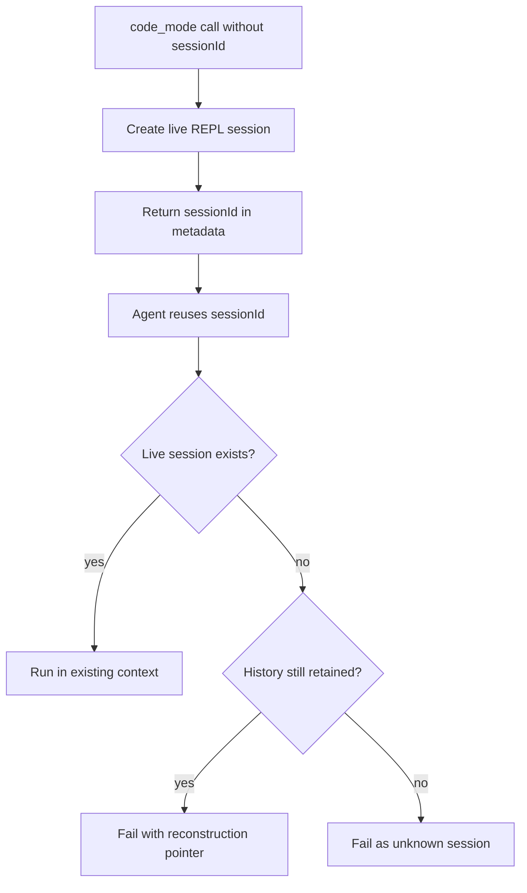

# Code Mode REPL Sessions Requirements

## Summary

Code Mode should support reusable in-memory REPL sessions so agents can define helper functions and workflow code once, then call them again while the live runtime remains available. V1 includes a redacted expiring call journal because expired-session reconstruction and auditability are launch requirements, not a separate later feature.

---

## Problem Frame

Agents repeat the same Code Mode setup code when they perform the same task over time. Current Code Mode is optimized for a compact one-shot TypeScript workflow, but that forces repeated helper definitions, discovery routines, and result-shaping code across adjacent calls.

Persisting a live JavaScript heap across agent restarts is not worth the complexity for V1. The useful middle ground is live-process REPL reuse plus enough stored call history to recover context when the live session disappears.

The product bet should be validated with `pi-eval`: add or identify a repeated-workflow scenario where helper definitions or result-shaping code would otherwise be rewritten across adjacent Code Mode calls, then compare the session-enabled path against the current one-shot path.

---

## Key Decisions

- **Session reuse lives on the existing Code Mode tool.** Agents pass an optional `sessionId` to reuse a REPL context instead of switching to a separate reset or session-management tool.
- **Omitting `sessionId` creates a fresh reusable session.** The tool result includes the generated session ID in metadata so the agent can reuse it in later calls.
- **Unknown sessions fail before execution.** If an agent supplies a session ID that Caplets cannot find, Caplets does not run the code in an empty context.
- **Expired sessions can still explain themselves.** If the live REPL is gone but its journal remains, the failure points the agent to reconstruction history instead of returning a generic missing-session error.
- **Session IDs do not bypass authorization.** Reusing a session or reading its journal must stay inside the originating Code Mode security scope.
- **Live reuse has a concrete expectation.** Sessions are process-local, but adjacent calls in the same healthy runtime should normally reuse state unless an idle TTL, compatibility change, lifecycle event, or explicit resource pressure evicts the context.
- **Journal entries support safe reconstruction.** Recovery history distinguishes setup-like code from side-effecting calls so agents do not blindly replay everything.
- **Durable heap persistence is out of scope.** Caplets stores reconstruction breadcrumbs, not QuickJS heap snapshots, closures, promises, timers, or live host handles.

---

## Actors

- A1. **Agent.** Writes Code Mode scripts, stores returned session IDs in conversation context, and reuses sessions for repeated workflows.
- A2. **Caplets runtime.** Owns live REPL contexts, validates session IDs, records session call history, and enforces cleanup.
- A3. **User or reviewer.** Uses the stored journal to understand what an agent ran and why a later reconstruction may be needed.

---

## Requirements

**Session behavior**

- R1. A Code Mode call without `sessionId` creates a new isolated REPL session and returns the generated session ID in result metadata.
- R2. A Code Mode call with a known live `sessionId` executes in that session's existing JavaScript context.
- R3. A Code Mode call with an unknown `sessionId` fails before user code execution.
- R4. A Code Mode call for a no-longer-live session with retained history fails before execution and returns a reconstruction pointer.
- R5. Starting fresh requires omitting `sessionId` and using the new session ID returned in metadata.

**State and isolation**

- R6. REPL state is scoped to the Code Mode session ID and must not leak across unrelated sessions.
- R7. Session reuse is authorized against the same Code Mode security principal as the session creator. If possession of the session ID is the chosen access model, IDs are high-entropy, non-public capabilities.
- R8. Sessions are process-local and best-effort, but a healthy live runtime should keep a session available across adjacent calls until an idle TTL, lifecycle event, compatibility change, or explicit resource pressure evicts it.
- R9. Caplets must not persist live JavaScript heap state, active timers, pending promises, or host bridge handles across process restarts.
- R10. A session must not silently continue after a capability declaration or runtime compatibility change that would make prior bindings misleading.

**History and auditability**

- R11. Caplets records each session call in a persisted, expiring journal.
- R12. Journal entries include enough information for reconstruction: timestamp, submitted code, session ID, declaration hash, outcome, diagnostics summary, log reference when available, and a setup-versus-side-effect annotation or recovery summary.
- R13. Journal entries redact common secrets and sensitive identifiers before writing to disk.
- R14. Journal storage caps entry size and retained entry count so auditability cannot become unbounded local storage.
- R15. Session journals are readable only by actors authorized for the originating session scope; redaction does not make journals public, safe for unrelated telemetry, or appropriate for broad debug access.
- R16. A retained journal can be read through a debug or recovery surface without exposing unrelated sessions.
- R17. Recovery output distinguishes reconstruction-safe setup from side-effecting calls so agents can rebuild helpers without treating the journal as an automatic replay script.

**Agent ergonomics**

- R18. Tool descriptions and docs teach agents to capture `meta.sessionId` and pass it on later calls when they intend to reuse definitions.
- R19. Errors for expired sessions should tell the agent whether reconstruction history exists and how to retrieve it.
- R20. The default path remains simple for one-shot Code Mode use: agents can ignore `sessionId` when reuse is not useful.
- R21. If an agent loses the returned session ID while the live context still exists, Caplets provides a scoped recent-session lookup or durable conversation/run binding that can recover eligible active sessions without exposing unrelated sessions.

**Validation**

- R22. `pi-eval` validates the feature with a repeated-workflow task that compares the current one-shot Code Mode path against session-enabled reuse using task success, provider request count, tool-call count, token/request overhead, and repeated setup-code volume.

---

## Key Flows

- F1. Fresh reusable session
  - **Trigger:** The agent wants to define helpers for a repeated Code Mode workflow.
  - **Actors:** A1, A2
  - **Steps:** The agent calls Code Mode without `sessionId`; Caplets creates an isolated REPL context, runs the code, records the call, and returns `meta.sessionId`.
  - **Covered by:** R1, R5, R11, R18

- F2. Reuse live session
  - **Trigger:** The agent has a prior `sessionId` and wants to reuse helper definitions or cached local variables.
  - **Actors:** A1, A2
  - **Steps:** The agent calls Code Mode with `sessionId`; Caplets validates the live session, executes in the existing context, records the call, and returns normal run metadata.
  - **Covered by:** R2, R6, R7, R8, R11

- F3. Expired session reconstruction
  - **Trigger:** The agent resumes with a `sessionId` whose live context has been cleaned up.
  - **Actors:** A1, A2, A3
  - **Steps:** Caplets refuses to execute in a fresh empty context, returns an expired-session failure with a reconstruction pointer, and the agent reads the journal to reconstruct useful helper code.
  - **Covered by:** R4, R12, R15, R16, R17, R19

- F4. Unknown session failure
  - **Trigger:** The agent supplies a session ID that Caplets has neither live state nor retained journal for.
  - **Actors:** A1, A2
  - **Steps:** Caplets fails before execution and reports that the session is unknown.
  - **Covered by:** R3

- F5. Lost session ID recovery
  - **Trigger:** The agent loses the returned `sessionId`, but the live runtime may still have the session.
  - **Actors:** A1, A2
  - **Steps:** The agent uses a scoped lookup or conversation/run binding; Caplets authorizes the lookup against the same session scope and returns only eligible active session candidates.
  - **Covered by:** R7, R21

---

## Acceptance Examples

- AE1. **Covers R1, R2, R8, R18.** Given an agent calls Code Mode without `sessionId`, when the run succeeds, then the result metadata includes a session ID the agent can pass to a later adjacent Code Mode call that reuses the same helper definitions while the live runtime remains healthy.
- AE2. **Covers R3.** Given an agent submits code that depends on previous variables with an unknown `sessionId`, when Caplets handles the request, then no user code runs and the result tells the agent the session is not available.
- AE3. **Covers R4, R12, R16, R19.** Given the live REPL has been evicted but the journal has not expired, when the agent calls Code Mode with that session ID, then Caplets returns an expired-session failure with a reconstruction pointer.
- AE4. **Covers R9.** Given the Caplets process restarts, when the agent tries to reuse a previous session, then Caplets does not attempt to restore closures or active heap objects.
- AE5. **Covers R13, R14.** Given submitted code or logs include obvious tokens or credentials, when Caplets stores session history, then the persisted journal redacts those values and enforces storage caps.
- AE6. **Covers R7, R15.** Given another actor lacks authorization for the originating session scope, when it tries to reuse the session or read the journal, then Caplets rejects the request.
- AE7. **Covers R12, R17.** Given a journal contains helper definitions and calls with external side effects, when the recovery surface renders it, then setup-like code is distinguishable from side-effecting calls.
- AE8. **Covers R21.** Given an agent loses `meta.sessionId` while the runtime still has active sessions, when it uses the scoped recovery mechanism, then Caplets returns only eligible sessions for the same authorized conversation or run scope.
- AE9. **Covers R22.** Given `pi-eval` runs a repeated-workflow task before and after session reuse ships, when results are compared, then the report shows whether session reuse improves repeated setup-code volume, tool calls, request overhead, and task success.

---

## Product Validation

- Use `pi-eval` as the primary validation path rather than relying on anecdotes.
- Add or select a task where the agent benefits from defining helper functions, discovery routines, or result-shaping code once and reusing them across adjacent Code Mode calls.
- Compare the current one-shot Code Mode behavior with session-enabled reuse using task success, provider request count, tool-call count, token/request overhead, repeated setup-code volume, and elapsed time when stable enough to interpret.
- Treat live eval output as directional evidence because Pi eval runs are local, model-dependent, and date-dependent.

---

## Success Criteria

- Agents can reuse helper functions and workflow state across multiple Code Mode calls in the same live runtime.
- Adjacent calls in a healthy runtime normally reuse live state; eviction is an explicit recovery path, not the default experience.
- Session loss is understandable: expired sessions point to reconstruction history when available.
- Existing one-shot Code Mode workflows continue to work without session-specific setup.
- The audit journal gives useful visibility without storing unbounded or obviously sensitive raw data, and without exposing journals across unrelated session scopes.
- `pi-eval` can demonstrate whether repeated-workflow tasks become cheaper or more reliable with session reuse.

---

## Scope Boundaries

- Durable QuickJS heap snapshots are not in scope.
- Saved named workflows are not in scope.
- A separate reset tool is not in scope; agents start fresh by omitting `sessionId`.
- Cross-process or cross-device REPL continuity is not in scope.
- Replaying journal entries automatically is not in scope for V1 because prior calls may include side effects; recovery output only helps agents decide what is safe to reconstruct manually.

---

## Dependencies / Assumptions

- Current Code Mode can continue using QuickJS as the live execution engine.
- The existing log redaction approach can be adapted or shared for session journals.
- Agents usually have enough conversation context to store and reuse returned session IDs, but this is not the only recovery path.
- Eviction policy details can be settled during planning as long as session loss has explicit recovery behavior.
- Existing `pi-eval` infrastructure can be extended with a repeated-workflow task if no current task already stresses setup reuse.

---

## Sources / Research

- `AGENTS.md` for repo commands, package ownership, and generated Code Mode API constraints.
- `docs/product/caplets-code-mode-prd.md` for the current Code Mode product contract.
- `apps/docs/src/content/docs/code-mode.mdx` for user-facing Code Mode guidance.
- `docs/plans/2026-06-17-code-mode-platform-api-compat.md` for the adjacent platform-runtime expansion.
- `packages/core/src/code-mode/runner.ts` and `packages/core/src/code-mode/sandbox.ts` for the current one-shot runtime shape.
- `packages/core/src/code-mode/tool.ts`, `packages/core/src/serve/session.ts`, `packages/core/src/native/service.ts`, and `packages/core/src/native/remote.ts` for the current public Code Mode input surfaces.
- `packages/core/src/code-mode/logs.ts` for the existing TTL-backed redacted log-store pattern.
- `packages/benchmarks/lib/pi-eval/config.ts`, `packages/benchmarks/lib/pi-eval/suites.ts`, `packages/benchmarks/lib/pi-eval/metrics.ts`, and `docs/benchmarks/coding-agent.md` for the live Pi eval validation path.
