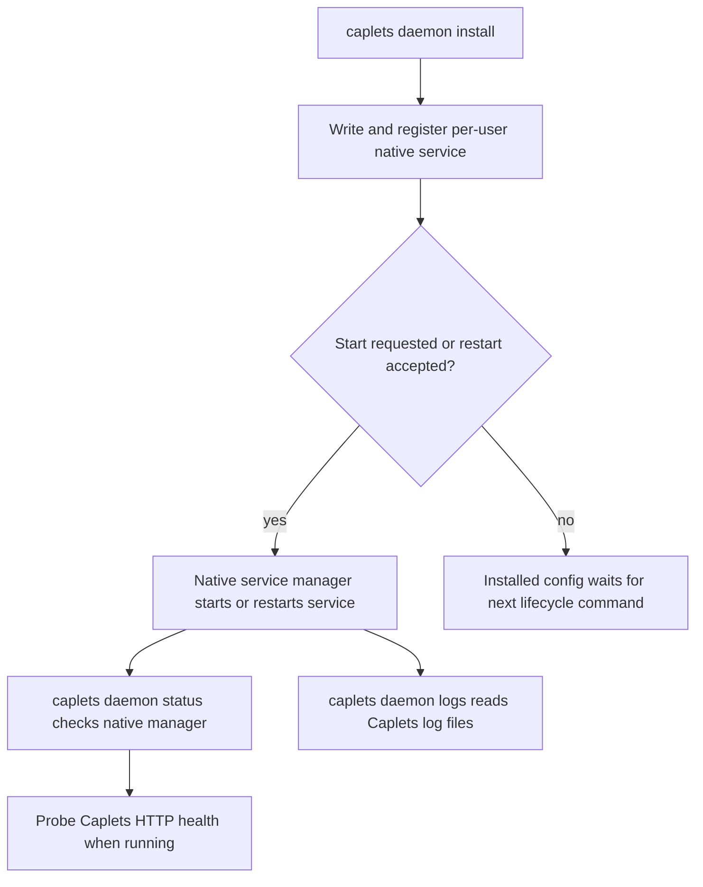

# Caplets Daemon Service Requirements

## Summary

Caplets should expose a top-level `caplets daemon` command for managing a per-user native service that runs local HTTP `caplets serve`. Daemon lifecycle moves out of `caplets serve` entirely and uses the operating system service manager for install, runtime control, status, and logs.

---

## Problem Frame

Users need a local Caplets HTTP service that survives terminal exits and login restarts without hand-written launchd, systemd, or Scheduled Task setup. The command surface should describe the user's goal: managing a daemon, not invoking a nested variant of foreground `serve`.

Environment propagation is part of the product problem. Caplet configs and backend commands can depend on PATH entries, tokens, and toolchain variables that are available in an interactive shell but missing from GUI-launched or service-launched processes. The daemon command must give users an explicit way to inherit shell setup and a separate way to persist service-specific environment variables.

---

## Key Decisions

- **Daemon is a top-level CLI surface.** `caplets daemon ...` is the canonical service lifecycle command, and daemon subcommands are removed from `caplets serve`.
- **The service is per-user and native-manager-owned.** Caplets uses launchd UserAgents, `systemctl --user`, or per-user Windows Scheduled Tasks and does not fall back to detached process management.
- **The managed process is local HTTP serve only.** Stdio serving, remote-backed `attach`, project-bound services, and arbitrary Caplets commands are outside the first version.
- **Install owns persistent service configuration.** Runtime commands do not mutate installed serve flags, environment settings, or shell-inheritance settings.
- **Validation proves the service command can start.** Install validates by launching a temporary Caplets HTTP server with the generated command and probing health unless the user passes `--no-validate`.
- **Logs are Caplets-managed files.** The service writes stdout and stderr under daemon state, and `caplets daemon logs` reads those files even if the service is later stopped or uninstalled.

---

## Actors

- A1. **User.** Installs, updates, starts, stops, inspects, and uninstalls the local Caplets daemon.
- A2. **Caplets CLI.** Resolves daemon configuration, validates startup, renders service descriptors, invokes native service managers, and reports status.
- A3. **Native service manager.** Owns service registration and runtime state through launchd, systemd user services, or Windows Scheduled Tasks.
- A4. **Caplets HTTP daemon.** Runs local HTTP `caplets serve` with the installed configuration and writes stdout/stderr logs.

---

## Requirements

**Command surface**

- R1. `caplets daemon` provides `install`, `uninstall`, `start`, `restart`, `stop`, `status`, and `logs` subcommands.
- R2. `caplets serve` does not expose daemon lifecycle subcommands.
- R3. `enable` and `disable` are not aliases for `install` and `uninstall`.
- R4. Every `caplets daemon` subcommand supports `--json` with structured action and state details.
- R5. Daemon commands manage only local HTTP `caplets serve`; stdio, `attach`, and arbitrary commands are rejected or absent from the daemon surface.
- R6. Daemon commands manage per-user services only; unsupported platforms fail with actionable messaging.

**Install and configuration**

- R7. `caplets daemon install` writes and registers the per-user native service descriptor for the default daemon instance.
- R8. Installed service identity and artifacts use `daemon/default` naming, such as `dev.caplets.daemon.default` and `caplets-daemon-default.service`.
- R9. Existing `serve/default` daemon artifacts are ignored by `caplets daemon` commands.
- R10. The installed service uses the user's home directory as its working directory.
- R11. `install` accepts the persistent HTTP serve configuration flags from `caplets serve`, including `--host`, `--port`, `--path`, `--user`, `--password`, `--allow-unauthenticated-http`, and `--trust-proxy`; `--transport` is not accepted because the daemon is always HTTP.
- R12. On an existing installation, omitted install flags preserve current persisted values.
- R13. `install --reset` rebuilds persisted service configuration from defaults plus the flags supplied in that command.
- R14. `install --dry-run` previews descriptor content and native-manager actions without writing files, registering the service, purging state, or starting validation.
- R15. `install --no-validate` skips startup validation for advanced cases.
- R16. `install --start`, `install --restart`, and `install --no-restart` are mutually exclusive.
- R17. If `install` updates a running service, Caplets updates the installed config first and then asks whether to restart in interactive mode.
- R18. If `install` updates a running service in non-interactive mode, Caplets fails unless `--start`, `--restart`, or `--no-restart` resolves the restart decision.
- R19. `install --start` starts the service when stopped and restarts it when already running so the installed config becomes active.
- R20. `install --restart` restarts the service after updating the installed config.
- R21. `install --no-restart` updates installed config and leaves the running process unchanged.

**Environment model**

- R22. `--inherit-env` is opt-in on `install` and runs the daemon through a user shell wrapper rather than storing an environment snapshot.
- R23. On macOS and Linux, shell inheritance falls back from `SHELL`, to the account shell when discoverable, to `/bin/sh`, and then to an actionable failure if no shell can be found.
- R24. On Windows, shell inheritance falls back from `SHELL`, to PowerShell, to `ComSpec` or `cmd.exe` as the last resort.
- R25. `--no-inherit-env` turns off shell inheritance on an existing installation.
- R26. Repeatable `--env KEY=VALUE` persists service-specific environment variables.
- R27. `--env` requires a strict environment variable name, requires `=`, allows an empty value, and preserves everything after the first `=`.
- R28. Explicit `--env` values override inherited shell environment values for the Caplets process.
- R29. On update, `--env` merges by key and preserves existing persisted environment values not mentioned in the command.
- R30. Repeatable `--unset-env KEY` removes persisted service environment keys.
- R31. When `--unset-env` and `--env` name the same key, unsets apply first and `--env` wins.

**Validation**

- R32. `install` validates by launching a temporary Caplets HTTP server with the generated service command, probing the Caplets health endpoint, and stopping the temporary server before registration.
- R33. When `--inherit-env` is enabled, validation uses the same shell-wrapper path as the installed service.
- R34. If an already-running daemon occupies the requested address, validation uses a temporary free loopback port while preserving the generated command, environment model, and config path as closely as possible.

**Runtime lifecycle**

- R35. `start`, `restart`, and `stop` require an installed native service and fail with the relevant `caplets daemon install` guidance when the service is not installed.
- R36. Runtime lifecycle commands operate through the native service manager.
- R37. `start` succeeds if the installed service is already running.
- R38. `restart` starts the installed service if it is stopped.
- R39. `stop` succeeds if the installed service is already stopped.
- R40. `uninstall` stops a running service through the native manager before unregistering and removing service artifacts.
- R41. `uninstall` preserves logs and historical state by default.
- R42. `uninstall --purge` removes service artifacts, daemon state, daemon logs, and daemon config.
- R43. `uninstall --dry-run` previews unregister and removal actions without changing service, state, log, or config files.
- R44. `uninstall --dry-run --purge` lists every service, config, state, and log path that would be removed.

**Status and logs**

- R45. `status` uses the native service manager as the source of truth for installed and running state.
- R46. When the native manager reports the service running, `status` probes the Caplets HTTP health endpoint and reports health separately from manager state.
- R47. `status` reports Caplets-managed stdout and stderr log paths.
- R48. The service writes stdout and stderr to Caplets-managed log files under daemon state.
- R49. `logs` reads existing log files and does not require the service to be installed.
- R50. `logs` defaults to the last 10 lines and supports `--tail <lines>`, `--follow`, and `--stream stdout|stderr|all`.
- R51. `logs --tail 0 --follow` shows only new log lines.
- R52. `logs` shows stdout and stderr together by default and can show either stream alone.
- R53. If selected log files do not exist, `logs` prints a clear empty-state message with the expected log paths.

---

## Key Flows

- F1. Install a new daemon
  - **Trigger:** The user wants Caplets to run as a user service.
  - **Actors:** A1, A2, A3, A4
  - **Steps:** The user runs `caplets daemon install`; Caplets resolves service config, validates temporary startup unless bypassed, writes service artifacts, and registers the native service.
  - **Covered by:** R7, R10, R11, R14, R15, R32

- F2. Update a running daemon
  - **Trigger:** The user changes persisted service config while the daemon is running.
  - **Actors:** A1, A2, A3, A4
  - **Steps:** Caplets updates installed config, then restarts only when the user confirms interactively or passes an explicit restart/start flag; non-interactive runs must resolve the restart decision with a flag.
  - **Covered by:** R12, R16, R17, R18, R19, R20, R21

- F3. Install with shell-inherited environment
  - **Trigger:** The daemon needs PATH or variables normally initialized by the user's shell.
  - **Actors:** A1, A2, A3, A4
  - **Steps:** The user runs `install --inherit-env`; Caplets resolves the platform shell fallback, validates through the same wrapper, and registers the wrapped service command.
  - **Covered by:** R22, R23, R24, R32, R33

- F4. Control installed service
  - **Trigger:** The user wants to start, restart, or stop an installed daemon.
  - **Actors:** A1, A2, A3
  - **Steps:** Caplets verifies installation, delegates lifecycle to the native service manager, and treats already-running or already-stopped states as successful when the command intent is already satisfied.
  - **Covered by:** R35, R36, R37, R38, R39

- F5. Inspect status and logs
  - **Trigger:** The user needs to know whether the daemon is running or why it failed.
  - **Actors:** A1, A2, A3, A4
  - **Steps:** `status` reads native-manager state and health; `logs` tails Caplets-managed stdout/stderr files with tail-like flags.
  - **Covered by:** R45, R46, R47, R48, R49, R50, R51, R52, R53

- F6. Uninstall or purge
  - **Trigger:** The user wants to remove the native service registration.
  - **Actors:** A1, A2, A3
  - **Steps:** Caplets stops the service if needed, unregisters it, removes service artifacts, and preserves logs/state unless `--purge` is present.
  - **Covered by:** R40, R41, R42, R43, R44

---

## Acceptance Examples

- AE1. **Covers R1, R2, R3.** Given the CLI is installed, when the user asks for `caplets daemon --help`, then daemon lifecycle commands are listed; when the user asks for `caplets serve --help`, then daemon lifecycle commands are absent.
- AE2. **Covers R11, R14, R22, R26.** Given no daemon is installed, when the user runs `caplets daemon install --dry-run --host 127.0.0.1 --port 5388 --path /caplets --inherit-env --env FOO=bar`, then Caplets prints the generated service plan without writing or registering anything.
- AE3. **Covers R5, R11.** Given no daemon is installed, when the user runs `caplets daemon install --transport http`, then Caplets rejects the command without installing or updating service artifacts.
- AE4. **Covers R17, R18, R19, R20, R21.** Given a running installed daemon, when `install` changes config, then interactive runs ask about restart, non-interactive runs require a restart decision flag, and `--start` or `--restart` makes the new config active immediately.
- AE5. **Covers R22, R23, R24, R28, R33.** Given `--inherit-env` and `--env PATH=/custom/bin`, when validation runs, then it uses the service shell wrapper and the explicit PATH value wins for the Caplets process.
- AE6. **Covers R32, R34.** Given the current daemon already uses the configured port, when install validates an update, then validation uses a temporary loopback port instead of failing only because the live daemon owns the target port.
- AE7. **Covers R35, R36, R37, R38, R39.** Given no service is installed, runtime lifecycle commands fail with install guidance; given a service is installed, `start`, `restart`, and `stop` are idempotent around already-running or already-stopped state.
- AE8. **Covers R41, R42, R49, R53.** Given the daemon has been uninstalled without purge, when the user runs `caplets daemon logs`, then Caplets reads preserved logs or prints the expected log paths if no logs exist.
- AE9. **Covers R42, R43, R44.** Given the user runs `caplets daemon uninstall --dry-run --purge`, then Caplets lists all unregister and removal actions without stopping, unregistering, or deleting anything.

---

## Success Criteria

- Users can discover the daemon lifecycle from `caplets daemon --help` without seeing daemon behavior under `caplets serve`.
- Users can configure the managed HTTP service from `caplets daemon install` with the same HTTP configuration flags they would use for foreground `caplets serve --transport http`, without exposing a daemon `--transport` option.
- A first install on macOS, Linux with systemd user services, and Windows registers a per-user service through the native manager.
- `install --inherit-env` catches shell-wrapper startup failures during validation before service registration.
- `status --json` distinguishes installed state, native running state, Caplets HTTP health, and log paths.
- `logs --tail 0 --follow` behaves like tailing new output from the managed daemon logs.

---

## Scope Boundaries

- Daemonizing stdio transport is out of scope.
- Daemonizing `caplets attach` is out of scope.
- Project-bound daemon instances are out of scope.
- System-wide or privileged service installation is out of scope.
- Detached process fallback is out of scope.
- Migrating or cleaning old `serve/default` daemon artifacts is out of scope.
- New secret storage, redaction, or auth mechanisms are out of scope for this feature.

---

## Dependencies / Assumptions

- The local HTTP server has a health endpoint suitable for install validation and status checks.
- Supported platforms have a usable per-user native service manager available to the current user.
- Shell inheritance on Windows cannot promise Unix login-shell parity; PowerShell and `cmd.exe` fallbacks are compatibility paths, not exact behavioral matches.
- Service logs are file-backed so Caplets can read them independently of native-manager-specific log tools.

---

## Sources / Research

- `STRATEGY.md` for the product emphasis on runtime diagnosability and reliable local/remote/native setup.
- `docs/product/caplets-code-mode-prd.md` for current CLI surface descriptions around `serve`, `attach`, and `doctor`.
- `docs/architecture.md` for local MCP serving, HTTP serving, and health/control surface context.
- `packages/core/src/cli/commands.ts` for the current absence of a top-level `daemon` command and current `serve` daemon subcommands.
- `packages/core/src/cli.ts` for the current `serve start|stop|status|restart|enable|disable` wiring.
- `packages/core/src/serve/daemon/` for the existing daemon config, path, process, and platform descriptor foundation.
- `packages/core/test/serve-daemon.test.ts` for current daemon behavior and the tests that will need to move from `serve` to `daemon`.
