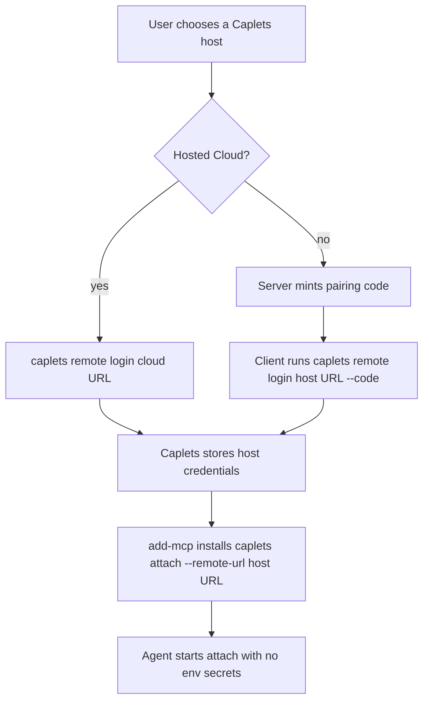

# Unified Remote Attach Auth Requirements

## Summary

Caplets should use one remote login model for both Caplets Cloud and self-hosted Caplets. Users trust a Caplets host once, then MCP clients and native integrations launch `caplets attach --remote-url ...` without Basic Auth, env-secret plumbing, or Cloud-specific login commands.

---

## Problem Frame

Remote attach currently splits by provider. Hosted Cloud uses `caplets cloud auth login` and saved Cloud Auth credentials, while self-hosted remotes use `CAPLETS_REMOTE_TOKEN` or Basic Auth through flags and environment variables.

That split leaks into the first-run experience. MCP clients need launch commands, agent configs become a place where secrets can drift, and each provider adds its own setup wording. The problem is not only Codex env inheritance; any agent that starts a subprocess can become another place to debug PATH, env, token, and credential persistence.

Caplets should own remote trust. Agent wiring should be reduced to installing the right attach command into the agent, while Caplets stores and refreshes the credentials needed to connect to the selected host.

---

## Key Decisions

- **Remote login is the provider-neutral user model.** `caplets remote login <url>` replaces Cloud-specific login wording and self-hosted env-token setup in the primary docs.
- **Pairing codes are not reusable credentials.** Self-hosted pairing produces a short-lived code that is exchanged for stored client credentials.
- **Agent configs do not carry secrets.** `add-mcp` installs `caplets attach --remote-url ...`; Caplets resolves credentials from its own store at runtime.
- **Basic Auth leaves the product path.** Self-hosted attach, MCP, and control routes should use issued client credentials rather than username/password auth.
- **Backend OAuth stays separate.** `caplets auth login <caplet-id>` continues to mean authentication for a configured backend Caplet, not authentication to a Caplets host.
- **Cloud becomes one host kind under remote login.** Existing Cloud browser/device auth can remain internally, but the user-facing command moves under the unified remote namespace.

---

## Actors

- A1. **Self-hosted server operator.** Runs the Caplets HTTP service, creates pairing codes, and revokes paired clients.
- A2. **Remote client user.** Logs a local machine into a Caplets host and configures agents to launch attach.
- A3. **Agent or MCP client.** Starts `caplets attach --remote-url ...` and receives the remote-backed Caplets surface.
- A4. **Caplets host.** Issues pairing codes, exchanges them for client credentials, validates attach requests, and records client identity.
- A5. **Caplets Cloud.** Implements the same remote login contract while preserving hosted workspace selection and refresh behavior.

---

## Requirements

**Unified remote login**

- R1. `caplets remote login <url>` authenticates this machine to a Caplets host, whether the host is self-hosted or Caplets Cloud.
- R2. `caplets remote status` shows saved remote credentials in redacted form, including host URL, host kind, selected workspace when applicable, client label, created time, and last-used time when available.
- R3. `caplets remote logout <url>` removes this machine's saved credentials for that host.
- R4. `caplets attach --remote-url <url>` resolves stored credentials for the normalized host URL without requiring `CAPLETS_REMOTE_TOKEN`, `CAPLETS_REMOTE_USER`, or `CAPLETS_REMOTE_PASSWORD`.
- R5. Attach mode inference remains URL-driven: Cloud URLs use the hosted Cloud path, and non-Cloud URLs use the self-hosted path.

**Self-hosted pairing**

- R6. A self-hosted server operator can mint a short-lived one-time pairing code from the server environment.
- R7. Pairing codes are scoped to one host, expire within minutes by default, are rate-limited, and are stored server-side only as non-reusable verification material.
- R8. A client can exchange a valid pairing code through `caplets remote login <url> --code <code>`.
- R9. Successful self-hosted login issues client credentials that are stored by Caplets on the client and can be revoked independently on the server.
- R10. Pairing code exchange never turns the copied code into the long-lived bearer credential.

**Credential lifecycle**

- R11. Remote credentials are keyed by normalized host URL and, for hosted Cloud, selected workspace.
- R12. Access credentials used for attach are audience-restricted to their issuing Caplets host.
- R13. Long-lived refresh material is rotated or otherwise constrained so stealing one stale token is not enough for indefinite access.
- R14. Credential storage is owned by Caplets and must use restrictive local permissions, with OS credential storage preferred when available.
- R15. CLI output, diagnostics, JSON errors, and logs redact remote access and refresh credentials.
- R16. The server can list and revoke paired clients by stable client identity, label, created time, and last-used time.

**Cloud migration**

- R17. `caplets cloud auth login` is deprecated in favor of `caplets remote login <cloud-url>`.
- R18. Existing Cloud credentials continue to work during migration or are migrated automatically into the unified remote credential store.
- R19. Cloud workspace selection is represented as part of the remote login profile, not as a separate auth model.
- R20. Recovery messages that currently say `caplets cloud auth login` point users to the unified remote login command.

**Agent setup and docs**

- R21. First-run docs use `add-mcp` for generic MCP wiring instead of making `caplets setup` the primary path.
- R22. Local MCP docs install `caplets serve` through `add-mcp`.
- R23. Remote MCP docs install `caplets attach --remote-url <url>` through `add-mcp` after the user has completed `caplets remote login <url>`.
- R24. Remote MCP docs do not recommend `add-mcp --env` for Caplets remote credentials.
- R25. Native OpenCode and Pi docs use their native extension setup paths and the same remote login model.
- R26. `caplets setup` is deprecated, removed, or reduced to a transitional router that points users at `add-mcp` and native extension docs.

**Basic Auth removal**

- R27. Self-hosted Basic Auth is removed from the primary self-hosted attach, MCP, and control model.
- R28. If Basic Auth compatibility remains for one release, it is hidden from first-run docs, warns on use, and has a documented removal path.
- R29. New tests and docs must not describe Basic Auth as a supported self-hosted setup path.

---

## Key Flows

- F1. Self-hosted host pairing
  - **Trigger:** A server operator wants to let a local machine attach to a self-hosted Caplets service.
  - **Actors:** A1, A2, A4
  - **Steps:** The operator starts the HTTP service, mints a pairing code on the server, copies the suggested login command to the client, and the client exchanges the code for stored credentials.
  - **Covered by:** R6, R7, R8, R9, R10

- F2. Cloud host login
  - **Trigger:** A user wants to attach local agents to Caplets Cloud.
  - **Actors:** A2, A5
  - **Steps:** The user runs remote login against the Cloud URL, completes the existing hosted auth flow, selects or confirms the workspace, and Caplets stores the remote profile.
  - **Covered by:** R1, R11, R17, R18, R19

- F3. Agent wiring after remote login
  - **Trigger:** The user wants an MCP client to use a remote-backed Caplets surface.
  - **Actors:** A2, A3
  - **Steps:** The user runs `add-mcp` with the `caplets attach --remote-url ...` command, the agent starts that command later, and Caplets resolves stored credentials before connecting to the host.
  - **Covered by:** R4, R21, R23, R24

- F4. Client revocation
  - **Trigger:** A device is lost, replaced, or no longer trusted.
  - **Actors:** A1, A2, A4
  - **Steps:** The operator lists paired clients, identifies the client by label and metadata, revokes it, and future attach attempts from that client fail until it logs in again.
  - **Covered by:** R3, R9, R16

- F5. Legacy Cloud migration
  - **Trigger:** A user has existing saved Cloud Auth credentials.
  - **Actors:** A2, A5
  - **Steps:** The user runs a command that needs remote credentials, Caplets reads or migrates the existing credential, and recovery messages teach the new `remote login` command.
  - **Covered by:** R17, R18, R20

---

## Acceptance Examples

- AE1. **Covers R1, R17, R19.** Given a user runs `caplets remote login https://cloud.caplets.dev`, when the hosted auth flow completes, then Caplets stores a Cloud remote profile with the selected workspace.
- AE2. **Covers R6, R7, R8, R10.** Given a server operator creates a pairing code and a client exchanges it, when the client later attaches, then it uses issued client credentials rather than the original copied code.
- AE3. **Covers R4, R23, R24.** Given a user has completed remote login, when they install `caplets attach --remote-url <url>` through `add-mcp`, then the agent config contains no remote token, password, or Caplets credential env vars.
- AE4. **Covers R12, R13, R15.** Given a remote credential is stored locally, when attach refreshes or reports diagnostics, then credentials remain host-scoped and redacted from output.
- AE5. **Covers R16.** Given a self-hosted operator lists paired clients, when they revoke one client, then that client's next attach attempt fails until it logs in again.
- AE6. **Covers R18, R20.** Given a user still has legacy Cloud Auth state, when attach requires credentials, then Caplets either migrates the state or reports a recovery command using `caplets remote login`.
- AE7. **Covers R21, R22, R23, R25.** Given a first-time user reads install docs, when they choose MCP or native setup, then the docs send them through `add-mcp` for MCP and native extension setup for OpenCode or Pi.
- AE8. **Covers R27, R28, R29.** Given a user follows current docs, when they self-host and attach, then they never configure Basic Auth.

---

## Success Criteria

- A first-time MCP user can install Caplets into an agent config without writing a remote secret into that config.
- Cloud and self-hosted docs use the same remote-login vocabulary.
- `caplets attach --once --remote-url <url> --json` gives credential recovery guidance that points to `caplets remote login`, not provider-specific or env-secret instructions.
- Self-hosted revocation can identify and remove one paired client without rotating every client credential.
- The install docs no longer require users to understand `CAPLETS_REMOTE_TOKEN`, `CAPLETS_REMOTE_USER`, or `CAPLETS_REMOTE_PASSWORD` for the normal path.

---

## Scope Boundaries

**Deferred for later**

- Hardware-backed or sender-constrained credentials beyond the best available software credential model.
- Multi-user role and permission administration for self-hosted teams beyond client listing and revocation.
- Automatic migration of every possible third-party MCP config that may already contain Caplets env secrets.

**Outside this product's identity**

- Using agent MCP configs as the source of truth for Caplets secrets.
- Treating Basic Auth as the long-term self-hosted authentication model.
- Replacing backend Caplet OAuth with remote host login.

---

## Dependencies / Assumptions

- `add-mcp` remains the recommended third-party MCP config writer for broad provider coverage.
- Caplets can persist remote credentials in a local store with restrictive permissions and can later improve the backing store without changing the command model.
- Self-hosted pairing commands are run by someone with shell access to the server or equivalent administrative authority.
- Caplets Cloud can expose the existing hosted login behavior through the unified remote command namespace.

---

## Sources / Research

- `README.md` for the current quick-start, `caplets setup`, `caplets serve`, and `caplets attach` public contract.
- `packages/core/src/cli.ts` for current `attach`, `cloud auth`, and setup command surfaces.
- `packages/core/src/remote/options.ts` and `packages/core/src/remote/selection.ts` for current self-hosted and hosted remote credential resolution.
- `apps/docs/src/content/docs/remote-attach.mdx`, `docs/project-binding.md`, and `docs/product/caplets-code-mode-prd.md` for current remote attach documentation.
- `add-mcp@1.10.4` CLI help and package source for supported agents and `--env` handling.
- [RFC 8628 OAuth 2.0 Device Authorization Grant](https://www.rfc-editor.org/rfc/rfc8628.html) for the short-code device authorization pattern.
- [RFC 9700 OAuth 2.0 Security Best Current Practice](https://www.rfc-editor.org/rfc/rfc9700.html) for token lifecycle and refresh-token risk framing.
- [OWASP OAuth2 Cheat Sheet](https://cheatsheetseries.owasp.org/cheatsheets/OAuth2_Cheat_Sheet.html) for OAuth security guidance.
