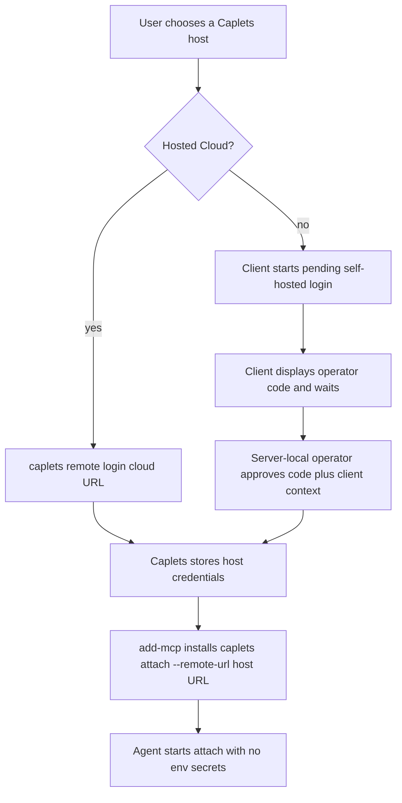

# Unified Remote Attach Auth Requirements

## Summary

Caplets should use one remote login model for both Caplets Cloud and self-hosted Caplets. Users trust a Caplets host once, then MCP clients and native integrations launch `caplets attach --remote-url ...` without Basic Auth, env-secret plumbing, copied bearer tokens, or Cloud-specific login commands.

The current codebase already contains much of the Remote Profile shape: `remote login/status/logout`, attach-time credential resolution, hosted Cloud login under Remote Profiles, and a self-hosted pairing exchange. The remaining product work is to replace the old operator-minted Pairing Code bootstrap with a client-started, server-approved pending login flow; harden that flow's refresh/security semantics; clarify migration/recovery behavior; and keep setup docs from reintroducing remote secrets.

---

## Problem Frame

Remote attach historically split by provider. Hosted Cloud used `caplets cloud auth login` and saved Cloud Auth credentials, while self-hosted remotes used `CAPLETS_REMOTE_TOKEN`, Basic Auth flags/env, or an operator-minted Pairing Code flow. The current branch has already moved several of these surfaces toward unified Remote Profiles, but the self-hosted bootstrap shape still needs to become a durable product flow rather than a short-lived code handoff.

That split leaks into the first-run experience. MCP clients need launch commands, agent configs can become a place where secrets drift, and each provider adds its own setup wording. The problem is not only Codex env inheritance; any agent that starts a subprocess can become another place to debug PATH, env, token, and credential persistence.

Caplets should own remote trust. Agent wiring should install the right attach command into the agent, while Caplets stores, refreshes, and recovers the credentials needed to connect to the selected host.

---

## Key Decisions

- **Remote login is the provider-neutral user model.** `caplets remote login <url>` replaces Cloud-specific login wording and self-hosted env-token setup in the primary docs.
- **Self-hosted login is client-started and server-approved.** The client starts a pending device-style flow, displays a short operator code, waits for approval, and receives stored client credentials only after server-local approval.
- **Self-hosted v1 assumes server-local administrative authority.** Web/admin approval is deferred; the supported v1 self-hosted path requires shell access or equivalent local operator authority on the host, and user-facing errors/docs should say so.
- **Pending login refresh is flow state, not a reusable credential.** The client can refresh a pending login within a longer refresh window, but refresh material is bound to the initiating flow/client, rotates, and cannot become attach bearer material.
- **Remote trust requires host identity, not just URL strings.** URL-shaped commands remain the user interface, but credentials are audience-bound to the issuing host identity and must handle aliases, redirects, and workspace disambiguation deliberately.
- **Agent configs do not carry secrets.** `add-mcp` installs `caplets attach --remote-url ...`; Caplets resolves credentials from its own store at runtime.
- **Basic Auth leaves the product path.** Self-hosted attach, MCP, and control routes should use issued client credentials or server-local operator authority rather than username/password auth.
- **Backend OAuth stays separate.** `caplets auth login <caplet-id>` continues to mean authentication for a configured backend Caplet, not authentication to a Caplets host.
- **Cloud becomes one host kind under remote login.** Existing Cloud browser/device auth can remain internally, but the user-facing command and credential lifecycle move under the unified remote namespace.

---

## Actors

- A1. **Self-hosted server operator.** Runs the Caplets HTTP service, approves pending login codes from the server environment or equivalent local administrative authority, and revokes paired clients.
- A2. **Remote client user.** Logs a local machine into a Caplets host and configures agents to launch attach.
- A3. **Agent or MCP client.** Starts `caplets attach --remote-url ...` and receives the remote-backed Caplets surface.
- A4. **Caplets host.** Starts pending login flows, rotates pre-login refresh material, records server-local approvals, issues client credentials, validates attach requests, enforces administrative boundaries, and records client identity.
- A5. **Caplets Cloud.** Implements the same remote login contract while preserving hosted workspace selection and refresh behavior.

---

## Requirements

**Unified remote login and host identity**

- R1. `caplets remote login <url>` authenticates this machine to a Caplets host, whether the host is self-hosted or Caplets Cloud.
- R2. `caplets remote status` shows saved remote credentials in redacted form, including host URL, canonical host identity when available, host kind, selected workspace when applicable, client label, created time, and last-used time when available.
- R3. `caplets remote logout <url>` removes this machine's saved credentials for that host, with explicit disambiguation or clearly documented all-profile behavior when multiple profiles match the URL.
- R4. `caplets attach --remote-url <url>` resolves stored credentials for the normalized host URL without requiring `CAPLETS_REMOTE_TOKEN`, `CAPLETS_REMOTE_USER`, or `CAPLETS_REMOTE_PASSWORD`.
- R5. Attach mode inference remains URL-driven for user ergonomics: Cloud URLs use the hosted Cloud path, and non-Cloud URLs use the self-hosted path.
- R6. Remote credentials are audience-restricted to the issuing Caplets host identity, not merely to the locator string the user typed.
- R7. URL normalization, redirects, aliases, localhost-vs-LAN addresses, and host URL changes have defined behavior so Caplets does not silently duplicate profiles, attach with the wrong credentials, or lose logout/revocation semantics.
- R8. Remote login, pending refresh, final credential exchange, and attach transmit credential-bearing data only over authenticated encrypted transport by default; plaintext is limited to explicit, warning-gated local-development exceptions.

**Self-hosted pending login**

- R9. A self-hosted client starts Remote Login from the client side by running `caplets remote login <url>` against a reachable host.
- R10. Starting self-hosted login creates a pending login flow on the host and displays a short operator code for server-local approval.
- R11. The client-side login command defines its visible state model: initial instructions, waiting/polling behavior, code-refresh presentation, approval success, operator denial, expiry, retryable network failure, interrupt/cancel behavior, and non-interactive or JSON output when supported.
- R12. The visible operator code is scoped to one host, expires quickly by default, is rate-limited, and is stored server-side only as non-reusable verification material.
- R13. The client receives pre-login refresh material for the pending flow, with a longer default lifetime than the visible operator code.
- R14. Pre-login refresh rotates both the pending flow's refresh material and the visible operator code; old refresh material and old operator codes stop working after rotation.
- R15. Pre-login refresh material is bound to the initiating pending flow and client context, is invalidated on approval, cancellation, and timeout, and cannot retrieve final credentials unless the original client possession check succeeds.
- R16. The unauthenticated pending-login surface has abuse controls for creation and refresh attempts, including rate limits, per-source and global pending-flow quotas, maximum pending lifetime, expired-state cleanup, refresh backoff, and operator-facing behavior when limits are hit.
- R17. A self-hosted server operator can approve a pending login code from the server environment or equivalent local administrative authority.
- R18. Pending-login approval displays and records operator-relevant request metadata before issuing credentials, such as client label, requested host or workspace, created time, approximate source, and stable client identity or fingerprint where available.
- R19. Operator-facing approve, list, and revoke flows define required inputs, success output, confirmation behavior, client-label behavior, and failure states for unknown, expired, already-used, host-mismatched, denied, rate-limited, and revoked clients.
- R20. Approval of a pending login issues client credentials that are stored by Caplets on the client and can be revoked independently on the server.
- R21. Pending login codes and pre-login refresh material never become attach bearer credentials or reusable Remote Profile credentials.

**Credential lifecycle and administration**

- R22. Remote credentials are keyed by canonical host identity plus locator metadata and, for hosted Cloud, selected workspace.
- R23. Access credentials used for attach are audience-restricted to their issuing Caplets host.
- R24. Long-lived refresh material is rotated or otherwise constrained so stealing one stale token is not enough for indefinite access.
- R25. Credential storage is owned by Caplets and must use restrictive local permissions, with OS credential storage preferred when available.
- R26. CLI output, diagnostics, JSON errors, and logs redact remote access credentials, refresh credentials, pending-flow refresh material, and approval codes.
- R27. The server can list and revoke paired clients by stable client identity, label, created time, and last-used time when available.
- R28. Ordinary attach credentials are not sufficient to approve pending logins, list paired clients, revoke clients, or otherwise administer the host unless intentionally granted an explicit admin scope; v1 self-hosted approval and revocation may be server-local operator actions instead.

**Cloud migration and workspace lifecycle**

- R29. `caplets cloud auth login` is deprecated in favor of `caplets remote login <cloud-url>`.
- R30. Valid existing Cloud credentials used by remote attach are migrated into the unified Remote Profile model before use or surfaced through the same `remote status` and `remote logout` lifecycle with a documented sunset.
- R31. Recovery messages point users to `caplets remote login` only when legacy Cloud state is missing, invalid, unreadable, or outside the supported migration window.
- R32. Cloud workspace selection is represented as part of the remote login profile, not as a separate auth model.
- R33. When multiple Cloud workspace profiles share one Cloud URL, `remote status`, `remote logout`, and `attach --remote-url` provide explicit workspace/profile disambiguation or clearly documented all-profile behavior; they do not silently choose or delete the wrong profile.

**Agent setup and docs**

- R34. First-run docs use `add-mcp` for generic MCP wiring instead of making `caplets setup` the primary path.
- R35. Local MCP docs install `caplets serve` through `add-mcp`.
- R36. Remote MCP docs install `caplets attach --remote-url <url>` through `add-mcp` after the user has completed `caplets remote login <url>`.
- R37. Remote MCP docs do not recommend `add-mcp --env` for Caplets remote credentials.
- R38. Native OpenCode and Pi docs use their native extension setup paths and the same remote login model.
- R39. `caplets setup` is deprecated, removed, or reduced to a transitional router that points users at `add-mcp` and native extension docs.

**Basic Auth and old self-hosted auth removal**

- R40. Self-hosted Basic Auth is removed from the primary self-hosted attach, MCP, and control model.
- R41. If Basic Auth compatibility remains for one release, it is hidden from first-run docs, warns on use, and has a documented removal path.
- R42. New tests and docs must not describe Basic Auth as a supported self-hosted setup path.
- R43. The old operator-minted `caplets remote host pair` bootstrap flow is removed instead of kept as a parallel supported login path.
- R44. Existing self-hosted env-token, Basic Auth, and old pairing usage receives clear detection or recovery guidance that points to `caplets remote login <url>` and explains any temporary compatibility window or sunset.
- R45. Existing third-party agent configs that already contain remote env secrets are not automatically rewritten in this scope, but attach/setup errors should guide users away from env-secret storage and toward Remote Login.

**Attach recovery behavior**

- R46. `caplets attach --remote-url <url>` has state-specific human-readable and JSON recovery behavior for no saved credential, revoked credential, expired or refresh-failed credential, host unreachable, host-kind mismatch, workspace/profile ambiguity, and invalid URL.
- R47. Attach recovery output identifies the next action when possible: run `caplets remote login`, ask a server operator to approve/reapprove, choose a workspace/profile, inspect server reachability, or fix the URL.

---

## Key Flows

- F1. Self-hosted pending login approval
  - **Trigger:** A remote client user wants to let a local machine attach to a self-hosted Caplets service.
  - **Actors:** A1, A2, A4
  - **Steps:** The client starts Remote Login against the host, the host creates pending login state, the client displays a short operator code and waits, the operator approves that code together with displayed client context from the server environment or equivalent local authority, and the client receives stored credentials.
  - **Covered by:** R9, R10, R11, R12, R17, R18, R19, R20, R21

- F2. Pending login refresh while approval is delayed
  - **Trigger:** The operator has not approved before the visible operator code expires, but the pending login remains inside its refresh lifetime.
  - **Actors:** A2, A4
  - **Steps:** The client refreshes the pending flow, receives a new visible code and rotated pre-login refresh material, old pending materials stop working, and the client continues waiting with updated instructions.
  - **Covered by:** R11, R13, R14, R15, R16

- F3. Cloud host login
  - **Trigger:** A user wants to attach local agents to Caplets Cloud.
  - **Actors:** A2, A5
  - **Steps:** The user runs remote login against the Cloud URL, completes the existing hosted auth flow, selects or confirms the workspace, and Caplets stores the remote profile under the unified lifecycle.
  - **Covered by:** R1, R22, R29, R30, R32, R33

- F4. Agent wiring after remote login
  - **Trigger:** The user wants an MCP client to use a remote-backed Caplets surface.
  - **Actors:** A2, A3
  - **Steps:** The user runs `add-mcp` with the `caplets attach --remote-url ...` command, the agent starts that command later, and Caplets resolves stored credentials before connecting to the host.
  - **Covered by:** R4, R34, R36, R37, R46, R47

- F5. Client revocation
  - **Trigger:** A device is lost, replaced, or no longer trusted.
  - **Actors:** A1, A2, A4
  - **Steps:** The operator lists paired clients, identifies the client by label and metadata, revokes it, and future attach attempts from that client fail until it logs in again.
  - **Covered by:** R20, R27, R28, R46, R47

- F6. Legacy credential recovery
  - **Trigger:** A user has existing Cloud Auth state, self-hosted env-token config, Basic Auth config, or old pairing assumptions.
  - **Actors:** A1, A2, A3, A4, A5
  - **Steps:** Caplets either migrates or surfaces valid legacy Cloud credentials through the unified lifecycle, and self-hosted legacy paths produce warnings or recovery guidance pointing to Remote Login without automatically rewriting third-party agent configs.
  - **Covered by:** R29, R30, R31, R40, R41, R42, R43, R44, R45

---

## Acceptance Examples

- AE1. **Covers R1, R29, R32.** Given a user runs `caplets remote login https://cloud.caplets.dev`, when the hosted auth flow completes, then Caplets stores a Cloud remote profile with the selected workspace.
- AE2. **Covers R9, R10, R17, R18, R20, R21.** Given a client starts self-hosted Remote Login and the operator approves the displayed code and client context from the host environment, when the client later attaches, then it uses issued client credentials rather than the operator-visible code.
- AE3. **Covers R11, R13, R14, R15.** Given a client starts self-hosted Remote Login and approval takes longer than the visible code lifetime, when the client refreshes within the pre-login refresh lifetime, then it receives a new visible code and rotated client-bound pre-login refresh material while the old code and old refresh material stop working.
- AE4. **Covers R8, R23, R26.** Given a user attempts remote login or attach with credential-bearing data over a non-local plaintext URL, when no explicit warning-gated local-development exception is active, then the command refuses or reports secure-transport guidance without printing credentials.
- AE5. **Covers R16.** Given many unauthenticated clients create or refresh pending logins, when limits or quotas are hit, then the host throttles or rejects the requests, cleans up expired state, and reports limit behavior without leaking valid codes.
- AE6. **Covers R4, R36, R37.** Given a user has completed remote login, when they install `caplets attach --remote-url <url>` through `add-mcp`, then the agent config contains no remote token, password, or Caplets credential env vars.
- AE7. **Covers R23, R24, R26.** Given a remote credential is stored locally, when attach refreshes or reports diagnostics, then credentials remain host-scoped and redacted from output.
- AE8. **Covers R27, R28.** Given a self-hosted operator lists paired clients, when they revoke one client, then that client's next attach attempt fails until it logs in again, and ordinary attach credentials cannot perform that revocation.
- AE9. **Covers R30, R31.** Given a user still has valid legacy Cloud Auth state, when attach requires credentials, then Caplets migrates or surfaces the state through the unified Remote Profile lifecycle; re-login guidance appears only when the legacy state is missing, invalid, unreadable, or out of the compatibility window.
- AE10. **Covers R33.** Given a user has multiple Cloud workspace profiles for the same Cloud URL, when they run status, attach, or logout, then Caplets lists or disambiguates the matching profiles rather than silently attaching to or deleting the wrong workspace.
- AE11. **Covers R34, R35, R36, R38.** Given a first-time user reads install docs, when they choose MCP or native setup, then the docs send them through `add-mcp` for MCP and native extension setup for OpenCode or Pi.
- AE12. **Covers R40, R41, R42, R43, R44, R45.** Given a user follows current docs or hits legacy self-hosted auth recovery, when they self-host and attach, then they never configure Basic Auth or the old operator-minted Pairing Code flow as the supported path and receive Remote Login guidance instead.
- AE13. **Covers R46, R47.** Given an agent-launched attach fails because credentials are missing, revoked, expired, ambiguous, or the host is unreachable, when output is human-readable or JSON, then it reports redacted state-specific recovery guidance and a stable next action.

---

## Success Criteria

- A first-time MCP user can install Caplets into an agent config without writing a remote secret into that config.
- Cloud and self-hosted docs use the same remote-login vocabulary.
- `caplets attach --once --remote-url <url> --json` gives state-specific credential recovery guidance that points to `caplets remote login` or the correct remediation, not provider-specific or env-secret instructions.
- Self-hosted login can tolerate delayed approval with rotating pre-login refresh material without requiring the old operator-minted Pairing Code flow.
- Self-hosted v1 docs and errors make clear that approval requires shell access or equivalent local administrative authority on the host.
- Credential-bearing remote flows use authenticated encrypted transport by default, with only explicit warning-gated local-development exceptions.
- Self-hosted revocation can identify and remove one paired client without rotating every client credential, and ordinary attach credentials cannot administer other clients.
- Cloud workspace profiles sharing a URL can be inspected, attached, and logged out without silent wrong-workspace selection or deletion.
- The install docs no longer require users to understand `CAPLETS_REMOTE_TOKEN`, `CAPLETS_REMOTE_USER`, or `CAPLETS_REMOTE_PASSWORD` for the normal path.

---

## Scope Boundaries

**Deferred for later**

- Hardware-backed or sender-constrained credentials beyond the best available software credential model.
- Web-based admin approval for self-hosted pending logins.
- Multi-user role and permission administration for self-hosted teams beyond client listing and revocation.
- Automatic migration of every possible third-party MCP config that may already contain Caplets env secrets.
- Exact command names, endpoint shapes, storage schemas, and error-code names for the pending-login protocol; requirements here define the product contract that planning must realize.

**Outside this product's identity**

- Using agent MCP configs as the source of truth for Caplets secrets.
- Treating Basic Auth as the long-term self-hosted authentication model.
- Treating the old operator-minted Pairing Code flow as a parallel long-term login model.
- Replacing backend Caplet OAuth with remote host login.
- Allowing credential-bearing remote attach/login traffic over plaintext by default.

---

## Dependencies / Assumptions

- `add-mcp` remains the recommended third-party MCP config writer for broad provider coverage.
- Caplets can persist remote credentials in a local store with restrictive permissions and can later improve the backing store without changing the command model.
- Self-hosted v1 approval commands are run by someone with shell access to the server or equivalent local administrative authority; deployments without that authority need a later admin approval surface.
- The default self-hosted pending-login policy starts with a 10-minute visible operator code and a 24-hour rotating pre-login refresh token.
- Caplets Cloud can expose the existing hosted login behavior through the unified remote command namespace.
- Host identity can be represented separately from the URL locator users type, even if the first implementation derives part of that identity from existing host metadata.

---

## Sources / Research

- `README.md` for the current quick-start, `caplets setup`, `caplets serve`, and `caplets attach` public contract.
- `packages/core/src/cli.ts` for current `attach`, `cloud auth`, and setup command surfaces.
- `packages/core/src/remote/options.ts` and `packages/core/src/remote/selection.ts` for current self-hosted and hosted remote credential resolution.
- `packages/core/src/remote/server-credential-store.ts` and `packages/core/src/serve/http.ts` for current self-hosted Pairing Code exchange and post-login credential refresh behavior.
- `docs/solutions/integration-issues/stale-remote-profile-credentials-refresh.md` for the existing post-login Remote Profile refresh model.
- `apps/docs/src/content/docs/remote-attach.mdx`, `docs/project-binding.md`, and `docs/product/caplets-code-mode-prd.md` for current remote attach documentation.
- `add-mcp@1.10.4` CLI help and package source for supported agents and `--env` handling.
- [RFC 8628 OAuth 2.0 Device Authorization Grant](https://www.rfc-editor.org/rfc/rfc8628.html) for the short-code device authorization pattern.
- [RFC 9700 OAuth 2.0 Security Best Current Practice](https://www.rfc-editor.org/rfc/rfc9700.html) for token lifecycle and refresh-token risk framing.
- [OWASP OAuth2 Cheat Sheet](https://cheatsheetseries.owasp.org/cheatsheets/OAuth2_Cheat_Sheet.html) for OAuth security guidance.

---

## Deferred / Open Questions

### From 2026-06-22 document review

- **Setup/docs scope:** Should this requirements document include broader `caplets setup` deprecation and local MCP setup modernization, or should it stay focused on remote attach auth and move those setup decisions to a separate onboarding/setup requirements document?
