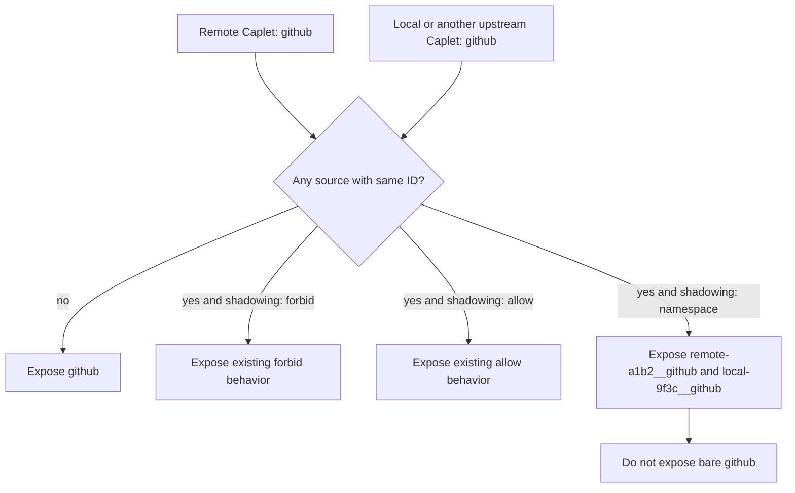

# Namespace Shadowing Policy Requirements

## Summary

Add `shadowing: namespace` as a third Caplet shadowing policy. When two or more participating sources share the same base Caplet ID under this policy, Caplets exposes each side under explicit hash-suffixed, double-underscore qualified IDs and removes the ambiguous bare ID across direct, progressive, Code Mode, and mixed exposure modes.

---

## Problem Frame

Remote Attach already has a policy boundary for local overlays: a remote Caplet can forbid local shadowing or allow a local Caplet to replace the matching remote one. That binary choice is too coarse for users who intentionally keep matching local and remote Caplets, such as browser or computer-use capabilities that are useful both on the local machine and on a remote host.

The current collision model forces one side to win or one side to disappear. The desired behavior is side-by-side access without making agents guess which runtime a bare Caplet ID means.

---

## Key Decisions

- **Namespace is collision-only.** Non-colliding Caplets keep their existing IDs so normal remote usage does not churn.
- **No bare ID survives a namespace collision.** Removing the bare ID is the clearest way to avoid a hidden local-vs-remote default.
- **Qualified IDs use hash-suffixed namespace labels before the double underscore.** Examples such as `remote-a1b2__github` and `local-9f3c__github` avoid dot-target ambiguity, align with existing native tool naming conventions, and reduce generated-ID collision risk.
- **Default labels come first, with configured aliases in scope.** The first version should work with `remote` and `local` labels by default and allow users to configure namespace labels like `vps` or `mac`; planning decides the config shape.
- **Hash suffixes must be small and stable.** The suffix must come from durable source identity, must not change across normal restarts or unrelated config edits, and must fail closed with a diagnostic when Caplets cannot determine a durable identity.
- **Multiple upstreams are supported.** Namespace behavior applies to any same-base-ID collision among participating sources whose relevant upstream policies declare `namespace`, including upstream-vs-upstream collisions with no local Caplet.
- **The upstream policy remains authoritative.** A local overlay cannot force namespace behavior for an upstream Caplet that still declares `forbid` or `allow` in the first version.

---

## Actors

- A1. **Agent user:** Configures local and remote Caplets and expects predictable access to both runtimes.
- A2. **Coding agent:** Consumes Caplets through direct tools, progressive operations, Code Mode handles, or mixed exposure modes.
- A3. **Remote Caplets host:** Publishes upstream Caplets and their shadowing policies through attach and remote-control surfaces.
- A4. **Local overlay runtime:** Provides local Caplets that may collide with upstream Caplet IDs.

---

## Requirements

**Policy contract**

- R1. `shadowing: namespace` must be accepted anywhere existing Caplet shadowing policy is accepted.
- R2. When two or more participating sources share the same base Caplet ID and every affected upstream Caplet declares `shadowing: namespace`, Caplets must expose each source under a qualified ID.
- R3. Namespace behavior must cover local-vs-upstream and upstream-vs-upstream base-ID collisions.
- R4. The upstream Caplet's shadowing policy must remain authoritative; local config must not force namespace behavior for upstream Caplets that declare `forbid` or `allow` in the first version.
- R5. During a namespace collision, Caplets must not expose the unqualified base ID for any colliding source.
- R6. Caplets that do not collide must keep their normal unqualified IDs.

**Qualified identity**

- R7. Qualified IDs must use a namespace label, a small stable hash suffix, and a double-underscore separator before the base ID, such as `remote-a1b2__github` and `local-9f3c__github`.
- R8. The default namespace labels must be predictable without additional setup.
- R9. Users must be able to configure friendly namespace aliases for local and upstream namespaces, such as `vps-a1b2__github` or `mac-9f3c__github`.
- R10. Configured aliases replace the namespace label for generated qualified IDs rather than creating duplicate handles.
- R11. Hash suffixes must be derived from durable source identity and must not change across normal restarts or unrelated config edits.
- R12. Namespace labels and generated qualified IDs must be validated so they do not collide with existing Caplet IDs or each other.
- R13. If Caplets cannot determine a durable source identity, or if generated qualified IDs still collide after suffixing, namespace exposure must fail closed with a diagnostic rather than falling back to `forbid` behavior.
- R14. Namespace labels must support multiple upstream sources in the same exposure context.

**Exposure coverage**

- R15. Namespace collision behavior must apply consistently to direct exposure, progressive exposure, Code Mode, and mixed exposure modes.
- R16. Generated Code Mode handles must use the same resolved qualified Caplet IDs that other surfaces expose.
- R17. Native direct tool names must remain unambiguous when a qualified Caplet ID is used.
- R18. CLI inspection, listing, completion, and execution must make the same qualified IDs available that the runtime can execute.

**User feedback and compatibility**

- R19. When a bare ID is removed because of a namespace collision, Caplets must present enough diagnostic information for users to discover the qualified alternatives.
- R20. Existing `forbid` and `allow` behavior must remain unchanged.
- R21. Existing non-colliding Caplet IDs must remain stable.

---

## Collision Model

The diagram is conceptual. It describes user-visible identity outcomes, not an implementation sequence.

---

## Acceptance Examples

- AE1. **Covers R2, R5, R7, R15.** Given remote `github` has `shadowing: namespace` and local `github` exists, when Caplets exposes capabilities in any supported mode, then `remote-a1b2__github` and `local-9f3c__github` are available and `github` is not.
- AE2. **Covers R6, R21.** Given remote `linear` has no local or upstream collision, when Caplets lists or exposes capabilities, then `linear` remains the visible ID.
- AE3. **Covers R18, R19.** Given a user tries to inspect or execute bare `github` during a namespace collision, then Caplets points the user toward the generated qualified IDs rather than silently choosing one.
- AE4. **Covers R9, R10, R12.** Given the upstream namespace is configured with alias `vps`, when remote `github` collides with local `github`, then the remote qualified ID is `vps-a1b2__github` and no separate `remote-a1b2__github` alias is created for that same Caplet.
- AE5. **Covers R9, R10, R12.** Given the local namespace is configured with alias `mac`, when remote `github` collides with local `github`, then the local qualified ID is `mac-9f3c__github` and no separate `local-9f3c__github` alias is created for that same Caplet.
- AE6. **Covers R3, R14.** Given two upstream sources both publish `github`, both affected upstream Caplets declare `shadowing: namespace`, and no local `github` exists, when both upstreams participate in one exposure context, then both upstream Caplets are exposed under distinct hash-suffixed qualified IDs and `github` is not.
- AE7. **Covers R11, R13.** Given Caplets cannot determine a durable source identity for a colliding namespace source, when namespace exposure is resolved, then Caplets fails closed with a diagnostic rather than exposing a bare ID or falling back to `forbid` behavior.
- AE8. **Covers R20.** Given remote `github` uses `shadowing: forbid`, when local `github` exists, then existing suppression behavior remains in force.
- AE9. **Covers R20.** Given remote `github` uses `shadowing: allow`, when local `github` exists, then existing local-wins behavior remains in force.

---

## Scope Boundaries

- Namespacing non-colliding Caplets is out of scope for the first version.
- Keeping a bare-ID alias during a namespace collision is out of scope.
- Reframing all remote/local precedence rules beyond the new `namespace` policy is out of scope.

---

## Dependencies and Assumptions

- Current policy values are only `forbid` and `allow`; adding `namespace` affects config parsing, runtime config, attach manifests, docs, generated schemas, and tests.
- Dot-qualified CLI operation targets already use `<caplet>.<operation>`, so dot-based namespace IDs would be ambiguous for single-token CLI targets.
- Native tool naming already uses double underscores in names such as `caplets__<capletId>`, making double-underscore qualified Caplet IDs a compatible user-facing direction.
- If the pending remote-list shadowing fix is not merged first, planning should account for CLI list and execution paths that still route by base Caplet ID.
- Configured namespace aliases are assumed to be a small extension of Caplets config, but planning must still define the exact config shape and validation surface.

---

## Outstanding Questions

### Deferred to Planning

- What config shape should declare namespace aliases: source-level aliases, per-Caplet overrides, or both?
- What exact durable source identity, hash algorithm, and display length should be used for suffixing namespace labels?

---

## Sources / Research

- `packages/core/src/config.ts` defines the current `CapletShadowingPolicy` and common shadowing schema.
- `packages/core/src/config-runtime.ts` mirrors the runtime shadowing policy enum and default.
- `packages/core/src/attach/api.ts` carries shadowing policy into attach manifest exports.
- `packages/core/src/native/service.ts` suppresses local Caplets whose remote counterparts do not allow shadowing.
- `packages/core/src/cli.ts` parses dot-qualified CLI targets and routes remote-mode execution through local overlays by base Caplet ID.
- `packages/core/src/native/tools.ts` and `packages/core/src/exposure/direct-names.ts` show existing double-underscore native tool naming.
- `apps/docs/src/content/docs/reference/config.mdx` and `apps/docs/src/content/docs/reference/caplet-files.mdx` expose shadowing policy in generated reference docs.
