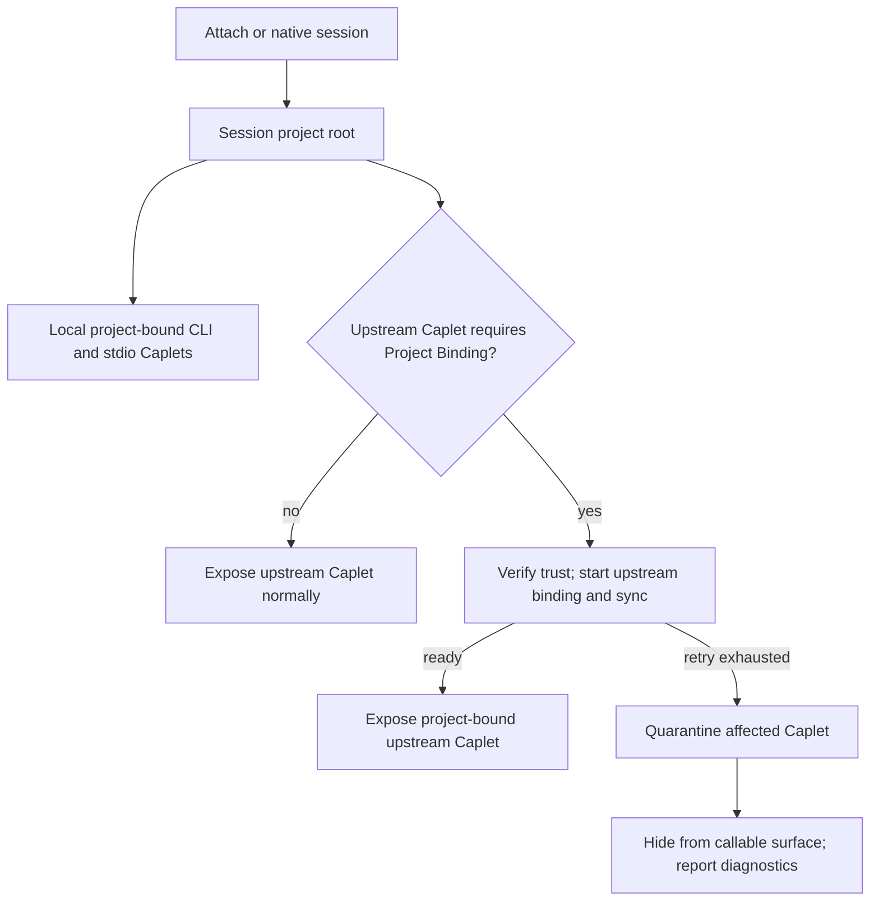

# Self-Hosted Project Binding Requirements

## Summary

Self-hosted Project Binding should become a real session contract across local-only serve/daemon, direct self-hosted remote attach, and Stacked Remote Runtime. A bound session carries the project root into project-bound execution surfaces, and upstream sync must work before an upstream project-bound Caplet is callable.

---

## Problem Frame

Project Binding is already documented as the bridge between one local project root and a runtime, but self-hosted installs do not yet deliver that behavior as a dependable product contract. The practical failure is worse than a missing feature when binding appears to succeed or degrades silently: agents may call tools that require project context without the project context actually being present.

The important distinction is that Project Binding is not the same thing as file sync. Local-only serve and daemon sessions do not need remote file propagation, but they still need a project-root contract so project-bound CLI actions and stdio MCP servers run against the same files the user is editing. Stacked and direct self-hosted remote sessions do need upstream sync when an upstream Caplet requires Project Binding.

## Current Failure Modes

- Self-hosted Project Binding is effectively a no-op today: a user can reach a state that looks attached while project-bound execution has no usable binding.
- Direct self-hosted remote attach reports or behaves like Project Binding is unsupported instead of creating a real Binding Session when an upstream Caplet requires it.
- Local-only serve and daemon paths can be healthy as runtimes while still failing the product contract for project-bound CLI and stdio MCP Caplets if they infer context from process CWD or omit it entirely.
- Stacked runtime paths need a way to distinguish non-project upstream Caplets, upstream Caplets that require binding, and upstream Caplets whose binding state is unknown or stale before exposing the callable surface.

---

## Key Decisions

- **Project Binding is session-scoped project context.** The binding belongs to an attach or native session, not to a long-running daemon or serve process CWD.
- **Sync is conditional, not the definition.** Local-only sessions need project context; upstream sessions need file propagation only when an upstream project-bound Caplet requires it.
- **Project Binding file sync remains Mutagen-backed.** Direct self-hosted remote and stacked upstream file propagation should use the existing managed Mutagen project-sync path, while local-only binding does not start Mutagen because no remote file propagation is needed.
- **Required upstream binding gates the affected Caplet.** If upstream sync cannot become healthy after retry, Caplets quarantines only the project-bound Caplets that require it.
- **Quarantined Caplets are hidden from callable surfaces, not status surfaces.** Agents should not be offered tools or handles that cannot safely run, while users and operators still need diagnostics that explain what was withheld.
- **No silent no-op state is acceptable.** A session must be visibly bound, visibly degraded with quarantined Caplets, or failed with recovery guidance.
- **Upstream sync is part of release readiness when upstream Caplets require binding.** Local-only binding can be implemented as a slice, but self-hosted Project Binding is not complete until direct and stacked upstream project-bound Caplets have functional binding, sync, retry, and quarantine behavior.



---

## Actors

- A1. **Agent user.** Runs Caplets from a project and expects project-bound tools to operate on that project.
- A2. **MCP or native client.** Starts attach or native sessions and consumes the exposed callable surface.
- A3. **Local Caplets runtime.** Runs local-only serve, daemon-backed serve, or a Stacked Remote Runtime.
- A4. **Self-hosted upstream runtime.** Receives project-binding requests from trusted local sessions and provides upstream Caplets.
- A5. **Project-bound Caplet.** Declares `projectBinding.required` and must not run without a bound project context.

---

## Requirements

**Session contract**

- R1. Project Binding must mean that the current attach or native session has a bound project root.
- R2. Long-running serve and daemon processes must not treat their startup CWD as the session project root.
- R3. Local-only serve and daemon-backed serve must accept session project context for project-bound local and project Caplets.
- R4. Stacked runtimes must receive project context from each attach or native session and keep it separate between sessions.
- R5. Direct self-hosted remote attach must create a real Binding Session when project-bound remote Caplets require it.

**Project-bound execution**

- R6. A Caplet with `projectBinding.required` must not be exposed as ready until its required project context is available.
- R7. Project-bound CLI actions must use the bound project root as their default execution context unless the Caplet declares a more specific working directory.
- R8. Project-bound stdio MCP servers must start with the bound project root as their default execution context unless the Caplet declares a more specific working directory.
- R9. If Caplets cannot honor the required execution context for a project-bound CLI action or stdio MCP server, the Caplet must be withheld or degraded rather than exposed normally.

**Upstream binding and sync**

- R10. When a direct self-hosted remote attach or Stacked Remote Runtime includes upstream Caplets that require Project Binding, Caplets must start upstream Project Binding for the session.
- R11. Upstream sync must become functional before an upstream project-bound Caplet is exposed as callable.
- R12. If upstream binding or sync fails with a transient error, Caplets must retry before quarantining the affected Caplets; if binding is unsupported, unauthorized, invalid, or otherwise known impossible, Caplets may quarantine or fail immediately with the appropriate diagnostic.
- R13. Retry exhaustion must quarantine only the upstream project-bound Caplets that require the failed binding.
- R14. Non-project upstream Caplets must remain available when upstream Project Binding fails, unless their own runtime requirements fail.
- R15. Local project-bound Caplets must remain available when upstream Project Binding fails, as long as local project context is healthy.

**Callable surfaces and diagnostics**

- R16. Quarantined Caplets must be hidden from direct, progressive, Code Mode, native, CLI listing, and completion surfaces, while remaining visible in diagnostics and status output.
- R17. Calls that target a Caplet quarantined after a stale manifest or cached tool list must fail with a stable diagnostic and recovery hint.
- R18. Human-readable and JSON diagnostics must report the binding state, quarantined Caplets, retry state when available, and the recovery action.
- R19. `caplets attach --once` must distinguish fully ready, degraded-ready, and failed states. It must not report fully ready when required project-bound Caplets are quarantined; it may report degraded-ready when a safe callable surface remains; and it must fail when no safe callable surface remains or required binding is impossible for the requested surface.
- R20. `caplets doctor` or an equivalent status surface must distinguish healthy binding, degraded binding with quarantined Caplets, unsupported upstream binding, auth failure, sync failure, and missing project context.

**Authorization, root selection, and trust**

- R21. Binding requests must be accepted only from authenticated and authorized attach or native sessions.
- R22. The session project root must come from the local attach or native client, be canonicalized and validated before use, and be shown consistently in human-readable and JSON diagnostics.
- R23. Upstream runtimes must not choose, broaden, or reinterpret the local project root; they receive only the bounded project context or synced subset that the local runtime authorizes for the session.
- R24. If the session has no valid project root, local project-bound Caplets must be withheld or quarantined, non-project Caplets may remain available, and diagnostics must report missing project context.
- R25. Before starting upstream binding or sync, Caplets must verify the upstream identity, Remote Profile trust state, credentials, and Project Binding capability.
- R26. Caplets must discover authoritative `projectBinding.required` metadata before generating the callable surface. Unknown, missing, or stale metadata for an upstream Caplet must fail closed by withholding or degrading that Caplet until metadata refresh succeeds.

**Sync safety and release readiness**

- R27. Upstream sync must follow the existing sync safety model: apply exclusions, propagate only the minimum required project subset, and avoid sending secrets, credentials, or ignored files by default.
- R28. The active sync posture must be visible before and during upstream binding, including target host, bound root, include/exclude summary, readiness state, and quarantine state.
- R29. Diagnostics must redact credentials, tokens, raw environment values, and arbitrary file contents while still identifying the affected Caplet, host, binding state, and recovery path.
- R30. A release cannot claim self-hosted Project Binding support unless local-only project context, direct self-hosted remote binding, stacked upstream binding and sync, quarantine hiding, stale-call failure, and operator diagnostics all work for the supported surfaces.
- R31. Upstream Project Binding file sync must use the existing managed Mutagen project-sync path unless a future requirements document explicitly replaces the sync engine.
- R32. Transient upstream binding or sync failures must use a bounded foreground retry budget before quarantine: five attempts or 30 seconds total, whichever comes first, with exponential backoff and full jitter. Long-running sessions must keep quarantined Caplets eligible for background recovery with jittered retries after quarantine.
- R33. JSON diagnostics must expose a stable Project Binding state model that includes session state, sync state, project identity, retry state, Mutagen sync status, and a per-Caplet quarantine record for each withheld project-bound Caplet.
- R34. When quarantine changes the callable surface, Caplets must publish a new exposure revision, notify clients that support surface-change events, and fail stale calls with stable refresh-or-reconnect diagnostics.

---

## Key Flows

- F1. Local-only project-bound CLI action
  - **Trigger:** An agent attaches to a local-only serve or daemon-backed runtime from a project.
  - **Actors:** A1, A2, A3, A5
  - **Steps:** The session supplies a project root, the runtime marks the session as project-bound, and a project-bound CLI action runs against that project root.
  - **Covered by:** R1, R3, R6, R7

- F2. Local-only project-bound stdio MCP server
  - **Trigger:** A local or project Caplet wraps a stdio MCP server that needs project context.
  - **Actors:** A2, A3, A5
  - **Steps:** The runtime starts the stdio server for the bound session with the project root as its working context, then exposes it only after the context is honored.
  - **Covered by:** R1, R3, R6, R8, R9

- F3. Stacked upstream project-bound Caplet
  - **Trigger:** A stacked runtime receives a session project root and the upstream exposes a Caplet that requires Project Binding.
  - **Actors:** A2, A3, A4, A5
  - **Steps:** The local runtime starts upstream Project Binding for that session, sync reaches ready, and the upstream project-bound Caplet becomes callable.
  - **Covered by:** R4, R10, R11, R25, R26, R27

- F4. Upstream binding degradation
  - **Trigger:** Upstream Project Binding fails or remains unhealthy after retry.
  - **Actors:** A2, A3, A4, A5
  - **Steps:** Caplets quarantines the affected upstream project-bound Caplets, hides them from callable surfaces, keeps unrelated Caplets available, and reports the degraded state.
  - **Covered by:** R12, R13, R14, R15, R16, R18, R20, R31, R32, R33

- F5. Stale call after quarantine
  - **Trigger:** An agent calls a Caplet it saw before the Caplet became quarantined.
  - **Actors:** A2, A3, A5
  - **Steps:** Caplets emits or exposes a new callable-surface revision; the stale call fails with a stable quarantined or stale-manifest diagnostic instead of executing without valid project context.
  - **Covered by:** R16, R17, R34

- F6. Direct self-hosted remote attach with project-bound upstream Caplet
  - **Trigger:** An agent directly attaches to a trusted self-hosted remote from a project and the remote exposes a project-bound Caplet.
  - **Actors:** A1, A2, A4, A5
  - **Steps:** The session supplies a canonical project root, Caplets verifies upstream trust and binding capability, starts the Binding Session and sync, then exposes the upstream project-bound Caplet only after sync is ready.
  - **Covered by:** R5, R10, R11, R21, R22, R25, R26, R27, R28

- F7. Missing or invalid project root
  - **Trigger:** An agent attaches without a valid local project root or with a root that cannot be canonicalized and validated.
  - **Actors:** A1, A2, A3, A5
  - **Steps:** Caplets withholds project-bound local and upstream Caplets, keeps safe non-project Caplets available, and reports missing project context through status and JSON diagnostics.
  - **Covered by:** R6, R9, R20, R22, R24, R29

---

## Acceptance Examples

- AE1. **Covers R1, R3, R7.** Given an agent attaches to a local-only daemon-backed runtime from `/repo`, when it calls a project-bound CLI Caplet with no explicit working directory, then the action runs with `/repo` as its project context.
- AE2. **Covers R1, R3, R8, R9.** Given an agent attaches to local-only serve from `/repo`, when a project-bound stdio MCP Caplet starts, then the server process starts in the bound project context or the Caplet is withheld.
- AE3. **Covers R4, R10, R11.** Given a stacked runtime composes a self-hosted upstream with a project-bound Caplet, when the session supplies a project root and upstream sync becomes ready, then that upstream Caplet appears in the callable surface.
- AE4. **Covers R12, R13, R14, R16.** Given upstream Project Binding fails after retry, when the upstream has both project-bound and non-project Caplets, then only the affected project-bound Caplets are hidden from callable surfaces.
- AE5. **Covers R15.** Given upstream Project Binding fails after retry, when local project-bound Caplets can still honor the session project root, then local project-bound Caplets remain callable.
- AE6. **Covers R17.** Given an agent holds a stale handle for a Caplet that has since been quarantined, when it calls that Caplet, then the call fails with a stable quarantined diagnostic and no project-context-free execution occurs.
- AE7. **Covers R18, R20.** Given a self-hosted session has quarantined Caplets, when the user runs diagnostics, then Caplets reports which Caplets were withheld and why.
- AE8. **Covers R19.** Given `caplets attach --once` targets a direct self-hosted remote or stacked runtime whose required upstream project-bound Caplets cannot bind, when retries are exhausted or the state is known impossible, then the command reports degraded-ready if a safe callable surface remains and fails if no safe callable surface remains.
- AE9. **Covers R5, R10, R11, R25.** Given a trusted direct self-hosted remote exposes a project-bound Caplet, when the session supplies a valid project root and upstream sync becomes ready, then that remote Caplet appears in the callable surface.
- AE10. **Covers R21, R22, R23.** Given a binding request comes from an unauthenticated caller or attempts to broaden the local root upstream, when Caplets evaluates the request, then the binding request is rejected and no project files are exposed.
- AE11. **Covers R6, R9, R24.** Given a local-only session has no valid project root, when local project-bound CLI or stdio MCP Caplets would otherwise be exposed, then those Caplets are withheld while non-project Caplets remain available.
- AE12. **Covers R26.** Given upstream metadata is missing or stale for a Caplet that may require Project Binding, when the callable surface is generated, then Caplets withholds or degrades that Caplet until authoritative metadata is available.
- AE13. **Covers R27, R28, R29.** Given upstream sync is active for a self-hosted session, when a user inspects diagnostics, then Caplets shows the sync posture and recovery state without exposing credentials, raw environment values, or arbitrary file contents.
- AE14. **Covers R31.** Given a direct or stacked upstream Binding Session needs file sync, when sync starts, then Caplets uses the managed Mutagen project-sync path and existing sync filtering instead of introducing a separate sync engine.
- AE15. **Covers R32.** Given upstream binding fails with transient network errors, when the foreground retry budget is exhausted, then affected project-bound Caplets are quarantined and the long-running session schedules jittered background recovery without failing unrelated Caplets.
- AE16. **Covers R33.** Given a project-bound Caplet is quarantined, when JSON diagnostics are requested, then the response includes session state, sync state, retry state, Mutagen sync status, and a redacted per-Caplet quarantine record.
- AE17. **Covers R34.** Given a long-lived client has cached a callable surface before quarantine, when the quarantine changes that surface, then clients that support surface-change events are notified and stale invocations fail with refresh-or-reconnect diagnostics.

---

## Success Criteria

- A self-hosted user can run local project-bound CLI and stdio MCP Caplets through serve or daemon without relying on the runtime process CWD.
- A direct self-hosted remote attach creates a real Binding Session and exposes upstream project-bound Caplets only after binding and sync are ready.
- A stacked runtime exposes upstream project-bound Caplets only after upstream Project Binding and sync are healthy for the session.
- Project Binding failures do not take down unrelated local or upstream Caplets.
- Agents do not see quarantined Caplets in generated handles, tool listings, completions, or direct callable surfaces.
- Diagnostics make the difference between unbound, bound, degraded, quarantined, unsupported, and auth-failed states clear enough for a user to recover.

---

## Scope Boundaries

- Remote Login, Remote Profile storage, and credential refresh are not redesigned by this feature.
- Daemon install, update, and native service lifecycle behavior are not redesigned by this feature.
- Namespace shadowing behavior is not redesigned by this feature.
- Sync transport mechanics and exact error-code names are deferred to planning; retry and quarantine policy is resolved below.
- Full web-based self-hosted administration and multi-user permission policy are out of scope, but per-session binding authorization, upstream trust verification, and capability checks are in scope.

---

## Release Readiness Slice

Implementation may sequence the work, but the first releasable self-hosted Project Binding slice must include:

- Session project-root intake, canonicalization, validation, and diagnostics for attach and native sessions.
- Local-only serve and daemon support for project-bound CLI and stdio MCP Caplets.
- Direct self-hosted remote Binding Sessions with required Mutagen-backed upstream sync before project-bound Caplets become callable.
- Stacked upstream Binding Sessions with Mutagen-backed sync, retry, quarantine, and stale-call failure behavior.
- Callable-surface hiding plus human-readable and JSON diagnostics for quarantined Caplets.
- Surface revision invalidation and stale-call diagnostics for long-lived MCP and native clients.

Partial internal milestones are acceptable, but a user-facing release should not describe Project Binding as supported for self-hosted installs until the full slice above is true for the supported surfaces.

---

## Dependencies / Prerequisites

**Planning dependencies**

- Attach and native integrations must expose one authoritative session project-root source. Blocks R1-R5, R21-R24.
- Runtime discovery must expose authoritative `projectBinding.required` metadata before surface generation. Blocks R6, R10-R17, R26.
- Self-hosted upstreams must expose a Project Binding control contract and distinguish unsupported capability from transient binding or sync failure. Blocks R5, R10-R13, R25.
- Managed Mutagen project sync must be available to self-hosted Project Binding or explicitly reported as missing. Blocks R11, R27, R31-R33.
- Sync policy must expose include/exclude and secret-safety behavior for self-hosted upstream sync. Blocks R11, R27-R33.
- Attach and native surfaces must support revisioned exposure refresh or stable stale-call failure. Blocks R17 and R34.

**Runtime assumptions**

- Remote Profiles remain the trust source for upstream host identity and credentials.
- Existing sync safety rules continue to apply to self-hosted upstream sync.
- Mutagen remains the Project Binding file-sync engine for upstream self-hosted and stacked sessions.
- Existing local and project Caplet configuration validation remains authoritative for whether a Caplet declares `projectBinding.required`.

---

## Resolved Planning Decisions

### Retry and Quarantine Policy

- Treat auth failures, unsupported binding capability, invalid project roots, trust failures, missing required metadata, sync policy violations, and size/safety-limit failures as non-transient. These states fail closed or quarantine immediately with diagnostics; retrying them without a user or configuration change is noise.
- Treat network timeouts, upstream 5xx responses, WebSocket close/error during startup, temporary sync worker failure, and endpoint unavailability as transient.
- For a foreground attach or readiness pass, retry transient failures for at most five attempts or 30 seconds total, whichever comes first. Use exponential backoff with full jitter, starting around 1 second and capping each delay around 10 seconds.
- Quarantine after the foreground budget is exhausted. For long-running serve, daemon, attach, and native sessions, continue background recovery attempts with jittered delays starting around 60 seconds and capping around 15 minutes.
- Lift quarantine only after the runtime refreshes upstream metadata, verifies the Binding Session, confirms Mutagen sync health, and publishes a new callable-surface revision.

### JSON Diagnostic State Model

JSON diagnostics should use the existing Project Binding states where possible and add quarantine records rather than inventing a separate top-level lifecycle. The stable shape should include:

```json
{
  "projectBinding": {
    "state": "ready | degraded | blocked | offline | not_attached | attaching | syncing",
    "projectRoot": "/repo",
    "projectFingerprint": "redacted-or-stable-fingerprint",
    "sync": {
      "state": "not_started | pending | syncing | idle | failed",
      "engine": "mutagen",
      "managedState": "idle | starting | syncing | ready | blocked | stopped",
      "targetHost": "https://self-hosted.example",
      "policySummary": {
        "source": "caplets-defaults + .gitignore + .capletsignore",
        "redacted": true
      }
    },
    "quarantinedCaplets": [
      {
        "capletId": "remote__example",
        "origin": "local | project | upstream",
        "reasonCode": "PROJECT_BINDING_SYNC_FAILED",
        "message": "Project Binding sync did not become healthy before the retry budget was exhausted.",
        "retryState": "retrying | exhausted | permanent",
        "attempts": 5,
        "nextRetryAt": "2026-06-25T12:34:56.000Z",
        "recoveryCommand": "caplets doctor",
        "hiddenFrom": ["direct", "progressive", "code_mode", "native", "cli", "completion"]
      }
    ]
  }
}
```

The implementation may add fields, but it should not remove or rename the core fields without a compatibility plan. Error messages and details must remain redacted according to R29.

### Stale Manifest and Long-Lived Client Invalidation

- Treat the callable surface as revisioned. Any quarantine or unquarantine event that hides or restores Caplets must create a new exposure revision.
- Attach and native clients that support event streams should receive a `surface_changed` or equivalent event with the new revision, affected Caplet IDs, and a refresh hint.
- Protocol clients that support dynamic tool/resource/prompt list-change notifications should receive the protocol-native notification in addition to Caplets diagnostics.
- Clients without a usable push channel must fail closed on the next stale invocation. If the client supplies an old revision, return the existing stale-manifest style diagnostic; if it targets a now-quarantined export, return a stable Project Binding quarantine diagnostic. In both cases, recovery is to refresh the manifest or reconnect.
- No stale call may execute a quarantined Caplet even if the caller still holds an old handle, export ID, or generated Code Mode reference.

---

## Sources / Research

- `docs/project-binding.md` for the current Project Binding contract, attach modes, Stacked Remote Runtime vocabulary, sync safety, and recovery states.
- `CONCEPTS.md` for Remote Attach, Stacked Remote Runtime, Remote Profile, and daemon vocabulary.
- `docs/native-integrations.md` for current native Project Binding behavior and degraded remote guidance.
- `docs/plans/2026-06-23-002-feat-stacked-remote-runtime-plan.md` for the existing stacked runtime plan and session-scoped project context requirements.
- `packages/core/src/config.ts` for the current `projectBinding.required` schema on MCP and CLI Caplets.
- `packages/core/src/project-binding/mutagen.ts` for the existing managed Mutagen project-sync path, doctor data, and sync states.
- `packages/core/src/serve/http.ts` for the current self-hosted Project Binding unsupported response.
- `packages/core/src/attach/api.ts` for the current attach manifest revision and stale-manifest diagnostic shape.
- `packages/core/src/serve/index.ts` and `packages/core/src/native/service.ts` for the current stacked runtime and remote Project Binding session paths.
