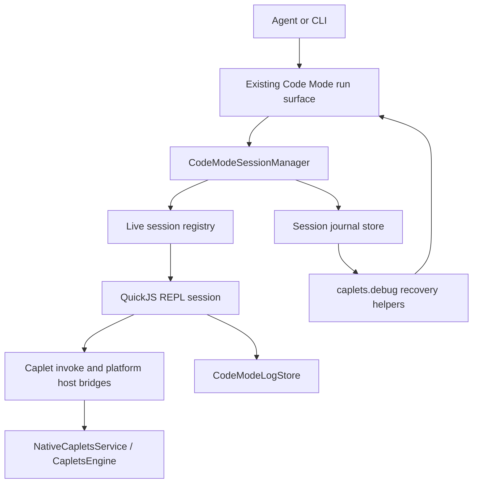
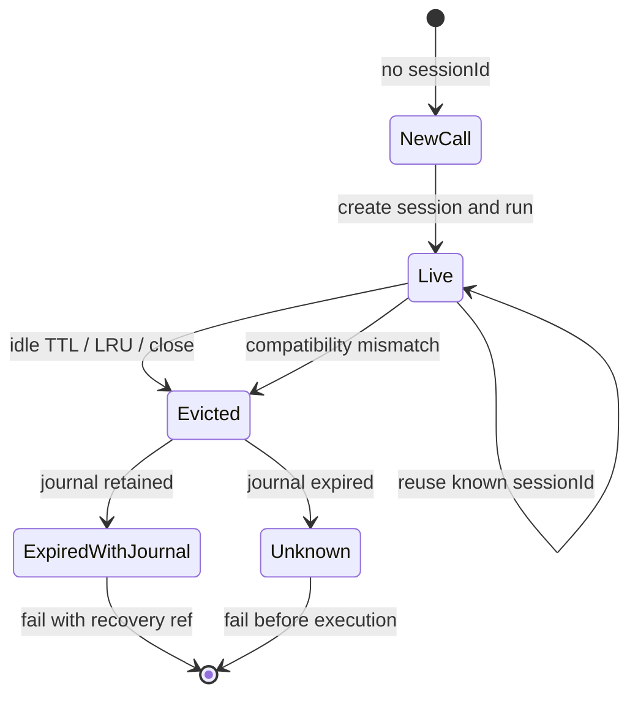
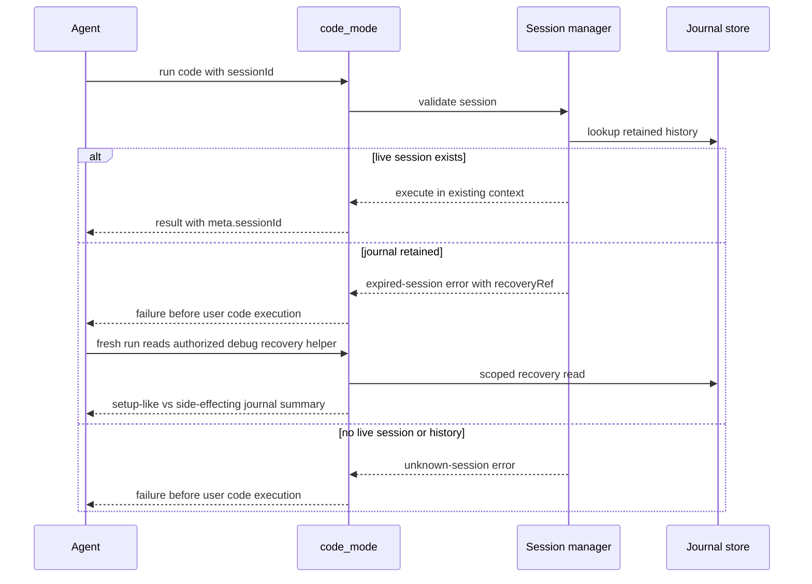

# feat: Add Code Mode REPL sessions

## Summary

Add reusable Code Mode sessions to the existing `code_mode` tool so agents can create helper functions and workflow state once, then reuse them across adjacent calls while the live runtime remains available. The implementation keeps one-shot Code Mode simple, adds scoped recovery through an expiring redacted journal, and validates the product bet with a repeated-workflow Pi eval.

---

## Problem Frame

Code Mode currently optimizes for one compact TypeScript run. That keeps tool surfaces small, but it also makes agents repeat setup helpers, discovery routines, and result-shaping code when a workflow spans multiple calls.

The requirements intentionally stop short of durable heap persistence. V1 should preserve live QuickJS state only inside the current runtime process and persist enough redacted history for reconstruction and auditability when a session disappears.

---

## Requirements

### Session Behavior

| ID  | Requirement                                                                                                                           |
| --- | ------------------------------------------------------------------------------------------------------------------------------------- |
| R1  | A Code Mode call without `sessionId` creates a new isolated reusable session and returns the generated session ID in result metadata. |
| R2  | A Code Mode call with a known live `sessionId` executes in that session's existing JavaScript context.                                |
| R3  | A Code Mode call with an unknown `sessionId` fails before user code execution.                                                        |
| R4  | A Code Mode call for a no-longer-live session with retained history fails before execution and returns a reconstruction pointer.      |
| R5  | Starting fresh requires omitting `sessionId` and using the new session ID returned in metadata.                                       |

### State, Isolation, And Compatibility

| ID  | Requirement                                                                                                                                                                                                                          |
| --- | ------------------------------------------------------------------------------------------------------------------------------------------------------------------------------------------------------------------------------------ |
| R6  | REPL state is scoped to the Code Mode session ID and does not leak across unrelated sessions.                                                                                                                                        |
| R7  | Session reuse and exact journal reads are scoped to the originating Code Mode security principal; V1 treats high-entropy session IDs and recovery refs as local capabilities for exact reads where no stronger host identity exists. |
| R8  | Healthy live runtimes keep sessions available across adjacent calls until idle TTL, lifecycle close, compatibility change, or resource pressure evicts them.                                                                         |
| R9  | Caplets does not persist QuickJS heap state, timers, promises, closures, or host handles across process restarts.                                                                                                                    |
| R10 | Sessions do not silently continue after declaration, runtime platform, or compatibility changes that would make prior bindings misleading.                                                                                           |

### History And Auditability

| ID  | Requirement                                                                                                                                                                                                                                                                   |
| --- | ----------------------------------------------------------------------------------------------------------------------------------------------------------------------------------------------------------------------------------------------------------------------------- |
| R11 | Caplets records each session call in a persisted, expiring journal.                                                                                                                                                                                                           |
| R12 | Journal entries include timestamp, submitted code, a non-capability journal session key or keyed hash, declaration hash, outcome, diagnostics summary, log reference when available, and recovery classification. Raw `sessionId` and `recoveryRef` values are not persisted. |
| R13 | Journal entries redact common secrets and sensitive identifiers before writing to disk.                                                                                                                                                                                       |
| R14 | Journal storage caps entry size, retained entry count, and retention age.                                                                                                                                                                                                     |
| R15 | Journal reads are authorized for the originating session scope; redaction does not make journals broad telemetry.                                                                                                                                                             |
| R16 | A retained journal can be read through a debug or recovery surface without exposing unrelated sessions.                                                                                                                                                                       |
| R17 | Recovery output distinguishes setup-like calls from side-effecting or unknown calls.                                                                                                                                                                                          |

### Agent Ergonomics And Validation

| ID  | Requirement                                                                                                                                                                                                                                                                                                         |
| --- | ------------------------------------------------------------------------------------------------------------------------------------------------------------------------------------------------------------------------------------------------------------------------------------------------------------------- |
| R18 | Tool descriptions and docs teach agents to capture `meta.sessionId` and pass it on later calls.                                                                                                                                                                                                                     |
| R19 | Expired-session errors tell the agent whether reconstruction history exists and how to retrieve it.                                                                                                                                                                                                                 |
| R20 | One-shot Code Mode remains usable without session-specific setup.                                                                                                                                                                                                                                                   |
| R21 | If an agent loses the returned session ID while the live context exists, Caplets provides scoped recent-session lookup only when a stable host conversation or run identity is available. Without that identity, lookup returns unsupported or empty and exact `sessionId` or `recoveryRef` possession is required. |
| R22 | Pi eval validates a repeated-workflow task against one-shot and session-enabled Code Mode paths.                                                                                                                                                                                                                    |

### Key Flows

| ID  | Flow                                                                                                                                                                                                                             |
| --- | -------------------------------------------------------------------------------------------------------------------------------------------------------------------------------------------------------------------------------- |
| F1  | Fresh call: agent omits `sessionId`, Code Mode creates a session, executes the cell, journals the call, and returns `meta.sessionId`.                                                                                            |
| F2  | Reuse call: agent passes a live `sessionId`, Code Mode verifies scope and compatibility, executes in the existing context, journals the call, and returns the same session ID.                                                   |
| F3  | Expired call: agent passes an evicted `sessionId`, Code Mode finds retained history, fails before execution, and returns recovery metadata.                                                                                      |
| F4  | Unknown call: agent passes an ID with no live context or retained history, Code Mode fails before execution with a clear unknown-session error.                                                                                  |
| F5  | Recovery lookup: agent starts a fresh Code Mode run and uses scoped debug helpers to list recent sessions only when a stable host identity scopes the request, or reads retained journal summaries by exact recovery capability. |

---

## Key Technical Decisions

- KTD1. **Reuse the existing Code Mode tool contract.** Add optional `sessionId` to the existing run input and add `meta.sessionId` to the structured envelope. When the MCP transport supports result metadata, mirror the session ID there, but keep the envelope as the portable source of truth.
- KTD2. **Own sessions at the Code Mode runtime-service layer.** Introduce a shared `CodeModeSessionManager` used by MCP sessions, native services, remote composites, and long-lived CLI REPL processes. This avoids separate behavior between `code_mode`, `caplets__code_mode`, remote overlays, and command-line debugging without implying cross-process CLI heap reuse.
- KTD3. **Keep unreused fresh sessions behavior-compatible with one-shot runs.** Omitting `sessionId` creates a new reusable session, but a call that never reuses that ID should feel like current one-shot Code Mode from the agent's perspective: same authoring model, diagnostics, serialization, and log behavior. Cleanup happens through session lifecycle eviction rather than immediate per-call disposal.
- KTD4. **Keep REPL state in a reusable QuickJS runtime/context.** A live session owns its QuickJS runtime, context, host bridges, pending deferred tracking, compatibility key, and disposal path. QuickJS documentation treats runtime limits as aggregate over contexts and separate contexts as isolated global environments, so each Code Mode session should own a runtime rather than sharing a heap across sessions.
- KTD5. **Drive REPL semantics from behavior tests, not an untested compiler rewrite.** Session cells must preserve named top-level helper functions and `var` state while retaining the existing `return` and top-level `await` authoring style. The implementer may use a TypeScript AST transform or a split setup/body evaluation strategy, but the acceptance tests define the contract.
- KTD6. **Use conservative compatibility invalidation.** A live session is reusable only when its declaration hash, runtime platform hash, runtime scope, and code-mode compatibility version still match. On mismatch, evict before execution and journal the reason.
- KTD7. **Use high-entropy capability IDs for V1.** Generate session IDs and recovery refs with cryptographically secure randomness and at least 128 bits of entropy. OWASP session guidance requires unpredictable, meaningless IDs and a CSPRNG for session tokens; Code Mode should exceed the minimum because IDs gate local heap and journal access.
- KTD8. **Extend the debug surface, not the visible tool list.** Add scoped recovery helpers under `caplets.debug` for journal reads and identity-gated recent-session lookup. Recent-session listing is enabled only when a stable host conversation/run identity scopes the request; otherwise exact `sessionId` or `recoveryRef` possession is required. This keeps the visible agent surface compact and matches the existing `caplets.debug.readLogs()` pattern.
- KTD9. **Persist reconstruction breadcrumbs, not replay scripts.** The journal stores redacted code and summaries with a recovery classification, but it never persists raw session IDs or recovery refs. Store a non-capability journal key or keyed hash so retained audit data cannot become a token vault. Setup-like entries are candidates for manual reconstruction; side-effecting and unknown entries are visible for audit but are not automatic replay input.
- KTD10. **Bound live and durable state.** Start with a 30-minute idle TTL, 32 live sessions per runtime-service instance, and LRU eviction under pressure, while keeping existing QuickJS memory/stack limits. Journal files start with a 7-day retention TTL, 100 entries per session, 64 KiB redacted submitted-code bytes per entry, and 16 KiB summary bytes per entry. These are implementation defaults, not user-facing promises; U4 tests should pin behavior and keep future configuration possible.
- KTD11. **Validate usefulness in the existing benchmark system.** Add a repeated-workflow Pi eval path and deterministic harness coverage for the new metrics rather than claiming value from anecdotal manual runs.
- KTD12. **Keep remote Code Mode sessions local to the runtime that executes Code Mode.** Remote composites still run Code Mode locally against a remote service facade; the feature does not create server-side Cloud heap persistence or attach-session continuity.

---

## High-Level Technical Design

### Runtime Topology

### Session Lifecycle

### Recovery Flow

---

## Scope Boundaries

### In Scope

- Existing `code_mode` / `caplets__code_mode` run surfaces accept optional `sessionId`.
- Result envelopes return `meta.sessionId` for fresh and reused sessions.
- Live process sessions preserve reusable helper functions and state across adjacent calls.
- Expired sessions with retained journal return a recovery pointer.
- Scoped debug helpers read retained journals and list recent live sessions only when a stable host identity is available.
- CLI debugging parity is process-local: ordinary `caplets code-mode` remains one-shot, while live CLI session reuse requires an explicit long-lived `caplets code-mode repl` flow.
- Pi eval includes a repeated-workflow validation path.

### Deferred For Later

- Durable QuickJS heap snapshots.
- Saved named workflows.
- Cross-process or cross-device live REPL continuity.
- Automatic journal replay.
- A separate reset tool.
- Host-specific durable conversation binding when the host does not expose a stable run or conversation identity.

### Deferred To Follow-Up Work

- User-configurable session TTL and journal retention policy, if defaults prove insufficient.
- Rich semantic classification of side effects using downstream tool annotations beyond the conservative V1 classification.
- HTML or UI surfaces for journal inspection.

---

## System-Wide Impact

- Public contract: `code_mode` input schemas, native execution payloads, remote attach manifests, CLI REPL flags, generated runtime declarations, and docs all gain the same optional session shape.
- Runtime lifecycle: services that can execute Code Mode now own long-lived QuickJS contexts and must dispose them on close, TTL eviction, compatibility mismatch, timeout eviction, and LRU pressure.
- Security and privacy: session IDs and recovery refs become local capability tokens, so ID generation, scope checks, identity-gated lookup, journal redaction, retained-history reads, and denial behavior become part of the core security surface.
- Storage: Code Mode gains a second expiring local store beside logs. The journal must share redaction discipline with logs, avoid persisting raw capability tokens, use owner-only path-safe storage, and retain enough structured metadata for reconstruction and auditability.
- Remote and Cloud behavior: remote native services and Cloud attach flows continue to expose remote Caplets through the local Code Mode runtime; sessions do not imply durable server-side JavaScript state.
- Validation: Code Mode session work affects runtime tests, MCP/native/remote parity tests, CLI tests, generated declaration checks, docs checks, deterministic benchmarks, and opt-in live Pi eval reporting.

---

## Implementation Units

### U1. Public Contract And Metadata

**Goal:** Add the session fields to Code Mode inputs, outputs, schemas, docs scaffolding, and tests without changing execution behavior yet.

**Requirements:** R18, R20, plus the schema and metadata portions of R1, R3, and R5. Behavioral coverage for R1, R3, F1, and F4 belongs to U3.

**Dependencies:** None.

**Files:**

- `packages/core/src/code-mode/tool.ts`
- `packages/core/src/code-mode/types.ts`
- `packages/core/src/code-mode/runtime-api.d.ts`
- `packages/core/src/code-mode/runtime-api.generated.ts`
- `packages/core/src/code-mode/declarations.ts`
- `packages/core/src/cli/code-mode.ts`
- `packages/core/test/code-mode-declarations.test.ts`
- `packages/core/test/code-mode-mcp.test.ts`
- `packages/core/test/native.test.ts`
- `packages/core/test/native-remote.test.ts`
- `packages/core/test/code-mode-cli.test.ts`

**Approach:** Extend `codeModeRunInputSchema` and JSON schema with optional `sessionId`. Extend `CodeModeRunMeta` with `sessionId`, a creation/reuse indicator, and optional recovery pointer fields for failures. Keep `meta.sessionId` and agent-facing reuse guidance internal or test-only until U3's live session manager lands in the same release. Add CLI metadata/recovery scaffolding and long-lived REPL option parsing without implying that ordinary one-shot CLI invocations can reuse live heap across processes.

**Patterns to follow:** `codeModeRunInputJsonSchema()` for native and remote schema parity; `CodeModeRunEnvelope` as the portable structured result; existing generated declaration checks in `code-mode-declarations.test.ts`.

**Test scenarios:**

- Contract path: metadata types and schemas can represent a session ID, creation/reuse status, and recovery metadata without making live reuse externally visible before U3.
- Happy path: a request with optional `sessionId` passes schema validation for MCP, native, remote, and CLI surfaces.
- Error path: invalid payloads still return `REQUEST_INVALID` and include the expanded metadata shape without throwing.
- Compatibility path: existing one-shot tests that ignore `sessionId` still pass without prompt or schema regressions.
- Docs prompt path: generated tool descriptions can represent session metadata without exposing agent-facing reuse guidance before U3 behavior lands.

**Verification:** Contract tests prove all Code Mode surfaces accept the same input shape and preserve the current one-shot envelope, while public reuse guidance is gated until behavior lands with U3.

### U2. Reusable QuickJS REPL Sandbox

**Goal:** Refactor the sandbox so a live session can reuse a QuickJS runtime/context across calls while fresh sessions that are never reused keep the current Code Mode authoring and result behavior.

**Requirements:** R2, R6, R8, R9, R10, F2, AE1, AE4.

**Dependencies:** U1.

**Files:**

- `packages/core/src/code-mode/sandbox.ts`
- `packages/core/src/code-mode/diagnostics.ts`
- `packages/core/src/code-mode/platform-host.ts`
- `packages/core/src/code-mode/platform-runtime.generated.ts`
- `packages/core/src/code-mode/runner.ts`
- `packages/core/test/code-mode-diagnostics.test.ts`
- `packages/core/test/code-mode-session.test.ts`
- `packages/core/test/code-mode-runner.test.ts`
- `packages/core/test/code-mode-platform-api.test.ts`

**Approach:** Split sandbox initialization from per-cell evaluation. A `QuickJsCodeModeReplSession` should install platform runtime, logging, debug, and invoke bridges once, then evaluate cells against the same context. The cell evaluator must preserve named helper functions and `var` state across calls while retaining Code Mode's existing `return` and top-level `await` authoring model. Diagnostics must become session-aware too: successful cells contribute ambient declarations or symbol metadata so later cells can typecheck references to prior helper functions and `var` bindings, and compatibility eviction clears that diagnostic state. Each session owns host timers/deferreds and disposes them on eviction or close.

**Execution note:** Implement the REPL behavior test-first because small wrapper changes can appear correct while accidentally discarding helpers or leaking handles.

**Technical design:** Directionally, keep three source phases separate: session initialization source, per-call bridge refresh source, and user cell source. Do not redeclare stable globals like `caplets` with lexical `const` on every reuse.

**Patterns to follow:** Current `evaluateInQuickJs()` timeout, memory, stack, async drain, serialization, and platform host cleanup behavior; QuickJS docs on context isolation, runtime heaps, and manual handle disposal.

**Test scenarios:**

- Covers AE1. A first call defines a named helper and returns a value; a second call with the same `sessionId` can call that helper.
- Covers AE1. A first call initializes `var counter = 1`; a second call increments it and returns the updated value.
- Covers AE1. A second call that references a helper defined in a successful first call passes TypeScript diagnostics before sandbox execution.
- Covers R6. A new session cannot see helpers or variables from another session.
- Covers AE4. After a process restart, reusing a previous session ID does not restore closures, heap objects, timers, pending promises, or host handles.
- Error path: a timed-out cell does not leave pending timers or deferreds alive after eviction.
- Error path: a runtime error in one cell returns a structured error while leaving the session reusable for a later valid cell when the context remains healthy.
- Compatibility path: platform globals such as timers, `crypto.randomUUID`, and disabled `fetch` behave the same in one-shot and session runs.
- Resource path: disposing a session clears host timers and QuickJS handles without leaking into subsequent sessions.

**Verification:** Focused sandbox and diagnostics tests demonstrate persistent helper state, session-aware typechecking, isolation, timeout cleanup, and unchanged platform API behavior.

### U3. Session Manager, Scope, And Lifecycle

**Goal:** Add the service-owned session registry that creates, reuses, evicts, and rejects Code Mode sessions consistently across MCP, native, remote composite, and long-lived CLI REPL entrypoints.

**Requirements:** R1, R2, R3, R6, R7, R8, R10, R20, F1, F2, F4, AE2, AE6. Retained-journal recovery, recovery refs, and debug lookup behavior are owned by U4.

**Dependencies:** U1, U2.

**Files:**

- `packages/core/src/code-mode/sessions.ts`
- `packages/core/src/code-mode/runner.ts`
- `packages/core/src/serve/session.ts`
- `packages/core/src/native/service.ts`
- `packages/core/src/native/remote.ts`
- `packages/core/src/cli/code-mode.ts`
- `packages/core/test/code-mode-session.test.ts`
- `packages/core/test/serve-session.test.ts`
- `packages/core/test/code-mode-mcp.test.ts`
- `packages/core/test/native.test.ts`
- `packages/core/test/native-remote.test.ts`
- `packages/core/test/code-mode-cli.test.ts`

**Approach:** Introduce `CodeModeSessionManager` with injected clock, ID generator, TTL, live-session cap, scope key, journal hooks, and log store. Each Caplets MCP session, native service instance, remote composite, and long-lived CLI REPL owns one manager; ordinary one-shot CLI commands create and close a service for a single command and cannot reuse live heap across invocations. For V1, the scope key should be the owning runtime-service instance plus any stable host identity already available; when no stable identity exists, possession of the unguessable session ID authorizes only within that manager's scope. The manager serializes calls per session, lets unrelated sessions run independently, evicts by the KTD10 idle TTL and LRU cap, and rejects unknown IDs before sandbox execution. Compatibility keys should include declaration hash, platform runtime hash, runtime scope, and a code-mode session compatibility version.

**Patterns to follow:** `CapletsMcpSession` lifecycle ownership, `DefaultNativeCapletsService.close()`, `RemoteNativeCapletsService` reset behavior, and Project Binding session tests that inject session IDs and lifecycle transitions.

**Test scenarios:**

- Covers AE1. MCP callback without `sessionId` creates a session and a later callback with that ID reuses state.
- Covers AE2. A supplied unknown `sessionId` fails before invoking sandbox or Caplet bridge code.
- Covers AE6. A session ID created under one manager scope is not reusable from another manager scope; when no stable host identity exists, possession authorizes reuse only within the originating manager scope.
- Edge path: concurrent calls to the same session execute in deterministic order or return a structured busy error; the chosen behavior is documented by the test.
- Lifecycle path: service close evicts live sessions and disposes QuickJS contexts.
- Compatibility path: changing callable Caplets or platform runtime hash evicts the session instead of continuing with stale bindings.
- Remote path: remote composite Code Mode sessions reuse local JavaScript state against the remote facade and do not depend on server-side heap continuity.
- CLI path: ordinary `caplets code-mode` remains one-shot, while `caplets code-mode repl` can reuse live state only inside the long-lived process.

**Verification:** Session manager tests prove lifecycle and scope semantics without relying on real time or real filesystem state.

### U4. Expiring Redacted Journal And Recovery Debug API

**Goal:** Persist bounded session call history and expose scoped recovery helpers through `caplets.debug`.

**Requirements:** R4, R11, R12, R13, R14, R15, R16, R17, R19, R21, F3, F5, AE3, AE5, AE7, AE8.

**Dependencies:** U1, U3.

**Files:**

- `packages/core/src/code-mode/journal.ts`
- `packages/core/src/code-mode/logs.ts`
- `packages/core/src/code-mode/api.ts`
- `packages/core/src/code-mode/runtime-api.d.ts`
- `packages/core/src/code-mode/runtime-api.generated.ts`
- `packages/core/src/code-mode/types.ts`
- `packages/core/test/code-mode-journal.test.ts`
- `packages/core/test/code-mode-api.test.ts`
- `packages/core/test/code-mode-runner.test.ts`
- `packages/core/test/code-mode-declarations.test.ts`

**Approach:** Add a session journal store under the existing Code Mode state directory. Store redacted submitted code, timestamps, non-capability journal keys or keyed hashes, declaration hashes, run outcome, diagnostic summaries, log refs, compatibility and eviction reasons, and recovery classification. Do not write raw `sessionId` or `recoveryRef` values to journal files, logs, diagnostics, benchmark reports, or recovery summaries; authorized lookup should use hashed comparison or in-memory indexes. Use bounded JSON storage per session with the KTD10 retention TTL, max entries, max code bytes per entry, and max summary bytes. Journal directories and files must be owner-only, written atomically or exclusively, reject symlink/path traversal attempts, and delete expired files. Extend the debug API with scoped helpers to read retained journal summaries by exact session/recovery capability and to list recent live sessions only when a stable host conversation/run identity scopes the request.

**Recovery classification:** Mark entries setup-like only when the call is limited to declarations/global state setup and no external Caplet execution occurred. Mark calls with Caplet execution, host timers, or unknown behavior as side-effecting or unknown unless future metadata proves they were read-only.

**Patterns to follow:** `CodeModeLogStore` directory layout, opaque refs, TTL behavior, pagination, and `redactCodeModeLogText`; existing `caplets.debug.readLogs()` API wiring.

**Test scenarios:**

- Covers AE3. Evicted session with retained journal produces an expired-session error containing a recovery ref that can be read through the debug helper.
- Covers AE5. Code, diagnostics, logs, and summaries containing tokens, emails, signed URLs, and high-entropy strings are redacted in persisted journal files.
- Covers AE5. Raw session IDs and recovery refs never appear in journal files, logs, diagnostics, benchmark reports, or recovery summaries.
- Covers AE5. Journal directories and files are owner-only, writes are exclusive or atomic, symlink/path traversal attempts are rejected, and expired files are deleted.
- Covers AE5. Journal retention caps trim old entries and reject oversized payloads without breaking the active run response.
- Covers AE6. A debug read from the wrong scope returns a structured denial or empty result without leaking whether unrelated session data exists.
- Covers AE7. A helper-definition call is rendered as setup-like, while a call that executes a Caplet tool is rendered as side-effecting or unknown.
- Covers AE8. Recent-session lookup returns only eligible live sessions for the current stable host identity; when no stable identity exists, lookup returns unsupported or empty and exact `sessionId` or `recoveryRef` possession is required.
- Error path: expired or malformed recovery refs return empty structured recovery results rather than throwing.

**Verification:** Journal tests prove redaction, token non-persistence, owner-only path-safe storage, TTL, caps, scoped reads, and recovery classification independently from QuickJS execution.

### U5. Surface Integration And Documentation

**Goal:** Update public and internal docs so agents know when and how to reuse sessions, and keep generated references in sync.

**Requirements:** R18, R19, R20, F1, F3, F5, AE1, AE2, AE3.

**Dependencies:** U1, U3, U4.

**Files:**

- `apps/docs/src/content/docs/code-mode.mdx`
- `apps/docs/src/content/docs/reference/code-mode-api.mdx`
- `docs/product/caplets-code-mode-prd.md`
- `docs/architecture.md`
- `scripts/generate-docs-reference.ts`
- `packages/core/src/code-mode/runtime-api.d.ts`
- `packages/core/src/code-mode/runtime-api.generated.ts`
- `packages/core/test/code-mode-declarations.test.ts`
- `scripts/check-public-docs.ts`

**Approach:** Document the session workflow in agent-facing terms: omit `sessionId` to start fresh, capture `meta.sessionId`, pass it to reuse, and inspect recovery history when an expired-session error provides a recovery ref. Explain that recent-session lookup is available only on surfaces with a stable host identity, and that CLI live reuse requires `caplets code-mode repl`; ordinary `caplets code-mode` invocations remain one-shot. Keep the reference page generated from runtime declarations and keep platform globals out of the prompt/declaration payload.

**Patterns to follow:** Current Code Mode docs' compact examples, generated reference marker in `code-mode-api.mdx`, and docs check tokens in `check-public-docs.ts`.

**Test scenarios:**

- Happy path: generated docs reference includes the new debug recovery helpers and session metadata types.
- Happy path: public docs include an example showing `meta.sessionId` capture and reuse.
- Error path: docs describe unknown-session and expired-session recovery behavior without implying durable heap persistence.
- CLI path: docs do not imply that separate `caplets code-mode` invocations can share live heap state.
- Regression path: declaration tests continue proving platform globals are absent from the generated Code Mode declaration payload.

**Verification:** Generated docs and public docs checks pass, and product docs align with the implemented contract.

### U6. Pi Eval Repeated-Workflow Validation

**Goal:** Add an eval path that can show whether session reuse reduces repeated setup code and overhead without weakening task success.

**Requirements:** R22, AE9.

**Dependencies:** U1, U3.

**Files:**

- `packages/benchmarks/lib/pi-eval/config.ts`
- `packages/benchmarks/lib/pi-eval/suites.ts`
- `packages/benchmarks/lib/pi-eval/metrics.ts`
- `packages/benchmarks/lib/pi-eval/report.ts`
- `packages/benchmarks/run-pi-eval.ts`
- `packages/benchmarks/fixtures/mcp-tool-use/tasks.json`
- `packages/benchmarks/fixtures/mcp-tool-use/mcp-server.ts`
- `packages/benchmarks/test/benchmark.test.ts`
- `packages/benchmarks/lib/code-mode.ts`
- `packages/benchmarks/test/code-mode-complex-workflow.test.ts`
- `docs/benchmarks/coding-agent.md`

**Approach:** Add a repeated-workflow task or suite where the agent benefits from defining discovery/result-shaping helpers once and using them across adjacent Code Mode calls. Compare current one-shot Code Mode behavior against session-enabled reuse using task success, provider requests, tool-call count, token/request overhead, repeated setup-code volume, and elapsed time when stable. Add deterministic metric and report tests so the live eval has a stable reporting contract.

**Patterns to follow:** Existing Pi eval modes, task suite selection, instrumentation metrics, report comparison tables, and deterministic Code Mode benchmark report generation.

**Test scenarios:**

- Covers AE9. Metrics summarization counts repeated setup-code volume for Code Mode runs where the same helper source appears across calls.
- Covers AE9. Report rendering includes repeated-workflow comparison fields without treating live results as deterministic release claims.
- Happy path: a repeated-workflow task can be selected through the Pi eval suite/task selection path.
- Regression path: existing Pi eval modes and comparisons still render when repeated-workflow metrics are absent.
- Deterministic path: Code Mode benchmark tests include a stable fixture or summary describing the session-reuse validation target.

**Verification:** Benchmark unit tests cover the new metrics/report contract, and live Pi eval output can be interpreted alongside existing pass-rate gates.

### U7. Release Hardening And Public API Guardrails

**Goal:** Keep generated artifacts, public package boundaries, and release expectations aligned after the cross-cutting Code Mode change.

**Requirements:** R7, R10, R13, R14, R15, R20, F1, F2, F3, F4, F5.

**Dependencies:** U1, U2, U3, U4, U5, U6.

**Files:**

- `packages/core/src/code-mode/index.ts`
- `packages/core/test/code-mode-public-api.test.ts`
- `packages/core/package.json`
- `package.json`
- `pnpm-lock.yaml`
- `.changeset/*.md`
- `docs/adr/0001-code-mode-default-exposure.md`

**Approach:** Preserve the pure `@caplets/core/code-mode` helper entrypoint, keep runtime-only exports out of the public subpath, and add a changeset because the Code Mode tool contract changes. Update ADR or architecture text only where the new session model changes the long-lived product contract.

**Patterns to follow:** `code-mode-public-api.test.ts`, generated artifact checks, and the repo's existing changeset practice for user-facing package behavior.

**Test scenarios:**

- Regression path: public Code Mode helper imports remain pure and do not pull in QuickJS runtime, schemas, or service state.
- Regression path: generated Code Mode runtime API and docs references are in sync.
- Release path: package metadata and changeset reflect a user-facing Code Mode contract expansion.
- Security path: tests and docs do not claim Code Mode is a sandbox security boundary.

**Verification:** Repo-level verification proves generated artifacts, docs, types, tests, benchmarks, and build output remain aligned.

---

## Acceptance Examples

- AE1. A successful fresh run returns `meta.sessionId`; a later adjacent run with that ID reuses the helper definitions created by the first run.
- AE2. A run with an unknown `sessionId` fails before sandbox execution and does not run user code that depends on prior variables.
- AE3. An evicted session with retained journal fails with an expired-session error and scoped recovery ref.
- AE4. A process restart never restores closures, heap objects, timers, pending promises, or host handles.
- AE5. Journal storage redacts obvious credentials and enforces retention and size caps.
- AE6. A different scope cannot reuse a live session or read its retained journal.
- AE7. Recovery output separates setup-like entries from side-effecting or unknown entries.
- AE8. Scoped recent-session lookup returns only eligible live sessions for the same stable host identity; without that identity, lookup returns unsupported or empty.
- AE9. Pi eval report output shows whether session reuse changes repeated setup-code volume, tool calls, request overhead, and task success.

---

## Risks And Dependencies

- **REPL compilation risk:** Preserving helper declarations while retaining `return` and top-level `await` may require a careful AST transform. Mitigation: lock behavior with U2 tests before broad integration.
- **QuickJS lifecycle risk:** Long-lived contexts increase the chance of leaked handles or timers. Mitigation: session-owned disposal, per-session caps, and timeout cleanup tests.
- **Security risk:** Session IDs and journal refs gate access to useful execution history. Mitigation: high-entropy IDs, scoped manager reads, redaction, and denial tests.
- **Storage risk:** Journals can accumulate sensitive or bulky source. Mitigation: redaction before write, no raw capability-token persistence, owner-only path-safe storage, entry caps, byte caps, and retention TTL.
- **Benchmark interpretation risk:** Live Pi eval output is model-dependent. Mitigation: use live eval for directional value and deterministic tests for report shape and metric availability.

---

## Documentation And Operational Notes

- Update Code Mode docs to frame sessions as an optional reuse affordance, not the default requirement for every run.
- Expired-session guidance should tell agents to inspect recovery history and reconstruct safe setup code manually.
- CLI docs should present ordinary `caplets code-mode` as one-shot and reserve live reuse for an explicit long-lived REPL flow.
- Doctor output can remain unchanged for V1 unless implementation exposes a health section for session/journal directories.

---

## Sources And Research

- Origin requirements: `docs/brainstorms/2026-06-17-code-mode-repl-sessions-requirements.md`.
- Product strategy: `STRATEGY.md`, especially Code Mode workflow efficiency and persistent workflow affordances.
- Current runtime: `packages/core/src/code-mode/runner.ts`, `packages/core/src/code-mode/sandbox.ts`, `packages/core/src/code-mode/platform-host.ts`, and `packages/core/src/code-mode/logs.ts`.
- Current surfaces: `packages/core/src/serve/session.ts`, `packages/core/src/native/service.ts`, `packages/core/src/native/remote.ts`, and `packages/core/src/cli/code-mode.ts`.
- Current docs and generated references: `docs/product/caplets-code-mode-prd.md`, `docs/architecture.md`, `apps/docs/src/content/docs/code-mode.mdx`, and `apps/docs/src/content/docs/reference/code-mode-api.mdx`.
- Current evals: `packages/benchmarks/lib/pi-eval/config.ts`, `packages/benchmarks/lib/pi-eval/suites.ts`, `packages/benchmarks/lib/pi-eval/metrics.ts`, `packages/benchmarks/lib/pi-eval/report.ts`, and `packages/benchmarks/lib/code-mode.ts`.
- Adjacent plan: `docs/plans/2026-06-17-code-mode-platform-api-compat.md`.
- QuickJS lifecycle guidance: [quickjs-emscripten runtime and context docs](https://github.com/justjake/quickjs-emscripten/blob/main/doc/README.md) and [QuickJSContext docs](https://github.com/justjake/quickjs-emscripten/blob/main/doc/quickjs-emscripten/classes/QuickJSContext.md).
- Session security guidance: [OWASP Session Management Cheat Sheet](https://cheatsheetseries.owasp.org/cheatsheets/Session_Management_Cheat_Sheet.html).
- Logging sensitivity guidance: [OWASP Logging Cheat Sheet](https://cheatsheetseries.owasp.org/cheatsheets/Logging_Cheat_Sheet.html).
