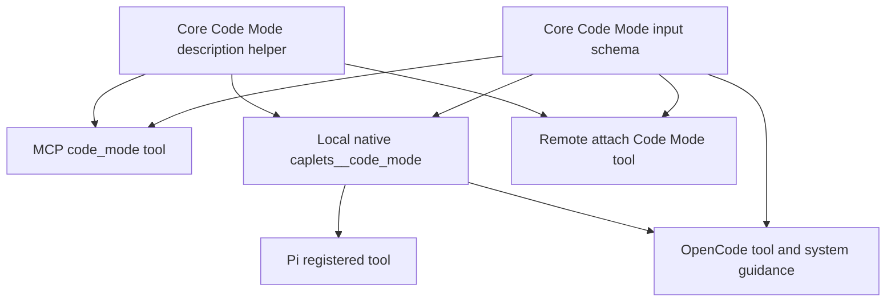

# feat: Teach Code Mode REPL reuse at the tool surface

## Summary

Update the agent-facing Code Mode metadata so MCP, native, Pi, OpenCode, and remote attach surfaces teach the REPL reuse contract directly where agents inspect the tool. This plan does not change session runtime behavior; it makes the already-shipped `sessionId`, `meta.sessionId`, `sessionStatus`, and `recoveryRef` behavior obvious and tested.

---

## Problem Frame

Code Mode now supports reusable live sessions, but the tool description and input schema still describe `sessionId` generically. Agents can see that a field exists, yet they are not told when to omit it, when to pass it back, which bindings survive, what happens for unknown IDs, or how recovery metadata should be used.

The requirements call out this gap directly: REPL reuse only creates value when agents can infer the workflow from tool metadata and native prompt guidance before they decide how to call Code Mode.

---

## Requirements

### Agent Guidance Contract

- R1. The generated Code Mode tool description teaches agents to omit `sessionId` for a fresh reusable session, capture `meta.sessionId`, and pass it back for later reuse.
- R2. The description names the live-state boundary: successful top-level `var` bindings, function declarations, and runtime state survive only while the live session remains available and compatible.
- R3. The `sessionId` input schema description states that known IDs reuse existing REPL state and unknown or unavailable IDs fail before execution instead of starting an empty context.
- R4. Recovery guidance states that `recoveryRef` is for audit and manual reconstruction, not automatic replay.
- R5. One-shot usage remains simple: agents may omit `sessionId` when reuse is not useful.

### Surface Parity

- R6. MCP and local native Code Mode expose the same reuse guidance through the shared generated description and schema.
- R7. Remote attach and composite native Code Mode surfaces preserve the same schema wording and prompt guidance when Code Mode handles are advertised through remote manifests.
- R8. Pi tool definitions receive the updated description, prompt guidelines, and Code Mode input parameters without integration-specific rewrites.
- R9. OpenCode receives `sessionId` in its Code Mode args and includes the updated system/tool guidance.

### Regression Coverage

- R10. Tests assert the generated tool description, `sessionId` JSON schema description, native prompt guidance, Pi registration, OpenCode args, and remote attach Code Mode metadata.
- R11. Existing behavior tests for session creation, reuse, unknown-session failure, recovery metadata, and one-shot Code Mode remain behavioral source of truth.

---

## Key Technical Decisions

- KTD1. **Keep the guidance centralized in Core.** The shared Code Mode description and input schema live in `packages/core/src/code-mode/declarations.ts` and `packages/core/src/code-mode/tool.ts`; MCP, native, Pi, OpenCode, and remote surfaces should consume that wording instead of each package inventing its own contract.
- KTD2. **Add a small reusable prompt-guidance helper.** Native Code Mode prompt guidance should come from Core alongside the description so local native, remote composite, Pi, and OpenCode get the same short reuse instructions.
- KTD3. **Prefer contract tests over broad documentation churn.** The requirements explicitly target tool metadata and native prompt guidance, so the durable protection is in generated-description and integration tests. Human-facing docs can follow later if product docs need a separate editing pass.
- KTD4. **Keep guidance factual about best-effort live state.** The wording should not imply durable heap persistence. It should say reuse works while the live session remains available and compatible, and that starting fresh means omitting `sessionId`.
- KTD5. **Make OpenCode args honor the Core schema.** OpenCode currently hardcodes Code Mode args without `sessionId`; the plan should either add `sessionId` there or route through the same schema-conversion path used for JSON-schema-backed tools.

---

## High-Level Technical Design

The design keeps the agent-facing contract in Core, then verifies that every integration receives it through its normal registration path.

---

## Scope Boundaries

### In Scope

- Update generated Code Mode tool description wording.
- Update `sessionId` descriptions in Zod and JSON schemas.
- Update native system and prompt guidance for `caplets__code_mode`.
- Ensure remote attach Code Mode tools preserve the same schema and guidance.
- Ensure Pi and OpenCode expose the updated metadata and `sessionId` argument.
- Add focused regression tests for these surfaces.

### Deferred to Follow-Up Work

- Broad human-facing docs rewrites outside the exposed agent guidance.
- New reset, list, or recent-session lookup tools.
- Changes to session runtime behavior, TTL, journals, or durable heap persistence.
- New live eval tasks or benchmark result claims.

---

## System-Wide Impact

This change affects public agent-facing contracts without changing runtime semantics. Any model that reads the MCP tool definition, native tool metadata, Pi prompt guidelines, or OpenCode tool args should learn the same reuse workflow. The implementation also reduces future drift by making metadata tests fail when one integration loses `sessionId` or describes reuse differently.

---

## Implementation Units

### U1. Core Code Mode Reuse Wording

**Goal:** Put the reusable-session contract in the shared Code Mode description and schema.

**Requirements:** R1, R2, R3, R4, R5, R6, R10, R11.

**Dependencies:** None.

**Files:**

- `packages/core/src/code-mode/declarations.ts`
- `packages/core/src/code-mode/tool.ts`
- `packages/core/test/code-mode-declarations.test.ts`
- `packages/core/test/code-mode-mcp.test.ts`

**Approach:** Extend `generateCodeModeRunToolDescription()` with a concise REPL reuse paragraph before the generated declaration block. Update the Zod and JSON schema description for `sessionId` to state that known IDs reuse existing live REPL state and missing IDs fail. Keep the existing one-pass workflow guidance intact, but make clear that reusable sessions are optional and starting fresh means omitting `sessionId`.

**Patterns to follow:** The current generated-description test already asserts key guidance phrases without snapshotting the full string. Keep that shape and add phrase-level assertions for `meta.sessionId`, `sessionStatus`, `recoveryRef`, unknown-session failure, and live-session state.

**Test scenarios:**

- Covers AE10. A generated Code Mode tool description includes the create, capture, reuse, unknown-failure, and recovery guidance in agent-facing language.
- Covers AE10. The MCP `code_mode` tool definition includes the new description and keeps generated declaration hints present.
- Covers AE10. The MCP input schema for `sessionId` says reuse requires a known live session and unknown IDs fail before execution.
- Regression path: one-shot wording remains present so agents are not told every Code Mode call must use sessions.

**Verification:** The generated declaration and MCP tests prove the shared description and schema teach the reuse contract while preserving existing Code Mode guidance.

### U2. Native And Remote Prompt Guidance

**Goal:** Teach the same reuse workflow through native Code Mode prompt guidance and remote attach metadata.

**Requirements:** R1, R3, R4, R5, R6, R7, R10.

**Dependencies:** U1.

**Files:**

- `packages/core/src/native/tools.ts`
- `packages/core/src/native/service.ts`
- `packages/core/src/native/remote.ts`
- `packages/core/test/native.test.ts`
- `packages/core/test/native-remote.test.ts`

**Approach:** Add a Core-owned Code Mode prompt-guidance helper that native system guidance and `codeModeRunNativeTool()` use. Apply equivalent guidance when `remoteToolToNativeTool()` maps an advertised remote Code Mode tool and when `toolsFromManifest()` synthesizes the attached Code Mode run tool. Ensure remote descriptions do not overwrite the richer Core description with a generic "Remote Caplets" sentence.

**Patterns to follow:** Existing `nativeCapletsSystemGuidance()` and `codeModeRunNativeTool()` already centralize native copy. Existing native and remote tests inspect tool lists and schema properties without requiring live backend calls.

**Test scenarios:**

- Covers AE10. Local native `caplets__code_mode` prompt guidance tells agents to omit `sessionId` for fresh sessions and reuse `meta.sessionId`.
- Covers AE10. Native system guidance includes the REPL reuse contract for `caplets__code_mode`.
- Covers AE10. Remote attach Code Mode tools expose the same `sessionId` schema description and prompt guidance after manifest mapping.
- Regression path: remote composite Code Mode still scopes callable Caplets correctly and existing session reuse behavior remains covered by current native-remote tests.

**Verification:** Native and native-remote tests prove local and attached native surfaces receive the same agent-facing contract from Core.

### U3. Pi Integration Metadata

**Goal:** Verify Pi receives the updated Code Mode description, prompt guidelines, and `sessionId` input parameter through normal native tool registration.

**Requirements:** R8, R10.

**Dependencies:** U2.

**Files:**

- `packages/pi/src/index.ts`
- `packages/pi/test/pi.test.ts`

**Approach:** Prefer no Pi-specific implementation change if Core metadata flows through `createPiTool()` automatically. Add a focused test using a realistic Code Mode native tool object from Core-shaped metadata, then assert Pi registers the description, prompt guidelines, and parameters with the reuse contract intact. Only adjust `piToolSignature()` or `createPiTool()` if stale signature comparison or parameter handling drops the updated fields.

**Patterns to follow:** `packages/pi/test/pi.test.ts` already captures registered tool definitions and asserts prompt guidelines, descriptions, and parameters.

**Test scenarios:**

- Covers AE10. A Pi-registered Code Mode tool exposes `sessionId` in parameters.
- Covers AE10. The Pi tool description and prompt guidelines include create, reuse, unknown-failure, and recovery guidance.
- Regression path: metadata updates still refresh an existing Pi tool definition when prompt guidance changes.

**Verification:** Pi tests prove the integration surfaces Core metadata rather than losing reuse guidance at registration time.

### U4. OpenCode Args And Guidance

**Goal:** Ensure OpenCode exposes `sessionId` as a Code Mode argument and includes the updated reuse guidance in tool/system metadata.

**Requirements:** R9, R10.

**Dependencies:** U2.

**Files:**

- `packages/opencode/src/schema.ts`
- `packages/opencode/src/hooks.ts`
- `packages/opencode/README.md`
- `packages/opencode/test/opencode.test.ts`

**Approach:** Add optional `sessionId` to `capletsOpenCodeRunArgs()` or route Code Mode args through the existing JSON-schema conversion path. Keep the tool description sourced from the native tool description. Add test assertions for the `sessionId` arg and system guidance, and update the package README only where it explains `caplets__code_mode` usage.

**Patterns to follow:** Existing OpenCode tests inspect generated hook tools and transformed system guidance. The README already has a short Code Mode paragraph that can accept one sentence about optional reuse.

**Test scenarios:**

- Covers AE10. The OpenCode `caplets__code_mode` tool args include optional `sessionId`.
- Covers AE10. OpenCode tool description and system guidance include the reuse contract.
- Regression path: non-Code Mode direct and progressive tool args continue using their existing schema paths.
- Documentation path: the OpenCode README describes optional `sessionId` reuse without implying durable persistence.

**Verification:** OpenCode tests and README formatting prove the integration exposes the same reuse affordance as MCP/native.

### U5. Focused Verification And Drift Guard

**Goal:** Run the smallest useful verification set for the metadata change and document any intentionally deferred broader checks.

**Requirements:** R10, R11.

**Dependencies:** U1, U2, U3, U4.

**Files:**

- `packages/core/test/code-mode-declarations.test.ts`
- `packages/core/test/code-mode-mcp.test.ts`
- `packages/core/test/native.test.ts`
- `packages/core/test/native-remote.test.ts`
- `packages/pi/test/pi.test.ts`
- `packages/opencode/test/opencode.test.ts`

**Approach:** Keep the verification focused on metadata and integration registration because behavior tests already cover runtime reuse. Run package-level tests for Core, Pi, and OpenCode, and run formatting checks for changed docs/code. Do not run live Pi eval for this plan because no benchmark behavior changes.

**Patterns to follow:** Repo guidance prefers focused package tests for package-scoped changes and treats live benchmarks as opt-in, local, model-dependent evidence.

**Test scenarios:**

- Happy path: all changed metadata surfaces contain the reuse contract.
- Edge path: no integration loses `sessionId` while converting schemas into host-specific tool args.
- Regression path: existing runtime behavior tests still prove create, reuse, unknown-session failure, and recovery metadata.
- Scope path: no tests or docs claim automatic journal replay or durable heap persistence.

**Verification:** Focused Core, Pi, and OpenCode test files pass, and formatting checks pass for changed files.

---

## Acceptance Examples

- AE10. Given an agent inspects Code Mode through MCP, when it reads the tool description and schema, then it can infer how to start fresh, reuse `meta.sessionId`, and recover from missing live state.
- AE10. Given an agent uses Pi or OpenCode, when native prompt guidance is injected, then the guidance teaches the same reuse workflow as MCP.
- AE10. Given an agent has stale or unknown session state, when it reads the exposed guidance, then it expects failure before execution and uses recovery metadata only for audit or manual reconstruction.

---

## Risks & Dependencies

- **Overlong tool descriptions:** Code Mode descriptions already carry dense guidance and generated declarations. Keep the REPL paragraph short and test for important phrases rather than adding a long tutorial.
- **Integration drift:** OpenCode currently hardcodes Code Mode args, so it can miss new Core schema fields. U4 closes the immediate `sessionId` gap; future schema drift may warrant a shared conversion helper.
- **Overclaiming persistence:** Wording must say live session state is best-effort and process-local. Recovery metadata is not replay and not durable heap restore.
- **Remote ambiguity:** Remote attach Code Mode runs locally against remote handles. Guidance should describe Code Mode session reuse, not server-side Cloud heap continuity.

---

## Sources & Research

- `docs/brainstorms/2026-06-17-code-mode-repl-sessions-requirements.md` for the origin requirements, especially R18, R22-R25, R27, F6, and AE10.
- `docs/plans/2026-06-17-002-feat-code-mode-repl-sessions-plan.md` for the broader REPL-session implementation boundaries and existing behavior coverage.
- `docs/solutions/architecture-patterns/code-mode-repl-sessions.md` for the live-state plus recovery-journal architecture pattern.
- `CONCEPTS.md` for project vocabulary around Code Mode Sessions, Recovery Journals, and Recovery References.
- `packages/core/src/code-mode/declarations.ts` and `packages/core/src/code-mode/tool.ts` for the shared generated tool description and schema.
- `packages/core/src/native/tools.ts`, `packages/core/src/native/service.ts`, and `packages/core/src/native/remote.ts` for native and remote Code Mode metadata propagation.
- `packages/pi/src/index.ts` and `packages/opencode/src/schema.ts` / `packages/opencode/src/hooks.ts` for host-specific registration behavior.
