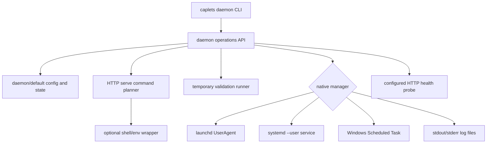
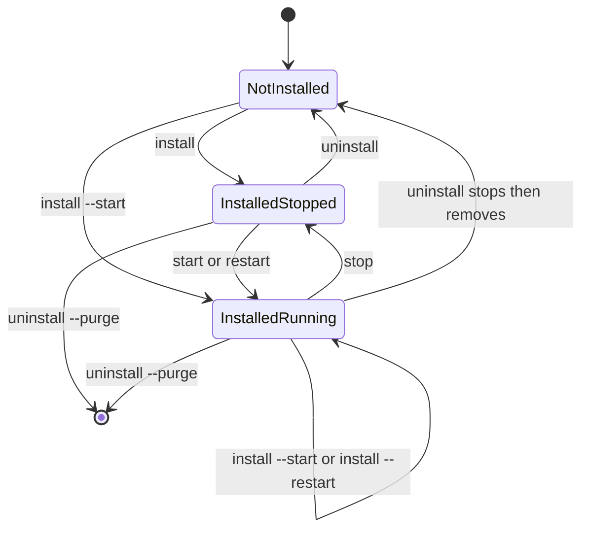
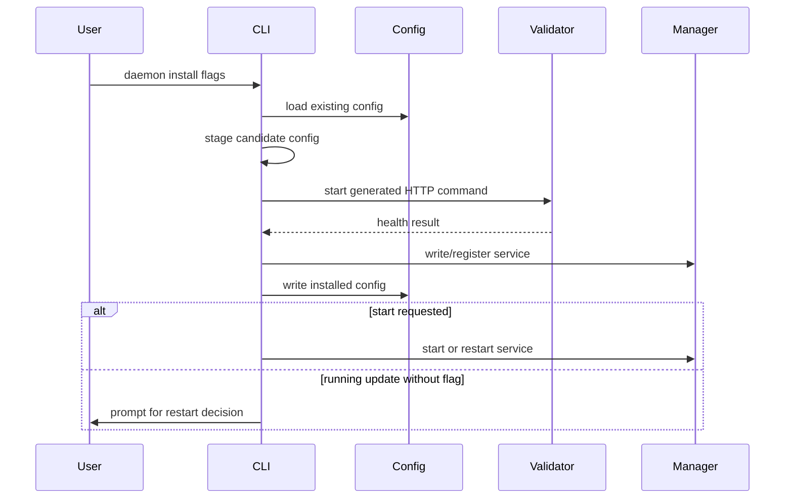

# feat: Move daemon management to native Caplets services

## Summary

Move daemon lifecycle from `caplets serve ...` to a top-level `caplets daemon ...` command that installs and controls a per-user native service for local HTTP `caplets serve`. The implementation should preserve existing HTTP serve option behavior, add install-time service configuration and environment controls, and route runtime lifecycle through launchd, systemd user services, or Windows Scheduled Tasks.

---

## Problem Frame

The current daemon implementation is exposed as nested `serve` subcommands and is mostly a detached Node process with descriptor generation bolted on. The requirements call for a daemon product surface with native service manager ownership, durable install-time configuration, shell/env inheritance, validation, status health probing, and tail-like logs (see origin: `docs/brainstorms/2026-06-19-caplets-daemon-service-requirements.md`).

This matters to the Caplets strategy because reliable local runtime setup and diagnosability are part of making Code Mode and native agent surfaces dependable without forcing users into hosted Cloud.

---

## Requirements

**CLI surface**

- R1. `caplets daemon` exposes `install`, `uninstall`, `start`, `restart`, `stop`, `status`, and `logs`, with `--json` on every daemon subcommand.
- R2. `caplets serve` keeps foreground stdio/HTTP serving only and no longer exposes daemon lifecycle commands.
- R3. `caplets daemon install` accepts HTTP serve configuration flags except `--transport`, and Commander rejects any daemon `--transport` usage.

**Persistent daemon configuration**

- R4. Install writes a default per-user service identity under `daemon/default`, uses the user's home directory as the service working directory, and ignores old `serve/default` state.
- R5. Install updates preserve omitted persisted values, `--reset` rebuilds from defaults, and only install can mutate service config.
- R6. Install supports repeatable `--env KEY=VALUE`, repeatable `--unset-env KEY`, `--inherit-env`, and `--no-inherit-env` with deterministic merge precedence.

**Native service management**

- R7. Caplets registers, starts, restarts, stops, queries, and unregisters the daemon through the native per-user service manager only.
- R8. Unsupported platforms and unavailable per-user service managers fail with actionable messages and no detached-process fallback.
- R9. Runtime lifecycle commands fail with install guidance when the service is not installed, then behave idempotently once it is installed.

**Validation, status, and logs**

- R10. Install validates by starting the generated command temporarily and probing HTTP health unless `--no-validate` or `--dry-run` applies.
- R11. Status succeeds even before install by reporting uninstalled state, and reports native running state, HTTP health when running, installed config, and stdout/stderr log paths when available.
- R12. Logs are Caplets-managed user-only files with `logs --tail <lines>`, `--follow`, and `--stream stdout|stderr|all`; logs remain readable after uninstall unless purged.

**Uninstall and cleanup**

- R13. Uninstall stops a running service before unregistering and removing service artifacts.
- R14. Uninstall preserves logs/state by default, while `--purge` removes daemon config, state, and logs.
- R15. Dry-run modes preview install, uninstall, and purge actions without registration, file mutation, process startup, or validation.

---

## Key Technical Decisions

- KTD1. **Move daemon orchestration out of `serve`:** Keep HTTP server option resolution in `serve/options.ts`, but move daemon orchestration and exports into a daemon-focused module. This preserves the existing foreground server contract while making the CLI surface match the product concept.
- KTD2. **Model install separately from runtime lifecycle:** `install` owns persisted serve flags, env settings, shell inheritance, descriptor content, validation, and optional start/restart decisions. `start`, `restart`, `stop`, and `status` read the installed service and do not apply new config.
- KTD3. **Introduce a native manager seam:** Platform descriptors alone are not enough because install/start/status/uninstall semantics differ across launchd, systemd, and Scheduled Tasks. A manager interface with injectable command execution lets tests cover native behavior without registering live OS services.
- KTD4. **Generate an internal HTTP serve command without daemon `--transport`:** The public daemon CLI never accepts `--transport`, but the managed process can still invoke foreground `caplets serve --transport http` internally. This keeps the daemon fail-closed while reusing the existing HTTP server entrypoint.
- KTD5. **Persist env intent, not ambient snapshots:** `--inherit-env` stores shell-wrapper intent and explicit `--env` entries store service env overrides. This avoids capturing stale terminal environment values while letting Caplets validate the same wrapper path it will install.
- KTD6. **Validate command preflight before registration:** Install should prove that the generated command starts and responds on the configured health route derived from `servicePaths(resolved.path).health` before registering the native service. `--dry-run` remains pure preview and `--no-validate` is the explicit escape hatch.
- KTD7. **Make logs file-backed and manager-independent:** Service descriptors or platform wrappers redirect stdout/stderr to Caplets-managed files. `caplets daemon logs` reads those files rather than depending on `journalctl`, `log stream`, or Event Viewer.
- KTD8. **Treat stdout and stderr as selected log streams:** `logs --stream all` should behave like tailing multiple files with stream labels or headers, not promise perfect chronological interleaving across two independent files.
- KTD9. **Normalize native state without hiding platform details:** The daemon manager should return normalized states for CLI behavior while preserving raw launchd, systemd, or Scheduled Task details for status JSON and troubleshooting.

---

## High-Level Technical Design







---

## Output Structure

The implementation may adjust exact file names, but the plan expects daemon-specific code to live outside the foreground `serve` module while reusing HTTP serve option resolution.

```text
packages/core/src/daemon/
  config.ts
  env.ts
  index.ts
  logs.ts
  manager.ts
  paths.ts
  platform-darwin.ts
  platform-linux.ts
  platform-windows.ts
  process.ts
  types.ts
  validation.ts
```

## Native Manager Contract

The implementation should keep platform command details behind the daemon manager interface, but the plan expects the following contracts to be explicit and test-covered.

| Platform                | Install/Register                                                                                                                                                                                                                 | Start/Restart                                                                          | Stop                                                                                  | Status                                                                                                                             | Uninstall                                                                                        |
| ----------------------- | -------------------------------------------------------------------------------------------------------------------------------------------------------------------------------------------------------------------------------- | -------------------------------------------------------------------------------------- | ------------------------------------------------------------------------------------- | ---------------------------------------------------------------------------------------------------------------------------------- | ------------------------------------------------------------------------------------------------ |
| macOS launchd           | Write `~/Library/LaunchAgents/dev.caplets.daemon.default.plist`, then `launchctl bootstrap gui/$UID <plist>` or a reload sequence when already bootstrapped.                                                                     | `launchctl kickstart -k gui/$UID/dev.caplets.daemon.default` for start/restart.        | Stop the loaded job without unregistering it, then treat already-stopped as success.  | `launchctl print gui/$UID/dev.caplets.daemon.default`; parse PID, exit status, and missing-service errors.                         | Stop if needed, `launchctl bootout gui/$UID <plist-or-label>`, then remove descriptor artifacts. |
| Linux systemd user      | Write `~/.config/systemd/user/caplets-daemon-default.service`, `systemctl --user daemon-reload`, then `systemctl --user enable caplets-daemon-default.service`.                                                                  | `systemctl --user start` or `restart caplets-daemon-default.service`.                  | `systemctl --user stop caplets-daemon-default.service`, treating inactive as success. | `systemctl --user show caplets-daemon-default.service` and `is-active`; preserve raw state fields.                                 | Stop if needed, `systemctl --user disable`, remove unit, then `daemon-reload`.                   |
| Windows Scheduled Tasks | Register a current-user, non-elevated `\Caplets\daemon-default` task with an ONLOGON trigger, no execution time limit, wrapper-enforced cwd/log redirection, and restart-on-failure settings when supported by XML registration. | `schtasks /Run /TN \Caplets\daemon-default`; restart ends the task first when running. | `schtasks /End /TN \Caplets\daemon-default`, treating not-running as success.         | `schtasks /Query /TN \Caplets\daemon-default /FO LIST /V`; map Ready, Running, Disabled, Last Run Result, and missing-task states. | End if needed, then `schtasks /Delete /TN \Caplets\daemon-default /F`.                           |

The normalized status model should include at least `not_installed`, `installed_stopped`, `running`, `failed`, `unavailable`, and `unknown`, plus raw native state details. Runtime lifecycle commands may use the normalized state for idempotency, but status JSON must retain the raw details so platform-specific failures stay actionable.

---

## Implementation Units

### U1. Move the CLI surface to `caplets daemon`

- **Goal:** Add the top-level daemon command and remove daemon lifecycle subcommands from `serve`.
- **Requirements:** R1, R2, R3; origin R1-R6, AE1, AE3.
- **Dependencies:** None.
- **Files:** `packages/core/src/cli/commands.ts`, `packages/core/src/cli.ts`, `packages/core/src/cli/completion.ts`, `packages/core/test/daemon-cli.test.ts`, `packages/core/test/cli-completion.test.ts`, `packages/core/test/serve-daemon.test.ts`.
- **Approach:** Add `daemon` to the command registry and static completion tables. Replace the current `addServeDaemonCommand` wiring with daemon-specific subcommand wiring where only `install` accepts HTTP serve flags. Do not register `enable` or `disable`, and do not register aliases. Leave `serve` with only foreground `--transport stdio|http` behavior. Removed `serve` daemon subcommands should fail with command-specific migration guidance pointing to `caplets daemon ...`, without mutating daemon state.
- **Patterns to follow:** Existing Commander setup in `packages/core/src/cli.ts`; static subcommand completion in `packages/core/src/cli/commands.ts`; focused CLI assertions in `packages/core/test/cli-completion.test.ts`.
- **Test scenarios:**
  - Covers AE1. Running daemon help lists `install`, `uninstall`, `start`, `restart`, `stop`, `status`, and `logs`.
  - Covers AE1. Running serve help does not list daemon lifecycle subcommands.
  - Covers AE3. `caplets daemon install --transport http` fails before writing service artifacts.
  - `caplets daemon enable` and `caplets daemon disable` fail as unknown commands.
  - `caplets serve start|stop|status|restart|enable|disable` fails with migration guidance to the corresponding `caplets daemon ...` command and performs no daemon mutation.
  - Every daemon subcommand is registered with `--json`; successful JSON payload assertions live with the units that implement those commands.
  - Completion suggests `daemon` as a top-level command and daemon subcommands under `daemon`.
- **Verification:** The CLI exposes the new surface, the old surface is absent, and completion output matches registered commands.

### U2. Establish daemon identity, paths, and persistent config merging

- **Goal:** Replace `serve/default` daemon artifacts with `daemon/default` config, state, logs, and service artifact paths.
- **Requirements:** R4, R5, R6, R15; origin R7-R15, R22-R31, AE2, AE5, AE9.
- **Dependencies:** U1.
- **Files:** `packages/core/src/daemon/types.ts`, `packages/core/src/daemon/paths.ts`, `packages/core/src/daemon/config.ts`, `packages/core/src/serve/daemon/types.ts`, `packages/core/src/serve/daemon/paths.ts`, `packages/core/src/serve/daemon/config.ts`, `packages/core/test/daemon-config.test.ts`, `packages/core/test/serve-daemon.test.ts`.
- **Approach:** Create a daemon config model that stores instance, HTTP serve options, command plan, env overrides, inherit-env setting, resolved service paths, and timestamps. Move path resolution to `daemon/default` on every platform. Implement merge behavior for existing install config, `--reset`, `--env`, and `--unset-env`; apply unsets before env sets.
- **Patterns to follow:** Current JSON config/state helpers in `packages/core/src/serve/daemon/config.ts`; default config/state root helpers from `packages/core/src/config/paths`.
- **Test scenarios:**
  - Linux and macOS paths resolve to config/state/log locations under `caplets/daemon/default`.
  - Windows paths resolve to `Caplets/State/daemon/default` and `Caplets/daemon/default.json`.
  - Existing `serve/default` files are ignored when daemon status or install runs.
  - Generated install config records the user's home directory as the service working directory.
  - Reinstall without flags preserves previous host, port, path, auth, env, and inherit-env settings.
  - `--reset` clears previous persisted values before applying current flags.
  - `--env NAME=value=with=equals` preserves everything after the first `=`.
  - `--env EMPTY=` stores an empty value.
  - Invalid env names and env values without `=` fail before config mutation.
  - `--unset-env PATH --env PATH=/custom/bin` stores the explicit env value.
- **Verification:** Persisted daemon config is stable, platform paths use the new identity, and config merge semantics match the origin requirements.

### U3. Add native service manager operations

- **Goal:** Replace detached-process lifecycle with a native per-user manager abstraction for launchd, systemd user services, and Windows Scheduled Tasks.
- **Requirements:** R7, R8, R9, R13, R15; origin R6, R35-R44, AE7, AE9.
- **Dependencies:** U2.
- **Files:** `packages/core/src/daemon/manager.ts`, `packages/core/src/daemon/platform-darwin.ts`, `packages/core/src/daemon/platform-linux.ts`, `packages/core/src/daemon/platform-windows.ts`, `packages/core/src/daemon/process.ts`, `packages/core/src/daemon/index.ts`, `packages/core/test/daemon-manager.test.ts`, `packages/core/test/daemon-platform.test.ts`.
- **Approach:** Define a manager interface for normalized state, raw native details, install, uninstall, start, restart, stop, and descriptor rendering. Use injectable process execution so tests can assert launchd, systemd, and `schtasks` commands without mutating the host. Unsupported platforms and unavailable Linux user services should return Caplets errors rather than manual descriptors. Implement the command matrix above before wiring CLI behavior so install/start/status/uninstall semantics do not drift by platform.
- **Patterns to follow:** Existing platform descriptor builders in `packages/core/src/serve/daemon/platform-*.ts`; dependency injection style from current daemon tests.
- **Test scenarios:**
  - macOS descriptors use `dev.caplets.daemon.default` and launchd UserAgent stdout/stderr paths.
  - macOS descriptors include a working-directory setting for the user's home directory.
  - Linux descriptors use `caplets-daemon-default.service`, a systemd user unit, log paths, and a working-directory setting.
  - Windows descriptors use a Caplets daemon task name, current-user ONLOGON trigger, no elevated/system context, no execution time limit, restart-on-failure settings when supported, and wrapper-level cwd/log behavior.
  - Install writes descriptor artifacts and invokes the native register command.
  - Unavailable Linux user services fail with actionable install guidance.
  - Unsupported platforms fail without detached process fallback.
  - Runtime `start`, `restart`, and `stop` fail with install guidance when manager state is not installed.
  - Runtime `start` succeeds when already running, `restart` starts when stopped, and `stop` succeeds when already stopped.
  - Manager status maps failed systemd units, loaded-but-exited launchd jobs, stale descriptors, unavailable user services, and Scheduled Task Ready/Running/Last Result states into normalized state plus raw details.
- **Verification:** Every lifecycle operation routes through the native manager seam and can be tested without live OS service registration.

### U4. Build service command, shell inheritance, and env override planning

- **Goal:** Generate the managed HTTP serve command and optional shell wrapper from persisted install-time configuration.
- **Requirements:** R3, R6, R10; origin R11, R22-R34, AE2, AE5.
- **Dependencies:** U2, U3.
- **Files:** `packages/core/src/daemon/env.ts`, `packages/core/src/daemon/process.ts`, `packages/core/src/daemon/types.ts`, `packages/core/src/serve/options.ts`, `packages/core/test/daemon-env.test.ts`, `packages/core/test/serve-options.test.ts`.
- **Approach:** Add a daemon-only raw serve option shape that omits `transport`, then force HTTP internally when resolving serve options. Generate a command plan that records executable, args, working directory, env overrides, and shell-wrapper metadata. On macOS and Linux, resolve shell fallback from `SHELL`, account shell when discoverable, `/bin/sh`, then failure. On Windows, resolve `SHELL`, PowerShell, then `ComSpec` or `cmd.exe`.
- **Patterns to follow:** Existing `resolveDaemonServeOptions` default-to-HTTP behavior, but with no public daemon `transport` input; existing process command planner in `packages/core/src/serve/daemon/process.ts`.
- **Test scenarios:**
  - Daemon install accepts every HTTP serve flag except `--transport` and persists the resolved HTTP serve config.
  - Generated command invokes foreground HTTP serve internally.
  - The command plan enforces the user's home directory as cwd on every supported platform, including platforms that need a wrapper to do it.
  - The command plan redirects stdout/stderr to Caplets log files on every supported platform, including platforms without native descriptor fields.
  - Explicit env overrides are present in the command plan and override inherited shell values.
  - `--no-inherit-env` removes existing shell inheritance from persisted config.
  - macOS/Linux shell fallback uses `SHELL`, then account shell, then `/bin/sh`.
  - Windows shell fallback uses `SHELL`, then PowerShell, then `ComSpec` or `cmd.exe`.
  - Missing shell fallback produces an actionable error when inherit-env is requested.
- **Verification:** Command plans are deterministic and platform-specific shell behavior is covered by unit tests.

### U5. Implement install, update, validation, and restart prompting

- **Goal:** Make `caplets daemon install` the only mutating configuration entrypoint and validate generated service commands before native registration.
- **Requirements:** R5, R6, R10, R15; origin R12-R21, R32-R34, AE2, AE4, AE6.
- **Dependencies:** U2, U3, U4.
- **Files:** `packages/core/src/daemon/index.ts`, `packages/core/src/daemon/validation.ts`, `packages/core/src/cli.ts`, `packages/core/src/serve/http.ts`, `packages/core/test/daemon-install.test.ts`, `packages/core/test/daemon-cli.test.ts`.
- **Approach:** Resolve install options, build an in-memory candidate config, generate the command, and run validation before registration unless skipped. Validation should start a temporary HTTP process with the same command/env/shell path and probe the configured health route from `servicePaths(resolved.path).health`; when the installed daemon already owns the target port, validate on a temporary loopback port while preserving the rest of the plan. Write descriptor artifacts, register through the native manager, then commit the daemon config only after native registration succeeds. After updating a running service, prompt interactively for restart unless `--start`, `--restart`, or `--no-restart` decides it.
- **Execution note:** Add characterization coverage around current daemon start/status behavior before replacing it with native-manager install semantics.
- **Patterns to follow:** Existing health endpoint in `packages/core/src/serve/http.ts`; existing CLI prompt helper pattern in setup commands; existing `fetch` timeout style in HTTP action code.
- **Test scenarios:**
  - Covers AE2. `install --dry-run` returns descriptor, config, env, log paths, and planned actions without writing files, registering, or validating.
  - `install --json` returns structured action, config, validation, and native registration details on successful paths.
  - `install --no-validate` writes and registers without launching the validation process.
  - Successful validation starts a temporary generated command, probes health, then stops it before registration.
  - Validation failure stops the temporary process and leaves prior installed config untouched.
  - Validation and status use the configured base path, e.g. `--path /caplets` probes `/caplets/v1/healthz`.
  - Descriptor write failure, native register failure, and partial native registration rollback leave prior installed config untouched.
  - Covers AE6. Validation uses a temporary loopback port when the existing running daemon occupies the configured port.
  - `--start`, `--restart`, and `--no-restart` are mutually exclusive.
  - Updating a running service interactively prompts for restart after writing config.
  - Updating a running service in noninteractive mode fails unless a restart decision flag is supplied.
  - `install --start` starts when stopped and restarts when running, then reports a distinct native-start health failure if the manager-started service fails its health probe.
  - `install --restart` restarts after update and probes the manager-started service; `install --no-restart` leaves the running service unchanged.
- **Verification:** Install behavior is atomic around validation, restart decisions are explicit, and dry-run remains side-effect free.

### U6. Implement runtime lifecycle, status, and doctor integration

- **Goal:** Make runtime commands operate only against installed native services and report native state plus HTTP health.
- **Requirements:** R1, R7, R8, R9, R11; origin R35-R47, AE7.
- **Dependencies:** U3, U5.
- **Files:** `packages/core/src/daemon/index.ts`, `packages/core/src/daemon/manager.ts`, `packages/core/src/cli/doctor.ts`, `packages/core/src/cli.ts`, `packages/core/test/daemon-lifecycle.test.ts`, `packages/core/test/daemon-cli.test.ts`, `packages/core/test/doctor-cli.test.ts`.
- **Approach:** Implement `start`, `restart`, and `stop` as manager operations that first verify installed state. Status should succeed even when no service is installed, ask the manager for installed/running state when available, probe the configured health route only when running, include log paths, and render JSON without losing manager details. Update doctor diagnostics to read daemon status instead of returning static daemon data.
- **Patterns to follow:** Current doctor section formatting in `packages/core/src/cli/doctor.ts`; current daemon status redaction helper if retained for existing config output.
- **Test scenarios:**
  - Covers AE7. Runtime lifecycle commands fail with install guidance when service is not installed.
  - `status --json` before install succeeds with `installed: false`, `running: false`, no HTTP health probe, and expected log paths where available.
  - Installed `start` invokes the native manager and reports success.
  - Installed `restart` starts a stopped service and restarts a running service.
  - Installed `stop` succeeds when stopped and stops when running.
  - `start --json`, `restart --json`, and `stop --json` report the action taken and native manager state.
  - `status --json` distinguishes installed, running, HTTP health, config, and log paths.
  - Status does not probe HTTP health when the manager reports stopped.
  - Doctor JSON includes daemon installed/running/health/log-path data.
  - Plain doctor output shows daemon installed/running state without exposing static placeholder values.
- **Verification:** Runtime lifecycle no longer mutates install config and status reflects the native manager as source of truth.

### U7. Implement logs, uninstall, and purge behavior

- **Goal:** Add tail-like daemon log inspection and complete uninstall semantics.
- **Requirements:** R12, R13, R14, R15; origin R40-R44, R48-R53, AE8, AE9.
- **Dependencies:** U2, U3, U6.
- **Files:** `packages/core/src/daemon/logs.ts`, `packages/core/src/daemon/index.ts`, `packages/core/src/cli.ts`, `packages/core/test/daemon-logs.test.ts`, `packages/core/test/daemon-uninstall.test.ts`, `packages/core/test/daemon-cli.test.ts`.
- **Approach:** Implement file-backed log reading with stream selection, default last 10 lines, `--tail <lines>`, `--follow`, and `--tail 0 --follow`. Finite `logs --json` should return one JSON envelope with stream-labeled entries and paths; `logs --json --follow` should emit newline-delimited JSON events after an initial metadata event. Implement uninstall to stop running services before unregistering and deleting descriptor artifacts. Preserve logs/state by default, make log directories and files user-only, and make `--purge` remove config, state, and logs after unregistering.
- **Patterns to follow:** Caplets log-store tests for file-backed behavior; Node stream and filesystem helpers already used in daemon/process code.
- **Test scenarios:**
  - Covers AE8. `logs` reads preserved stdout/stderr logs after uninstall without purge.
  - Missing selected logs print an empty-state message with expected paths.
  - `logs` defaults to the last 10 lines across selected streams.
  - `logs --stream all` includes both streams with deterministic stream labels or headers and does not claim strict cross-file chronological ordering.
  - `logs --tail 0 --follow` emits only appended lines.
  - `logs --json --follow` emits NDJSON metadata and appended log events rather than waiting forever for a single JSON result.
  - `--stream stdout`, `--stream stderr`, and `--stream all` select the expected files.
  - `uninstall` stops a running service before unregistering.
  - `logs --json` and `uninstall --json` return structured log entries or cleanup actions for finite, successful paths.
  - `uninstall` preserves logs and historical state by default.
  - Log directories and files are created with user-only permissions and documented as potentially sensitive because no log redaction is promised.
  - `uninstall --purge` removes descriptor artifacts, config, state, and all stdout/stderr logs.
  - `uninstall --dry-run --purge` lists every action and path without mutation.
- **Verification:** Log behavior matches tail-like semantics and uninstall cleanup preserves or purges state exactly as requested.

### U8. Update docs, public references, and release metadata

- **Goal:** Reflect the new daemon surface in durable docs and package release metadata.
- **Requirements:** R1, R2, R3, R8, R11, R12; origin success criteria.
- **Dependencies:** U1-U7.
- **Files:** `docs/architecture.md`, `docs/product/caplets-code-mode-prd.md`, `CONCEPTS.md`, `.changeset/*.md`, `packages/core/test/daemon-cli.test.ts`.
- **Approach:** Update architecture and product docs to describe `caplets daemon` as the service lifecycle surface and foreground `caplets serve` as stdio/HTTP serving only. Keep `CONCEPTS.md` glossary aligned with the Caplets Daemon definition. Add a changeset because this is user-facing CLI behavior in `@caplets/core`.
- **Patterns to follow:** Existing architecture doc source-authoritative posture; Changesets convention in the repo.
- **Test scenarios:**
  - CLI help assertions prove docs examples refer to commands that exist.
  - Generated docs checks pass after command surface updates.
  - Changeset status recognizes the package-impacting CLI change.
- **Verification:** Public docs, generated references, and package release metadata agree with the implemented command surface.

---

## Scope Boundaries

### In Scope

- Top-level `caplets daemon` command surface for the default per-user daemon.
- Native per-user launchd, systemd user service, and Windows Scheduled Task integration.
- Install-time HTTP serve config, explicit env overrides, shell inheritance, validation, status, logs, uninstall, and purge.
- Unit and integration tests using fake service managers and command runners.

### Deferred to Follow-Up Work

- Live OS smoke automation for actually registering launchd, systemd, or Scheduled Task services in CI.
- Migration or cleanup of historical `serve/default` daemon artifacts.
- Project-bound daemon instances.

### Outside This Feature

- Daemonizing stdio transport.
- Daemonizing `caplets attach` or arbitrary Caplets commands.
- System-wide or privileged service installation.
- Detached process fallback when native service management is unavailable.
- New secret storage, redaction, or auth mechanisms.

---

## System-Wide Impact

This change alters the exported CLI contract and shell completion surface. Scripts using `caplets serve start|stop|status|restart|enable|disable` will fail with command-specific migration guidance and should move to `caplets daemon ...`.

Daemon config and state paths intentionally move from `serve/default` to `daemon/default`, so existing local daemon state will not be discovered. Doctor output should become more accurate because daemon status will be sourced from the daemon subsystem instead of static placeholder data.

---

## Risks & Dependencies

- **Native manager semantics differ by platform:** systemd enable/start are separate, launchd bootstrap/kickstart/bootout target GUI/user domains, and Scheduled Tasks split create/run/end/delete. The manager seam must normalize Caplets behavior without hiding platform-specific failures.
- **Shell wrapper quoting is easy to get wrong:** inherited env requires platform-specific command quoting and precedence tests, especially for Windows PowerShell and `cmd.exe`.
- **Windows needs wrapper-level cwd and log handling:** Scheduled Tasks do not provide the same descriptor fields as launchd and systemd, so the command planner must enforce cwd and stdout/stderr redirection itself.
- **Validation can race with existing services:** the temporary-port path must avoid mutating persisted serve config while still proving the generated command shape.
- **Native-start health can fail after preflight succeeds:** manager execution domains differ from temporary validation, so `install --start` and `install --restart` need a second health result tied to the native-started service.
- **Preserved logs can contain sensitive process output:** the feature does not add redaction, so file permissions, documentation, and purge coverage are the primary controls for retained stdout/stderr data.
- **Follow mode can hang tests:** log-follow tests need injectable file watching or stream control so unit tests do not depend on timing-heavy real tails.
- **Noninteractive prompting must be explicit:** install updates on a running service need deterministic behavior when stdin is not interactive.

---

## Acceptance Examples

- AE1. `caplets daemon --help` shows daemon lifecycle commands and `caplets serve --help` does not.
- AE2. `caplets daemon install --dry-run --host 127.0.0.1 --port 5388 --path /caplets --inherit-env --env FOO=bar` previews planned service state without side effects.
- AE3. `caplets daemon install --transport http` fails without creating or updating service artifacts.
- AE4. Updating a running installed daemon writes config first, then restarts only after a confirmation or explicit restart decision flag.
- AE5. `--inherit-env` validation uses the service shell wrapper, and explicit `--env PATH=/custom/bin` wins for the Caplets process.
- AE6. Install validation can use a temporary loopback port when the live daemon owns the configured port, and health probes honor configured base paths such as `/caplets/v1/healthz`.
- AE7. Runtime lifecycle commands fail before install and are idempotent once installed, while `status` succeeds before install with uninstalled state.
- AE8. `caplets daemon logs` can read preserved logs after uninstall without purge.
- AE9. `caplets daemon uninstall --dry-run --purge` lists all unregister and removal actions without mutating anything.

---

## Documentation / Operational Notes

The implementation should document that `install` is the configuration mutation point and that lifecycle commands do not accept serve flags. The docs should also explain that `--inherit-env` runs through a user shell wrapper, explicit `--env` values override the inherited environment for the Caplets process, and preserved daemon logs may contain sensitive raw process output until `uninstall --purge` removes them.

Manual smoke after implementation should cover one platform at a time: install, status, logs, restart after config update, uninstall, and purge. CI should not register real user services.

---

## Sources / Research

- `docs/brainstorms/2026-06-19-caplets-daemon-service-requirements.md` defines the product requirements, flows, and acceptance examples.
- `STRATEGY.md` frames local runtime diagnosability as part of reliable Code Mode and native agent setup.
- `CONCEPTS.md` defines Caplets Daemon as the project vocabulary for this feature.
- `packages/core/src/cli.ts` currently wires daemon lifecycle under `serve`.
- `packages/core/src/cli/commands.ts` currently has no top-level `daemon` command and lists daemon subcommands under `serve`.
- `packages/core/src/serve/daemon/` contains the current config, path, descriptor, and detached process foundation to migrate or replace.
- `packages/core/test/serve-daemon.test.ts` captures current behavior that should be moved, rewritten, or intentionally deleted.
- [Apple Creating Launch Daemons and Agents](https://developer.apple.com/library/archive/documentation/MacOSX/Conceptual/BPSystemStartup/Chapters/CreatingLaunchdJobs.html) documents per-user LaunchAgents and required plist keys.
- [launchctl manual](https://keith.github.io/xcode-man-pages/launchctl.1.html) documents launchd domains, bootstrap/bootout, enable/disable, and kickstart behavior.
- [systemctl manual](https://www.man7.org/linux/man-pages/man1/systemctl.1.html) documents enable/start separation and user service management semantics.
- [Microsoft schtasks commands](https://learn.microsoft.com/en-us/windows-server/administration/windows-commands/schtasks) documents Scheduled Task create, delete, end, query, and run operations.

## Deferred / Open Questions

### From 2026-06-19 review

- **Doctor integration exceeds origin scope** - Implementation Units / U6 (P2, scope-guardian, confidence 75)

  U6 adds a second public diagnostic surface that the traced requirements do not require, so implementation can spend time changing and testing `doctor` instead of the daemon lifecycle and status behavior the origin asked for. Because this is an origin-backed plan, that extra surface should be explicitly justified or deferred rather than bundled into the status unit.
