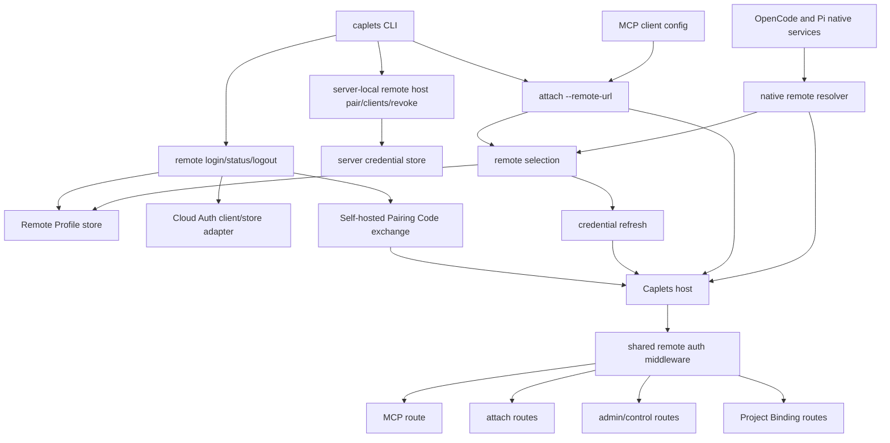
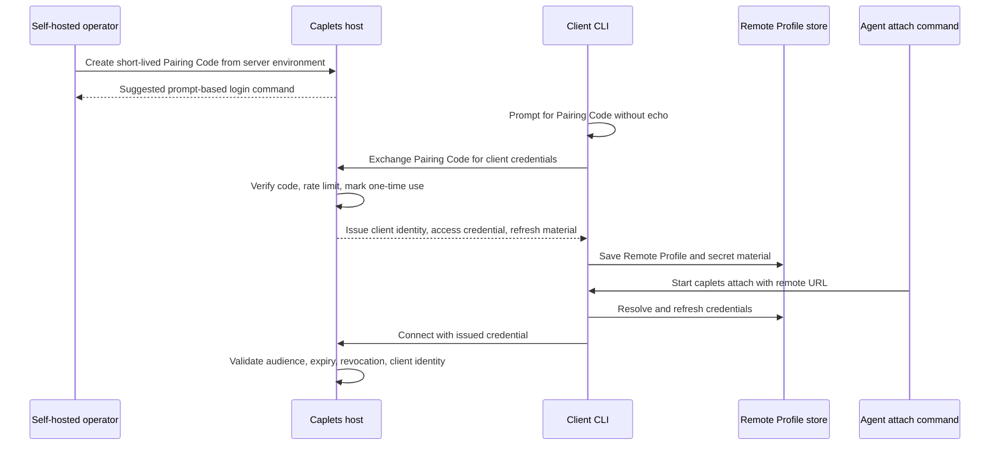
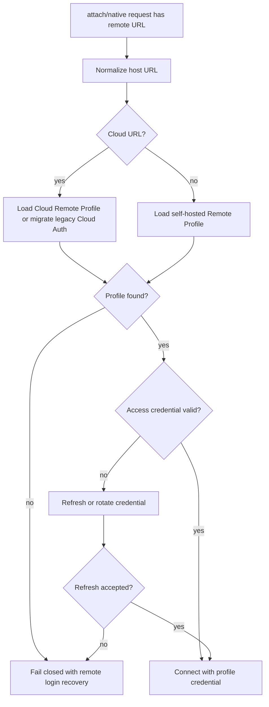
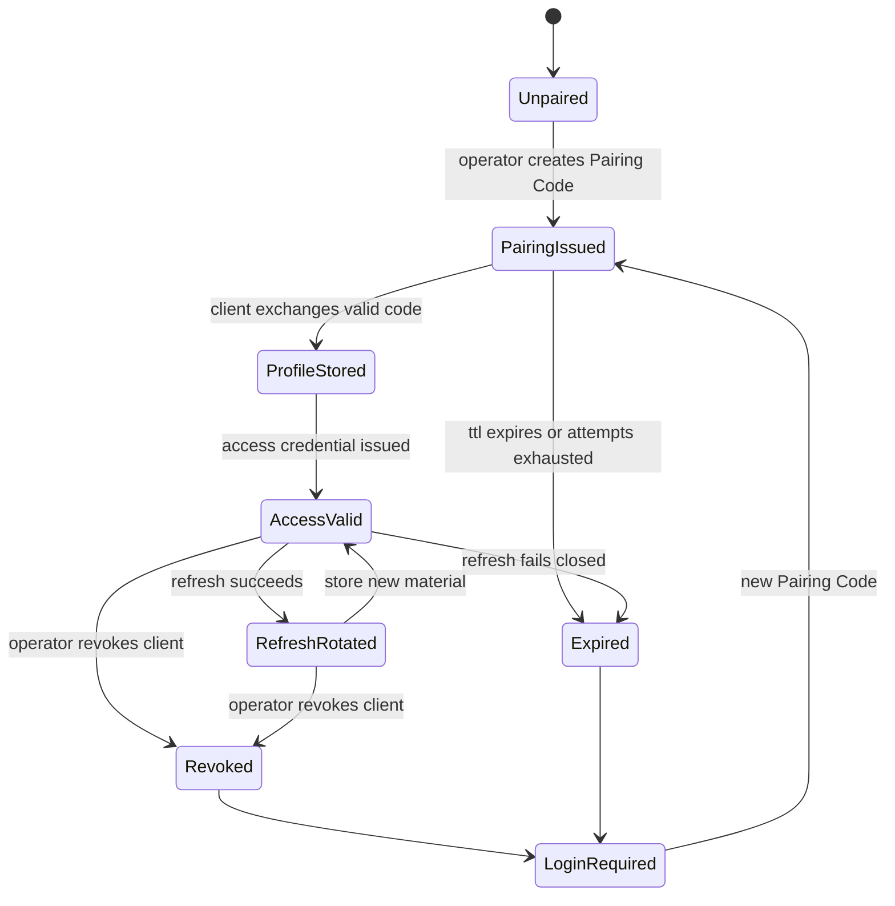

# feat: Unify remote attach authentication

## Summary

Implement provider-neutral Remote Login for Caplets Cloud and self-hosted Caplets. After this work, users trust a host once with `caplets remote login <url>`, then `caplets attach --remote-url <url>` and native integrations resolve Caplets-owned credentials without agent env secrets, env-token setup, or Basic Auth.

This is a pre-1.0 breaking change. The plan removes Basic Auth and `CAPLETS_REMOTE_TOKEN` from the supported self-hosted remote attach, MCP, and control product path immediately rather than keeping a warning-backed compatibility fallback.

---

## Problem Frame

Remote attach currently has two user models. Caplets Cloud uses saved Cloud Auth state through `caplets cloud auth login`, while self-hosted remotes rely on `CAPLETS_REMOTE_TOKEN` or Basic Auth through flags and environment variables. That split leaks into setup docs, native integration docs, MCP client config, recovery messages, and tests.

The target product shape is that Caplets owns remote trust. Agent configs should install a launch command and host URL, not a credential. This aligns with the strategy track for making local, self-hosted remote, and Cloud-backed execution behave as one capability model with explicit auth refresh, diagnostics, and recovery.

---

## Requirements

This plan carries the origin requirements, with R27-R30 expanded by the user's pre-1.0 decision to remove Basic Auth immediately, by review-confirmed coverage for env-token removal, and by proxy-origin hardening for callback and recovery URLs.

**Unified remote login**

- R1. `caplets remote login <url>` authenticates this machine to a Caplets host, whether the host is self-hosted or Caplets Cloud.
- R2. `caplets remote status` shows saved remote credentials in redacted form, including host URL, host kind, selected workspace when applicable, client label, created time, and last-used time when available.
- R3. `caplets remote logout <url>` removes this machine's saved credentials for that host.
- R4. `caplets attach --remote-url <url>` resolves stored credentials for the normalized host URL without requiring `CAPLETS_REMOTE_TOKEN`, `CAPLETS_REMOTE_USER`, or `CAPLETS_REMOTE_PASSWORD`.
- R5. Attach mode inference remains URL-driven: Cloud URLs use the hosted Cloud path, and non-Cloud URLs use the self-hosted path.

**Self-hosted pairing**

- R6. A self-hosted server operator can mint a short-lived one-time Pairing Code from the server environment.
- R7. Pairing Codes are scoped to one host, expire within minutes by default, are rate-limited, and are stored server-side only as non-reusable verification material.
- R8. A client can exchange a valid Pairing Code through `caplets remote login <url>` with a non-echoing prompt by default, a stdin path for automation, and any `--code` path treated as explicit noninteractive use with warnings.
- R9. Successful self-hosted login issues client credentials that are stored by Caplets on the client and can be revoked independently on the server.
- R10. Pairing Code exchange never turns the copied code into the long-lived bearer credential.

**Credential lifecycle**

- R11. Remote credentials are keyed by normalized host URL and, for hosted Cloud, selected workspace.
- R12. Access credentials used for attach are audience-restricted to their issuing Caplets host.
- R13. Long-lived refresh material is rotated or otherwise constrained so stealing one stale token is not enough for indefinite access.
- R14. Credential storage is owned by Caplets and uses restrictive local permissions, with OS credential storage preferred when available.
- R15. CLI output, diagnostics, JSON errors, and logs redact remote access credentials, refresh credentials, client secrets, and Pairing Codes.
- R16. The server can list and revoke paired clients by stable client identity, label, created time, and last-used time.

**Cloud migration**

- R17. `caplets cloud auth login` is deprecated in favor of `caplets remote login <cloud-url>`.
- R18. Existing Cloud credentials continue to work during migration or are migrated automatically into the unified remote credential store.
- R19. Cloud workspace selection is represented as part of the Remote Profile, not as a separate auth model.
- R20. Recovery messages that currently say `caplets cloud auth login` point users to the unified remote login command.

**Agent setup and docs**

- R21. First-run docs use `add-mcp` for generic MCP wiring instead of making `caplets setup` the primary path.
- R22. Local MCP docs install `caplets serve` through `add-mcp`.
- R23. Remote MCP docs install `caplets attach --remote-url <url>` through `add-mcp` after the user has completed `caplets remote login <url>`.
- R24. Remote MCP docs do not recommend `add-mcp --env` for Caplets remote credentials.
- R25. Native OpenCode and Pi docs use their native extension setup paths and the same Remote Login model.
- R26. `caplets setup` is reduced to a transitional router that points users at `add-mcp`, Remote Login, and native extension docs.

**Legacy self-hosted auth removal**

- R27. Self-hosted Basic Auth is removed from the self-hosted attach, MCP, and control model.
- R28. `CAPLETS_REMOTE_TOKEN`-based self-hosted attach is also removed from the supported path for this pre-1.0 change.
- R29. New tests and docs must not describe Basic Auth or `CAPLETS_REMOTE_TOKEN` as a supported self-hosted setup path.

**Proxy and callback origin safety**

- R30. Callback and recovery URL generation behind a proxy uses an explicit public origin or trusted proxy-derived `Host`, `X-Forwarded-Host`, and `X-Forwarded-Proto` values, never arbitrary client-provided origin headers.

---

## Actors and Flows

- A1. **Self-hosted server operator:** Runs the Caplets HTTP service, creates Pairing Codes, and revokes paired clients.
- A2. **Remote client user:** Logs a local machine into a Caplets host and configures agents to launch attach.
- A3. **Agent or MCP client:** Starts `caplets attach --remote-url ...` and receives the remote-backed Caplets surface.
- A4. **Caplets host:** Issues Pairing Codes, exchanges them for client credentials, validates attach requests, and records client identity.
- A5. **Caplets Cloud:** Implements the same Remote Login contract while preserving hosted workspace selection and refresh behavior.

The implementation must preserve F1 self-hosted host pairing, F2 Cloud host login, F3 agent wiring after Remote Login, F4 client revocation, and F5 legacy Cloud migration from the origin document.

---

## Key Technical Decisions

| ID     | Decision                                                                                                                                            | Rationale                                                                                                                                                               |
| ------ | --------------------------------------------------------------------------------------------------------------------------------------------------- | ----------------------------------------------------------------------------------------------------------------------------------------------------------------------- |
| KTD1.  | Remote Profile is the client-side source of truth for remote host trust.                                                                            | This satisfies R1-R5 and keeps agent configs free of remote secrets.                                                                                                    |
| KTD2.  | Stored Remote Profile credentials replace `CAPLETS_REMOTE_TOKEN`, `CAPLETS_REMOTE_USER`, and `CAPLETS_REMOTE_PASSWORD` for supported attach auth.   | The normal path cannot depend on env-secret propagation if Caplets owns remote trust.                                                                                   |
| KTD3.  | Self-hosted login uses a Caplets-native device-code-style Pairing Code exchange rather than turning self-hosted Caplets into a full OAuth provider. | RFC 8628 gives the right short-code constraints, while Caplets only needs host trust and client revocation.                                                             |
| KTD4.  | Self-hosted remote auth uses explicit route classes instead of one blanket middleware rule.                                                         | Pairing exchange, refresh rotation, backend OAuth callback, MCP, attach, control, and operator lifecycle commands have different bootstrap and authorization needs.     |
| KTD5.  | Self-hosted refresh material is a one-time rotating token family with hashed verification material and atomic rotation.                             | RFC 9700 and OWASP OAuth2 guidance both treat refresh-token replay and overbroad token audiences as core risks.                                                         |
| KTD6.  | Cloud Auth internals are reused behind the Remote Login namespace and migrated into Remote Profiles.                                                | Cloud already has browser/device login, refresh, workspace, and scope behavior; the user-facing model should change without duplicating the hosted auth implementation. |
| KTD7.  | `caplets setup` becomes a transitional router rather than the primary first-run path.                                                               | This keeps existing users oriented while moving docs and generated config guidance to `add-mcp`, Remote Login, and native extension setup.                              |
| KTD8.  | Basic Auth is removed immediately instead of hidden for a release.                                                                                  | The project is pre-1.0, and keeping Basic Auth creates a second auth model exactly where the origin requirements remove it.                                             |
| KTD9.  | Self-hosted client credential state is server-owned and durable.                                                                                    | R16 requires list and revoke by stable client identity, so the registry cannot be only in memory or derived from client-held secrets.                                   |
| KTD10. | Client identity is derived from validated credentials, not client-supplied metadata.                                                                | A remote host may sit behind proxies or receive arbitrary headers, so revocation and last-used tracking must not trust forwarded identity fields.                       |
| KTD11. | Cloud Remote Profiles include a per-host selected workspace pointer in addition to workspace-qualified profiles.                                    | Bare Cloud URLs remain ergonomic while multi-workspace status, logout, and attach stay deterministic.                                                                   |
| KTD12. | Self-hosted server-operator lifecycle commands are server-environment operations in the first implementation.                                       | Pairing Code issuance and client list/revoke must work before any remote client exists and must not become unauthenticated network admin routes.                        |
| KTD13. | Public-origin handling is explicit for proxied hosts.                                                                                               | Callback and recovery URLs must survive reverse proxies without trusting spoofable request headers from arbitrary clients.                                              |

---

## High-Level Technical Design

### Component Topology

### Self-Hosted Remote Login Sequence

### Self-Hosted Remote Auth Contract

| Route class                                             | Actor                         | Accepted credential                      | Plan requirement                                                                                                                         |
| ------------------------------------------------------- | ----------------------------- | ---------------------------------------- | ---------------------------------------------------------------------------------------------------------------------------------------- |
| Health and version                                      | Any caller                    | Public                                   | Remain public and do not disclose remote credential state.                                                                               |
| Pairing Code issuance                                   | Self-hosted server operator   | Server-environment authority only        | Runs against the server-owned credential store; no unauthenticated remote caller can mint Pairing Codes.                                 |
| Pairing Code exchange                                   | Remote client user            | Valid Pairing Code verifier              | Network-reachable before login, but bound by host, TTL, one-time use, hashing, and rate limits.                                          |
| Refresh and rotation                                    | Remote client runtime         | Refresh material                         | Uses a one-time rotating token family with hashed verifier, atomic compare-and-swap, stale-token reuse detection, and revocation checks. |
| MCP, attach, Project Binding, and normal remote control | Agent or authenticated client | Issued access credential                 | Protected by the remote credential validator and derives client identity from validated credentials only.                                |
| Backend OAuth callback                                  | Browser callback              | Flow id validated by backend OAuth state | Stays reachable without remote host credentials so `caplets auth login <caplet-id>` remains separate from Remote Login.                  |
| Self-hosted client list and revoke                      | Self-hosted server operator   | Server-environment authority only        | Reads and mutates server-owned credential state; normal paired-client credentials cannot list, mint, or revoke clients.                  |

The Basic-shaped HTTP auth state should be replaced with explicit modes such as `none`, `remote_credentials`, and `development_unauthenticated`. Serve option resolution, daemon serialization/redaction, service discovery auth metadata, DNS-rebinding allowed-host logic, and route middleware should treat `remote_credentials` as protected.

### Attach Selection Flow

### Credential Lifecycle

---

## Implementation Units

### U1. Remote Profile and Credential Storage

- **Goal:** Introduce the client-side Remote Profile model and credential store that can represent Cloud and self-hosted host trust.
- **Requirements:** R1-R4, R11-R15, R18-R19, F2, F5, AE1, AE4, AE6.
- **Dependencies:** None.
- **Files:**
  - `packages/core/src/remote/profiles.ts` (new)
  - `packages/core/src/remote/profile-store.ts` (new)
  - `packages/core/src/remote/credential-store.ts` (new)
  - `packages/core/src/remote/options.ts`
  - `packages/core/src/cloud-auth/store.ts`
  - `packages/core/src/auth/store.ts`
  - `packages/core/src/redaction.ts`
  - `packages/core/test/remote-profiles.test.ts` (new)
  - `packages/core/test/cloud-auth.test.ts`
  - `packages/core/test/redaction.test.ts`
- **Approach:** Define a normalized Remote Profile key from host URL plus Cloud workspace when applicable. Store redacted metadata separately from secret material, and reuse the atomic restrictive file-write pattern already present in `packages/core/src/auth/store.ts`. The first implementation should use a concrete file-backed credential store behind the Remote Profile API; OS credential backend selection stays follow-up work. Cloud profiles should also maintain a per-host selected workspace pointer for bare Cloud-origin attach. Legacy Cloud Auth state should be read lazily, and migration must not delete the legacy record until after the new Remote Profile write succeeds.
- **Execution note:** Implement the store tests first because every later unit depends on the credential lifecycle contract.
- **Patterns to follow:** `packages/core/src/auth/store.ts` for restrictive permissions and atomic writes, `packages/core/src/cloud-auth/store.ts` for current Cloud credential shape, and `packages/core/src/remote/options.ts` for URL normalization.
- **Test scenarios:**
  - Covers AE1. Saving a Cloud Remote Profile with a selected workspace persists host kind, normalized URL, workspace, client label, and redacted status.
  - Covers AE4. Loading profile status never returns raw access credentials, refresh credentials, client secrets, or Pairing Codes.
  - Covers AE6. A legacy Cloud Auth record is migrated or read through the Remote Profile store without deleting the legacy record before the new write succeeds.
  - A malformed or credential-bearing remote URL is rejected or normalized without persisting embedded username, password, query secret, or fragment secret.
  - Two Cloud workspaces under the same Cloud host produce distinct profile keys and a redacted selected-workspace pointer.
  - Logout removes the selected profile and its secret material without removing unrelated host profiles.
  - A bare Cloud host with multiple profiles requires a selected workspace, explicit workspace selector, or all-workspaces operation before status/logout mutates anything.
  - File-backed storage creates private directories and credential files with restrictive permissions on supported platforms.
- **Verification:** Remote Profile status is redacted, Cloud legacy credentials still resolve through the new store, and credential files do not expose raw secrets through CLI or JSON status output.

### U2. Self-Hosted Pairing and Server Credential Validation

- **Goal:** Replace self-hosted Basic Auth and env-token auth with server-side Pairing Code issuance, issued client credential validation, and server-side revocation.
- **Requirements:** R6-R7, R9-R10, R12-R16, R27-R30, F1, F4, AE5, AE8-AE10.
- **Dependencies:** U1.
- **Files:**
  - `packages/core/src/remote/pairing.ts` (new)
  - `packages/core/src/remote/server-credentials.ts` (new)
  - `packages/core/src/remote/server-credential-store.ts` (new)
  - `packages/core/src/serve/http.ts`
  - `packages/core/src/serve/options.ts`
  - `packages/core/src/server/options.ts`
  - `packages/core/src/cli.ts`
  - `packages/core/test/remote-pairing.test.ts` (new)
  - `packages/core/test/serve-http.test.ts`
  - `packages/core/test/serve-options.test.ts`
  - `packages/core/test/server-options.test.ts`
- **Approach:** Add server-side Pairing Code issuance and exchange APIs, storing only non-reusable verification material for short-lived codes. Successful exchange creates a stable client identity, metadata for list/revoke, access credential material, and refresh material constrained to the issuing host. Persist the self-hosted client registry and refresh state in single-node server-owned filesystem storage with a configurable state path, restrictive permissions, atomic write/rename, and advisory locking around refresh rotation. Replace the existing Basic Auth middleware path with the route-class contract above, including a remote credential validator for MCP, attach, normal remote control, and Project Binding routes. Pairing Code issuance plus client list/revoke stay server-environment operations for the first implementation. Derive client identity, revocation state, and last-used updates from validated credentials only; labels, request bodies, and forwarded headers are display or transport metadata, not authority. Remove Basic Auth flags, env parsing, env-token parsing, and product tests from the supported self-hosted auth path.
- **Origin handling:** Server options should prefer an explicit configured public origin for generated callback, pairing, and recovery URLs. If proxy-derived origins are supported, they must require an explicit trusted-proxy mode and validate `Host`, `X-Forwarded-Host`, and `X-Forwarded-Proto` against the configured allowed host model.
- **Technical design:** The pairing code should be human-copyable, but the server-side verifier must be high entropy and stored hashed. The copied code is bootstrap input only; attach requests must use issued credentials tied to a client identity.
- **Patterns to follow:** The route grouping and central auth placement in `packages/core/src/serve/http.ts`, current non-loopback HTTP safety checks in `packages/core/src/serve/options.ts`, and RFC 8628's limited-lifetime code and polling/rate-limit constraints.
- **Test scenarios:**
  - Covers AE5. A listed client can be revoked by stable identity, and its next attach attempt fails until Remote Login runs again.
  - Covers AE8. Basic Auth credentials and `CAPLETS_REMOTE_TOKEN` values are not accepted as the supported auth mechanism on self-hosted MCP, attach, control, or Project Binding routes.
  - Covers AE10. Generated callback, pairing, and recovery URLs use configured public origin or trusted proxy headers only; untrusted `Host` or `X-Forwarded-*` spoofing cannot change them.
  - Expired Pairing Codes, reused Pairing Codes, wrong-host Pairing Codes, and attempt-exhausted Pairing Codes fail closed.
  - Pairing Code verification is rate-limited enough that repeated invalid attempts do not produce unlimited guesses.
  - A valid issued credential is accepted by MCP, attach, Project Binding, and normal remote control routes, but not by server-operator pair/list/revoke commands.
  - The backend OAuth callback remains flow-id-bound and reachable without a remote host credential, while normal admin/control actions require issued remote credentials.
  - Refresh credentials form a one-time rotating token family with hashed verifier storage, atomic compare-and-swap, stale-token reuse detection, and family invalidation on superseded-token reuse.
  - A stale refresh credential is not enough to regain access after rotation, superseded-token reuse, or revocation.
  - A configured custom server state path stores client identity, revocation, and refresh state with restrictive permissions.
  - Client list and revoke metadata survive a host restart when server-owned state is present.
  - Revocation survives restart and invalidates both access and refresh material for the revoked client.
  - Concurrent refresh attempts do not fork refresh state or leave two valid successors.
  - Spoofed client labels, request metadata, or forwarded identity headers do not bypass revocation or alter the validated client identity.
  - Non-loopback HTTP still refuses unsafe unauthenticated exposure unless the explicit unauthenticated development override is used.
- **Verification:** Self-hosted routes are protected by issued remote credentials, client list/revoke works without rotating every client, and no Basic Auth or env-token branch remains as a supported remote auth contract.

### U3. Unified Remote CLI and Cloud Migration

- **Goal:** Add the provider-neutral `caplets remote` command family and route Cloud Auth behavior through Remote Profiles.
- **Requirements:** R1-R3, R6, R8, R16-R20, F1, F2, F4, F5, AE1, AE2, AE5, AE6.
- **Dependencies:** U1, U2.
- **Files:**
  - `packages/core/src/cli/commands.ts`
  - `packages/core/src/cli.ts`
  - `packages/core/src/cloud-auth/client.ts`
  - `packages/core/src/cloud-auth/errors.ts`
  - `packages/core/src/cloud-auth/store.ts`
  - `packages/core/src/remote/selection.ts`
  - `packages/core/src/remote/profiles.ts`
  - `packages/core/test/remote-login-cli.test.ts` (new)
  - `packages/core/test/cloud-auth-login-cli.test.ts`
  - `packages/core/test/cloud-auth.test.ts`
  - `packages/core/test/cli-completion.test.ts`
- **Approach:** Add `remote login`, `remote status`, and `remote logout` as the primary client-profile commands. Cloud URLs should reuse the existing hosted login and workspace selection behavior behind the Remote Login name, writing a workspace-qualified Remote Profile and updating the selected-workspace pointer for that Cloud host. Self-hosted URLs should use the Pairing Code exchange API from U2, prompting for the Pairing Code without echo by default and supporting a non-echoing stdin path for automation. Keep any `--code` option explicit and warning-backed for noninteractive use only. Server-operator lifecycle commands should be separated from client-profile commands, such as under `caplets remote host`, so pairing issuance and client list/revoke are visibly server-environment operations. Keep `caplets cloud auth` commands as deprecated wrappers or aliases only where needed for migration; their output should point to `caplets remote`.
- **Technical design:** Command naming should preserve the separate meaning of `caplets auth login <caplet-id>` for backend Caplet OAuth. Remote host auth commands must not be placed under `caplets auth`. Bare Cloud host status/logout should use the selected workspace when one is unambiguous, fail with redacted workspace choices when multiple profiles exist, and support explicit workspace selection plus an all-workspaces operation for destructive cleanup.
- **Patterns to follow:** `packages/core/src/cli/commands.ts` for subcommand inventory, `packages/core/src/cli.ts` for current Cloud Auth command implementation, and `packages/core/test/cloud-auth-login-cli.test.ts` for CLI fixture style.
- **Test scenarios:**
  - Covers AE1. `remote login` against a Cloud URL stores a Cloud Remote Profile with selected workspace metadata.
  - Covers AE2. `remote login` against a self-hosted URL prompts for a valid Pairing Code, stores a self-hosted Remote Profile, and later attach uses issued client credentials rather than the copied code.
  - Covers AE5. Server-side client list output shows stable client identity, label, created time, and last-used time without secrets, and revoke invalidates that client.
  - Covers AE6. Existing Cloud Auth state is accepted through the new Remote Profile path, and recovery guidance names `caplets remote login`.
  - `remote status` redacts every credential field and can filter or select by host URL.
  - `remote status` and `remote logout` handle one workspace, multiple workspaces under one Cloud host, workspace-qualified URLs, explicit workspace selection, and all-workspaces cleanup deterministically.
  - `remote logout` removes local profile state and performs best-effort server revocation when a live credential is available.
  - Generated self-hosted pairing commands do not echo Pairing Codes in argv, terminal output, or diagnostics.
  - `caplets cloud auth login/status/logout/switch` either delegates to the Remote Profile implementation or emits deprecation guidance without creating a separate credential model.
  - CLI completions include the new `remote` subcommands and omit removed Basic Auth flags.
- **Verification:** Users can complete Cloud and self-hosted host login through one namespace, legacy Cloud users receive migration-safe behavior, and command help teaches Remote Login rather than provider-specific setup.

### U4. Attach, Remote Control, and Native Resolution from Remote Profiles

- **Goal:** Make CLI attach, remote control, OpenCode, and Pi resolve stored Remote Profiles before connecting to a host.
- **Requirements:** R4-R5, R11-R15, R19-R20, R23-R25, R28-R29, F3, F5, AE3, AE4, AE6, AE9.
- **Dependencies:** U1, U2, U3.
- **Files:**
  - `packages/core/src/remote/options.ts`
  - `packages/core/src/remote/selection.ts`
  - `packages/core/src/remote-control/client.ts`
  - `packages/core/src/project-binding/attach.ts`
  - `packages/core/src/project-binding/errors.ts`
  - `packages/core/src/native/options.ts`
  - `packages/core/src/native/service.ts`
  - `packages/core/src/native/remote.ts`
  - `packages/core/test/remote-options.test.ts`
  - `packages/core/test/remote-selection.test.ts`
  - `packages/core/test/remote-control-client.test.ts`
  - `packages/core/test/attach-cli.test.ts`
  - `packages/core/test/cloud-auth-refresh-attach.test.ts`
  - `packages/core/test/native-options.test.ts`
  - `packages/core/test/native-remote.test.ts`
  - `packages/core/test/doctor-cli.test.ts`
- **Approach:** Resolve remote mode from URL as today, then load the matching Remote Profile by normalized URL and workspace. For bare Cloud-origin URLs, resolve through the selected-workspace pointer; for workspace-qualified URLs, validate against that exact profile key. Refresh credentials before attach or native remote calls when needed. Remove secret-bearing env variables, env tokens, and Basic Auth fields from the supported resolver path; keep non-secret selectors such as remote URL, workspace, and mode only where they are still needed by existing native launch contracts. All missing, expired, revoked, or workspace-mismatched credentials should fail closed with Remote Login recovery text.
- **Technical design:** Native services should use the same profile store and refresh behavior as `caplets attach`, not a parallel env-token path.
- **Patterns to follow:** `packages/core/src/remote/selection.ts` for current Cloud refresh before attach, `packages/core/src/native/service.ts` for native Cloud selection, and `packages/core/src/project-binding/errors.ts` for structured recovery commands.
- **Test scenarios:**
  - Covers AE3. An agent config that runs only `caplets attach --remote-url <url>` succeeds when a matching Remote Profile exists.
  - Covers AE4. Attach refresh and diagnostic output redact credentials and preserve host audience restrictions.
  - Covers AE6. A Cloud URL with only legacy Cloud Auth state migrates or resolves through the Remote Profile path before attach.
  - Self-hosted attach with no Remote Profile or only legacy env-token state fails with `caplets remote login <url>` recovery guidance.
  - A stored self-hosted profile sends issued credential material, not `CAPLETS_REMOTE_TOKEN`, Basic Auth, or the Pairing Code.
  - A bare Cloud-origin attach resolves the selected workspace, while multiple Cloud profiles without a selected workspace fail with redacted choices.
  - Workspace mismatch on a Cloud profile fails with Remote Login or workspace selection guidance.
  - Native OpenCode and Pi remote modes can connect with a remote URL plus stored profile, without remote credential env vars.
  - Remote control 401/403 errors no longer instruct users to check Basic Auth env vars.
- **Verification:** Every remote execution surface uses the same profile-backed auth model and every recovery path points to Remote Login.

### U5. Agent Setup, Native Docs, and Public Docs Migration

- **Goal:** Rewrite setup and docs around Remote Login, `add-mcp`, and native extension setup.
- **Requirements:** R21-R29, F3, AE3, AE7-AE9.
- **Dependencies:** U3, U4.
- **Files:**
  - `packages/core/src/cli/setup.ts`
  - `packages/core/test/setup-runner.test.ts`
  - `packages/core/test/agent-plugins.test.ts`
  - `README.md`
  - `packages/cli/README.md`
  - `apps/docs/src/content/docs/index.mdx`
  - `apps/docs/src/content/docs/install.mdx`
  - `apps/docs/src/content/docs/agent-integrations.mdx`
  - `apps/docs/src/content/docs/remote-attach.mdx`
  - `apps/docs/src/content/docs/troubleshooting.mdx`
  - `docs/native-integrations.md`
  - `docs/project-binding.md`
  - `docs/product/caplets-code-mode-prd.md`
  - `docs/architecture.md`
  - `packages/opencode/README.md`
  - `packages/pi/README.md`
- **Approach:** Make first-run docs say local MCP setup installs `caplets serve` through `add-mcp`, and remote MCP setup runs Remote Login first, then installs `caplets attach --remote-url <url>` through `add-mcp`. Do not recommend `add-mcp --env` or any env-secret path for Caplets remote credentials. Self-hosted pairing docs should show a prompt-based Remote Login flow and must not print Pairing Code values in generated commands. Update OpenCode and Pi docs to use native extension setup plus the same Remote Login model. Reduce `caplets setup` to a transitional router that points to the current setup path and no longer suggests remote secret env vars. Verify `add-mcp@1.10.4` syntax during implementation before finalizing examples.
- **Patterns to follow:** Current README and docs structure, `packages/cli` prepack copying from `README.md`, and existing docs check scripts for generated public docs.
- **Test scenarios:**
  - Covers AE3. Generated or dry-run setup output for remote MCP contains the attach command and URL but no remote token, password, Basic Auth, or `add-mcp --env` credential instruction.
  - Covers AE7. Install docs route MCP users through `add-mcp` and native users through OpenCode or Pi extension setup.
  - Covers AE8. Current self-hosted docs never ask a user to configure Basic Auth.
  - Current self-hosted docs never ask a user to configure `CAPLETS_REMOTE_TOKEN` for the supported path.
  - Remote attach docs show Remote Login before attach for both Cloud and self-hosted hosts.
  - Pairing docs and setup output do not echo Pairing Codes inside command argv, generated config, or diagnostics.
  - Troubleshooting docs recover missing or revoked credentials with `caplets remote login`, not env-secret instructions.
  - Package README copies or generated docs do not drift from the root README.
- **Verification:** Public docs, package READMEs, and setup output all teach the same no-secret agent config model.

### U6. Diagnostics, Redaction, Package Contract, and Release Gate

- **Goal:** Align diagnostics, generated surfaces, package metadata, and release artifacts with the new auth model.
- **Requirements:** R2, R12-R15, R20, R28-R29, AE4, AE6, AE8-AE9.
- **Dependencies:** U1, U2, U3, U4, U5.
- **Files:**
  - `packages/core/src/cli/doctor.ts`
  - `packages/core/src/redaction.ts`
  - `packages/core/src/code-mode/logs.ts`
  - `packages/core/src/project-binding/errors.ts`
  - `packages/core/src/cloud-auth/errors.ts`
  - `packages/core/src/index.ts`
  - `packages/core/src/native.ts`
  - `packages/core/test/doctor-cli.test.ts`
  - `packages/core/test/redaction.test.ts`
  - `packages/core/test/code-mode-logs.test.ts`
  - `packages/core/test/cli-completion.test.ts`
  - `.changeset/*.md`
- **Approach:** Update doctor output to report Remote Profile status and Remote Login recovery. Extend redaction to new credential prefixes, refresh material, Pairing Codes, client secret fields, serialized Remote Profile secret payloads, and any noninteractive Pairing Code option. Ensure public exports expose only stable Remote Profile and native resolver types needed by downstream packages. Add a changeset because the CLI, core runtime, docs, and native packages change user-facing auth behavior.
- **Patterns to follow:** Current doctor Cloud Auth checks, existing redaction helper coverage, and the Changesets release process already used by the repo.
- **Test scenarios:**
  - Covers AE4. Logs, doctor output, JSON errors, and Code Mode logs redact remote credentials and Pairing Codes.
  - Covers AE6. Doctor and Project Binding recovery text name `caplets remote login` for missing or revoked Cloud credentials.
  - Covers AE8. Completion and help output do not expose Basic Auth as a remote setup path.
  - Completion, help, and doctor output do not expose `CAPLETS_REMOTE_TOKEN` as a supported self-hosted setup path.
  - Missing profile diagnostics name host URL and workspace metadata only in redacted form.
  - Exported package types compile after adding Remote Profile helpers and native profile-backed resolution.
  - The changeset describes the breaking pre-1.0 auth model change.
- **Verification:** Diagnostics are useful without leaking credentials, generated/API checks stay current, and the repo gate passes with the new public contract.

---

## Phased Delivery

- **Phase 1: Credential substrate.** Land U1 and U2 so both client and server have one trust model and Basic Auth plus env-token auth are removed at the auth boundary.
- **Phase 2: Command and runtime surfaces.** Land U3 and U4 so CLI, attach, remote control, OpenCode, and Pi use Remote Profiles.
- **Phase 3: Public contract cleanup.** Land U5 and U6 so docs, setup, diagnostics, exports, and release notes match the implementation.

The phases are dependency groups, not separate product promises. The branch should not ship publicly until Phase 3 is complete because partial shipping would leave docs or integrations teaching stale auth behavior.

---

## Scope Boundaries

### Deferred for later

- Hardware-backed or sender-constrained credentials beyond the best available software credential model.
- Multi-user role and permission administration for self-hosted teams beyond client listing and revocation.
- Automatic migration of every possible third-party MCP config that may already contain Caplets env secrets.

### Outside this product's identity

- Using agent MCP configs as the source of truth for Caplets secrets.
- Treating Basic Auth as the long-term self-hosted authentication model.
- Replacing backend Caplet OAuth with remote host login.

### Deferred to Follow-Up Work

- A full cross-platform OS keychain dependency decision after the first concrete file-backed Remote Profile credential store ships.
- Automatic editing of existing third-party agent configs that already contain old Caplets credential env vars.
- Fine-grained self-hosted user roles beyond the server operator's ability to list and revoke paired clients.

---

## System-Wide Impact

- **CLI contract:** Adds `caplets remote` as a top-level auth namespace and demotes `caplets cloud auth` to migration guidance.
- **HTTP auth boundary:** Replaces the current Basic Auth gate for remote host routes with explicit route classes and issued remote credential validation.
- **Native integrations:** Makes OpenCode and Pi resolve stored Remote Profiles instead of secret env vars.
- **Project Binding:** Changes Cloud and self-hosted recovery commands to Remote Login while preserving fail-closed behavior.
- **Docs and setup:** Moves first-run MCP setup to `add-mcp` plus Remote Login, and keeps `caplets setup` as a transitional router.
- **Release posture:** This is a breaking pre-1.0 auth change for `caplets`, `@caplets/core`, `@caplets/opencode`, and `@caplets/pi` users who rely on old self-hosted env-secret, `CAPLETS_REMOTE_TOKEN`, or Basic Auth setup.

---

## Acceptance Examples

- AE1. Given a user runs `caplets remote login https://cloud.caplets.dev`, when hosted auth completes, then Caplets stores a Cloud Remote Profile with the selected workspace.
- AE2. Given a server operator creates a Pairing Code and a client enters it through prompt or stdin, when the client later attaches, then it uses issued client credentials rather than the original copied code.
- AE3. Given a user has completed Remote Login, when they install `caplets attach --remote-url <url>` through `add-mcp`, then the agent config contains no remote token, password, or Caplets credential env vars.
- AE4. Given a remote credential is stored locally, when attach refreshes or reports diagnostics, then credentials remain host-scoped and redacted from output.
- AE5. Given a self-hosted operator lists paired clients, when they revoke one client, then that client's next attach attempt fails until it logs in again.
- AE6. Given a user still has legacy Cloud Auth state, when attach requires credentials, then Caplets either migrates the state or reports a recovery command using `caplets remote login`.
- AE7. Given a first-time user reads install docs, when they choose MCP or native setup, then the docs send them through `add-mcp` for MCP and native extension setup for OpenCode or Pi.
- AE8. Given a user follows current docs, when they self-host and attach, then they never configure Basic Auth or `CAPLETS_REMOTE_TOKEN`.
- AE9. Given a self-hosted user has only old `CAPLETS_REMOTE_TOKEN` state or env, when attach runs, then it fails closed with `caplets remote login <url>` recovery guidance and does not use the token.
- AE10. Given a self-hosted host is behind a reverse proxy, when callback, pairing, or recovery URLs are generated, then they use configured public origin or trusted proxy headers and reject spoofed untrusted host/proto input.

---

## Risks and Mitigations

| Risk                                                                              | Mitigation                                                                                                                                                                                                           |
| --------------------------------------------------------------------------------- | -------------------------------------------------------------------------------------------------------------------------------------------------------------------------------------------------------------------- |
| A protected route keeps the old Basic Auth, env-token, or unauthenticated branch. | Replace auth in the shared HTTP middleware boundary and add route-category tests for MCP, attach, admin/control, Project Binding, backend OAuth callback, pairing, refresh, and server-operator routes.              |
| Cloud migration breaks users with existing saved Cloud Auth.                      | Keep legacy Cloud Auth reads during migration and test legacy state before removing any old file.                                                                                                                    |
| Pairing Codes become reusable credentials in practice.                            | Store only hashed verification material server-side, enforce one-time use, and test that copied codes cannot authenticate attach.                                                                                    |
| Refresh-token replay gives long-term access after theft.                          | Use a one-time rotating token family with hashed verifier storage, atomic rotation, stale-token reuse detection, and revocation invalidation for both current access and refresh material.                           |
| The self-hosted client registry is accidentally in-memory only.                   | Persist client identity, revocation, and refresh state in server-owned storage and test restart behavior.                                                                                                            |
| A reverse proxy or malicious client injects identity or origin headers.           | Sanitize identity headers, derive client identity only from validated remote credentials, and generate public URLs only from configured public origin or explicitly trusted proxy `Host` and `X-Forwarded-*` inputs. |
| Native integrations drift from CLI attach.                                        | Route OpenCode, Pi, and CLI attach through the same Remote Profile resolution and refresh helpers.                                                                                                                   |
| Docs continue teaching env-secret setup through stale pages.                      | Include README, docs site, package READMEs, troubleshooting docs, and setup dry-run output in U5 verification.                                                                                                       |
| `add-mcp` syntax or support changes during implementation.                        | Verify the current package help/source during U5 before finalizing docs examples; the planning pass confirmed npm package version `1.10.4`.                                                                          |

---

## Alternative Approaches Considered

- **Keep Basic Auth for one release:** Rejected. The project is pre-1.0, and a hidden fallback would preserve the split auth model this plan removes.
- **Keep Cloud Auth as a separate user-facing namespace:** Rejected. The origin requirement is one Remote Login model with Cloud as one host kind.
- **Keep env-token auth for self-hosted remotes:** Rejected for supported setup. It keeps secrets in agent launch environments, splits recovery paths, and fails the no-secret config goal.
- **Implement a complete OAuth provider for self-hosted Caplets:** Rejected. A Caplets-native device-code-style exchange covers host trust, client identity, refresh, and revocation without overbuilding identity administration.
- **Block on full OS keychain parity before shipping Remote Profiles:** Rejected. The first implementation uses a concrete restrictive file-backed Remote Profile credential store so the command contract can ship while preserving a path to better platform storage.

---

## Documentation and Operational Notes

- Public docs should use Remote Login vocabulary consistently: Remote Login, Pairing Code, and Remote Profile are already defined in `CONCEPTS.md`.
- `caplets auth login <caplet-id>` must stay documented as backend Caplet OAuth, not remote host authentication.
- Server operator docs need to state that Pairing Codes are short-lived bootstrap material and revocation is per paired client.
- Pairing examples should use the prompt or stdin flow and should not put Pairing Code values in generated command argv, config, or diagnostics.
- Troubleshooting docs should distinguish missing host login from backend Caplet OAuth failures.
- Self-hosted deployment docs should state that TLS termination and reverse proxies must not inject trusted client identity into Caplets remote auth, and must document explicit public origin or trusted proxy handling for `Host`, `X-Forwarded-Host`, and `X-Forwarded-Proto`.
- Package changes need a changeset because users may need to replace env-secret setup with Remote Login before upgrading.

---

## Verification Strategy

- Focused unit tests should prove Remote Profile storage, redaction, Cloud migration, Pairing Code lifecycle, server revocation, and URL/workspace keying.
- Integration tests should prove every protected remote route accepts issued credentials, rejects Basic Auth and `CAPLETS_REMOTE_TOKEN` as supported mechanisms, and preserves the backend OAuth callback exception.
- CLI tests should prove `remote login/status/logout`, Cloud migration wrappers, recovery text, and completions match the new command model.
- CLI tests should prove self-hosted login prompts for Pairing Codes or accepts stdin by default, treats `--code` as explicit warning-backed noninteractive use, and does not echo Pairing Codes in generated commands.
- Native tests should prove OpenCode and Pi can connect using stored Remote Profiles and non-secret selectors.
- Docs checks should prove public docs and package READMEs no longer teach Basic Auth or remote credential env vars as the normal path.
- Proxy-origin tests should prove callback, pairing, and recovery URLs cannot be changed through untrusted `Host` or `X-Forwarded-*` headers.
- The final repo gate should pass after generated docs, generated schemas, Code Mode API checks, typecheck, tests, deterministic benchmarks, and build are current.

---

## Sources and Research

- Origin requirements: `docs/brainstorms/2026-06-19-unified-remote-attach-auth-requirements.md`.
- Strategy and glossary: `STRATEGY.md`, `CONTEXT.md`, `CONCEPTS.md`, `docs/adr/0001-code-mode-default-exposure.md`.
- Credential storage patterns: `packages/core/src/auth/store.ts`, `packages/core/src/cloud-auth/store.ts`.
- Current CLI and setup surfaces: `packages/core/src/cli.ts`, `packages/core/src/cli/commands.ts`, `packages/core/src/cli/setup.ts`.
- Current remote resolution: `packages/core/src/remote/options.ts`, `packages/core/src/remote/selection.ts`, `packages/core/src/remote-control/client.ts`.
- Current server auth boundary: `packages/core/src/serve/http.ts`, `packages/core/src/serve/options.ts`, `packages/core/src/server/options.ts`.
- Current native and Project Binding surfaces: `packages/core/src/native/options.ts`, `packages/core/src/native/service.ts`, `packages/core/src/native/remote.ts`, `packages/core/src/project-binding/errors.ts`.
- Current docs to update: `README.md`, `apps/docs/src/content/docs/remote-attach.mdx`, `apps/docs/src/content/docs/install.mdx`, `apps/docs/src/content/docs/agent-integrations.mdx`, `apps/docs/src/content/docs/troubleshooting.mdx`, `docs/native-integrations.md`, `docs/project-binding.md`, `packages/opencode/README.md`, `packages/pi/README.md`.
- External references: [RFC 8628 OAuth 2.0 Device Authorization Grant](https://www.rfc-editor.org/rfc/rfc8628.html), [RFC 9700 OAuth 2.0 Security Best Current Practice](https://www.rfc-editor.org/rfc/rfc9700.html), [OWASP OAuth2 Cheat Sheet](https://cheatsheetseries.owasp.org/cheatsheets/OAuth2_Cheat_Sheet.html), and [`add-mcp` on npm](https://www.npmjs.com/package/add-mcp).
