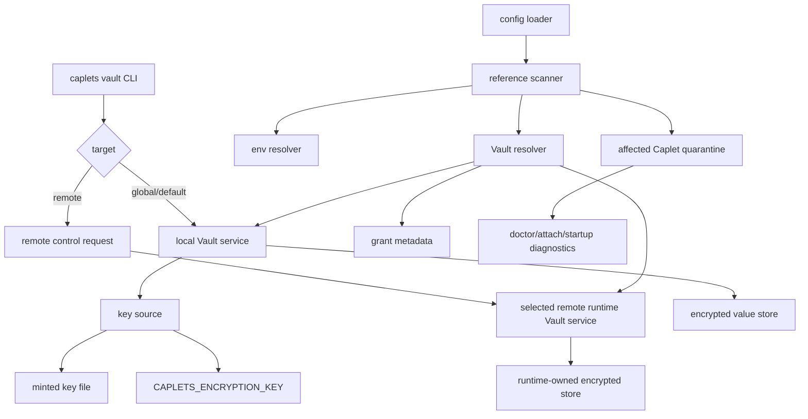
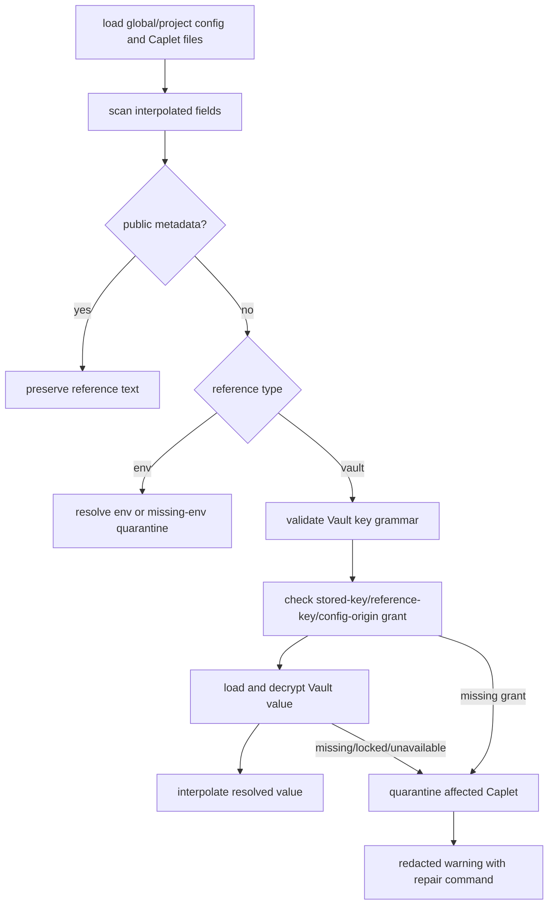
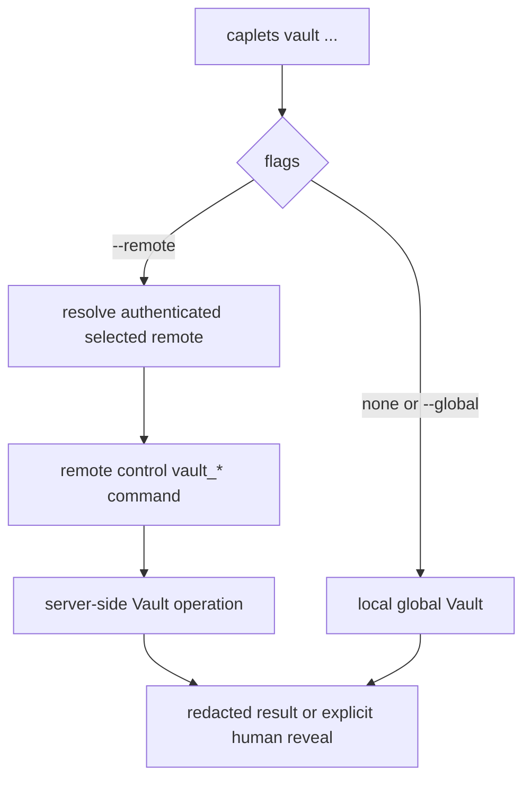

# feat: Add Caplets Vault

## Summary

Implement Caplets Vault as a runtime-owned encrypted string store for `$vault:NAME` and `${vault:NAME}` config interpolation. The work replaces fragile secret-like catalog env references with Vault values, adds explicit human CLI management, enforces per-Caplet access grants, and keeps local, self-hosted remote, and Cloud runtime stores separate.

---

## Problem Frame

Caplets currently depends on process environment propagation for secret-like config values. That is brittle for agent harnesses because the shell that sets a value is often not the process that starts the Caplets MCP runtime.

Vault follows the same product direction as Remote Login: Caplets owns long-lived sensitive runtime state, agent configs carry stable references, and unresolved sensitive state quarantines only affected Caplets. The feature must preserve the existing missing-env quarantine ergonomics while adding encrypted at-rest storage, grant checks, remote management, and catalog migration (see origin: `docs/brainstorms/2026-06-22-caplets-vault-requirements.md`).

---

## Requirements

**Config interpolation and quarantine**

- PR1. Config supports `$vault:NAME` and `${vault:NAME}` wherever `$env:NAME` and `${NAME}` currently interpolate, except public metadata fields.
- PR2. Vault key names use the origin env-like uppercase grammar and fail before storage, grants, or resolution when invalid.
- PR3. Missing, locked, unavailable, invalid-key-source, or ungranted Vault references quarantine only the affected Caplet and preserve valid siblings.
- PR4. Vault diagnostics name key, Caplet, target, config path, and recovery command without printing raw values.

**Encrypted local runtime store**

- PR5. Local/global Vault management stores encrypted string values under Caplets-owned user data with owner-only permissions.
- PR6. Local v1 installs mint a Vault encryption key when needed, or use `CAPLETS_ENCRYPTION_KEY` when provided.
- PR7. Invalid, unreadable, missing, or wrong-permissioned Vault key material fails closed as unresolved Vault state during config loading.
- PR8. The local store keeps key-source and encrypted-store boundaries narrow enough to add OS keychain key storage later.

**CLI and remote control**

- PR9. `caplets vault` targets local/global by default, accepts `--global` as an explicit alias, and routes `--remote` through the authenticated selected runtime.
- PR10. `caplets vault set NAME` prompts without echo in interactive shells when no non-argv value source is provided, rejects missing noninteractive input, rejects raw argv values, and requires `--force` for updates.
- PR11. `caplets vault list`, `get NAME`, and `delete NAME` expose only safe metadata; `get NAME --show` reveals the raw value only for an explicit human-facing request.
- PR12. Remote Vault set and update operations travel through authenticated encrypted control paths, execute on the selected self-hosted runtime or hosted Cloud target contract, and do not persist or log raw values locally.
- PR21. Vault string values are limited to 64 KiB of plaintext in v1 and fail before encryption, storage, or remote transport when oversized.

**Access grants**

- PR13. Vault resolution requires an access grant for stored Vault key, Caplet ID, referenced key name, and config origin.
- PR14. `caplets vault access grant|revoke|list` manages grant metadata without revealing raw values, and accepts `--remote` to manage grant metadata in the selected runtime target.
- PR15. `caplets vault access grant NAME <capletId> --as <referenceName>` maps a runtime-global stored key to the Caplet's referenced key name; `caplets vault access grant NAME <capletId> --remote` performs the same grant against a remote Vault value in the selected runtime target.
- PR16. `caplets vault set NAME --grant <capletId>` supports the ergonomic setup path for common one-key Caplets, including `caplets vault set NAME --remote --grant <capletId>` for remote Vault values.

**Agent exposure, docs, and catalog**

- PR17. Agent-facing MCP and Code Mode surfaces expose no raw Vault reveal operation.
- PR18. `caplets doctor`, `caplets attach`, and runtime startup surface unresolved and ungranted Vault references before harnesses silently lose Caplets.
- PR19. Catalog Caplets under `caplets/` use Vault references for user-supplied secret-like values, starting with GitHub's `GH_TOKEN`.
- PR20. Docs and generated references teach `caplets vault set` and grants instead of exporting secret-like environment variables for catalog Caplets.

---

## Key Technical Decisions

- KTD1. **Add a core Vault module instead of embedding storage in config or CLI code.** Storage, encryption, key-source loading, grant metadata, and redacted status are shared by config loading, CLI commands, doctor, and remote control.
- KTD2. **Treat Vault references as a sibling reference class to missing env references.** The current quarantine path already removes only affected Caplet backend entries and preserves public metadata, so Vault should extend that model rather than create a second config-loading pipeline.
- KTD3. **Use authenticated encryption with versioned records.** Node's stable `node:crypto` API supports the required cryptographic primitives, and a versioned envelope lets future keychain or provider work preserve stored semantics.
- KTD4. **Store key material separately from encrypted values.** The local minted key or `CAPLETS_ENCRYPTION_KEY` unlocks encrypted records; the encrypted values live in a separate store with safe metadata, matching OWASP's key-management guidance to separate keys from protected secrets.
- KTD5. **Make grant metadata part of resolution, not only CLI policy.** A user who knows a Vault key name still cannot resolve it unless config origin and Caplet ID match an access grant.
- KTD6. **Execute remote Vault management in the selected runtime target.** `--remote` follows the existing self-hosted remote-control pattern where available and the hosted Cloud client contract where selected, but the target runtime owns Vault storage and grant metadata so local Caplets never mirror remote values. Hosted Cloud server/runtime implementation lives outside this repository; this repository owns the CLI/client request shape, target selection, redaction, and diagnostics.
- KTD7. **Keep raw reveal out of agent-facing APIs.** Human-facing CLI reveal is explicit with `--show`; Code Mode and MCP wrapper surfaces should only see resolved downstream backend behavior, never a Vault read primitive.
- KTD8. **Make catalog migration narrow and checked.** Update the GitHub catalog Caplet and docs now, then add a repo check that prevents new secret-like catalog env references after Vault ships while leaving benchmark harness env vars alone.
- KTD9. **Preserve synchronous config loading.** Existing config loaders and tests are synchronous, so the built-in v1 Vault provider should use sync-capable local file and crypto APIs rather than making config parsing async across the repo.
- KTD10. **Pin the v1 crypto and key-material contract before implementation.** Local records use AES-256-GCM with 32-byte keys, 96-bit random nonces, explicit auth tags, and a versioned JSON envelope. Minted key files store base64url-encoded 32-byte random key material, and `CAPLETS_ENCRYPTION_KEY` is accepted only when it decodes to exactly 32 bytes.
- KTD11. **Define grants against canonical loader-derived origins.** Grant records store source kind plus the canonical origin identity produced by config loading; grant commands resolve the active config source for the Caplet ID before writing metadata, and resolution matches stored key, referenced key name, Caplet ID, and canonical origin.
- KTD12. **Keep `parseConfig` pure unless a Vault resolver is provided.** Bare `parseConfig(input)` performs no implicit global Vault IO. Source-aware loaders pass `{ origin, vaultResolver, warnings }` or an equivalent internal preflight context, and tests pass explicit fixture resolvers.

---

## High-Level Technical Design

### Component Topology

### Resolution Flow

### CLI Targeting

---

## Implementation Units

### U1. Vault Storage, Key Source, and Grant Model

**Goal:** Add the core local Vault implementation that stores encrypted string values, validates key names, manages key material, and records grant metadata.

**Requirements:** PR2, PR5, PR6, PR7, PR8, PR13, PR14, PR15, PR21

**Dependencies:** None

**Files:**

- `packages/core/src/vault/index.ts`
- `packages/core/src/vault/types.ts`
- `packages/core/src/vault/keys.ts`
- `packages/core/src/vault/store.ts`
- `packages/core/src/vault/crypto.ts`
- `packages/core/src/vault/access.ts`
- `packages/core/src/config/paths.ts`
- `packages/core/test/vault.test.ts`

**Approach:** Introduce a small built-in file-backed Vault module with minimal injected dependencies for tests and runtime wiring, not a general external-provider framework. Use sync-capable local file and crypto operations so config loading does not become async. Use the Caplets state/auth directory pattern for local paths, owner-only directories and files where POSIX permissions are available, AES-256-GCM encrypted records with versioned JSON envelopes, and redacted status objects. Store grant records separately from encrypted value records so access metadata can be listed without touching secret material. Grant records include the stored key name, referenced key name, Caplet ID, canonical loader-derived config origin, and timestamps. Reject oversized plaintext values before encryption and oversized encrypted records before decryption.

**Patterns to follow:** `packages/core/src/remote/credential-store.ts` for atomic owner-only file writes; `packages/core/src/cloud-auth/store.ts` for redacted status shape; `packages/core/test/remote-profiles.test.ts` for permission assertions.

**Test scenarios:**

- Covers AE1. Given invalid Vault key names with lowercase, path separators, colons, interpolation delimiters, leading digits, whitespace, control characters, or more than 128 characters, validation rejects them before store or grant mutation.
- Covers AE10. Given no existing local key and no `CAPLETS_ENCRYPTION_KEY`, saving a value mints a key file with owner-only permissions and writes encrypted value material without plaintext.
- Covers AE10. Given `CAPLETS_ENCRYPTION_KEY` is provided and decodes to exactly 32 bytes, Vault uses it without creating or reading the minted key file.
- Covers AE10. Given `CAPLETS_ENCRYPTION_KEY` is an invalid encoding, passphrase-like string, short key, long key, or otherwise does not decode to exactly 32 bytes, Vault fails closed before encryption, decryption, or grant mutation.
- Covers AE10. Given the key file is missing, unreadable, malformed, too broadly permissioned on a POSIX platform, or has an unsupported key format version, status reports an unavailable key source and value resolution fails closed.
- Covers AE10. Given an encrypted record is tampered with, has an invalid auth tag, or declares an unsupported envelope version, decryption fails closed and raw plaintext is not emitted.
- Covers AE14. Given grants exist for multiple Caplets and stored keys, grant listing returns Caplet IDs, referenced key names, config origins, and timestamps without raw values.
- Covers AE7. Given a stored key is deleted, Vault removes or invalidates the active value record without returning plaintext and leaves only safe retained-state metadata where applicable.
- Given two grants use the same Caplet ID and referenced key name from different canonical config origins, resolution for one origin cannot use the other origin's grant.
- Given a stored key is overwritten with `force`, the encrypted record changes and existing grants remain metadata-only.
- Given a Vault value exceeds 64 KiB of plaintext, storage rejects it before encryption and reports a safe validation error.

**Verification:** The Vault module can be tested without loading Caplet config, encrypted files never contain plaintext fixture values, and redacted status is sufficient for CLI and doctor callers.

### U2. Vault-Aware Config Interpolation and Quarantine

**Goal:** Resolve Vault references during config loading while preserving existing env interpolation behavior and public metadata exclusions.

**Requirements:** PR1, PR2, PR3, PR4, PR13, PR15, PR18

**Dependencies:** U1

**Files:**

- `packages/core/src/config.ts`
- `packages/core/test/config.test.ts`

**Approach:** Generalize the existing missing-env scan into a reference-resolution preflight that recognizes env and Vault references. Public metadata remains non-interpolated. Define one synchronous resolver contract such as `parseConfig(input, { origin, vaultResolver, warnings })` or an equivalent internal preflight API. Bare `parseConfig(input)` does not perform implicit global Vault IO; source-aware loaders pass the real `ConfigSource`, and tests pass explicit fixture resolvers. For Vault references, compute the canonical config source origin and Caplet backend ID before interpolation, require a matching grant, resolve `--as` mappings from referenced key to stored key, and quarantine the backend entry with a recoverable warning when any Vault state is unresolved.

**Patterns to follow:** `quarantineMissingEnvCaplets`, `missingEnvReferences`, `interpolateConfig`, and the local overlay quarantine tests in `packages/core/test/config.test.ts`.

**Test scenarios:**

- Covers AE2. Given a field that currently interpolates `$env:NAME` or `${NAME}`, replacing it with `$vault:NAME` or `${vault:NAME}` resolves in the same field class.
- Covers AE2. Given descriptions or tags contain `$vault:NAME` or `${vault:NAME}`, config loading preserves the literal reference text.
- Covers AE3. Given one Caplet references a missing Vault key and another is valid, only the affected Caplet is removed and the valid sibling remains available.
- Covers AE13. Given a Vault key exists but the Caplet lacks a matching grant for its ID and config origin, config loading quarantines the Caplet as ungranted.
- Covers AE13. Given the same Caplet ID and `$vault` reference appear from a different config origin than the grant, config loading quarantines the Caplet as ungranted.
- Covers AE16. Given two Caplet instance IDs both reference `$vault:GH_TOKEN`, grants with different stored keys and `--as GH_TOKEN` resolve each instance to the correct value.
- Given bare `parseConfig(input)` sees a Vault reference, it preserves purity by using no global Vault IO and routing resolution through the explicit preflight/resolver path.
- Given env and Vault references appear in the same config tree, missing env and unresolved Vault diagnostics keep their separate reason labels and do not leak values.

**Verification:** Existing env interpolation tests still pass unchanged, Vault failures appear as recoverable source warnings, and warning text contains key names and config paths but no raw Vault values.

### U3. Local Vault CLI Commands

**Goal:** Add the human-facing `caplets vault` command group for local/global set, list, get, delete, and access management.

**Requirements:** PR9, PR10, PR11, PR14, PR15, PR16, PR17, PR21

**Dependencies:** U1

**Files:**

- `packages/core/src/cli.ts`
- `packages/core/src/cli/vault.ts`
- `packages/core/test/cli.test.ts`

**Approach:** Keep command parsing in `cli.ts` and move operation formatting into `cli/vault.ts`. Parse target flags with the same mutation-target rules as add/install/init, but default Vault to global/local and accept `--global` as an explicit alias. Read values from a hidden interactive prompt or stdin-style non-argv source; reject raw value arguments; reject values over 64 KiB before storage or remote send; require `--force` when updating an existing key. Make `get` reveal only when `--show` is supplied. For `set --grant` and `access grant`, load config with sources, resolve the active source for `<capletId>`, reject missing, duplicate, or shadowed IDs with repair guidance, and store the canonical origin in the grant. `set --grant` is atomic from the user's perspective: either value storage and grant mutation both succeed, or newly-created state rolls back and one actionable error is reported.

**Patterns to follow:** `createSetupPromptHandle`, `readHiddenPrompt`, `readStdin`, `parseMutationTarget`, and auth target command formatting in `packages/core/src/cli.ts`.

**Test scenarios:**

- Covers AE4. Given an interactive shell and no non-argv value source, `caplets vault set NAME` prompts without echo and stores the entered value.
- Covers AE4. Given noninteractive execution without stdin or an equivalent injected value reader, `set` fails with a clear request error.
- Covers AE4. Given an existing key, `set NAME` refuses to overwrite and `set NAME --force` updates it.
- Given `caplets vault get NAME` without `--show`, output includes safe metadata but not the raw value.
- Given `caplets vault get NAME --show`, output reveals the raw value only in the human-facing CLI response.
- Covers AE14. Given grant, revoke, list-by-key, list-by-Caplet, and `set --grant`, commands mutate or report only access metadata.
- Covers AE7. Given `caplets vault delete NAME`, output names the key and retained-state status without revealing the raw value.
- Covers AE16. Given global and project configs shadow the same Caplet ID, `set --grant` and `access grant` either resolve the active source deterministically or reject ambiguity with repair guidance before writing grant metadata.
- Given `set --grant` stores a value but grant mutation fails, newly-created value state rolls back or is invalidated before the command returns failure.
- Given `set --grant` creates a grant but value storage fails, newly-created grant state rolls back before the command returns failure.
- Given stdin or prompt input exceeds 64 KiB, `set` fails before storage and output does not include the raw value.

**Verification:** CLI output is stable in plain and JSON formats, command errors are actionable, and tests assert raw fixture values are absent from all non-show outputs.

### U4. Remote Vault Control

**Goal:** Route `caplets vault --remote` management to the selected self-hosted runtime or hosted Cloud client contract without local persistence or mirroring.

**Requirements:** PR9, PR11, PR12, PR14, PR18, PR21

**Dependencies:** U1, U3

**Files:**

- `packages/core/src/remote-control/types.ts`
- `packages/core/src/remote-control/dispatch.ts`
- `packages/core/src/remote-control/client.ts`
- `packages/core/src/remote/selection.ts`
- `packages/core/src/cloud/client.ts`
- `packages/core/src/cloud/runtime-http.ts`
- `packages/core/src/cli.ts`
- `packages/core/test/remote-control-dispatch.test.ts`
- `packages/core/test/remote-control-client.test.ts`
- `packages/core/test/cloud-client.test.ts`
- `packages/core/test/cli-remote.test.ts`

**Approach:** Add remote-control commands for Vault set/list/get/delete/access operations for self-hosted remote targets, and add the hosted Cloud client request/response contract for the same Vault operations. This repository should drive hosted Cloud target selection, request shapes, response handling, diagnostics, and no-local-mirroring tests; the hosted Cloud runtime/server store implementation is outside this repository. The client sends values only in authenticated request bodies for `set`, rejects values over 64 KiB before transport, and only returns raw values for explicit human `get --show` responses. `caplets vault access grant NAME <capletId> --remote`, `revoke --remote`, and `list --remote` mutate or read grant metadata on the selected runtime target, not the local Vault grant store. The dispatcher executes against the server-side Vault store for self-hosted targets and rejects local-only path or destination parameters. Vault request types carry sensitive-field or sensitive-value metadata so the client, proxy, dispatcher, and runtime logging redact exact raw fixture values on both success and failure paths before generic credential-pattern redaction. Remote raw reveal is a privileged human CLI context, is not advertised through native service, MCP, Code Mode, progressive tools, or generic remote manifests, and dispatcher/client layers reject reveal requests without that context.

**Patterns to follow:** Remote `init`, `install`, `add`, and `auth_*` dispatch in `packages/core/src/remote-control/dispatch.ts`; stale credential learning in `docs/solutions/integration-issues/stale-remote-profile-credentials-refresh.md`.

**Test scenarios:**

- Covers AE5. Given `caplets vault set NAME --remote`, the local CLI sends a remote-control request and the local Vault store remains unchanged.
- Covers AE5. Given hosted Cloud is the selected target, `caplets vault --remote` uses the Cloud Vault client contract and diagnostics without writing to the local Vault store.
- Covers AE9. Given a remote set operation succeeds or fails and the value appears in logs, diagnostics, or a thrown server error, client, proxy, dispatcher, and runtime output redact the exact raw value.
- Covers AE9. Given an unlabeled fixture value appears verbatim in a thrown remote error, operation-scoped sensitive-value redaction removes it before generic credential-pattern redaction.
- Covers AE14. Given `caplets vault access grant NAME <capletId> --remote`, the local CLI sends a target-owned grant request, the selected runtime stores the grant metadata, the local grant store remains unchanged, and no raw value is returned.
- Covers AE14. Given remote access list/revoke commands, target-owned grant metadata changes or reports safely and raw values are not returned.
- Given a remote profile is unauthenticated or missing, `--remote` Vault commands fail with the same recovery model as other remote CLI operations.
- Given a remote request body exceeds 64 KiB of plaintext value input, the client rejects it before sending and does not log the raw value.
- Given a remote `get NAME --show`, only the explicit human CLI command response can include the value and JSON error/detail fields still redact secrets.
- Given a direct remote-control invocation lacks the human CLI reveal context, raw reveal is rejected even if the caller is otherwise authenticated.

**Verification:** Remote tests prove operation ownership is target-side, authenticated self-hosted and hosted Cloud target selection is reused, and no raw value is written to local config or local Vault files.

### U5. Runtime Diagnostics, Doctor, and Attach Preflight

**Goal:** Surface Vault health, unresolved references, and missing grants through doctor, attach, and startup warnings before agent harnesses lose Caplets silently.

**Requirements:** PR3, PR4, PR7, PR18

**Dependencies:** U1, U2, U4

**Files:**

- `packages/core/src/cli/doctor.ts`
- `packages/core/src/attach/options.ts`
- `packages/core/src/attach/server.ts`
- `packages/core/src/native/service.ts`
- `packages/core/test/cli.test.ts`
- `packages/core/test/cli-remote.test.ts`
- `packages/core/test/native-service.test.ts`

**Approach:** Extend config source warnings and doctor sections with Vault status. Doctor should scan local overlay config using the same resolver inputs as runtime loading, group ungranted, missing, unavailable, and invalid-key-source issues, and print repair commands with the correct target. Attach and native startup should surface those warnings as preflight diagnostics without prompting for values or grants.

**Patterns to follow:** `tryLoadLocalOverlayForCli`, `formatDoctorReport`, `doctorJsonReport`, and the native service exposure diagnostics in `packages/core/src/cli/doctor.ts`.

**Test scenarios:**

- Covers AE3. Given a local missing Vault reference, doctor reports key, Caplet, target, and `caplets vault set` repair guidance without the value.
- Covers AE15. Given an existing local key without a grant, doctor reports the exact `caplets vault access grant` command.
- Covers AE15. Given an existing remote Vault key without a grant, doctor reports the exact `caplets vault access grant NAME <capletId> --remote` command for the selected runtime target.
- Covers AE7. Given config later references a deleted Vault key, loading quarantines the affected Caplet as missing and status output explains any retained recovery state without revealing values.
- Covers AE8. Given a self-hosted remote or hosted Cloud target, diagnostics name that runtime target and use `--remote` guidance rather than local-only commands.
- Covers AE10. Given invalid key material, doctor reports key-source status and attach does not prompt for unlock input.
- Covers AE15. Given an agent-facing attach startup with ungranted Vault references, preflight output contains the Vault-specific reason before the Caplet is absent from the exposed surface.

**Verification:** Doctor JSON stays machine-readable, plain output is actionable, and attach/native startup tests prove diagnostics happen before downstream tool discovery.

### U6. Agent-Facing Exposure Boundary

**Goal:** Ensure Code Mode, MCP progressive exposure, and direct tool surfaces cannot reveal raw Vault values.

**Requirements:** PR11, PR17

**Dependencies:** U2, U3

**Files:**

- `packages/core/src/code-mode/api.ts`
- `packages/core/src/tools.ts`
- `packages/core/src/registry.ts`
- `packages/core/test/code-mode-api.test.ts`
- `packages/core/test/tools.test.ts`
- `packages/core/test/registry.test.ts`

**Approach:** Do not add Vault read operations to Caplet handles or wrapper tools. Add regression coverage that searches callable Code Mode and MCP/progressive operation surfaces for Vault reveal operations, and extend existing redaction tests so resolved backend details do not serialize raw Vault values into descriptions, observed output metadata, or registry detail responses.

**Patterns to follow:** Existing registry tests that assert serialized Caplet detail does not contain secret env values, plus Code Mode callable-caplet tests.

**Test scenarios:**

- Covers AE6. Given a Code Mode session lists and inspects Caplet handles, no operation exists to read, reveal, or enumerate raw Vault values.
- Given progressive tools list/search/get operations include a Caplet configured with Vault auth, serialized descriptions and structured content omit the resolved value.
- Given an observed output shape or registry detail is generated after Vault resolution, the stored metadata does not include the raw Vault value.

**Verification:** Agent-facing APIs continue to expose backend capability operations only, and raw Vault values appear only in explicit human CLI reveal tests.

### U7. Catalog Migration and Guardrails

**Goal:** Move built-in catalog secret-like setup from env vars to Vault and prevent regressions.

**Requirements:** PR19, PR20

**Dependencies:** U2, U3

**Files:**

- `caplets/github/CAPLET.md`
- `caplets/github/README.md`
- `packages/core/test/config.test.ts`
- `packages/core/test/catalog-vault.test.ts`

**Approach:** Change the GitHub catalog token reference from `$env:GH_TOKEN` to `$vault:GH_TOKEN`, update setup docs to run `caplets vault set GH_TOKEN --grant github` for local/global use and `caplets vault set GH_TOKEN --remote --grant github` for self-hosted remote or hosted Cloud-backed use, and state that the command must target the runtime where the Caplet executes. Adjust repository catalog load tests to seed a test Vault store or resolver rather than mutating `process.env.GH_TOKEN`. Add a catalog-specific regression test that rejects secret-like `$env:` or bare `${NAME}` references under `caplets/` while ignoring benchmark harness env vars outside the catalog tree.

**Patterns to follow:** Repository Caplet load tests in `packages/core/test/config.test.ts`.

**Test scenarios:**

- Covers AE11. Given repository catalog Caplets are loaded, GitHub uses `$vault:GH_TOKEN` and setup docs no longer instruct `export GH_TOKEN`.
- Covers AE11. Given GitHub setup docs are read by a remote or hosted Cloud user, they show the `--remote` Vault setup command and warn that Vault values must be written to the runtime where the Caplet executes.
- Covers AE12. Given OAuth-backed catalog Caplets such as Linear or Sourcegraph are loaded, their OAuth setup flow remains unchanged.
- Given a future catalog Caplet adds a secret-like `$env:` or bare `${NAME}` reference, the catalog guard test fails with the Caplet path and reference.
- Given benchmark live suites still require env vars for benchmark harness execution, the catalog guard does not flag benchmark-only env usage outside `caplets/`.

**Verification:** Catalog tests prove all checked-in Caplets remain loadable with Vault fixtures, docs reference the new Vault setup flow, and benchmark checks remain deterministic.

### U8. Public Docs, Schema, and Release Notes

**Goal:** Document Vault setup, remote targeting, grants, diagnostics, and scope boundaries for users and implementers.

**Requirements:** PR4, PR9, PR10, PR11, PR12, PR16, PR18, PR20

**Dependencies:** U1, U2, U3, U4, U5, U7

**Files:**

- `README.md`
- `docs/product/`
- `docs/adr/`
- `docs/agents/domain.md`
- `CONCEPTS.md`
- `CONTEXT.md`
- `packages/core/src/config.ts`
- `packages/core/test/config.test.ts`
- `.changeset/`

**Approach:** Add user docs for local/global Vault, self-hosted remote Vault, hosted Cloud target semantics, local and remote access grants, `--as` mapping, explicit reveal, delete behavior, and quarantine recovery. Add an ADR only if implementation settles a durable encryption-store record format or key-source compatibility contract beyond the requirements doc. Regenerate config schema only if schema descriptions need to mention Vault interpolation.

**Patterns to follow:** Remote Login docs language from the unified remote attach work and glossary style in `CONCEPTS.md`.

**Test scenarios:**

- Documentation expectation: docs include local, self-hosted remote, and hosted Cloud setup commands, local and `--remote` grant commands, explicit reveal warnings, and no project Vault flow.
- Covers AE8. Given docs describe self-hosted remote or hosted Cloud setup, they name the active target and use `--remote` where appropriate.
- Schema expectation: if schema descriptions change, generated schema check passes and includes Vault interpolation wording without changing field shapes.

**Verification:** Docs and generated references are aligned with implemented CLI syntax, and glossary/context entries still match the final feature name and semantics.

---

## System-Wide Impact

- **Config loading:** `parseConfig`, isolated config loading, local overlay loading, Caplet file loading, and source warning formatting all gain a Vault reference class through an explicit synchronous resolver context.
- **Runtime availability:** More Caplets may quarantine by default until users grant access; diagnostics must make that fail-closed behavior feel like setup, not random disappearance.
- **Remote runtime:** Remote management depends on authenticated self-hosted remote control or the hosted Cloud client contract and must execute on the selected runtime target to preserve local/remote separation.
- **Security posture:** Vault adds encrypted-at-rest local state and a new explicit reveal path, so redaction tests need to cover CLI, remote errors, registry serialization, and agent-facing APIs.
- **Catalog onboarding:** GitHub setup changes from shell env export to Vault set plus grant. Users updating catalog Caplets need to run the new setup once.

---

## Risks & Dependencies

- **Cryptographic misuse risk:** Use the pinned AES-256-GCM envelope, 32-byte key contract, 96-bit random nonces, explicit auth tags, and versioned JSON records rather than ad hoc reversible encoding. Keep crypto helpers isolated and test tamper failures.
- **False sense of security from local key file:** Local v1 protects against accidental plaintext-on-disk exposure, not against a fully compromised user account. Docs should state that `CAPLETS_ENCRYPTION_KEY` and the minted key file are runtime key material.
- **Grant ergonomics risk:** Required grants could make setup feel heavy. `set --grant`, doctor repair commands, and catalog setup docs are mandatory mitigation.
- **Remote leakage risk:** Remote-control errors, success diagnostics, proxy logs, and reveal responses may accidentally include raw values. Tests should force secret-bearing success and failure paths through value-aware dispatcher, client, and Cloud-client redaction.
- **Cloud boundary risk:** Hosted Cloud Vault server/runtime implementation is outside this repository. This plan covers the CLI/client contract, request shape, target selection, diagnostics, and local no-mirroring behavior that the Cloud implementation must satisfy.
- **Catalog regression risk:** The guardrail needs to detect secret-like catalog env refs without blocking legitimate nonsecret benchmark env use.
- **Changeset dependency:** This is user-facing CLI and package behavior, so implementation should include an appropriate changeset unless the release process intentionally labels the PR otherwise.

---

## Scope Boundaries

### In Scope

- Built-in Caplets encrypted Vault provider.
- Local/global and remote targets only.
- String values only.
- 64 KiB plaintext maximum per Vault value.
- `$vault:NAME` and `${vault:NAME}` interpolation.
- Explicit human CLI reveal.
- Access grants with `--as` remapping.
- GitHub catalog migration and catalog guardrails.

### Deferred to Follow-Up Work

- OS keychain-backed key-source implementation.
- External provider integrations such as AWS Secrets Manager or HashiCorp Vault.
- Rotation workflows beyond setting a new value with `--force`.
- Migration helpers for already-installed user catalog Caplets.

### Outside This Product Scope

- Project-scoped Vault stores.
- Committed encrypted `.caplets` Vault files.
- Provider-qualified syntax such as `$vault:aws/NAME`.
- Structured or JSON Vault values.
- Agent-facing APIs that reveal raw Vault values.
- Replacing existing Caplets-owned OAuth flows with Vault.

---

## Sources & Research

- `docs/brainstorms/2026-06-22-caplets-vault-requirements.md` is the origin requirements source.
- `packages/core/src/config.ts` contains the existing env interpolation, public metadata exclusion, and missing-env quarantine path to extend.
- `packages/core/test/config.test.ts` contains local overlay quarantine and catalog load coverage.
- `packages/core/src/remote/credential-store.ts` and `packages/core/src/cloud-auth/store.ts` provide adjacent Caplets-owned credential storage and redacted status patterns.
- `packages/core/src/remote-control/dispatch.ts` and `packages/core/src/remote-control/client.ts` provide the remote CLI ownership and redaction pattern for `--remote` Vault management.
- `docs/solutions/integration-issues/stale-remote-profile-credentials-refresh.md` records why Caplets-owned credential state should replace env-secret propagation in long-lived agent runtime paths.
- Node.js `node:crypto` documentation describes the stable cryptographic primitives available to the Node runtime: https://nodejs.org/api/crypto.html
- Node.js `node:fs` documentation defines permission mode behavior used by owner-only key and store files: https://nodejs.org/api/fs.html
- OWASP Secrets Management and Key Management cheat sheets inform the key/value separation, encrypted-at-rest expectation, and no-logging posture: https://cheatsheetseries.owasp.org/cheatsheets/Secrets_Management_Cheat_Sheet.html and https://cheatsheetseries.owasp.org/cheatsheets/Key_Management_Cheat_Sheet.html

---

## Acceptance Trace

- AE1: U1, U2
- AE2: U2
- AE3: U2, U5
- AE4: U3
- AE5: U4
- AE6: U6
- AE7: U1, U3, U5
- AE8: U5, U8
- AE9: U4
- AE10: U1, U5
- AE11: U7
- AE12: U7
- AE13: U2
- AE14: U1, U3, U4
- AE15: U5
- AE16: U1, U2, U3
