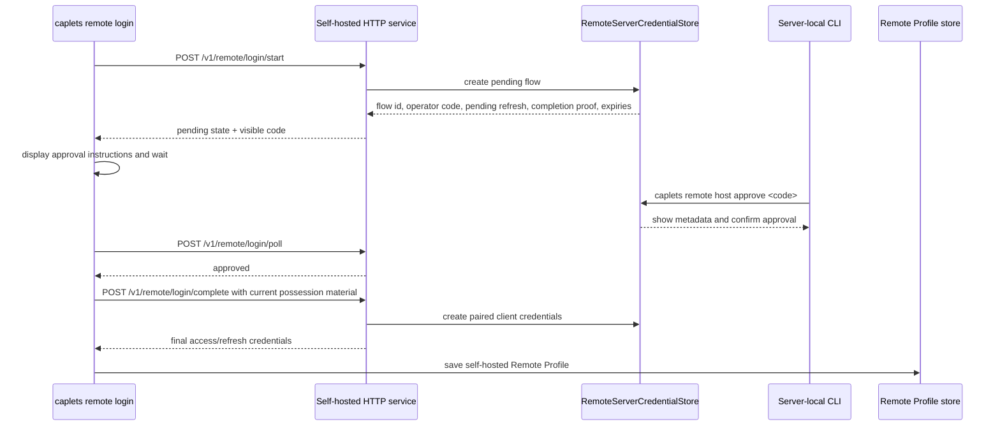

# Self-Hosted Pending Remote Login Plan

## Summary

Replace the self-hosted Remote Login bootstrap with a client-started, server-approved pending-login flow. The new flow keeps the existing Remote Profile and post-login refresh model, but replaces operator-minted Pairing Codes with short operator-visible approval codes, rotating pre-login refresh material, server-local approval commands, host identity checks, state-specific attach recovery, and docs that keep remote secrets out of agent configuration.

This plan supersedes the self-hosted Pairing Code portions of `docs/plans/2026-06-19-001-feat-unified-remote-attach-auth-plan.md`. Cloud Remote Profile behavior and existing attach/native request-time credential resolution remain the baseline rather than a greenfield rebuild.

---

## Problem Frame

The current self-hosted login path still depends on an operator running `caplets remote host pair` to mint a copied Pairing Code, then the client entering that code into `caplets remote login <url>`. That path is backwards for a device-style login: the user initiating trust should start the flow, the host should hold pending state, the operator should approve from the server environment, and the client should refresh or finish the flow without copying credential-like material through argv, environment variables, or agent config.

The codebase already has the right durable destination for successful login: Remote Profiles store host credentials, attach resolves profiles at request time, and native clients already avoid capturing stale auth headers. The work is to replace the self-hosted bootstrap and harden the surrounding lifecycle, not to re-platform all remote auth.

---

## Plan Requirements

**Pending login lifecycle**

- PR1. Self-hosted `caplets remote login <url>` starts a pending login on the host instead of prompting for an operator-minted Pairing Code.
- PR2. The pending login has distinct material classes: a short visible operator code, high-entropy pre-login refresh material, final access credentials, and final refresh credentials.
- PR3. Visible operator codes are not attach bearer credentials and are only useful to a server-local operator approval command.
- PR4. Pre-login refresh material is client-held, rotating, flow-bound, invalidated on terminal states, and never stored as a Remote Profile credential.
- PR5. The client login command has explicit waiting, refresh, denial, expiry, cancellation, retry, and success states in human output and stable JSON events.

**Server-local administration**

- PR6. Server-local operators can list, approve, and deny pending logins by local state access; ordinary attach credentials cannot approve pending logins or administer other clients.
- PR7. Operator approval shows request metadata before issuing credentials, including host/audience, client label, created time, approximate source, and stable fingerprint or generated client identity where available.
- PR8. Existing paired clients remain valid across the migration; unexchanged legacy Pairing Codes stop being a supported login path.

**Identity, security, and abuse controls**

- PR9. Pending login, refresh, completion, attach, and post-login refresh use authenticated encrypted transport by default, with only warning-gated local-development plaintext exceptions.
- PR10. Self-hosted profiles and credentials carry server-reported host identity/audience metadata in addition to locator URLs, and mismatches fail closed rather than silently merging aliases.
- PR11. The unauthenticated pending-login surface has quotas, cleanup, refresh backoff, and redacted error responses.
- PR12. Pending refresh rotation has a bounded lost-response retry strategy so transient network failures do not strand legitimate clients.

**Attach, Cloud, and agent parity**

- PR13. Attach recovery distinguishes missing profile, revoked credential, refresh failure, host unreachable, host identity mismatch, invalid URL, insecure transport, and Cloud workspace/profile ambiguity.
- PR14. Cloud Remote Profile behavior remains under the unified `remote` namespace, including legacy Cloud migration and workspace-aware status/logout semantics.
- PR15. MCP, OpenCode, Pi, and supported client/agent docs use Remote Profiles and non-secret selectors only; supported agent setup paths do not put remote tokens, passwords, Pairing Codes, or pre-login refresh material in config, argv examples, or environment variables.

---

## Key Technical Decisions

- KTD1. **Use a new pending-login endpoint family instead of overloading `/v1/remote/pairing/exchange`.** The target lifecycle has start, poll, refresh, complete, cancel, and terminal states. Encoding that as a one-shot Pairing Code exchange would preserve the old mental model and make refresh/denial/cancellation awkward.

- KTD2. **Keep approval server-local for v1.** Approval, pending-list, deny, and administrative revoke operate through local CLI access to the same server credential state path as `caplets serve`. No web admin surface and no attach-authenticated admin API ships in this plan.

- KTD3. **Delay paired-client creation until the original pending client completes the approved flow.** Operator approval marks the pending flow approved, but final client credentials are persisted only when the original flow holder completes with current possession material. This avoids orphaned clients when a terminal closes after approval.

- KTD4. **Use rotating pre-login refresh with stale-retry grace.** The store rotates pre-login refresh verifiers the same way post-login refresh rotates today, while retaining a short superseded verifier window bound to the same flow/client proof for lost-response retries. Replays outside that window fail and mark the event for redacted diagnostics.

- KTD5. **Keep pre-login refresh non-resumable in v1.** The client keeps pending refresh material in memory during `remote login`; it is not written to the Remote Profile credential store. Ctrl-C sends best-effort cancellation, and abandoned flows expire server-side.

- KTD6. **Introduce conservative host identity metadata before seamless alias merging.** A self-hosted server reports a stable issuer/host identity and public audience derived from the same `CAPLETS_SERVER_URL` / trusted-proxy logic used for remote credentials. Profiles record both identity and locator; mismatches produce recovery guidance instead of silently merging localhost, LAN, and reverse-proxy aliases.

- KTD7. **Treat operator-visible metadata as display-only unless server-derived.** Client labels help humans, but they do not authorize approval. Source hints are server-observed, and forwarded metadata is shown only when proxy trust is explicitly configured.

- KTD8. **Classify client self-revocation separately from administration.** `DELETE /v1/remote/client` can remain as best-effort logout for the authenticated client only. Listing pending logins, approving/denying, and revoking other clients stay server-local.

- KTD9. **Make `remote login --json` newline-delimited events for self-hosted pending login.** A long-running waiting command needs machine-readable progress. Human output can be friendly, but tests and automation assert event codes.

- KTD10. **Resolve `caplets setup` only as a remote-secret boundary.** `caplets setup` remains a transitional surface for this plan: it must not generate secret-bearing remote config, and remote-auth guidance points to `remote login`, `add-mcp`, and native docs. Broader `caplets setup` deprecation or local MCP onboarding modernization remains a separate product decision.

---

## High-Level Technical Design

### Pending HTTP contract

The implementation should add explicit self-hosted pending-login service paths in `packages/core/src/serve/http.ts` and `servicePaths()`:

| Route                            | Auth                                   | Purpose                                                                                                                                    |
| -------------------------------- | -------------------------------------- | ------------------------------------------------------------------------------------------------------------------------------------------ |
| `POST /v1/remote/login/start`    | unauthenticated, quota-limited         | Create pending flow and return visible operator code plus client-held `pendingRefreshSecret` and `pendingCompletionSecret` / client proof. |
| `POST /v1/remote/login/poll`     | pending flow possession                | Return `pending`, `approved`, `denied`, `expired`, `cancelled`, `rate_limited`, or retryable status without issuing final credentials.     |
| `POST /v1/remote/login/refresh`  | pending flow possession                | Rotate visible operator code and pre-login refresh material before code expiry or after `slow_down`/backoff guidance.                      |
| `POST /v1/remote/login/complete` | pending flow possession after approval | Issue and persist final paired-client credentials for the original flow holder.                                                            |
| `POST /v1/remote/login/cancel`   | pending flow possession                | Best-effort invalidation when the client aborts.                                                                                           |

These routes use the existing remote credential error envelope shape and redaction rules. They are not control/admin routes.

### Pending material classes and terminal transitions

| Material                                 | Secret?                                   | Used by                                                                          | Invalidated when                                                                                                                             | Persistence                                                              |
| ---------------------------------------- | ----------------------------------------- | -------------------------------------------------------------------------------- | -------------------------------------------------------------------------------------------------------------------------------------------- | ------------------------------------------------------------------------ |
| `flowId`                                 | No                                        | Correlates start, poll, refresh, complete, cancel, and operator metadata.        | Flow cleanup removes it from active state.                                                                                                   | Server state only; may appear in JSON as a non-secret identifier.        |
| Visible operator code                    | No attach authority, but redacted in logs | Server-local `remote host approve <code>` / `deny <code>`.                       | Refresh rotates it; denial, cancellation, expiry, completion, or cleanup terminally invalidates it.                                          | Hashed server-side; shown intentionally to the client and operator.      |
| `pendingRefreshSecret`                   | Yes                                       | `/v1/remote/login/refresh` only.                                                 | Refresh rotation, approval, denial, cancellation, expiry, completion, or cleanup.                                                            | In client memory and hashed server-side; never saved to Remote Profiles. |
| `pendingCompletionSecret` / client proof | Yes                                       | `/v1/remote/login/poll`, `/v1/remote/login/complete`, and best-effort `/cancel`. | Completion consumes it; denial, cancellation, expiry, or cleanup invalidates it. Approval does not invalidate it until completion or expiry. | In client memory and hashed server-side; never saved to Remote Profiles. |
| Final access token                       | Yes                                       | Attach/MCP/control requests after login.                                         | Expiry or client revocation.                                                                                                                 | Remote Profile credential store only.                                    |
| Final refresh token                      | Yes                                       | `/v1/remote/refresh` after login.                                                | Post-login refresh rotation, replay failure, expiry, or client revocation.                                                                   | Remote Profile credential store and hashed server-side verifier.         |

Approval invalidates refresh authority but preserves completion authority for the original flow holder. Completion transitions `approved` to `exchanged`, creates the paired client, returns final credentials once, and invalidates all pending material. Polling after approval reports `approved` but does not return final credentials; the client must call `complete` with the current completion proof.

### Pending login policy defaults

| Policy                          | Default                                                                                                   | Configurability for v1                                                         |
| ------------------------------- | --------------------------------------------------------------------------------------------------------- | ------------------------------------------------------------------------------ |
| Visible operator code TTL       | 10 minutes                                                                                                | Internal constant unless existing serve policy config is already being edited. |
| Pending flow max lifetime       | 24 hours                                                                                                  | Internal constant for v1; expose later only if deployment feedback needs it.   |
| Poll interval                   | 5 seconds                                                                                                 | Server-provided response field, defaulting to RFC 8628's 5-second interval.    |
| Slow-down behavior              | Add 5 seconds to the current interval after each `slow_down` / rate-limit response, capped at 60 seconds. | Internal constant.                                                             |
| Refresh cooldown                | Minimum 30 seconds between successful refreshes unless code expiry is imminent.                           | Internal constant.                                                             |
| Stale refresh retry grace       | 30 seconds for the immediately superseded verifier, bound to the same flow and completion proof.          | Internal constant, mirroring the current post-login stale retry posture.       |
| Global active pending flows     | 256 active flows per server state file.                                                                   | Internal constant for the file-backed v1 store.                                |
| Per-source active pending flows | 8 active flows per server-observed source hint.                                                           | Internal constant; source is advisory and never authority.                     |
| Cleanup cadence                 | Run cleanup before start, list, approve, refresh, and complete operations.                                | Store behavior, not a separate scheduler.                                      |

If implementation turns any policy into user configuration, update `packages/core/src/config.ts`, run `pnpm schema:generate`, and keep the defaults above in tests.

### State model

`RemoteServerCredentialStore` should move from state version 1 to a version that preserves existing `clients` and adds `pendingLogins`. Legacy `pairingCodes` are not migrated into active pending logins.

A pending login record should include at least:

- server-generated `flowId` and stable `hostIdentity` / public audience;
- hashed visible operator code verifier;
- hashed current pre-login refresh verifier and short-lived superseded verifier records;
- client label, client fingerprint or generated client identity, requested host/workspace context, created time, and server-observed source hint;
- `codeExpiresAt`, `flowExpiresAt`, `lastRefreshAt`, refresh counters, and rate-limit/backoff metadata;
- status: `pending`, `approved`, `denied`, `cancelled`, `expired`, `exchanged`;
- approval/denial metadata and bounded redacted audit data.

Secret material follows existing file-backed patterns: `0700` directories, `0600` temp files, atomic rename, lock directory, and best-effort chmod.

---

## Implementation Units

### U1. Host identity and Remote Profile metadata baseline

- **Goal:** Add the minimum self-hosted host identity contract needed before pending login issues credentials.
- **Files:** `packages/core/src/remote/profiles.ts`, `packages/core/src/remote/profile-store.ts`, `packages/core/src/remote/options.ts`, `packages/core/src/serve/http.ts`, `packages/core/src/serve/options.ts`, `packages/core/test/remote-profiles.test.ts`, `packages/core/test/serve-http.test.ts`.
- **Approach:** Add server-reported issuer/host identity metadata and locator metadata without attempting automatic alias merging. Continue accepting existing URL-keyed profiles, but enrich new self-hosted profiles with host identity and fail closed when a saved identity does not match the contacted host. Reuse `parseServerBaseUrl()` and `remoteCredentialHostUrl()` so HTTPS, loopback HTTP, `CAPLETS_SERVER_URL`, and `--trust-proxy` behavior remain centralized.
- **Test scenarios:** New self-hosted profile records host identity and locator; existing URL-keyed profile can still be read; issuer mismatch fails with redacted recovery; trusted proxy/public-origin tests continue to pin public audience; non-loopback HTTP credential-bearing login/attach is refused unless the chosen local-development override is present.
- **Dependencies:** None.
- **Verification:** `pnpm --filter @caplets/core test -- test/remote-profiles.test.ts test/serve-http.test.ts`.

### U2. Pending-login server state and token lifecycle

- **Goal:** Replace server-minted Pairing Code state with first-class pending-login state while preserving existing paired clients.
- **Files:** `packages/core/src/remote/server-credential-store.ts`, `packages/core/src/remote/server-credentials.ts`, `packages/core/src/remote/pairing.ts`, `packages/core/test/remote-pairing.test.ts` or a new `packages/core/test/remote-pending-login.test.ts`.
- **Approach:** Add pending-flow create, refresh, poll/status, approve, deny, cancel, complete, cleanup, and migration operations under the existing file-backed store and lock discipline. Use a short grouped alphanumeric visible code with a recognizable syntax for redaction, plus separate high-entropy pending refresh material. Hash all verifiers at rest. Rotate pending refresh and visible code together. Retain a short superseded verifier grace window for same-flow lost-response retries. Keep final access/refresh credential generation and post-login rotation as the existing durable client path.
- **Test scenarios:** State v1 with clients migrates without revoking clients; legacy unexchanged pairing codes are ignored or rejected with guidance; pending start stores no raw code/token; refresh rotates code and token; old code fails after refresh; old pending refresh fails after grace; same-flow lost-response retry succeeds only inside grace; approve invalidates future refresh but does not create a client until complete; deny/cancel/expiry prevent completion; cleanup removes expired secrets; private file and locking tests still pass.
- **Dependencies:** U1 for host identity fields.
- **Verification:** `pnpm --filter @caplets/core test -- test/remote-pairing.test.ts` or the renamed focused test file.

### U3. Pending-login HTTP routes and abuse controls

- **Goal:** Expose the pending-login lifecycle over HTTP without creating an admin surface.
- **Files:** `packages/core/src/serve/http.ts`, `packages/core/src/serve/options.ts`, `packages/core/src/remote/options.ts`, `packages/core/test/serve-http.test.ts`, `packages/core/test/serve-options.test.ts`.
- **Approach:** Add `start`, `poll`, `refresh`, `complete`, and `cancel` routes only when a `RemoteServerCredentialStore` is present. Keep them unauthenticated but possession-bound where applicable: refresh requires `pendingRefreshSecret`, while poll/complete/cancel require the separate completion proof. Enforce the policy defaults above with in-store quotas, refresh cooldown/backoff, max pending lifetime, and cleanup before create/list/approve. Use RFC 8628-style statuses where useful: `authorization_pending`, `slow_down`, and `expired_token` equivalents, but keep Caplets-specific error codes stable. Do not add remote approval/list/deny endpoints.
- **Test scenarios:** Start returns operator code, flow id, poll interval, expiry metadata, `pendingRefreshSecret`, and `pendingCompletionSecret` / client proof without leaking either secret in logs/errors; poll respects interval/backoff; refresh rate limits and rotates; complete before approval fails; complete after approval issues credentials only with current possession material; cancel invalidates; forged remote approval attempt has no route; pending routes use remote credential host audience and transport checks; resource limits return redacted errors.
- **Dependencies:** U1 and U2.
- **Verification:** `pnpm --filter @caplets/core test -- test/serve-http.test.ts test/serve-options.test.ts`.

### U4. Server-local operator CLI

- **Goal:** Give the self-hosted operator a concrete local approval, denial, pending-list, client-list, and revoke workflow.
- **Files:** `packages/core/src/cli.ts`, `packages/core/src/remote/server-credential-store.ts`, `packages/core/test/remote-login-cli.test.ts`.
- **Approach:** Replace the supported `remote host pair` workflow with pending-login commands under `caplets remote host`: `logins`, `approve <code>`, and `deny <code>`. The visible code is acceptable in the server-local operator command because it is not attach authority; docs should still warn that it identifies an approval request and should not be pasted into agent/client config. Keep `clients` and `revoke <client-id>` for paired clients. Use `--state-path` and `CAPLETS_REMOTE_SERVER_STATE_DIR` consistently. Approval shows metadata and requires confirmation unless `--yes` or JSON mode is used. Unknown-code and no-pending-flow output includes the resolved state path and guidance to use the same state directory as `caplets serve`.
- **Test scenarios:** `logins` shows pending metadata without secrets; `approve` with a current code marks approved after confirmation; `deny` invalidates flow; old/stale/expired codes fail without mutation; wrong state path prints resolved path guidance; JSON outputs stable status codes; `remote host pair` is removed or converted to deprecation guidance that does not mint supported login material; already-approved, already-exchanged, denied-code reapproval, host/audience mismatch, rate-limited approval, revoked-client, and missing-client states return stable JSON codes; ordinary bearer credentials cannot list/approve/deny or revoke another client.
- **Dependencies:** U2.
- **Verification:** `pnpm --filter @caplets/core test -- test/remote-login-cli.test.ts`.

### U5. Self-hosted `remote login` client CLI

- **Goal:** Convert self-hosted `caplets remote login <url>` into a wait/poll/refresh command that stores final credentials only after server-local approval.
- **Files:** `packages/core/src/cli.ts`, `packages/core/src/remote/profile-store.ts`, `packages/core/src/remote/credential-store.ts`, `packages/core/test/remote-login-cli.test.ts`, `packages/core/test/cli.test.ts`.
- **Approach:** Remove the hidden Pairing Code prompt, `--code`, and `--code-stdin` from the supported self-hosted login path. Start pending login, keep returned pending refresh and completion proof in memory, display the code and operator command instructions, poll at server-provided intervals, refresh visible code before expiry, and complete after approval. Emit newline-delimited JSON events in `--json` mode with codes such as `pending_login_started`, `pending_login_waiting`, `pending_login_code_refreshed`, `pending_login_approved`, `pending_login_denied`, `pending_login_expired`, `pending_login_cancelled`, and `remote_profile_saved`. Keep pending refresh material in memory only. Handle Ctrl-C with best-effort cancel and clear local terminal messaging.
- **Test scenarios:** Human output shows a code and approval instructions; JSON mode emits stable events; delayed approval refreshes visible code and invalidates old material; denial, expiry, cancel, rate-limit, unsupported-host, insecure-URL, and network retry states have stable exits; final profile contains only final credentials and redacted metadata; stdout/stderr never include pending refresh, pending completion proof, access token, refresh token, or client secret; old code flags produce migration guidance rather than accepting secret-bearing argv.
- **Dependencies:** U3 and U4.
- **Verification:** `pnpm --filter @caplets/core test -- test/remote-login-cli.test.ts test/cli.test.ts`.

### U6. Attach, logout, native, and state-specific recovery

- **Goal:** Preserve current post-login attach behavior while making recovery precise and agent-compatible.
- **Files:** `packages/core/src/remote/selection.ts`, `packages/core/src/remote/profile-store.ts`, `packages/core/src/project-binding/errors.ts`, `packages/core/src/cli.ts`, `packages/core/src/native/remote.ts`, `packages/core/src/native/service.ts`, `packages/core/test/remote-selection.test.ts`, `packages/core/test/attach-cli.test.ts`, `packages/core/test/native-remote.test.ts`.
- **Approach:** Keep Remote Profiles authoritative and resolve auth-bearing runtime options at request time for CLI, MCP-launched attach, OpenCode, and Pi. Extend self-hosted refresh and attach errors so missing profiles, revoked credentials, refresh failures, host unreachable, insecure transport, identity mismatch, invalid URL, and workspace ambiguity produce distinct human and JSON recovery. Keep client self-revocation only as “revoke this credential” best-effort logout, not an admin revoke surface.
- **Test scenarios:** No profile points to `caplets remote login <url>`; revoked profile points to relogin plus server operator approval; refresh failure distinguishes auth from network; host identity mismatch fails before tool execution; native event polling and reconnects resolve fresh credentials after rotation; `remote logout` revokes only the authenticated client and removes local profile even when host is unreachable; bearer token cannot administer pending flows or other clients.
- **Dependencies:** U1 and U2.
- **Verification:** `pnpm --filter @caplets/core test -- test/remote-selection.test.ts test/attach-cli.test.ts test/native-remote.test.ts`.

### U7. Cloud workspace and legacy lifecycle alignment

- **Goal:** Keep Cloud under the unified Remote Profile lifecycle without widening the self-hosted pending-login work into a Cloud rewrite.
- **Files:** `packages/core/src/remote/profiles.ts`, `packages/core/src/remote/profile-store.ts`, `packages/core/src/cloud-auth/*`, `packages/core/src/cli.ts`, `packages/core/test/remote-profiles.test.ts`, `packages/core/test/remote-login-cli.test.ts`, `packages/core/test/remote-selection.test.ts`.
- **Approach:** Constrain legacy Cloud compatibility so valid legacy credentials are migrated into, or surfaced through, the unified Remote Profile lifecycle before attach/status/logout treats the host as authenticated. Define workspace-aware status/logout behavior: `remote status` lists all profiles grouped by host, and URL-only Cloud logout either removes all profiles for that host or requires an explicit workspace selector before deleting one profile. Prefer deterministic disambiguation through the existing selected-workspace pointer when exactly one selected profile is available; fail with redacted choices when ambiguous.
- **Test scenarios:** Existing Cloud credentials migrate or appear in remote status; `cloud auth login/status/logout` compatibility still routes through Remote Profiles; multiple Cloud workspaces under one host list redacted workspace choices; ambiguous attach fails with stable recovery; logout semantics are covered for all-workspace or workspace-specific behavior chosen in implementation.
- **Dependencies:** U1.
- **Verification:** `pnpm --filter @caplets/core test -- test/remote-profiles.test.ts test/remote-login-cli.test.ts test/remote-selection.test.ts`.

### U8. Documentation, setup output, and public examples

- **Goal:** Make docs and generated setup output teach the pending-login trust sequence and prevent old secret-bearing setup from reappearing.
- **Files:** `apps/docs/src/content/docs/remote-attach.mdx`, `apps/docs/src/content/docs/troubleshooting.mdx`, `apps/docs/src/content/docs/install.mdx`, `apps/docs/src/content/docs/agent-integrations.mdx`, `apps/docs/src/content/docs/vault.mdx`, `README.md`, `apps/landing/src/data/landing.ts`, `docs/project-binding.md`, `docs/native-integrations.md`, `packages/opencode/README.md`, `packages/pi/README.md`, `packages/core/test/cli.test.ts`.
- **Approach:** Update supported setup docs to show: client runs `caplets remote login <url>`, server-local operator approves the pending code, then MCP/native clients run `caplets attach <url>` with non-secret selectors only. Remove first-run examples that teach `remote host pair`, client-side `--code`, Basic Auth, `CAPLETS_REMOTE_TOKEN`, `CAPLETS_REMOTE_USER`, `CAPLETS_REMOTE_PASSWORD`, or credential-bearing `add-mcp --env`. Server-local operator docs may show `caplets remote host approve <code>` with shell-history and redaction guidance. Preserve non-secret selectors such as `CAPLETS_MODE` and `CAPLETS_REMOTE_URL` where they remain part of native launch contracts.
- **Test scenarios:** Docs/setup scans fail on old Pairing Code bootstrap in supported-path docs; generated setup output contains no remote token/password env vars; native docs mention Remote Login plus extension setup; troubleshooting recovery distinguishes approval-needed, revoked, unreachable, and workspace-ambiguous states; landing examples match the new flow.
- **Dependencies:** U5 and U6.
- **Verification:** `pnpm docs:check` and focused CLI/docs tests.

### U9. Compatibility, rollout, and full verification

- **Goal:** Land the change without breaking existing paired clients or hiding stale behavior behind docs drift.
- **Files:** `.changeset/*`, `packages/core/test/*`, affected docs from U8.
- **Approach:** Add a user-facing changeset. Preserve existing paired clients through state migration. Remove or deprecate old unexchanged Pairing Codes with clear recovery. Run focused tests before broad package checks, then repo gates. If config schema changes for pending policy knobs, run `pnpm schema:generate` and `pnpm schema:check`; otherwise do not touch generated schema.
- **Test scenarios:** End-to-end self-hosted login succeeds from start through attach; existing paired client can still refresh and attach; unexchanged legacy code does not work as a login path; old docs examples are absent; no secret material appears in JSON, logs, docs, setup output, or redacted status.
- **Dependencies:** U1-U8.
- **Verification:** Focused package tests, `pnpm --filter @caplets/core test`, `pnpm typecheck`, `pnpm lint`, `pnpm docs:check`, and `pnpm verify` before merge.

---

## Acceptance Examples

- AE1. **Covers PR1-PR5.** Given a self-hosted host with remote credentials enabled, when a user runs `caplets remote login <url>`, then the CLI starts a pending flow, prints a visible operator code and approval instructions, waits, refreshes the code when needed, and stores a Remote Profile only after approval and completion.
- AE2. **Covers PR2-PR4, PR11-PR12.** Given a pending login refresh succeeds, when the old visible code or old pre-login refresh material is reused after the allowed retry grace, then the server rejects it and does not issue final credentials.
- AE3. **Covers PR6-PR8.** Given an operator approves a current code through `caplets remote host approve <code>`, then the command shows metadata, records approval, and final credentials are created only when the original pending client completes the flow.
- AE4. **Covers PR6-PR7.** Given an attach-authenticated client calls any pending approval/list/deny operation remotely, then the request fails because v1 administration is server-local only.
- AE5. **Covers PR9-PR10.** Given a non-loopback HTTP URL without an explicit local-development override, when login or attach would send credential-bearing material, then Caplets refuses with redacted HTTPS/local-dev guidance.
- AE6. **Covers PR13.** Given an agent launches `caplets attach <url>` with a revoked self-hosted profile, then JSON output returns a stable revoked/relogin recovery code rather than a generic auth failure.
- AE7. **Covers PR14.** Given a user has two Cloud workspace profiles for the same Cloud host, when status/logout/attach are run, then the command either uses the selected-workspace pointer or fails with workspace-specific recovery rather than deleting or attaching ambiguously.
- AE8. **Covers PR15.** Given docs, generated setup output, and native integration examples are scanned, then supported paths contain no remote token/password env vars, Basic Auth instructions, old `remote host pair` bootstrap, or approval codes in agent/client argv/config.

---

## Scope Boundaries

**In scope now**

- Self-hosted client-started pending login.
- Server-local approval/list/deny and paired-client list/revoke.
- Rotating pre-login refresh and final post-login credential lifecycle.
- Host identity metadata with conservative mismatch handling.
- State-specific attach recovery for CLI, MCP-launched attach, OpenCode, and Pi.
- Cloud Remote Profile lifecycle alignment needed for status/logout/attach consistency.
- Docs and setup changes required to remove remote secrets from supported paths.

**Deferred for later**

- Web-based self-hosted admin approval UI.
- Hardware-backed or sender-constrained final credentials.
- Seamless alias merging across multiple locators for the same self-hosted host.
- Distributed or multi-instance rate limiting beyond the current file-backed single-node store.
- Automatic rewriting of third-party agent configs that already contain old Caplets remote secrets.
- Fine-grained self-hosted roles beyond server-local approve/list/deny/revoke.
- Broad `caplets setup` deprecation or local MCP onboarding redesign unrelated to remote auth secrets; this plan only makes setup transitional for remote-secret handling.

**Out of scope for this product direction**

- Treating pre-login refresh material as attach bearer credentials.
- Using MCP/native agent config as the source of truth for Caplets remote secrets.
- Letting ordinary attach credentials approve pending logins or administer other clients.
- Replacing backend Caplet OAuth (`caplets auth login <caplet-id>`) with Remote Login, or vice versa.
- Keeping Basic Auth as the long-term self-hosted remote auth model.

---

## System-Wide Impact

- **Auth state:** `RemoteServerCredentialStore` gains a new pending state machine and migration path while preserving paired-client state.
- **HTTP service:** `packages/core/src/serve/http.ts` gains unauthenticated but possession-bound pending-login routes that must not weaken protected MCP, attach, control, Project Binding, or OAuth callback behavior.
- **Remote Profiles:** New self-hosted profiles carry host identity and locator metadata, and Cloud workspace behavior must stay coherent with status/logout/attach.
- **CLI UX:** `remote login` becomes long-running for self-hosted hosts; `remote host pair` stops being the supported bootstrap; new server-local commands become the operator path.
- **Native/agent parity:** OpenCode, Pi, and MCP-launched attach continue to resolve profiles at request time. Any stale env-token or Basic Auth fallback would violate the plan.
- **Docs as security boundary:** Public docs, landing snippets, generated setup, and troubleshooting must not teach secret-bearing agent configs or old copied-code bootstrap.

---

## Risks and Mitigations

| Risk                                                           | Mitigation                                                                                                                  |
| -------------------------------------------------------------- | --------------------------------------------------------------------------------------------------------------------------- |
| Pending login becomes a remote admin surface.                  | Keep approval/list/deny/revoke server-local in v1 and add negative tests for attach credentials.                            |
| Pre-login refresh behaves like a long-lived bearer credential. | Keep it flow-bound, rotating, in-memory on the client, hashed at rest, and unusable for attach or profile storage.          |
| Transient refresh response loss strands users.                 | Add short same-flow stale retry grace modeled on post-login refresh replay handling.                                        |
| URL aliases create duplicate or wrong-host profiles.           | Record host identity plus locator, fail closed on mismatch, and defer seamless alias merging.                               |
| Docs continue to teach old Pairing Code or env-secret setup.   | Add docs/setup scans and update public examples in the same implementation unit as CLI changes.                             |
| Cloud cleanup widens scope.                                    | Limit Cloud work to lifecycle consistency: migration/read-through, workspace disambiguation, status/logout/attach behavior. |
| Long-running CLI output is hard to automate.                   | Use stable NDJSON events for self-hosted `remote login --json` and test event codes.                                        |

---

## Sources and Research

- `docs/brainstorms/2026-06-19-unified-remote-attach-auth-requirements.md` defines the reviewed product requirements and acceptance examples for unified Remote Login.
- `docs/plans/2026-06-19-001-feat-unified-remote-attach-auth-plan.md` is stale background for Cloud/profile/attach context; its self-hosted Pairing Code units are superseded by this plan.
- `packages/core/src/cli.ts`, `packages/core/src/remote/server-credential-store.ts`, `packages/core/src/serve/http.ts`, and `packages/core/src/remote/selection.ts` are the primary implementation seams.
- `docs/solutions/integration-issues/stale-remote-profile-credentials-refresh.md` requires request-time credential resolution for long-lived native remote clients.
- `docs/solutions/integration-issues/vault-cli-runtime-integration-fixes.md` supports treating secret-bearing values as runtime-owned state and enforcing privileged actions at the correct boundary.
- RFC 8628 informs polling defaults and pending statuses: default 5-second polling interval, `authorization_pending`, `slow_down`, and `expired_token`-style states.
- RFC 9700 informs refresh token rotation and replay detection for both post-login and pre-login rotating material.
- OAuth cross-device security guidance and current device-code phishing research reinforce approval-time client context, anti-relay caution, and short-lived visible codes.

---

## Origin Traceability

The R-numbers in this table refer to `docs/brainstorms/2026-06-19-unified-remote-attach-auth-requirements.md`, not the PR-numbers in this plan.

| Plan unit | Origin requirements covered                                             |
| --------- | ----------------------------------------------------------------------- |
| U1        | R5-R8, R22-R23, R26, R46-R47                                            |
| U2        | R9-R16, R22-R23, R40-R43                                                |
| U3        | R8-R16, R18, R20, R46-R47                                               |
| U4        | R17-R19, R27-R28, R43                                                   |
| U5        | R1-R4, R9-R16, R20-R21                                                  |
| U6        | R4, R22-R28, R40-R47                                                    |
| U7        | R29-R33                                                                 |
| U8        | R34-R38, R40-R45; R39 only as transitional remote-secret setup behavior |
| U9        | R18, R21-R23, R40-R47                                                   |
