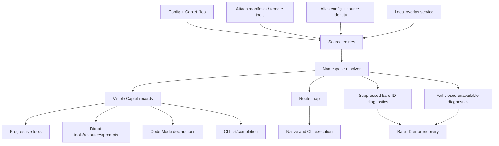

# feat: Add namespace shadowing policy

## Summary

Add `shadowing: namespace` as a third Caplet shadowing policy that exposes colliding Caplets under stable hash-suffixed qualified IDs, removes the ambiguous bare ID, and keeps non-colliding IDs unchanged across direct, progressive, Code Mode, CLI, and mixed native surfaces.

---

## Problem Frame

Remote Attach currently treats remote/local collisions as a binary policy: `forbid` suppresses the local overlay and `allow` lets the local overlay win. That is too coarse when users intentionally need both runtimes, such as local and remote browser/computer Caplets, and it creates agent-facing ambiguity when the same bare ID could mean two different execution contexts.

---

## Requirements

**Policy and identity**

- R1. Accept `shadowing: namespace` everywhere the existing shadowing policy is parsed, serialized, documented, and exposed.
- R2. Resolve any same-base-ID collision among participating local/upstream sources into qualified IDs when every affected upstream Caplet declares `shadowing: namespace`.
- R3. Preserve existing `forbid` and `allow` behavior for non-namespace collisions.
- R4. Remove the unqualified base ID from every exposure surface during a namespace collision.
- R5. Keep non-colliding Caplet IDs unchanged.

**Qualified IDs and aliases**

- R6. Generate qualified IDs as `<namespace-label>-<small-stable-hash>__<base-id>`.
- R7. Derive hash suffixes from durable source identity and keep them stable across normal restarts and unrelated config edits.
- R8. Support configured source-level namespace aliases for local and upstream sources; aliases replace labels rather than creating duplicate handles.
- R9. Validate namespace labels and generated IDs across each exposure context, failing closed with diagnostics when durable identity or uniqueness cannot be established.

**Surface parity**

- R10. Feed the same resolved identity map into MCP serve/session registration, progressive tools, direct tools/resources/prompts, Code Mode declarations/execution, native integrations, CLI list/inspect/execute/completion, and remote attach manifests.
- R11. Diagnostics for removed bare IDs must name the qualified alternatives and the reason the bare ID is unavailable.
- R12. Multiple upstream sources must be representable in the same exposure context, even when v1 commonly has one remote service plus local overlays.

---

## Key Technical Decisions

- **Centralize namespace resolution before rendering surfaces.** Add a resolver that takes normalized source entries and returns visible IDs, route metadata, suppressed bare IDs, and diagnostics. The resolver owns identity resolution and policy aggregation; adapters own only surface projection and execution through route maps.
- **Treat qualified IDs as visible IDs, not execution IDs.** The resolver records how `remote-a1b2__github` routes to the remote export and how `local-9f3c__github` routes to the local base Caplet. Existing child services should continue executing their own base/export IDs where possible.
- **Use source-level aliases in config.** Namespace aliases name sources, not individual Caplets. The plan uses a source-level alias model because the same local or remote source can collide on many Caplets and duplicate per-Caplet aliases would drift. Alias selectors bind to the same durable identities used for hashing: local config context for local sources and normalized remote profile or attach host identity for upstream sources.
- **Use a small stable hash suffix for every namespaced ID.** Use a deterministic hash of durable source identity with a fixed display length chosen before resolver implementation tests are written. Do not lengthen suffixes contextually after unrelated sources appear; if fixed-length generated IDs collide, fail closed with an actionable diagnostic.
- **Keep upstream policy authoritative.** Local config can name aliases, but it cannot convert an upstream `forbid` or `allow` collision into namespace behavior.
- **Route diagnostics as part of the identity map.** Bare-ID failures should not look like ordinary “server not found” errors when alternatives are known. Use one resolver-owned diagnostic payload with stable reason codes, alternatives, sources, and hints so CLI/native/Code Mode/direct surfaces render the same recovery information.
- **Scope uniqueness to an exposure context.** Validate generated IDs within the composed view being exposed, while deriving hash suffixes from source-global durable identity. Independent contexts should not constrain each other, but one composed view must never contain ambiguous IDs.
- **Fail closed across protocol/version gaps.** Attach manifests that carry `namespace` need explicit version/compatibility gating. Older peers or manifests that cannot represent `namespace` or source identity should produce protocol/version diagnostics rather than degrading to `forbid` or silently dropping a side.

---

### Namespace policy decision table

| Collision group                                                        | Visible outcome                                                                 | Diagnostic outcome                                                                               |
| ---------------------------------------------------------------------- | ------------------------------------------------------------------------------- | ------------------------------------------------------------------------------------------------ |
| Local + upstream `namespace`                                           | Qualified local and upstream IDs; no bare ID                                    | Bare ID reports namespace alternatives                                                           |
| Local + upstream `forbid`                                              | Existing remote-wins/local-suppressed behavior                                  | No namespace alternatives                                                                        |
| Local + upstream `allow`                                               | Existing local-wins behavior                                                    | No namespace alternatives                                                                        |
| Multiple upstreams, all `namespace`                                    | Qualified upstream IDs; no bare ID                                              | Bare ID reports namespace alternatives                                                           |
| Multiple upstreams with any `forbid` or `allow`                        | Preserve existing authoritative non-namespace behavior for the affected base ID | No namespace alternatives unless the resolver can prove a namespace-only subgroup is independent |
| Missing durable source identity or fixed-length generated-ID collision | No ambiguous qualified record is exposed                                        | Fail-closed diagnostic names the identity or uniqueness reason                                   |

The resolver owns this table. Adapters render its outputs and diagnostics but do not reinterpret mixed-policy groups.

---

## High-Level Technical Design

The resolver is the identity boundary. Everything downstream consumes resolved visible records, route metadata, and diagnostic payloads; nothing downstream decides independently whether `github` means local, remote, or both. Surface adapters project this result into MCP/native tool names, direct resource URIs, Code Mode declarations, CLI rows, and completions without reconstructing IDs by string parsing.

---

## Implementation Units

### U1. Extend shadowing policy contracts

- **Goal:** Add `namespace` to the shared policy type, runtime mirror types, Caplet-file parsing, attach manifest types, native remote types, and generated config/docs contracts.
- **Requirements:** R1, R3.
- **Dependencies:** None.
- **Files:**
  - `packages/core/src/config.ts`
  - `packages/core/src/config-runtime.ts`
  - `packages/core/src/caplet-files.ts`
  - `packages/core/src/caplet-files-bundle.ts`
  - `packages/core/src/caplet-source/parse.ts`
  - `packages/core/src/attach/api.ts`
  - `packages/core/src/serve/session.ts`
  - `packages/core/src/native/remote.ts`
  - `packages/core/src/native/service.ts`
  - `packages/core/src/code-mode/types.ts`
  - `apps/docs/src/content/docs/reference/config.mdx`
  - `apps/docs/src/content/docs/reference/caplet-files.mdx`
  - `packages/core/test/config.test.ts`
  - `packages/core/test/config-runtime.test.ts`
  - `packages/core/test/caplet-files.test.ts`
  - `packages/core/test/caplet-source.test.ts`
  - `packages/core/test/attach-api.test.ts`
  - `packages/core/test/serve-session.test.ts`
  - `packages/core/test/code-mode-mcp.test.ts`
- **Approach:** Update the policy enum in both config layers first, then propagate the type change through attach/native/Code Mode declarations without changing behavior yet. Existing `forbid` and `allow` tests remain the regression guard.
- **Execution note:** Start test-first with parsing/serialization fixtures so later behavior units cannot silently treat `namespace` as `forbid`.
- **Patterns to follow:** Existing `allow`/`forbid` tests in `packages/core/test/config.test.ts`, `packages/core/test/caplet-files.test.ts`, and `packages/core/test/attach-api.test.ts`.
- **Test scenarios:**
  - Parse `shadowing: namespace` from JSON config for every backend schema that currently accepts `shadowing`.
  - Parse `shadowing: namespace` from Markdown Caplet frontmatter and Caplet source summaries.
  - Emit `namespace` in attach manifests and Code Mode Caplet metadata without degrading it to `forbid`.
  - Confirm `forbid` defaults and `allow` behavior remain unchanged.
- **Verification:** Schema/type/docs checks recognize `namespace`, bundled Caplet-file parser output is regenerated or verified, and focused policy parsing tests pass.

### U2. Add namespace alias config and validation

- **Goal:** Add source-level namespace alias configuration and validate aliases before they can affect generated qualified IDs.
- **Requirements:** R6, R8, R9.
- **Dependencies:** U1.
- **Files:**
  - `packages/core/src/config.ts`
  - `packages/core/src/config-runtime.ts`
  - `packages/core/src/config/validation.ts`
  - `packages/core/test/config-validation.test.ts`
  - `packages/core/test/config.test.ts`
  - `apps/docs/src/content/docs/reference/config.mdx`
- **Approach:** Add a config shape for local alias plus upstream aliases keyed by durable source selector. Decide the selector contract in this unit before resolver integration: local aliases bind to local config context, while upstream aliases bind to normalized remote profile or attach host identity. Syntactic validation runs at config load; binding validation runs when local and remote sources are composed because duplicate aliases and generated-ID collisions can depend on attached manifests. Use conservative label syntax that works in CLI targets, Code Mode bracket keys, native direct tool names, and direct resource URI hosts.
- **Patterns to follow:** Existing zod validation and generated schema patterns in `packages/core/src/config.ts`; existing config validation tests for reject-with-path behavior.
- **Test scenarios:**
  - Accept local and remote source aliases that produce labels like `mac` and `vps`.
  - Reject aliases containing dots or `__`.
  - Reject duplicate aliases in one config context.
  - Confirm aliases replace namespace labels rather than adding secondary handles.
- **Verification:** Config validation rejects unsafe alias shapes before runtime resolution and generated docs describe the source-level alias model.

### U3. Implement namespace identity resolver

- **Goal:** Create the shared resolver that groups source entries by base ID, decides whether namespace applies, generates stable qualified IDs, records suppressed bare IDs, and returns route metadata.
- **Requirements:** R2, R4, R5, R6, R7, R9, R12.
- **Dependencies:** U1, U2.
- **Files:**
  - `packages/core/src/exposure/namespace.ts`
  - `packages/core/src/exposure/policy.ts`
  - `packages/core/test/exposure-namespace.test.ts`
  - `packages/core/test/exposure-policy.test.ts`
- **Approach:** Define normalized source-entry input with base ID, source kind, durable source identity, label/alias, upstream policy, route payload, and exposure-context identifier. For namespace collision sets, apply a resolver-owned decision table for mixed `forbid`/`allow`/`namespace` groups, generate `<label>-<hash>__<base-id>` for namespace entries, validate uniqueness against existing bare and generated IDs, and return diagnostics when any part cannot be resolved safely.
- **Technical design:** Directional resolver contract:
  - Inputs describe sources and original route payloads.
  - Outputs include visible records, a visible-ID route map, a suppressed bare-ID diagnostic map, and fail-closed unavailable diagnostics.
  - Hash suffixes are deterministic from durable source identity and can extend on generated-ID collision before failing closed.
  - Diagnostic payloads include `requestedId`, reason, alternatives, sources, and hint fields; adapters render from these fields rather than inventing wording independently.
- **Patterns to follow:** Existing exposure utilities in `packages/core/src/exposure/`; direct-name tests in `packages/core/test/exposure-direct-names.test.ts`.
- **Test scenarios:**
  - Covers AE1. Local-vs-remote namespace collision returns two qualified records and suppresses the bare ID.
  - Covers AE2. Non-colliding Caplets keep bare IDs.
  - Covers AE4 and AE5. Alias labels replace default labels for upstream and local sources.
  - Covers AE6. Upstream-vs-upstream collision produces distinct qualified IDs with no bare ID.
  - Covers AE7. Missing durable source identity returns a fail-closed diagnostic and no ambiguous visible record.
  - Mixed `forbid`/`allow`/`namespace` collisions preserve existing authoritative policy semantics and do not attach namespace diagnostics to `forbid`/`allow` outcomes.
  - Resolver-level diagnostics distinguish namespace collision, missing durable identity, alias validation failure, generated-ID collision, and unsupported protocol/version cases.
  - A generated qualified ID that collides with an existing bare ID extends suffix length or fails closed without overwriting.
- **Verification:** Resolver tests cover every origin acceptance example that does not require adapter integration.

### U4. Integrate resolver into native local/remote composition

- **Goal:** Make native progressive/direct/Code Mode tool listing and execution consume the namespace route map in remote + local overlay mode.
- **Requirements:** R2, R4, R10, R11, R12.
- **Dependencies:** U3.
- **Files:**
  - `packages/core/src/native/service.ts`
  - `packages/core/src/native/remote.ts`
  - `packages/core/src/native/tools.ts`
  - `packages/core/test/native-remote.test.ts`
  - `packages/core/test/native.test.ts`
- **Approach:** Replace binary local suppression for `namespace` collisions with resolver-backed merge output. Preserve local-first execution for existing `allow`, preserve suppression for existing `forbid`, and route qualified visible IDs through the route map to the correct child service/base ID/export. Replace aggregate Code Mode shadowing collapse with per-Caplet resolver entries so one remote Code Mode Caplet cannot suppress unrelated handles.
- **Patterns to follow:** Current `CompositeNativeCapletsService.mergeTools()` and `remoteSuppressedCapletIds()` tests in `packages/core/test/native-remote.test.ts`.
- **Test scenarios:**
  - Covers AE1. Remote/local colliding progressive tools list as qualified native tools and omit the bare native handle.
  - Direct tool names with qualified IDs execute against the correct local or remote source without parsing the qualified ID or operation name by delimiter.
  - Code Mode run tool includes only qualified colliding handles and routes them correctly.
  - Covers AE8 and AE9. Existing `forbid` suppression and `allow` local-wins behavior remain unchanged.
  - Bare colliding ID execution returns the shared namespace diagnostic with qualified alternatives.
  - Namespace collisions do not emit existing forbid-shadowing warnings, while forbid collisions still do.
- **Verification:** Native service listing and execution tests prove route metadata, not string splitting, drives execution.

### U5. Apply resolved IDs to attach and direct exposure artifacts

- **Goal:** Preserve namespace policy and source identity through MCP serve/session registration, attach manifests, and direct exposure resources, templates, prompts, completions, and primitive operations.
- **Requirements:** R1, R10, R11, R12.
- **Dependencies:** U3.
- **Files:**
  - `packages/core/src/attach/api.ts`
  - `packages/core/src/serve/session.ts`
  - `packages/core/src/native/remote.ts`
  - `packages/core/src/exposure/discovery.ts`
  - `packages/core/src/exposure/direct-names.ts`
  - `packages/core/test/attach-api.test.ts`
  - `packages/core/test/serve-session.test.ts`
  - `packages/core/test/code-mode-mcp.test.ts`
  - `packages/core/test/native-remote.test.ts`
  - `packages/core/test/exposure-discovery.test.ts`
  - `packages/core/test/exposure-direct-names.test.ts`
- **Approach:** Add source identity and base-ID metadata where attach clients need to resolve upstream collisions before broad remote composition depends on it. Thread resolved visible IDs and route maps through `CapletsMcpSession` so MCP serve registration, callbacks, resources, prompts, and Code Mode use the same IDs as attach/native surfaces. Keep attach invocation routed by export ID so client-side visible ID rewriting does not break stale-manifest retry. Ensure direct resource URI decoding maps visible hosts back to route metadata when a Caplet was namespaced.
- **Patterns to follow:** Existing attach projection route-map model in `packages/core/src/attach/api.ts`; direct-name helpers that encode names without parsing direct tool names back.
- **Test scenarios:**
  - MCP serve registers progressive tools, direct tools, resources, templates, prompts, and Code Mode callbacks under resolved visible IDs.
  - Attach manifests preserve `namespace`, base ID, source identity metadata, and protocol/version diagnostics for progressive, direct, and Code Mode exports.
  - Direct tool/resource/prompt names use qualified IDs for namespace collisions.
  - Attach invocation uses original export IDs/routes after visible ID qualification.
  - Direct resource URI reads with qualified hosts route to the correct underlying source.
  - A bare colliding MCP progressive tool is not registered, and calls to stale bare IDs fail with the shared namespace diagnostic when possible.
  - Stale attach visible IDs fail with namespace/protocol diagnostics rather than silently rebinding after manifest refresh.
- **Verification:** Attach manifest snapshots and remote native conversion tests show no degradation to `forbid` and no duplicate handles for aliases.

### U6. Update Code Mode declarations and execution parity

- **Goal:** Ensure Code Mode declarations, descriptions, sessions, and execution use the same resolved IDs as other surfaces.
- **Requirements:** R4, R10, R11.
- **Dependencies:** U3, U4, U5.
- **Files:**
  - `packages/core/src/code-mode/declarations.ts`
  - `packages/core/src/code-mode/types.ts`
  - `packages/core/src/native/service.ts`
  - `packages/core/src/native/remote.ts`
  - `packages/core/test/code-mode-declarations.test.ts`
  - `packages/core/test/code-mode-runner.test.ts`
  - `packages/core/test/code-mode-mcp.test.ts`
  - `packages/core/test/code-mode-cli.test.ts`
- **Approach:** Let declaration generation receive resolved callable IDs. Qualified IDs contain hyphens, so generated examples and tests should prefer bracket access while preserving the existing quoted-property behavior. Treat declaration hash changes as expected when namespace visibility changes.
- **Patterns to follow:** `propertyKey()` in `packages/core/src/code-mode/declarations.ts` already quotes non-JS identifiers.
- **Test scenarios:**
  - Covers AE1. Declarations include `caplets["remote-a1b2__github"]` and `caplets["local-9f3c__github"]`, not `caplets.github`.
  - Code Mode execution through a qualified handle routes to the intended source.
  - Reused sessions with stale declarations fail clearly after namespace visibility changes rather than silently rebinding a bare handle.
  - Mixed progressive/direct + Code Mode modes expose the same visible Caplet ID set, suppressed bare IDs, and alternatives.
- **Verification:** Code Mode tests prove declaration, handle lookup, execution, and mixed-mode parity.

### U7. Update CLI list, inspect, execution, and completion paths

- **Goal:** Make CLI remote mode and completions use qualified namespace IDs instead of local-first base-ID routing when namespace collisions exist.
- **Requirements:** R4, R10, R11.
- **Dependencies:** U3, U4.
- **Files:**
  - `packages/core/src/cli.ts`
  - `packages/core/src/cli/inspection.ts`
  - `packages/core/src/cli/completion.ts`
  - `packages/core/test/cli-remote.test.ts`
  - `packages/core/test/cli-completion.test.ts`
  - `packages/core/test/cli-completion-cache.test.ts`
  - `packages/core/test/cli.test.ts`
- **Approach:** Replace namespace-relevant local-first checks with resolver-backed lookup. `caplets list` and inspection should show qualified rows for namespace collisions; execution of a bare colliding ID should fail with alternatives; completion should offer qualified targets and omit the suppressed bare target.
- **Patterns to follow:** Current remote/local row merge and local overlay execution tests in `packages/core/test/cli-remote.test.ts`.
- **Test scenarios:**
  - Covers AE1 and AE3. `caplets list` shows qualified local and remote rows, and bare execution reports alternatives.
  - Qualified local target executes locally in remote mode.
  - Qualified remote target executes through remote control.
  - Completion suggests qualified local and remote targets and does not suggest the bare colliding target.
  - Stale completion cache entries do not silently rebind after alias/source changes; they refresh or fail with namespace diagnostics.
  - `caplets inspect github` during a namespace collision fails with alternatives, while `caplets inspect <qualified>` shows source/base metadata clearly enough to choose local vs remote.
  - Covers AE8 and AE9. Existing `forbid`/`allow` CLI behavior remains unchanged.
- **Verification:** CLI tests cover list, inspect/execute, completion, and local-overlay warning paths.

### U8. Update docs, generated artifacts, and integration fixtures

- **Goal:** Teach the new policy publicly and keep generated artifacts aligned with implementation truth.
- **Requirements:** R1, R6, R8, R10, R11.
- **Dependencies:** U1 through U7.
- **Files:**
  - `apps/docs/src/content/docs/reference/config.mdx`
  - `apps/docs/src/content/docs/reference/caplet-files.mdx`
  - `packages/pi/README.md`
  - `packages/opencode/README.md`
  - `packages/core/src/code-mode/runtime-api.d.ts`
  - `packages/core/src/code-mode/platform-entry.ts`
  - `.changeset/*.md`
  - `docs/brainstorms/2026-06-23-namespace-shadowing-policy-requirements.md`
  - `docs/plans/2026-06-23-001-feat-namespace-shadowing-policy-plan.md`
- **Approach:** Update docs after behavior is tested so examples match the final alias/hash shape. Regenerate config schema when `config.ts` changes. Regenerate Code Mode API artifacts only if public Code Mode declarations or platform API sources change.
- **Patterns to follow:** Project instructions for `pnpm schema:generate`, `pnpm code-mode:generate-api`, and generated docs checks.
- **Test scenarios:**
  - Public docs show `namespace`, hash-suffixed qualified ID examples, alias replacement, and fail-closed diagnostics.
  - Pi/OpenCode docs continue to explain progressive/direct/Code Mode exposure with the namespaced ID shape.
  - Generated schema check detects no drift after schema generation.
- **Verification:** Changeset is present, `pnpm schema:check`, `pnpm code-mode:check-api` when applicable, `pnpm docs:check`, and focused package tests pass.

---

## Acceptance Examples

- AE1. Remote `github` with `shadowing: namespace` plus local `github` exposes qualified remote/local IDs in every supported mode and omits `github`.
- AE2. Remote `linear` with no collision remains visible as `linear`.
- AE3. A bare `github` request during namespace collision fails with alternatives instead of selecting a default.
- AE4. Upstream alias `vps` produces `vps-<hash>__github` and no default-label duplicate.
- AE5. Local alias `mac` produces `mac-<hash>__github` and no default-label duplicate.
- AE6. Two upstream `github` Caplets with namespace policy expose distinct hash-suffixed IDs and no bare `github`.
- AE7. Missing durable source identity fails closed with diagnostics.
- AE8. `shadowing: forbid` keeps existing remote-wins/local-suppressed behavior.
- AE9. `shadowing: allow` keeps existing local-wins behavior.

---

## Scope Boundaries

- Namespace behavior applies only to base-ID collisions; non-colliding Caplets keep normal IDs.
- Local config can configure aliases but cannot override an upstream `forbid` or `allow` policy into namespace behavior.
- Local-local duplicate preservation is out of scope because local config merge already collapses duplicate local IDs before runtime.
- Convenience bare-ID aliases during namespace collisions are out of scope.

### Deferred to Implementation

- Exact config key names for namespace aliases may adjust during implementation, but selector semantics must remain source-level and durable-identity based.
- Exact hash algorithm and fixed display length may adjust during implementation, but suffixes must remain deterministic, small, source-identity based, and non-contextual.

---

## System-Wide Impact

This change affects Caplets' identity contract across the product. It changes config validation, attach protocol types, native service composition, remote/local routing, direct tool/resource/prompt naming, Code Mode declarations, CLI remote-mode behavior, shell completion, public docs, and generated schema artifacts. The critical invariant is that all user and agent surfaces see the same visible Caplet ID set, suppressed bare IDs, diagnostic alternatives, and route semantics for a given exposure context.

---

## Risks & Dependencies

- **Durable identity risk:** Local and remote sources currently expose different amounts of identity metadata. Mitigation: design resolver inputs first and fail closed when identity is missing.
- **Surface drift risk:** Existing logic is split across native service merge, remote manifest conversion, CLI row merge, completion, direct exposure, and Code Mode generation. Mitigation: add a resolver with adapter tests and parity scenarios.
- **Attach protocol risk:** Upstream-vs-upstream support may require attach manifests to carry source identity metadata rather than only `capletId`. Mitigation: update protocol types before behavior integration and keep invocation routed by export ID.
- **String parsing risk:** Qualified IDs include double underscores inside direct/native tool names. Mitigation: route by explicit metadata maps, not by splitting names.
- **Pending prerequisite:** If the remote-list shadowing fix from the earlier PR has not landed, coordinate or rebase before CLI list/execute work.

---

## Documentation / Operational Notes

- Add a changeset because this changes public config/schema behavior and package-facing runtime semantics.
- Run schema checks immediately after config/alias units, and keep the final generated-artifact pass as a second guard.
- Update generated config schema after changing `packages/core/src/config.ts`.
- Keep examples focused on bracket-access Code Mode handles for hash-suffixed IDs, e.g. `caplets["remote-a1b2__github"]`.
- Diagnostics should be written for agent recovery: name the missing bare ID, explain that namespace removed it, and list qualified alternatives.

---

## Sources / Research

- Origin requirements: `docs/brainstorms/2026-06-23-namespace-shadowing-policy-requirements.md`.
- Repo research covered native service composition, remote attach manifests, CLI remote mode, direct exposure naming, Code Mode declarations, agent-surface parity, and existing institutional learnings.
- Core contracts: `packages/core/src/config.ts`, `packages/core/src/config-runtime.ts`, `packages/core/src/attach/api.ts`, `packages/core/src/native/service.ts`, `packages/core/src/native/remote.ts`, `packages/core/src/exposure/discovery.ts`, `packages/core/src/code-mode/declarations.ts`, `packages/core/src/cli.ts`.
- Strategy anchor: `STRATEGY.md` frames Caplets as a Code Mode-first capability layer that must keep remote/local/native agent semantics trustworthy.
