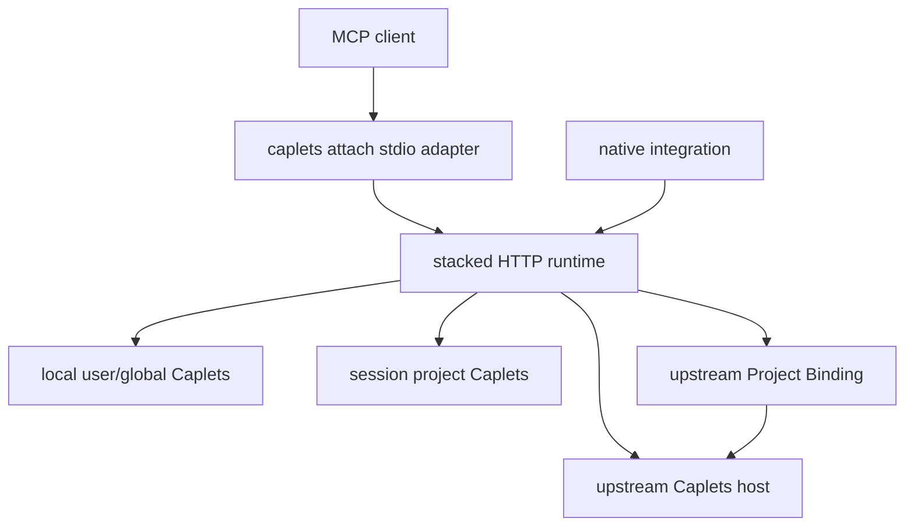

# feat: Add stacked remote runtime

## Summary

Implement a stacked HTTP runtime where `caplets serve --transport http --upstream-url <url>` composes local, project, and upstream Caplets, while `caplets attach <url>` becomes a stdio-only session adapter that supplies project context.

---

## Problem Frame

Codex can launch MCP commands without the user's expected shell environment, which makes env-interpolated Caplets config unreliable when the agent process starts the runtime directly. A long-running Caplets-controlled HTTP runtime can own env, Vault, Remote Profile, health, reload, and Project Binding behavior, leaving the MCP client to launch a thin stdio adapter.

---

## Requirements

**Command contract**

- PR1. `caplets serve --transport http --upstream-url <url>` starts the stacked runtime described by these requirements.
- PR2. `caplets attach <url>` is stdio-only for normal MCP use and no longer presents HTTP serving as an attach mode.
- PR3. Attach and native sessions carry project root into the stacked runtime without relying on the runtime process CWD.

**Runtime composition**

- PR4. The stacked runtime composes local user/global Caplets, session project Caplets, and upstream Caplets through the same local/remote composition semantics used by Remote Attach.
- PR5. Existing upstream-authored shadowing behavior remains authoritative for collisions.
- PR6. Upstream Project Binding starts automatically when a project root and upstream support are present.

**Safety and diagnostics**

- PR7. Removed or deprecated attach HTTP options fail with guidance to `caplets serve --transport http --upstream-url <url>`.
- PR8. Project Binding degradation leaves safe local and upstream capabilities available with a recoverable diagnostic.
- PR9. Agent configs and attach session metadata do not contain remote credentials or local secret values.

---

## Key Technical Decisions

- **KTD1. Model `--upstream-url` as a serve composition mode.** The command publishes a runtime and should route through the server lifecycle, while `attach` stays a per-client adapter.
- **KTD2. Reuse the native remote composition path.** `packages/core/src/native/service.ts` already resolves local and upstream tools, applies namespace routing, and handles local overlay warnings; stacked serve should wrap or extract that path instead of building a second resolver.
- **KTD3. Keep project context session-scoped.** A long-running HTTP server can serve multiple repositories, so project root must come from each attach/native session rather than server startup state.
- **KTD4. Treat attach HTTP flags as compatibility hazards.** Public help should remove them; non-stdio transport and HTTP bind flags should reject with migration guidance.
- **KTD5. Preserve Remote Profile and Project Binding ownership.** Upstream auth remains in Remote Profiles, and upstream project sync uses existing Project Binding safety rules.

---

## High-Level Technical Design

The runtime owns composition and diagnostics. The attach adapter owns stdio bridging and session metadata only.

---

## Implementation Units

### U1. Lock the attach command to stdio

- **Goal:** Remove HTTP serving from the public `caplets attach` contract while keeping stdio attach behavior.
- **Requirements:** PR2, PR7
- **Dependencies:** U2 replacement path available in the same release slice
- **Files:** `packages/core/src/cli.ts`, `packages/core/src/attach/options.ts`, `packages/core/src/attach/server.ts`, `packages/core/test/attach-cli.test.ts`
- **Approach:** Remove attach help for `--transport`, `--host`, `--port`, `--path`, `--allow-unauthenticated-http`, and `--trust-proxy` only after `serve --transport http --upstream-url <url>` is available in the same release slice. Reject every explicit attach transport or HTTP bind flag, including `--transport stdio`; `caplets attach <url>` is stdio by omission. Then enforce that attach resolution always produces stdio options.
- **Execution note:** Start with failing CLI tests for help output and rejected HTTP attach usage.
- **Patterns to follow:** Existing hidden `--remote-url` compatibility in `packages/core/src/cli.ts`; current attach tests in `packages/core/test/attach-cli.test.ts`.
- **Test scenarios:** `caplets attach --help` omits transport and HTTP bind flags; `caplets attach <url> --transport http`, `caplets attach <url> --transport stdio`, and attach HTTP bind flags reject with serve-upstream guidance; `caplets attach <url>` still resolves stdio and Remote Profile selection; `caplets attach --once` still validates Project Binding without starting MCP stdio.
- **Verification:** Attach cannot start an HTTP server path, and existing remote attach/stdout JSON behavior remains covered.

### U2. Add `--upstream-url` to HTTP serve

- **Goal:** Let `caplets serve --transport http --upstream-url <url>` start a remote-backed composed runtime.
- **Requirements:** PR1, PR4, PR5, PR9
- **Dependencies:** None
- **Files:** `packages/core/src/cli.ts`, `packages/core/src/serve/options.ts`, `packages/core/src/serve/index.ts`, `packages/core/src/attach/options.ts`, `packages/core/src/attach/server.ts`, `packages/core/test/cli.test.ts`, `packages/core/test/serve-options.test.ts`
- **Approach:** Extend serve option parsing with `upstreamUrl`, keep it valid only for HTTP serve, resolve upstream selection through the same Remote Profile path as attach, and route upstream-backed HTTP serve through a reusable native session factory. Stacked HTTP serve must use the same bind-address and authentication gates as existing HTTP serve; `/v1/mcp` and `/v1/attach` must reject unauthenticated requests unless the existing explicit unauthenticated HTTP opt-in is set. Normalize upstream runtime identity, propagate stack identity metadata through upstream calls, reject self-references and loops, and enforce a small maximum stack depth with recoverable diagnostics.
- **Execution note:** Add failing tests for serve help, option parsing, and remote profile resolution before implementation.
- **Patterns to follow:** `resolveAttachServeOptions` for remote selection and auth plumbing; `serveHttpWithSessionFactory` in `packages/core/src/serve/http.ts` for HTTP serving with custom session construction.
- **Test scenarios:** `serve --transport http --upstream-url <url>` resolves HTTP defaults and upstream selection; missing Remote Profile reports the same recovery path as attach; `--upstream-url` with stdio serve rejects; self-referential upstream URLs reject with a stack-cycle diagnostic; chained runtimes reject `A -> B -> A` loops and over-depth chains with recoverable diagnostics; unauthenticated requests to stacked `/v1/mcp` and `/v1/attach` reject unless the existing unauthenticated HTTP opt-in is set; diagnostics redact Authorization headers, Remote Profile tokens, env-derived config values, and Vault values; `--remote-url` is not accepted as the new serve flag unless a deliberate hidden alias is chosen.
- **Verification:** The HTTP server path can be constructed with an upstream-backed native session without changing local-only `caplets serve`.

### U3. Define the session-aware attach API

- **Goal:** Make `/v1/attach` session-aware so attach clients resolve the same per-project stacked surface as MCP sessions.
- **Requirements:** PR3, PR4, PR9
- **Dependencies:** U2
- **Files:** `packages/core/src/serve/http.ts`, `packages/core/src/attach/server.ts`, `packages/core/src/native/service.ts`, `packages/core/test/attach-cli.test.ts`, `packages/core/test/native-remote.test.ts`
- **Approach:** Define how the stdio attach adapter creates or identifies an attach session with `projectRoot` and `projectConfigPath`, how `/v1/attach/manifest`, `/v1/attach/events`, and `/v1/attach/invoke` route to that session, and how per-session native services are keyed, closed, or expired. Local project Caplets are loaded by the stacked runtime from the session project root; Project Binding is only for upstream project-bound capabilities. The runtime must accept `projectRoot` only from authenticated attach/native sessions, canonicalize it with realpath, require project config resolution to stay under that root, and reject arbitrary project-root claims from unauthenticated HTTP requests. Session metadata must be an allowlisted non-secret shape and must not carry Authorization headers, Remote Profile tokens, env-derived config values, or Vault values.
- **Execution note:** Characterize current `/v1/attach` manifest, events, and invoke behavior before changing the projection model.
- **Patterns to follow:** Existing attach HTTP routes in `packages/core/src/serve/http.ts`; `NativeCapletsMcpSession` lifecycle in `packages/core/src/native/service.ts`.
- **Test scenarios:** `caplets attach <local-runtime-url>` creates a session before manifest resolution; `/v1/attach/manifest`, `/v1/attach/events`, and `/v1/attach/invoke` use the same session projection; session metadata matches the allowlisted non-secret shape; two attach sessions from different roots do not share project Caplets; unauthenticated HTTP requests cannot claim arbitrary project roots; project config paths outside the canonical root are rejected; closing one attach session releases its per-session native service without affecting another.
- **Verification:** Attach clients and native integrations see the composed stacked surface through attach endpoints, not only through `/v1/mcp`.

### U4. Carry session project context through attach and native integrations

- **Goal:** Make project root a per-session input to stacked HTTP runtimes.
- **Requirements:** PR3, PR4
- **Dependencies:** U3
- **Files:** `packages/core/src/attach/options.ts`, `packages/core/src/attach/server.ts`, `packages/core/src/serve/http.ts`, `packages/core/src/native/service.ts`, `packages/opencode/src/*`, `packages/pi/src/*`, `packages/core/test/attach-cli.test.ts`, `packages/core/test/native-remote.test.ts`
- **Approach:** Define the session metadata shape that carries project root from stdio attach and native integrations into the runtime. Use CWD for CLI attach, explicit integration project root where available, and existing project config resolution for local project Caplets.
- **Execution note:** Characterize current project config resolution before changing cross-session behavior.
- **Patterns to follow:** `resolveAttachServeOptions` currently uses `process.cwd()` as project root; `nativeNamespaceContext` derives local identity from config and project config paths.
- **Test scenarios:** Two attach sessions with different project roots resolve different project config paths; a native integration-supplied project root overrides CWD; absence of project root yields local user/global Caplets without project Caplets.
- **Verification:** A long-running stacked runtime does not leak one client's project Caplets into another client's session.

### U5. Preserve shadowing and namespace behavior in stacked mode

- **Goal:** Ensure stacked composition follows existing `forbid`, `allow`, and `namespace` collision semantics.
- **Requirements:** PR4, PR5, PR9
- **Dependencies:** U2
- **Files:** `packages/core/src/native/service.ts`, `packages/core/src/exposure/namespace.ts`, `packages/core/test/native-remote.test.ts`, `packages/core/test/exposure-namespace.test.ts`
- **Approach:** Feed stacked upstream and local/project sources into the existing namespace resolver with durable source identity. Add tests based on the Hosted #1 and Hosted #2 example from the requirements doc.
- **Execution note:** Write regression tests first; the expected behavior is already defined by Namespace Shadowing.
- **Patterns to follow:** Namespace requirements in `docs/brainstorms/2026-06-23-namespace-shadowing-policy-requirements.md`; resolver tests in `packages/core/test/exposure-namespace.test.ts`.
- **Test scenarios:** `shadowing: forbid` routes bare ID upstream and suppresses local same-ID; `shadowing: allow` keeps local bare-ID behavior; `shadowing: namespace` exposes qualified local and upstream IDs and rejects the bare ID; generated IDs use configured aliases.
- **Verification:** Stacked mode does not introduce a new precedence model.

### U6. Start upstream Project Binding automatically

- **Goal:** Bind session project context upstream when the upstream supports Project Binding.
- **Requirements:** PR6, PR8
- **Dependencies:** U4, U5
- **Files:** `packages/core/src/project-binding/attach.ts`, `packages/core/src/native/service.ts`, `packages/core/src/attach/server.ts`, `packages/core/src/cli/doctor.ts`, `packages/core/test/native-remote.test.ts`, `packages/core/test/attach-cli.test.ts`
- **Approach:** Extract a remote-agnostic Project Binding session manager backed by `ResolvedCapletsRemote` and the existing attach Project Binding session path, then wire Cloud presence as one credential/source variant rather than the only automatic binding path. Stacked `serve --transport http --upstream-url <url>` uses degraded Project Binding behavior by default: unavailable upstream binding leaves local project Caplets and non-project upstream Caplets available with diagnostics. Upstream auth and Remote Profile failures still fail closed. Existing hard-fail behavior applies only to pre-existing explicit remote paths outside stacked serve.
- **Execution note:** Add failure-path tests before wiring automatic binding so degraded behavior is explicit.
- **Patterns to follow:** `docs/native-integrations.md` documents lazy hosted Project Binding behavior; `docs/project-binding.md` defines states and recovery commands; existing attach Project Binding helpers provide the remote-agnostic session contract.
- **Test scenarios:** Project Binding starts when upstream endpoint is reachable; WebSocket upgrade preflight behavior remains accepted; unavailable upstream binding leaves local project and non-project upstream capabilities available with warning; revoked credentials still fail closed.
- **Verification:** `caplets doctor` and attach diagnostics can distinguish upstream auth failure from Project Binding degradation.

### U7. Update docs, setup guidance, and changelog

- **Goal:** Teach the new command split and avoid new users copying deprecated attach transport usage.
- **Requirements:** PR1, PR2, PR7
- **Dependencies:** U1, U2, U3, U4, U5, U6
- **Files:** `README.md`, `apps/docs/src/content/docs/remote-attach.mdx`, `apps/docs/src/content/docs/agent-integrations.mdx`, `apps/docs/src/content/docs/troubleshooting.mdx`, `docs/native-integrations.md`, `docs/project-binding.md`, `packages/core/CHANGELOG.md`, `.changeset/*`
- **Approach:** Document `serve --transport http --upstream-url` as the stacked runtime command and `attach <url>` as stdio-only. Add migration notes for attach HTTP flags and project-context behavior.
- **Execution note:** None.
- **Patterns to follow:** Existing Remote Attach docs and the solution note in `docs/solutions/developer-experience/self-hosted-pending-remote-login-and-attach-positional-url.md`.
- **Test scenarios:** Documentation assertions are covered by existing docs checks; add targeted string tests only if current docs tests already cover command snippets.
- **Verification:** `pnpm docs:check`, `pnpm schema:check` if option schemas changed, and focused CLI tests cover the command contract.

---

## Scope Boundaries

- This plan implements one upstream URL per stacked runtime.
- This plan does not replace Namespace Shadowing or introduce local-project-wins precedence.
- This plan does not redesign daemon installation, though daemon config may later use `serve --transport http --upstream-url`.
- This plan does not expose local env, local Vault values, or upstream credentials to agent config.

---

## Risks & Dependencies

- Namespace Shadowing must be available or carried as a prerequisite because stacked runtime correctness depends on existing collision semantics.
- Session-scoped project context may require attach HTTP API changes; that should be treated as a contract change with tests before implementation.
- Rejecting attach HTTP mode could break hidden users of `caplets attach --transport http`; the implementation should decide whether `--transport stdio` receives a compatibility warning before complete removal.
- Upstream Project Binding degradation must be explicit enough that users can distinguish "remote tools are gone" from "project-bound remote tools are unavailable."

---

## Sources / Research

- Requirements and implementation plan: this document.
- Product strategy: `STRATEGY.md`, especially the Remote runtime and Project Binding track.
- Domain vocabulary: `CONCEPTS.md`.
- Current attach command and serve command definitions: `packages/core/src/cli.ts`.
- Current attach serve option resolution: `packages/core/src/attach/options.ts`.
- Current stdio/HTTP attach serving split: `packages/core/src/attach/server.ts`.
- HTTP serving session factory: `packages/core/src/serve/http.ts`.
- Existing local/upstream composition and namespace routing: `packages/core/src/native/service.ts` and `packages/core/src/exposure/namespace.ts`.
- Project Binding behavior: `docs/project-binding.md` and `docs/native-integrations.md`.
