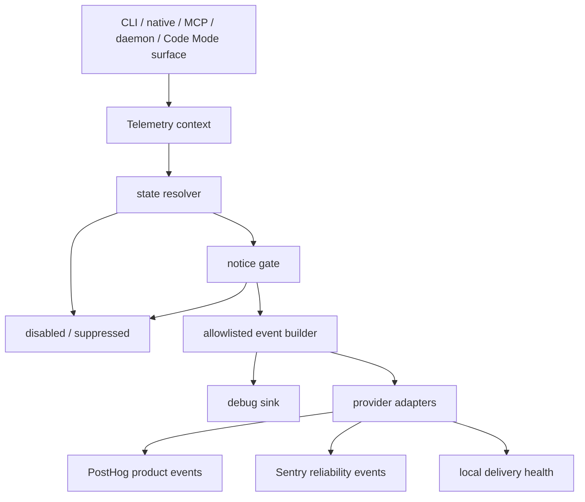
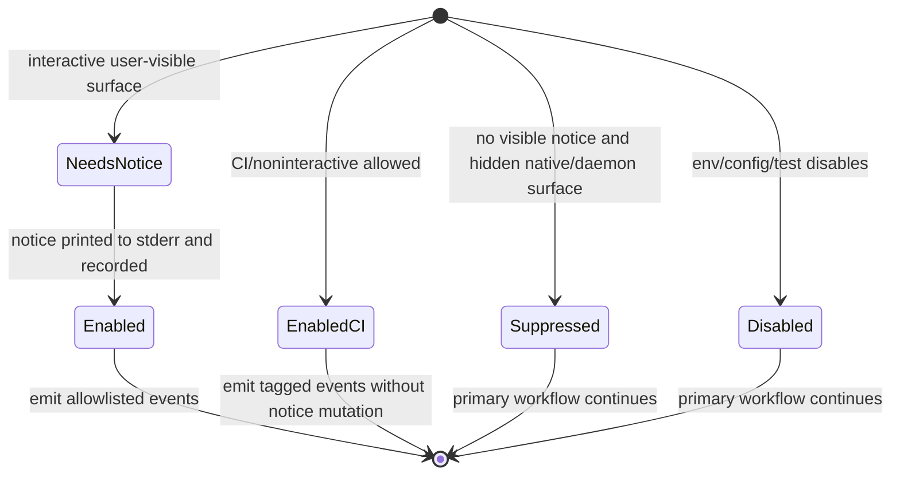

# feat: Add anonymous telemetry

## Summary

Add opt-out anonymous telemetry across the Caplets CLI, MCP serve/attach flows, daemon workflows, Code Mode, and native integrations. PostHog captures categorical product usage events, while Sentry captures sanitized reliability events; both providers are gated by shared config/env controls, first-run transparency, and strict allowlisted payloads.

## Problem Frame

Caplets needs better aggregate product evidence for setup friction, CLI versus native usage, local versus remote or Cloud runtime adoption, Code Mode versus progressive/direct exposure, backend-family investment, and reliability pressure. The same surfaces run near local config, prompts, tool calls, Code Mode source, credentials, and filesystem paths, so telemetry must be designed as privacy-sensitive infrastructure rather than scattered provider calls.

The implementation should make anonymous telemetry visible, controllable, and auditable without blocking the primary CLI, MCP, daemon, attach, or native-integration workflow.

## Requirements

**Consent, controls, and notice**

- R1. Anonymous telemetry is enabled by default unless disabled by config, environment, test detection, or notice gating.
- R2. Top-level `telemetry: false` in user Caplets `config.json` disables both PostHog and Sentry.
- R3. `CAPLETS_DISABLE_TELEMETRY=1` disables both providers for the current process and takes precedence over config.
- R4. `caplets telemetry status`, `enable`, `disable`, `delete-id`, `rotate-id`, and `debug` expose local state and controls.
- R5. User-visible first-run notice writes only to stderr, includes the exact disable controls, and is recorded only when stderr is an interactive TTY or a tested integration-visible notice channel is used.
- R6. Native-first and hidden-stderr daemon surfaces suppress telemetry until a durable visible notice has already been recorded.
- R7. CI and non-interactive usage may send categorical telemetry without recording a visible-notice state; test environments suppress telemetry automatically.

**Identity and event model**

- R8. Telemetry uses a random stable anonymous installation ID stored in Caplets-owned state, never derived from names, paths, hosts, URLs, config, credentials, or Caplet IDs.
- R9. Product events cover setup and activation milestones, surface category, runtime mode, execution context, backend-family counts, exposure-mode counts, operation family, first successful tool execution, and Code Mode outcome categories.
- R10. Reliability events include only package/version, surface, runtime mode, command family, Caplets error code, operating system family, architecture, Node major version, and other approved categorical context.
- R11. Event names and property keys are allowlisted; properties are categorical, boolean, count, or bucketed timing values unless explicitly approved.

**Privacy and provider operations**

- R12. Telemetry never collects raw config, prompts, Code Mode code, tool arguments, tool outputs, logs, resource contents, prompt contents, file paths, URLs, hostnames, Caplet IDs, credentials, tokens, raw env, or unsanitized stack traces.
- R13. Disablement and test suppression are resolved before provider clients are initialized.
- R14. PostHog and Sentry identifiers shipped with packages are intake-only, environment-specific, revocable, and not management/read/admin credentials.
- R15. Provider-side IP capture, geolocation enrichment, scrubbing, retention, quota, and ingestion monitoring are launch prerequisites.
- R16. Telemetry is fire-and-forget for users, but provider initialization failures, event drops, and delivery-health uncertainty are observable for maintainers.
- R17. The first release includes a lightweight analysis surface mapping events back to the brainstorm's decision questions.

## Key Technical Decisions

- **KTD1. Centralize telemetry in `@caplets/core`.** CLI, serve, attach, daemon, Code Mode, and native packages already route through core boundaries, so the privacy gate, state resolver, event schemas, debug sink, and providers should live under `packages/core/src/telemetry/`.
- **KTD2. Use top-level user-config opt-out.** The user-facing key is `telemetry`, not an `options.telemetry` nested value. `caplets telemetry enable|disable` mutates the user config only; project config does not get a telemetry control in this release.
- **KTD3. Resolve state before importing or constructing provider clients.** The telemetry layer must short-circuit on env disablement, config disablement, test suppression, or missing visible notice before Sentry/PostHog clients are initialized.
- **KTD4. Treat the event schema as the primary privacy boundary.** Existing redaction helpers are a secondary defense. Reportable events are constructed from explicit allowlisted categorical fields rather than sanitized copies of arbitrary errors, configs, requests, tool args, or logs.
- **KTD5. Store identity and notice state in Caplets state, not config.** Config owns the user's opt-out preference. State owns random install ID, notice-shown marker, local delivery-health counters, and debug metadata.
- **KTD6. Suppress native-first telemetry until transparency exists.** OpenCode, Pi, and hidden daemon paths do not count hidden stderr or internal logs as user-visible notice. They may send only after CLI/status notice state exists or after a future native-visible notice channel is added.
- **KTD7. Allow CI/noninteractive collection without visible-notice mutation.** CI usage is product signal, but CI cannot satisfy a visible notice gate reliably. These events are tagged as CI/noninteractive and never mark the local notice as shown.
- **KTD8. Use official provider SDKs behind adapters.** Add `@sentry/node` and `posthog-node` to core behind lazy adapter factories. Do not build a Caplets relay or hand-rolled HTTP transport in the first release.
- **KTD9. Keep telemetry non-blocking and bounded.** Events are queued or dropped with local delivery-health accounting; repeated failures and CI loops are sampled or rate-limited.
- **KTD10. Make provider readiness an implementation gate, not a release afterthought.** Provider privacy settings, retention, ingestion monitoring, revocation, and decision-question readouts must be validated before broad instrumentation lands.

## High-Level Technical Design

The shared telemetry layer has four jobs:

- Resolve enabled/disabled/suppressed/debug state from env, config, execution context, notice state, and test detection.
- Create or read a random anonymous installation ID only when an event is eligible to send.
- Build product and reliability events from typed allowlists.
- Send through debug, PostHog, or Sentry adapters without blocking user workflows.

## System-Wide Impact

- **Configuration:** User config gains a top-level telemetry control and generated schema changes. Project config remains out of the control surface so repositories cannot silently override a user's privacy preference.
- **State lifecycle:** Caplets-owned state gains anonymous identity, notice, and delivery-health records. Disablement preserves identity by default; delete and rotate commands are explicit local state mutations and do not erase provider-side historical anonymous events.
- **CLI behavior:** Eligible commands may write one stderr notice before telemetry sends when stderr is an interactive TTY. Stdout, especially JSON output, remains a compatibility boundary and must not receive notice text or debug noise unless the command is explicitly `telemetry debug`.
- **Runtime behavior:** Serve, attach, daemon, MCP callbacks, native services, and Code Mode receive a telemetry context. Provider failures are swallowed after local health accounting, and primary tool execution results remain unchanged.
- **Privacy boundary:** Event builders become a new compatibility surface. Future telemetry additions must extend typed allowlists and tests rather than append arbitrary provider properties.
- **Provider operations:** Shipping SDKs and intake identifiers creates an operational dependency on provider privacy settings, retention, scrubbing, ingestion monitoring, and revocation playbooks.

## Telemetry Event Boundaries

The implementation may refine exact event names, but every event must remain inside these categories and property families.

| Category          | Provider                   | Examples                                                                      | Allowed properties                                                                                                                       |
| ----------------- | -------------------------- | ----------------------------------------------------------------------------- | ---------------------------------------------------------------------------------------------------------------------------------------- |
| Setup funnel      | PostHog                    | init, setup, add, auth, remote login, doctor                                  | package, version, surface, runtime mode, execution context, command family, outcome                                                      |
| Runtime lifecycle | PostHog                    | serve start, attach start, daemon install/start/status, native startup/reload | surface, runtime mode, execution context, integration, outcome, duration bucket                                                          |
| Tool activation   | PostHog                    | first successful tool execution, progressive/direct operation family          | surface, runtime mode, exposure mode, backend-family counts, operation family, outcome                                                   |
| Code Mode outcome | PostHog                    | CLI/MCP/native Code Mode run                                                  | surface, runtime scope, outcome, timeout bucket, duration bucket, diagnostic code categories, session created/reused, any caplet invoked |
| Reliability       | Sentry                     | CLI/native/serve/attach/daemon failures                                       | package, version, surface, runtime mode, command family, error code, diagnostic category, OS family, architecture, Node major            |
| Delivery health   | PostHog or local aggregate | provider init/drop/send failure counts                                        | provider, reason category, count bucket, surface, execution context                                                                      |

Never include downstream tool names, Caplet IDs, raw command arguments, raw error messages, stack traces, URLs, hostnames, paths, code, logs, prompt/resource content, credentials, token values, or env values in provider payloads.

Sentry grouping must use an explicit categorical fingerprint, such as package, surface, command family, runtime mode, error code, and diagnostic category. Adapter tests should snapshot final tags/fingerprint after local filtering and `beforeSend` so privacy controls do not erase the ability to group reliability pressure.

## Origin Trace

| Origin flow or acceptance example                | Planned coverage                                                                                                                                                       |
| ------------------------------------------------ | ---------------------------------------------------------------------------------------------------------------------------------------------------------------------- |
| F1 first eligible CLI run; AE3, AE4              | U1 and U3 define notice state, stderr-only printing, and repeat suppression; U4 and U5 apply it to eligible CLI, serve, and attach paths.                              |
| F2 telemetry-disabled run; AE1, AE2, AE7         | U1 resolves env/config/test suppression before providers exist; U2 proves disabled/test/debug paths do not construct provider clients; U7 covers native startup.       |
| F3 native integration usage; AE8, AE13           | U7 instruments OpenCode/Pi/native service usage and suppresses native-first telemetry unless visible notice state already exists.                                      |
| F4 sanitized error capture; AE10, AE11           | U2 defines reliability allowlists and Sentry filtering; U4, U5, U6, and U7 emit sanitized failure categories from CLI, runtime, Code Mode, and native boundaries.      |
| AE5 telemetry debug                              | U2 provides the debug sink; U3 exposes `caplets telemetry debug -- <caplets args...>`.                                                                                 |
| AE6 CI context                                   | U1 classifies CI/noninteractive usage; U4 and U5 propagate execution context into product events.                                                                      |
| AE9 backend/exposure counts                      | U5 captures backend-family and exposure-mode counts from runtime/tool boundaries without Caplet IDs.                                                                   |
| AE12, AE15, AE16, AE17, AE18 provider operations | U2 handles local delivery health and bounded transport; U9 establishes provider readiness and readout gates; U8 publishes final user-facing docs and release metadata. |

## Implementation Units

### U1. Add telemetry config, state paths, and resolver

- **Goal:** Establish the shared local controls, identity, notice, and suppression model before any provider work.
- **Requirements:** R1, R2, R3, R5, R6, R7, R8, R13
- **Dependencies:** None
- **Files:** `packages/core/src/config.ts`, `packages/core/src/config/paths.ts`, `schemas/caplets-config.schema.json`, `config.example.json`, `packages/core/src/telemetry/state.ts`, `packages/core/src/telemetry/context.ts`, `packages/core/src/telemetry/identity.ts`, `packages/core/src/telemetry/notice.ts`, `packages/core/test/config.test.ts`, `packages/core/test/config-validation.test.ts`, `packages/core/test/config-paths.test.ts`, `packages/core/test/telemetry-state.test.ts`
- **Approach:** Add strict top-level `telemetry?: boolean` parsing for user config and generated schema, but make it a global-only preference: project config must not override it. Implement this by reading or preserving the user telemetry preference before project merge and rejecting, warning on, or ignoring `telemetry` in project config with explicit tests. Add Caplets state paths for telemetry identity, notice, and delivery-health files using owner-only permissions where supported and atomic writes for identity/notice updates. Implement a resolver that returns `enabled`, `disabled`, `suppressed`, or `debug` with the deciding control and never initializes providers. Generate the anonymous ID as random state only when an enabled send path needs it; disabling telemetry does not delete the ID unless the user asks.
- **Execution note:** Start with failing tests for env precedence, user-config disablement, project-config non-override, config parse failure suppression, test-env suppression, native hidden-surface suppression, visible-notice predicate, CI identity scope, and state path resolution.
- **Patterns to follow:** Config schema source in `packages/core/src/config.ts`; XDG/platform path helpers in `packages/core/src/config/paths.ts`; config tests that use temporary `CAPLETS_CONFIG`.
- **Test scenarios:** `telemetry: false` in user config disables both providers; `telemetry` in project config cannot enable or disable telemetry; `CAPLETS_DISABLE_TELEMETRY=1` wins over config; invalid config suppresses telemetry rather than guessing; test env suppresses telemetry; CI is classified without notice mutation; CI uses a persisted random ID when Caplets state persists and an explicitly tagged ephemeral ID when state is unavailable; identity is random and stable; disable/re-enable preserves the ID; state paths are platform-correct and owner-only where supported.
- **Verification:** `pnpm --filter @caplets/core test -- test/config.test.ts test/config-validation.test.ts test/config-paths.test.ts test/telemetry-state.test.ts` and `pnpm schema:check`.

### U2. Build event schemas, privacy guard, debug sink, and provider adapters

- **Goal:** Create the allowlisted event pipeline before instrumenting product surfaces.
- **Requirements:** R9, R10, R11, R12, R13, R14, R16
- **Dependencies:** U1
- **Files:** `packages/core/package.json`, `pnpm-lock.yaml`, `packages/core/src/telemetry/events.ts`, `packages/core/src/telemetry/privacy.ts`, `packages/core/src/telemetry/providers.ts`, `packages/core/src/telemetry/posthog.ts`, `packages/core/src/telemetry/sentry.ts`, `packages/core/src/telemetry/debug.ts`, `packages/core/src/telemetry/delivery.ts`, `packages/core/src/telemetry/index.ts`, `packages/core/test/telemetry-events.test.ts`, `packages/core/test/telemetry-providers.test.ts`, `packages/core/test/telemetry-redaction.test.ts`
- **Approach:** Add official SDK dependencies behind lazy adapter factories only after an early go/no-go spike proves disabled-path imports, import side effects, transitive package weight, shutdown behavior, and final provider payloads fit the privacy and runtime constraints. If either SDK fails those gates, disable that adapter or substitute a minimal sanitized transport before broad instrumentation. Define typed product and reliability event builders that reject unknown event names and property keys in tests. Configure PostHog with anonymous captures, explicit GeoIP disabling, bounded queue settings, and shutdown behavior for short-lived processes. Configure Sentry with `sendDefaultPii: false`, no traces/profiles/log collection, categorical fingerprints/tags, `beforeSend` privacy filtering, and no unsanitized stack traces. Implement a debug sink that captures the exact sanitized would-send events without provider calls.
- **Execution note:** Implement provider adapters with injectable factories/transports so disabled/test/debug paths can assert no SDK initialization and so Sentry grouping can be verified after filtering.
- **Patterns to follow:** Existing `toSafeError` and `redactSecrets` helpers are backup sanitizers only; event builders should start from categorical inputs.
- **Test scenarios:** Unknown event/property keys fail tests; raw path/URL/hostname/env/token-shaped values are rejected or bucketed before provider calls; disabled/test/debug states do not import/construct clients; PostHog events include `$process_person_profile: false`; Sentry events never include raw stack/message/details; delivery failures increment local health without throwing.
- **Verification:** `pnpm --filter @caplets/core test -- test/telemetry-events.test.ts test/telemetry-providers.test.ts test/telemetry-redaction.test.ts`.

### U3. Add telemetry CLI controls and stderr notice behavior

- **Goal:** Give users visible controls and make the first eligible CLI event transparent.
- **Requirements:** R1, R2, R3, R4, R5, R6, R7, R8
- **Dependencies:** U1, U2
- **Files:** `packages/core/src/cli/commands.ts`, `packages/core/src/cli.ts`, `packages/core/src/cli/telemetry.ts`, `packages/core/test/cli.test.ts`, `packages/core/test/cli-completion.test.ts`, `packages/core/test/telemetry-cli.test.ts`
- **Approach:** Add the `telemetry` top-level command and subcommands. `status` reports enabled/disabled/suppressed/debug state, deciding control, notice state, anonymous ID presence, and delivery-health summary. `enable` and `disable` mutate the user config only. `delete-id` and `rotate-id` manage local identity state only; command output and docs must say they do not delete provider-side historical anonymous events and should point to retention policy. Long-running processes resolve the current identity at send time, or refresh provider identity when the identity state changes, so a separate `delete-id` or `rotate-id` does not leave daemon/native/serve processes sending under a stale cached ID. `debug -- <caplets args...>` runs a nested Caplets command with the debug sink and prints sanitized would-send events locally without providers. Eligible interactive commands print the first-run notice to stderr before the first event only when stderr is an interactive TTY or another tested visible channel is present; help/completion/version/status/debug and parse errors do not emit product telemetry.
- **Execution note:** Keep notice text stable enough for tests, but avoid asserting large help-output snapshots.
- **Patterns to follow:** Commander wiring and injected `CliIO` in `packages/core/src/cli.ts`; command registry in `packages/core/src/cli/commands.ts`; daemon/vault/doctor command test style.
- **Test scenarios:** Notice writes to stderr only; redirected stderr does not mark notice shown; JSON stdout for commands is not polluted; repeated eligible commands do not repeat notice; `telemetry status` explains env-disable precedence; `enable` does not override `CAPLETS_DISABLE_TELEMETRY=1`; `delete-id` and `rotate-id` update local state and running send paths observe the new state; `debug` prints only sanitized payloads and no provider calls; completions include telemetry subcommands.
- **Verification:** `pnpm --filter @caplets/core test -- test/telemetry-cli.test.ts test/cli.test.ts test/cli-completion.test.ts`.

### U9. Establish provider readiness and readout gate

- **Goal:** Prove provider configuration, event interpretation, and release gating before broad product instrumentation depends on them.
- **Requirements:** R14, R15, R16, R17
- **Dependencies:** U2
- **Files:** `docs/product/anonymous-telemetry.md`, `docs/product/telemetry-readout.md`, `docs/product/telemetry-provider-readiness.md`, `packages/core/src/telemetry/events.ts`, `packages/core/src/telemetry/providers.ts`, `packages/core/test/telemetry-providers.test.ts`
- **Approach:** Add a versioned provider-readiness artifact that records provider project/environment, intake identifiers, settings checked, owner, review date, retention, revocation procedure, ingestion-monitoring status, and the event/query mapping back to the brainstorm decision questions. This artifact is a release gate for packaging telemetry-enabled builds with intake identifiers. Establish the first saved-query/report contract before instrumenting every surface so event names and categorical fields prove useful before broad wiring.
- **Execution note:** This unit intentionally stays after provider adapter shape and before broad instrumentation; it does not automate provider project setup.
- **Patterns to follow:** Product docs under `docs/product/`; event allowlist and provider adapter tests from U2.
- **Test scenarios:** Provider-readiness doc names all launch-gate fields; readout doc maps every decision question to at least one allowlisted event family; provider tests snapshot the categorical properties required by the readout.
- **Verification:** `pnpm docs:check` and focused provider/event tests from U2.

### U4. Instrument CLI setup, config, auth, remote, doctor, and operation flows

- **Goal:** Capture setup funnel and CLI usage signals without changing command behavior.
- **Requirements:** R9, R10, R11, R12, R16
- **Dependencies:** U3, U9
- **Files:** `packages/core/src/cli.ts`, `packages/core/src/cli/code-mode.ts`, `packages/core/src/remote/*`, `packages/core/src/auth/*`, `packages/core/src/setup/*`, `packages/core/test/cli.test.ts`, `packages/core/test/cli-remote.test.ts`, `packages/core/test/doctor-cli.test.ts`, `packages/core/test/code-mode-cli.test.ts`, `packages/core/test/telemetry-cli-events.test.ts`
- **Approach:** Wrap command actions with a telemetry context that records command family, surface, runtime mode, execution context, outcome, and duration bucket. Emit setup milestones for init/setup/add/auth/remote login/doctor, and operation-family events for inspect/check/tools/search/describe/call/resources/prompts/complete. Capture sanitized Sentry reliability events for CLI-visible failures, including errors converted to exit codes. Do not emit raw args or values from config, env, URLs, paths, server IDs, profile names, tokens, or tool payloads.
- **Execution note:** Characterize existing exit-code and stdout/stderr behavior before adding telemetry wrappers around commands that produce JSON.
- **Patterns to follow:** Existing CLI action tests that pass `writeOut`, `writeErr`, `env`, `fetch`, and `setExitCode` fakes; `toSafeError` for user-facing JSON remains separate from telemetry payloads.
- **Test scenarios:** Setup funnel commands emit only categorical milestones; JSON-producing commands keep stdout exact; failing commands report sanitized reliability categories; debug mode captures would-send events; config/env/URL/path inputs never appear in payload snapshots; provider errors do not change exit codes.
- **Verification:** Focused CLI telemetry tests plus existing CLI test files touched by command wrappers.

### U5. Instrument MCP serve, attach, daemon, and tool execution surfaces

- **Goal:** Capture long-running runtime adoption and tool activation without treating hidden output as transparency.
- **Requirements:** R5, R6, R7, R9, R10, R11, R12, R16
- **Dependencies:** U3, U9
- **Files:** `packages/core/src/serve/index.ts`, `packages/core/src/serve/session.ts`, `packages/core/src/serve/native-session.ts`, `packages/core/src/serve/http.ts`, `packages/core/src/attach/server.ts`, `packages/core/src/daemon/*`, `packages/core/src/engine.ts`, `packages/core/test/serve-daemon.test.ts`, `packages/core/test/serve-http.test.ts`, `packages/core/test/attach-cli.test.ts`, `packages/core/test/native-remote.test.ts`, `packages/core/test/telemetry-runtime.test.ts`
- **Approach:** Emit startup/lifecycle events for foreground serve, attach, HTTP sessions, and daemon lifecycle commands. Instrument registered MCP tool callbacks and engine execution boundaries so progressive/direct tool outcomes and backend-family/exposure-mode counts are captured even when errors are converted to `errorResult`. Hidden daemon stderr and daemon logs do not mark notice as shown; daemon runtime telemetry sends only if a prior visible notice exists or the run is CI/noninteractive and allowed.
- **Execution note:** Do not use daemon logs, MCP request bodies, tool args, tool outputs, resource contents, prompt contents, or downstream names as telemetry source material.
- **Patterns to follow:** `CapletsMcpSession` tool registration callbacks; `CapletsEngine.execute`/`executeDirectTool` errorResult behavior; daemon service-management plan and tests for hidden runtime behavior.
- **Test scenarios:** `serve` prints first notice before first interactive event; `attach` does not repeat notice after notice state exists; hidden daemon runtime suppresses without notice; tool execution emits operation/exposure/backend categories only; engine-caught errors generate sanitized reliability categories; provider failure never breaks MCP callbacks.
- **Coordination note:** Serve and attach CLI wrappers instrumented in U4 must use the same telemetry context and event families as runtime/session callbacks here.
- **Verification:** Focused runtime telemetry tests plus existing serve/attach/daemon/native-remote tests.

### U6. Instrument Code Mode outcomes with strict content exclusion

- **Goal:** Measure Code Mode success, failure, timeout, duration, session reuse, and diagnostic categories without collecting code or run artifacts.
- **Requirements:** R9, R10, R11, R12
- **Dependencies:** U2, U4, U5
- **Files:** `packages/core/src/code-mode/runner.ts`, `packages/core/src/code-mode/tool.ts`, `packages/core/src/cli/code-mode.ts`, `packages/core/src/serve/session.ts`, `packages/core/src/native/service.ts`, `packages/core/test/code-mode-runner.test.ts`, `packages/core/test/code-mode-cli.test.ts`, `packages/core/test/code-mode-mcp.test.ts`, `packages/core/test/telemetry-code-mode.test.ts`
- **Approach:** Add a telemetry context to Code Mode callers and emit outcome events from the runner or runner boundary after sanitizing to categorical fields. Include runtime scope, outcome, timeout bucket, duration bucket, diagnostic codes, session created/reused category, and whether any Caplet was invoked. Exclude source code, logs, diagnostics messages, declaration hashes, trace IDs, run IDs, session IDs, recovery refs, tool args, tool outputs, and journal contents.
- **Execution note:** Code Mode already has redacted recovery/audit machinery; telemetry must not reuse those stored artifacts as payloads.
- **Patterns to follow:** `CodeModeRunEnvelope` meta/outcome structure; existing Code Mode runner, CLI, and MCP tests.
- **Test scenarios:** Successful, diagnostic-failure, thrown-error, timeout, and reused-session runs emit expected categorical payloads; payload snapshots never include code/logs/session/recovery IDs; debug mode prints sanitized Code Mode event; disabled/test states do not initialize providers.
- **Verification:** `pnpm --filter @caplets/core test -- test/telemetry-code-mode.test.ts test/code-mode-runner.test.ts test/code-mode-cli.test.ts test/code-mode-mcp.test.ts`.

### U7. Instrument native service and integrations

- **Goal:** Capture OpenCode and Pi usage through the same privacy and notice model as CLI and MCP surfaces.
- **Requirements:** R5, R6, R9, R10, R11, R12, R16
- **Dependencies:** U1, U2, U5, U6
- **Files:** `packages/core/src/native/service.ts`, `packages/core/src/native/options.ts`, `packages/core/src/native/remote.ts`, `packages/core/src/native.ts`, `packages/opencode/src/index.ts`, `packages/opencode/src/hooks.ts`, `packages/pi/src/index.ts`, `packages/core/test/native.test.ts`, `packages/core/test/native-remote.test.ts`, `packages/opencode/test/opencode.test.ts`, `packages/pi/test/pi.test.ts`, `packages/core/test/telemetry-native.test.ts`
- **Approach:** Thread telemetry context through native service creation, reload, tool listing, execution, and Code Mode service calls. Classify native integration, runtime mode, execution context, backend/exposure counts, and outcome categories. Suppress native-first telemetry unless visible notice state exists; keep integration-specific warnings/status displays separate from the durable telemetry notice unless they can be proven user-visible and test-covered.
- **Sequencing note:** Native lifecycle/tool telemetry can land after U5; native Code Mode propagation depends on U6.
- **Execution note:** Native options may include project roots, remote URLs, auth dirs, workspace selectors, and fetch functions; none of those values can enter telemetry payloads.
- **Patterns to follow:** `createNativeCapletsService` as the shared native boundary; OpenCode/Pi wrappers as thin integration adapters; `safeErrorMessage` style in Pi for user-facing output only.
- **Test scenarios:** Native startup disabled by env/config/test does not initialize providers; native-first run without notice suppresses product events; prior visible notice allows native categorical events; native execution failure sends sanitized reliability category; remote/cloud mode classification does not include URLs or workspace IDs.
- **Verification:** Native telemetry tests plus existing core/opencode/pi package tests.

### U8. Add provider privacy checklist, usage readout, docs, and release metadata

- **Goal:** Make telemetry understandable to users and useful to maintainers at launch.
- **Requirements:** R4, R12, R14, R15, R16, R17
- **Dependencies:** U1, U2, U3, U4, U5, U6, U7, U9
- **Files:** `README.md`, `packages/cli/README.md`, `packages/opencode/README.md`, `packages/pi/README.md`, `apps/docs/src/content/docs/install.mdx`, `apps/docs/src/content/docs/agent-integrations.mdx`, `apps/docs/src/content/docs/troubleshooting.mdx`, `docs/product/anonymous-telemetry.md`, `docs/product/telemetry-readout.md`, `.changeset/*`
- **Approach:** Document what Caplets collects, what it never collects, how to disable, how to inspect status, how to rotate/delete the local ID, and how debug mode works. State clearly that delete/rotate controls affect local anonymous identity only and do not erase provider-side historical anonymous events; provider retention controls historical data. Finalize user-facing docs from the U9 provider-readiness and readout artifacts, including PostHog project token handling, Sentry DSN handling, IP/GeoIP/privacy settings, retention, scrubbing, quota monitoring, ingestion alerts, and revocation procedure. Add saved-query/report guidance that maps collected events back to setup funnel, surface adoption, runtime investment, exposure mode, backend-family usage, and reliability questions.
- **Execution note:** Keep provider management tokens out of repository, package contents, docs examples, and test snapshots.
- **Patterns to follow:** Existing docs structure under `apps/docs/src/content/docs/`; generated docs checks; Changesets requirement for user-facing package behavior.
- **Test scenarios:** Docs mention stderr notice and both disable controls; docs state exact never-collected categories; docs check passes; package artifacts do not include private provider credentials; changeset exists for CLI/core/native integration packages.
- **Verification:** `pnpm docs:check`, `pnpm --filter caplets build`, `pnpm --filter @caplets/opencode build`, `pnpm --filter @caplets/pi build`, and `pnpm changeset status --since=origin/main` in PR context.

## Scope Boundaries

- This plan does not add a Caplets-hosted telemetry relay or self-hosted telemetry backend.
- This plan does not automate Sentry/PostHog project creation, dashboards, saved queries, retention settings, or privacy settings through provider APIs.
- This plan does not collect account, email, workspace, organization, host, path, URL, Caplet ID, prompt, config, tool payload, Code Mode source, log, stack, or raw error-message content.
- This plan does not make native integrations display a new visible telemetry notice unless the integration can provide a testable user-visible channel in the implementation slice.
- This plan does not change daemon install-time service config semantics except where needed to classify telemetry execution context and preserve hidden-output notice behavior.
- This plan does not attempt exact per-user analytics or paid-conversion attribution.

## Risks & Dependencies

- **Provider privacy drift:** Sentry/PostHog project settings can drift outside code. The provider checklist must be completed before release and reviewed on the same cadence as telemetry readouts.
- **Bundle/runtime weight:** Adding provider SDKs to core affects CLI and native packages. Lazy imports and disabled/test path assertions are required to keep disabled runs clean.
- **Notice ambiguity:** Hidden stderr and native integration surfaces are easy to misclassify. The resolver should default to suppressed when visibility is unknown.
- **Event overreach:** Feature pressure may tempt adding raw IDs or names later. Event allowlist tests must fail on unknown keys and suspicious string shapes.
- **Sentry stack defaults:** Sentry SDK defaults may include stack frames or request-like context. Adapter tests and `beforeSend` filtering must prove provider payloads remain categorical.
- **Daemon env persistence:** Install-time daemon env behavior can make per-process disablement subtle. `telemetry status` and docs should explain whether the running managed service inherited a disable setting.
- **Telemetry quality:** Fire-and-forget transport can hide delivery failures. Delivery-health events and provider ingestion monitoring are needed before using absence of events as product evidence.
- **Bun/runtime compatibility:** Core package metadata and docs may imply non-Node runtimes, while this plan selects Node SDKs and Node major-version context. U2 should confirm adapter behavior in every supported package runtime or gate telemetry to supported runtimes explicitly.

## Provider Operations Launch Gates

- Sentry DSN and PostHog project token are intake-only, environment-specific, and revocable; no provider management, read, or admin keys ship in code, docs, package artifacts, tests, or CI logs.
- PostHog project settings disable or scrub IP/geolocation capture where supported, and event captures set anonymous profile behavior explicitly.
- Sentry project settings enable server-side scrubbing, SDK configuration disables default PII, and adapter tests prove stack/message/details are not sent.
- Retention limits are recorded for both providers before release, with an owner and review cadence in `docs/product/anonymous-telemetry.md`.
- Provider quotas, ingestion errors, and repeated-event abuse controls are monitored or accounted for in `docs/product/telemetry-readout.md`.
- A revocation playbook exists for rotating shipped intake identifiers and validating that old identifiers no longer ingest data.

## Sources / Research

- Requirements: `docs/brainstorms/2026-06-24-anonymous-telemetry-requirements.md`.
- Product direction and vocabulary: `STRATEGY.md`, `CONCEPTS.md`.
- Config and schema source: `packages/core/src/config.ts`, `schemas/caplets-config.schema.json`, `config.example.json`.
- State path patterns: `packages/core/src/config/paths.ts`.
- CLI command wiring and injected IO: `packages/core/src/cli.ts`, `packages/core/src/cli/commands.ts`, `packages/core/src/cli/code-mode.ts`.
- Runtime and tool execution boundaries: `packages/core/src/engine.ts`, `packages/core/src/serve/index.ts`, `packages/core/src/serve/session.ts`, `packages/core/src/attach/server.ts`.
- Native integration boundaries: `packages/core/src/native/service.ts`, `packages/opencode/src/index.ts`, `packages/opencode/src/hooks.ts`, `packages/pi/src/index.ts`.
- Code Mode outcome sources: `packages/core/src/code-mode/runner.ts`, `packages/core/src/code-mode/tool.ts`.
- Existing safety helpers: `packages/core/src/errors.ts`, `packages/core/src/redaction.ts`.
- Daemon and hidden-runtime precedent: `docs/plans/2026-06-19-001-feat-caplets-daemon-service-plan.md`, `docs/solutions/architecture-patterns/native-daemon-service-management.md`.
- Code Mode privacy precedent: `docs/solutions/architecture-patterns/code-mode-repl-sessions.md`, `docs/plans/2026-06-17-002-feat-code-mode-repl-sessions-plan.md`.
- Sentry Node SDK docs: https://docs.sentry.io/platforms/javascript/guides/node/
- Sentry options docs for `sendDefaultPii`, transport, and `beforeSend`: https://docs.sentry.io/platforms/javascript/configuration/options/
- Sentry server-side scrubbing docs: https://docs.sentry.io/security-legal-pii/scrubbing/server-side-scrubbing/
- PostHog Node SDK docs for batching, `capture`, `$process_person_profile`, `disableGeoip`, and shutdown: https://posthog.com/docs/libraries/node
- PostHog privacy controls docs: https://posthog.com/docs/product-analytics/privacy
- PostHog data-collection opt-out and IP controls docs: https://posthog.com/docs/privacy/data-collection
- PostHog troubleshooting docs for public project tokens versus private API keys: https://posthog.com/docs/product-analytics/troubleshooting
