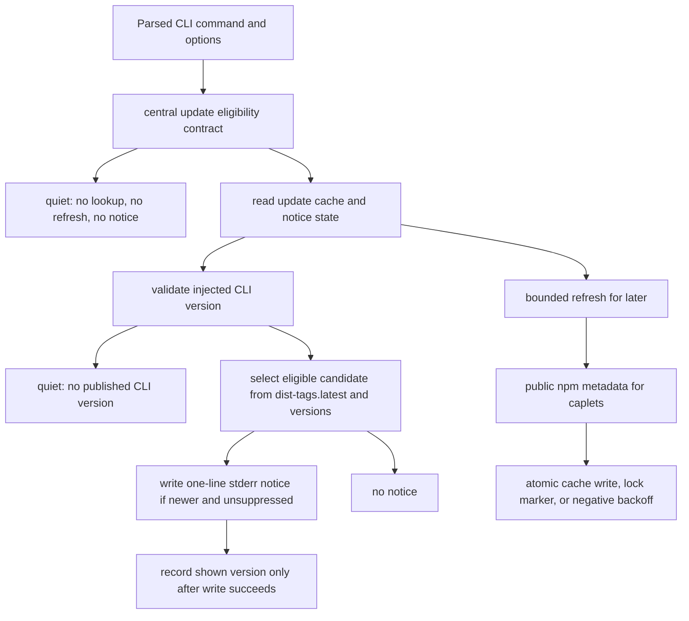
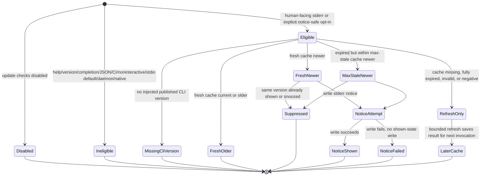

# feat: Add available update detection

## Summary

Add passive update detection for the published `caplets` CLI. Eligible human-facing commands read cached package metadata, compare the injected CLI version with the newest eligible published version, and print a short stderr-only notice without changing stdout, stdio protocol traffic, JSON output, completion output, help, or version behavior.

---

## Problem Frame

Caplets is moving quickly enough that outdated CLI installs can miss fixes for attach, diagnostics, and release-readiness work. The CLI also runs as a protocol process for agents, as a foreground human tool, and inside automation, so a useful update notice must be cache-first, best-effort, and stricter than "stderr is always safe."

The implementation should extend existing CLI notice and cache patterns while keeping update checks separate from telemetry, Caplet config, project config, credentials, backend definitions, user payloads, and project-controlled release metadata.

---

## Requirements

Plan requirement IDs use the `P-R*` prefix so they do not collide with the origin document's `R1`-`R27` IDs.

**Version detection and release channel**

- P-R1. Update detection compares the running published CLI package version with the newest eligible published `caplets` version from the default public npm package metadata source. Origin refs: R1, R2.
- P-R2. The running version comes from `runCli`'s injected CLI package version. If no published CLI version is available, passive update detection performs no lookup and prints no notice. Origin refs: R1; dependency assumption.
- P-R3. Stable builds compare only against stable published versions and must not prompt users to install prereleases. Origin refs: R2, R3, AE3.
- P-R4. Prerelease builds compare only against newer versions with the same base version and first prerelease identifier, for example `0.24.0-beta.1` to `0.24.0-beta.2`; stable releases, other identifiers, other base versions, and non-`latest` dist-tags are ignored in v1. Origin refs: R2, R3.

**Cache and refresh lifecycle**

- P-R5. Update detection uses local cache and suppression state so ordinary invocations do not perform a registry request every time. Origin refs: R4, R5, R9, R10.
- P-R6. Fresh positive cache and expired-but-within-max-stale positive cache may produce a current-invocation notice. Missing, fully expired, invalid, negative, or failed cache refreshes must not produce a same-invocation notice. Origin refs: R17, R20, F5, AE9.
- P-R7. Registry refreshes are bounded, save results for later invocations, and must not materially delay the primary command. Origin refs: R18, R19, R20, F5, AE9.
- P-R8. Registry, network, timeout, semver, invalid JSON, cache read, and cache write failures degrade to "no update notice" and do not affect the command result. Origin refs: R16, AE10.

**Notice behavior and eligibility**

- P-R9. Update notices write only to stderr and never to stdout. Origin refs: R6, R12, AE1, AE4, AE5.
- P-R10. Passive notices emit only when stderr is classified by the central eligibility contract as a human-facing notice channel or a supported host/user opt-in marks stderr notice-safe. Origin refs: R6, R11, R13, F1, F2, F4.
- P-R11. Help, version, shell completion, hidden completion, parse-error, JSON, and `--format json` output paths suppress passive update notices before any notice write or refresh scheduling. Origin refs: R13, R14, R15, F3, AE6, AE7, AE8.
- P-R12. CI and non-interactive script contexts suppress passive update notices and update refreshes by default unless an explicit update-notice opt-in marks stderr as human-facing and no output-product suppression applies. Origin refs: R13, F4, AE14.
- P-R13. Stdio `serve` and `attach` suppress passive notices by default, even when stderr is a TTY; they become eligible only through a validated human-visible host path or explicit opt-in. Origin refs: R11, R12, F2, AE4, AE5.
- P-R14. Foreground HTTP `serve` may be eligible when stderr is human-facing, but daemon-managed service processes and native integrations are not passive notice channels and must not evaluate update cache or registry paths in v1. Origin refs: R6, R11, R13.
- P-R15. Repeated notices for the same available version are suppressed durably for a documented time window, and suppression is recorded only after the stderr write succeeds. Origin refs: R9, R10, AE11.
- P-R16. The notice text is one short line that names the running version, available version, and channel-neutral upgrade guidance without including raw registry text. Origin refs: R7, R8, AE1.

**Controls and privacy**

- P-R17. `CAPLETS_DISABLE_UPDATE_CHECK=1` prevents both outbound package metadata lookup and passive notices. Origin refs: R22, R23, AE12.
- P-R18. Update controls and state are independent from telemetry controls and state; `CAPLETS_DISABLE_TELEMETRY=1` does not disable update detection when it is otherwise eligible. Origin refs: R26, R27, AE13.
- P-R19. Update detection does not load user Caplet config, project config, secrets, backend definitions, credentials, Caplet IDs, paths, prompts, tool arguments, tool outputs, hostnames, npm config, custom registries, or user identifiers. Origin refs: R21, R24, R25, AE13.
- P-R20. The only outbound request in the first version is the minimum public npm package metadata lookup needed for the public `caplets` package. Origin refs: R24, R25.
- P-R21. The first version does not add auto-update behavior or an explicit update-inspection command. Origin refs: key decisions, scope boundaries.

---

## Key Technical Decisions

- **KTD1. Build a separate update-check subsystem in core.** The logic belongs in `@caplets/core` because core owns command dispatch, IO injection, cache path helpers, and the command surfaces that must suppress notices. It must not reuse telemetry config/state because the disable controls, privacy promises, and CI policy differ.
- **KTD2. Compare against the injected CLI version.** The published `caplets` wrapper passes `packages/cli/package.json` into `runCli`; core's own package version is not authoritative for user-facing update notices. If no published CLI version is available, suppress passive update detection and refreshes rather than falling back to core's package version.
- **KTD3. Use public npm package metadata directly.** The first version queries the public npm metadata endpoint for `caplets`, requests abbreviated metadata, and reads `dist-tags.latest` plus a validated `versions` list. Do not honor npm config or project/user registry settings in v1; that preserves the privacy boundary and avoids credentials/custom-registry scope at the cost of quiet no-op behavior in offline or corporate registry environments.
- **KTD4. Add `semver` as a direct core dependency.** Prerelease ordering and same-channel comparison are user-facing enough that a proven semver parser is safer than a local comparator.
- **KTD5. Make the notice cache-first and refresh-for-later.** Notice decisions use local state first. Missing or stale cache can trigger an awaited, bounded refresh-for-later with a strict timeout, but a result discovered by that refresh is saved for the next invocation and never surfaced after the current command's notice window has passed.
- **KTD6. Centralize eligibility as a command-surface contract.** Update notices cannot reuse the telemetry notice placement or the simple "stderr is TTY" rule. A central eligibility helper must classify command family, parsed options, output mode, stdio/daemon/native context, CI, TTY state, and explicit opt-in before any lookup, refresh, notice write, or suppression write.
- **KTD7. Treat stdio as opt-in for notices.** Default stdio `serve` and `attach` remain quiet. Host validation or the explicit `CAPLETS_UPDATE_NOTICE_STDERR=1` opt-in can mark stderr notice-safe, but output-product suppression and hidden-runtime suppression always win.
- **KTD8. Keep user controls env-first and non-transitive for v1.** `CAPLETS_DISABLE_UPDATE_CHECK=1` disables lookup and notices. `CAPLETS_UPDATE_NOTICE_STDERR=1` is a narrow opt-in for the current foreground invocation; daemon service environments and native integrations must not inherit it into passive notice eligibility.
- **KTD9. Keep native integrations outside v1 passive notices.** `@caplets/opencode`, `@caplets/pi`, and native service entrypoints are not CLI notice channels. They should not import or invoke update notice logic unless a future native-visible notice channel is designed.

---

## High-Level Technical Design

The update subsystem has five boundaries:

- Eligibility decides whether the current command context may perform lookup, refresh, or passive notice work at all.
- Cache and state decide whether a known available version should be shown now or suppressed.
- Version selection compares the injected published CLI version against cached public package metadata at runtime, not against a cached one-size-fits-all candidate.
- Registry refresh updates metadata for later invocations with timeout, negative backoff, and stampede guardrails.
- CLI integration ensures stdout contracts stay unchanged for protocol and machine-readable paths.

---

## System-Wide Impact

- **CLI behavior:** Human-facing commands may emit a short stderr notice, but only after command options are known and only when stdout contracts are unaffected.
- **Runtime behavior:** MCP stdio, daemon-managed services, native integrations, and hidden automation surfaces remain quiet by default. Ineligible contexts perform no update lookup or refresh.
- **Local storage:** Caplets gains update-check cache/state paths under Caplets-owned cache/state directories. These records contain public package metadata, fetch timestamps, lock/backoff markers, and notice suppression state, not project data.
- **Network behavior:** Eligible update refreshes contact the public npm package metadata endpoint for `caplets` only. Disablement prevents this request, and invalid user/project config must not affect update detection.
- **Daemon behavior:** Daemon descriptors and service process environment construction must force update notices off or hidden, even when the installing shell has `CAPLETS_UPDATE_NOTICE_STDERR=1`.
- **Native integrations:** Native service code and package adapters remain outside passive update notices in v1; no update-check cache or registry path should be evaluated through native startup.
- **Setup output:** Generated MCP host configs stay quiet by default. Host-specific stdio validation is a separate compatibility gate and is not implied by setup output.
- **Release process:** This user-facing CLI behavior needs a changeset for the published packages affected by the implementation.

---

## Origin Trace

| Origin ID | Actors | Plan refs                 | Unit and test coverage                                                                                                                              |
| --------- | ------ | ------------------------- | --------------------------------------------------------------------------------------------------------------------------------------------------- |
| F1        | A1, A4 | P-R9, P-R10, P-R15, P-R16 | U3 eligible interactive command test writes one-line stderr notice with running and available versions, channel-neutral guidance, unchanged stdout. |
| F2        | A2, A4 | P-R9, P-R10, P-R13        | U4 separate stdio opt-in tests for `serve` and `attach`; v1 covers F2 through explicit opt-in while host-specific validation is deferred.           |
| F3        | A3     | P-R9, P-R11               | U3 command-surface matrix verifies structured stdout, completion, help, and version paths receive no notice text or refresh.                        |
| F4        | A3     | P-R10, P-R12              | U4 CI and non-TTY script tests verify no notice, no refresh, and no state mutation without explicit opt-in.                                         |
| F5        | A1, A3 | P-R5, P-R6, P-R7, P-R8    | U2 and U3 two-invocation stale/missing cache tests verify bounded refresh-for-later and later eligible notice.                                      |
| AE1       | A1, A4 | P-R1, P-R9, P-R10, P-R16  | U3 eligible interactive notice test asserts stderr-only text names both versions and guidance.                                                      |
| AE2       | A1     | P-R1, P-R3                | U1 same-version comparison test returns no update.                                                                                                  |
| AE3       | A1     | P-R3, P-R4                | U1 stable/prerelease release-channel tests suppress prerelease prompts for stable users.                                                            |
| AE4       | A2     | P-R9, P-R13               | U4 `serve` stdio opt-in test keeps stdout protocol-only and writes notice only to stderr.                                                           |
| AE5       | A2     | P-R9, P-R13               | U4 `attach` stdio opt-in test keeps stdout protocol-only and writes notice only to stderr.                                                          |
| AE6       | A3     | P-R9, P-R11               | U3 structured-output matrix verifies JSON and `--format json` stdout remains parseable with no passive notice.                                      |
| AE7       | A3     | P-R11                     | U3 completion and hidden completion tests verify completion output contains only completion data.                                                   |
| AE8       | A1, A3 | P-R11                     | U3 help/version/no-args tests verify documented output has no notice and no refresh.                                                                |
| AE9       | A1, A3 | P-R6, P-R7                | U2/U3 stale-cache lifecycle test verifies bounded refresh, no unbounded wait, no post-start interruption, later notice.                             |
| AE10      | A1     | P-R8                      | U2 registry failure tests prove command result is unchanged and no registry failure appears.                                                        |
| AE11      | A1     | P-R5, P-R15               | U1/U4 suppression tests verify same-version repeat suppression and new-version re-eligibility.                                                      |
| AE12      | A1, A3 | P-R17                     | U4 disable-control test verifies no outbound lookup and no notice.                                                                                  |
| AE13      | A1, A4 | P-R18, P-R19, P-R20       | U1/U2/U4 privacy and telemetry-independence tests verify no config/user payload and telemetry disablement does not control update checks.           |
| AE14      | A3     | P-R12                     | U4 CI and non-interactive no-opt-in tests suppress passive notices entirely.                                                                        |

---

## Implementation Units

### U1. Add update-check state, paths, and version comparison

- **Goal:** Establish the local cache/state model and release-channel comparison before wiring any CLI command.
- **Requirements:** P-R1, P-R2, P-R3, P-R4, P-R5, P-R8, P-R15, P-R18, P-R19
- **Origin refs:** R1-R5, R9, R10, R16, R21, R26, R27, AE2, AE3, AE11, AE13
- **Dependencies:** None
- **Files:** `packages/core/package.json`, `pnpm-lock.yaml`, `packages/core/src/config.ts`, `packages/core/src/config/paths.ts`, `packages/core/src/update-check/index.ts`, `packages/core/src/update-check/state.ts`, `packages/core/src/update-check/cache.ts`, `packages/core/src/update-check/version.ts`, `packages/core/test/config-paths.test.ts`, `packages/core/test/update-check-state.test.ts`, `packages/core/test/update-check-version.test.ts`
- **Approach:** Add direct `semver` dependency support in core. Export cache and durable state path helpers through the config barrel. Store positive cache records around public package metadata: package name, source, fetched/expiry/max-stale timestamps, `dist-tags.latest`, and a validated version list. Do not store a single precomputed candidate because candidate selection depends on the running version and prerelease family. Store negative cache/backoff for refresh failures and notice suppression separately with last-shown version and repeat window. Stable builds select stable candidates only; prerelease builds select only newer candidates with the same base version and first prerelease identifier.
- **Patterns to follow:** `packages/core/src/config/paths.ts` and `packages/core/src/config.ts` for platform path exports; `packages/core/src/cli/completion-cache.ts` for cache freshness and atomic writes; `packages/core/src/telemetry/state.ts` for private JSON state writes and best-effort reads.
- **Test scenarios:**
  - Covers stable release behavior. Given running `0.22.0` and latest stable `0.23.0`, comparison returns an available update.
  - Covers no-op behavior. Given running `0.23.0` and latest stable `0.23.0`, comparison returns no update.
  - Covers no CLI version. Given no injected published CLI version, update detection returns no notice and no refresh eligibility rather than comparing against `@caplets/core`.
  - Covers prerelease suppression. Given running stable `0.23.0` and available `0.24.0-beta.1`, comparison returns no update.
  - Covers prerelease family. Given running `0.24.0-beta.1` and available `0.24.0-beta.2`, comparison returns an update; given `0.24.0-alpha.9`, `0.25.0-beta.1`, or `0.24.0` stable, it returns no update in v1.
  - Given corrupt cache JSON, missing cache, invalid semver, missing `dist-tags.latest`, missing version list, or cache write failure, state helpers return a no-notice result without throwing.
  - Given a notice was recorded for `0.23.0` inside the repeat window, the same version is suppressed; a later version is not suppressed.
  - Given `CAPLETS_DISABLE_TELEMETRY=1`, update-check state and comparison behavior are unchanged.
- **Verification:** Focused state, path, and version tests pass; semver dependency is direct in core; config barrel exports are present; cache/state files contain no Caplet config or project-specific fields.

### U2. Add public npm metadata refresh

- **Goal:** Fetch and cache the minimum public package metadata needed to answer "is a newer eligible `caplets` CLI available?"
- **Requirements:** P-R1, P-R5, P-R6, P-R7, P-R8, P-R17, P-R19, P-R20
- **Origin refs:** R1, R4, R5, R16-R25, F5, AE9, AE10, AE12, AE13
- **Dependencies:** U1
- **Files:** `packages/core/src/update-check/registry.ts`, `packages/core/src/update-check/refresh.ts`, `packages/core/src/update-check/cache.ts`, `packages/core/src/update-check/lock.ts`, `packages/core/test/update-check-registry.test.ts`, `packages/core/test/update-check-refresh.test.ts`
- **Approach:** Implement an injectable fetcher that requests `https://registry.npmjs.org/caplets` with the npm abbreviated metadata accept header. Parse only the package name, `dist-tags`, and `versions` keys needed for release-channel comparison. Bound requests with timeout/abort behavior and record short negative cache/backoff on 404, 429, 5xx, invalid JSON, missing fields, timeout, abort, and network failure. Add an explicit refresh lock or marker because completion discovery has stale/negative cache precedent but no stampede guard. The lock should prevent nearby eligible invocations from repeatedly hitting the registry while one refresh is in progress.
- **Patterns to follow:** `packages/core/src/cli/completion-discovery.ts` for bounded live lookup with stale fallback and negative cache shape; fetch timeout patterns in `packages/core/src/http-actions.ts`, `packages/core/src/graphql.ts`, and `packages/core/src/remote/selection.ts`.
- **Test scenarios:**
  - Covers default metadata source. Given refresh runs, the fetch URL is the public `caplets` package metadata endpoint and no Caplet, project, credential, env, host, npm config, custom registry, or user payload is sent.
  - Given abbreviated metadata with `dist-tags.latest` and versions, refresh caches validated metadata, not a single precomputed candidate.
  - Given prerelease versions in `versions`, refresh preserves enough version list data for same-base and same-prerelease-identifier selection.
  - Given invalid JSON, missing `dist-tags.latest`, empty versions, HTTP failure, timeout, abort, or cache write failure, refresh resolves as best-effort failure and does not throw.
  - Given missing or fully expired cache, the first invocation runs only a bounded refresh-for-later and does not print a same-invocation notice; a later eligible invocation can show the newly cached version.
  - Given expired-but-within-max-stale positive cache with a newer version, comparison may show the cached notice immediately while also attempting bounded refresh-for-later.
  - Given an expired negative cache whose refresh fails again, the negative backoff is extended without changing command behavior.
  - Given two refresh attempts start close together, the refresh lock/marker prevents repeated registry requests where practical.
  - Given user or project config is invalid, update refresh can still complete because it does not call the Caplets config loader.
- **Verification:** Registry tests prove outbound metadata lookup is minimal, failure-tolerant, lock-protected, and independent from user/project configuration.

### U3. Integrate update notices into eligible CLI command paths

- **Goal:** Print update notices only after command options prove the current invocation is notice-safe.
- **Requirements:** P-R2, P-R6, P-R7, P-R8, P-R9, P-R10, P-R11, P-R12, P-R13, P-R14, P-R15, P-R16
- **Origin refs:** R6-R20, F1, F3, F5, AE1, AE6, AE7, AE8, AE9, AE10
- **Dependencies:** U1, U2
- **Files:** `packages/core/src/cli.ts`, `packages/core/src/update-check/eligibility.ts`, `packages/core/src/update-check/notice.ts`, `packages/core/test/update-check-cli.test.ts`, `packages/core/test/update-check-command-surface.test.ts`, `packages/core/test/cli.test.ts`, `packages/core/test/cli-completion.test.ts`, `packages/core/test/attach-cli.test.ts`, `packages/core/test/code-mode-cli.test.ts`
- **Approach:** Add a shared CLI helper that receives raw args, parsed command context, parsed options, `io.version`, `io.fetch`, `io.writeErr`, `io.stderrIsTTY`, and env. Call it from eligible command actions after option parsing, not as a global pre-parse hook. Output-product suppression must run before any notice write, refresh scheduling, or notice-state mutation. The helper should use cached state for current notices, perform only bounded refresh-for-later for stale/missing cache, and swallow all update-check failures. Use the injected CLI version; if a direct core test harness does not provide one, suppress passive update detection unless the test injects an explicit published CLI version.
- **Patterns to follow:** `packages/core/src/cli.ts` telemetry notice wrappers only for best-effort stderr write and failure swallowing; do not copy telemetry's TTY-only eligibility or placement before JSON branches. Use existing CLI tests that inject `writeOut`, `writeErr`, `fetch`, `stderrIsTTY`, `serve`, `attachServe`, and `setExitCode`.
- **Test scenarios:**
  - Covers human-facing notice. Given cached latest `0.23.0`, running version `0.22.0`, and an eligible interactive command, stderr contains one short notice with both versions and channel-neutral guidance, stdout is unchanged, and shown-state is recorded only after `writeErr` succeeds.
  - Covers injected CLI version. Given `runCli` receives version `0.22.0` while core package version is different, comparison uses `0.22.0`; given no injected version, no notice or refresh occurs.
  - Covers help/version/no-args suppression. `caplets --version`, `caplets --help`, command help, and no-args help emit no update notice, perform no update refresh, and do not mark a notice shown.
  - Covers completion suppression. `completion` and hidden completion output contain only completion data and do not perform lookup, refresh, or shown-state writes.
  - Covers structured-output matrix. Commands using JSON or `--format json` modes across daemon, `attach --once`, setup, doctor, list/search/get/call style outputs, auth, vault, config path, remote/cloud, Code Mode, and progressive tool/resource/prompt operations produce parseable stdout with no passive update text and no refresh.
  - Covers parse-error suppression. Invalid command/options preserve existing error behavior and do not add update notice text or update refresh.
  - Covers stdio default suppression. Default `serve` and default `attach` remain quiet even when stderr is a TTY.
  - Covers foreground HTTP serve. `serve --transport http` may print a notice before startup only when stderr is human-facing and the cache already shows a newer version.
  - Covers long-running ordering. `serve` and `attach` primary work starts after at most the bounded refresh-for-later budget; a refresh that resolves later affects only later invocations and never interrupts a running command.
  - Covers notice write failure. If `writeErr` throws, the primary command still succeeds or fails exactly as before, and the available version is not marked shown.
- **Verification:** Focused CLI tests prove update notices never change stdout contracts, command exit semantics, startup ordering, or structured-output parseability.

### U4. Add controls, opt-in, and daemon/native guardrails

- **Goal:** Provide clear update-specific controls without leaking notices into automation, daemon logs, stdio host defaults, or native integration startup.
- **Requirements:** P-R10, P-R12, P-R13, P-R14, P-R15, P-R17, P-R18, P-R19, P-R21
- **Origin refs:** R6, R9-R15, R22, R23, R26, R27, F2, F4, AE4, AE5, AE11-AE14
- **Dependencies:** U1, U3
- **Files:** `packages/core/src/update-check/control.ts`, `packages/core/src/update-check/eligibility.ts`, `packages/core/src/update-check/state.ts`, `packages/core/src/daemon/env.ts`, `packages/core/src/daemon/config.ts`, `packages/core/src/daemon/process.ts`, `packages/core/src/native/service.ts`, `packages/opencode/src/index.ts`, `packages/pi/src/index.ts`, `packages/core/test/update-check-controls.test.ts`, `packages/core/test/serve-daemon.test.ts`, `packages/core/test/telemetry-cli.test.ts`, `packages/core/test/native-service.test.ts`
- **Approach:** Add update-specific environment controls for disablement and explicit stderr notice opt-in. Disablement prevents lookup, cache refresh, notices, and shown-state writes. Opt-in may mark stderr notice-safe for the current foreground stdio host or automation invocation, but it must not override output-product suppression or hidden-runtime suppression. Daemon-managed service processes should be explicitly classified as notice-ineligible or launched with update notices disabled, even when environment inheritance carries opt-in variables into the service. Native integrations remain passive-notice-ineligible in v1 and should not import or invoke update-check notice logic.
- **Patterns to follow:** Telemetry tests for independence between env controls; `packages/core/test/serve-daemon.test.ts` descriptor and inherited-env coverage; daemon service-management guidance that treats logs as file-backed diagnostics rather than human notice channels.
- **Test scenarios:**
  - Given `CAPLETS_DISABLE_UPDATE_CHECK=1`, Caplets performs no metadata fetch, prints no update notice, writes no shown-state, and leaves telemetry behavior unchanged.
  - Given `CAPLETS_DISABLE_TELEMETRY=1`, update checks still run when otherwise eligible and telemetry remains disabled.
  - Given `CI=true` and cached newer metadata, Caplets prints no passive notice, performs no refresh, and writes no shown-state unless the explicit update-notice opt-in is present and no output-product suppression applies.
  - Given a non-TTY script context and cached newer metadata, Caplets prints no passive notice and performs no refresh by default.
  - Given `CAPLETS_UPDATE_NOTICE_STDERR=1` in a validated stdio host harness, `serve` may write the update notice to stderr while stdout remains protocol-only.
  - Given `CAPLETS_UPDATE_NOTICE_STDERR=1` in a validated stdio host harness, `attach` may write the update notice to stderr while stdout remains protocol-only.
  - Given the same opt-in on help/version/completion/JSON paths, the notice and refresh are still suppressed.
  - Given daemon install inherits the current environment on Linux, macOS, or Windows, managed service startup does not print passive update notices into daemon logs and does not evaluate update-check cache or registry paths.
  - Given native service startup through core, opencode, or pi, native-facing code does not import or invoke update notice logic.
  - Given repeated invocations inside the suppression window, the same available version is not repeated.
  - Given a new available version appears after suppression for the prior version, the new version can be shown on the next eligible invocation.
- **Verification:** Control tests prove update detection is independently controllable, opt-in is narrow and non-transitive, and hidden runtime surfaces remain quiet.

### U5. Document behavior and prepare release metadata

- **Goal:** Make the new CLI behavior discoverable and release-ready without expanding v1 into auto-update or explicit update inspection.
- **Requirements:** P-R7, P-R16, P-R17, P-R18, P-R19, P-R20, P-R21
- **Origin refs:** R7, R8, R22-R27, scope boundaries
- **Dependencies:** U1, U2, U3, U4
- **Files:** `docs/product/available-update-detection.md`, `README.md`, `CONCEPTS.md`, `.changeset/available-update-detection.md`
- **Approach:** Reconcile the already-seeded `CONCEPTS.md` glossary entry with the final behavior. Document when update notices appear, when they are suppressed, how to disable checks, how stdio host opt-in works, what metadata is fetched, what data is never sent, and why public npm is used directly in v1. Product docs and README language must not imply an explicit update command, custom metadata source, install-channel detection, or auto-update path. Add a changeset for the published `caplets` CLI and `@caplets/core` if core behavior changes ship through the public package.
- **Patterns to follow:** Product docs under `docs/product/`; existing changeset convention for user-facing package behavior.
- **Test scenarios:** Test expectation: none for docs-only edits, but public docs should be checked for generated-reference drift and the changeset should be present before release.
- **Verification:** Documentation states the same eligibility, privacy, release-channel, and control behavior as the implementation and does not introduce an auto-update or update-inspection command.

---

## Scope Boundaries

- Auto-updating Caplets is out of scope.
- An explicit `caplets update` or `caplets update status` command is out of scope for the first version.
- Project-controlled, user-configured, npm-configured, or custom release metadata sources are out of scope.
- Reading Caplet config, project config, backend definitions, credentials, npm config, custom registries, or secrets for update detection is out of scope.
- Sending telemetry or tying update checks to telemetry state is out of scope.
- Prompting stable users to install prereleases is out of scope.
- Prompting prerelease users to move across base versions, prerelease identifiers, stable releases, or non-`latest` dist-tags is out of scope for v1.
- Showing passive notices in daemon logs, native integrations, default stdio protocol sessions, CI, or non-interactive automation is out of scope unless a narrow foreground opt-in marks stderr notice-safe and no output-product suppression applies.

### Deferred to Follow-Up Work

- A first-class update-inspection command can expose cache status, last refresh, and release metadata later.
- Host-specific stdio validation can move from env opt-in to generated setup profiles after supported hosts prove human-visible stderr behavior.
- A broader release-channel manager can define beta, canary, nightly, stable, and stable-from-prerelease cross-channel behavior later.
- Corporate/offline registry support can be revisited later as an explicit trust and configuration feature.

---

## Risks & Dependencies

- **Wrong package version source:** Core and CLI package versions can differ. Tests must prove update detection uses the injected published CLI version and does no lookup when that version is absent.
- **Output pollution:** Command eligibility is the main risk. The central eligibility contract must suppress output-product paths before lookup, refresh, notice, or shown-state writes.
- **Registry delay or failure:** The feature depends on public npm metadata availability. Cache-first behavior, negative backoff, refresh locks, and bounded refresh-for-later keep failures invisible to the primary command.
- **Short process lifetime:** Detached background refresh can be lost when short commands exit. V1 should use bounded refresh-for-later with a strict timeout and persist only results that complete inside the process lifetime.
- **Stdio ambiguity:** Stdio stderr is protocol-safe but not always human-visible. Default quiet behavior plus explicit opt-in avoids turning host logs into noisy notices.
- **Daemon inheritance:** Environment opt-in can leak into daemon service processes through inherited env. Daemon-managed processes need an explicit guardrail in process environment construction and descriptor tests.
- **Native integration boundary:** Native adapters enter through core native service paths, not the CLI. They must not evaluate update notice logic until a native-visible channel exists.
- **Public npm source:** Hardcoding public npm preserves the privacy promise and avoids project/user registry credentials, but offline or corporate-registry environments may never receive passive update notices in v1.
- **Prerelease semantics:** Same-family prerelease comparison is intentionally narrow: same base version and first prerelease identifier only. Broader channel movement is deferred.
- **Semver dependency:** Adding a direct dependency changes package metadata and lockfile state. The benefit is correct prerelease ordering and less local comparator risk.
- **Telemetry/config independence:** Update detection must not reuse telemetry context or config loading paths that read user/project config; invalid config must not affect update checking.

---

## Documentation / Operational Notes

- The user-facing notice should be one short line naming the running version, available version, and channel-neutral upgrade guidance.
- The notice should not include raw registry text. Version strings should be parsed and rendered from validated semver values.
- Cache TTL, max-stale TTL, negative backoff, refresh lock TTL, refresh timeout, and same-version repeat window should be constants with unit tests. A reasonable starting posture is daily metadata freshness, multi-day max-stale fallback, short negative backoff, short refresh timeout, and a multi-day same-version repeat window.
- The first implementation should avoid release metadata source overrides. If a future override is needed, it should be a user-level trust decision rather than project config.

---

## Sources / Research

- `docs/brainstorms/2026-06-24-available-update-detection-requirements.md` is the origin document.
- `packages/cli/src/index.ts` passes the published CLI package version into core.
- `packages/cli/package.json` names the published user-facing package as `caplets`.
- `packages/core/package.json` has a different version than `packages/cli/package.json`, which makes injected-version tests necessary.
- `packages/core/src/config.ts` exports shared config/path helpers.
- `packages/core/src/config/paths.ts` defines platform-specific config, state, and cache directory conventions.
- `packages/core/src/cli.ts` owns command dispatch, output injection, help/version behavior, telemetry notice precedent, `serve`, `attach`, completion, JSON options, and command-family tracking.
- `packages/core/src/telemetry/notice.ts`, `packages/core/src/telemetry/state.ts`, and `packages/core/test/telemetry-cli.test.ts` provide the closest local pattern for best-effort stderr-only notices and repeat suppression.
- `packages/core/src/cli/completion-cache.ts` and `packages/core/src/cli/completion-discovery.ts` provide local precedent for fresh/stale/negative cache and bounded live lookup, but not refresh stampede locking.
- `packages/core/src/daemon/process.ts` builds managed service command environments; daemon guardrails should be enforced there.
- `packages/core/src/native/service.ts`, `packages/opencode/src/index.ts`, and `packages/pi/src/index.ts` are native integration boundaries that should stay outside passive update notices in v1.
- `docs/solutions/architecture-patterns/native-daemon-service-management.md` establishes daemon stdout/stderr as file-backed logs, not a human notice channel.
- npm registry package metadata docs: https://github.com/npm/registry/blob/main/docs/responses/package-metadata.md
- Node process I/O and TTY docs: https://nodejs.org/api/process.html#a-note-on-process-io
