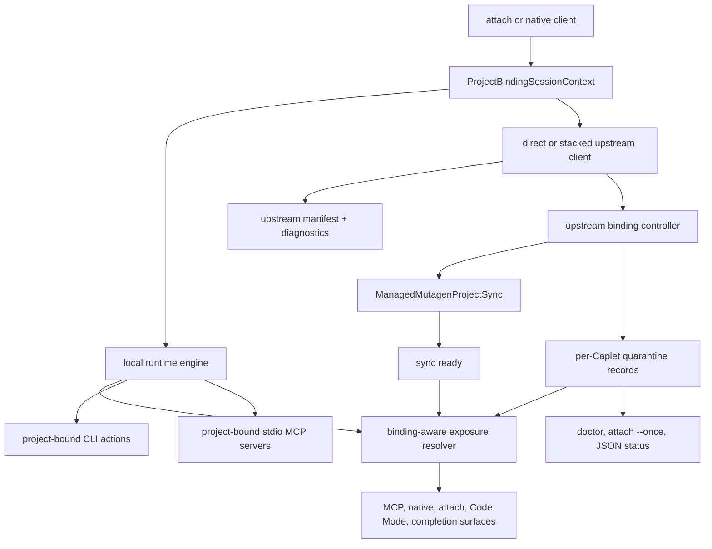
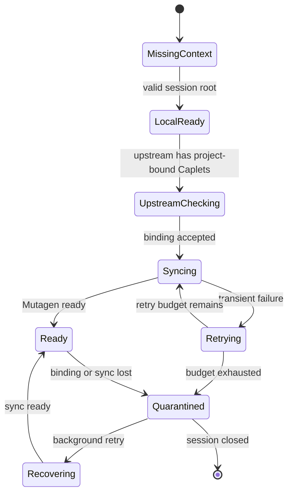
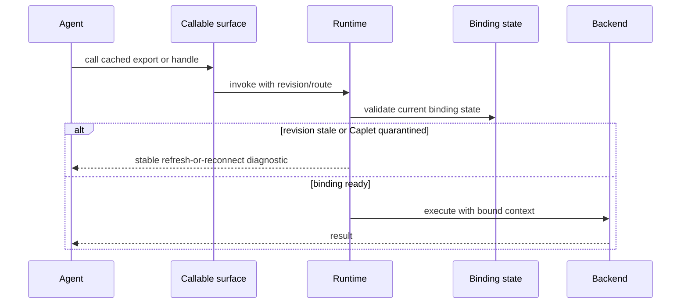

# feat: Make self-hosted Project Binding functional

## Summary

Implement self-hosted Project Binding as a session-scoped runtime contract across local-only serve/daemon, direct self-hosted remote attach, and stacked upstream remotes. Project-bound local CLI and stdio MCP Caplets should run in the bound project root without file sync, while project-bound upstream Caplets should remain hidden until Mutagen-backed sync is ready or be quarantined narrowly when binding cannot recover.

---

## Problem Frame

Self-hosted Project Binding currently behaves like a no-op: project-bound Caplets are filtered out or remote routes report unsupported, so users can reach a runtime that appears healthy while project-bound execution is not available. The fix is not only an HTTP route implementation. Binding state must shape execution context, callable surfaces, stale-call safety, long-lived client invalidation, and diagnostics.

The existing code already has useful pieces: canonical attach session metadata, revisioned attach manifests, Remote Profile-backed remote clients, project workspace storage, sync filtering, and a managed Mutagen sync adapter. This plan connects those pieces into one binding model and replaces unconditional `projectBinding.required` hiding with session-aware readiness and quarantine.

---

## Requirements

**Session Context**

- R1. Attach and native sessions must carry a canonical project root and project config path, and long-running serve or daemon process CWD must not become binding authority.
- R2. Local project-bound Caplets must be callable only when the current session has a valid project context; missing or invalid context withholds those Caplets while preserving safe non-project Caplets.
- R3. Direct self-hosted remote attach must create a real Project Binding session when remote project-bound Caplets require it.
- R4. Stacked runtimes must keep Project Binding state separate per attach or native session, including separate upstream binding and sync state for different roots.

**Project-Bound Execution**

- R5. Project-bound CLI actions must default to the bound project root as `cwd` unless the Caplet or action declares a more specific validated `cwd`.
- R6. Project-bound stdio MCP servers must default to the bound project root as `cwd` unless the Caplet declares a more specific validated `cwd`.
- R7. If a bound CLI action or stdio MCP server cannot honor the required execution context, the Caplet must be withheld or quarantined rather than exposed.

**Upstream Binding And Sync**

- R8. Upstream project-bound Caplets must not be callable until authoritative upstream metadata says binding is required and Mutagen-backed sync for that session is ready.
- R9. Upstream binding and sync must verify upstream identity, Remote Profile trust, credentials, Project Binding capability, and sync policy before exposing a project-bound upstream Caplet.
- R10. Transient upstream binding or sync failures must retry per upstream Binding Session for five attempts or 30 seconds total, whichever comes first, using exponential backoff with full jitter; independent upstreams retry independently and `attach --once` aggregates those outcomes into one bounded readiness result.
- R11. Retry exhaustion must quarantine only affected project-bound upstream Caplets and keep healthy local Caplets, local project-bound Caplets, and non-project upstream Caplets available.
- R12. Long-running sessions must continue background recovery attempts for quarantined upstream project-bound Caplets without failing the whole runtime.

**Callable Surfaces**

- R13. Quarantined or missing-context Caplets must be hidden from progressive MCP tools, direct MCP tools/resources/prompts, Code Mode declarations, native tools, attach manifests, CLI listings, and completion caches.
- R14. Calls through stale attach exports, native route IDs, Code Mode handles, or cached completion results must fail before execution with a stable Project Binding diagnostic and refresh guidance.
- R15. Binding or quarantine changes must publish a new exposure revision and notify long-lived clients that already support surface-change events.

**Diagnostics And Readiness**

- R16. Human-readable and JSON diagnostics must report binding state, sync state, canonical project identity, target host, bound root, sync policy summary, retry state, Mutagen status, readiness state, quarantine state, and per-Caplet quarantine records with redacted recovery guidance.
- R17. `caplets attach --once` must distinguish fully ready, degraded-ready, and failed states for direct self-hosted and stacked runtimes.
- R18. A release must not claim self-hosted Project Binding support until local-only context, direct self-hosted binding, stacked upstream binding and sync, quarantine hiding, stale-call failure, and diagnostics all work for supported surfaces.
- R19. Project Binding lifecycle routes must authenticate and authorize callers against the owning attach/native session or Remote Profile identity, reject cross-session binding IDs, reject root-broadening attempts, and perform those checks before workspace allocation or refresh.

### Origin Traceability

Plan requirement IDs are local to this implementation plan. The source brainstorm requirement IDs map as follows:

| Plan requirement | Source requirement IDs       |
| ---------------- | ---------------------------- |
| R1               | R1, R2, R4, R21, R22         |
| R2               | R3, R6, R9, R24              |
| R3               | R5, R10                      |
| R4               | R4, R10, R14, R15            |
| R5               | R7                           |
| R6               | R8                           |
| R7               | R9                           |
| R8               | R11, R26, R31                |
| R9               | R25, R27, R28, R29           |
| R10              | R12, R32                     |
| R11              | R13, R14, R15, R16           |
| R12              | R32, R34                     |
| R13              | R16                          |
| R14              | R17, R34                     |
| R15              | R34                          |
| R16              | R18, R20, R28, R29, R33      |
| R17              | R19                          |
| R18              | R30                          |
| R19              | R21, R22, R23, R24, R25, R29 |

---

## Key Technical Decisions

- **KTD1. Project Binding state is session-owned.** The project root enters through attach or native session metadata. Serve and daemon process CWD can be used only by the local client when creating a session, never by the long-running runtime as implicit authority.
- **KTD2. Reuse the exposure snapshot as the source of truth.** The plan extends `ExposureSnapshot` and hidden-caplet diagnostics instead of duplicating project-binding filters across MCP, native, attach, Code Mode, telemetry, and CLI completion surfaces.
- **KTD3. Local binding is execution context, not sync.** Local project-bound CLI and stdio MCP Caplets run with the bound root as default process context. Mutagen is not started for local-only binding because no remote files need propagation.
- **KTD4. Upstream binding uses the existing Mutagen path.** Direct self-hosted and stacked upstream sync use `ManagedMutagenProjectSync`, `ProjectBindingWorkspaceStore`, sync filtering, and sync size safety rather than adding a second sync engine.
- **KTD5. Upstream metadata must be authoritative before exposure.** The local runtime should learn upstream `projectBinding.required` from the upstream attach manifest and diagnostics, not infer binding requirements from names, routes, or local config guesses.
- **KTD6. Quarantine is a callable-surface rule with status visibility.** Quarantined Caplets are absent from agent-callable surfaces but remain visible in diagnostics, manifest diagnostics, and doctor output.
- **KTD7. Keep `manifest_changed` compatible.** Existing attach events should keep the current event type and revision semantics; Project Binding can add optional details, but old clients should still refresh on the canonical manifest-change signal.
- **KTD8. Human CLI calls do not gain implicit binding from CWD.** Project Binding remains explicit attach/native session context. Human commands that operate outside an attach/native session should use existing config behavior unless a later requirements document adds explicit CLI binding.
- **KTD9. Mutagen readiness requires enforceable sync policy.** A sync manifest is not enough by itself. The controller must translate include/exclude and size policy into enforceable Mutagen session configuration before starting sync, and must quarantine rather than expose if the policy cannot be applied.

---

## High-Level Technical Design

The session context feeds two paths. Local execution managers receive a bound root for project-bound process backends. Upstream clients receive the same canonical context only after Remote Profile trust and upstream capability checks, then start a Project Binding session and Mutagen sync before exposing upstream project-bound Caplets.

---

## Implementation Units

### U1. Define shared Project Binding state and quarantine records

- **Goal:** Add the central runtime model that represents session context, binding readiness, sync readiness, retry state, and per-Caplet quarantine.
- **Requirements:** R1, R2, R8, R10, R11, R12, R13, R16
- **Dependencies:** None
- **Files:** `packages/core/src/project-binding/types.ts`, `packages/core/src/project-binding/errors.ts`, `packages/core/src/project-binding/mutagen.ts`, `packages/core/src/exposure/discovery.ts`, `packages/core/src/errors.ts`, `packages/core/src/redaction.ts`, `packages/core/test/project-binding-routes.test.ts`, `packages/core/test/project-binding-mutagen.test.ts`, `packages/core/test/exposure-discovery.test.ts`
- **Approach:** Introduce a session-scoped binding context type with canonical `projectRoot`, `projectConfigPath`, fingerprint, binding state, sync state, retry snapshot, managed sync status, and quarantine records. Extend `HiddenCapletReason` beyond `project_binding_required` to distinguish missing context, binding unsupported, auth/trust failure, metadata unknown, sync failed, retry exhausted, and quarantined. Keep diagnostic details redacted and structured enough for attach manifests, native diagnostics, `doctor`, and JSON status to share.
- **Execution note:** Start with tests around hidden reasons, diagnostic serialization, redaction, Mutagen state projection, and retry snapshot formatting before changing exposure behavior.
- **Patterns to follow:** `ProjectBindingState` and `ProjectBindingSyncState` in `packages/core/src/project-binding/types.ts`; `mutagenProjectSyncDoctorData` in `packages/core/src/project-binding/mutagen.ts`; safe error summaries in `packages/core/src/errors.ts`.
- **Test scenarios:** Missing project context yields a hidden project-bound Caplet with a stable diagnostic; Mutagen blocked states map to quarantine-ready diagnostics; retry snapshots serialize without timers or random state; diagnostic details redact tokens, env values, and arbitrary file contents.
- **Verification:** Project Binding state has one reusable representation before local execution, upstream sync, and callable-surface work begins.

### U2. Thread session context into local project-bound execution

- **Goal:** Make local-only serve, daemon-backed serve, and native sessions execute project-bound CLI and stdio MCP Caplets against the bound project root.
- **Requirements:** R1, R2, R5, R6, R7, R13
- **Dependencies:** U1
- **Files:** `packages/core/src/engine.ts`, `packages/core/src/cli-tools.ts`, `packages/core/src/downstream.ts`, `packages/core/src/serve/session.ts`, `packages/core/src/native/service.ts`, `packages/core/src/native/options.ts`, `packages/core/src/cli/code-mode.ts`, `packages/core/test/serve-session.test.ts`, `packages/core/test/native.test.ts`, `packages/core/test/cli-tools.test.ts`, `packages/core/test/downstream.test.ts`, `packages/core/test/code-mode-cli.test.ts`
- **Approach:** Add an execution-context resolver that overlays the bound root only for Caplets with `projectBinding.required`. CLI actions and stdio MCP transports should use the bound root when no more specific validated `cwd` is configured. Explicit `cwd` values resolve relative to the canonical bound root, and absolute `cwd` values must realpath under the canonical bound root; symlink escapes, `..` escapes, missing paths, or roots outside the session boundary hide or quarantine the Caplet. Project-bound stdio MCP transports are session-scoped by binding fingerprint and must not be reused across different project roots or binding sessions. Project-bound Caplets with no valid session context remain hidden and guarded at call time.
- **Execution note:** Characterize current `projectBinding.required` filtering in `serve/session.ts`, `native/service.ts`, `cli/code-mode.ts`, and `exposure/discovery.ts` before replacing it with binding-aware gating.
- **Patterns to follow:** Existing CLI `cwd` resolution in `packages/core/src/cli-tools.ts`; stdio MCP `cwd` pass-through in `packages/core/src/downstream.ts`; canonical attach session metadata in `packages/core/src/serve/http.ts`.
- **Test scenarios:** A daemon-backed local session started outside `/repo` runs a project-bound CLI action with `/repo` as `cwd`; a project-bound stdio MCP server starts with the bound root; explicit action/server `cwd` still wins when valid; relative `cwd`, absolute `cwd`, and symlink paths cannot escape the bound root; two sessions from different roots do not share process context or stdio processes; session end closes project-bound stdio transports owned by that binding; missing or invalid roots hide project-bound process Caplets.
- **Verification:** Local project-bound CLI and stdio MCP support works without starting Mutagen and without relying on serve or daemon startup CWD.

### U3. Implement self-hosted Project Binding server routes

- **Goal:** Replace self-hosted Project Binding 501 responses with real server-side Binding Session lifecycle and workspace status.
- **Requirements:** R3, R4, R8, R9, R16, R17, R19
- **Dependencies:** U1
- **Files:** `packages/core/src/serve/http.ts`, `packages/core/src/project-binding/session.ts`, `packages/core/src/project-binding/workspaces.ts`, `packages/core/src/project-binding/routes.ts`, `packages/core/src/project-binding/mutagen.ts`, `packages/core/test/serve-http.test.ts`, `packages/core/test/project-binding-session.test.ts`, `packages/core/test/project-binding-workspaces.test.ts`, `packages/core/test/project-binding-integration.test.ts`
- **Approach:** Add a Project Binding session manager behind `/v1/attach/project-bindings/sessions`, `/status`, `/heartbeat`, `/session`, and `/connect`. Each lifecycle route must authenticate and authorize the caller against the owning attach/native session or Remote Profile identity before workspace allocation, refresh, status read, heartbeat, connect, or delete. The server should reject cross-session binding IDs, unauthorized workspace claims, and root-broadening attempts before touching workspace state. It should allocate or refresh a workspace with `ProjectBindingWorkspaceStore`, return the binding/session identity and server sync target needed by the local side, persist leases, accept heartbeats, and close/expire sessions. The local binding controller owns the Mutagen session lifecycle; the server owns workspace lease and status lifecycle. It should expose status even for degraded or quarantined sessions.
- **Execution note:** Implement the actual `/v1/attach/project-bindings/connect` WebSocket upgrade path for binding events while keeping the existing plain GET 426 probe behavior compatible for `attach --once`.
- **Patterns to follow:** Existing attach session management in `packages/core/src/serve/http.ts`; workspace lease model in `packages/core/src/project-binding/workspaces.ts`; Project Binding client events in `packages/core/src/project-binding/session.ts`.
- **Test scenarios:** Session creation returns binding and server workspace information; heartbeat updates lease and state; status reports ready/degraded/blocked with sync state; WebSocket connect streams binding status changes; missed heartbeat and server lease expiry transition status to expired or quarantined and publish a new exposure revision even if local Mutagen is still running; delete marks the server lease ended while the local controller stops Mutagen; cross-session binding IDs, unauthorized workspace claims, public-origin root claims, and root-broadening attempts are rejected before workspace allocation or refresh; workspace cleanup keeps active leases and removes expired ones.
- **Verification:** Direct self-hosted attach clients no longer see Project Binding as unsupported when the runtime supports the route set.

### U4. Add upstream binding and Mutagen sync orchestration

- **Goal:** Make direct self-hosted remote and stacked upstream project-bound Caplets wait for upstream binding and Mutagen sync before exposure.
- **Requirements:** R3, R4, R8, R9, R10, R11, R12, R16
- **Dependencies:** U1, U3, and the exact stacked runtime composition primitives from `docs/plans/2026-06-23-002-feat-stacked-remote-runtime-plan.md`: session-aware serve/upstream composition, attach/native session metadata propagation into stacked runtime, per-session upstream attach/native client factories, and manifest/surface-change propagation from upstream to local exposure snapshots. If those primitives have not landed, implement or track them as a prerequisite before U4; do not absorb unrelated stacked-runtime work into this feature.
- **Files:** `packages/core/src/project-binding/attach.ts`, `packages/core/src/project-binding/session.ts`, `packages/core/src/project-binding/mutagen.ts`, `packages/core/src/project-binding/sync-filter.ts`, `packages/core/src/project-binding/sync-size.ts`, `packages/core/src/native/service.ts`, `packages/core/src/native/remote.ts`, `packages/core/src/remote/selection.ts`, `packages/core/test/attach-cli.test.ts`, `packages/core/test/native-remote.test.ts`, `packages/core/test/project-binding-session.test.ts`, `packages/core/test/project-binding-integration.test.ts`, `packages/core/test/cloud-auth-refresh-attach.test.ts`
- **Approach:** Build an upstream binding controller that discovers upstream project-bound Caplets from authoritative attach manifest diagnostics, verifies trust and credentials at request time, creates an upstream Binding Session, starts `ManagedMutagenProjectSync` with the canonical local root and server workspace target, refreshes sync status until ready, and reports quarantine records when binding or sync cannot become healthy. Define a versioned upstream metadata contract for hidden project-bound Caplets that includes upstream Caplet identity, `projectBinding.required`, Project Binding capability/version, readiness state, quarantine state, and redacted recovery diagnostics. Old or incomplete upstream metadata must fail closed with diagnostics rather than infer that binding is unnecessary. Before `ManagedMutagenProjectSync.start`, compute an enforceable sync policy from `sync-filter` and `sync-size`, translate it into Mutagen session configuration, and block exposure or quarantine if filters, credential exclusions, or size limits cannot be enforced. The foreground retry budget is per upstream Binding Session; independent upstreams may retry concurrently, while `attach --once` aggregates per-upstream readiness into one bounded overall readiness result. The same controller should serve direct self-hosted attach and stacked upstream composition.
- **Execution note:** Preserve request-time Remote Profile resolution for session creation, heartbeat, manifest refresh, event reconnect, retry, and background recovery. Do not capture stale `requestInit` or credentials in timers.
- **Patterns to follow:** `runProjectBindingSession` remote resolver behavior; stale credential refresh learning in `docs/solutions/integration-issues/stale-remote-profile-credentials-refresh.md`; existing `RemoteProjectBindingSessionManager` in `packages/core/src/native/service.ts`.
- **Test scenarios:** Trusted direct self-hosted remote exposes a project-bound Caplet only after Mutagen reports ready and sync policy is enforceable; old upstream metadata, missing capability/version fields, or incomplete hidden diagnostics fail closed with redacted diagnostics; `.gitignore`, `.capletsignore`, env/credential exclusions, and size-limit failures prevent exposure when they cannot be enforced by the Mutagen session; stacked upstream with project-bound and non-project Caplets exposes the non-project Caplet while binding retries; transient failures retry within the foreground budget then quarantine only affected upstream project-bound Caplets; independent upstreams retry concurrently and `attach --once` reports per-upstream degraded readiness; background recovery unquarantines after sync becomes ready; auth or trust failure fails closed with redacted recovery guidance.
- **Verification:** Upstream Project Binding is functional for direct and stacked self-hosted remotes, not just local-only sessions.

### U5. Make exposure snapshots binding-aware and guard calls

- **Goal:** Remove blanket project-bound filtering and make all callable surfaces reflect current binding readiness and quarantine state.
- **Requirements:** R2, R7, R13, R14, R15
- **Dependencies:** U1, U2, U4
- **Files:** `packages/core/src/exposure/discovery.ts`, `packages/core/src/serve/session.ts`, `packages/core/src/native/service.ts`, `packages/core/src/native/remote.ts`, `packages/core/src/attach/api.ts`, `packages/core/src/code-mode/runner.ts`, `packages/core/src/code-mode/sessions.ts`, `packages/core/src/cli/code-mode.ts`, `packages/core/src/cli/completion.ts`, `packages/core/src/cli/completion-discovery.ts`, `packages/core/src/telemetry/runtime.ts`, `packages/core/test/exposure-discovery.test.ts`, `packages/core/test/serve-session.test.ts`, `packages/core/test/attach-api.test.ts`, `packages/core/test/native-remote.test.ts`, `packages/core/test/code-mode-api.test.ts`, `packages/core/test/cli-completion.test.ts`
- **Approach:** Add binding evaluation to exposure discovery so callable, hidden, and diagnostics are produced from one model. Call-time guards should re-check the current binding state before invoking project-bound Caplets through progressive tools, direct tools/resources/prompts, attach invoke, native execute, and Code Mode. A quarantined or stale project-bound route should return a stable Project Binding error before touching the backend.
- **Execution note:** Keep existing attach `ATTACH_MANIFEST_STALE` semantics. When a refresh no longer contains the old export because of quarantine, return a Project Binding-specific not-callable diagnostic rather than silently remapping to another export.
- **Patterns to follow:** `buildAttachProjection` revision and hidden diagnostic projection; `invokeAttachExport` and `invokeNativeAttachExport` stale checks; `createSdkRemoteCapletsClient` stable export compatibility refresh.
- **Test scenarios:** Quarantine removes a Caplet from progressive MCP, direct MCP, Code Mode declarations, native tools, attach manifests, CLI listings, and completions; a stale attach export for a quarantined Caplet fails before execution; a stale Code Mode generated handle fails before user code executes; native `onToolsChanged` fires when quarantine changes the surface; telemetry does not count hidden project-bound Caplets as callable.
- **Verification:** Agent-visible surfaces are consistent and cannot call project-bound Caplets without a valid current binding.

### U6. Surface readiness, retry, and diagnostics

- **Goal:** Make users and operators able to distinguish ready, degraded-ready, failed, unsupported, auth-failed, missing-context, and sync-failed states.
- **Requirements:** R10, R11, R12, R16, R17, R18
- **Dependencies:** U1, U3, U4, U5
- **Files:** `packages/core/src/cli.ts`, `packages/core/src/cli/doctor.ts`, `packages/core/src/project-binding/attach.ts`, `packages/core/src/serve/http.ts`, `packages/core/src/attach/api.ts`, `packages/core/src/native/service.ts`, `packages/core/test/attach-cli.test.ts`, `packages/core/test/doctor-cli.test.ts`, `packages/core/test/serve-http.test.ts`, `packages/core/test/native-remote.test.ts`
- **Approach:** Extend `attach --once` to create or probe the binding state and report fully ready, degraded-ready, or failed. Add JSON diagnostics for session state, sync state, project identity, target host, bound root, include/exclude policy summary, retry state, Mutagen status, readiness state, quarantine state, and quarantine records. Ensure human output names the affected Caplets and recovery commands without leaking credentials, env values, full file contents, or unnecessary path details.
- **Execution note:** Inject clocks, sleeps, and random jitter in retry tests so the foreground retry budget is deterministic and non-flaky.
- **Patterns to follow:** Existing `projectBinding` and `sync` sections in `packages/core/src/cli/doctor.ts`; attach CLI error mapping in `packages/core/src/cli.ts`; `projectBindingRecovery` in `packages/core/src/project-binding/errors.ts`.
- **Test scenarios:** `attach --once` exits ready when all required binding is healthy; reports degraded-ready when only affected project-bound upstream Caplets are quarantined and a safe surface remains; fails when no safe surface remains or trust/auth/capability checks are impossible; `doctor --json` includes target host, bound root, include/exclude policy summary, redacted Mutagen state, readiness state, and quarantine state; human doctor output distinguishes unsupported binding from auth failure, policy failure, and sync failure.
- **Verification:** Binding no longer fails silently or reports ready when required project-bound Caplets are unavailable.

### U7. Update docs, generated schema, and release gates

- **Goal:** Document the self-hosted Project Binding contract and ensure generated artifacts stay current.
- **Requirements:** R18
- **Dependencies:** U1 through U6
- **Files:** `docs/project-binding.md`, `docs/native-integrations.md`, `docs/remote-attach.md`, `CONCEPTS.md`, `packages/core/src/code-mode/runtime-api.d.ts`, `packages/core/src/code-mode/platform-entry.ts`
- **Approach:** Update user-facing docs to explain session-scoped binding, local-only execution context, Mutagen-backed upstream sync, quarantine, retry, stale-call behavior, and diagnostics. Do not change config schema unless an earlier implementation unit explicitly changes config shape or descriptions; otherwise keep config verification as a release gate only. Regenerate Code Mode API only if callable diagnostics or generated declaration contracts change.
- **Execution note:** Keep the docs clear that self-hosted upstream file sync uses Mutagen and local-only binding does not sync files.
- **Patterns to follow:** Existing Project Binding glossary entries in `CONCEPTS.md`; generated-file instructions in `AGENTS.md`; Code Mode default exposure ADR in `docs/adr/0001-code-mode-default-exposure.md`.
- **Test scenarios:** Docs mention all supported surfaces; schema and Code Mode API checks pass when touched; generated docs do not imply broad human CLI implicit binding; release notes or product docs do not claim support before U1 through U6 pass.
- **Verification:** `pnpm schema:check`, `pnpm code-mode:check-api`, and `pnpm docs:check` remain green when applicable.

---

## System-Wide Impact

- **Agent/tool parity:** Binding-aware exposure must be shared by MCP, native, attach, Code Mode, and completion surfaces so agents do not see different callable sets depending on integration.
- **Auth boundary:** Binding requests cross the same trust boundary as self-hosted Remote Attach. Remote Profile credentials and trust checks stay in Caplets mediation and must be resolved at request time for long-lived clients and background retry loops.
- **Execution boundary:** Project roots affect process `cwd` for project-bound CLI and stdio MCP backends. The bound root must be applied only to project-bound Caplets and only for the current session.
- **State lifecycle:** Project Binding sessions, workspace leases, Mutagen sync sessions, exposure revisions, and quarantine records now form one lifecycle. Closing a session must close or age out associated sync and session state without affecting other sessions.
- **Code Mode:** Declaration sets and reused Code Mode sessions must invalidate when quarantine changes the callable set, so stale generated handles cannot execute after binding state changes.

---

## Risks & Dependencies

- **Stacked runtime dependency:** This plan depends on the session-aware serve/upstream composition, session metadata propagation, per-session upstream client factories, and manifest-change propagation from `docs/plans/2026-06-23-002-feat-stacked-remote-runtime-plan.md`. If those have not landed, treat them as a prerequisite or land only those primitives first.
- **Metadata ambiguity:** Current attach manifests can hide project-bound Caplets without enough metadata for an upstream controller to know what binding would unlock. U4 must extend manifest diagnostics or metadata before using upstream callable absence as an inference.
- **Sync policy enforcement:** The current sync manifest helpers are not sufficient unless their output is translated into Mutagen configuration before sync starts. U4 must prove filters, exclusions, and size limits are actually enforced before exposing upstream project-bound Caplets.
- **Unsafe early exposure:** Removing the blanket `projectBinding.required` filters before U2 and U5 are complete would expose process Caplets with the wrong `cwd`. Keep the old hiding behavior until binding-aware execution and guards are ready.
- **Credential staleness:** Background binding retry and event reconnects can accidentally reuse stale request options. U4 must resolve Remote Profile-backed options immediately before each remote request.
- **Retry flakiness:** Foreground retry and jitter can make tests slow or nondeterministic. Use injectable clocks, sleep, and random sources for retry tests.
- **Path and secret leakage:** Mutagen command status and diagnostics can include local paths, remote targets, or auth failures. Use redaction for diagnostics shown to agents and keep detailed process status in doctor-level output only where safe.
- **Surface drift:** Exposure filtering currently exists in several places. U5 should centralize binding-aware decisions early to avoid one surface exposing a Caplet that another surface hides.

---

## Acceptance Examples

- AE1. Given an agent attaches to a daemon-backed local runtime from `/repo`, when it calls a project-bound CLI Caplet with no explicit `cwd`, then the action runs with `/repo` as process context.
- AE2. Given an agent attaches to local-only serve from `/repo`, when a project-bound stdio MCP Caplet starts, then the server starts with `/repo` as process context or the Caplet is withheld.
- AE3. Given two native sessions from different project roots, when both list tools, then project-bound local Caplets use each session's root and do not leak roots or `cwd` between sessions.
- AE4. Given a trusted direct self-hosted remote exposes a project-bound Caplet, when the session root is valid and Mutagen sync becomes ready, then that Caplet appears in the attach manifest and native tool list.
- AE5. Given a stacked upstream has one project-bound Caplet and one non-project Caplet, when upstream sync fails through the foreground retry budget, then only the project-bound upstream Caplet is quarantined.
- AE6. Given local project-bound Caplets have healthy local context while upstream binding is quarantined, when the agent lists tools, then local project-bound Caplets remain callable.
- AE7. Given an agent holds a stale attach export for a Caplet that has since been quarantined, when it invokes the export, then execution fails before backend dispatch with a Project Binding diagnostic.
- AE8. Given upstream metadata for a Caplet is missing or stale, when generating the callable surface, then the Caplet is withheld until authoritative metadata refresh succeeds.
- AE9. Given `attach --once` targets a runtime with quarantined upstream project-bound Caplets and safe non-project Caplets, when retries are exhausted, then the command reports degraded-ready rather than fully ready.
- AE10. Given an unauthenticated request attempts to create a binding session or broaden a local root upstream, when the runtime evaluates it, then the request is rejected and no project files are exposed.
- AE11. Given quarantine changes a long-lived client's callable set, when the client supports surface-change events, then it receives a manifest-change notification and stale calls fail with refresh guidance.
- AE12. Given `doctor --json` is run for a degraded Project Binding session, then it includes target host, bound root, include/exclude policy summary, session state, sync state, retry state, Mutagen state, readiness state, quarantine state, and per-Caplet quarantine records without tokens, env secrets, or file contents.
- AE13. Given a project-bound stdio MCP server has been started for one binding session, when another session with a different binding fingerprint uses the same Caplet, then the runtime starts or resolves a separate transport rather than reusing the first session's process.
- AE14. Given a project-bound Caplet declares an explicit `cwd` outside the bound root through an absolute path, `..`, or symlink escape, when exposure is computed, then the Caplet is withheld or quarantined with a Project Binding diagnostic.
- AE15. Given upstream metadata says a project-bound Caplet requires binding and Mutagen reports ready but include/exclude policy could not be enforced, when exposure is computed, then the Caplet remains quarantined and the runtime reports a sync policy diagnostic.

---

## Scope Boundaries

- **In scope:** Session project-root intake and validation, local project-bound CLI and stdio MCP execution, direct self-hosted Project Binding, stacked upstream binding, Mutagen-backed sync, retry, quarantine, stale-call failure, surface invalidation, and diagnostics.
- **Deferred to follow-up work:** Web admin UI, richer operator dashboards, alternate sync engines, multi-user policy administration, and new human CLI implicit-binding commands.
- **Out of scope:** Redesigning Remote Login, Remote Profile storage, daemon install/update lifecycle, namespace shadowing policy, or Code Mode's default exposure strategy.

---

## Documentation And Operational Notes

- Update docs to state that Project Binding is session-scoped context, not a daemon process mode.
- Document that local-only binding does not start Mutagen and direct/stacked upstream file sync uses Mutagen.
- Document the degraded-ready contract for `attach --once` and how quarantined Caplets are hidden from callable surfaces but visible in diagnostics.
- Include recovery guidance for missing Mutagen, unsupported upstream binding, auth/trust failure, sync conflict, and missing project root.
- Add release-note language only after U1 through U6 pass together; partial internal milestones should not claim self-hosted Project Binding support.

---

## Sources And Research

- `docs/brainstorms/2026-06-25-self-hosted-project-binding-requirements.md` defines the product contract, retry policy, quarantine behavior, and Mutagen requirement.
- `docs/plans/2026-06-23-002-feat-stacked-remote-runtime-plan.md` defines the adjacent stacked runtime foundation and session-aware attach direction.
- `CONCEPTS.md` defines Project Binding as session-scoped project context and Project Binding Quarantine as hidden from callable surfaces but visible in diagnostics.
- `docs/adr/0001-code-mode-default-exposure.md` keeps Code Mode as the default agent exposure model that this plan must preserve.
- `docs/solutions/integration-issues/stale-remote-profile-credentials-refresh.md` requires long-lived remote clients to resolve Remote Profile credentials at request time.
- `docs/solutions/developer-experience/self-hosted-pending-remote-login-and-attach-positional-url.md` keeps self-hosted attach mediation local and avoids secret-bearing agent config.
- `docs/solutions/architecture-patterns/native-daemon-service-management.md` separates daemon install-time service config from runtime session state.
- `docs/solutions/integration-issues/vault-cli-runtime-integration-fixes.md` requires consistent runtime and validation policy for secret/auth boundaries and diagnostics.
- `packages/core/src/serve/http.ts` currently canonicalizes attach session project metadata but returns unsupported Project Binding route responses.
- `packages/core/src/exposure/discovery.ts`, `packages/core/src/serve/session.ts`, `packages/core/src/native/service.ts`, and `packages/core/src/cli/code-mode.ts` currently hide `projectBinding.required` Caplets unconditionally.
- `packages/core/src/project-binding/mutagen.ts`, `packages/core/src/project-binding/workspaces.ts`, `packages/core/src/project-binding/sync-filter.ts`, and `packages/core/src/project-binding/sync-size.ts` provide the existing sync and workspace primitives this plan should reuse.
- `packages/core/src/attach/api.ts` and `packages/core/src/native/remote.ts` provide the existing revisioned manifest, stale-invoke, manifest-refresh, and event mechanics that this plan extends.
