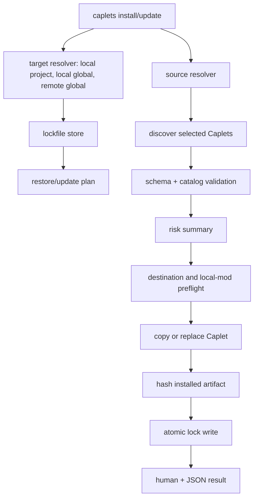
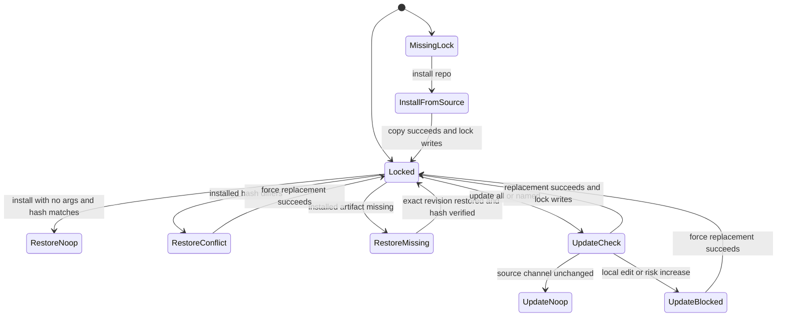
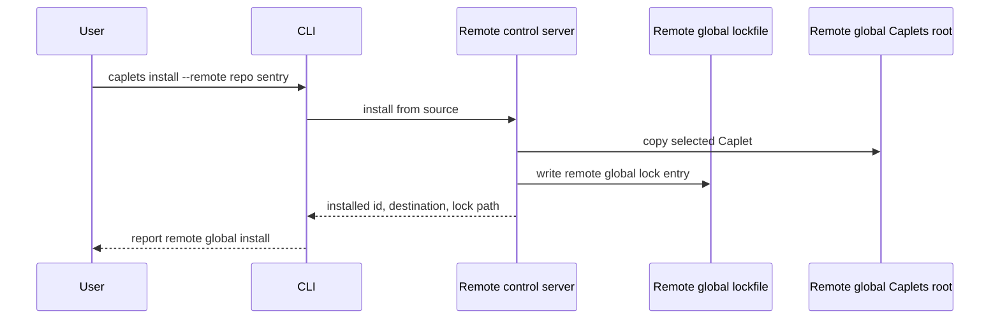

# feat: Build prebuilt Caplets catalog and lockfile update

## Summary

Build the next public catalog milestone by expanding install-ready Caplets, adding structured catalog-readiness metadata, and wrapping the existing safe install copier with lockfile-aware install, restore, and update workflows. The implementation keeps Caplets Code Mode-first, uses existing Project Binding runtime behavior for project-file consumers, and treats remote catalog install/update as operating on the remote machine's global Caplets state for this milestone.

---

## Problem Frame

The current prebuilt catalog proves the Caplet file format, but it still reads like a seed set rather than a real agent power-user stack. The user's personal configuration already demonstrates useful integrations across browser automation, desktop control, observability, Google workspace APIs, repository tooling, and hosted MCP providers. This milestone turns that working stack into public, install-ready Caplets without copying user-specific secrets, paths, provider identifiers, or local assumptions.

The install lifecycle is also too shallow for a public catalog. `caplets install` currently resolves a local path or Git source, validates selected Caplet files, preflights destination safety, and copies files. It does not record the source revision, future update channel, installed content hash, portability, or risk metadata needed for repeatable restore and safe update. The plan preserves the existing destination-safety work and adds a lockfile lifecycle around it.

The adjacent product constraint is important: Caplets should remain a Code Mode-first capability layer for coding agents, not a generic marketplace. Catalog entries should teach the agent which compact workflow to use first, and high-risk local-control entries should be explicit about setup and scope without adding extra install-time confirmation beyond the user's decision to install.

---

## Requirements

Plan requirement IDs use `P-R*` so they do not collide with the origin brainstorm's `R1`-`R44` IDs.

**Catalog Expansion And Authoring**

- P-R1. Add install-ready public catalog entries for Browser Use, Computer Use, PostHog, Sentry, Gmail, Google Drive, Google Tasks, and Stealth Browser Use. Origin refs: R1, R2.
- P-R2. Each install-ready catalog entry includes public-safe description, tags, auth or setup guidance, safety notes, primary Code Mode workflow, compact capability surface, verification status, and reproducible validation path. Origin refs: R3, R5, R6, R7, R8, R9, R40, R41, R42, R43.
- P-R3. Existing catalog entries are revised only when they fail the new catalog quality bar or the personal config reveals a materially better public default. Origin refs: R4, Implementation Discovery.
- P-R4. Project-file consumer catalog entries declare Project Binding and explain why the bound project root is required. Origin refs: R10, R11, R12, R13, R14.
- P-R5. Add a `writing-caplets` skill that teaches agents how to author, review, and validate catalog-grade Caplets without duplicating the existing Caplets usage skill. Origin refs: R33-R39, F5, AE7.

**Install, Restore, And Update**

- P-R6. Successful `caplets install` writes or updates a selected-scope lock entry for every installed Caplet. Origin refs: R15, R16, R17, R18, AE1, AE2.
- P-R7. Project lockfiles live at `./.caplets.lock.json`; global lockfiles live under the target machine's Caplets state directory; remote catalog installs and updates use the remote machine's global Caplets state. Origin refs: R16, R17, R22, R27, AE2.
- P-R8. Lock entries record Caplet ID, source repository, credential-free source identity, source path, destination path, installed kind, tracked source ref or channel, resolved git revision when available, content hash over the installed artifact, install/update timestamps, portability, and parsed risk summary. Origin refs: R18, R19, R20, R32, AE1, AE9.
- P-R9. `caplets install` with no source arguments restores the selected scope from its lockfile, is idempotent for matching installed content, restores exact recorded revisions when available, verifies recorded content hashes, and fails closed for conflicts or non-portable sources. Origin refs: R21, R22, R23, R24, R31, AE3, AE9.
- P-R10. `caplets update` reads the selected scope's lockfile, updates all or named Caplets from their recorded tracked source channels, and rewrites lock entries only after a successful replacement. Origin refs: R25, R26, R27, AE4.
- P-R11. Restore and update do not silently overwrite local modifications; update also blocks risk-increasing changes unless the user uses an explicit force path. Origin refs: R28, R29, AE5.
- P-R12. Lockfile operations are atomic enough to avoid unreadable partial writes and avoid losing a previously working installed Caplet during failed replacement. Origin refs: R30, R31, AE9.
- P-R13. Install, restore, and update support `--json` result output with stable per-entry statuses and machine-readable errors for missing lockfiles, missing tracked entries, deleted sources, unavailable revisions, content hash mismatches, unavailable local sources, non-portable local-source entries, local modification conflicts, risk blocks, and partial-state failures. Origin refs: R31, AE9.
- P-R14. Project lockfiles are share-safe by default and never persist credential-bearing URLs, user-specific local paths, tokens, browser profile paths, or provider secrets. Origin refs: R9, R32, AE9.

**Documentation And Verification**

- P-R15. Public docs show lockfile-aware install, no-argument restore, and update workflows once the commands exist. Origin refs: R44.
- P-R16. The implementation includes focused automated coverage for lockfile paths, lockfile integrity, install restore, update safety, remote-global routing, catalog schema, Project Binding metadata, and catalog guardrails. Origin refs: Success Criteria.
- P-R17. Live provider smoke testing is documented as user-owned and is not required for agent-side implementation completion. Origin refs: Key Decisions, Scope Boundaries.

---

## Key Technical Decisions

- **KTD1. Add a lockfile lifecycle service around the existing install copier.** `packages/core/src/cli/install.ts` already has useful source discovery, validation, destination preflight, symlink protection, duplicate detection, and copy logic. The plan should keep that behavior and add provenance, restore, update, hashing, and lock writes in a separate lifecycle layer rather than burying state management in command parsing.
- **KTD2. Use installed-artifact hashes, not source-tree hashes.** The lockfile should hash the materialized file or directory exactly as Caplets installed it, with sorted relative paths, file type, executable mode where meaningful, and file bytes after directory Caplet symlink materialization. This avoids the integrity gap raised in `vercel-labs/skills` issue 806, where a source-folder hash could not be recomputed from the installed copy.
- **KTD3. Store parsed risk summaries in lock entries.** Update risk checks should compare structured facts from parsed Caplet metadata: backend family, auth type and scopes, Project Binding requirement, runtime features, catalog safety classification, mutating/destructive hints, and instruction/body/reference manifest changes. Markdown body text can carry context, but update safety cannot depend on prose parsing.
- **KTD4. Add structured catalog metadata.** Verification status, validation path, primary Code Mode workflow, compact capability surface, and safety/risk classification become schema-backed Caplet metadata. This supports catalog quality checks and future update-risk detection better than prose conventions alone, and the primary workflow metadata must reach the agent-facing inspection/discovery surface rather than living only in schema validation.
- **KTD5. Keep remote project installs out of this milestone.** Internally separate host selection from install scope so the remote control server can choose the remote global root and remote global lockfile explicitly. Externally, `--remote` remains the remote catalog install/update form for this milestone and targets the remote machine's global Caplets state; remote project install semantics stay deferred.
- **KTD6. Use `caplets update`, not `caplets upgrade`.** The command should be added to the top-level command registry, completion logic, remote-control command set, docs, and tests with no `upgrade` alias in this milestone.
- **KTD7. Use `--force` as the non-interactive risk override.** High-risk local-control installation does not require extra confirmation because installation is user acceptance. Update risk increases and local modification overwrites still require an explicit force path; interactive prompting is not necessary for the first version.
- **KTD8. Project Binding catalog work is metadata cleanup, not runtime redesign.** The runtime already hides project-bound Caplets without valid Project Binding context. This milestone updates `lsp`, `ast-grep`, and repository-local CLI catalog entries to declare Project Binding and explain the bound-root dependency, then relies on existing exposure behavior.
- **KTD9. Treat local-source installs as provenance with portability limits.** Local paths may be useful for development, but lockfiles must mark them non-portable unless a stable Git revision and credential-free remote identity can be resolved. Restore and update fail closed when a local source cannot be proven available and unchanged.
- **KTD10. Keep provider smoke tests out of agent verification.** Implementation should verify public endpoints and schema validity before writing entries, but live account, OAuth, browser, and desktop smoke tests are user-owned after implementation.
- **KTD11. Treat lockfiles as untrusted input without adding a prompt gate.** Running install or update is user acceptance of the Caplet source risk, but restore/update still must validate destination containment, source identity syntax, content hashes, and risk summaries before writing. Human and JSON output should show source repo, ref, resolved revision, hash, and lock path for new or restored entries.
- **KTD12. Stage replacement before removing working artifacts.** Restore and update should stage new artifacts, validate and hash them, then swap into place with rollback or backup restore for directory replacements. A failed replacement should not delete a previously working installed Caplet while leaving the old lock entry behind.

---

## High-Level Technical Design

The command path has three separable concerns. The target resolver decides where the operation executes and which lockfile/destination root is authoritative. The source resolver decides which source revision and Caplet path are being installed or updated. The lifecycle service performs destination preflight, local modification checks, content hashing, and atomic lock writes.

---

## Implementation Units

### U1. Add lockfile path helpers, schema, and atomic store

- **Goal:** Establish a reusable Caplets lockfile model before changing install behavior.
- **Requirements:** P-R6, P-R7, P-R8, P-R12, P-R14
- **Origin refs:** R15-R18, R30-R32, AE1, AE2, AE9
- **Dependencies:** None
- **Files:** `packages/core/src/config/paths.ts`, `packages/core/src/config.ts`, `packages/core/src/cli/lockfile.ts`, `packages/core/src/errors.ts`, `packages/core/test/config-paths.test.ts`, `packages/core/test/caplets-lockfile.test.ts`
- **Approach:** Add path helpers for the global lockfile under the Caplets state directory and the project lockfile at the current project's `./.caplets.lock.json`. The project helper should explicitly test default `.caplets/config.json` behavior and custom `CAPLETS_PROJECT_CONFIG` behavior so it never accidentally writes `.caplets/caplets.lock.json`. Define lockfile versioning, entry parsing, unknown-version failure, credential-free source identity, project-relative destination display where possible, local-source portability status, destination containment validation, and atomic JSON writes using the repo's existing private-dir/temp-file/rename pattern. Treat recorded destinations as display/provenance where possible; restore/update must resolve the final destination from the selected Caplets root and Caplet ID.
- **Test scenarios:** Linux default global path is `~/.local/state/caplets/caplets.lock.json`; Windows and macOS use platform-equivalent state locations; XDG and `LOCALAPPDATA` overrides are honored; project lock path is `./.caplets.lock.json`; malformed JSON, missing `version`, unsupported version, duplicate IDs, credential-bearing URLs, absolute project destinations in shareable fields, `..` traversal, symlinked parents, symlinked targets, and cross-root realpaths fail with machine-readable errors; interrupted temp writes never leave an unreadable final lockfile.
- **Verification:** Lockfile state can be read, validated, written atomically, and addressed by project/global/remote-global callers without invoking install.

### U2. Refactor source resolution and content hashing for provenance

- **Goal:** Make install sources produce exact provenance and installed-artifact hashes for lock entries.
- **Requirements:** P-R6, P-R8, P-R9, P-R12, P-R14
- **Origin refs:** R18-R20, R23, R24, R31, R32, AE1, AE3, AE9
- **Dependencies:** U1
- **Files:** `packages/core/src/cli/install.ts`, `packages/core/src/cli/lockfile.ts`, `packages/core/src/caplet-source/parse.ts`, `packages/core/src/setup/hash.ts`, `packages/core/src/stable-json.ts`, `packages/core/test/cli.test.ts`, `packages/core/test/caplets-lockfile.test.ts`, `packages/core/test/caplet-source.test.ts`
- **Approach:** Replace the current source string convention of `repo#caplets/id` with separate source fields for repository identity, source path, tracked ref or channel, and resolved revision. Git installs should record the exact commit used and the future update channel; restore should fetch and checkout that exact revision when available and fail with an unavailable-revision error when the commit cannot be retrieved. Local installs should record whether the source is a Git worktree with a stable remote/revision, a dirty worktree, a detached commit, a local path inside the project, or a local path outside the project. Hash installed content after copy or restore, not the raw source tree.
- **Test scenarios:** Owner/repo shorthand records normalized GitHub URL without credentials; Git URL with branch or ref records the tracked source channel separately from the Caplet source path; restore uses the exact recorded commit; deleted or unavailable revisions return machine-readable errors; directory Caplet hashes are stable across filesystem ordering; symlink-materialized directory Caplets hash the installed files plus relevant type/mode metadata; extra, deleted, edited, or executable-mode-changed installed files produce hash mismatches; non-Git local directories are marked non-portable and fail closed on restore/update from a different machine.
- **Verification:** Every install plan can produce a lock entry with stable source provenance and a hash that can be recomputed from the installed artifact.

### U3. Make `caplets install` write locks and restore from locks

- **Goal:** Add lockfile writes to source installs and implement no-argument restore.
- **Requirements:** P-R6, P-R7, P-R8, P-R9, P-R11, P-R12, P-R13, P-R14
- **Origin refs:** R15-R24, R28, R30-R32, F1, F3, AE1, AE2, AE3, AE5, AE9
- **Dependencies:** U1, U2
- **Files:** `packages/core/src/cli.ts`, `packages/core/src/cli/commands.ts`, `packages/core/src/cli/install.ts`, `packages/core/src/cli/lockfile.ts`, `packages/core/src/errors.ts`, `packages/core/test/cli.test.ts`, `packages/core/test/cli-completion.test.ts`
- **Approach:** Change the install command to accept an optional source argument and add `--json` output. When a source is present, preserve existing selected-Caplet install behavior and write lock entries after successful copy/hash. When no source is present, read the selected scope's lockfile and restore missing tracked Caplets from recorded metadata. Matching installed artifacts are no-ops; differing installed artifacts are local modification conflicts unless `--force` is used. Lockfile restore treats the shared lockfile as untrusted input, validates source identity and destination containment, and reports source repo/ref/revision/hash before or as part of installing new entries. Replacement should stage the new artifact, hash it, then swap or restore a backup so failed copy/hash/lock writes do not remove a previously working Caplet.
- **Test scenarios:** `caplets install repo sentry` in a project copies `sentry` and writes `./.caplets.lock.json`; `caplets install --global repo sentry` writes the global state lock; `caplets install --json` returns a stable success envelope with installed/restored/no-op entries; `caplets install` with no args restores missing entries from the selected lockfile; restore leaves matching entries untouched; restore refuses local edits; restore from a non-portable local-source entry fails with a machine-readable error; `--force` replaces a locally modified installed artifact and updates the lock entry; malformed lockfile destinations cannot escape the selected Caplets root; replacement failure rolls back to the prior artifact; missing lockfile and missing tracked Caplet errors are stable in JSON output; install argument completion continues to work without treating no-arg restore as an error.
- **Verification:** Install from source and install from lock both preserve existing destination safety and produce deterministic lock state.

### U4. Add `caplets update`

- **Goal:** Refresh tracked Caplets from lockfile provenance and recorded source channels.
- **Requirements:** P-R8, P-R10, P-R11, P-R12, P-R13, P-R14
- **Origin refs:** R25-R32, F2, AE4, AE5, AE9
- **Dependencies:** U1, U2, U3, U6 for risk-increase enforcement. Command plumbing can start after U3, but update safety cannot ship until the U6 risk-summary contract exists.
- **Files:** `packages/core/src/cli.ts`, `packages/core/src/cli/commands.ts`, `packages/core/src/cli/install.ts`, `packages/core/src/cli/lockfile.ts`, `packages/core/src/caplet-files.ts`, `packages/core/test/cli.test.ts`, `packages/core/test/cli-completion.test.ts`
- **Approach:** Add top-level `caplets update [caplets...]` with project/global scope flags, `--json`, and `--force`. The update lifecycle reads the selected lockfile, filters to named entries when provided, resolves each tracked source channel, compares the available source revision and installed artifact hash, blocks local modification conflicts, computes a new parsed risk summary, and replaces only entries that are safe or forced. Missing, partial, schema-version-incompatible, or otherwise incomparable old/new risk summaries are treated as risk-increasing and require `--force`. Body and bundled-reference changes are always surfaced in human/JSON output; for local-control and mutating SaaS Caplets, instruction/body/reference changes require `--force` even when backend metadata is unchanged. Replacement uses the same stage/hash/swap-or-rollback strategy as restore.
- **Test scenarios:** Updating with no names considers all tracked entries; updating with one name considers only that entry; missing tracked names produce machine-readable errors; unchanged source channels are reported as no-op; newer source revisions replace installed files and update timestamps/hash/revision; `caplets update --json` returns per-entry statuses for unchanged, updated, blocked, failed, and partial-state entries; local edits block replacement; backend family changes, broader auth scopes, new Project Binding, new runtime features, changed safety classification, missing/incomparable risk summaries, mutating/destructive hint changes, and risky instruction/body/reference changes block replacement without `--force`; `--force` applies the update and records the new risk summary; partial update failures restore the previous artifact and do not corrupt unrelated lock entries.
- **Verification:** Users can refresh catalog Caplets without remembering original install commands, and risk-increasing updates cannot apply silently.

### U5. Route install and update through remote control as remote global operations

- **Goal:** Make remote catalog install, restore, and update use the remote machine's global Caplets root and global lockfile.
- **Requirements:** P-R7, P-R9, P-R10, P-R12, P-R13
- **Origin refs:** R17, R21, R22, R25, R27, R31, AE2, AE3, AE4
- **Dependencies:** U1, U3, U4
- **Files:** `packages/core/src/remote-control/types.ts`, `packages/core/src/remote-control/dispatch.ts`, `packages/core/src/remote-control/client.ts`, `packages/core/src/serve/http.ts`, `packages/core/src/cli.ts`, `packages/core/test/cli-remote.test.ts`, `packages/core/test/remote-control-dispatch.test.ts`, `packages/core/test/remote-control-client.test.ts`, `packages/core/test/serve-http.test.ts`
- **Approach:** Extend remote-control command types with install-from-source, install-from-lock, and update requests. The dispatch context and HTTP server control-context construction should expose the server's global Caplets root and global lockfile path rather than reusing `projectCapletsRoot` for catalog installs. The local CLI keeps remote/local overlay behavior for ordinary command execution, but explicit `--remote` install/update mutations are sent through the existing protected remote-control endpoint and operate on remote global state. Keep `--project --remote` out of this milestone; if `--global --remote` is accepted, treat it as an explicit spelling of the same remote-global target rather than a new project-scope feature.
- **Test scenarios:** `CAPLETS_MODE=remote caplets install repo sentry` without `--remote` still installs to the local project by default; `--project` and `--global` still target local project/global in remote mode; `--remote` sends an install request to the remote server; remote dispatch writes the remote global lock and remote global destination; remote no-arg install restores from the remote global lock; remote update reads and writes remote global lock entries; `serveHttp`, `serveHttpWithSessionFactory`, and control-context tests populate remote-global paths; unauthenticated, expired, revoked, or unauthorized remote clients cannot mutate remote global catalog state; remote errors propagate with stable codes and redacted messages; invalid remote project-scope combinations fail clearly.
- **Verification:** Remote catalog lifecycle state lives on the remote machine and does not mutate the caller's local project lockfile.

### U6. Add structured catalog-readiness metadata to Caplet files

- **Goal:** Make install-ready status, verification, Code Mode workflow, and risk metadata machine-readable.
- **Requirements:** P-R2, P-R3, P-R8, P-R11, P-R16
- **Origin refs:** R3-R8, R29, R40-R43, AE5, AE8
- **Dependencies:** U1. This unit should land before U4's risk-increase enforcement, though U4 command plumbing can start earlier.
- **Files:** `packages/core/src/config.ts`, `packages/core/src/config-runtime.ts`, `packages/core/src/caplet-files-bundle.ts`, `packages/core/src/capability-description.ts`, `packages/core/src/cli/inspection.ts`, `packages/core/src/code-mode/api.ts`, `packages/core/src/code-mode/runtime-api.d.ts`, `packages/core/src/code-mode/platform-entry.ts`, `schemas/caplet.schema.json`, `apps/landing/public/caplet.schema.json`, `apps/docs/src/content/docs/reference/caplet-files.mdx`, `packages/core/test/config.test.ts`, `packages/core/test/config-validation.test.ts`, `packages/core/test/caplet-files.test.ts`, `packages/core/test/code-mode-api.test.ts`, `apps/landing/test/schema-assets.test.ts`
- **Approach:** Add a small `catalog` metadata object shared by Caplet backend families. It should distinguish `install_ready`, `draft`, and `recipe`; include verification status and validation method; name the primary Code Mode workflow and compact surface; classify safety risk as standard, mutating SaaS, or local control; and expose mutating/destructive capability hints or deterministic backend-specific derivation inputs. Backend-specific derivation should be explicit for HTTP method families, OpenAPI/Google Discovery operations, GraphQL operations, CLI annotations, and dynamic MCP tools. Keep credential values and machine paths out of metadata. Do not reuse `setup.verify` as validation status because setup requirements can hide Caplets as setup-required, while catalog validation may be a read-only provider call or no-op workflow description. Thread the primary Code Mode workflow and compact surface through agent-facing inspection/card output so agents can discover it without reading full prose.
- **Test scenarios:** Caplet frontmatter accepts valid catalog metadata and rejects unknown or inconsistent values; install-ready entries require verification status, validation path, primary Code Mode workflow, compact surface, safety classification, and mutating/destructive summary or derivation data; draft/recipe entries can be explicitly unverified but do not count as install-ready; generated JSON schema and docs include the new metadata; runtime config parsing preserves catalog metadata for risk summaries without exposing secret-like values; Code Mode `inspect()` or the equivalent card/inspection path exposes primary workflow and compact surface; schema assets in docs and landing stay in sync.
- **Verification:** Catalog quality can be enforced by parsed metadata rather than Markdown conventions.

### U7. Expand the public catalog and fix Project Binding declarations

- **Goal:** Add the requested personal-stack integrations and bring existing project-file consumers up to the quality bar.
- **Requirements:** P-R1, P-R2, P-R3, P-R4, P-R14, P-R16, P-R17
- **Origin refs:** R1-R14, R40-R43, F4, F6, AE6, AE8
- **Dependencies:** U6 should land before final catalog entries; Project Binding edits can be prepared earlier
- **Files:** `caplets/browser-use/CAPLET.md`, `caplets/computer-use/CAPLET.md`, `caplets/posthog/CAPLET.md`, `caplets/sentry/CAPLET.md`, `caplets/gmail/CAPLET.md`, `caplets/google-drive/CAPLET.md`, `caplets/google-tasks/CAPLET.md`, `caplets/stealth-browser-use/CAPLET.md`, `caplets/lsp/CAPLET.md`, `caplets/ast-grep/CAPLET.md`, `caplets/repo-cli/CAPLET.md`, `caplets/coding-agent-toolkit/CAPLET.md`, `packages/core/test/catalog-vault.test.ts`, `packages/core/test/caplet-files.test.ts`, `packages/core/test/exposure-discovery.test.ts`
- **Approach:** Convert the user's useful integrations into public-safe, installable Caplets. Use hosted OAuth MCP endpoints for PostHog and Sentry when current public provider docs confirm them; if a named provider cannot be validated as install-ready through a public-safe endpoint/backend during implementation, stop and record the blocker rather than silently downgrading the required coverage. Use Google Discovery API entries for Gmail, Drive, and Tasks with least-privilege scopes documented and mutating actions framed read-first/write-deliberately. Use local-control setup and safety guidance for Browser Use, Computer Use, and Stealth Browser Use without committing personal executable paths, browser profile paths, tokens, or private provider IDs. Add `projectBinding.required` and bound-root explanations to `lsp`, `ast-grep`, and repository-local CLI entries unless implementation finds a stronger reason to split variants. Add new integrations to `coding-agent-toolkit` only where the grouping has a clear product role and does not make high-risk local-control tools feel silently bundled.
- **Test scenarios:** Every catalog `CAPLET.md` parses under the generated schema; install-ready entries include catalog metadata; named provider entries are not marked install-ready unless their public endpoint/backend and auth model were verified from current provider docs; secret-like env references in checked-in catalog files use Vault syntax or documented non-secret placeholders; browser/desktop entries include local-control safety guidance and do not require Project Binding solely because they run locally; Google entries document least-privilege scopes and mutating-operation caution; `lsp`, `ast-grep`, and repo-local CLI are withheld by exposure discovery without Project Binding context; project-bound entries do not hardcode local absolute paths.
- **Verification:** The public catalog contains the named entries as normal install targets, and project-file consumers declare Project Binding consistently.

### U8. Add the `writing-caplets` skill

- **Goal:** Give future agents a durable authoring workflow for catalog-grade Caplets.
- **Requirements:** P-R5, P-R16
- **Origin refs:** R33-R39, F5, AE7
- **Dependencies:** U6 informs the metadata guidance; U7 provides examples
- **Files:** `skills/writing-caplets/SKILL.md`, `skills/caplets/SKILL.md`, `packages/core/test/agent-plugins.test.ts`
- **Approach:** Add a sibling skill focused on authoring and reviewing Caplet files. The trigger should cover creating or updating catalog entries, setup/verify metadata, auth/Vault, least-privilege scopes, Project Binding, runtime requirements, Code Mode workflow notes, safety notes, bundled reference files, and validation checks. The body should tell agents to inspect the schema, generated docs, and nearby catalog examples before writing; distinguish install-ready catalog entries from local/private Caplets, drafts, and recipes; and defer usage/execution workflows to the existing `caplets` skill. Add a light structural test only if the repo already has skill validation coverage; avoid brittle body-substring tests.
- **Test scenarios:** The skill exists under `skills/writing-caplets/SKILL.md` with valid frontmatter; it directs agents to schema/docs/catalog examples; it covers catalog-grade vs private/draft/recipe distinctions; it includes setup/auth/Vault/Project Binding/runtime/Code Mode/safety/reference-file/check guidance; it does not duplicate long Code Mode handle API tables from `skills/caplets/SKILL.md`.
- **Verification:** A future agent can load one skill and write a catalog-grade Caplet without rediscovering the quality bar from scattered docs.

### U9. Update public docs, generated artifacts, and release metadata

- **Goal:** Document the new lifecycle and keep generated artifacts current.
- **Requirements:** P-R15, P-R16, P-R17
- **Origin refs:** R44, Success Criteria
- **Dependencies:** U1 through U8
- **Files:** `apps/docs/src/content/docs/install.mdx`, `apps/docs/src/content/docs/capabilities.mdx`, `apps/docs/src/content/docs/troubleshooting.mdx`, `apps/docs/src/content/docs/reference/caplet-files.mdx`, `README.md`, `schemas/caplet.schema.json`, `apps/landing/public/caplet.schema.json`, `.changeset/*.md`
- **Approach:** Add user-facing examples for install from source, install with no arguments from a lockfile, global lockfile location, remote-global behavior, update all, update named, local modification conflicts, and force update. Regenerate schema/docs artifacts when U6 changes schema. Add a changeset because CLI behavior, command surface, schema, and public package behavior change.
- **Test scenarios:** Docs examples use `caplets update`, not `upgrade`; global lockfile docs refer to state directories, not config directories; remote examples make clear that `--remote` targets remote global state; generated schema/docs are in sync; docs do not claim live provider smoke tests were performed by the implementing agent.
- **Verification:** Public docs and generated assets reflect the implemented command behavior and catalog schema.

---

## System-Wide Impact

- **CLI contract:** `install` gains a no-argument restore mode, `update` becomes a new top-level command, and command completion/help must reflect both without breaking existing source-install usage.
- **Remote control:** Remote catalog mutations move from project-root install behavior to remote-global state. This touches command types, dispatch context, client routing, and error propagation.
- **Persistent state:** Caplets gains a project lockfile and global state lockfile. Atomic writes, credential stripping, and share-safe path rendering become part of the install contract.
- **Config/schema:** Caplet file schema gains catalog-readiness metadata that must be threaded through parsed config, runtime config, generated JSON schema, landing schema assets, and docs references.
- **Agent-facing catalog:** Code Mode-first workflows and compact capability surfaces become catalog metadata, so agents can learn intended usage without reading long prose first.
- **Project Binding:** Existing project-bound runtime gating becomes more visible because public catalog entries will now declare the requirement where appropriate.
- **Security/privacy:** Lockfiles, catalog entries, and docs must avoid credentials, private source URLs, personal browser profiles, local machine paths, and provider account identifiers.
- **Release process:** CLI command changes, schema changes, catalog expansion, and lockfile behavior require focused tests, generated artifacts, a changeset, and full verification before release.

---

## Risks & Dependencies

- **Partial state between copy and lock write.** Mitigation: copy/hash before lock write, write lock atomically, and return explicit partial-state errors if the lock write fails after files were copied.
- **Credential leakage through source URLs or catalog metadata.** Mitigation: normalize and sanitize source identities before lock write, reject credential-bearing persisted URLs, extend catalog guardrail tests, and keep user-specific paths out of checked-in entries.
- **Risk-increase false negatives.** Mitigation: compare parsed metadata rather than prose; include backend family, auth, scopes, Project Binding, runtime, safety classification, and mutating/destructive hints in lock summaries.
- **Provider endpoint drift.** Mitigation: verify current public provider endpoints and auth models during implementation before finalizing entries; keep live account smoke tests user-owned.
- **Local-source portability ambiguity.** Mitigation: record portability explicitly and fail closed for non-portable restore/update instead of pretending local directories can be reproduced on another machine.
- **Remote scope confusion.** Mitigation: document that `--remote` catalog install/update targets remote global state in this milestone, and keep remote project install semantics deferred.
- **Schema churn across duplicated definitions.** Mitigation: update `config.ts`, `config-runtime.ts`, `caplet-files-bundle.ts`, generated schema, landing schema, generated docs, and schema tests together.
- **High-risk local-control catalog entries feeling silently bundled.** Mitigation: make safety metadata explicit and avoid adding those entries to bundled toolkit groupings unless the grouping's purpose clearly calls for them.

---

## Scope Boundaries

- Hosted registry search, marketplace ranking, popularity, ratings, and discovery UX are out of scope.
- `caplets upgrade` is out of scope; the command is `caplets update`.
- Remote project install/update semantics are out of scope unless required only as internal groundwork for remote-global behavior.
- Live provider OAuth/browser/desktop smoke testing is out of scope for the implementing agent; the user will perform it.
- Auto-updating Caplets without an explicit command is out of scope.
- Secret provisioning, OAuth client creation, browser profile creation, and provider account setup are documented but not automated by this milestone.
- Recipe-only treatment for Computer Use and Stealth Browser Use is out of scope; they should be install-ready with explicit safety guidance.

---

## Open Questions

### Resolved During Planning

- **Command name:** Use `caplets update`, not `caplets upgrade`.
- **Remote global lockfile location:** Remote catalog install/update writes the global lockfile on the remote machine.
- **Local-control confirmation:** Installing a local-control Caplet is user acceptance of that risk; no extra confirmation prompt is required.
- **Live smoke testing:** User owns live provider and local machine smoke testing after implementation.
- **Machine-readable output:** Install, restore, and update add `--json` and return stable per-entry result/status data plus `CapletsError` codes for command failures.
- **Project lockfile path:** The default project lockfile is `./.caplets.lock.json`; custom project config tests must verify this does not drift to `.caplets/caplets.lock.json`.

### Deferred To Implementation Discovery

- **Exact provider scopes and endpoints:** Confirm current public provider endpoints and least-privilege scopes for PostHog, Sentry, Gmail, Drive, and Tasks before writing final catalog entries.
- **Toolkit grouping:** Decide entry-by-entry whether new catalog Caplets belong in `coding-agent-toolkit`; default to top-level installable entries unless the grouping has a clear product role.

---

## Validation Plan

- Run focused core tests for lockfile paths, lockfile store, install/restore/update, remote routing, config/schema parsing, catalog guardrails, Project Binding exposure, and CLI completion:
  - `pnpm --filter @caplets/core test -- test/config-paths.test.ts test/caplets-lockfile.test.ts test/cli.test.ts test/cli-remote.test.ts test/remote-control-dispatch.test.ts test/remote-control-client.test.ts test/serve-http.test.ts test/config.test.ts test/config-validation.test.ts test/caplet-files.test.ts test/catalog-vault.test.ts test/exposure-discovery.test.ts test/code-mode-api.test.ts test/cli-completion.test.ts`
- When schema metadata changes, run `pnpm schema:generate` and `pnpm schema:check`.
- When docs references change, run `pnpm docs:generate` and `pnpm docs:check`.
- Run `pnpm format:check`, `pnpm lint`, `pnpm typecheck`, and targeted package builds after implementation.
- Run full `pnpm verify` before release or PR handoff.
- User performs live smoke tests against provider accounts, OAuth grants, browser automation, stealth browser setup, and desktop-control dependencies.

---

## Sources / Research

- `docs/brainstorms/2026-06-26-prebuilt-caplets-catalog-requirements.md` for the source requirements.
- `STRATEGY.md` for the Code Mode-first product frame.
- `CONTEXT.md`, `CONCEPTS.md`, and `docs/project-binding.md` for Caplets and Project Binding vocabulary.
- `packages/core/src/cli/install.ts` and `packages/core/src/cli.ts` for current install and command behavior.
- `packages/core/src/config/paths.ts` for platform state/config path patterns.
- `packages/core/src/remote-control/types.ts` and `packages/core/src/remote-control/dispatch.ts` for current remote install routing.
- `packages/core/src/config.ts`, `packages/core/src/config-runtime.ts`, and `packages/core/src/caplet-files-bundle.ts` for Caplet schema and runtime config threading.
- `apps/docs/src/content/docs/reference/caplet-files.mdx` for generated Caplet file documentation.
- `skills/caplets/SKILL.md` for the existing usage skill that `writing-caplets` complements.
- `~/.config/caplets/config.json` and `~/.config/caplets/*` inspected with secret/path redaction for personal-stack grounding.
- `vercel-labs/skills` issue 283 for lockfile install/sync expectations: https://github.com/vercel-labs/skills/issues/283
- `vercel-labs/skills` issue 549 for restore-from-lock workflow pressure: https://github.com/vercel-labs/skills/issues/549
- `vercel-labs/skills` issue 806 for installed-layout hash verification risk: https://github.com/vercel-labs/skills/issues/806
