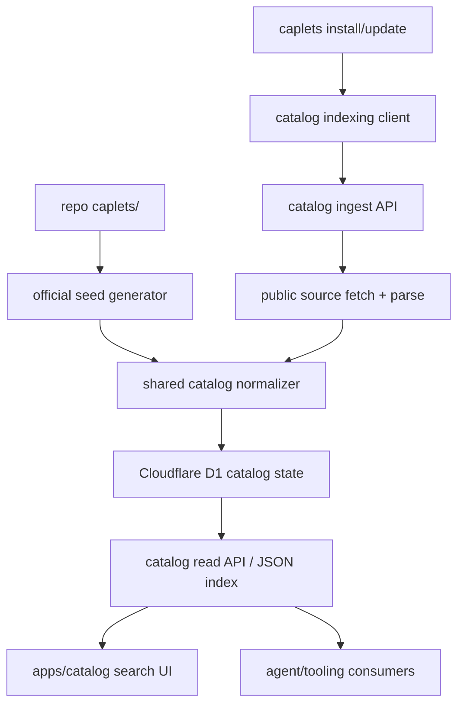
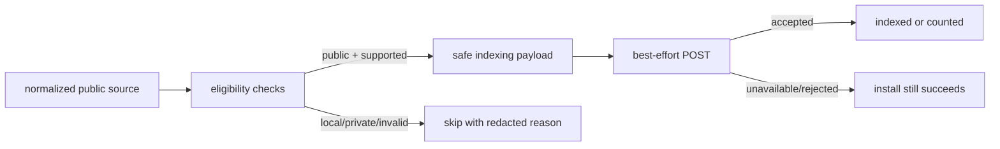
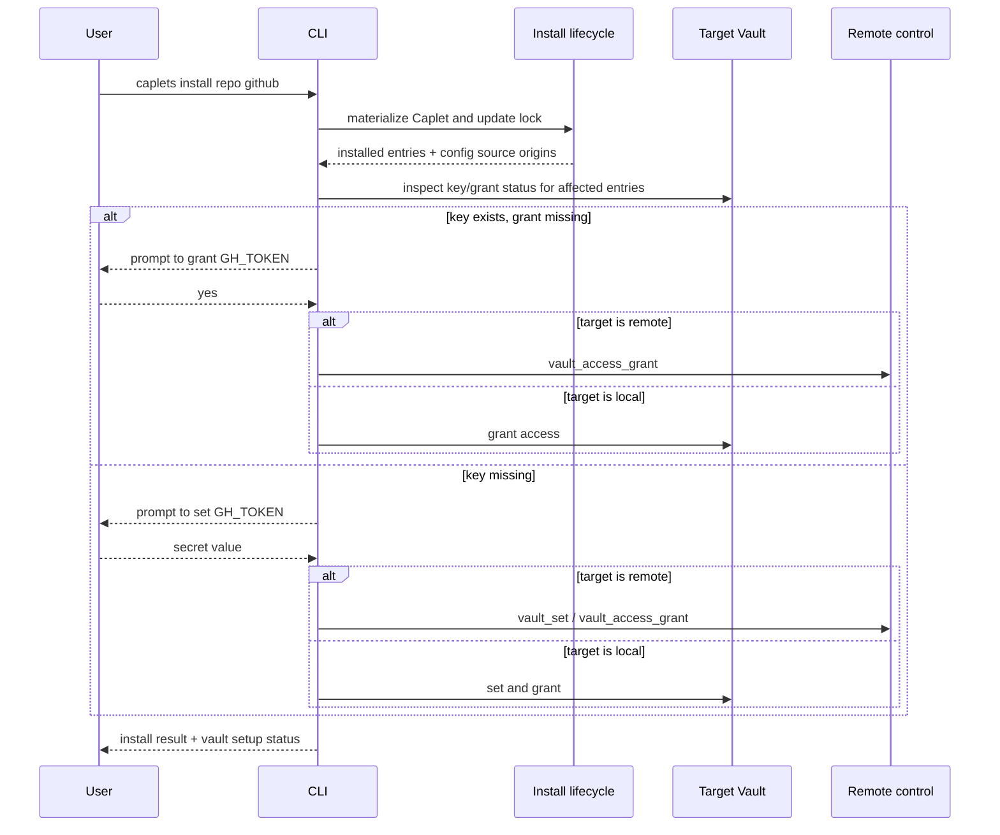

# feat: Build Caplets catalog search site

## Summary

Build `catalog.caplets.dev` as a separate search-first public catalog for Caplets. The catalog indexes official Caplets from this repo and community Caplets discovered from successful public external installs. It exposes readable Caplet content, normalized install commands, aggregate install counts, source labels, and loud safety warnings without claiming scanner coverage in v1.

This release also adds install-time Vault onboarding for Caplets that reference Vault values, so users get grant or set-and-grant guidance immediately after install, restore, or update instead of only discovering runtime quarantine later.

The implementation should keep Caplets Code Mode-first and agent-readable. The website, public JSON/API responses, and CLI JSON output should share catalog primitives rather than drifting into separate browser-only and agent-only representations.

---

## Problem Frame

Caplets now has a growing prebuilt catalog and lockfile-backed install/update behavior, but discovery still depends on knowing a repo and Caplet ID ahead of time. That is enough for a curated seed catalog, but not enough for a wider ecosystem where useful Caplets live outside this repo.

The requirements call for the same discovery loop that makes skills.sh useful: installs from public sources create a discovery signal; search makes useful entries findable; detail pages expose enough source content for users to decide whether to install. Caplets has a higher-risk capability surface than ordinary prompt or skill catalogs, so the catalog must foreground inspection, source trust, unverified community status, and the fact that install counts are popularity signals, not safety signals.

The public indexing signal cannot be ordinary anonymous telemetry. Anonymous telemetry intentionally rejects source URLs, Caplet IDs, hostnames, local paths, and other values that public catalog indexing needs to publish. Catalog indexing needs a separate, optically explicit, public-source-only contract with stricter eligibility checks and nonblocking failure behavior.

Vault setup is part of the same install experience. A public catalog install can materialize a Caplet that is structurally valid but unusable until a Vault key exists and is granted to that Caplet. The CLI should detect that state immediately for the target runtime and guide the user without sending secrets to the catalog, lockfile, logs, JSON output, or install-count events.

---

## Requirements

Plan requirement IDs use `P-R*` so they do not collide with the origin brainstorm's `R1`-`R49` IDs.

**Catalog Site And Design**

- P-R1. Add a separate catalog site at `apps/catalog` and deploy it through the existing Alchemy/Cloudflare deployment family with production domain `catalog.caplets.dev`.
- P-R2. Make search the primary first interaction; install-copy is a conversion action only after users can inspect Caplet content, source, labels, warnings, and setup readiness.
- P-R3. Results and detail views expose name, description, tags, source owner/repo, official/community status, unverified status, aggregate install count, setup/auth readiness, primary Code Mode workflow or best available workflow summary, intended agent task, warning summary, and a normalized install command.
- P-R4. Follow the Caplets product register style: precise, calm, state-rich, and capability-focused. Use `$impeccable` during frontend implementation and avoid generic marketplace or SaaS landing-page patterns.
- P-R5. The frontend covers loading, empty, no-results, unavailable-content, error, copy-success, copy-failure, filter-reset, reduced-motion, mobile, and keyboard states with accessible names, visible focus, screen-reader status updates, and warnings that do not rely only on color.

**Shared Catalog Model**

- P-R6. Add shared catalog primitives for entries, source identities, install commands, warning summaries, install-count display, indexing eligibility, and indexing result status. The site, CLI JSON, indexing service, and public catalog read API consume these primitives.
- P-R7. Do not add a new `catalog` property to Caplet files or global config in v1. Derive catalog entries from existing Caplet content, parsed backend metadata, tags, `useWhen`, `avoidWhen`, setup/auth/project-binding/runtime data, lockfile/risk metadata, and source provenance. Missing optional fields become `unknown`, warnings, or lower-ranked facets rather than schema churn.
- P-R8. Generate install commands only from normalized source metadata and the indexed resolved revision when the source supports revision pinning. Do not copy install commands from community-authored Markdown.
- P-R9. Render indexed `CAPLET.md` content through a sanitized, non-executable Markdown path that strips or escapes unsafe HTML, scripts, event handlers, and dangerous URLs.
- P-R10. Expose the same catalog entry shape through a versioned public read API or static JSON endpoint so agents and tooling are not forced to scrape the website.

**Indexing Sources And Storage**

- P-R11. Seed official catalog entries from repo-owned Caplets under `caplets/`, using existing Caplet parsing rather than a parallel parser.
- P-R12. Add community entries from successful installs of public external sources only.
- P-R13. Public indexing publishes only public Caplet content, normalized install command, source identity needed to reproduce install, indexed resolved revision or content hash when available, aggregate install count, verification/official/community status, warning summaries, and safe derived metadata.
- P-R14. Public indexing never transmits, persists, logs, or publishes installer identity, local paths, private config, credentials, raw agent prompts, tool arguments, tool outputs, installer or runtime hostnames, private-source URLs, private or non-public source hostnames, non-public source URLs, or Vault secret values. The normalized public provider/source identity allowed by P-R13 is the only hostname-bearing data allowed to reach catalog storage or output.
- P-R15. Indexing eligibility rejects local paths, private or auth-only hosts, private IP ranges, unsupported providers, non-normalizable install commands, invalid Caplet files, unfetchable public Caplet files, and redirects to non-public destinations.
- P-R16. Store canonical entries, aggregate counts, dedupe/rate-limit state, and suppression records in Cloudflare-owned state. Low-count bucketing, source-key quotas, bounded fetch work, and suppression must prevent individual install events from becoming visible or easy to inflate.
- P-R17. Repeated installs of the same public source and Caplet update aggregate ranking signals without creating duplicate entries.
- P-R18. Add an internal operator suppression path for stale sources, takedown requests, private-source leakage, abuse, or high-risk behavior discovered before scanning/moderation exists. V1 must not add a public admin endpoint for suppression.

**CLI, Remote, And Agent Surfaces**

- P-R19. `caplets install`, no-argument lockfile restore, and `caplets update` emit public catalog indexing signals as best-effort side effects only after successful materialization of eligible public external Caplets.
- P-R20. Catalog indexing must not block install/update/restore when the indexer is unavailable, rate-limited, or rejects a source.
- P-R21. CLI human output includes a clear non-blocking notice for public external installs explaining that public Caplet content/source identity may be indexed. No extra confirmation prompt is added.
- P-R22. CLI JSON output includes stable indexing eligibility/status data without leaking rejected private source values or secrets.
- P-R23. Remote installs and updates emit or return indexing status from the runtime that performed the mutation. `--remote` continues to target remote global install state for this milestone.
- P-R24. Agent and tooling access in v1 is the versioned public catalog read API/static JSON plus CLI JSON indexing statuses. Installed-Caplet native and Code Mode inspection summaries are follow-up unless they fall out cheaply from shared data without expanding the launch gate.

**Vault Install Onboarding**

- P-R25. After install, restore, or update materializes Caplets that reference Vault values in runtime-resolved config fields, the CLI detects target-runtime Vault requirements for affected Caplets.
- P-R26. If the target Vault already contains a referenced key but the Caplet lacks a matching grant, prompt the user to grant that key to the Caplet.
- P-R27. If the target Vault does not contain a referenced key, prompt the user to set the key and grant it to the Caplet in the same target runtime.
- P-R28. Vault setup targets the runtime that owns the install scope: local project, local global, or remote global. Never copy secrets between runtime Vault stores.
- P-R29. Vault setup never writes raw secret values to lockfiles, catalog indexing signals, install-count events, logs, JSON output, or the catalog site.
- P-R30. Noninteractive, JSON, CI, and otherwise unpromptable installs do not hang or fail solely because Vault setup is unresolved; they return actionable `caplets vault set` and `caplets vault access grant` guidance while existing runtime quarantine remains the enforcement path.

**Docs And Release**

- P-R31. Public docs explain that catalog indexing is public-source indexing, not anonymous telemetry, and name the metadata that can become public after public external installs.
- P-R32. Docs and UI copy state that install counts are ranking/popularity signals, not safety, quality, endorsement, or verification signals.
- P-R33. Docs cover catalog search, public indexing, source suppression, community warnings, install-copy, lockfile restore/update interaction, and Vault install setup behavior.
- P-R34. Add a changeset for public CLI behavior, public indexing behavior, Vault install onboarding, and any package exports added for shared catalog primitives.
- P-R35. Add focused automated coverage for shared catalog normalization, stable entry keys, official indexing, community ingestion, source revision binding, privacy/log boundaries, ingest abuse controls, CLI indexing statuses, Vault onboarding, frontend rendering, deployment domains, and docs checks.

---

## Key Technical Decisions

- **KTD1. Build a new Astro app, not a docs page.** The catalog is a search product with its own domain, interaction model, data API, and deployment surface. It belongs in `apps/catalog`, deployed beside `apps/landing` and `apps/docs`.
- **KTD2. Use Cloudflare D1 for canonical catalog state and a bounded read model for v1 search.** Official entries can be generated from the repo, but community installs and ranking counts are dynamic. D1 is the smallest Cloudflare-native store for canonical entries, aggregate counts, suppression records, and dedupe/rate-limit state. V1 search should use a denormalized JSON/read API loaded by the site and filtered client-side, targeting a corpus under roughly 5,000 entries or a 2 MiB compressed index. Move to D1 FTS or dedicated search before exceeding those bounds or missing a sub-500 ms p95 index fetch target.
- **KTD3. Keep public catalog indexing separate from anonymous telemetry.** Do not widen `packages/core/src/telemetry/events.ts` or `packages/core/src/telemetry/privacy.ts` to allow public source identity. Add a separate catalog indexing client and payload schema with its own explicit eligibility rules, notices, docs, and tests.
- **KTD4. Add worker-safe shared catalog primitives with a clear support contract.** Put pure types and functions under `packages/core/src/catalog/` and export them through a dedicated package subpath. Keep the export free of Node-only filesystem/process APIs so the Cloudflare catalog app and core CLI can share normalization logic without violating package-boundary tests. The versioned `/api/v1/catalog` read API is the stable external discovery contract; mark the package export's v1 data-model helpers as experimental in docs/types so npm consumers do not mistake it for the long-term catalog API boundary.
- **KTD5. Do not add a Caplet `catalog` metadata property in v1.** The user explicitly does not want a skills.sh-incompatible metadata layer. Derive v1 catalog fields from existing Caplet data and mark missing optional facets as `unknown`. If later usage proves a field is essential, add it from evidence, not ahead of need.
- **KTD6. Treat install commands as generated, revision-bound artifacts.** The only install command shown by the site or returned in catalog JSON is generated from normalized source identity, Caplet ID, and indexed resolved revision when available. Community Markdown can explain usage, but it cannot author the copyable command. If the source cannot be pinned to the content the user inspected, hide the copy action and show a freshness warning rather than offering an unbound command.
- **KTD7. Use basic ingestion hygiene, not scanner claims.** V1 rejects invalid/non-public/unsafe-to-render inputs and supports suppression. It does not claim semantic scanning, dependency scanning, secret scanning, vulnerability scanning, moderation review, or certification.
- **KTD8. Keep install authoritative and indexing best-effort.** Install, restore, update, lockfile writes, local modification checks, and Vault setup remain the authoritative local/remote lifecycle. Catalog reporting is a nonblocking side effect with structured status output.
- **KTD9. Run Vault setup after materialization, before the user moves on.** Install/update/restore should complete the file/lock mutation first, then detect affected Vault references and guide setup. If setup is skipped or impossible, runtime quarantine still protects execution.
- **KTD10. Prompt only when the CLI can safely prompt.** Interactive TTY installs can prompt for grants and secret values. `--json`, non-TTY, CI, and remote contexts that cannot safely prompt return recovery commands and statuses without hanging.
- **KTD11. Remote Vault setup uses remote Vault commands.** For `--remote`, the local CLI may prompt the human, but set/grant operations must go through remote control so the secret lands in the remote global Vault store. The local machine must not persist or reuse the remote secret.
- **KTD12. Use Impeccable as a required implementation step.** The plan should reserve explicit implementation time for `$impeccable` shaping, critique, browser inspection, and polish rather than treating frontend design as CSS afterthought.
- **KTD13. Use an internal suppression script in v1.** Suppression writes should be performed by an operator-only script that mutates catalog D1 state with deployment credentials. Do not add a public suppression/admin endpoint until there is an authenticated admin product surface and audit model.
- **KTD14. Make count integrity privacy-preserving.** The install-signal endpoint is unauthenticated public ingestion by design. It must enforce body-size limits, global quotas, per-normalized-source refractory windows, idempotency keys based on normalized public source plus resolved revision/content hash, bounded fetch work, redacted `rate_limited`/`suppressed` statuses, and low-count display as `<10` until an entry has at least 10 accepted signals. Do not persist installer identity or raw client identifiers in app state.
- **KTD15. Choose a worker-compatible Markdown pipeline up front.** Use a `unified` pipeline with `remark-parse`, `remark-rehype` without raw HTML, `rehype-sanitize`, and `rehype-stringify`; allow only the minimal tags/attributes needed for readable Caplet docs and only `https:`, `http:`, and relative links after validation. Pair sanitizer fixtures with catalog CSP/security-header tests.

---

## High-Level Technical Design

---

## Implementation Units

### U1. Add shared catalog primitives and command normalization

- **Goal:** Create the stable model consumed by the site, CLI, indexer, tests, and public catalog API.
- **Requirements:** P-R3, P-R6, P-R7, P-R8, P-R10, P-R22, P-R24
- **Dependencies:** None
- **Files:** `packages/core/src/catalog/types.ts`, `packages/core/src/catalog/source.ts`, `packages/core/src/catalog/install-command.ts`, `packages/core/src/catalog/warnings.ts`, `packages/core/src/catalog/entry.ts`, `packages/core/src/catalog/index.ts`, `packages/core/package.json`, `packages/core/rolldown.config.ts`, `packages/core/test/catalog-model.test.ts`, `packages/core/test/package-boundaries.test.ts`
- **Approach:** Define `CatalogEntry`, `CatalogEntryKey`, `CatalogSourceIdentity`, `CatalogInstallCommand`, `CatalogWarning`, `CatalogIndexingEligibility`, `CatalogIndexingStatus`, and display-count helpers. Implement public-source normalization for public GitHub repositories and owner/repo shorthand without credentials; additional providers remain out of v1 until they meet the same public-source checks. Define stable `entryKey` derivation from provider, normalized owner/repo, normalized Caplet path, and Caplet ID, with official aliases and suppression aliases mapping to the same canonical key while revision fields stay separate. Implement install-command generation from normalized source identity, Caplet ID, and resolved revision when available. Implement derived workflow/readiness/warning summaries from existing Caplet fields and parsed runtime/risk metadata, with explicit `unknown` states for missing optional data. Export the module as `@caplets/core/catalog`, keep it worker-safe, and document `/api/v1/catalog` as the stable external discovery contract.
- **Test scenarios:** Owner/repo plus Caplet ID and resolved revision produces a pinned install command; official repo entries produce the official install command; credential-bearing URLs are rejected; local paths and private hosts return redacted ineligible statuses; `entryKey` handles case normalization, paths, official aliases, revision separation, and suppression aliases consistently; warnings include unverified community, local-control, mutating SaaS, auth/setup required, Project Binding required, and unknown readiness; generated commands never use Markdown content; the package-boundary test verifies the export is dedicated and worker-safe.
- **Verification:** Site and CLI code can import one pure model without pulling in Node-only core runtime code.

### U2. Generate official catalog seed data from repo Caplets

- **Goal:** Seed official catalog entries from `caplets/` with no duplicate parser.
- **Requirements:** P-R7, P-R11, P-R13, P-R35
- **Dependencies:** U1
- **Files:** `scripts/generate-catalog-index.ts`, `apps/catalog/src/data/official-catalog.json`, `packages/core/src/caplet-source/parse.ts`, `packages/core/src/caplet-source/filesystem.ts`, `packages/core/test/catalog-official-index.test.ts`, `package.json`, `turbo.json`
- **Approach:** Add a generation script that reads `caplets/` through the existing Caplet source parser, converts parsed Caplets into shared `CatalogEntry` records, marks them official, and writes a deterministic seed JSON file for `apps/catalog`. Keep the generated file deterministic through stable sorting and stable JSON. Official install counts can start at zero or merge with D1 aggregate counts at read time.
- **Test scenarios:** Every checked-in official Caplet parses; generated official entries include source, install command, readable content reference/body, tags, setup/auth readiness, workflow summary or `unknown`, and warning labels; malformed official Caplets fail generation; output ordering is stable; generated data does not include local absolute paths, credentials, or shadowing policy rules.
- **Verification:** The official catalog can be regenerated from source without hand-maintained catalog metadata.

### U3. Add Cloudflare catalog infrastructure and data store

- **Goal:** Deploy `catalog.caplets.dev` with Cloudflare-backed state for dynamic community indexing and ranking.
- **Requirements:** P-R1, P-R10, P-R12, P-R16, P-R17, P-R18, P-R35
- **Dependencies:** U1, U2
- **Files:** `apps/catalog/package.json`, `apps/catalog/astro.config.mjs`, `apps/catalog/migrations/0001_catalog.sql`, `apps/catalog/src/env.d.ts`, `apps/catalog/src/lib/catalog-store.ts`, `apps/catalog/src/lib/counts.ts`, `apps/catalog/src/pages/api/v1/catalog/index.ts`, `apps/catalog/src/pages/api/v1/catalog/entries/[entryKey].ts`, `apps/catalog/src/pages/api/v1/catalog/install-signals.ts`, `scripts/catalog-suppress.ts`, `alchemy.run.ts`, `infra/alchemy-domains.ts`, `infra/alchemy-runner.test.ts`, `.github/workflows/deploy.yml`, `.github/workflows/pr-preview-deploy.yml`
- **Approach:** Add `catalogPageDomain` and `catalogPageUrl` to domain construction, deploy `apps/catalog` beside landing/docs, and include catalog preview URLs in PR comments. Configure the catalog Astro app for Cloudflare/server output so API routes can bind to D1. Provision D1 through Alchemy for catalog state. Create tables for canonical entries, aggregate counts, source aliases/dedupe keys, suppression records, ingestion attempts with bounded retention, and idempotency keys that do not identify installers. The read API should merge official seed data with D1 community records and count overlays. The write API should accept only the strict public indexing signal envelope and return structured accepted/rejected/status responses. Add an internal `scripts/catalog-suppress.ts` operator path for suppression writes; do not expose a public admin endpoint in v1.
- **Test scenarios:** Production domain resolves to `catalog.caplets.dev`; preview domains use `catalog.<stage>.preview.caplets.dev`; local dev uses a distinct port; PR preview comments include catalog URL; D1 migrations create expected tables; read APIs return official seed entries with counts; suppressed entries do not appear in search/detail responses; the suppression script can hide an entry without adding a public route; write API rejects malformed payloads and never echoes unsafe source values; body-size limits, global quotas, per-source refractory windows, idempotency keys, low-count `<10` display, and bounded fetch work prevent repeated public signals from arbitrarily inflating visible counts.
- **Verification:** The catalog can deploy independently from landing/docs while still using the existing Cloudflare deployment family.

### U4. Implement community ingestion, fetch, sanitization, and suppression

- **Goal:** Turn public install signals into safe, searchable community entries.
- **Requirements:** P-R9, P-R12, P-R13, P-R14, P-R15, P-R16, P-R17, P-R18, P-R35
- **Dependencies:** U1, U3
- **Files:** `apps/catalog/package.json`, `apps/catalog/src/lib/public-source.ts`, `apps/catalog/src/lib/ingest.ts`, `apps/catalog/src/lib/markdown.ts`, `apps/catalog/src/lib/rate-limit.ts`, `apps/catalog/src/lib/suppression.ts`, `apps/catalog/src/pages/api/v1/catalog/install-signals.ts`, `apps/catalog/test/ingest.test.ts`, `apps/catalog/test/markdown.test.ts`, `apps/catalog/test/suppression.test.ts`
- **Approach:** The indexer validates source eligibility, fetches only supported public provider raw content at the resolved revision when possible, follows redirects only while preserving public-source guarantees, parses selected Caplet files, sanitizes Markdown, computes the shared catalog entry, updates aggregate counts, and stores or refreshes the canonical entry. Use the Markdown pipeline from KTD15 and store both rendered sanitized content and the indexed revision/content hash used to generate the detail page. Dedupe by stable `entryKey`, not by ad hoc source strings. Suppression rules override both new ingestion and read responses. Store aggregate counts and display buckets; do not expose individual install events. Persist only categorical attempt status plus allowed public source metadata; do not log request bodies, raw rejected source values, credentials, client identifiers, Vault values, or unsafe exception payloads.
- **Test scenarios:** Public GitHub source ingests at the resolved revision; a branch changing between install signal and ingestion does not cause the catalog to publish a different inspected artifact; local path, private IP, localhost, unsupported host, credential URL, auth-required source, unsupported redirect, missing Caplet file, invalid frontmatter, oversized file, and unsafe Markdown are rejected or sanitized; repeated signals increment counts without duplicate entries; low counts display as `<10` and do not dominate ranking; suppression hides an entry and prevents re-ingestion; generated install command is independent of Markdown snippets; rejection and error paths do not persist or log unsafe values.
- **Verification:** Community indexing can publish only safe public content and aggregate ranking signals.

### U5. Emit best-effort catalog indexing signals from install/update/restore

- **Goal:** Make successful public external installs the v1 submission mechanism.
- **Requirements:** P-R12, P-R13, P-R14, P-R15, P-R19, P-R20, P-R21, P-R22, P-R23, P-R35
- **Dependencies:** U1, U3, U4
- **Files:** `packages/core/src/catalog-indexing/client.ts`, `packages/core/src/catalog-indexing/eligibility.ts`, `packages/core/src/catalog-indexing/payload.ts`, `packages/core/src/cli/install.ts`, `packages/core/src/cli.ts`, `packages/core/src/remote-control/types.ts`, `packages/core/src/remote-control/dispatch.ts`, `packages/core/test/catalog-indexing.test.ts`, `packages/core/test/cli.test.ts`, `packages/core/test/cli-remote.test.ts`, `packages/core/test/remote-control-dispatch.test.ts`
- **Approach:** After a lifecycle operation succeeds and lock entries are durable, evaluate installed entries for catalog-index eligibility. Eligible public external entries send a bounded payload to the catalog ingest endpoint containing normalized public source identity, Caplet path, Caplet ID, tracked ref, resolved revision when available, installed content hash, and stable `entryKey`; omit any payload that cannot be made public and revision-bound. Ineligible entries return categorical redacted reasons such as `not_public`, `unsupported_source`, `revision_unavailable`, or `suppressed`. Human output prints a concise notice for public external sources; JSON output includes indexing status. Remote install/update emits the signal from the remote process where practical, or returns enough nonsecret status for the local CLI to report. Any network/indexer failure is reported as a nonblocking status and never fails the local install.
- **Test scenarios:** Official repo install is already represented by official seed data and does not create duplicate community entries; public community install sends normalized source identity, Caplet ID, resolved revision, and installed hash; private/local/non-public installs skip without echoing raw private source; failed installs do not signal; an unresolved public revision returns `revision_unavailable`; indexer unavailable produces nonblocking status; `--json` includes stable status values; remote global install/update reports status without mutating local project lockfiles or leaking remote host details.
- **Verification:** Public external installs become discovery signals without weakening install correctness or privacy.

### U6. Build the catalog search and detail frontend with Impeccable

- **Goal:** Deliver the public search product and detail inspection experience.
- **Requirements:** P-R1, P-R2, P-R3, P-R4, P-R5, P-R8, P-R9, P-R10, P-R32, P-R35
- **Dependencies:** U1, U2, U3 for an official-only preview; U4 before public community launch
- **Files:** `apps/catalog/src/pages/index.astro`, `apps/catalog/src/pages/caplets/[entryKey].astro`, `apps/catalog/src/components/SearchShell.astro`, `apps/catalog/src/components/FilterBar.astro`, `apps/catalog/src/components/ResultList.astro`, `apps/catalog/src/components/CapletResult.astro`, `apps/catalog/src/components/CapletDetail.astro`, `apps/catalog/src/components/InstallCommand.astro`, `apps/catalog/src/components/SafetyNotice.astro`, `apps/catalog/src/lib/security-headers.ts`, `apps/catalog/src/scripts/search.ts`, `apps/catalog/src/scripts/copy.ts`, `apps/catalog/src/styles/catalog.css`, `apps/catalog/test/catalog-ui.test.ts`, `apps/catalog/test/accessibility.test.ts`
- **Approach:** Use the root `PRODUCT.md` and `DESIGN.md` plus the existing landing implementation patterns as design context. Build a dense, search-first developer tool: search input, filters, sort, result count, official/community scopes, tags, setup/auth readiness, source owner/repo, warning badges, and result/detail states. Result cards may show a non-copy command preview and must route users to the detail page for copy. Copy actions live on detail pages only after readable sanitized content, indexed revision/hash, and warning context are visible. If content is unavailable, suppressed, or no longer fetchable, show safe metadata and warnings, link to the public source when allowed, hide the copy action, and explain that install is blocked until the content can be inspected again. Add restrictive catalog security headers including CSP, `base-uri 'none'`, `object-src 'none'`, and `frame-ancestors 'none'`. Run `$impeccable` during implementation for shaping and polish, then verify desktop/mobile screenshots and keyboard behavior.
- **Test scenarios:** Search for `sentry` shows official result with non-copy command preview and detail link; community result shows unverified warning; filtering by official/community/tags/setup works; no-results and reset states are accessible; detail renders sanitized content with indexed revision/hash before the copy action; unavailable-content detail hides copy and exposes recovery/source inspection guidance; unsafe HTML does not execute; security headers are present on community Markdown detail pages; copy success/failure updates an aria-live region; focus order is predictable; mobile controls do not overlap; reduced-motion users are not forced through animation; install-count copy states popularity only.
- **Verification:** Users can find, inspect, and copy install commands from a precise, accessible catalog surface.

### U7. Stabilize public agent and tooling access

- **Goal:** Prevent the catalog from becoming browser-only without expanding the launch gate into installed-Caplet native surface changes.
- **Requirements:** P-R6, P-R10, P-R24, P-R35
- **Dependencies:** U1, U2, U3, U5
- **Files:** `apps/catalog/src/pages/api/v1/catalog/index.ts`, `apps/catalog/src/pages/api/v1/catalog/entries/[entryKey].ts`, `packages/core/src/catalog/index.ts`, `apps/catalog/test/catalog-api.test.ts`, `packages/core/test/catalog-model.test.ts`, `apps/docs/src/content/docs/catalog.mdx`
- **Approach:** Treat `/api/v1/catalog` and `/api/v1/catalog/entries/[entryKey]` as the v1 agent/tooling surface. The response should use the shared catalog entry model, include generated install commands and warnings, and avoid requiring HTML scraping. CLI JSON indexing statuses should use the same status enums. Do not modify native tool descriptions, Code Mode declarations, or installed-Caplet `inspect()` as part of the launch gate; add those later only if the public API proves insufficient or the data threads through without extra behavior surface.
- **Test scenarios:** Public API list and detail responses include the shared catalog entry shape, warning labels, install command, indexed revision/hash, and setup/auth readiness; private/local skipped installs do not appear or expose raw source values; CLI JSON indexing status enum matches the public model; docs tell agents to use the public API/static JSON rather than scrape HTML; no native/Code Mode declaration snapshots churn in v1 solely for catalog summaries.
- **Verification:** Agents can search and inspect catalog entries through structured public data while the launch stays focused on the catalog site and indexing loop.

### U8. Add install-time Vault setup detection and prompting

- **Goal:** Guide users through missing Vault keys or grants immediately after install/restore/update.
- **Requirements:** P-R25, P-R26, P-R27, P-R28, P-R29, P-R30, P-R35
- **Dependencies:** U3 for remote status reporting shape is helpful but not strictly required; U5 for shared install lifecycle result integration
- **Files:** `packages/core/src/cli/vault-onboarding.ts`, `packages/core/src/config.ts`, `packages/core/src/vault/index.ts`, `packages/core/src/cli/vault.ts`, `packages/core/src/cli/install.ts`, `packages/core/src/cli.ts`, `packages/core/src/remote-control/types.ts`, `packages/core/src/remote-control/dispatch.ts`, `packages/core/test/catalog-vault.test.ts`, `packages/core/test/cli.test.ts`, `packages/core/test/cli-remote.test.ts`, `packages/core/test/remote-control-dispatch.test.ts`
- **Approach:** Extract the existing unresolved-Vault detection logic from config parsing into a reusable helper rather than regex-scanning Markdown. After install/restore/update, re-load the target runtime config with the Vault bootstrap resolver, resolve the single active config source origin for each affected Caplet in the target runtime, filter Vault requirements to those active origins, and inspect the target Vault store for key/grant status. If an affected Caplet has zero active origins or multiple possible active origins after shadowing/disabled-set rules, do not write a grant; return recovery guidance naming the ambiguity. Interactive local installs prompt to grant an existing key or set-and-grant a missing key. Interactive remote installs prompt locally but execute set/grant through remote Vault control commands. Noninteractive/JSON installs return `vaultSetup` statuses and recovery commands. Set-and-grant should be rollback-safe enough that a failed grant does not leave an ambiguous success message.
- **Test scenarios:** Installing a `$vault:GH_TOKEN` Caplet with existing key and missing grant prompts grant; missing key prompts set-and-grant; declined prompt leaves install successful with recovery guidance; `--json` and non-TTY never prompt; raw secret never appears in output, logs, lockfile, catalog signal, or JSON; project/global origins produce correct grant scope; shadowed project/global Caplets, disabled sets, zero-origin cases, and multiple-origin ambiguity return recovery guidance instead of writing the wrong grant; remote global uses remote Vault operations; remote failures return redacted actionable errors; runtime quarantine behavior remains unchanged when setup is unresolved.
- **Verification:** Vault-backed Caplets become usable sooner without weakening secret boundaries.

### U9. Update docs, privacy copy, and release metadata

- **Goal:** Make the new public discovery loop understandable and release-ready.
- **Requirements:** P-R21, P-R31, P-R32, P-R33, P-R34, P-R35
- **Dependencies:** U1-U8
- **Files:** `apps/docs/src/content/docs/install.mdx`, `apps/docs/src/content/docs/vault.mdx`, `apps/docs/src/content/docs/capabilities.mdx`, `apps/docs/src/content/docs/catalog.mdx`, `apps/docs/src/content/docs/privacy/indexing.mdx`, `apps/docs/astro.config.mjs`, `README.md`, `.changeset/*.md`
- **Approach:** Document catalog search, public indexing, install-count meaning, community warnings, internal suppression, revision-bound install commands, and the exact public/private metadata boundary. Update install docs to mention nonblocking public indexing notices for public external installs and how lockfile restore/update interact with catalog signals. Update Vault docs with install-time prompt behavior and noninteractive recovery commands. Add docs navigation for catalog/indexing privacy. Document `/api/v1/catalog` as the supported public discovery API and `@caplets/core/catalog` as an experimental shared implementation export in v1. Add a changeset covering CLI output/behavior, public indexing behavior, public package export, and Vault onboarding.
- **Test scenarios:** Docs say `caplets update`, not `upgrade`; docs distinguish public catalog indexing from anonymous telemetry; docs list what may become public and what must never become public; docs state install counts are not safety signals; docs do not claim scanner coverage; docs show revision-bound install-copy behavior; docs show `caplets vault set` and `caplets vault access grant` recovery commands for noninteractive installs; changeset exists unless the PR is explicitly labeled `no changeset`.
- **Verification:** Users can understand the discovery loop and privacy boundary before installing public community Caplets.

---

## System-Wide Impact

- **Public app surface:** Adds a third public Astro app and a new production domain. This touches Alchemy deployment, preview comments, local dev ports, and Cloudflare state.
- **Core package exports:** Adds a worker-safe catalog export and tests to keep it separate from Node-only runtime code.
- **Install lifecycle:** Adds best-effort public indexing status and Vault setup results after install/restore/update. This must not destabilize existing lockfile behavior.
- **Remote control:** Remote install/update and remote Vault setup need nonsecret status propagation and must keep remote global state on the remote machine.
- **Privacy model:** Public catalog indexing becomes a separate data path from anonymous telemetry. Tests should prove telemetry privacy remains restrictive.
- **Agent surfaces:** The versioned public catalog read API and CLI JSON statuses are the v1 agent-readable surfaces, so agent discovery stays aligned with the website without forcing installed native/Code Mode changes into launch.
- **Docs and release:** Public docs, changesets, and likely deployment workflow changes are part of the implementation, not optional follow-up.

---

## Risks And Mitigations

- **Private source or secret leakage.** Mitigation: separate indexing client, strict eligibility schema, redacted skip reasons, no telemetry allowlist expansion, source fetch allowlist, private IP/redirect rejection, and tests for local/private/token/hostname/path cases.
- **Install counts being mistaken for trust.** Mitigation: UI and docs copy near ranking and install actions; count label should read as popularity/ranking only; no score language.
- **Website-only catalog.** Mitigation: shared catalog model, stable public read API/JSON, and CLI JSON statuses.
- **Markdown XSS or command injection.** Mitigation: sanitized Markdown rendering and generated install commands from normalized source metadata only.
- **Inspecting one revision but installing another.** Mitigation: catalog entries store indexed revision/content hash, detail pages show that revision, and copyable install commands are pinned to the inspected revision when supported; otherwise copy is hidden.
- **Remote Vault secret mishandling.** Mitigation: prompt locally only for human entry, execute set/grant through remote Vault commands, never persist locally, and test JSON/log redaction.
- **Indexer outage affecting installs.** Mitigation: indexing happens only after successful install and failures return nonblocking statuses.
- **D1/search complexity creep.** Mitigation: use D1 for canonical state and a simple denormalized read model for v1; defer advanced search ranking infrastructure until actual scale requires it.
- **Install-count abuse.** Mitigation: source-key quotas, idempotency keys, refractory windows, low-count bucketing, bounded fetch work, suppression, and no installer identity in app state.
- **Schema churn through a new Caplet `catalog` property.** Mitigation: explicitly avoid the property in v1; derive from existing fields and tolerate `unknown` optional facets.
- **Scanner scope creep.** Mitigation: v1 stop rule is suppression plus hygiene. Do not imply semantic or dependency scanning until a separate requirements pass exists.

---

## Scope Boundaries

- Semantic malicious-intent scanning, dependency scanning, vulnerability scanning, secret scanning, OpenSSF Scorecard, Socket-style audit integration, and LLM review are out of scope for v1.
- Ratings, reviews, comments, publisher profiles, verified publisher programs, manual moderation queues, and hosted accounts are out of scope.
- Installed-Caplet native/Code Mode catalog summaries and a dedicated `caplets catalog search` or `caplets catalog get` CLI command are deferred unless implementation proves the public JSON endpoint is insufficient for agent/tool access.
- Site-side Vault secret entry is out of scope. Vault setup belongs to the CLI and target runtime.
- Remote project install/update/Vault semantics remain out of scope; `--remote` targets remote global state for this milestone.
- The catalog does not replace `docs.caplets.dev` and should link to docs rather than becoming the docs site.

---

## Open Questions

- **Public read API response shape:** Decide final payload fields, pagination shape, and search parameters during implementation; keep endpoint names versioned under `/api/v1/catalog/`.
- **Dedicated CLI catalog search:** Keep deferred for v1 unless agent testing shows the public JSON endpoint is not enough.

---

## Testing Strategy

- Run focused core tests for catalog primitives, official seed generation, indexing eligibility, CLI install/update/restore status, Vault onboarding, remote dispatch, and telemetry privacy:
  - `pnpm --filter @caplets/core test -- test/catalog-model.test.ts test/catalog-official-index.test.ts test/catalog-indexing.test.ts test/catalog-vault.test.ts test/cli.test.ts test/cli-remote.test.ts test/remote-control-dispatch.test.ts test/telemetry-redaction.test.ts test/telemetry-events.test.ts test/package-boundaries.test.ts`
- Run catalog app tests:
  - `pnpm --filter @caplets/catalog test`
  - `pnpm --filter @caplets/catalog typecheck`
  - `pnpm --filter @caplets/catalog build`
- Run generated artifact checks when adding exports or generated official data:
  - `pnpm schema:check`
  - `pnpm docs:check`
  - `pnpm code-mode:check-api`
- Run deployment/domain tests:
  - `pnpm test -- infra/alchemy-runner.test.ts`
- Run browser and accessibility checks during frontend implementation, including desktop/mobile screenshots, keyboard-only search/filter/detail/copy flows, reduced-motion checks, and sanitized Markdown fixture pages.
- Finish with the repo gate before PR:
  - `pnpm verify`

---

## Sources / Research

- `docs/brainstorms/2026-06-26-caplets-catalog-search-site-requirements.md` for source requirements.
- `STRATEGY.md`, `CONCEPTS.md`, `PRODUCT.md`, and `DESIGN.md` for product, vocabulary, and design direction.
- `alchemy.run.ts`, `infra/alchemy-domains.ts`, `.github/workflows/deploy.yml`, and `.github/workflows/pr-preview-deploy.yml` for existing public-site deployment.
- `packages/core/src/caplet-source/parse.ts`, `packages/core/src/caplet-files.ts`, and `caplets/` for official Caplet parsing.
- `packages/core/src/cli.ts`, `packages/core/src/cli/install.ts`, and `packages/core/src/cli/lockfile.ts` for install/update/restore and lockfile behavior.
- `packages/core/src/remote-control/types.ts` and `packages/core/src/remote-control/dispatch.ts` for remote install/update and Vault command routing.
- `packages/core/src/config.ts`, `packages/core/src/vault/index.ts`, `docs/product/caplets-vault.md`, and `apps/docs/src/content/docs/vault.mdx` for Vault reference and grant behavior.
- `docs/product/anonymous-telemetry.md`, `packages/core/src/telemetry/privacy.ts`, and telemetry tests for privacy boundaries.
- `packages/core/src/cli/inspection.ts`, `packages/core/src/registry.ts`, `packages/core/src/capability-description.ts`, `packages/core/src/native/tools.ts`, and Code Mode tests for current installed-Caplet inspection surfaces considered and kept out of the v1 launch gate.
- `docs/solutions/integration-issues/vault-cli-runtime-integration-fixes.md`, `docs/solutions/integration-issues/stale-remote-profile-credentials-refresh.md`, `docs/solutions/architecture-patterns/code-mode-repl-sessions.md`, and `docs/solutions/architecture-patterns/native-daemon-service-management.md` for prior repo learnings relevant to Vault, remote credentials, agent-facing runtime state, and lifecycle boundaries.
- `https://www.skills.sh/` and `https://github.com/vercel-labs/skills` for the public discovery pattern the requirements reference.
