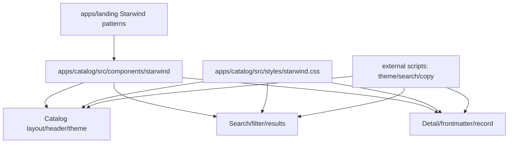

# refactor: Migrate catalog site to Starwind

## Summary

Migrate the catalog search site from bespoke `catalog.css` component styling to the same Starwind + Tailwind foundation used by the landing site, while preserving the existing catalog product behavior: search, filters, result cards, detail pages, warnings, frontmatter table, install command copy, and light/dark/system theme selection.

The migration should be treated as a presentation-system refactor, not a catalog product redesign. Data ingestion, indexing, API shape, install-count behavior, and CLI catalog behavior stay out of scope unless the UI migration exposes a small bug in the existing browser-facing surface.

---

## Problem Frame

The catalog site currently matches the intended catalog flows, but it carries its own hand-written styling system in `apps/catalog/src/styles/catalog.css`. That makes it drift from the Starwind-based public site stack and increases the cost of future UI polish. Recent browser feedback has also been fixing low-level UI rendering details one by one: brand icon rendering, frontmatter formatting, hidden search results, detail-page metadata, and theme controls. Starwind gives the catalog a more durable component and token foundation so those fixes live in a shared UI vocabulary instead of accumulating as isolated CSS rules.

The origin requirements still govern the product: the catalog must be a precise, search-first, inspection-first developer tool, not a generic marketplace (see origin: `docs/brainstorms/2026-06-26-caplets-catalog-search-site-requirements.md`). This plan migrates the frontend implementation that serves those requirements; it does not expand v1 scanning, moderation, indexing, or install lifecycle scope.

---

## Requirements

- R1. The catalog app must use Starwind/Tailwind as its primary presentation layer, following the existing `apps/landing` Starwind setup and token conventions.
- R2. The migration must preserve the current catalog search, filter, sort, result count, result visibility, detail routing, copy command, warning, and no-result behaviors.
- R3. The catalog must keep the existing light/dark/system theme dropdown behavior, but implement theme state through Starwind's `.dark` convention rather than catalog-only `data-theme` styling.
- R4. Shared surfaces such as buttons, badges, cards or panels, tables, separators, and disclosure/menu controls should use Starwind primitives or app-local Starwind-compatible wrappers instead of bespoke class families.
- R5. The Caplets brand icon must render consistently in the header on the search and detail pages, with the dark icon background filling the visible icon container.
- R6. The detail-page `CAPLET.md` frontmatter table must remain readable and compact, with table semantics preserved through Starwind table styling.
- R7. Public-facing detail metadata must omit internal-only fields such as `entryKey`, while keeping useful source path, workflow, install count, revision, content hash, auth, setup, and Project Binding readiness.
- R8. The migration must not reintroduce inline-script CSP problems; theme bootstrap, search, and copy behavior stay in external script modules.
- R9. The catalog must remain responsive and keyboard-accessible across desktop and mobile, including visible focus states, usable touch targets, and non-overlapping text.
- R10. The app should retire most of `apps/catalog/src/styles/catalog.css`; any remaining CSS must be limited to Starwind token setup, hard-to-express app-specific behavior, or small compatibility rules such as `[hidden]`.

---

## Scope Boundaries

- **In scope:** `apps/catalog` Starwind setup, app-local Starwind components or wrappers, catalog page/layout components, theme/search/copy script compatibility, focused UI characterization tests, and browser verification scenarios.
- **Out of scope:** Catalog ingestion semantics, D1 schema, install-signal ranking, public catalog API contracts, CLI install/update behavior, Vault onboarding, scanning, moderation, and new catalog content.
- **Deferred:** Extracting a cross-app `packages/ui` design-system package. If duplication between `apps/landing` and `apps/catalog` becomes a sustained maintenance problem, extract it later from two working app-local Starwind implementations.

---

## Key Technical Decisions

- KTD1. **Use app-local Starwind components for the catalog.** Follow `apps/landing/src/components/starwind`, but do not import from `apps/landing`; app-to-app imports blur deploy boundaries and make aliases brittle. Copy or generate the needed Starwind primitives under `apps/catalog/src/components/starwind`.
- KTD2. **Keep the migration behavior-preserving.** This is a refactor of the UI system. The search page and detail page should look cleaner and more consistent, but result inclusion, command text, warnings, public metadata, and Markdown rendering behavior should not change except where the user has already requested corrections.
- KTD3. **Use Starwind's `.dark` theme convention with the existing three-way user choice.** Keep `Light`, `Dark`, and `System` as user-facing modes, but have `ThemeInit.astro`, `theme-init.ts`, and `theme.ts` apply or remove the `dark` class on `<html>` so Tailwind dark variants work.
- KTD4. **Prefer Starwind primitives over a new catalog design system.** Use Starwind `Button`, `Badge`, `Card`, `Table`, `Separator`, and menu/sheet/dialog primitives where they map naturally. Catalog-specific wrappers are acceptable for domain surfaces such as `CapletResult`, `SafetyNotice`, and `InstallCommand`.
- KTD5. **Do not add a shared UI package during this pass.** The implementation can reuse landing patterns by inspection, but moving Starwind components to a package would create dependency and bundling decisions unrelated to making this catalog page match the other sites.
- KTD6. **Keep iconography consistent with current catalog feedback.** Continue using Huge Icons for catalog-specific icon controls unless a Starwind primitive requires its default icon path. Do not reintroduce hand-rolled glyphs.
- KTD7. **Test the risky behavior seams directly.** CSS migration risk is highest around hidden filtered results, theme class application, copy status, and detail content rendering. Add focused tests around the pure filtering and theme logic where possible, then rely on browser inspection for layout and interaction polish.

---

## High-Level Technical Design

The catalog should end with a small Starwind token file, app-local Starwind primitives, Tailwind utility classes in Astro components, and only narrow custom CSS for behavior Starwind does not cover cleanly.

---

## Implementation Units

### U1. Establish catalog Starwind baseline

- **Goal:** Give `apps/catalog` the same Starwind/Tailwind foundation as the landing site without coupling the two apps.
- **Requirements:** R1, R4, R10
- **Dependencies:** None
- **Files:** `apps/catalog/package.json`, `apps/catalog/astro.config.mjs`, `apps/catalog/tsconfig.json`, `apps/catalog/starwind.config.json`, `apps/catalog/src/styles/starwind.css`, `apps/catalog/src/styles/catalog.css`, `apps/catalog/src/components/starwind/button/*`, `apps/catalog/src/components/starwind/badge/*`, `apps/catalog/src/components/starwind/card/*`, `apps/catalog/src/components/starwind/table/*`, `apps/catalog/src/components/starwind/separator/*`
- **Patterns:** Follow `apps/landing/package.json`, `apps/landing/astro.config.mjs`, `apps/landing/tsconfig.json`, `apps/landing/src/styles/starwind.css`, and `apps/landing/src/components/starwind/*`.
- **Approach:** Add the Starwind dependencies already used by the landing site where missing, keep the existing Tailwind Vite plugin, add the `@/*` alias for catalog components, and create a catalog `starwind.css` with Caplets tokens that support both light and dark mode. Move base styles, focus rings, fonts, and color tokens into Starwind/Tailwind. Keep `catalog.css` temporarily during migration, then shrink it as units move.
- **Test scenarios:** `apps/catalog` typecheck and build still resolve Astro aliases and Starwind component imports; Starwind token colors compile in light and dark mode; no `apps/catalog` code imports Starwind components from `apps/landing`; `catalog.css` no longer defines a parallel full-page token system after migration.
- **Verification:** `pnpm --filter @caplets/catalog typecheck` and `pnpm --filter @caplets/catalog build`.

### U2. Migrate shell, header, brand, and theme controls

- **Goal:** Replace the custom header/theme styling with Starwind-compatible layout and theme behavior.
- **Requirements:** R1, R3, R4, R5, R8, R9
- **Dependencies:** U1
- **Files:** `apps/catalog/src/components/CatalogHeader.astro`, `apps/catalog/src/components/ThemeToggle.astro`, `apps/catalog/src/components/ThemeInit.astro`, `apps/catalog/src/components/HugeIcon.astro`, `apps/catalog/src/scripts/theme.ts`, `apps/catalog/src/scripts/theme-init.ts`, `apps/catalog/src/lib/theme.ts`, `apps/catalog/test/theme.test.ts`, `apps/catalog/src/pages/index.astro`, `apps/catalog/src/pages/caplets/[entryKey].astro`
- **Patterns:** Follow the header structure in `apps/landing/src/components/landing/Header.astro` and the `.dark` setup in `apps/landing/src/styles/starwind.css`, while preserving the catalog's light/dark/system dropdown request.
- **Approach:** Move page shell concerns into Starwind utility classes, keep the header sticky and compact, render the real Caplets icon with a full dark icon container, and migrate theme state to a small shared theme helper used by both early bootstrap and interactive dropdown code. The dropdown should remain a real menu-like control with icon, label, selected state, and outside-click/escape handling.
- **Test scenarios:** `system` mode follows `matchMedia("(prefers-color-scheme: dark)")`; `light` removes the `dark` class; `dark` adds the `dark` class; invalid stored values fall back to `system`; the selected menu item exposes the right checked state; header branding renders on both index and detail pages; no inline script is required for theme bootstrap.
- **Verification:** `apps/catalog/test/theme.test.ts`, typecheck, build, and browser inspection of theme switching on `/` and `/caplets/.../`.

### U3. Migrate search, filters, and result list

- **Goal:** Move the search surface onto Starwind primitives while preserving the current client-side behavior and fixing result visibility regressions.
- **Requirements:** R1, R2, R4, R8, R9, R10
- **Dependencies:** U1
- **Files:** `apps/catalog/src/components/SearchShell.astro`, `apps/catalog/src/components/FilterBar.astro`, `apps/catalog/src/components/ResultList.astro`, `apps/catalog/src/components/CapletResult.astro`, `apps/catalog/src/components/InstallCommand.astro`, `apps/catalog/src/components/SafetyNotice.astro`, `apps/catalog/src/scripts/search.ts`, `apps/catalog/src/lib/search-filter.ts`, `apps/catalog/test/search-filter.test.ts`, `apps/catalog/test/catalog-api.test.ts`
- **Patterns:** Use Starwind `Card`, `Badge`, `Button`, and form-compatible Tailwind classes rather than `.search-shell__*`, `.caplet-result__*`, `.chip`, and `.tag-row` class families.
- **Approach:** Extract the filter predicate and sort behavior from `search.ts` into a pure helper so the exact matching logic is protected before CSS classes change. Convert the search panel, filter bar, result count, warning badges, tag badges, command preview, and inspect action to Starwind/Tailwind classes. Keep `[hidden] { display: none !important; }` in the remaining compatibility CSS or equivalent global layer so filtered-out results cannot render due to utility-class changes.
- **Test scenarios:** Searching `ast-grep` shows the `ast-grep` result and hides nonmatching entries; searching a term that only matches tags still works; scope, setup, tag, and sort controls compose with text search; result count singular/plural text matches visible results; reset returns to default result set; command previews remain non-copy detail affordances; warning badges include text and icon, not color only.
- **Verification:** `apps/catalog/test/search-filter.test.ts`, typecheck, build, and browser inspection of `/` at desktop and mobile widths.

### U4. Migrate detail page, Markdown content, and record metadata

- **Goal:** Move the detail view to Starwind table/panel primitives while preserving inspection-first content and public metadata boundaries.
- **Requirements:** R1, R2, R4, R6, R7, R8, R9, R10
- **Dependencies:** U1, U2
- **Files:** `apps/catalog/src/components/CapletDetail.astro`, `apps/catalog/src/components/InstallCommand.astro`, `apps/catalog/src/components/SafetyNotice.astro`, `apps/catalog/src/lib/markdown.ts`, `apps/catalog/test/markdown.test.ts`, `apps/catalog/src/pages/caplets/[entryKey].astro`
- **Patterns:** Use Starwind `Table` components for frontmatter rows, Starwind `Card` or panel classes for record/warning surfaces, and Starwind `Button` for copy/back actions.
- **Approach:** Preserve the frontmatter extraction path and sanitized Markdown renderer. Replace the current frontmatter table styling with Starwind table components and Tailwind classes that handle long values without overflow. Keep the copyable install command near the top but maintain the inspection-first warning and content context. Keep `entryKey` out of public detail metadata while preserving source path, workflow, install count, revision, content hash, auth, setup, and Project Binding readiness.
- **Test scenarios:** Frontmatter rows flatten and render as table rows; long schema/frontmatter values wrap or scroll without breaking the layout; unsafe Markdown stays stripped or escaped; detail pages do not render `Entry key`; unavailable entries show a Starwind-styled recovery state; copy button status updates remain accessible; record panel remains readable in light and dark modes.
- **Verification:** `apps/catalog/test/markdown.test.ts`, typecheck, build, and browser inspection of at least one official detail page in light and dark mode.

### U5. Retire bespoke CSS and verify visual parity

- **Goal:** Finish the migration by deleting or shrinking old CSS and checking the browser experience end to end.
- **Requirements:** R1, R8, R9, R10
- **Dependencies:** U2, U3, U4
- **Files:** `apps/catalog/src/styles/catalog.css`, `apps/catalog/src/styles/starwind.css`, `apps/catalog/src/pages/index.astro`, `apps/catalog/src/pages/caplets/[entryKey].astro`, `apps/catalog/src/components/*.astro`
- **Patterns:** Follow the landing site's split between `apps/landing/src/styles/starwind.css` for tokens/base and small component-local utility classes in Astro files.
- **Approach:** Remove obsolete BEM-style class rules after each component migrates. Keep only narrow app-global rules that are still justified: skip-link behavior, hidden compatibility, copy status positioning if not expressible cleanly in utilities, and Markdown content defaults if component-scoped utilities would be worse. Run a final pass for one-note palette drift, text overflow, focus visibility, reduced-motion handling, and mobile layout density.
- **Test scenarios:** No remaining large class families such as `.catalog-header__*`, `.search-shell__*`, `.caplet-result__*`, `.detail-grid__*`, or `.theme-menu__*` carry primary layout styling; search and detail pages render with Starwind tokens in light, dark, and system modes; browser console has no CSP or module import errors; mobile header/actions do not overlap; selected controls and buttons have visible focus states.
- **Verification:** `pnpm --filter @caplets/catalog typecheck`, `pnpm --filter @caplets/catalog build`, and browser-use or manual browser inspection of `/` and one `/caplets/.../` route.

---

## Acceptance Examples

- AE1. Given the catalog home loads, when a user searches for `ast-grep`, then only matching result rows are visible and the result count matches the visible rows.
- AE2. Given the user opens the theme dropdown, when they select `Dark`, `Light`, or `System`, then the `<html>` class state and visible selected menu state match the choice without inline-script CSP errors.
- AE3. Given an official detail page is opened, when the user inspects `CAPLET.md`, then frontmatter appears as a readable table and Markdown content remains sanitized.
- AE4. Given a detail page renders the record panel, when the user scans public metadata, then internal `entryKey` is absent and source path, workflow, installs, revision, content hash, auth, setup, and Project Binding readiness remain present.
- AE5. Given the catalog header appears on the search and detail pages, when the page is viewed in light or dark mode, then the real Caplets brand icon fills the icon container with its dark mark background.
- AE6. Given the site is viewed on a narrow mobile viewport, when the user tabs through search, filters, result cards, theme controls, and copy actions, then focus remains visible and controls do not overlap or truncate critical text.

---

## Risks & Dependencies

- **Starwind component duplication:** App-local components duplicate landing primitives. This is intentional for now; extracting too early would mix a focused refactor with package design work.
- **Theme flash risk:** Moving from `data-theme` to `.dark` can cause a light/dark flash if bootstrap timing regresses. Keep the external bootstrap small and loaded before first paint-sensitive rendering.
- **Hidden-result regression:** Tailwind utility changes can accidentally override result hiding. Protect the pure filtering logic with tests and keep a global hidden rule.
- **Icon dependency mismatch:** Landing uses Starwind's default icon path while the catalog recently moved to Huge Icons. The migration should avoid hand-rolled glyphs and keep catalog icons consistent unless implementation discovers a Starwind primitive with a hard icon dependency.
- **Visual churn:** Starwind spacing and border defaults can make the page feel generic if applied mechanically. Use the Caplets token palette and existing product-register density as constraints.

---

## Sources / Research

- `docs/brainstorms/2026-06-26-caplets-catalog-search-site-requirements.md` for catalog product requirements and design constraints.
- `docs/plans/2026-06-26-002-feat-caplets-catalog-search-site-plan.md` for the broader catalog implementation plan this refactor builds on.
- `CONCEPTS.md` for the Catalog Search Site and public indexing vocabulary.
- `apps/catalog/src/pages/index.astro` and `apps/catalog/src/pages/caplets/[entryKey].astro` for current route structure.
- `apps/catalog/src/components/` for current catalog UI component boundaries.
- `apps/catalog/src/styles/catalog.css` for the bespoke styling to retire.
- `apps/landing/src/styles/starwind.css` and `apps/landing/src/components/starwind/` for the repo's established Starwind pattern.
- `apps/landing/src/components/landing/Header.astro` for Starwind-based header and brand treatment.
