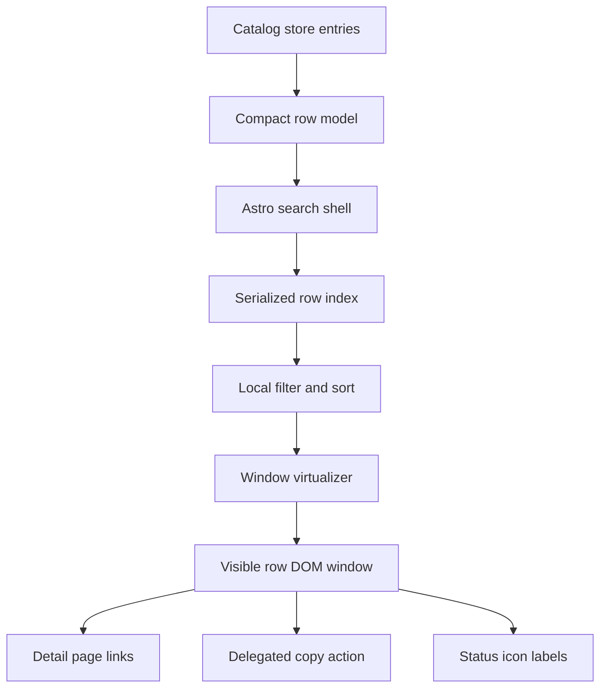
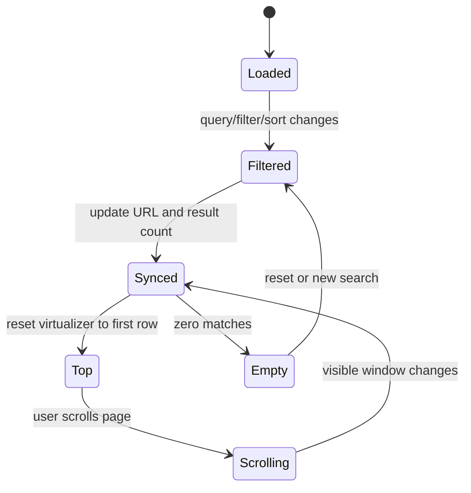

# feat: Virtualize catalog search results

## Summary

Replace the catalog search page's full-card result list with a dense, virtualized, table-like results surface. The page will keep local full-index search semantics and URL state while rendering only a bounded row window for large result sets.

---

## Problem Frame

The catalog search page currently renders every result as a full card and then hides, sorts, and reorders those DOM nodes in the browser. That creates too much DOM and too much per-filter mutation for a catalog that is expected to scale toward thousands of official and community entries.

The search page is also carrying detail-page work. Dense rows should help users scan, copy, and open detail pages quickly, while full warnings, source metadata, and `CAPLET.md` inspection stay on the detail route.

---

## Requirements

**Dense Results**

- R1. The search page renders dense table-like rows with title, official or community status, install count, truncated description, truncated install command, copy action, and compact status icons.
- R2. Full warning explanations and complete `CAPLET.md` inspection remain on the detail page.
- R3. Rows expose a detail route and a copyable install command without recreating the old full-card layout.

**Virtualized Search Behavior**

- R4. Search, filters, sort, counts, and URL state operate against the complete compact local index.
- R5. The visible DOM row count remains bounded when the catalog contains 10,000 entries.
- R6. Search, filter, and sort changes reset the virtualized window to the top while preserving focus in the active control.
- R7. Page scrolling remains the primary scroll model; the implementation must not introduce a nested result scroll panel.

**Toolbar, Status, And Accessibility**

- R8. Search input, filters, sort, result count, and status legend live in a compact sticky toolbar.
- R9. Local control, setup, Project Binding, Vault, readiness, and community status are represented by Huge Icons with a compact legend and accessible labels or tooltips.
- R10. Copy buttons, row links, filters, sort controls, status explanations, no-results state, and result-count updates are keyboard and screen-reader accessible.
- R11. The dense surface remains usable in light, dark, system theme, reduced-motion, desktop, tablet, and mobile contexts.

**Implementation Process**

- R12. Use a proven headless virtualizer rather than hand-rolling scroll measurement and overscan.
- R13. Use `$impeccable` during implementation for product-register shaping, density, responsive behavior, accessibility, status-icon comprehension, and browser polish.

---

## Key Technical Decisions

- KTD1. **Use a compact row model as the search data source.** The current DOM-derived search data must be replaced with serialized row records so filtering never depends on pre-rendering every result card.
- KTD2. **Use `@tanstack/virtual-core` for virtualization.** The package is headless TS/JS virtualization, so the Astro page can stay framework-light while the client script owns the visible result window.
- KTD3. **Use window/page virtualization.** The virtualizer should track the browser scroll position rather than a nested result container, preserving normal page scrolling and sticky-toolbar behavior.
- KTD4. **Render rows from client-side templates and event delegation.** Virtual rows are transient, so copy buttons, detail links, and status affordances need delegated handlers or rerender-safe binding rather than one-time listeners on initial DOM nodes.
- KTD5. **Build a table-like grid, not a literal table dependency.** Virtualization should render predictable row grids while borrowing Starwind table/button/badge styling vocabulary where it fits.
- KTD6. **Keep Impeccable as a required quality gate.** The requirements make `$impeccable` part of implementation, so the plan must reserve a polish unit for density, accessibility, responsive behavior, and browser inspection.
- KTD7. **Model Vault as a status vocabulary entry without inventing data.** The row status map should reserve a Vault-required status for catalog records that expose it later, but the UI must not show Vault status for entries that lack source data.

---

## High-Level Technical Design

The implementation should split the search page into a server-rendered shell, a serialized compact row index, and a client-side virtual row renderer.

Search-state changes should flow through one state owner so URL state, result count, empty state, focus, and virtualizer scroll position stay synchronized.

---

## Implementation Units

### U1. Add the compact row model

- **Goal:** Create a row-level data shape that contains only the fields the search page needs for filtering, rendering, status icons, copy, and detail routing.
- **Requirements:** R1, R2, R3, R4, R9
- **Dependencies:** None
- **Files:**
  - `apps/catalog/src/lib/search-filter.ts`
  - `apps/catalog/src/lib/search-row.ts`
  - `apps/catalog/test/search-filter.test.ts`
  - `apps/catalog/test/search-row.test.ts`
- **Approach:** Extend the search record shape from name/description/tags/trust/setup/count into a compact catalog row model. Include detail href, install command text and copyability, install-count display, warning/status codes, readiness fields, a reserved optional Vault-required status, and enough normalized search text to keep filtering independent from DOM attributes.
- **Patterns to follow:** `apps/catalog/src/lib/catalog-store.ts` already adapts core catalog entries into UI records; `apps/catalog/src/lib/search-filter.ts` already owns local filtering and sorting semantics.
- **Test scenarios:**
  - Covers AE1. Given a catalog entry with warnings, install command, and readiness metadata, building the row model returns the title, trust label, count display, truncated-render source fields, status codes, command text, and detail href.
  - Covers AE3. Given row records with punctuation variants such as `ast-grep` and `ast_grep`, filtering still matches normalized search terms across title, description, tags, and install command where intended.
  - Given a non-copyable install command, the row model marks copy unavailable while preserving the command preview text or unavailable reason for rendering.
  - Given a record with no Vault status source, the row model does not fabricate a Vault-required icon.
  - Given rows with equal rank scores, sorting remains deterministic by name.
- **Verification:** The row model can feed search/filter/sort tests without any rendered result DOM.

### U2. Reshape the search shell and sticky toolbar

- **Goal:** Replace the current card-list shell with a compact sticky toolbar and virtual-results host while preserving search controls and empty-state behavior.
- **Requirements:** R1, R3, R7, R8, R10, R11
- **Dependencies:** U1
- **Files:**
  - `apps/catalog/src/components/SearchShell.astro`
  - `apps/catalog/src/components/FilterBar.astro`
  - `apps/catalog/src/components/ResultList.astro`
  - `apps/catalog/src/components/CapletResult.astro`
  - `apps/catalog/src/styles/catalog.css`
  - `apps/catalog/test/virtual-results.test.ts`
- **Approach:** Make `SearchShell.astro` output the compact toolbar, a table-like row grid structure, a virtual row mount, serialized row data, status live region, and empty state. Retire or reduce `CapletResult.astro` from the search route so full warning cards no longer render for every result.
- **Patterns to follow:** Existing Starwind table styling vocabulary in `apps/catalog/src/components/starwind/table/` and the current filter control classes in `FilterBar.astro`.
- **Test scenarios:**
  - Covers AE1. Given rendered search shell markup, the result host contains row/table affordances and does not contain one full result article per entry.
  - Covers AE4. Given the shell markup, the toolbar controls and status legend are grouped in the sticky toolbar region.
  - Given the no-results state is present, it remains hidden by default and keeps the reset action available for the client script.
  - Given the search shell is rendered for mobile width constraints, controls have accessible names and usable touch-target class structure.
- **Verification:** The search page source no longer pre-renders full result cards as the primary results surface.

### U3. Implement window-based virtual rendering

- **Goal:** Add a client-side renderer that filters the compact index, drives a headless virtualizer, and renders only the visible result rows plus overscan.
- **Requirements:** R4, R5, R6, R7, R10, R12
- **Dependencies:** U1, U2
- **Files:**
  - `apps/catalog/package.json`
  - `pnpm-lock.yaml`
  - `apps/catalog/src/scripts/search.ts`
  - `apps/catalog/src/scripts/virtual-results.ts`
  - `apps/catalog/test/virtual-results.test.ts`
  - `apps/catalog/vitest.config.ts`
- **Approach:** Add `@tanstack/virtual-core` and use its headless virtualizer against the window scroll model. The renderer should maintain filtered row IDs, result count, empty state, virtual padding or transform positioning, and scroll-to-top behavior when query state changes.
- **Execution note:** Add characterization coverage around current search-filter semantics before replacing DOM hiding/reordering.
- **Patterns to follow:** Keep the existing `search.ts` as the entry point for search-page behavior, but move virtual-row-specific code into a testable module. If DOM testing needs a browser-like environment, add a small Vitest DOM environment dependency rather than a full end-to-end framework.
- **Test scenarios:**
  - Covers AE2. Given 10,000 generated row records, initial render creates only a bounded visible row count plus overscan.
  - Covers AE2. Given a simulated scroll near the middle of a 10,000-row set, the rendered row count remains bounded and the visible IDs update.
  - Covers AE3. Given a query change from many matches to one match, the result count updates, the virtualizer resets to the first row, and focus remains on the active input.
  - Covers AE3. Given initial URL parameters for query, filters, tag, or sort, the search state hydrates from the URL before the first virtual render.
  - Covers AE3. Given browser back or forward navigation changes query state, the controls, count, and rendered window update together.
  - Covers AE4. Given the virtualized list initializes, it uses window/page scroll configuration rather than an internal scroll panel.
  - Given zero matches, the empty state is shown and no stale virtual rows remain mounted.
- **Verification:** A mocked 10,000-entry dataset proves bounded DOM row rendering under initial render, scroll, filter, and sort updates.

### U4. Add dense row interactions and status icon semantics

- **Goal:** Render dense rows with copyable truncated install commands, accessible detail links, status icons, legend, and tooltip or label behavior.
- **Requirements:** R1, R2, R3, R9, R10, R11
- **Dependencies:** U1, U2, U3
- **Files:**
  - `apps/catalog/src/components/HugeIcon.astro`
  - `apps/catalog/src/scripts/copy.ts`
  - `apps/catalog/src/scripts/virtual-results.ts`
  - `apps/catalog/src/lib/search-row.ts`
  - `apps/catalog/src/styles/catalog.css`
  - `apps/catalog/test/search-row.test.ts`
  - `apps/catalog/test/virtual-results.test.ts`
- **Approach:** Define a stable status-code-to-icon map using Huge Icons and render icon-only row indicators with accessible names. Use delegated copy handling because row nodes are created and destroyed by virtualization, and keep the full command in data for copy while visually truncating it in the row.
- **Patterns to follow:** `InstallCommand.astro` and `SafetyNotice.astro` already define command and warning semantics; `HugeIcon.astro` is the existing icon wrapper; `copy.ts` already owns user-facing copy announcements.
- **Test scenarios:**
  - Covers AE5. Given a long install command, the rendered row truncates the visible command while the copy button writes the full command and announces success.
  - Covers AE5. Given a non-copyable command, the copy control is disabled or absent with an accessible unavailable state.
  - Covers AE6. Given rows with local-control, setup, Project Binding, Vault, and readiness status codes, each icon has an accessible label and appears in the legend.
  - Covers AE7. Given a focused copy button or detail link, a virtual row refresh does not leave focus trapped on a removed node without a recovery target.
  - Given a clipboard failure, the existing copy-status region announces a failure message.
- **Verification:** Row interactions keep working after virtual rows are recycled.

### U5. Polish responsive layout, themes, and Impeccable review path

- **Goal:** Bring the dense result surface up to the Caplets product-register quality bar across viewport sizes, themes, reduced motion, and browser inspection.
- **Requirements:** R8, R9, R10, R11, R13
- **Dependencies:** U2, U3, U4
- **Files:**
  - `apps/catalog/src/styles/catalog.css`
  - `apps/catalog/src/styles/starwind.css`
  - `apps/catalog/src/components/SearchShell.astro`
  - `apps/catalog/src/components/ResultList.astro`
  - `apps/catalog/src/scripts/virtual-results.ts`
- **Approach:** Use `$impeccable` during implementation with the catalog product context. Tune density, sticky-toolbar height, row grid columns, status legend placement, mobile stacking, visible focus, contrast, and reduced-motion behavior without introducing decorative cards or custom scrollbars.
- **Patterns to follow:** `PRODUCT.md`, `DESIGN.md`, `apps/catalog/src/styles/starwind.css`, and the product-register guidance from `$impeccable`.
- **Test scenarios:**
  - Covers AE4. In browser inspection, the sticky toolbar remains visible during page scroll and does not consume excessive viewport height.
  - Covers AE6. In browser inspection, status icons are understandable through legend and hover or keyboard labels.
  - Covers AE8. In browser inspection, light, dark, and system theme states keep row text, focus rings, icons, and command previews readable.
  - Covers AE8. With reduced motion enabled, row and tooltip transitions do not rely on motion to communicate state.
  - On a mobile viewport, rows stack predictably and copy/detail controls remain usable.
- **Verification:** Impeccable review and browser inspection confirm the result surface feels like a precise developer-tool table rather than a card grid.

### U6. Add performance-oriented catalog fixtures and verification hooks

- **Goal:** Make the 10,000-entry acceptance bar repeatable without requiring production catalog data at that scale.
- **Requirements:** R5, R6, R10, R12
- **Dependencies:** U1, U3, U4
- **Files:**
  - `apps/catalog/test/fixtures/catalog-search-rows.ts`
  - `apps/catalog/test/virtual-results.test.ts`
  - `apps/catalog/test/search-row.test.ts`
  - `apps/catalog/src/scripts/virtual-results.ts`
- **Approach:** Add deterministic row factories for large catalog sets and use them in virtual-renderer tests. Keep fixtures compact so they validate row count, filtering, scroll-window changes, copyability, and status variance without embedding full `CAPLET.md` content.
- **Patterns to follow:** Existing catalog tests use small, explicit fixtures in `apps/catalog/test/search-filter.test.ts`; extend that style with deterministic generator helpers for scale tests.
- **Test scenarios:**
  - Covers AE2. A generated 10,000-row fixture keeps rendered row count bounded before and after scroll.
  - Covers AE3. Filtering the generated fixture to one match updates count and resets the visible row window.
  - Covers AE6. Generated status variants cover every icon represented in the legend.
  - Given repeated renders against a generated fixture, the renderer does not duplicate row nodes or leave stale rows after sort changes.
- **Verification:** The catalog app has a repeatable local test path for the performance acceptance criteria before browser smoke testing.

---

## Scope Boundaries

- Server-side search, remote result paging, and API-backed infinite loading remain out of scope.
- Detail-page redesign remains out of scope beyond preserving it as the inspection destination.
- Full warning explanations in search rows remain out of scope; rows show status icons and accessible labels only.
- Exact timing budgets remain out of scope; acceptance is behavioral: bounded DOM, responsive controls, stable scrolling, and working interactions with 10,000 mocked entries.
- A full end-to-end browser test framework is not required for this hardening pass unless implementation reveals Vitest DOM tests cannot cover the virtualizer contract.

---

## Risks & Dependencies

- **Virtualizer and Astro integration:** `@tanstack/virtual-core` is headless and should fit the current framework-light catalog app, but implementation must verify window scroll measurement under Astro's script bundling and Cloudflare build path.
- **Accessibility under virtualization:** Virtual rows can be removed while interactive descendants are focused. The renderer must preserve focus intentionally when filters, sorts, or scroll windows change.
- **Sticky toolbar height:** A sticky toolbar that includes search, filters, result count, and legend can crowd mobile screens. Impeccable polish should treat compactness as a blocking quality concern.
- **Event binding drift:** Existing copy behavior attaches to initial DOM buttons. Virtual rows require delegated or rerender-safe binding so copied commands keep working as rows recycle.
- **Test environment fidelity:** Vitest DOM tests can prove bounded rendering and state transitions, but final visual behavior still needs browser inspection because sticky positioning, tooltips, and theme contrast are layout-dependent.

---

## Documentation / Operational Notes

- No public docs change is required for the search-page hardening itself.
- If a new dependency is added, keep it scoped to `apps/catalog/package.json` and let the app's build/typecheck path validate bundling.
- The implementation should not create a changeset unless package behavior or published package dependencies change outside the private catalog app.

---

## Sources / Research

- `docs/brainstorms/2026-06-27-catalog-search-virtualized-results-requirements.md` for origin requirements.
- `docs/brainstorms/2026-06-26-caplets-catalog-search-site-requirements.md` for broader catalog-site boundaries.
- `apps/catalog/src/components/SearchShell.astro` for the current search shell and filter/result composition.
- `apps/catalog/src/components/ResultList.astro` and `apps/catalog/src/components/CapletResult.astro` for the current all-results full-card rendering path.
- `apps/catalog/src/scripts/search.ts` for the current DOM-derived filtering and reordering behavior.
- `apps/catalog/src/lib/search-filter.ts` and `apps/catalog/test/search-filter.test.ts` for existing local search semantics.
- `apps/catalog/src/components/starwind/table/` for Starwind table styling vocabulary already available in the catalog app.
- `PRODUCT.md` and `DESIGN.md` for Caplets product-register design context.
- `@tanstack/virtual-core` npm metadata: version `3.17.2`, described as headless TS/JS virtualization with homepage `https://tanstack.com/virtual`.
