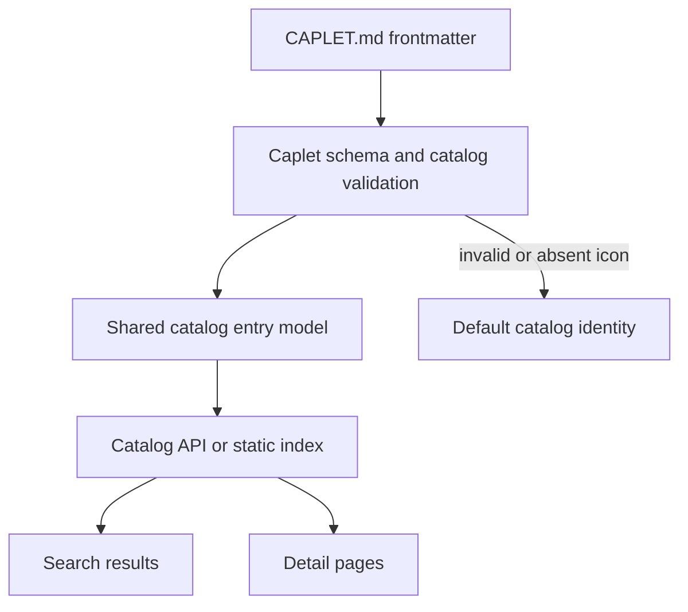
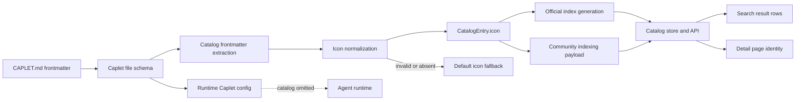

# Caplet Catalog Icon Metadata - Plan

## Goal Capsule

- **Objective:** Add optional Caplet catalog presentation metadata starting with `catalog.icon`, so catalog pages can show useful Caplet icons without expanding the catalog metadata surface beyond the first proven need.
- **Product authority:** Caplets remains a Code Mode-first capability catalog; icon metadata improves recognition and scanability but does not change install trust, safety status, ranking, or runtime behavior.
- **Open blockers:** None before planning.

---

## Product Contract

### Summary

Caplet files should be able to declare an optional `catalog.icon` value for catalog presentation. The icon may be an HTTPS URL or a bundled asset path relative to the Caplet directory, and catalog consumers should render a safe fallback when the icon is absent, invalid, unavailable, or unsafe.

### Problem Frame

The Catalog Search Site currently relies on text, status pills, warnings, and install counts to distinguish Caplets. As the official catalog grows and community indexing becomes more important, recognizable icons will help users scan results and detail pages faster.

An earlier catalog plan avoided a general `catalog` property to prevent speculative metadata churn. This feature deliberately reopens that decision for a narrow presentation-only field because icons have become a concrete catalog UI need.

### Key Decisions

- **Add a narrow `catalog` block.** The first version introduces only `catalog.icon`, keeping broader catalog metadata deferred until there is evidence for each field.
- **Support URL and bundled icons.** HTTPS URLs make community Caplets easy to brand, while relative bundled paths let official Caplets ship stable checked-in assets.
- **Treat icons as presentation, not trust.** Icons must never imply verification, safety, endorsement, source identity, or install readiness.
- **Fail soft.** Invalid, missing, blocked, or unrenderable icons should fall back to the existing default catalog presentation rather than blocking Caplet parsing or catalog browsing.

### Requirements

**Caplet authoring**

- R1. Caplet frontmatter may include an optional `catalog` object with an optional `icon` string.
- R2. `catalog.icon` accepts either an HTTPS URL or a bundled asset path relative to the Caplet directory.
- R3. `catalog.icon` must reject absolute local paths, path traversal, non-HTTPS remote URLs, credential-bearing URLs, fragments that carry unsafe script behavior, and empty values.
- R4. A bundled icon path must resolve within the Caplet source package that owns the declaring Caplet.
- R5. Caplet runtime behavior must not depend on `catalog` metadata.

**Catalog model and indexing**

- R6. Official catalog generation should preserve safe `catalog.icon` metadata in the generated catalog entry model.
- R7. Community catalog indexing should preserve safe `catalog.icon` metadata when the source is eligible for public indexing.
- R8. Catalog indexing must not fetch or publish private local paths, credential-bearing URLs, private hosts, or non-public bundled assets.
- R9. Catalog API and static read models should expose icon metadata in the same shared catalog entry shape used by the site.
- R10. Invalid icon metadata should be omitted or normalized to an explicit absent state rather than making the whole Caplet unindexable.

**Catalog site behavior**

- R11. Search result rows should render the Caplet icon when safe icon metadata is available.
- R12. Detail pages should render the Caplet icon near the Caplet identity area when safe icon metadata is available.
- R13. When icon metadata is missing or unusable, the site should use the existing default identity treatment.
- R14. Icon rendering must include accessible names or hidden decorative semantics appropriate to the surrounding text so screen readers do not hear duplicate or misleading labels.
- R15. Icons must not replace official/community status, warning icons, readiness indicators, source labels, or install-count signals.

**Docs and catalog authoring guidance**

- R16. Caplet file reference docs should document `catalog.icon`, accepted value shapes, and safety constraints.
- R17. The `writing-caplets` skill should explain that `catalog.icon` is optional presentation metadata and should not be used for trust or setup guidance.
- R18. Existing official catalog Caplets should get real web icon metadata where a clear, license-safe, provider-appropriate icon URL is available.
- R19. Official catalog Caplets without a clear icon choice may keep the fallback identity treatment rather than blocking the feature.



### Acceptance Examples

- AE1. **Covers R1, R2, R6, R11.** Given an official Caplet declares `catalog.icon` as a relative bundled path, when the official catalog index is generated and rendered, then the search result can display that icon.
- AE2. **Covers R2, R7, R9, R12.** Given a community Caplet declares `catalog.icon` as an HTTPS URL, when the Caplet is publicly indexed, then the catalog entry exposes the safe URL for detail-page rendering.
- AE3. **Covers R3, R8, R10, R13.** Given a Caplet declares an absolute local icon path or a non-HTTPS icon URL, when the Caplet is parsed for catalog use, then the icon is omitted and the Caplet can still appear with the fallback identity.
- AE4. **Covers R5, R15.** Given a Caplet has an icon, when an agent installs or runs that Caplet, then the icon has no effect on runtime behavior, trust level, warnings, or install readiness.

### Success Criteria

- The generated Caplet schema accepts valid `catalog.icon` values and rejects unsafe ones.
- The official catalog index can carry icon metadata without absolute local paths or unsafe URLs.
- The catalog UI shows icons on search and detail pages without layout regressions, duplicate screen-reader labels, or weakened warning/status visibility.
- Existing Caplets without `catalog.icon` continue to parse, index, install, and render normally.

### Scope Boundaries

- Additional `catalog` fields beyond `icon` are deferred until there is a proven catalog need.
- Security scanning, semantic trust scoring, provider verification, and source certification are out of scope.
- Automatic favicon, logo, or brand discovery from provider websites is out of scope.
- Icon upload, resizing pipelines, image proxying, and moderation workflows are out of scope unless planning finds them necessary for safe first-version rendering.
- Requiring every official Caplet to declare an icon is out of scope for the first implementation; the first pass should add real web icons to existing Caplets where the choice is clear and safe.

### Dependencies / Assumptions

- The existing public catalog warning and trust model remains authoritative.
- Catalog rendering can safely show either remote HTTPS image URLs or bundled relative assets with fallback behavior.
- Community indexing remains public-source-only and must not broaden privacy boundaries to support icons.

### Sources / Research

- `STRATEGY.md` frames Caplets as a Code Mode-first capability layer, so icons should support recognition without changing capability semantics.
- `CONCEPTS.md` defines the Catalog Search Site and Catalog-Grade Caplets as public discovery surfaces where metadata must remain reviewable and safety-conscious.
- `docs/plans/2026-06-26-002-feat-caplets-catalog-search-site-plan.md` previously deferred a `catalog` property in v1; this plan supersedes that only for the narrow `catalog.icon` presentation field.
- `packages/core/src/caplet-files-bundle.ts` currently owns strict Caplet frontmatter validation.
- `packages/core/src/catalog/types.ts` and `packages/core/src/catalog/entry.ts` currently define the shared catalog entry model.
- `scripts/generate-catalog-index.ts` currently generates the official catalog read model from checked-in Caplets.

---

## Planning Contract

### Product Contract Preservation

Product Contract unchanged. The implementation plan below expands execution detail only; it does not add new user-facing scope, broaden the `catalog` object beyond `icon`, or change the trust/runtime boundaries in the Product Contract.

### High-Level Design

`catalog.icon` should be parsed as Caplet file frontmatter, normalized by catalog-specific helpers, and carried through the shared catalog entry model to the catalog API and UI. It should not become a runtime backend field and should not appear in normalized server config produced for agents.



### Key Technical Decisions

- **KTD1. Frontmatter-only metadata.** `catalog` belongs to the Markdown Caplet file schema and catalog extraction layer, not normalized runtime server config. `capletToServerConfig` must continue omitting presentation metadata.
- **KTD2. Shared catalog icon normalization.** Implement one catalog helper/type for safe icon normalization and reuse it from official generation, community indexing, and tests. Avoid duplicating URL/path validation in UI code.
- **KTD3. Safe renderable references only.** URL icons must be HTTPS, credential-free, and script-inert. Bundled icons must be relative to the declaring Caplet directory, must not traverse upward, and must be represented in the public catalog without leaking local absolute paths.
- **KTD4. Fail soft after schema admission.** Unsafe icon values should be omitted from catalog entries where possible and should never make the entire catalog row disappear. Schema validation may reject clearly invalid authoring values, but catalog indexing should still be resilient to older or malformed community input.
- **KTD5. Keep identity separate from status.** Icons are decorative recognition cues. Official/community trust, warnings, readiness, local-control status, auth status, setup status, and install counts remain explicit signals.
- **KTD6. Render both row paths consistently.** Search rows have server-rendered Astro markup and client virtualized rendering. Both paths must consume the same row icon fields and preserve fixed row heights.
- **KTD7. Do not build an image pipeline in v1.** Use safe references and fallback rendering. Do not add upload, resizing, proxying, moderation, favicon discovery, or brand lookup.
- **KTD8. Resolve bundled icons deterministically.** Official bundled icons should be copied or addressed through a deterministic catalog-owned static path during official index generation. Community bundled icons should resolve only when the catalog entry has enough public source coordinates to build a public raw-source URL; otherwise omit the icon.
- **KTD9. Render remote icons with privacy controls.** Remote HTTPS icons may expose visitor requests to the icon host, so catalog UI should render them with `referrerpolicy="no-referrer"`, lazy loading where appropriate, and the existing restrictive image CSP.

### Sequencing

Implement from the core schema/model outward, then wire catalog generation/indexing, then update UI renderers and docs. This keeps the generated catalog and API shape stable before visual work depends on it.

---

## Implementation Units

### U1. Add Caplet File Schema Support

**Intent:** Allow authors to declare `catalog.icon` while keeping catalog metadata out of runtime config.

**Requirements covered:** R1, R2, R3, R4, R5, R16

**Files likely touched:**

- `packages/core/src/caplet-files-bundle.ts`
- `packages/core/src/config.ts` only if type plumbing requires it; avoid adding runtime config fields
- `schemas/caplet.schema.json`
- `apps/landing/public/caplet.schema.json`
- `apps/docs/src/content/docs/reference/caplet-files.mdx`
- `scripts/generate-docs-reference.ts`
- `packages/core/test/caplet-files.test.ts` or nearest existing Caplet file schema test

**Implementation notes:**

- Add a strict optional `catalog` object with optional `icon`.
- Validate `catalog.icon` as a non-empty string matching either safe HTTPS URL syntax or safe relative bundled path syntax.
- Reject absolute local paths, upward traversal, non-HTTPS URLs, userinfo-bearing URLs, and values that are not renderable image references.
- Confirm parsed runtime backend configs do not contain `catalog`.
- Regenerate schema and docs from source rather than hand-editing generated artifacts.

**Test scenarios:**

- A Caplet with `catalog.icon: ./icon.svg` parses.
- A Caplet with `catalog.icon: https://example.com/icon.svg` parses.
- A Caplet with `catalog.icon: http://example.com/icon.svg`, `/tmp/icon.svg`, `../icon.svg`, or an empty string fails authoring validation.
- A parsed runtime server config does not expose `catalog`.

### U2. Add Shared Catalog Icon Model and Normalization

**Intent:** Carry safe icon metadata through the catalog entry shape with one normalization path.

**Requirements covered:** R6, R7, R8, R9, R10, R13

**Files likely touched:**

- `packages/core/src/catalog/types.ts`
- `packages/core/src/catalog/entry.ts`
- `packages/core/src/catalog/caplet-markdown.ts`
- `packages/core/test/catalog-model.test.ts`

**Implementation notes:**

- Add a compact `CatalogIcon` shape to the shared catalog model, for example a discriminated union for `url` and `bundled` sources.
- Keep the public value explicit enough for the catalog site to render without re-parsing CAPLET.md.
- Normalize from raw frontmatter in catalog-specific code. Invalid or unsafe values should return `undefined`.
- For bundled paths, store a source-relative/catalog-renderable reference only; never store local absolute filesystem paths.
- Include enough source coordinates for bundled icons to be resolved later without re-reading the local checkout.
- Keep `createCatalogEntry` deterministic by including the normalized icon input directly and avoiding filesystem reads from entry construction.

**Test scenarios:**

- `createCatalogEntry` preserves a normalized HTTPS icon.
- `createCatalogEntry` preserves a normalized bundled icon reference without absolute paths.
- Invalid icon metadata is omitted while the rest of the entry is still created.
- Existing catalog entry snapshots or shape tests remain stable except for the optional icon field.

### U3. Wire Official and Community Catalog Indexing

**Intent:** Ensure both checked-in catalog Caplets and install-indexed community Caplets can publish safe icon metadata.

**Requirements covered:** R6, R7, R8, R9, R10, AE1, AE2, AE3

**Files likely touched:**

- `scripts/generate-catalog-index.ts`
- `apps/catalog/src/data/official-catalog.json`
- `packages/core/src/cli/install.ts`
- `packages/core/src/catalog-indexing/payload.ts`
- `packages/core/src/catalog-indexing/eligibility.ts` if payload eligibility needs explicit icon treatment
- `packages/core/test/catalog-official-index.test.ts`
- `packages/core/test/catalog-indexing.test.ts`

**Implementation notes:**

- Official generation should read `catalog.icon` from CAPLET.md frontmatter and pass normalized icon metadata into `createCatalogEntry`.
- Community install indexing should do the same from the installed Caplet source used to submit public catalog metadata.
- Ensure the public payload includes icon metadata only after the same normalization rules as official generation.
- For official bundled icons, copy the referenced asset into a deterministic catalog-owned public asset path or otherwise produce a deterministic catalog-owned URL during generation.
- For community bundled icons, resolve to a public raw-source URL only when source repo, source path, and revision/provenance make the asset publicly addressable; omit otherwise.
- Update the existing official-index test whose name currently implies catalog metadata is absent.
- Keep privacy boundaries intact: no absolute local paths, private filesystem paths, or private source material in generated JSON or submitted payloads.

**Test scenarios:**

- An official Caplet with a bundled icon produces an official catalog entry with a renderable safe icon reference.
- A community Caplet with an HTTPS icon produces a submitted catalog entry with that icon.
- A community Caplet with a local absolute icon path still submits/indexes without icon metadata.
- Generated official catalog JSON does not contain the checkout root or private absolute paths.

### U4. Render Icons in Catalog Search and Detail UI

**Intent:** Display icons as compact identity cues without disrupting the dense table-like catalog layout.

**Requirements covered:** R11, R12, R13, R14, R15

**Files likely touched:**

- `apps/catalog/src/lib/search-row.ts`
- `apps/catalog/src/components/ResultList.astro`
- `apps/catalog/src/scripts/virtual-results.ts`
- `apps/catalog/src/components/CapletDetail.astro`
- `apps/catalog/src/styles/catalog.css`
- `apps/catalog/test/search-row.test.ts`
- `apps/catalog/test/virtual-results.test.ts`
- `apps/catalog/test/catalog-api.test.ts` if API shape assertions exist there

**Implementation notes:**

- Add row-level icon data in the row adapter rather than having Astro and virtualized renderers inspect raw catalog entries differently.
- Render a fixed-size icon slot in the Caplet identity column so row height stays stable.
- Use the existing default identity treatment when icon metadata is missing, invalid, or fails to load.
- Icons should be decorative when adjacent text already names the Caplet; otherwise use a concise accessible label.
- Render remote icon images with `referrerpolicy="no-referrer"`, `loading="lazy"` outside first-viewport identity slots, and dimensions that prevent layout shift.
- Preserve row click, command copy, virtual list height estimation, and mobile density behavior.

**Test scenarios:**

- Search row adapter returns icon metadata for entries that include it.
- Server-rendered result rows include an icon slot when icon data exists.
- Virtualized rows render the same icon/fallback markup as initial rows.
- Detail page header renders icon identity near the Caplet name.
- Missing icon metadata renders the fallback without changing row layout.

### U5. Add Official Catalog Icon Metadata

**Intent:** Add real web icon metadata to existing official Caplets where the icon choice is clear, while preserving fallback rendering for Caplets that should not yet declare one.

**Requirements covered:** R2, R4, R6, R18, R19, AE1

**Files likely touched:**

- Existing `caplets/*/CAPLET.md` files
- `apps/catalog/src/data/official-catalog.json`

**Implementation notes:**

- Add real web icon URLs across the existing official catalog where the source, license, and brand/provider fit are clear.
- Prefer stable HTTPS SVG URLs from license-safe icon sources such as Simple Icons where the service/project has direct coverage.
- Do not add icons that imply official provider endorsement beyond the existing catalog trust model.
- Leave Caplets on fallback identity when there is no obvious safe real icon; do not invent low-quality placeholder branding just to hit 100% coverage.

**Test scenarios:**

- Official Caplets with added web icons pass schema validation.
- Generated official catalog JSON includes icon references for Caplets that declare them.
- The catalog site can render added web icons and still renders fallback for Caplets without icons.

### U6. Update Authoring Guidance and Release Metadata

**Intent:** Teach authors when to use `catalog.icon` and record the public-facing schema/catalog change.

**Requirements covered:** R16, R17

**Files likely touched:**

- `skills/writing-caplets/SKILL.md`
- Generated Caplet file reference docs from U1
- `.changeset/*.md`

**Implementation notes:**

- Update `writing-caplets` to describe `catalog.icon` as optional catalog presentation metadata only.
- Include guidance that the CAPLET.md body remains agent-facing operational guidance, not installer marketing copy.
- Add a changeset because this changes the public Caplet file schema and catalog UI/API output.

**Test scenarios:**

- Docs generation stays clean.
- The skill does not suggest using icons for trust, safety, setup, or runtime behavior.

---

## Verification Contract

Run focused checks while implementing the units, then the full repo gate before the work is ready to ship.

### Generated Artifacts

```bash
pnpm schema:generate
pnpm schema:check
pnpm docs:generate
pnpm docs:check
pnpm catalog:generate
pnpm catalog:generate --check
```

### Focused Tests

```bash
pnpm --filter @caplets/core test -- test/caplet-files.test.ts test/catalog-model.test.ts test/catalog-official-index.test.ts test/catalog-indexing.test.ts
pnpm --filter @caplets/catalog test -- test/search-row.test.ts test/catalog-api.test.ts test/virtual-results.test.ts
pnpm --filter @caplets/catalog build
```

If the named test files differ from the current repo layout, use the nearest focused tests that cover the same behavior before running the full gate.

### Final Gate

```bash
pnpm format:check
pnpm verify
```

### Browser/Visual Check

After implementation, run the catalog site locally and inspect:

- Search results with a web-hosted official Caplet icon.
- Search results across several existing official Caplets with web icons.
- Search results without icon metadata.
- A detail page with an icon.
- Light, dark, and system themes.
- Desktop and mobile-width layouts.

Confirm icon slots do not increase virtual row height unexpectedly and do not hide status icons, install counts, warning indicators, or copy-command affordances.

---

## Definition of Done

- `catalog.icon` is accepted in Caplet frontmatter for safe HTTPS URLs and safe bundled relative paths.
- Unsafe icon values are rejected or omitted according to the layer handling them, without breaking unrelated catalog indexing.
- Runtime Caplet server config and agent behavior do not include or depend on `catalog` metadata.
- Official catalog generation and community install-indexing both preserve safe icon metadata in the shared catalog entry shape.
- Generated catalog JSON and indexing payloads do not leak local absolute paths or private filesystem locations.
- Bundled official icons render through deterministic catalog-owned public URLs, and community bundled icons are omitted unless they can be resolved through public source coordinates.
- Remote HTTPS icon rendering does not send page referrers to icon hosts.
- Catalog search rows and detail pages render icons with stable layout, accessible semantics, and fallback behavior.
- Existing official Caplets have real web icon metadata where there is a clear, license-safe icon choice, and unresolved cases intentionally use the fallback.
- Existing status, warning, trust, readiness, ranking, and install-count signals remain separate and visible.
- Authoring docs and `skills/writing-caplets/SKILL.md` explain `catalog.icon` as optional presentation metadata.
- Generated schema, docs, and official catalog artifacts are updated from source commands.
- A changeset records the public schema/catalog change.
- Focused tests, catalog build, generated-file checks, formatting check, and `pnpm verify` pass.
