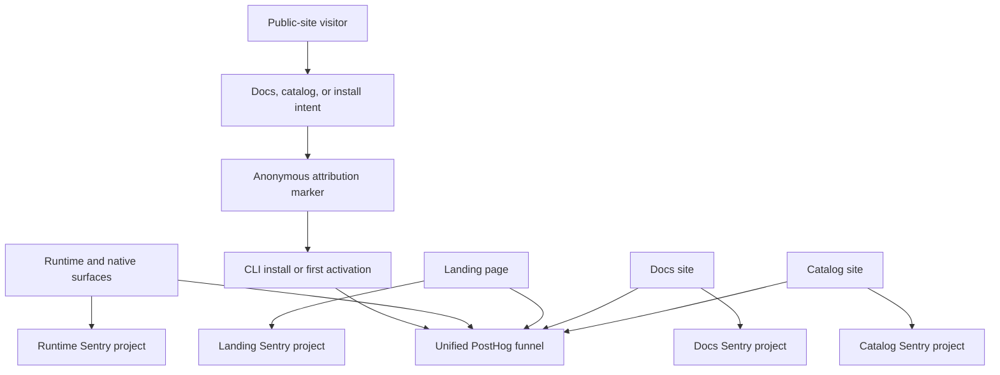
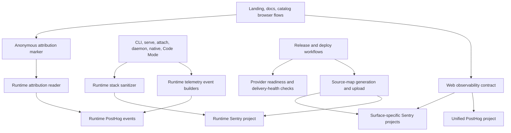
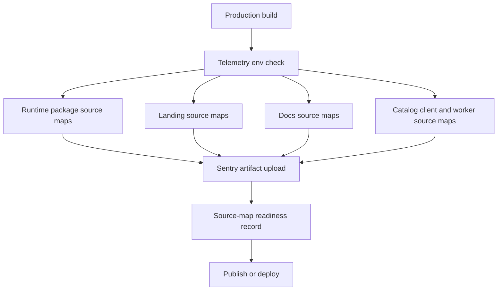

# Telemetry Observability Loop - Plan

## Goal Capsule

- **Objective:** Make Caplets telemetry decision-grade and error reporting debuggable across runtime surfaces, the landing page, the docs site, and the catalog site.
- **Product authority:** Caplets keeps anonymous telemetry as the default trust boundary: PostHog answers product usage questions, Sentry answers reliability questions, and public catalog indexing remains a separate public-source signal.
- **Release prerequisites:** Provider project ownership, Sentry source-map upload credentials, retention settings, and saved-readout ownership must be confirmed before release.

---

## Product Contract

### Summary

Caplets should ship a full observability loop that connects public-site intent to first CLI activation anonymously, makes PostHog usage data readable, and makes Sentry errors diagnosable through source-mapped stacks. The loop covers CLI/runtime/native telemetry plus landing, docs, and catalog analytics without introducing known-user tracking or session replay.

### Problem Frame

The first anonymous telemetry pass protected user trust, but the resulting provider data is too hard to interpret for product decisions. Aggregate usage statistics are cryptic, and provider-readiness gaps can make missing events look like missing usage.

Sentry reliability events currently group failures categorically, but the lack of source-map-backed stack traces prevents maintainers from debugging many errors from provider traces alone. Public Caplets surfaces are also missing first-party analytics and browser reliability reporting, so the path from site interest to installed usage is invisible.

### Key Decisions

- **Keep default telemetry anonymous.** Improve correlation and readability without collecting names, emails, raw paths, hostnames, Caplet IDs, tool payloads, credentials, or known-user identities.
- **Optimize the conversion funnel first.** The first PostHog readout should answer how landing, docs, and catalog intent turns into first successful CLI or Caplet activation.
- **Use one PostHog project.** A unified analytics project preserves the funnel across public sites and runtime events.
- **Split Sentry by surface.** Runtime, landing, docs, and catalog errors should have separate ownership, releases, source maps, and noise boundaries.
- **Use anonymous install attribution.** Public-site install intent may create a short nonsecret attribution marker that the CLI can report categorically on activation.
- **Collect enhanced site analytics, not replay.** Search, filter, navigation, scroll, and intent events are in scope; session replay is deferred.
- **Split stack privacy by surface.** Browser/public-site errors may include full source-mapped browser stacks, while CLI, native, daemon, and Code Mode errors use richer redacted runtime stacks.

### Actors

- A1. **Maintainer.** Reviews PostHog and Sentry to decide what to improve and what to fix.
- A2. **Prospective user.** Visits the landing page, docs, or catalog before trying Caplets.
- A3. **Installing user.** Copies or runs an install command and may later trigger first activation telemetry.
- A4. **Runtime user.** Uses Caplets through CLI, MCP serving, remote attach, daemon, Code Mode, or native integrations.
- A5. **Public site visitor.** Uses landing, docs, or catalog navigation and search without signing in.
- A6. **Provider operator.** Owns PostHog and Sentry project configuration, retention, source-map upload credentials, and saved readouts.

### Requirements

**Privacy and control boundary**

- R1. The existing telemetry disable controls must continue to disable both PostHog and Sentry collection for runtime telemetry.
- R2. Default telemetry must remain anonymous and must not collect names, emails, raw config, prompts, Code Mode source, tool arguments, tool outputs, local paths, hostnames, URLs, Caplet IDs, credentials, tokens, raw environment variables, or known-user identifiers.
- R3. Public-site analytics must avoid known-user identification and must not carry browser visitor identifiers into CLI or runtime telemetry.
- R4. Catalog public indexing must remain separate from anonymous telemetry because it intentionally publishes public source identity and Caplet identity.
- R5. Any attribution marker passed from a public site to CLI activation must be short, nonsecret, categorical, and safe to expose in command text or logs.

**PostHog product analytics**

- R6. Caplets must use one unified PostHog project for public-site and runtime product analytics so funnel reporting can cross surface boundaries.
- R7. The primary PostHog readout must show the anonymous conversion funnel from public-site visit, to docs or catalog intent, to install-copy or install-run attribution, to first successful CLI or Caplet activation.
- R8. Runtime PostHog events must use readable event names and categorical dimensions that let maintainers understand surface, runtime mode, execution context, operation family, outcome, backend family, exposure mode, and Code Mode outcome.
- R9. Landing, docs, and catalog pages must emit pageview and intent events with route family, referrer category, section category, navigation path category, outbound action category, and install-intent category.
- R10. Catalog analytics must include search terms, filter choices, result interaction category, detail-page views, install-copy actions, and empty or no-result states.
- R11. Docs analytics must include page family, navigation path category, search or in-page intent where available, and install-related actions.
- R12. Landing analytics must include campaign/referrer category, CTA category, docs/catalog link intent, and install-related actions.
- R13. Public-site analytics must use bucketed or categorical values for scroll depth, time-on-page, and repeated intent rather than raw behavioral transcripts.
- R14. Session replay, heatmaps, and raw DOM capture are out of scope for this pass.

**Sentry reliability and source maps**

- R15. Caplets must split Sentry reporting by surface so runtime, landing, docs, and catalog errors can use separate projects, releases, source maps, ownership, and alert rules.
- R16. Browser/public-site Sentry events may include full browser stacks, including framework and dependency frames, but must exclude request bodies, user context, credentials, analytics identifiers, and arbitrary payloads.
- R17. CLI, native, daemon, MCP, remote attach, and Code Mode Sentry events may include richer runtime stacks only after redacting local paths, URLs, hostnames, credentials, token-shaped strings, raw arguments, tool payloads, Code Mode source, and output content.
- R18. Sentry events must preserve meaningful grouping with release, surface, runtime mode, command or route family, error category, and diagnostic category.
- R19. Release builds for runtime packages and public sites must have a source-map upload or verification gate before those releases are treated as observability-ready.
- R20. Missing source maps must be visible as a release-readiness failure rather than discovered only after production errors arrive.

**Readouts and operations**

- R21. Provider readiness documentation must record the active PostHog project, Sentry projects, intake identifiers, source-map upload ownership, retention, scrubbing, ingestion monitoring, and revocation procedure.
- R22. Saved PostHog readouts must map to the conversion funnel, runtime adoption, Code Mode outcomes, catalog search behavior, docs usage, and site install intent.
- R23. Saved Sentry readouts must map to top runtime failures, top browser failures by site, source-map health, release regressions, and unresolved issue ownership.
- R24. Delivery-health counters and provider-ingestion failures must be reviewed before maintainers interpret missing events as missing usage.
- R25. Provider failures must not block primary CLI, runtime, public-site, docs, or catalog workflows.

### Key Flows

- F1. Anonymous web-to-activation attribution
  - **Trigger:** A visitor copies or follows an install path from landing, docs, or catalog.
  - **Actors:** A2, A3, A6
  - **Steps:** The public site records the install-intent event, attaches a nonsecret categorical attribution marker to the install path, and the CLI reports that marker category on first successful activation when present.
  - **Outcome:** Maintainers can measure conversion from site intent to activation without identifying the visitor.
  - **Covered by:** R5, R7, R9, R10, R11, R12

- F2. Runtime error debugging
  - **Trigger:** A CLI, native, daemon, MCP, remote attach, or Code Mode surface emits a reliability error.
  - **Actors:** A1, A4, A6
  - **Steps:** Caplets sends a Sentry event with categorical tags, meaningful grouping, and redacted runtime stack context.
  - **Outcome:** Maintainers can debug failures without receiving raw paths, hostnames, tool payloads, credentials, or Code Mode source.
  - **Covered by:** R2, R15, R17, R18, R19, R20

- F3. Public-site error debugging
  - **Trigger:** Landing, docs, or catalog code throws in the browser or site runtime.
  - **Actors:** A1, A5, A6
  - **Steps:** The site sends the error to its surface-specific Sentry project with release data and source-mapped stack frames.
  - **Outcome:** Maintainers can identify the broken public-site release and code path without collecting user payloads or replay data.
  - **Covered by:** R15, R16, R18, R19, R20

- F4. Maintainer readout
  - **Trigger:** A maintainer reviews product usage or reliability after a release window.
  - **Actors:** A1, A6
  - **Steps:** The maintainer checks delivery health, then uses saved PostHog and Sentry readouts for funnel conversion, runtime adoption, site behavior, top errors, and source-map health.
  - **Outcome:** The readout supports product and reliability decisions rather than raw provider spelunking.
  - **Covered by:** R21, R22, R23, R24, R25

### Acceptance Examples

- AE1. **Covers R6, R7, R9, R10, R11, R12.** Given a visitor reaches the catalog from the landing page and copies an install command, when the CLI later reports first activation with the marker category, then PostHog can count that anonymous funnel without a user ID.
- AE2. **Covers R14.** Given public-site analytics are enabled, when a user searches the catalog and filters results, then PostHog receives search and filter categories but no session replay, DOM capture, or raw interaction transcript.
- AE3. **Covers R15, R16, R19, R20.** Given a catalog browser error occurs after a release, when Sentry receives the event, then it appears in the catalog Sentry project with source-mapped browser frames and a release that has passed source-map verification.
- AE4. **Covers R15, R17, R18.** Given a native runtime error includes dependency frames and local absolute paths in the raw stack, when Caplets reports it to Sentry, then the event preserves useful grouping and stack structure while removing local paths and unsafe values.
- AE5. **Covers R21, R22, R23, R24.** Given a release window shows low usage, when a maintainer checks the saved readouts, then delivery-health and provider-ingestion state are visible before the maintainer concludes that usage is low.
- AE6. **Covers R1, R2, R3, R4, R5.** Given telemetry is disabled for runtime telemetry, when a user runs Caplets, then runtime PostHog and Sentry events do not send; catalog public indexing remains governed by its separate public-source rules.

### Success Criteria

- Maintainers can answer the primary conversion question from public-site intent to first activation without carrying a browser identity into CLI telemetry.
- Maintainers can read useful runtime adoption and Code Mode outcome statistics without decoding cryptic event shapes.
- Browser and runtime Sentry issues contain enough stack and release context to identify the affected code path.
- Missing provider configuration, delivery failures, and missing source maps are visible before interpreting analytics.
- Landing, docs, and catalog analytics are available without session replay or known-user tracking.

### Scope Boundaries

- Session replay, heatmaps, raw DOM capture, and behavioral transcripts are deferred.
- Known-user analytics, account-based attribution, and carrying PostHog browser IDs into CLI are out of scope.
- Raw CLI/native/daemon/Code Mode dumps, raw tool payloads, raw Code Mode source, and unredacted local paths are out of scope.
- Automating provider project creation through PostHog or Sentry management APIs is out of scope unless planning finds it necessary for release safety.
- Catalog public indexing remains a separate public-source discovery mechanism, not part of anonymous telemetry.

### Dependencies / Assumptions

- PostHog and Sentry provider settings can be configured to satisfy the provider-readiness checklist before release.
- Sentry source-map upload credentials can be scoped to the relevant runtime and public-site projects.
- The public sites can include analytics and reliability reporting without changing their product shape or adding an account surface.
- The CLI activation path can accept and report a categorical attribution marker without treating it as a user identifier.
- Existing telemetry controls and delivery-health accounting remain the basis for runtime telemetry trust.

### Sources / Research

- `STRATEGY.md` identifies runtime diagnosability and public proof as Caplets product metrics.
- `CONCEPTS.md` defines Anonymous Telemetry as PostHog product usage plus Sentry sanitized reliability reporting under a strict privacy boundary.
- `docs/product/anonymous-telemetry.md` documents current user controls and the privacy promise.
- `docs/product/telemetry-readout.md` maps existing event families to product decision questions.
- `docs/product/telemetry-provider-readiness.md` records provider readiness as a release gate and still has TODO provider-operation fields.
- `docs/brainstorms/2026-06-26-caplets-catalog-search-site-requirements.md` separates catalog public indexing from anonymous telemetry.
- `packages/core/src/telemetry/events.ts` defines the current runtime telemetry event families and categorical fields.
- `packages/core/src/telemetry/providers.ts` and `packages/core/src/telemetry/privacy.ts` define the current provider adapters and Sentry stripping behavior.
- `apps/landing`, `apps/docs`, and `apps/catalog` are the current public site apps that need web analytics and reliability coverage.
- [Sentry JavaScript source maps](https://docs.sentry.io/platforms/javascript/sourcemaps/) documents Debug ID based source-map linking and the need to upload artifacts before production errors arrive.
- [Sentry Vite source-map upload](https://docs.sentry.io/platforms/javascript/sourcemaps/uploading/vite/) documents the Vite plugin, CI auth-token requirement, plugin ordering, hidden source maps, and post-upload map deletion.
- [Sentry Astro source maps](https://docs.sentry.io/platforms/javascript/guides/astro/sourcemaps/) and [Sentry Astro on Cloudflare](https://docs.sentry.io/platforms/javascript/guides/cloudflare/frameworks/astro/) shape the split between static Astro sites and the catalog's Cloudflare runtime.
- [PostHog JavaScript configuration](https://posthog.com/docs/libraries/js/config), [PostHog data collection controls](https://posthog.com/docs/privacy/data-collection), and [PostHog event capture](https://posthog.com/docs/product-analytics/capture-events) shape the browser SDK defaults, autocapture controls, and manual categorical event capture.

---

## Planning Contract

Product Contract preservation: Product Contract unchanged.

### Key Technical Decisions

- KTD1. **Extend the existing anonymous telemetry model instead of replacing it.** Runtime telemetry already has identity, disable controls, delivery-health counters, event builders, provider adapters, and privacy tests, so the implementation should add readable event taxonomy, anonymous attribution, release metadata, and stack sanitization inside that boundary.
- KTD2. **Create a small browser-safe web observability contract shared by the three public apps.** The public sites need common event names, categorical property validation, route classification, attribution marker creation, and provider-safe filtering, but they should not import `@caplets/core` because core is Node and runtime oriented.
- KTD3. **Use custom PostHog events with constrained SDK configuration.** The browser implementation should disable broad autocapture and session replay for this pass, then emit pageview and intent events through allowlisted categorical builders so PostHog remains useful without raw behavioral transcripts.
- KTD4. **Split Sentry projects and releases by surface.** Runtime, landing, docs, and catalog need separate DSNs, project slugs, release names, source-map uploads, and provider ownership because their privacy rules, stack shape, deploy cadence, and alert noise differ.
- KTD5. **Treat runtime stacks as sanitized event payloads, not ordinary error forwarding.** Browser site errors may keep source-mapped browser stacks, but CLI, native, daemon, MCP, remote attach, and Code Mode errors must pass through a runtime stack sanitizer that removes local paths, URLs, hostnames, token-like strings, raw arguments, tool payloads, Code Mode source, and output content.
- KTD6. **Make release and deploy workflows carry observability credentials explicitly.** `.github/workflows/release.yml`, `.github/workflows/deploy.yml`, and `.github/workflows/pr-preview-deploy.yml` must pass the PostHog token, per-surface Sentry DSNs, Sentry org/project slugs, Sentry auth token, release/environment metadata, and source-map readiness gates into the build jobs that need them.
- KTD7. **Keep provider project creation manual but release-gated.** The codebase should validate that configured projects and secrets are present and documented before observability-ready releases, but it should not automate PostHog or Sentry project creation through provider management APIs in this pass.

### High-Level Technical Design

### Assumptions

- The same PostHog project token can be used for runtime and public-site product analytics, with browser-safe public exposure accepted as an intake identifier rather than a management secret.
- Sentry can provide separate projects for runtime, landing, docs, and catalog, plus a CI auth token scoped narrowly enough for release and source-map upload.
- Preview deployments can report to the same Sentry projects with a `preview` environment or to preview-specific projects; the implementation should make this an environment configuration choice without changing the event contract.
- Catalog server-side Sentry integration may need Cloudflare-specific SDK wiring instead of the generic Node-oriented Astro integration.
- Anonymous install attribution is useful only as a short categorical marker; exact attribution storage, expiry, and first-activation timing are implementation details as long as they do not become user identifiers.

### Sequencing

Start with characterization and event-contract tests for runtime telemetry, then add the runtime stack sanitizer and release metadata. Build the shared web contract before wiring individual apps so landing, docs, and catalog emit the same categorical vocabulary. Add provider SDKs and source-map upload in the app and workflow units, then finish with provider readiness docs and saved readout mapping.

### System-Wide Impact

This work affects published packages, public Cloudflare-deployed sites, release workflows, preview workflows, provider configuration, and the privacy promise in product docs. It also changes how maintainers interpret provider data: missing usage must be checked against delivery-health and source-map readiness before being treated as real usage or reliability signal.

### Risk Analysis & Mitigation

- **Privacy regression in runtime Sentry stacks:** Add sanitizer tests before provider payload changes and keep `beforeSend` as a final stripping gate.
- **Accidental broad browser capture:** Configure PostHog with custom categorical events and tests that prove replay/autocapture behavior remains out of scope.
- **Source maps generated but not usable:** Require release names, project slugs, Sentry auth token, production builds, source-map upload, and a readiness check before marking a release observability-ready.
- **Workflow secret drift:** Extend release/deploy env validation and workflow tests so missing Sentry/PostHog tokens are caught in CI-like checks rather than after deploy.
- **Catalog indexing confusion:** Keep public catalog indexing docs and event names separate from anonymous analytics so public install counts do not become a hidden identity or safety signal.

### Deferred to Follow-Up Work

- Automated provider project creation and dashboard provisioning through PostHog or Sentry management APIs.
- Session replay, heatmaps, raw DOM capture, and behavioral transcripts.
- Known-user analytics or account-level attribution.
- Provider-side alert tuning beyond the saved readout and ownership contract needed for this pass.

---

## Implementation Units

### U1. Runtime Product Event Taxonomy and Anonymous Attribution

- **Goal:** Make runtime PostHog events readable and connect web install intent to first activation through a short categorical marker.
- **Requirements:** R1, R2, R5, R6, R7, R8, R24, R25, F1, F4, AE1, AE5, AE6
- **Dependencies:** None
- **Files:** `packages/core/src/telemetry/events.ts`, `packages/core/src/telemetry/privacy.ts`, `packages/core/src/telemetry/state.ts`, `packages/core/src/telemetry/context.ts`, `packages/core/src/telemetry/runtime.ts`, `packages/core/src/cli.ts`, `packages/core/test/telemetry-events.test.ts`, `packages/core/test/telemetry-state.test.ts`, `packages/core/test/telemetry-cli.test.ts`, `packages/core/test/native.test.ts`, `packages/core/test/native-remote.test.ts`, `packages/core/test/telemetry-docs.test.ts`
- **Approach:** Extend the current event builders and property allowlists with readable runtime event families, categorical attribution fields, first-activation state, backend and exposure dimensions, and delivery-health status. Store attribution as Caplets-owned telemetry state rather than browser identity, and make it expire or clear after first eligible runtime report.
- **Execution note:** Add characterization tests for current privacy rejection behavior before adding new allowed keys.
- **Patterns to follow:** `buildProductTelemetryEvent`, `assertTelemetrySafeProperties`, `readTelemetryIdentity`, `recordTelemetryDrop`, and the existing telemetry CLI debug sink.
- **Test scenarios:**
  - Covers AE1. Given an attribution marker category exists in telemetry state, when the first eligible CLI or tool activation event is built, then the event includes only that category and no browser identifier, URL, or raw source value.
  - Covers AE6. Given `CAPLETS_DISABLE_TELEMETRY=1` or `"telemetry": false`, when attribution state exists, then no runtime PostHog or Sentry event is dispatched and the attribution marker is not leaked through debug output.
  - Given a caller attempts to set a raw path, URL, hostname, token-shaped value, Caplet ID, or unknown attribution key, when building a product event, then property validation rejects it.
  - Given a provider send fails, when delivery-health counters are recorded, then the new readout dimensions do not block the CLI or runtime workflow.
- **Verification:** Runtime event debug output is understandable, privacy tests still reject unsafe properties, and first-activation attribution is categorical and one-way from site intent to runtime telemetry.

### U2. Runtime Sentry Stack Capture and Sanitization

- **Goal:** Preserve useful runtime stack structure in Sentry while maintaining the anonymous telemetry privacy boundary.
- **Requirements:** R1, R2, R15, R17, R18, R19, R20, R24, R25, F2, AE4, AE5, AE6
- **Dependencies:** U1
- **Files:** `packages/core/src/telemetry/events.ts`, `packages/core/src/telemetry/providers.ts`, `packages/core/src/telemetry/privacy.ts`, `packages/core/src/telemetry/runtime.ts`, `packages/core/src/cli.ts`, `packages/core/src/engine.ts`, `packages/core/src/native/service.ts`, `packages/core/test/telemetry-events.test.ts`, `packages/core/test/telemetry-providers.test.ts`, `packages/core/test/telemetry-cli.test.ts`, `packages/core/test/native.test.ts`, `packages/core/test/native-remote.test.ts`
- **Approach:** Add an explicit sanitized runtime exception or stack field to reliability events and keep `stripSentryEvent` as the final provider boundary. Capture stack frames from real errors only where call sites already have an error object, redact unsafe frame data, keep categorical tags and fingerprints, and add release/environment metadata to the Sentry client.
- **Execution note:** Replace the current "no raw message, stack, or details" assertions with narrower tests that prove raw values are stripped while sanitized stack frames survive.
- **Patterns to follow:** `buildReliabilityTelemetryEvent`, `captureRuntimeReliabilityEvent`, `errorCodeForTelemetry`, `runtimeFailureTelemetryProperties`, and `toSafeError` style redaction boundaries in runtime error handling.
- **Test scenarios:**
  - Covers AE4. Given a runtime error stack includes local absolute paths, a hostname, URL, token-like text, dependency frames, and Caplets frames, when a reliability event is built, then Sentry receives useful sanitized frame structure without unsafe values.
  - Given a CLI parse failure has a raw error message, when telemetry is captured, then Sentry tags and sanitized stack survive but raw message text does not.
  - Given native remote execution returns a structured error result without an Error object, when reliability telemetry is captured, then grouping tags remain stable and no fake raw stack is invented.
  - Given Sentry capture throws or is not configured, when a runtime failure occurs, then delivery-health records the provider drop and the primary workflow still returns its original result or error.
- **Verification:** Sentry provider tests show sanitized stack capture, runtime tests show grouping stability, and no telemetry path collects raw arguments, tool payloads, Code Mode source, output content, hostnames, URLs, or local paths.

### U3. Shared Web Observability Contract

- **Goal:** Give landing, docs, and catalog a shared browser-safe event taxonomy, privacy filter, attribution marker helper, and provider bootstrap contract.
- **Requirements:** R2, R3, R5, R6, R7, R9, R10, R11, R12, R13, R14, R16, R18, R25, F1, F3, AE1, AE2, AE3, AE6
- **Dependencies:** U1
- **Files:** `packages/web-observability/package.json`, `packages/web-observability/tsconfig.json`, `packages/web-observability/vitest.config.ts`, `packages/web-observability/src/index.ts`, `packages/web-observability/src/events.ts`, `packages/web-observability/src/privacy.ts`, `packages/web-observability/src/attribution.ts`, `packages/web-observability/test/web-observability.test.ts`, `pnpm-lock.yaml`, `package.json`, `turbo.json`
- **Approach:** Introduce a private browser-safe workspace package that exports route-family classification, event builders, property allowlists, PostHog `before_send` filtering, Sentry browser event filtering, and anonymous attribution marker creation. Keep provider SDK initialization in each app so Astro, Starlight, and Cloudflare differences stay local.
- **Patterns to follow:** `packages/core/src/telemetry/events.ts` for categorical event builders and `packages/core/src/telemetry/privacy.ts` for allowlist-first validation.
- **Test scenarios:**
  - Covers AE2. Given catalog search text, filters, result actions, and scroll depth inputs, when web events are built, then properties are bucketed or categorical and no DOM text transcript, raw URL, or arbitrary selector is emitted.
  - Given a browser event contains `$current_url`, referrer, or SDK-provided person fields, when the web privacy filter runs, then raw URL/person data is removed or reduced to allowed categories.
  - Given attribution marker inputs from landing, docs, and catalog, when markers are created, then each marker is short, nonsecret, categorical, and safe to appear in copied command text or logs.
  - Given a public-site Sentry event includes request body, user context, analytics identifiers, or arbitrary extra payloads, when the filter runs, then those fields are removed while stack frames and release tags remain.
- **Verification:** The shared contract can be imported by browser builds, rejects unsafe values, and gives each public app the same event and attribution vocabulary without pulling in Node-only core code.

### U4. Landing and Docs Web Analytics and Browser Sentry

- **Goal:** Instrument the landing page and docs site with PostHog analytics, Sentry browser error reporting, source-mapped releases, and install-intent attribution.
- **Requirements:** R3, R5, R6, R7, R9, R11, R12, R13, R14, R15, R16, R18, R19, R20, R25, F1, F3, AE1, AE2, AE3
- **Dependencies:** U3
- **Files:** `apps/landing/package.json`, `apps/landing/astro.config.mjs`, `apps/landing/src/layouts/LandingLayout.astro`, `apps/landing/src/scripts/observability.ts`, `apps/landing/src/scripts/copy.ts`, `apps/landing/test/observability.test.ts`, `apps/docs/package.json`, `apps/docs/astro.config.mjs`, `apps/docs/src/components/CapletsThemeProvider.astro`, `apps/docs/src/components/CapletsObservability.astro`, `apps/docs/test/observability.test.ts`, `pnpm-lock.yaml`
- **Approach:** Add browser SDK dependencies and initialize them from public env values only when configured. Emit page family, CTA, docs/catalog link, install-copy, navigation, and docs search or page intent events through the shared contract. Configure Sentry Vite/Astro source-map upload with per-site project slugs and release names, and delete or hide client maps after upload.
- **Patterns to follow:** Landing's existing script imports in `apps/landing/src/pages/index.astro`, `LandingLayout.astro` head/body composition, and Starlight component override patterns in `apps/docs/astro.config.mjs`.
- **Test scenarios:**
  - Covers AE1. Given a visitor copies an install command on the landing page, when the copy succeeds, then PostHog receives an install-intent category and the copied command contains only a nonsecret attribution marker when applicable.
  - Given a docs page loads and a visitor follows an install-related link, when analytics is enabled, then events include docs page family and link category without raw current URL or account identity.
  - Given PostHog env is absent in local or test builds, when the site script runs, then no provider client is initialized and UI behavior still works.
  - Given Sentry env is configured for production build, when the app builds, then release metadata and source-map upload configuration are present for the correct surface project.
- **Verification:** Landing and docs builds keep existing UI behavior, analytics emits only allowed categories, and browser source-map upload readiness is visible for both sites.

### U5. Catalog Analytics, Sentry, and Install-Intent Handoff

- **Goal:** Instrument catalog search, filters, detail pages, install-copy actions, browser errors, and Cloudflare server errors without mixing anonymous analytics with public catalog indexing.
- **Requirements:** R3, R4, R5, R6, R7, R9, R10, R13, R14, R15, R16, R18, R19, R20, R25, F1, F3, AE1, AE2, AE3, AE6
- **Dependencies:** U3, U4
- **Files:** `apps/catalog/package.json`, `apps/catalog/astro.config.mjs`, `apps/catalog/src/pages/index.astro`, `apps/catalog/src/pages/caplets/[entryKey].astro`, `apps/catalog/src/pages/api/v1/catalog/install-signals.ts`, `apps/catalog/src/components/SearchShell.astro`, `apps/catalog/src/components/InstallCommand.astro`, `apps/catalog/src/scripts/observability.ts`, `apps/catalog/src/scripts/search.ts`, `apps/catalog/src/scripts/copy.ts`, `apps/catalog/src/scripts/virtual-results.ts`, `apps/catalog/test/observability.test.ts`, `apps/catalog/test/virtual-results.test.ts`, `apps/catalog/test/ingest.test.ts`, `pnpm-lock.yaml`
- **Approach:** Add catalog browser analytics around search query categories, filter changes, empty states, result clicks, detail views, and copy actions. Reuse the existing catalog install-signal endpoint only for public indexing; anonymous web analytics should emit separate PostHog events and separate attribution markers. Add Sentry browser handling plus Cloudflare-compatible server handling for API and server-render failures.
- **Patterns to follow:** `apps/catalog/src/scripts/virtual-results.ts` for search lifecycle hooks, `apps/catalog/src/scripts/copy.ts` for install-copy actions, and `apps/catalog/src/lib/ingest.ts` for keeping public catalog indexing categorical and bounded.
- **Test scenarios:**
  - Covers AE2. Given a visitor searches, filters, and reaches an empty state, when catalog analytics is enabled, then events include search length bucket, filter categories, result count bucket, and empty-state category without raw query transcript.
  - Covers AE1. Given a visitor copies an install command from a result row or detail page, when copy succeeds, then the site records anonymous install intent and the CLI-visible marker remains categorical and nonsecret.
  - Covers AE3. Given a browser error occurs on catalog after a production build, when Sentry receives it, then it lands in the catalog project with release metadata and source-mapped browser frames.
  - Given catalog install-signal ingestion fails, when the route returns an error, then Sentry receives only sanitized server context and public indexing behavior remains best effort.
  - Given public catalog indexing records community install counts, when analytics is reviewed, then public indexing events are not counted as anonymous web-to-runtime attribution.
- **Verification:** Catalog search and copy behavior stay stable, browser and worker errors route to the catalog Sentry project, and catalog indexing remains documented and tested as a separate public-source signal.

### U6. Release, Deploy, and Source-Map Workflow Gates

- **Goal:** Ensure package release, production deploy, and preview deploy jobs have the Sentry/PostHog credentials and checks needed for source-mapped observability.
- **Requirements:** R15, R18, R19, R20, R21, R22, R23, R24, R25, F2, F3, F4, AE3, AE4, AE5
- **Dependencies:** U2, U4, U5
- **Files:** `.github/workflows/release.yml`, `.github/workflows/deploy.yml`, `.github/workflows/pr-preview-deploy.yml`, `scripts/check-telemetry-release-env.ts`, `scripts/check-web-observability-env.ts`, `scripts/check-sentry-source-maps.ts`, `packages/core/rolldown.config.ts`, `packages/core/test/telemetry-release.test.ts`, `packages/core/test/telemetry-source-maps.test.ts`, `package.json`, `turbo.json`, `pnpm-lock.yaml`
- **Approach:** Extend the existing telemetry release-env script instead of replacing it. Require runtime release jobs to receive `CAPLETS_POSTHOG_TOKEN`, `CAPLETS_RUNTIME_SENTRY_DSN`, `CAPLETS_SENTRY_AUTH_TOKEN`, `CAPLETS_SENTRY_ORG`, and runtime Sentry project metadata for artifact upload. Require deploy and preview deploy jobs to pass `PUBLIC_CAPLETS_POSTHOG_TOKEN`, `PUBLIC_CAPLETS_POSTHOG_HOST`, per-site public Sentry DSNs, per-site Sentry project slugs, Sentry org, Sentry auth token, environment, and release metadata into the Astro builds. Add package and site source-map checks that fail observability-ready builds when expected maps were not generated, uploaded, or associated with a release.
- **Patterns to follow:** `scripts/check-telemetry-release-env.ts`, `packages/core/test/telemetry-release.test.ts`, `.github/workflows/release.yml`, `.github/workflows/deploy.yml`, and `.github/workflows/pr-preview-deploy.yml`.
- **Test scenarios:**
  - Covers AE3. Given deploy workflow env is missing a site Sentry project slug or auth token, when the web observability env check runs, then it fails with a surface-specific message before deploy.
  - Covers AE4. Given release workflow env is missing runtime Sentry upload credentials, when release env validation runs, then package publish is blocked before a telemetry-enabled package is built.
  - Covers AE5. Given source maps are generated but no upload/readiness artifact is recorded, when the source-map check runs, then the release is not marked observability-ready.
  - Given a same-repo PR preview deploy runs with secrets, when the build runs, then preview events use preview release/environment metadata and do not reuse production release names.
  - Given a fork PR lacks secrets, when preview deploy is skipped by the existing repository guard, then source-map checks do not create false failures.
- **Verification:** Release, deploy, and preview workflows expose all required observability env to the jobs that build packages or sites, and missing source-map upload configuration fails clearly before release or deploy is considered observability-ready.

### U7. Provider Readiness, Saved Readouts, and Public Documentation

- **Goal:** Update product docs so maintainers can operate the observability loop and users can understand the anonymous privacy boundary.
- **Requirements:** R1, R2, R3, R4, R14, R19, R20, R21, R22, R23, R24, R25, F4, AE5, AE6
- **Dependencies:** U1, U2, U3, U4, U5, U6
- **Files:** `docs/product/anonymous-telemetry.md`, `docs/product/telemetry-provider-readiness.md`, `docs/product/telemetry-readout.md`, `apps/docs/src/content/docs/privacy/indexing.mdx`, `apps/docs/src/content/docs/troubleshooting.mdx`, `packages/core/test/telemetry-docs.test.ts`, `CONCEPTS.md`
- **Approach:** Replace TODO provider-readiness fields with the new multi-project Sentry shape, public-site PostHog shape, workflow secret checklist, source-map readiness checks, owner/review cadence, retention, revocation, and delivery-health interpretation. Update the readout doc with saved PostHog and Sentry views for conversion, site intent, catalog search, runtime adoption, Code Mode outcomes, top failures, release regressions, and source-map health.
- **Patterns to follow:** Existing `telemetry-docs.test.ts`, the `Anonymous Telemetry`, `Telemetry Observability Loop`, `Anonymous Install Attribution`, and `Public Catalog Indexing Signal` entries in `CONCEPTS.md`.
- **Test scenarios:**
  - Covers AE5. Given a release window shows low usage, when a maintainer follows the readout doc, then delivery-health and source-map readiness are checked before usage conclusions.
  - Covers AE6. Given a user reads the anonymous telemetry doc, when comparing runtime telemetry with catalog indexing, then the docs distinguish opt-out anonymous telemetry from public-source catalog indexing.
  - Given provider readiness still contains TODO launch-critical fields, when telemetry docs tests run, then the test fails.
  - Given session replay or known-user analytics appears in docs as in-scope, when docs tests run, then the test fails or the review flags it.
- **Verification:** Docs state the new stack privacy split accurately, provider readiness is no longer a TODO placeholder, saved readouts map to allowlisted events, and public docs keep catalog indexing separate from anonymous telemetry.

---

## Verification Contract

| Gate                                                                                                                                                                                                                                                       | Applies to     | Done signal                                                                                             |
| ---------------------------------------------------------------------------------------------------------------------------------------------------------------------------------------------------------------------------------------------------------- | -------------- | ------------------------------------------------------------------------------------------------------- |
| `pnpm --filter @caplets/core test -- test/telemetry-events.test.ts test/telemetry-providers.test.ts test/telemetry-state.test.ts test/telemetry-cli.test.ts test/telemetry-release.test.ts test/telemetry-source-maps.test.ts test/telemetry-docs.test.ts` | U1, U2, U6, U7 | Runtime telemetry, Sentry sanitization, release env, source-map checks, and docs contracts pass.        |
| `pnpm --filter @caplets/core test -- test/native.test.ts test/native-remote.test.ts test/catalog-indexing.test.ts`                                                                                                                                         | U1, U2, U5     | Native/runtime telemetry and catalog public indexing boundaries remain stable.                          |
| `pnpm --filter @caplets/web-observability test && pnpm --filter @caplets/web-observability typecheck`                                                                                                                                                      | U3             | Shared web event, privacy, and attribution builders accept only categorical safe values.                |
| `pnpm --filter @caplets/landing test && pnpm --filter @caplets/landing typecheck && pnpm --filter @caplets/landing build`                                                                                                                                  | U4             | Landing instrumentation tests, typechecks, and builds with source-map/release configuration.            |
| `pnpm --filter @caplets/docs test && pnpm --filter @caplets/docs typecheck && pnpm --filter @caplets/docs build`                                                                                                                                           | U4, U7         | Docs instrumentation tests and public docs build successfully.                                          |
| `pnpm --filter @caplets/catalog test && pnpm --filter @caplets/catalog typecheck && pnpm --filter @caplets/catalog build`                                                                                                                                  | U5             | Catalog analytics, indexing boundaries, Cloudflare-compatible build, and source-map configuration pass. |
| `pnpm telemetry:check-release-env` and the new web observability/source-map env checks                                                                                                                                                                     | U6             | Missing runtime or site PostHog/Sentry/source-map credentials fail with surface-specific messages.      |
| `pnpm docs:check`                                                                                                                                                                                                                                          | U7             | Generated docs and public docs references remain current.                                               |
| `pnpm verify`                                                                                                                                                                                                                                              | All units      | Full repo gate passes after implementation and generated artifacts are current.                         |

Manual provider validation before release:

- Confirm the unified PostHog project has IP/geolocation policy, autocapture, replay, and retention settings aligned with `docs/product/telemetry-provider-readiness.md`.
- Confirm runtime, landing, docs, and catalog Sentry projects have the expected DSNs, release names, source maps, scrubbing rules, and owner-visible issue/readout access.
- Trigger one non-sensitive test error per surface after a production or preview build and verify it lands in the correct Sentry project with the expected release and source-mapped frames.

---

## Definition of Done

- Runtime PostHog events are readable, categorical, and mapped to saved usage/readout questions.
- Runtime Sentry events include sanitized stack structure, stable grouping tags, release metadata, and no raw paths, URLs, hostnames, credentials, raw arguments, tool payloads, Code Mode source, or output content.
- Landing, docs, and catalog emit configured PostHog pageview and intent events without session replay, heatmaps, raw DOM capture, known-user identity, or browser identity handoff to CLI.
- Landing, docs, catalog browser errors, and catalog Cloudflare server errors report to surface-specific Sentry projects with source-mapped releases.
- `.github/workflows/release.yml`, `.github/workflows/deploy.yml`, and `.github/workflows/pr-preview-deploy.yml` pass the required PostHog/Sentry/source-map env to their build and release jobs, and env validation fails before observability-ready release/deploy when required values are missing.
- Provider readiness, telemetry readout, and anonymous telemetry docs describe the shipped behavior and contain no launch-critical TODO fields.
- Public catalog indexing remains separate from anonymous telemetry in code, docs, tests, and readouts.
- All unit-specific verification gates and `pnpm verify` pass, generated files are current, and abandoned experimental code is removed from the final diff.
