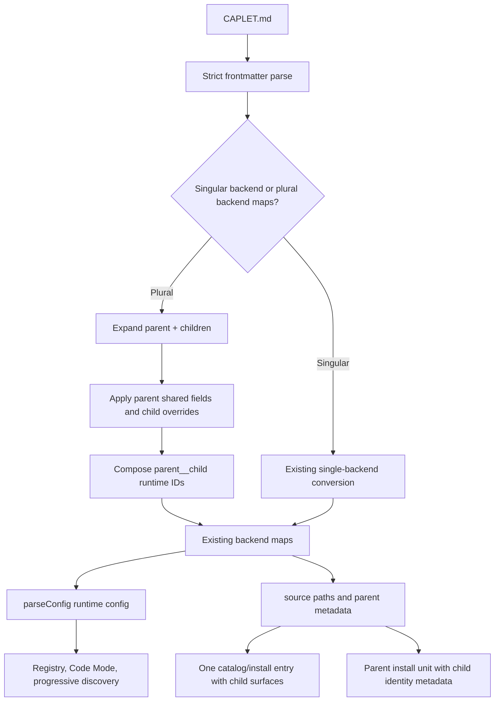

# Multi-Backend Caplet Files - Plan

## Goal Capsule

- **Objective:** Let one Markdown Caplet file express a provider-scale capability made of multiple backend entries, while preserving normal runtime Caplet handles.
- **Product authority:** `STRATEGY.md` frames Caplets as typed, scoped handles over heterogeneous backends, and `CONCEPTS.md` defines catalog-grade Caplets as install-ready provider capabilities with setup, auth, validation, and safety metadata.
- **Open blockers:** None before implementation.

---

## Product Contract

### Summary

Caplet files should support a multi-backend authoring shape for provider suites such as Google Workspace. A single catalog entry and install unit can carry shared guidance, while the loader expands each declared child backend into the existing runtime backend maps with stable child IDs.

### Problem Frame

The current Caplet file contract is too narrow for provider suites. Google Workspace is one capability in a catalog and in user intent, but its useful surfaces live across Gmail, Drive, Docs, Sheets, Calendar, Meet, Chat, and other APIs. Keeping each surface as a separate catalog entry fragments setup, auth, safety guidance, and installation flow.

`capletSets` solves a different problem: importing or nesting an existing collection of Caplets. A provider suite needs one authored capability with multiple child surfaces, not a reference to another Caplets root.

### Key Decisions

- **Use multi-backend Caplet files, not `capletSets`, for provider suites.** Provider suites need one catalog card, shared guidance, and multiple child handles; `capletSets` remains the abstraction for including another collection.
- **Compile into existing backend maps.** Multi-backend files should not create a new runtime backend type when the existing maps already model MCP, OpenAPI, Google Discovery, GraphQL, HTTP, CLI, and Caplet-set entries.
- **Preserve child handle stability.** Runtime execution, discovery, auth, diagnostics, and Code Mode should continue to address concrete child Caplets, not an opaque parent bundle.
- **Keep singular files valid.** Existing `mcpServer`, `openapiEndpoint`, `googleDiscoveryApi`, `graphqlEndpoint`, `httpApi`, `cliTools`, and `capletSet` Caplet files remain valid.

### Requirements

**Authoring syntax**

- R1. A Caplet file MAY declare plural backend maps in frontmatter: `mcpServers`, `openapiEndpoints`, `googleDiscoveryApis`, `graphqlEndpoints`, `httpApis`, `cliTools`, and `capletSets`.
- R2. A Caplet file MUST define either exactly one singular backend or at least one plural backend entry.
- R3. A Caplet file MUST reject a mix of singular backend keys and plural backend maps in the same file.
- R4. Each child backend entry MUST use a stable child ID that follows the same ID rules as existing config backend map keys.
- R5. The parent file ID and child ID MUST combine into a stable runtime child Caplet ID that avoids collisions with sibling files and other backend maps.
- R6. Child entries MAY override selection guidance, tags, exposure, shadowing, setup, project binding, runtime requirements, and safety-relevant metadata when a child needs more specificity than the parent.
- R7. Parent-level shared fields MUST apply to child entries unless the child provides a supported override.
- R8. The Markdown body remains the parent capability guide and is available to every child entry as shared operating context.

**Runtime and catalog behavior**

- R9. Multi-backend files MUST expand into the existing runtime backend maps so downstream execution does not need a new backend kind.
- R10. Runtime discovery MUST expose callable child Caplets as concrete handles, not as one opaque parent handle.
- R11. Catalog surfaces SHOULD present the parent file as one installable capability with visible child surfaces.
- R12. Setup and verification metadata SHOULD be able to express parent-wide readiness checks and child-specific readiness checks.
- R13. Auth and Vault references MUST remain explicit, inspectable, and least-privilege at the child surface level when scopes differ.
- R14. Diagnostics MUST identify the parent file and the child backend when reporting validation, auth, setup, or runtime errors.
- R15. Lockfile and install/update behavior MUST treat the parent file as the install unit while preserving child runtime identity.

**Compatibility and migration**

- R16. Existing singular Caplet files MUST parse and behave unchanged.
- R17. Existing config files with plural backend maps MUST parse and behave unchanged.
- R18. Existing `capletSets` behavior MUST remain focused on nested collections and must not be redefined as provider-suite syntax.
- R19. Generated docs and JSON schema MUST describe both singular and plural Caplet file forms clearly enough that catalog authors can choose the right one.
- R20. Public catalog generation MUST continue to index singular Caplets and MUST index multi-backend provider suites without duplicating the parent as several independent catalog cards.

### Key Flows

- F1. Provider-suite authoring
  - **Trigger:** A catalog author wants to create a Google Workspace Caplet.
  - **Steps:** The author writes one `CAPLET.md` with shared provider metadata, shared setup/auth guidance, and child `googleDiscoveryApis` entries for the Workspace surfaces.
  - **Outcome:** The catalog shows one Google Workspace capability, while runtime exposes stable child Caplets for Gmail, Drive, Docs, and the other declared surfaces.
  - **Covered by:** R1, R4, R7, R8, R11.

- F2. Runtime use
  - **Trigger:** An agent installs a multi-backend provider-suite Caplet.
  - **Steps:** Caplets loads the parent file, expands child entries into existing backend maps, and exposes concrete handles through Code Mode and progressive discovery.
  - **Outcome:** Agent workflows can call the exact child surface they need without receiving a flat provider-wide tool wall.
  - **Covered by:** R5, R9, R10, R14.

- F3. Upgrade compatibility
  - **Trigger:** A user already has singular Caplet files or config-map Caplets.
  - **Steps:** The parser accepts existing singular frontmatter and existing config maps without requiring migration.
  - **Outcome:** New provider-suite syntax adds capability without breaking current users or catalog entries.
  - **Covered by:** R16, R17, R18.

### Acceptance Examples

- AE1. **Covers R1, R5, R9, R11.** Given a `google-workspace/CAPLET.md` with `googleDiscoveryApis.gmail` and `googleDiscoveryApis.drive`, when Caplets loads the file, then the runtime exposes stable child handles for the Gmail and Drive surfaces and the catalog presents one Google Workspace entry.
- AE2. **Covers R2, R3.** Given a Caplet file that declares both `mcpServer` and `googleDiscoveryApis`, when Caplets validates the file, then validation fails with a clear mixed-shape error.
- AE3. **Covers R6, R7, R13.** Given parent-level OAuth metadata and a child entry with narrower scopes, when Caplets expands the file, then the child entry uses the narrower child scopes while inheriting shared provider guidance.
- AE4. **Covers R14.** Given a child backend has invalid config, when validation reports the failure, then the error identifies both the parent file and the child backend ID.
- AE5. **Covers R16, R17.** Given an existing singular `mcpServer` Caplet file or a user config with `mcpServers`, when Caplets loads it after this change, then behavior is unchanged.

### Scope Boundaries

- Keep `capletSets` as nested collection composition, not provider-suite authoring syntax.
- Do not add a new runtime backend type for bundles unless planning discovers a hard requirement that existing backend maps cannot satisfy.
- Do not require catalog authors to migrate singular Caplet files.
- Do not flatten provider suites into many unrelated catalog cards by default.

### Dependencies / Assumptions

- The existing config model can remain the runtime source of truth for child backend entries.
- Child runtime IDs can be made stable and readable without breaking existing ID validation or namespace-shadowing expectations.
- Catalog indexing can represent one parent entry with child surfaces without changing the public install unit.

### Sources / Research

- `STRATEGY.md`: Caplets should expose heterogeneous backends as typed, scoped handles rather than flat tool walls.
- `CONCEPTS.md`: Catalog-grade Caplets need install-ready setup, auth, validation, safety, and Project Binding metadata.
- `packages/core/src/caplet-files-bundle.ts`: Current Caplet file schema supports singular backend keys and validates exactly one backend.
- `packages/core/src/config.ts`: Runtime config already supports plural backend maps and normalizes each map entry into a concrete Caplet config.
- `packages/core/src/registry.ts`: Runtime lookup and summaries operate on one concrete Caplet ID at a time.
- `/tmp/compound-engineering/ce-brainstorm/multi-caplet-backends/grounding.md`: Grounding dossier with source line pointers gathered for this brainstorm.

---

## Planning Contract

Product Contract unchanged. This plan enriches the existing requirements into implementation units and chooses the technical details needed to build the new syntax without changing the brainstormed product scope.

### High-Level Technical Design



### Key Technical Decisions

- **KTD1. Loader-level expansion.** Multi-backend Caplet files expand inside the Markdown Caplet file loader into the existing backend maps. The registry, Code Mode handles, progressive discovery, and backend managers should continue to consume normal concrete Caplet configs.
- **KTD2. Runtime child IDs use the namespace separator.** Child IDs compose as `parent__child`, matching the project vocabulary around the double-underscore Caplet ID separator and staying within the current server ID pattern. If the composed ID exceeds the existing ID limit or collides with any sibling/backend-map ID, validation fails with parent and child context.
- **KTD3. Parent metadata is inherited with field-specific merge rules.** Child entries inherit parent `name`, `description`, `useWhen`, `avoidWhen`, `exposure`, `shadowing`, `projectBinding`, `runtime`, `setup`, and `tags`. Scalar child fields override; tags and runtime features stable-union; setup commands and verify steps concatenate parent first, child second; project binding is required when either parent or child requires it.
- **KTD4. Shared auth is plural-form only.** Plural Caplet files may declare parent-level `auth` only when every declared child backend family supports auth. Child `auth` wins over parent `auth`, which keeps least-privilege child scopes explicit for Google Workspace-style suites.
- **KTD5. `cliTools` is structurally disambiguated.** Existing singular CLI Caplet files keep using `cliTools.actions`. A plural CLI map under `cliTools` is recognized only when the value is a child-ID map rather than the existing action-bearing shape; `actions` is reserved as an ambiguous child ID under plural `cliTools`.
- **KTD6. Catalog source identity stays parent-first.** Runtime exposes `parent__child` handles, but catalog, install, update, and lockfile source identity keep the parent file ID and source path as the install unit. Catalog entries gain child-surface metadata instead of duplicating the parent into several independent cards.
- **KTD7. Generated artifacts follow source.** Caplet schema JSON, landing schema assets, generated docs, and official catalog JSON are regenerated from the implementation rather than hand-edited.

### Scope Boundaries

- This plan does not migrate every existing provider entry into multi-backend form. It should add representative coverage and leave broad catalog consolidation as follow-up work unless implementation discovers that an existing official entry is the cleanest fixture.
- This plan does not redefine `capletSets`; nested collections continue to be a backend family that can itself appear as a plural child map.
- This plan does not add a new runtime backend kind, new agent handle type, or parent runtime handle.
- This plan does not require current singular Caplet authors to change syntax.

### System-Wide Impact

- **Public authoring contract:** `schemas/caplet.schema.json`, `apps/landing/public/caplet.schema.json`, and generated docs gain the plural syntax.
- **Runtime identity:** Code Mode and progressive discovery see additional concrete IDs from one file, so error messages and source tracking must report both composed runtime ID and parent file path.
- **Catalog/install lifecycle:** Catalog entries, install commands, lockfile entries, update risk summaries, and public indexing must treat a multi-backend file as one source artifact with multiple child surfaces.
- **Authoring guidance:** `skills/writing-caplets/SKILL.md` should teach when to use a Multi-Backend Caplet File versus a Caplet set or separate Caplet files.

### Risks & Dependencies

- **Ambiguous `cliTools` shape.** Mitigation: preserve `cliTools.actions` as the singular shape and add tests for singular CLI compatibility, plural CLI maps, and the reserved ambiguous child key.
- **Child ID collisions across backend maps.** Mitigation: perform duplicate detection after composing runtime IDs, before returning the loaded map, and cover sibling-file plus cross-family collisions.
- **Catalog duplication regressions.** Mitigation: add source-parser/catalog tests that prove one parent catalog entry is generated even though multiple runtime child Caplets parse.
- **Schema/docs drift.** Mitigation: regenerate schema, docs, and official catalog artifacts during implementation and require their check commands in the Verification Contract.
- **Lockfile compatibility.** Mitigation: keep lockfile `id` as the installed parent ID while storing or deriving child runtime identities from the parent artifact; do not create separate lockfile entries per child.

### Deferred to Follow-Up Work

- Bulk migration of existing Google Workspace entries into one public `google-workspace` Caplet after the syntax and catalog grouping are proven.
- Rich catalog UI affordances for expanding/collapsing child surfaces beyond a compact metadata list.
- Any new backend-family-specific shared fields beyond parent `auth` and the existing common fields.

### Sources & Research

- Local research found the required runtime map pattern already exists in `packages/core/src/config.ts` and `packages/core/src/config-runtime.ts`.
- `packages/core/src/caplet-files-bundle.ts` owns strict Markdown frontmatter validation and in-memory map loading; it is the primary expansion point.
- `packages/core/src/caplet-source/parse.ts` and `scripts/generate-catalog-index.ts` currently turn parsed Caplets into one catalog entry per resolved runtime Caplet, so they need parent grouping metadata.
- `packages/core/src/cli/install.ts` discovers install units by file/directory ID and writes lockfile risk summaries from source frontmatter, so parent install identity must be preserved there.
- External research was skipped because the plan is an internal schema/runtime/catalog change with strong local patterns and no unsettled external API or library choice.

---

## Implementation Units

### U1. Add plural Caplet file schema and expansion

**Goal:** Accept plural backend maps in Markdown Caplet frontmatter and expand them into existing backend map entries with composed child runtime IDs.

**Requirements:** R1, R2, R3, R4, R5, R6, R7, R8, R9, R13, R16, R18, AE1, AE2, AE3, AE5.

**Dependencies:** None.

**Files:** `packages/core/src/caplet-files-bundle.ts`, `packages/core/src/caplet-files.ts`, `packages/core/test/caplet-files.test.ts`.

**Approach:** Extend `capletFileSchema` with plural backend maps using the same child ID validation as config maps. Keep the existing singular backend schemas intact. Add a parsed representation that identifies singular versus plural shape, rejects mixed shape, validates at least one plural child, and routes plural files through a new expansion helper. Expansion should return a backend-map load result rather than one backend object, so `buildCapletFileLoadResultFromEntries` can merge multiple child entries from one candidate file.

For each child, compose `parent__child`, validate the composed ID against the current server ID pattern and max length, normalize local path fields relative to the parent file directory, merge parent fields using the Planning Contract rules, and attach the shared Markdown body. Parent `catalog` metadata remains catalog-only and must not appear in runtime backend configs.

**Execution note:** Start with failing loader tests for the singular compatibility case, Google Workspace plural case, and mixed-shape rejection before changing the schema.

**Patterns to follow:** Existing singular conversion in `capletToServerConfig`; existing duplicate ID handling in `buildCapletFileLoadResultFromEntries`; existing local-path normalization helpers for OpenAPI, Google Discovery, GraphQL, CLI, and Caplet sets.

**Test scenarios:**

- Covers AE1. A `google-workspace/CAPLET.md` with `googleDiscoveryApis.gmail` and `googleDiscoveryApis.drive` returns `googleDiscoveryApis.google-workspace__gmail` and `googleDiscoveryApis.google-workspace__drive`.
- Covers AE2. A file with `mcpServer` plus `googleDiscoveryApis` fails validation with a mixed singular/plural shape error.
- Covers AE3. Parent OAuth metadata applies to children without child auth, while a child with narrower scopes uses its child auth.
- Covers AE5. Existing singular `mcpServer`, singular `cliTools.actions`, and singular `capletSet` files produce the same loaded config shape as before.
- A plural file with an empty backend map fails validation.
- A plural file with child ID that composes beyond the current ID limit fails with parent and child context.
- A plural `cliTools` map accepts child entries with actions, while `cliTools.actions` continues to mean the singular CLI backend.
- A plural `cliTools` map using child ID `actions` fails as ambiguous.
- Parent body text appears on every expanded child config.
- Child `setup.verify` is appended after parent `setup.verify`, and child `tags` stable-union with parent tags.

**Verification:** Focused Caplet-file tests prove plural loading, singular compatibility, inheritance, auth override, local path normalization, and validation diagnostics.

### U2. Preserve source metadata for parent and child identities

**Goal:** Carry enough source metadata through parsing for diagnostics, catalog grouping, install/update, and lockfile behavior to distinguish parent file identity from runtime child IDs.

**Requirements:** R5, R10, R14, R15, R20, AE1, AE4.

**Dependencies:** U1.

**Files:** `packages/core/src/caplet-files-bundle.ts`, `packages/core/src/caplet-source/parse.ts`, `packages/core/test/caplet-source.test.ts`, `packages/core/test/config.test.ts`.

**Approach:** Extend the Caplet file load result with parent-aware metadata while preserving `paths[id]` for existing source lookup callers. The metadata should identify the parent file ID, source path, child ID when applicable, composed runtime ID, and backend family. `loadConfigWithSources` should continue to map runtime child IDs to file paths, while diagnostics and parsed source results can surface richer parent/child context.

`parseCapletSource` should emit resolved runtime children as concrete Caplets, but include parent source identity so callers can group them. Missing local references should point at the parent file path and include the child runtime ID when the reference belongs to a child backend.

**Patterns to follow:** `ConfigWithSources.sources`, `sourceForId`, `ParsedCapletSourceCaplet.sourcePath`, and current missing-reference error handling.

**Test scenarios:**

- Covers AE4. A missing local Discovery document in a child backend reports the parent file path and child runtime ID.
- A multi-backend source parses into multiple resolved runtime Caplets with shared parent source path and distinct child IDs.
- `loadConfigWithSources` maps each composed child ID to the declaring parent file path.
- A singular Caplet source still reports the same source metadata as today.
- Sibling file `google-workspace__gmail/CAPLET.md` colliding with child `google-workspace__gmail` fails before runtime config parsing.

**Verification:** Source parser and config source tests prove child runtime IDs are concrete while parent file paths remain traceable.

### U3. Group multi-backend suites in catalog and indexing models

**Goal:** Present a multi-backend file as one installable catalog capability with visible child surfaces, without duplicating it into several catalog cards.

**Requirements:** R10, R11, R15, R20, AE1.

**Dependencies:** U1, U2.

**Files:** `packages/core/src/catalog/types.ts`, `packages/core/src/catalog/entry.ts`, `packages/core/src/catalog/caplet-markdown.ts`, `packages/core/src/catalog/source.ts`, `scripts/generate-catalog-index.ts`, `packages/core/src/catalog-indexing/payload.ts`, `packages/core/src/catalog-indexing/eligibility.ts`, `packages/core/test/catalog-model.test.ts`, `packages/core/test/catalog-official-index.test.ts`, `packages/core/test/catalog-indexing.test.ts`, `apps/catalog/src/data/official-catalog.json`.

**Approach:** Add a compact child-surface field to `CatalogEntry`, such as child runtime ID, child ID, backend family, name, description, auth/setup/project-binding readiness, and workflow summary. Official generation should group parsed resolved Caplets by parent source metadata. Singular files produce one entry with no child-surface list or a one-item internal list omitted from JSON; multi-backend files produce one parent entry whose `id`, `sourcePath`, and install command target the parent file ID.

Catalog warning/readiness helpers currently inspect raw singular frontmatter. Update them to understand plural child maps by aggregating conservatively: any child requiring auth/setup/project binding makes the parent catalog entry warn; any mutating child makes the parent entry mutating; local-control warning applies when any child uses local control. The workflow summary for a suite should represent a suite/mixed capability when children span families, or the shared family when all children share one backend family.

**Patterns to follow:** `createCatalogEntry`, `catalogWorkflowSummaryForBackendFamily`, existing catalog icon handling, and official catalog deterministic sorting.

**Test scenarios:**

- Covers AE1. Official generation for a fixture multi-backend Caplet produces one entry whose child surfaces include Gmail and Drive runtime IDs.
- A singular official Caplet still produces the same catalog entry shape except for optional new fields.
- Aggregated warnings include auth-required when any child has non-none auth.
- Aggregated mutating-state warning applies when a child Google Discovery/OpenAPI/GraphQL backend is present.
- Catalog entry keys remain stable for singular entries and use parent source identity for suites.
- Community indexing payloads include child-surface metadata only when the source remains public and eligible.

**Verification:** Catalog model, official-index, and indexing tests prove suite grouping, warning aggregation, deterministic JSON output, and no local absolute paths in generated catalog data.

### U4. Keep install, update, and lockfile behavior parent-based

**Goal:** Ensure installing or updating a multi-backend Caplet copies one parent artifact and records one parent lockfile entry while runtime children remain discoverable after install.

**Requirements:** R12, R14, R15, R16, AE1, AE5.

**Dependencies:** U1, U2, U3.

**Files:** `packages/core/src/cli/install.ts`, `packages/core/src/cli/lockfile.ts`, `packages/core/test/caplets-lockfile.test.ts`, `packages/core/test/cli.test.ts`.

**Approach:** Keep `discoverCapletFiles` and install planning based on parent file IDs. Validate multi-backend files during install using the new schema and copy the parent directory/file exactly once. Lockfile entries should continue using the installed parent ID and destination. Risk summaries should inspect plural frontmatter and aggregate backend families, auth scopes, project binding, runtime features, mutating/destructive flags, body hash, and reference hash across children.

If the catalog or user tries to install a child runtime ID directly from a source repository, fail with a clear message that the parent Caplet ID is the install target. The install path should detect this by expanding candidate parent Caplet files enough to inspect their child metadata when a selected ID is not found as a direct file or directory Caplet ID; if the selected ID maps to exactly one child runtime ID, report the parent ID, and if it maps to none or multiple candidates, keep the current fail-closed not-found/ambiguous behavior. Existing no-argument restore/update should continue to operate from the parent lockfile entry and rehydrate the whole parent artifact.

**Patterns to follow:** `installPlan`, `riskSummaryForSourcePath`, `readCapletFrontmatter`, `updateLockfileAfterInstall`, and restore/update source resolution.

**Test scenarios:**

- Installing `google-workspace` from a fixture source copies one directory/file and writes one lockfile entry for `google-workspace`.
- Loading the destination Caplets root after install exposes `google-workspace__gmail` and `google-workspace__drive`.
- Installing `google-workspace__gmail` directly from the source fails with parent-install guidance.
- Lockfile risk summary for a suite includes all backend families and child auth scopes.
- Restore and update keep operating on the parent destination and do not create child lockfile entries.
- Existing singular install/update lockfile tests remain unchanged.

**Verification:** Install and lockfile tests prove parent source identity, child runtime availability after install, and conservative risk aggregation.

### U5. Update generated schema, docs, and authoring guidance

**Goal:** Document the plural syntax clearly for catalog authors and keep public schema assets in sync with the new contract.

**Requirements:** R1, R16, R17, R18, R19, AE5.

**Dependencies:** U1, U3, U4.

**Files:** `schemas/caplet.schema.json`, `apps/landing/public/caplet.schema.json`, `apps/docs/src/content/docs/reference/caplet-files.mdx`, `scripts/generate-docs-reference.ts`, `skills/writing-caplets/SKILL.md`, `.changeset/*.md`.

**Approach:** Regenerate Caplet JSON schema after the schema changes and update generated reference docs to include both singular and plural examples. Add a Google Workspace-style plural example that shows shared parent guidance, child Google Discovery entries, child scopes, and resulting `parent__child` runtime handles. Update `writing-caplets` to advise using Multi-Backend Caplet Files for provider suites and `capletSet` for nested collections.

Add a changeset because this changes the public Caplet file authoring schema, generated docs, catalog API shape, and install/runtime behavior.

**Patterns to follow:** Existing generated docs examples in `scripts/generate-docs-reference.ts`, current `writing-caplets` authoring workflow, and changeset conventions in `.changeset/`.

**Test scenarios:**

- Generated Caplet schema accepts plural maps and rejects mixed singular/plural shapes.
- Generated docs include a plural provider-suite example and still include singular examples.
- Authoring guidance distinguishes Multi-Backend Caplet Files from Caplet sets.
- Changeset describes public authoring and catalog/install behavior changes without overclaiming a full Google Workspace migration.

**Verification:** Schema and docs checks pass after generation; the skill guidance is aligned with the implemented syntax.

### U6. Add representative suite fixture and catalog proof

**Goal:** Prove the new syntax with a realistic provider-suite fixture without requiring broad catalog migration in the same change.

**Requirements:** R1, R5, R9, R11, R13, R20, AE1, AE3.

**Dependencies:** U1, U2, U3, U5.

**Files:** `packages/core/test/fixtures` or inline fixtures in `packages/core/test/caplet-files.test.ts`, `packages/core/test/catalog-official-index.test.ts`, optionally `caplets/google-workspace/CAPLET.md` if implementation chooses an official fixture, `apps/catalog/src/data/official-catalog.json`.

**Approach:** Prefer test fixtures for parser/catalog proof unless implementation confirms that adding an official `google-workspace` catalog Caplet is small and does not conflict with the existing catalog batch. The fixture should include at least Gmail and Drive Google Discovery child entries, shared OAuth issuer/client metadata, child-specific scopes, shared body guidance, and child-specific operation filters. If an official Caplet is added, keep existing singular Google entries unless the implementation explicitly decides to replace them and updates catalog expectations.

**Patterns to follow:** Existing Google Discovery fixtures in `packages/core/test/caplet-source.test.ts` and official catalog generation tests.

**Test scenarios:**

- Covers AE1. The fixture exposes child runtime handles for Gmail and Drive while catalog output groups them under one parent suite.
- Covers AE3. Shared OAuth metadata is inherited and child scopes remain least-privilege.
- Operation filters remain child-specific and do not bleed between children.
- The generated official catalog remains deterministic when the fixture is official.

**Verification:** Parser and catalog tests prove the realistic suite shape; official catalog JSON is regenerated only if an official catalog file changes.

---

## Verification Contract

Run focused checks while implementing:

```sh
pnpm --filter @caplets/core test -- test/caplet-files.test.ts test/caplet-source.test.ts test/config.test.ts
pnpm --filter @caplets/core test -- test/catalog-model.test.ts test/catalog-official-index.test.ts test/catalog-indexing.test.ts test/caplets-lockfile.test.ts test/cli.test.ts
pnpm schema:generate
pnpm schema:check
pnpm docs:generate
pnpm docs:check
pnpm catalog:generate
pnpm catalog:check
pnpm format:check
pnpm lint
pnpm typecheck
```

Before landing the full feature, run the repository gate:

```sh
pnpm verify
```

If implementation adds or updates an official catalog Caplet, also inspect the generated `apps/catalog/src/data/official-catalog.json` diff to confirm one parent suite entry appears instead of duplicate child cards.

---

## Definition of Done

- Multi-backend Caplet files parse from Markdown frontmatter using plural backend maps and expand into existing runtime backend maps.
- Existing singular Caplet files and existing config-map files parse and behave unchanged.
- Runtime child handles use stable composed IDs, validate collisions clearly, and remain concrete Code Mode/progressive discovery handles.
- Parent body, setup, auth, tags, runtime, Project Binding, and guidance inheritance work according to the Planning Contract.
- Diagnostics identify parent file path and child runtime ID where child validation or local reference failures occur.
- Catalog generation and community indexing can represent one provider-suite entry with child surfaces and aggregate warnings/readiness conservatively.
- Install, restore, update, and lockfile behavior treat the parent file as the install unit and do not create duplicate child lockfile entries.
- Generated schema, landing schema asset, generated docs, official catalog JSON when relevant, authoring skill guidance, and changeset are updated from source.
- Focused tests, generated-file checks, formatting, lint, typecheck, and `pnpm verify` pass.
- Any exploratory or abandoned implementation code is removed before completion.
