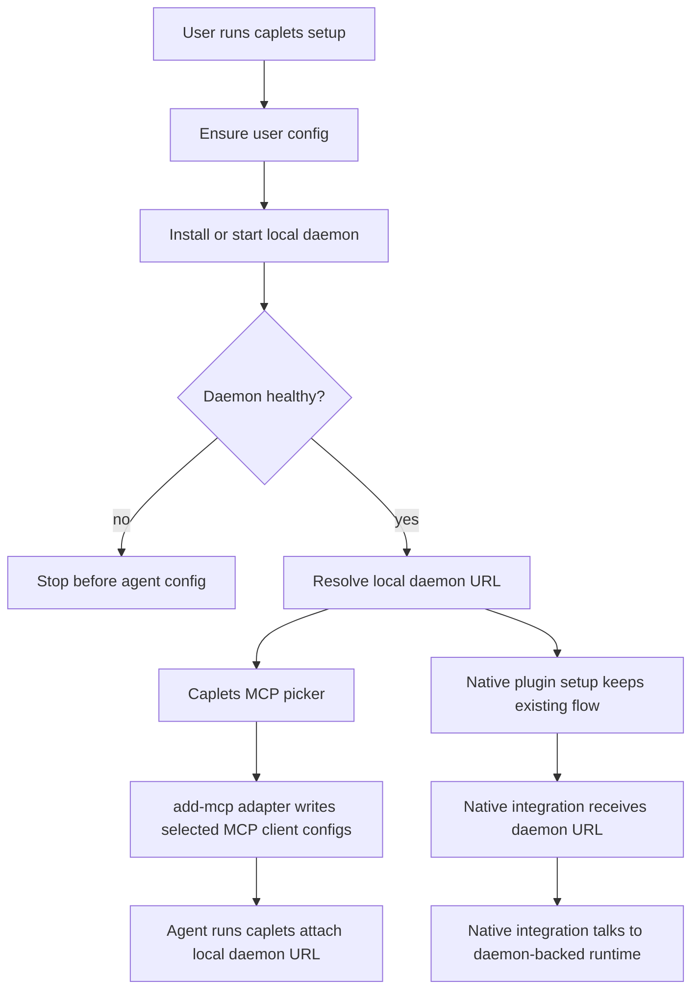
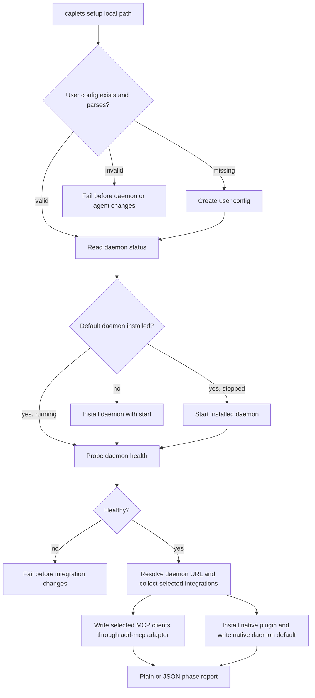
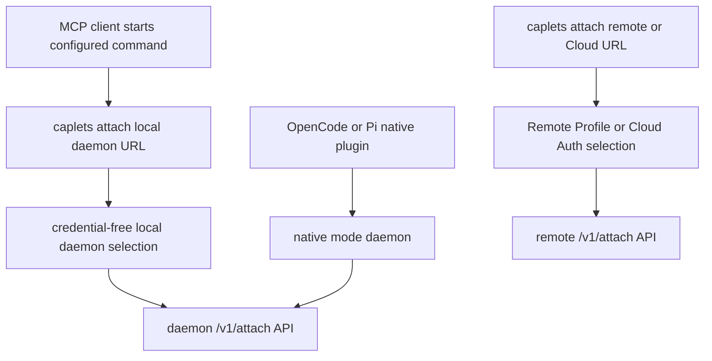

# Daemon-First Setup Onboarding - Plan

## Goal Capsule

- **Objective:** Make `caplets setup` the daemon-first onboarding path so users get a stable local runtime before any agent integration is configured.
- **Product authority:** The Product Contract is authoritative for user-facing behavior; the Planning Contract is authoritative for implementation seams, sequencing, and verification.
- **Execution profile:** Cross-interface CLI/native/docs work with an external package dependency; implement characterization coverage before changing current setup and attach behavior.
- **Stop conditions:** Stop and re-plan if the pinned `add-mcp` contract check fails, if local daemon attach cannot be made credential-free without weakening remote credential boundaries, or if native daemon defaults require a user-visible product change beyond the Product Contract.
- **Tail ownership:** The implementer owns tests, docs, generated checks, a changeset, and cleanup of any superseded `caplets serve` setup copy introduced by this plan.

---

## Product Contract

### Summary

`caplets setup` should initialize a user-owned local runtime first, then point agent integrations at that runtime.
MCP clients should be configured through a Caplets-owned picker backed by `add-mcp`'s programmatic server-add interface, while native integrations keep their plugin setup flows and receive the local daemon URL.

### Problem Frame

The current local MCP setup path launches `caplets serve` inside each MCP client process.
Some MCP clients do not pass through the agent parent's environment, so Caplets can start without the environment needed by configured backends.
A daemon-backed setup moves backend execution into the per-user Caplets service, leaving `caplets attach` as a thin client wrapper that talks to the daemon.

### Key Decisions

- **Daemon-first is the default setup posture.** The happy path prioritizes a healthy local daemon over foreground `serve` because the daemon owns the user's full runtime environment.
- **User config is the first-run config target.** `caplets setup` creates the user config if missing, not a project config, because the default daemon is a per-user service.
- **Caplets owns the MCP picker.** Caplets controls the onboarding copy, daemon framing, and confirmation flow while using `add-mcp` for supported-client metadata and config mutation.
- **Use `add-mcp` programmatically, not via unpinned `npx`.** The integration should be a controlled adapter around the server-add/upsert interface so Caplets can pin behavior, surface warnings, and avoid remote package execution during setup.
- **Fail before agent config when the daemon is unhealthy.** Setup should not leave agents pointed at a daemon URL that cannot currently serve Caplets.
- **Public docs move toward daemon-backed attach.** First-run and local MCP docs should teach the daemon path; foreground `caplets serve` remains documented as an advanced/manual fallback.

### Actors

- A1. Human installer running `caplets setup`.
- A2. MCP client that starts a configured Caplets stdio command.
- A3. Native integration such as OpenCode or Pi.
- A4. Local Caplets Daemon that owns backend execution and environment.
- A5. `add-mcp` adapter used by Caplets to mutate MCP client configuration.

### Key Flow

- F1. First-run daemon-first setup
  - **Trigger:** A1 runs `caplets setup` without an explicit remote/cloud setup intent.
  - **Actors:** A1, A2, A3, A4, A5
  - **Steps:** Setup creates the user config if missing, installs or starts the local daemon, verifies health, resolves the local daemon URL, shows the Caplets-owned MCP picker, configures selected MCP clients through the `add-mcp` adapter, and sets up native integrations through their plugin systems with the daemon URL.
  - **Outcome:** Agents launch thin attach/native clients while backend execution happens in A4.
  - **Covered by:** R1, R2, R3, R5, R6, R10, R11, R14, R15, R16
- F2. Daemon failure before integration mutation
  - **Trigger:** Setup cannot install, start, or health-check the local daemon.
  - **Actors:** A1, A4
  - **Steps:** Setup reports the daemon failure and recovery guidance before calling the MCP config writer or native integration setup.
  - **Outcome:** No new agent config points at an unavailable daemon.
  - **Covered by:** R4

### Requirements

**Daemon-first setup lifecycle**

- R1. `caplets setup` must create the user Caplets config when it is missing and must not create a project config by default.
- R2. `caplets setup` must install, update, start, or reuse the default local daemon before configuring any agent integration.
- R3. MCP client configs created by setup must run `caplets attach <local-daemon-url>` rather than `caplets serve`.
- R4. Setup must fail before mutating agent integration config when user config initialization, daemon installation, daemon startup, or daemon health verification fails.
- R5. Setup output must make the daemon-backed shape visible enough that users understand the agent command is a thin client and the daemon is the runtime.

**MCP client configuration**

- R6. Caplets must use `add-mcp` through a controlled programmatic adapter for MCP client config mutation, not through an unpinned `npx add-mcp` shell command.
- R7. The MCP picker must be Caplets-owned and show detected supported clients first, with an option to show all clients supported by the `add-mcp` adapter.
- R8. Targeted setup must still allow users to choose a specific supported MCP client without going through broad auto-detection.
- R9. Setup must support every MCP client that the adopted `add-mcp` adapter can configure for a stdio server command.
- R10. Setup must not auto-configure every detected or globally supported client without an explicit user selection.
- R11. Setup must surface `add-mcp` warnings and partial failures in Caplets language, including unsupported fields or client-specific limitations.
- R12. Setup must not put Caplets secrets, remote tokens, Vault values, or environment-bearing credential material into MCP client config.
- R13. The existing generic MCP config output path may remain as an advanced fallback, but it is not the daemon-first happy path.

**Native integration configuration**

- R14. OpenCode and Pi setup must continue to use their existing plugin installation systems.
- R15. Native setup must configure the integration's local daemon URL option so the integration talks to the daemon-backed runtime by default.
- R16. Native setup failure must not be hidden behind successful daemon setup; the final output must distinguish daemon readiness from integration readiness.

**Public-facing documentation**

- R17. `README.md` and public docs under `apps/docs/` must present daemon-first `caplets setup` as the local onboarding path.
- R18. Public docs must demote foreground `caplets serve` to manual, debugging, or advanced MCP setup rather than first-run local setup.
- R19. Docs must explain that daemon-backed setup avoids MCP client environment passthrough problems because backend execution happens in the Caplets Daemon.
- R20. Docs must keep remote/cloud setup separate from the local daemon-first path and preserve the rule that remote credentials stay in Caplets-owned stores rather than agent config.

**Compatibility and operator control**

- R21. Dry-run and JSON setup output must describe the full daemon-first plan without performing hidden side effects.
- R22. Existing users with foreground `serve` configs must have a clear migration or repair path to daemon-backed attach without losing the ability to run `serve` manually.
- R23. Setup must provide actionable recovery guidance when daemon setup succeeds but an integration-specific config mutation fails.

### Acceptance Examples

- AE1. **Covers R1, R2, R3, R6, R7.** Given no user config exists and no daemon is running, when A1 runs interactive `caplets setup` and selects a supported MCP client, then setup creates the user config, starts a healthy daemon, and writes an MCP client config that launches `caplets attach <local-daemon-url>`.
- AE2. **Covers R4, R10.** Given daemon startup fails, when A1 runs setup, then setup reports the daemon failure and does not call the MCP config adapter or mutate native integration config.
- AE3. **Covers R3, R5, R19.** Given an MCP client does not pass through the agent parent's environment, when it starts the configured Caplets command, then the command acts as an attach wrapper and backend execution uses the daemon environment.
- AE4. **Covers R7, R8, R9, R10.** Given `add-mcp` supports a client that Caplets did not previously hard-code, when A1 chooses that client from “all supported clients,” then setup configures only that selected client.
- AE5. **Covers R14, R15, R16.** Given A1 selects a native integration, when setup completes, then the plugin setup remains the integration's normal install flow and the integration points at the local daemon URL.
- AE6. **Covers R12, R20.** Given a remote or credential-bearing Caplet environment exists locally, when setup writes an MCP client config, then the config contains no Caplets remote token, Vault value, or credential env var.
- AE7. **Covers R17, R18, R19.** Given a first-time user reads the README or docs site, when they follow local setup guidance, then they are directed to daemon-first setup and see foreground `serve` only as an advanced/manual option.

### Success Criteria

- The local setup happy path no longer depends on MCP clients inheriting the agent parent's environment.
- A user can configure any MCP client supported by the adopted `add-mcp` adapter through Caplets setup.
- Public docs consistently teach daemon-backed attach for local first-run setup.
- Remote-secret boundaries remain intact: agent config contains stable selectors, not Caplets-owned credentials.

### Scope Boundaries

- Remote and Cloud onboarding are not redesigned by this v1 local setup change.
- Project config creation is not part of default `caplets setup`.
- Daemon customization flags, service-manager redesign, and daemon install-time service semantics are left to existing daemon commands and later planning.
- Foreground `caplets serve` is not removed.
- Native plugin setup systems are not replaced by `add-mcp`.
- `add-mcp` registry/search mode is not part of Caplets setup.
- Broad automatic installation into every detected or supported MCP client is not included.

### Planning Questions Resolved

- Pin `add-mcp` as a runtime dependency of `@caplets/core` and call its public add-server/upsert interface from a Caplets adapter rather than shelling out to `npx`.
- Resolve the local daemon URL from the installed daemon's serve config and pass the daemon base URL to `caplets attach <local-daemon-url>`.
- Add a first-class native daemon mode with a `daemon.url` option and a Caplets-owned native default store for setup to update safely.
- Keep the generic MCP config output path as an advanced/manual fallback while making the picker-backed `add-mcp` path the local setup happy path.

### Dependencies / Assumptions

- `add-mcp@1.13.0` exposes the public programmatic API shape observed during planning: supported agent metadata, project/global detection, and `upsertServer`-style add-server mutation returning structured success, path, warning, and error fields.
- The daemon's persisted serve config remains sufficient to derive a loopback base URL for the default daemon instance.
- OpenCode and Pi can consume a shared Caplets-owned native default store without breaking explicit plugin config, Pi settings, or environment-variable overrides.

### Sources / Research

- `STRATEGY.md` frames dependable local, remote, Cloud, and native agent surfaces as a product track.
- `CONCEPTS.md` defines the Caplets Daemon as the per-user native service running local HTTP `caplets serve`.
- `packages/core/src/cli/setup.ts` contains the current integration-focused setup implementation and hard-coded MCP client command shapes.
- `packages/core/src/cli/init.ts` contains current user/project config initialization behavior.
- `packages/core/src/daemon/index.ts` contains current daemon install/start health-check behavior.
- `packages/core/src/remote/selection.ts` currently treats `caplets attach` as remote-only, which is the key seam for daemon-backed local attach.
- `packages/core/src/native/options.ts`, `packages/opencode/src/index.ts`, and `packages/pi/src/index.ts` contain the native mode and settings shapes that need daemon-mode support.
- `README.md`, `apps/docs/src/content/docs/install.mdx`, and `apps/docs/src/content/docs/agent-integrations.mdx` contain current public local setup guidance.
- `docs/brainstorms/2026-06-19-unified-remote-attach-auth-requirements.md` and `docs/plans/2026-06-22-001-feat-self-hosted-pending-remote-login-plan.md` establish prior `add-mcp` and no-secret-agent-config direction.
- External evidence checked `add-mcp@1.13.0`, the `neon-solutions/add-mcp` repository, and npm `npx` behavior documentation during the brainstorm and planning research.

---

## Planning Contract

### Product Contract Preservation

Product Contract unchanged except that planning-owned questions were resolved into the `Planning Questions Resolved` subsection.
No requirement, actor, flow, acceptance example, or success criterion changed.

### Key Technical Decisions

- KTD1. **Treat local daemon attach as first-class, not as remote login.** `caplets attach <local-daemon-url>` must recognize loopback daemon URLs as a credential-free local daemon selection and must not route through Remote Profiles. This preserves the user's thin-client mental model while keeping self-hosted remote and Cloud attach credential checks intact.
- KTD1a. **Make the local daemon trust boundary explicit.** Setup-generated configs may only use the Caplets-owned default daemon URL after reading daemon status/config and passing a health probe. Manual loopback attach is explicitly a same-user loopback trust boundary; it does not claim to defend against malicious local processes that can bind or race loopback ports.
- KTD2. **Derive one canonical daemon client URL from daemon config.** Setup should use the installed daemon's serve host, port, and base path to derive a client-facing base URL, then rely on existing base-path helpers to reach health, MCP, attach, and control endpoints. If the daemon bind host is wildcard, setup may canonicalize to loopback only after a loopback health probe succeeds; if the daemon is bound to a non-loopback host, setup fails before agent mutation with recovery guidance. The value written into agent config is the base URL, not a `/v1/attach` endpoint, matching existing `caplets attach <url>` behavior for remotes.
- KTD3. **Compose setup from existing config and daemon primitives.** The daemon-first setup path should call existing config initialization, daemon install/start/status, and daemon health helpers rather than duplicating service-manager behavior in the CLI setup module.
- KTD4. **Validate and wrap `add-mcp` behind a Caplets adapter.** Add `add-mcp@1.13.0` to `@caplets/core` runtime dependencies, prove its public API shape with a non-mutating contract check before broad setup refactors, and expose a small internal adapter for supported-client metadata, detection, and `upsertServer`-style mutation. The rest of setup should depend on Caplets result types so future `add-mcp` churn is localized.
- KTD5. **Caplets owns selection; `add-mcp` owns client-specific writes.** Interactive setup lists detected supported MCP clients first and allows the user to reveal all supported clients. Setup never configures all detected clients unless the user explicitly selects them.
- KTD6. **Native daemon mode is explicit and separate from remote/cloud mode.** Add native `mode: "daemon"` with `daemon.url`, and keep `remote` for self-hosted remote or Cloud selectors that require Remote Profiles. Native option precedence is explicit programmatic/plugin config, then Pi settings where applicable, then environment selectors, then the Caplets native defaults store, then local in-process fallback. This prevents local daemon traffic from inheriting remote-auth recovery text or credential refresh behavior.
- KTD7. **Native setup writes Caplets-owned defaults rather than third-party agent config when possible.** Setup should install native plugins through the existing OpenCode/Pi plugin commands, then update `native-defaults.json` under the user Caplets config root, with a test-only path override. The store is non-secret, versioned, contains the daemon URL plus update metadata, and is ignored with a warning if malformed. Explicit plugin config, Pi settings, and environment variables continue to override this default.
- KTD8. **Partial integration failures are reported, not rolled back.** After config and daemon setup succeed, a client-specific failure should leave the daemon running and report per-integration status plus recovery commands. Setup must not silently undo a healthy daemon because an individual agent config write failed.
- KTD9. **Remote/cloud setup remains separate.** Explicit `--remote`, `--remote-url`, `--server-url`, or remote mode selectors keep using the existing remote setup and Remote Login model. Daemon-first setup only owns the local happy path.

### High-Level Technical Design

#### Daemon-first setup lifecycle

#### Runtime selection after setup

### Sequencing

1. Run U3 first to pin and verify the `add-mcp` public contract in a non-mutating temp config.
2. Implement the local daemon URL and attach selection seam, because both MCP setup and native daemon mode depend on it.
3. Add daemon-first setup orchestration with dependency-injected daemon and config operations so behavior can be tested without installing a real service.
4. Add the `add-mcp` adapter and picker once setup can provide a healthy local daemon URL and U3 has proven the dependency contract.
5. Add native daemon mode and the shared native defaults store, then wire native setup to that store.
6. Update docs, docs tests, generated references, and release metadata after behavior and output shapes are stable.

### Assumptions

- The installed default daemon is the only local daemon instance setup needs to target in v1.
- User/global config creation can use the same starter config semantics as `caplets init --global`; setup should not force-overwrite an existing config.
- The native defaults store is acceptable because it is Caplets-owned, non-secret, validated on read, repairable by rerunning setup, and lower precedence than explicit integration configuration or environment selectors.
- Existing generic `mcp-client --output` users can be served by keeping the manual config path and changing its local command to daemon-backed attach when a daemon URL is available.

### Risks & Mitigations

- **`add-mcp` API churn:** Wrap all imports and result interpretation in one adapter, pin the dependency, require a real non-mutating contract test, and use fake adapters for broad setup behavior.
- **Credential boundary regression:** Add tests proving loopback daemon attach bypasses Remote Profiles while non-loopback remotes still require Remote Login or Cloud Auth.
- **Daemon side effects in tests:** Inject config, daemon, prompt, and `add-mcp` adapters into setup tests; reserve real daemon lifecycle coverage for existing daemon tests.
- **Native precedence confusion:** Document and test precedence in native packages: explicit plugin/programmatic config first, integration settings next, Caplets native defaults next, environment/local fallback last according to existing resolver rules.
- **Partial setup confusion:** Use structured phase statuses in JSON and concise plain output so users can tell daemon readiness apart from individual integration readiness.

### System-Wide Impact

This change affects CLI setup, attach runtime selection, native integration selection, docs, public onboarding copy, setup telemetry shape, and package dependencies.
It does not alter Caplet config semantics, remote credential storage, Cloud Auth, or daemon service-manager installation semantics outside setup's orchestration of existing daemon commands.

---

## Implementation Units

### U1. Add local daemon endpoint and attach selection support

- **Goal:** Make a default daemon base URL discoverable and make `caplets attach <local-daemon-url>` resolve to a credential-free local daemon selection instead of the remote login path.
- **Requirements:** R2, R3, R5; supports F1, AE1, AE3.
- **Dependencies:** None.
- **Files:** `packages/core/src/daemon/index.ts`, `packages/core/src/daemon/types.ts`, `packages/core/src/daemon/validation.ts`, `packages/core/src/server/options.ts`, `packages/core/src/remote/selection.ts`, `packages/core/src/attach/options.ts`, `packages/core/src/attach/server.ts`, `packages/core/test/serve-daemon.test.ts`, `packages/core/test/remote-selection.test.ts`, `packages/core/test/attach-cli.test.ts`, `packages/core/test/attach-service-wiring.test.ts`.
- **Approach:** Add a daemon URL helper that derives a client-facing base URL from the default daemon serve config and reuses existing base-path helpers for health and attach endpoints. Wildcard daemon binds may be rewritten to loopback only after a loopback health probe succeeds; non-loopback daemon binds fail before agent mutation. Extend remote selection with a local daemon selection for loopback HTTP daemon URLs, leaving non-loopback HTTP and HTTPS remote/cloud URLs on the existing credentialed path. Teach attach service wiring to create a daemon-backed remote client for the local selection without Remote Profile lookup.
- **Execution note:** Start with characterization tests for current remote-only attach failure and existing remote credential enforcement, then add the local daemon cases.
- **Patterns to follow:** `packages/core/src/server/options.ts` for URL derivation and loopback validation; `packages/core/src/remote/options.ts` for base URL to attach URL conversion; `packages/core/test/remote-selection.test.ts` for resolver contract tests.
- **Test scenarios:**
  - Covers AE1. Given a daemon config with loopback host, port, and a non-root path, resolving the daemon URL returns a base URL whose attach and health URLs preserve the base path.
  - Given a daemon config bound to a wildcard host, setup canonicalizes to a loopback client URL only after a loopback health probe succeeds.
  - Given a daemon config bound to a non-loopback host, setup fails before agent mutation with recovery guidance.
  - Given setup generates a local attach config, the URL comes from Caplets-owned daemon status/config plus a health probe, not from arbitrary client detection or user-entered loopback text.
  - Covers AE3. Given `caplets attach <loopback-daemon-url>`, attach resolution returns a local daemon selection and does not require a Remote Profile.
  - Given `caplets attach https://caplets.example.test/caplets`, attach resolution still uses Remote Login or Cloud Auth and does not use the local daemon bypass.
  - Given a non-loopback unauthenticated HTTP URL, attach resolution keeps the existing network safety behavior and does not classify it as local daemon.
  - Given `--once` with a remote URL, Project Binding validation behavior remains unchanged.
- **Verification:** Local daemon attach can be resolved without credentials only for loopback daemon URLs, and all existing remote attach auth tests still pass.

### U2. Orchestrate daemon-first setup phases

- **Goal:** Change local `caplets setup` from integration-only setup to a phase-based flow that validates or creates user config, installs/starts/reuses the default daemon, health-checks it, and only then configures selected integrations.
- **Requirements:** R1, R2, R4, R5, R16, R21, R23; supports F1, F2, AE1, AE2.
- **Dependencies:** U1.
- **Files:** `packages/core/src/cli/setup.ts`, `packages/core/src/cli.ts`, `packages/core/src/cli/init.ts`, `packages/core/src/daemon/index.ts`, `packages/core/test/setup-runner.test.ts`, `packages/core/test/cli.test.ts`, `packages/core/test/serve-daemon.test.ts`, `packages/core/test/telemetry-runtime.test.ts`.
- **Approach:** Refactor setup around injectable phase operations and structured phase results. The local path ensures user config first, then runs daemon install/start/status/health operations, then passes the resolved daemon URL to selected integration handlers. Dry-run and JSON output should include planned config, daemon, and integration phases without side effects.
- **Execution note:** Preserve existing remote setup behavior with characterization coverage before changing local setup defaults.
- **Patterns to follow:** Existing `runSetup` JSON/plain result tests in `packages/core/test/setup-runner.test.ts`; daemon result redaction patterns in `packages/core/src/daemon/index.ts`; CLI error wrapping in `packages/core/test/cli.test.ts`.
- **Test scenarios:**
  - Covers AE1. Given no user config exists, local setup creates the user config phase before the daemon phase and records both in JSON output.
  - Given an existing valid user config, setup does not overwrite it and proceeds to daemon setup.
  - Given an invalid existing user config, setup fails before daemon install/start and before any integration adapter is called.
  - Covers AE2. Given daemon install, start, or health verification fails, setup reports the daemon failure with recovery guidance and does not call MCP or native integration writers.
  - Given a daemon is already installed, running, and healthy, setup reuses it and reports reuse rather than restarting by default.
  - Given `--dry-run`, setup reports config, daemon, and integration actions as planned and performs no writes, service operations, or adapter calls.
  - Given `--format json`, setup emits parseable structured phase statuses and no plain progress text on stdout.
- **Verification:** Local setup cannot reach integration mutation unless config and daemon phases succeeded or were planned in dry-run mode.

### U3. Validate the pinned `add-mcp` contract

- **Goal:** Prove the adopted `add-mcp` version exposes the public programmatic API that setup depends on before broad setup refactors build on it.
- **Requirements:** R6, R7, R8, R9, R11; supports AE4.
- **Dependencies:** None.
- **Files:** `packages/core/package.json`, `pnpm-lock.yaml`, `packages/core/src/cli/add-mcp-adapter.ts`, `packages/core/test/add-mcp-adapter.test.ts`, `packages/core/test/package-boundaries.test.ts`.
- **Approach:** Add the pinned runtime dependency, create the adapter module, and write a non-mutating contract test that imports the package, reads supported canonical client metadata, runs detection against a temporary config root, and exercises the server-upsert path only against disposable temp files. If the package cannot provide these operations without real user config mutation, stop before continuing broad setup implementation.
- **Patterns to follow:** Existing package-boundary tests for dependency visibility and setup tests that inject temporary directories instead of mutating user state.
- **Test scenarios:**
  - Given the pinned dependency is installed, the adapter can import the public API from `add-mcp` without deep imports.
  - Given a disposable temp config root, supported-client detection and upsert can run without touching real user or project config.
  - Given the package returns an unexpected result shape, the adapter reports a Caplets-owned contract failure before setup orchestration calls it.
- **Verification:** The adapter contract test is required, not optional, and passes before daemon-first setup depends on `add-mcp`.

### U4. Add the `add-mcp` adapter and Caplets-owned MCP picker

- **Goal:** Configure MCP clients through a pinned `add-mcp` programmatic adapter while keeping Caplets responsible for onboarding copy, selection, daemon framing, and result reporting.
- **Requirements:** R3, R6, R7, R8, R9, R10, R11, R12, R13, R21, R22, R23; supports F1, AE1, AE4, AE6.
- **Dependencies:** U1, U2, U3.
- **Files:** `packages/core/src/cli.ts`, `packages/core/src/cli/setup.ts`, `packages/core/src/cli/completion.ts`, `packages/core/src/cli/add-mcp-adapter.ts`, `packages/core/test/setup-runner.test.ts`, `packages/core/test/cli.test.ts`, `packages/core/test/cli-completion.test.ts`, `packages/core/test/agent-plugins.test.ts`.
- **Approach:** Add an internal adapter around `add-mcp@1.13.0` that exposes supported client IDs, detection, and a `caplets` server upsert operation for `{ command: "caplets", args: ["attach", daemonBaseUrl] }`. Interactive setup should show detected supported clients first, allow “show all supported clients,” and configure only the user's selected clients. Targeted setup uses `caplets setup mcp-client --client <add-mcp-id>` for canonical `add-mcp` client IDs, while `caplets setup codex` and `caplets setup claude-code` remain compatibility aliases for the matching MCP clients. `caplets setup mcp-client --output <path>` remains the advanced manual config fallback, so unknown top-level setup IDs can continue to delegate to Caplet setup instead of being treated as MCP clients.
- **Execution note:** Use fake adapter tests for broad CLI behavior; the real dependency contract is mandatory and belongs to U3 before this unit proceeds.
- **Patterns to follow:** Current setup command-runner injection in `packages/core/src/cli/setup.ts`; setup completion tests in `packages/core/test/cli-completion.test.ts`; adapter contract boundaries from U3.
- **Test scenarios:**
  - Covers AE1. Given the user selects a detected MCP client, setup calls the adapter once for that client with server name `caplets` and the daemon-backed attach command.
  - Covers AE4. Given a supported client that Caplets did not previously hard-code is selected from the all-supported list, setup configures only that selected client.
  - Covers AE6. Given local remote credentials or Vault-related environment values exist, the adapter receives no `env` field and no credential-bearing values in the MCP server config.
  - Given multiple detected clients exist, setup does not configure any unselected client.
  - Given interactive or dry-run setup is about to mutate a client config, output names the selected client, project/global scope, and target config path before mutation.
  - Given the adapter reports an unsupported client ID or an unexpected target path, setup fails that client before mutation and reports recovery guidance.
  - Given `add-mcp` returns dropped fields, extra paths, or a client-specific warning, setup surfaces them in Caplets language in plain output and structured JSON.
  - Given `add-mcp` fails for one selected client after daemon setup succeeds, setup reports that client as failed, preserves successful client results, and prints recovery guidance.
  - Given `caplets setup mcp-client --client <add-mcp-id>`, setup configures exactly that canonical client and completion/help expose the flag.
  - Given `caplets setup codex` or `caplets setup claude-code`, compatibility aliases still configure the corresponding MCP clients through the adapter rather than invoking client-specific shell commands.
  - Given `caplets setup mcp-client --output`, the advanced fallback remains available and writes a daemon-backed attach config when a local daemon URL is resolved.
- **Verification:** Caplets setup supports every canonical client exposed by the pinned `add-mcp` adapter without broad auto-configuration or secret-bearing MCP config.

### U5. Add native daemon mode and Caplets-owned native defaults

- **Goal:** Let OpenCode and Pi native integrations talk to the local daemon runtime by default after setup without replacing their plugin install systems or overloading remote/cloud mode.
- **Requirements:** R14, R15, R16, R20, R21, R23; supports F1, AE5, AE6.
- **Dependencies:** U1, U2.
- **Files:** `packages/core/src/native/options.ts`, `packages/core/src/native/service.ts`, `packages/core/src/native/remote.ts`, `packages/core/src/native.ts`, `packages/core/src/native/user-settings.ts`, `packages/core/test/native-options.test.ts`, `packages/core/test/native-remote.test.ts`, `packages/core/test/native.test.ts`, `packages/opencode/src/index.ts`, `packages/opencode/test/opencode.test.ts`, `packages/pi/src/index.ts`, `packages/pi/test/pi.test.ts`, `packages/core/src/cli/setup.ts`, `packages/core/test/setup-runner.test.ts`.
- **Approach:** Add `mode: "daemon"` with `daemon.url` to the core native options and create `native-defaults.json` under `resolveCapletsRoot(resolveConfigPath())`, with an explicit options/env override for tests. Store shape is versioned JSON containing `daemon.url`, `updatedAt`, and `source: "setup"`; malformed or stale-looking stores warn and fall through instead of crashing native startup. Native packages should merge configuration in this order: explicit programmatic/plugin config, Pi settings where applicable, environment selectors, Caplets native defaults, then local in-process fallback. Daemon mode resolves to the same credential-free local daemon attach client used by `caplets attach <local-daemon-url>`, and rerunning setup repairs the stored daemon URL after daemon host, port, or base-path changes. The existing plugin install commands remain the setup mechanism for OpenCode and Pi.
- **Execution note:** Add native option parser tests before changing service construction so malformed daemon mode fails with the same clarity as malformed remote mode.
- **Patterns to follow:** `packages/core/src/native/options.ts` for mode resolution, `packages/opencode/src/index.ts` for plugin config normalization, and `packages/pi/src/index.ts` for settings validation and warning behavior.
- **Test scenarios:**
  - Covers AE5. Given setup selects OpenCode or Pi after daemon health succeeds, setup installs the plugin and writes the Caplets native defaults store with the daemon URL.
  - Given native explicit config sets `mode: "daemon"` and `daemon.url`, the native service uses the local daemon attach client and does not require Remote Login.
  - Given setup reruns after daemon host, port, or base-path changes, the native defaults store is updated and no stale daemon URL shadows the current daemon config.
  - Given the native defaults store is malformed, native startup warns and falls back to explicit, environment, or local behavior rather than crashing.
  - Given explicit plugin config or Pi settings select `remote` or `cloud`, those explicit settings override the Caplets native defaults store.
  - Given malformed `daemon.url` or non-loopback HTTP where loopback is required, native option parsing fails with a clear request error.
  - Given daemon mode cannot connect, native integration status reports daemon connectivity failure rather than remote credential recovery text.
  - Given native setup fails after daemon setup succeeds, JSON and plain output distinguish daemon readiness from native integration readiness.
- **Verification:** OpenCode and Pi can be installed through their existing plugin flows and then resolve to daemon-backed runtime without Remote Profile credentials.

### U6. Preserve compatibility, migration, and output contracts

- **Goal:** Keep existing setup entry points usable while making daemon-backed attach the local default and giving existing `serve` users a clear repair/migration path.
- **Requirements:** R5, R13, R16, R21, R22, R23; supports AE2, AE6.
- **Dependencies:** U2, U4, U5.
- **Files:** `packages/core/src/cli/setup.ts`, `packages/core/src/cli.ts`, `packages/core/src/cli/completion.ts`, `packages/core/test/cli.test.ts`, `packages/core/test/setup-runner.test.ts`, `packages/core/test/cli-completion.test.ts`, `packages/core/test/agent-plugins.test.ts`.
- **Approach:** Update setup help, completion, interactive prompts, dry-run text, JSON result types, and failure output to describe daemon-first phases. Preserve explicit remote/cloud setup and Caplet setup routing for unknown integration IDs. Treat existing `caplets` server entries as idempotent upserts through `add-mcp`; interactive and dry-run output must show selected client, project/global scope, and target config path before mutation. Where client mutation semantics are unclear, report the adapter path and recovery or backup guidance instead of pretending a migration succeeded.
- **Patterns to follow:** Existing setup output snapshots in `packages/core/test/cli.test.ts` and neutral setup target tests in `packages/core/test/setup-runner.test.ts`.
- **Test scenarios:**
  - Given `caplets setup` without stdin, the help/menu describes daemon-first setup, detected/all MCP client selection, native integrations, remote flags, and the advanced manual config fallback.
  - Given interactive setup cancellation after daemon success but before integration selection, setup reports daemon ready and no integrations configured rather than a full failure.
  - Given a selected client already has a `caplets` MCP server, setup uses adapter upsert semantics and reports updated or unchanged status.
  - Given remote setup flags are present, setup does not install/start the local daemon and keeps existing remote attach/Remote Login output.
  - Given an unknown integration ID that matches a Caplet setup target, setup still delegates to Caplet setup rather than treating it as an MCP client.
  - Given setup output is JSON, all phase statuses are machine-readable and warnings/errors are not interleaved as plain stdout.
- **Verification:** Existing local setup commands route to daemon-first behavior, remote setup remains stable, and help/completion expose the new supported path without removing advanced manual workflows.

### U7. Update public documentation and docs safety tests

- **Goal:** Move first-run public guidance toward daemon-first setup while preserving advanced `serve`, remote/cloud, native, and no-secret-agent-config guidance.
- **Requirements:** R17, R18, R19, R20, R22; supports AE3, AE6, AE7.
- **Dependencies:** U1, U2, U4, U5, U6.
- **Files:** `README.md`, `apps/docs/src/content/docs/index.mdx`, `apps/docs/src/content/docs/install.mdx`, `apps/docs/src/content/docs/agent-integrations.mdx`, `apps/docs/src/content/docs/remote-attach.mdx`, `apps/docs/src/content/docs/troubleshooting.mdx`, `docs/native-integrations.md`, `docs/project-binding.md`, `packages/opencode/README.md`, `packages/pi/README.md`, `apps/landing/src/data/landing.ts`, `packages/core/test/agent-plugins.test.ts`, `packages/core/test/cli.test.ts`.
- **Approach:** Teach `caplets setup` as the default local path that creates or reuses user config, starts a healthy daemon, and configures selected clients with `caplets attach <local-daemon-url>`. Demote `caplets serve` to manual/debugging/advanced local runtime guidance. Keep remote/cloud setup docs on Remote Login and secret-free attach, and add a short explanation of the environment passthrough problem that daemon-first setup solves.
- **Patterns to follow:** Existing remote docs safety test in `packages/core/test/cli.test.ts`; docs reference generation under `pnpm docs:check`.
- **Test scenarios:**
  - Covers AE7. README and docs site first-run sections direct users to daemon-first `caplets setup` before manual `caplets serve`.
  - Covers AE3. Docs explain that backend execution happens in the Caplets Daemon and agent configs are thin attach/native clients.
  - Covers AE6. Docs safety tests continue to reject secret-bearing remote env vars, Basic Auth, and `add-mcp --env` guidance.
  - Given troubleshooting content mentions agent MCP configs, it tells users to expect `caplets attach <local-daemon-url>` for daemon-first local setup and reserves `caplets serve` for manual fallback.
  - Given native README docs describe mode selection, they include daemon mode and precedence without implying remote credentials belong in plugin config.
- **Verification:** Public docs consistently point local users to daemon-first setup, keep remote credentials out of agent config, and still document manual serve as an advanced fallback.

### U8. Final verification, generated artifacts, and release metadata

- **Goal:** Complete repository-level checks, generated-file freshness, and release communication for the daemon-first setup change.
- **Requirements:** All requirements, especially R17-R23.
- **Dependencies:** U1, U2, U3, U4, U5, U6, U7.
- **Files:** `pnpm-lock.yaml`, `.changeset/*.md`, generated docs/schema files if checks require them.
- **Approach:** Refresh lockfile changes from the pinned dependency, run relevant generators when public docs or schemas change, and add a changeset covering the CLI, core, OpenCode, and Pi user-facing changes. The changeset should call out daemon-first setup, `add-mcp`-backed MCP client support, and native daemon mode without presenting remote/cloud as redesigned.
- **Test scenarios:** Test expectation: none -- this unit consolidates verification and release metadata after behavior is covered by U1-U6.
- **Verification:** All targeted and full quality gates listed in the Verification Contract pass, generated checks are clean, and the changeset accurately describes user-facing package impact.

---

## Verification Contract

| Gate                           | Command                                                                                                                                                  | Applies to                       | Done signal                                                            |
| ------------------------------ | -------------------------------------------------------------------------------------------------------------------------------------------------------- | -------------------------------- | ---------------------------------------------------------------------- |
| Formatting                     | `pnpm format:check`                                                                                                                                      | All units                        | No formatting drift.                                                   |
| Lint                           | `pnpm lint`                                                                                                                                              | All units                        | No lint errors.                                                        |
| Core typecheck                 | `pnpm --filter @caplets/core typecheck`                                                                                                                  | U1-U6                            | Core setup, attach, daemon, and native type changes compile.           |
| Native package typecheck/build | `pnpm --filter @caplets/opencode build` and `pnpm --filter @caplets/pi build`                                                                            | U5, U7                           | Native package public config changes build.                            |
| `add-mcp` adapter contract     | `pnpm --filter @caplets/core test -- test/add-mcp-adapter.test.ts`                                                                                       | U3, U4                           | Pinned `add-mcp` API shape and non-mutating temp-config behavior pass. |
| Focused setup tests            | `pnpm --filter @caplets/core test -- test/setup-runner.test.ts test/cli.test.ts test/cli-completion.test.ts`                                             | U2, U4, U6                       | Setup orchestration, output, picker, and completion behavior pass.     |
| Focused attach/daemon tests    | `pnpm --filter @caplets/core test -- test/serve-daemon.test.ts test/remote-selection.test.ts test/attach-cli.test.ts test/attach-service-wiring.test.ts` | U1                               | Local daemon attach and existing remote attach behavior pass.          |
| Focused native tests           | `pnpm --filter @caplets/core test -- test/native-options.test.ts test/native-remote.test.ts test/native.test.ts` plus package tests for OpenCode and Pi  | U5                               | Native daemon mode, precedence, and package integration behavior pass. |
| Docs checks                    | `pnpm docs:check`                                                                                                                                        | U7                               | Generated docs references and public docs safety checks are clean.     |
| Generated API/schema checks    | `pnpm code-mode:check-api` and `pnpm schema:check`                                                                                                       | U5 and any config/schema changes | Public generated contracts are current or intentionally unchanged.     |
| Full test suite                | `pnpm test`                                                                                                                                              | All units                        | Repo tests pass.                                                       |
| Full gate                      | `pnpm verify`                                                                                                                                            | Before PR/merge                  | CI-equivalent local gate passes.                                       |

Behavioral verification must include a dry-run transcript and a JSON transcript for a local setup path with a fake daemon and fake `add-mcp` adapter.
Manual smoke testing should be limited to a disposable config directory and should not mutate the user's real MCP client configs.

---

## Definition of Done

- `caplets setup` local mode creates or reuses user config, installs/starts/reuses a healthy local daemon, and stops before agent config if config or daemon health fails.
- The pinned `add-mcp` adapter contract is verified against disposable temp config before setup depends on it.
- MCP client setup writes daemon-backed `caplets attach <local-daemon-url>` commands through the Caplets `add-mcp` adapter for selected clients only.
- The MCP picker shows detected supported clients first and can configure every supported `add-mcp` client through an explicit user selection.
- Remote/cloud setup remains on the existing Remote Login and secret-free attach path.
- OpenCode and Pi support explicit native daemon mode and can consume the repaired-on-rerun daemon URL from the Caplets native defaults store without replacing their plugin install systems.
- Plain and JSON setup output distinguish config, daemon, MCP, native, warning, and failure statuses.
- Public docs and package READMEs teach daemon-first local setup, explain the environment passthrough benefit, and keep `serve` as an advanced/manual fallback.
- No Caplets remote tokens, Vault values, or credential env vars are written into MCP client config, native config, docs, or tests.
- Targeted tests for setup, attach, daemon, native, docs, and package integrations pass.
- `pnpm verify` passes or any skipped full gate has a documented reason and equivalent focused evidence.
- A changeset covers the user-facing CLI/core/native/docs behavior changes.
- Dead-end implementation attempts, temporary test fixtures, and exploratory code are removed from the final diff.

---

## Appendix

### Research Notes

- Current local setup hard-codes foreground `caplets serve` for Codex, Claude Code, and generic MCP config in `packages/core/src/cli/setup.ts`.
- Current remote setup already uses `caplets attach <url>` for Codex, Claude Code, and generic MCP config, which is the command shape daemon-first local setup should reuse.
- `caplets attach` currently fails in local mode through `packages/core/src/remote/selection.ts`; daemon-first setup needs a local daemon selection rather than treating loopback daemon URLs as credentialed remotes.
- Daemon lifecycle helpers already install, start, restart, status-check, and health-check the service in `packages/core/src/daemon/index.ts`; setup should orchestrate them instead of recreating daemon semantics.
- `add-mcp@1.13.0` exposes public programmatic client detection and server upsert behavior; shelling out to `npx add-mcp` would add remote package execution and version drift to first-run setup.
