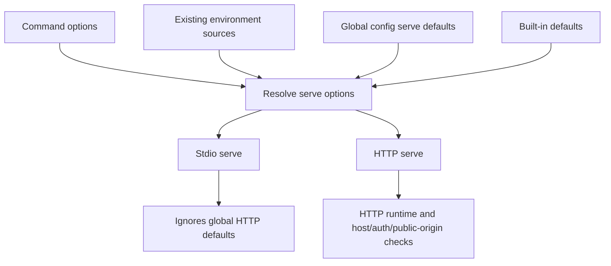
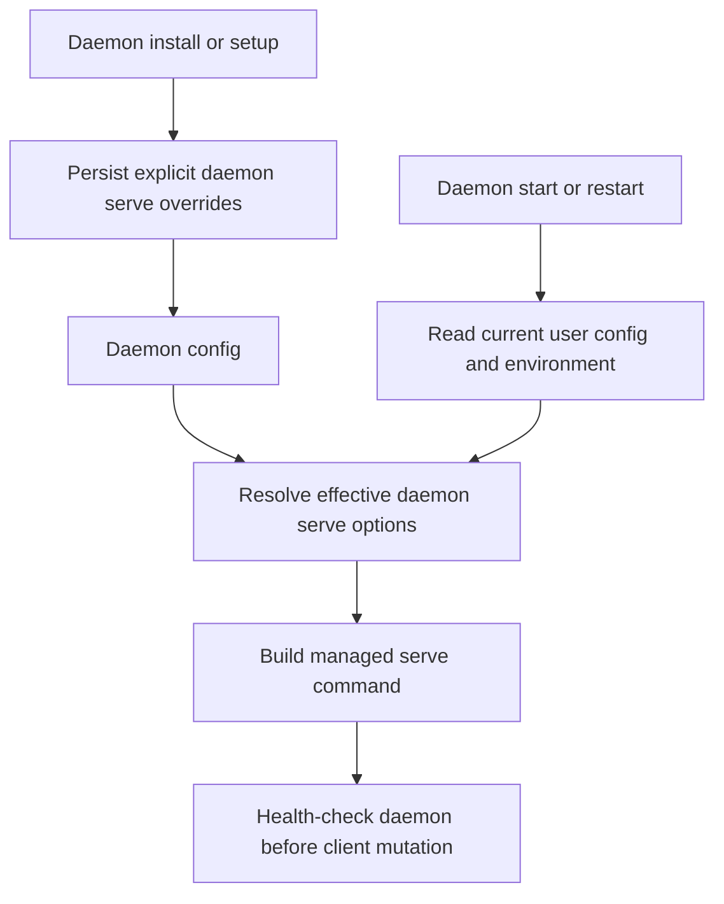

# Global Serve Config Defaults - Plan

## Goal Capsule

- **Objective:** Add global-only serve defaults so users can keep durable HTTP serve settings in Caplets config without letting project config change server bind, auth, or public-origin behavior.
- **Product authority:** Product Contract unchanged. This Product Contract owns the user-visible config semantics, precedence rules, project-config boundary, and public-origin behavior. Planning owns code structure, schema placement, and exact warning plumbing.
- **Open blockers:** None. Implementation must preserve daemon-first local onboarding safety while allowing daemon-managed HTTP serve processes to pick up global defaults on restart when fields are not explicitly set by the daemon command.

---

## Product Contract

### Summary

Add a top-level global `serve` config block for durable HTTP serve defaults. `caplets serve --transport http` and daemon-managed `caplets serve` read these defaults at process start, while project config `serve` entries are warned and ignored.

### Problem Frame

Serve behavior is currently controlled through command flags and a small set of environment variables. That works for one-off commands, but it makes stable local daemon and HTTP runtime preferences hard to keep in user-owned configuration.

The security boundary matters because project config is shareable repository state. A project must not be able to make a user's Caplets process bind to a different host, open unauthenticated HTTP, change public-origin identity, or alter remote credential state.

### Key Decisions

- **Global config supplies defaults, not authority.** CLI flags win first, existing environment-derived settings win second, global config fills only the remaining defaults, and built-in defaults stay last.
- **Transport remains command-only.** Global config cannot make bare `caplets serve` switch from stdio to HTTP, and HTTP-only serve defaults apply only when HTTP transport is requested by the command surface.
- **Use public-origin semantics instead of host-only naming.** The confirmed shape is `serve.publicOrigins`, not `serve.allowedHosts`, because entries participate in public host/origin identity rather than a broad network ACL.
- **Daemon-managed serve reads current global config on restart.** Editing global `serve` config can affect a managed daemon after restart when the daemon command did not explicitly set that field.

### Actors

- A1. Local user/operator owns global Caplets config and chooses CLI flags, environment variables, daemon install flags, and daemon restarts.
- A2. Project config author may commit project Caplets config but cannot control serve bind, auth, public-origin, or remote credential state.
- A3. MCP, attach, and remote-login clients interact with the HTTP serve process and depend on stable host, auth, and public-origin behavior.

### Requirements

**Global config surface**

- R1. Global config may define a top-level `serve` block for HTTP serve defaults.
- R2. The `serve` block must support existing HTTP serve defaults for bind host, port, base path, remote credential state path, upstream URL, unauthenticated HTTP opt-in, and trusted-proxy mode.
- R3. The `serve` block must support `publicOrigins` as a list of full origins that are valid public identities for the serve process.
- R4. The config surface must not define `serve.transport`; transport selection remains a command concern.

**Precedence and resolution**

- R5. CLI flags override environment-derived values and global `serve` config values.
- R6. Existing environment variables override global `serve` config values.
- R7. Global `serve` config values override built-in serve defaults only when the setting is otherwise unset.
- R8. HTTP-only serve config values must not affect stdio serve and must not make stdio serve fail merely because global HTTP defaults exist.

**Project config boundary**

- R9. Project config `serve` entries must never affect resolved serve behavior.
- R10. Project config `serve` entries must produce a user-visible warning that they were ignored for security reasons.
- R11. Ignoring project `serve` must not discard valid project Caplet definitions or project Caplet files.

**Public-origin behavior**

- R12. `serve.publicOrigins` entries must be treated as public origins, not as a generic network allowlist.
- R13. Public origins from config may participate in Host-header protection and remote credential audience calculation under the same safety rules as existing explicit public-origin behavior.
- R14. Invalid public-origin values must fail global config validation rather than being silently skipped.

**Daemon and runtime behavior**

- R15. Foreground `caplets serve --transport http` must read global `serve` config at process start.
- R16. A daemon-managed `caplets serve` process must read global `serve` config at process start so daemon restarts pick up config changes.
- R17. Explicit daemon install or command-level settings remain higher priority than global config defaults.
- R18. Daemon-first local onboarding must not lose its loopback, credential-free safety guarantees because of global serve defaults.

### Key Flows

- F1. Foreground HTTP serve with durable defaults
  - **Trigger:** A user runs `caplets serve --transport http` with global `serve` config present.
  - **Actors:** A1, A3.
  - **Steps:** Serve resolution reads CLI flags, environment values, global config, then built-in defaults. HTTP-only defaults apply because HTTP transport was requested.
  - **Outcome:** The HTTP runtime starts with the expected durable defaults without requiring repeated flags.
  - **Covered by:** R1-R8, R12-R15.

- F2. Project config attempts to control serve
  - **Trigger:** A project config includes a top-level `serve` block.
  - **Actors:** A1, A2.
  - **Steps:** Config loading keeps valid project Caplets, ignores project `serve`, and reports that project serve settings are user-owned for security.
  - **Outcome:** The project cannot change local bind, auth, public-origin, or credential-state behavior.
  - **Covered by:** R9-R11.

- F3. Daemon restart picks up global serve defaults
  - **Trigger:** A user edits global `serve` config and restarts the Caplets Daemon.
  - **Actors:** A1, A3.
  - **Steps:** The managed serve process starts and resolves current global config for fields not explicitly set by the daemon command.
  - **Outcome:** The daemon reflects durable user config without requiring reinstall for defaulted fields.
  - **Covered by:** R15-R18.

### Acceptance Examples

- AE1. **Covers R4, R8.** Given global config contains HTTP serve defaults, when the user runs bare `caplets serve`, then the command still uses stdio transport and does not fail because HTTP defaults exist.
- AE2. **Covers R5-R7.** Given a serve port exists in CLI flags, environment, and global config, when HTTP serve resolves options, then the CLI value is used.
- AE3. **Covers R6-R7.** Given a serve path exists in environment and global config but no CLI flag, when HTTP serve resolves options, then the environment value is used.
- AE4. **Covers R9-R11.** Given project config contains `serve.allowUnauthenticatedHttp`, when config loads, then serve behavior ignores that value, emits a warning, and still loads valid project Caplets.
- AE5. **Covers R12-R14.** Given global config contains a valid public origin, when HTTP attach or remote credential routes evaluate host identity, then that origin is accepted under the same safety rules as an explicit public origin.
- AE6. **Covers R15-R18.** Given the daemon command did not explicitly set a port and global config changes the port, when the daemon process restarts, then the managed serve process uses the updated configured port.

### Success Criteria

- The generated config schema documents global `serve` config and rejects invalid values.
- Focused config tests prove project `serve` warnings and ignored behavior.
- Focused serve tests prove CLI > env > global config > built-in defaults.
- Focused daemon tests prove restart-time config reading without weakening daemon-first local onboarding safety.
- Public docs explain that `serve` config is user/global-only and project config cannot control server exposure.

### Scope Boundaries

- Project config cannot control serve behavior in v1.
- This work does not add a network ACL, firewall, or per-client authorization policy.
- This work does not make transport a config preference.
- This work does not rename existing CLI flags.
- This work does not remove environment variable support for existing serve settings.

### Dependencies / Assumptions

- Config schema source remains `packages/core/src/config.ts` and generated schema checks remain authoritative.
- Serve option resolution remains the shared path for foreground serve, attach legacy HTTP serving, and daemon-managed serve processes.
- Existing daemon install flags continue to represent explicit command-level intent.

### Sources / Research

- `packages/core/src/serve/options.ts` currently defines and resolves HTTP serve options.
- `packages/core/src/cli.ts` currently exposes foreground serve flags and hidden attach legacy HTTP flags.
- `packages/core/src/config.ts` currently has no top-level `serve` property and already applies project-config security filtering.
- `docs/plans/2026-06-19-001-feat-caplets-daemon-service-plan.md` established daemon install-time serve configuration behavior.
- `docs/plans/2026-06-30-001-feat-daemon-first-setup-onboarding-plan.md` established daemon-first setup and local daemon URL derivation constraints.

---

## Planning Contract

### Product Contract Preservation

Product Contract unchanged. Planning adds implementation strategy, sequencing, test scope, and risk treatment without changing the brainstorm-owned requirements.

### Key Technical Decisions

- **KTD1. Treat `serve` as user-owned runtime configuration.** Add `serve` to the normal config schema and normalized config shape, but strip or ignore it from project-owned config sources before merge using the existing project-config security seam. Project warnings should flow through the same warning paths used by best-effort local runtime loading so user-facing commands can surface them without failing valid project Caplets.
- **KTD2. Centralize HTTP default resolution rather than branching per command.** A single serve-resolution path should accept command options, environment-derived values, and optional global `serve` defaults. CLI options must remain the highest-precedence source, and stdio must keep rejecting explicit HTTP-only command options without failing because global HTTP defaults exist.
- **KTD3. Public origins are full-origin identities.** `serve.publicOrigins` should normalize into one canonical public origin plus zero or more additional accepted origins. The first configured origin is canonical for generated metadata; additional origins only extend the existing explicit-origin safety checks for Host-header protection and remote credential audience calculation.
- **KTD4. Boolean defaults need an explicit false path.** If global config can set a boolean default, the command and environment precedence model must also allow a higher-precedence source to turn that default off. Add or normalize explicit false handling for unauthenticated HTTP and trusted-proxy mode rather than treating those flags as one-way opt-ins once configured.
- **KTD5. Daemon configs must distinguish explicit daemon intent from resolved defaults.** Persist enough metadata to know which daemon serve fields came from explicit daemon-install or setup intent. At start/restart time, resolve explicit daemon settings over current environment and global config, then built-ins; do not bake defaulted global config into the service command as if it were explicit.
- **KTD6. Local setup keeps its safety profile by using explicit daemon overrides.** Daemon-first local setup should continue to install or repair a loopback, credential-free daemon before mutating integrations. Global serve defaults may describe broader HTTP runtimes, but they must not silently turn the default local onboarding daemon into a remote-auth or non-loopback service.

### High-Level Technical Design

#### Serve Option Precedence

The resolver applies source precedence per field. HTTP-only defaults are available only after HTTP transport is selected, so a global `serve` block cannot change bare `caplets serve` away from stdio.

#### Daemon Restart Resolution

The daemon's stored config records explicit command intent separately from resolved runtime defaults. Restart reads the current global config for fields without explicit daemon overrides, then health-checks the resolved daemon before setup writes MCP or native integration state.

### Assumptions

- `CAPLETS_SERVER_URL` remains the primary environment-derived public-origin source. The plan does not require adding a broad new environment variable namespace for every serve config field unless implementation finds an existing precedence gap that cannot be expressed otherwise.
- Legacy daemon configs that lack explicitness metadata should be treated conservatively as explicit for fields already persisted. Users can rerun setup or daemon install/repair to opt into restart-time global defaults for those fields.
- `publicOrigins` will validate full origins and reject credentials, paths, queries, fragments, and unsafe non-loopback HTTP origins under the same URL safety rules used for current public server URLs.

### Alternative Approaches Considered

- **Put all serve behavior in daemon config.** Rejected because foreground HTTP serve also needs durable defaults and because user config is already the cross-command home for user-owned runtime preferences.
- **Allow project config with lower precedence.** Rejected because even low-precedence project serve settings can surprise users when no global or CLI value is present, and the Product Contract explicitly keeps server exposure user-owned.
- **Use host-only `allowedHosts`.** Rejected because the desired behavior participates in public identity and remote credential audiences, not a generic network ACL.

### System-Wide Impact

- **Config and schema:** Adds a new public config surface, generated schema output, and public docs reference content.
- **CLI contracts:** `caplets serve`, hidden attach HTTP compatibility paths, and daemon install/start flows must retain existing flag behavior while accepting global defaults.
- **Daemon lifecycle:** Install, restart, health-check, status, and setup flows must avoid stale default persistence and avoid weakening local setup safety.
- **Security boundary:** Project config filtering and Host-header/remote-credential audience handling are the critical safety surfaces.

### Risks and Mitigations

- **Project config changes server exposure.** Mitigate by stripping/ignoring project `serve` before merge, warning visibly, and testing that valid project Caplets still load.
- **Global defaults make local setup require remote auth.** Mitigate by giving setup explicit loopback and unauthenticated-local daemon intent, then health-checking before integration mutation.
- **Daemon restarts keep stale resolved values.** Mitigate by persisting explicitness separately from resolved defaults and testing restart after global config changes.
- **Multiple public origins weaken Host protection.** Mitigate by validating full origins, keeping one canonical generated identity, and limiting additional origins to existing explicit-origin safety paths.
- **Boolean options become impossible to disable.** Mitigate by adding an explicit false override path for higher-precedence sources and covering false-over-true scenarios.

---

## Implementation Units

### U1. Add global-only serve config

**Goal:** Add a typed, schema-backed top-level `serve` config surface that is accepted only from user/global config and warned/ignored from project config.

**Requirements:** R1-R4, R9-R11, R14; supports F2 and AE4.

**Dependencies:** None.

**Files:**

- Modify `packages/core/src/config.ts`
- Modify `packages/core/test/config.test.ts`
- Modify `packages/core/test/config-validation.test.ts`

**Approach:** Extend the config schema and normalized config output with an optional `serve` object containing HTTP defaults and `publicOrigins`. Reuse existing URL validation helpers where possible, add full-origin validation where the current helpers are too broad, and explicitly exclude `transport`. Extend the project-owned source filtering seam so project `serve` is dropped with a recoverable warning instead of failing valid project config or project Caplet files.

**Execution note:** Add characterization tests for project config filtering and global schema validation before changing merge behavior.

**Patterns to follow:** Existing top-level config schema composition in `packages/core/src/config.ts`; project executable backend rejection in `rejectProjectConfigExecutableBackendMaps`; warning assertions in `packages/core/test/config.test.ts`.

**Test scenarios:**

- Happy path: global config with host, port, base path, remote credential state path, upstream URL, unauthenticated HTTP, trusted proxy, and public origins parses into normalized config.
- Edge case: global config omits `serve`; existing configs still parse and normalize exactly as before.
- Error path: global config with `serve.transport` is rejected by schema validation.
- Error path: global config with an invalid public origin, path-bearing origin, credentialed origin, query, or fragment fails validation.
- Integration: project config with `serve.allowUnauthenticatedHttp` emits a recoverable warning, ignores the value, and still loads valid project Caplets.
- Integration: user/global `serve` survives merge when project config and project Caplet files are present.
- Covers AE4. Project `serve` cannot affect resolved serve behavior even when no user/global `serve` value exists.

**Verification:** Config normalization exposes global `serve`; generated schema assets include the global-only surface; project `serve` warnings are recoverable and do not drop valid project Caplets.

### U2. Apply serve config defaults through shared option resolution

**Goal:** Make foreground HTTP serve and HTTP-compatible attach paths resolve CLI, environment, global config, and built-in defaults through one precedence model.

**Requirements:** R1-R8, R12-R15; supports F1 and AE1-AE3.

**Dependencies:** U1.

**Files:**

- Modify `packages/core/src/serve/options.ts`
- Modify `packages/core/src/serve/index.ts`
- Modify `packages/core/src/cli.ts`
- Modify `packages/core/test/serve-options.test.ts`
- Modify `packages/core/test/cli.test.ts`

**Approach:** Extend serve option resolution to accept optional global serve defaults without treating those defaults as command-specified raw options. Load global config for command surfaces that need HTTP defaults, pass defaults into the resolver, and preserve current stdio behavior by applying HTTP defaults only after transport is resolved as HTTP. Ensure command-level booleans can explicitly override configured booleans in both directions.

**Execution note:** Start with focused resolver tests for source precedence before wiring the CLI.

**Patterns to follow:** Current `resolveServeOptions` source ordering for `CAPLETS_SERVER_URL`; CLI serve action in `packages/core/src/cli.ts`; hidden attach HTTP compatibility validation near attach serve option handling.

**Test scenarios:**

- Covers AE1. Bare `caplets serve` uses stdio and does not fail when global HTTP serve defaults exist.
- Covers AE2. When CLI, environment, and global config all specify a port, the CLI value wins.
- Covers AE3. When environment and global config specify path but no CLI flag does, the environment value wins.
- Happy path: HTTP serve with only global config uses configured host, port, base path, remote credential state path, upstream URL, unauthenticated HTTP, trusted proxy, and public origins.
- Edge case: global config booleans set to true can be overridden by a higher-precedence explicit false source.
- Error path: explicit HTTP-only command options with stdio still produce the existing HTTP-only option error.
- Integration: hidden attach HTTP serving uses the same HTTP defaults and precedence where it still accepts HTTP serve options.

**Verification:** Focused serve resolver and CLI tests prove field-level precedence, stdio isolation, boolean override behavior, and no regression in existing HTTP-only option validation.

### U3. Extend public-origin safety from singular to list semantics

**Goal:** Support `serve.publicOrigins` as full public origins without turning it into a broad host allowlist or weakening remote credential safety.

**Requirements:** R3, R12-R14; supports F1, AE5.

**Dependencies:** U1, U2.

**Files:**

- Modify `packages/core/src/serve/options.ts`
- Modify `packages/core/src/serve/http.ts`
- Modify `packages/core/test/serve-options.test.ts`
- Modify `packages/core/test/serve-http.test.ts`

**Approach:** Normalize configured origins into a canonical public origin plus additional accepted origins. Preserve `CAPLETS_SERVER_URL` compatibility as the existing singular environment-derived origin. Use the canonical origin for generated host identity, stack identity, version metadata, and default callback bases; allow additional origins only in Host-header protection and remote credential audience decisions where the current explicit-origin path already permits the same origin class.

**Execution note:** Add tests around remote-login and Host-header protection before changing HTTP app behavior.

**Patterns to follow:** Current `publicOrigin` handling in `remoteCredentialHostUrl`, `remoteHostMetadata`, `httpStackIdentity`, and `dnsRebindingOptions`; existing serve HTTP tests for trusted proxy and DNS rebinding protection.

**Test scenarios:**

- Happy path: a single configured public origin behaves like today's explicit public origin.
- Happy path: multiple configured public origins accept requests for each configured host under loopback DNS-rebinding protection.
- Edge case: the first configured origin remains the generated host identity when multiple origins are present.
- Error path: `trustProxy` with remote credential auth still requires a configured public origin or environment-derived equivalent.
- Error path: an unconfigured Host header cannot create pending remote-login state.
- Covers AE5. Remote credential audience calculation accepts configured public origins under the same safety rules as current explicit public-origin behavior.

**Verification:** HTTP serve tests prove canonical identity generation, additional-origin acceptance, trusted-proxy guardrails, and rejection of unconfigured hosts before remote credential state mutation.

### U4. Make daemon restart resolve current global defaults

**Goal:** Let daemon-managed HTTP serve pick up global serve config on restart for fields not explicitly set by daemon install or setup.

**Requirements:** R15-R18; supports F3 and AE6.

**Dependencies:** U1, U2, U3.

**Files:**

- Modify `packages/core/src/daemon/types.ts`
- Modify `packages/core/src/daemon/process.ts`
- Modify `packages/core/src/daemon/index.ts`
- Modify `packages/core/src/daemon/config.ts`
- Modify `packages/core/src/daemon/validation.ts`
- Modify `packages/core/test/serve-daemon.test.ts`

**Approach:** Track which daemon serve fields are explicit daemon intent instead of only storing fully resolved HTTP serve options. Build the managed command from explicit daemon settings plus current global config and environment at install/start/restart time. Preserve selected config-path environment in the service environment so the daemon process can read the same user config. Treat legacy daemon configs without explicitness metadata as explicit for already-stored fields to avoid surprising existing installs.

**Execution note:** Characterize current daemon install/update behavior before introducing explicitness metadata.

**Patterns to follow:** `resolveDaemonHttpServeOptions`, `daemonServeArgs`, `buildDaemonCommandPlan`, daemon status redaction, and restart/update tests in `packages/core/test/serve-daemon.test.ts`.

**Test scenarios:**

- Covers AE6. A daemon installed without an explicit port uses the updated global configured port after restart.
- Happy path: explicit daemon install host, port, path, state path, upstream URL, unauthenticated HTTP, trusted proxy, and public origin override global config.
- Edge case: legacy daemon config without explicitness metadata keeps previously persisted serve values after upgrade.
- Integration: selected config-path environment is preserved in the daemon service environment so the managed process can read global config.
- Error path: daemon install still rejects transport input before writing artifacts.
- Error path: invalid global serve config prevents unsafe daemon resolution rather than writing a partially updated daemon config.
- Integration: status JSON redacts remote credential state paths and does not expose secret material from daemon config or service env.

**Verification:** Daemon lifecycle tests prove restart-time config reading, explicit daemon override precedence, safe legacy behavior, and unchanged redaction guarantees.

### U5. Preserve daemon-first setup safety with global defaults present

**Goal:** Keep default local onboarding loopback and credential-free even when global serve defaults describe a broader HTTP runtime.

**Requirements:** R17-R18; supports F3 and daemon-first setup acceptance from the prior onboarding plan.

**Dependencies:** U2, U4.

**Files:**

- Modify `packages/core/src/cli/setup.ts`
- Modify `packages/core/src/daemon/index.ts`
- Modify `packages/core/test/setup-runner.test.ts`
- Modify `packages/core/test/serve-daemon.test.ts`

**Approach:** Ensure local setup supplies explicit daemon intent for loopback host and unauthenticated local HTTP before writing MCP or native integration config. Reuse only daemon instances whose effective URL is loopback and credential-free for local setup; otherwise repair/install or fail before mutation with recovery guidance. Keep remote/cloud setup separate from global local serve defaults.

**Execution note:** Start with setup-runner tests that place unsafe global serve defaults in user config and prove no integration mutation occurs until a safe daemon is available.

**Patterns to follow:** Existing `ensureLocalDaemon`, daemon health gating, local daemon URL derivation, and setup phase result reporting in `packages/core/src/cli/setup.ts`.

**Test scenarios:**

- Happy path: local setup with global non-loopback host still installs or repairs a loopback credential-free daemon for integration config.
- Edge case: global `allowUnauthenticatedHttp` false does not force local setup into remote credential auth.
- Error path: an existing non-loopback or credentialed daemon is not reused for credential-free local setup before integration mutation.
- Integration: successful setup writes MCP and native integration state only after daemon health succeeds.
- Integration: remote/cloud setup keeps using explicit remote URL selection and does not read global local serve defaults as a remote target.

**Verification:** Setup tests prove global serve defaults cannot weaken local onboarding safety and that failed/unsafe daemon resolution stops before agent config mutation.

### U6. Update docs, generated assets, and release metadata

**Goal:** Document the global-only serve config surface, project-config boundary, daemon restart behavior, public-origin semantics, and safety limitations.

**Requirements:** R1-R18; supports all flows and success criteria.

**Dependencies:** U1-U5.

**Files:**

- Modify `README.md`
- Modify `apps/docs/src/content/docs/configuration.mdx`
- Modify `apps/docs/src/content/docs/install.mdx`
- Modify `apps/docs/src/content/docs/troubleshooting.mdx`
- Modify `apps/docs/src/content/docs/reference/config.mdx`
- Modify `docs/architecture.md`
- Modify `schemas/caplets-config.schema.json`
- Modify `apps/landing/public/config.schema.json`
- Create `.changeset/global-serve-config.md`
- Modify or add public-doc safety tests under `packages/core/test/cli.test.ts` or the existing docs-check path

**Approach:** Present `serve` as a user/global config block for HTTP serve defaults, not a project setting and not a transport preference. Explain precedence, `publicOrigins`, daemon restart behavior, and the local setup safety rule. Regenerate schema and docs artifacts from the schema source rather than hand-editing generated reference content.

**Patterns to follow:** Existing generated config reference flow, public-doc safety checks for daemon-first setup, and changeset naming conventions.

**Test scenarios:**

- Happy path: generated config reference includes `serve` fields and examples in the global config context.
- Error path: docs safety checks reject guidance that puts `serve` in project config or uses `serve.allowedHosts`/`serve.transport` as config.
- Integration: README and docs explain daemon-first setup remains local loopback by default despite global serve defaults.
- Integration: schema checks prove generated schema assets are current.

**Verification:** Documentation and generated schema checks pass; public docs consistently describe global-only serve defaults, public origins, precedence, daemon restart behavior, and local setup safety.

---

## Verification Contract

- **Config and schema:** Focused config tests must prove global `serve` parsing, invalid-value rejection, project `serve` warning/ignore behavior, and generated schema freshness.
- **Serve resolution:** Focused serve-option and CLI tests must prove CLI > environment > global config > built-in defaults, stdio isolation, public-origin normalization, and boolean false override behavior.
- **HTTP safety:** Focused HTTP serve tests must prove canonical public-origin identity, additional-origin host acceptance, trusted-proxy guardrails, and no unconfigured Host header can mutate remote credential state.
- **Daemon lifecycle:** Focused daemon tests must prove explicit daemon settings override global config, daemon restart reads current global defaults, legacy daemon configs behave conservatively, and status output remains redacted.
- **Setup safety:** Focused setup tests must prove local daemon onboarding remains loopback and credential-free, and unsafe daemons stop setup before MCP/native integration mutation.
- **Repository gate:** Run the repo's standard verification gate after focused checks and generated artifacts are current.

## Definition of Done

- Global user config supports optional `serve` defaults for every existing HTTP serve setting covered by the Product Contract, plus `publicOrigins`.
- Project config `serve` is warned and ignored without losing valid project Caplets.
- Foreground HTTP serve, daemon-managed serve, and relevant HTTP compatibility paths share one source-precedence model.
- Daemon restarts pick up current global defaults for non-explicit daemon fields without weakening daemon-first local setup.
- Public-origin list behavior preserves remote credential and Host-header safety.
- Generated schema, docs reference, user docs, and changeset are updated.
- Focused tests, generated checks, docs checks, typecheck, and the full repository verification gate pass.

## Deferred to Implementation

- Exact internal type names and helper boundaries for explicit daemon serve metadata.
- Whether existing boolean CLI parsing can represent explicit false directly or needs added negated command options.
- The minimal migration shape for legacy daemon configs that preserves safety while avoiding unnecessary reinstall requirements.
