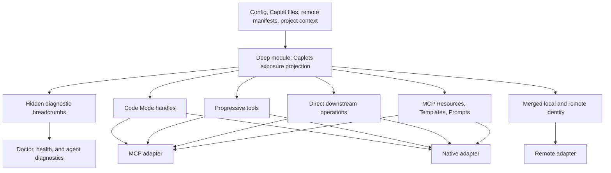
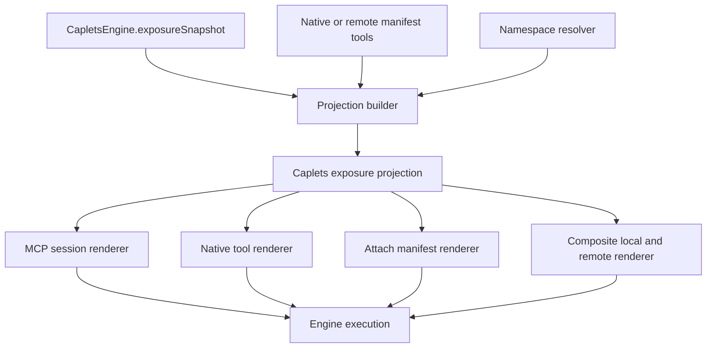
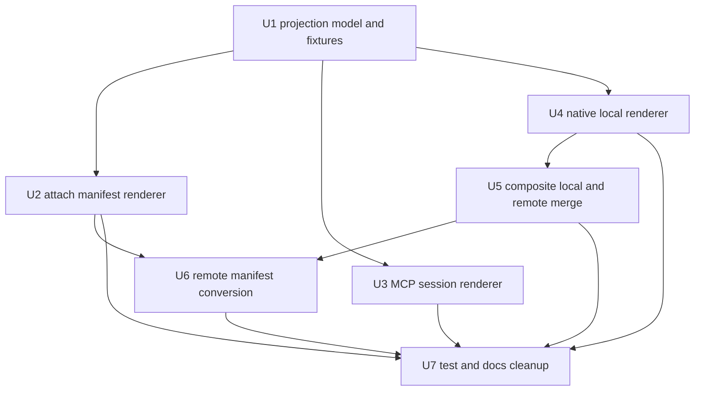
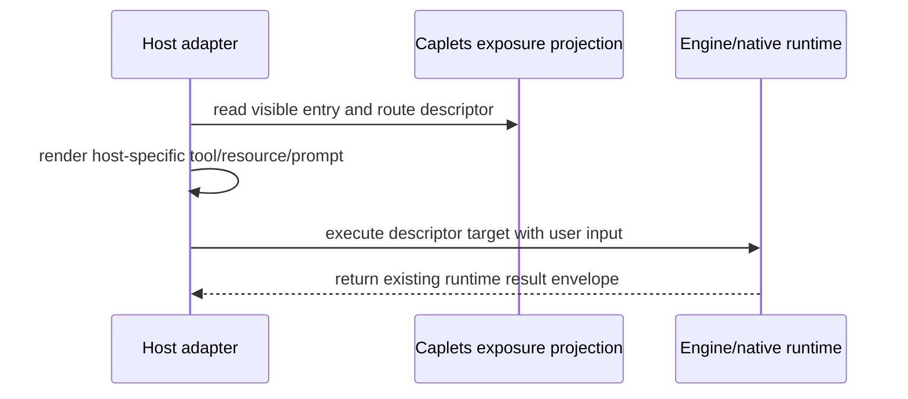

# Caplets Exposure Projection - Plan

## Goal Capsule

- **Objective:** Deepen Caplets exposure projection into the single source of truth for exposed Caplets across MCP, native, and remote host adapters.
- **Product authority:** Product Contract below is the WHAT; ADR-0001 keeps Code Mode as the default exposure; ADR-0002 stays out of scope.
- **Execution profile:** Cross-surface refactor in `packages/core`, implemented characterization-first with projection tests taking over policy coverage before adapter rewrites land.
- **Stop conditions:** Stop and re-plan if route descriptors require moving actual execution into the projection module, if Code Mode default exposure semantics change, or if namespace shadowing behavior would change rather than move.
- **Tail ownership:** Update tests and architecture docs in the same branch; no release notes or changeset unless implementation changes user-visible behavior beyond preserving existing contracts.

---

## Product Contract

### Summary

Create a deep Caplets exposure projection module that resolves callable surfaces, hidden diagnostic breadcrumbs, MCP non-tool surfaces, and local/remote merge-shadowing decisions behind one interface.
Host adapters render that projection and pass route descriptors back to runtime execution; they do not re-own exposure policy.

### Problem Frame

Caplets currently exposes the same capability model through local MCP serving, native integrations, and remote attach or stacked runtime paths.
The existing exposure seam is shallow: discovery produces useful data, but adapters still reconstruct parts of naming, direct routes, Code Mode markers, MCP primitive tools, hidden states, and local/remote merge behavior.
That weakens locality because an exposure bug can live in any adapter, and it weakens leverage because tests must repeat the same policy expectations through several adapter-shaped fixtures.

The desired refactor supports the product strategy by keeping the agent-facing surface small and dependable while preserving exact backend semantics across local, remote, Cloud, and native setups.

### Key Decisions

- **Projection only, not execution.** The deep module owns identity, availability, diagnostic breadcrumbs, and route metadata; actual tool calls, Code Mode runs, resource reads, prompt calls, and completion remain engine/native runtime execution concerns.
- **Snapshot required.** Adapters should render from the last resolved Caplets exposure projection instead of guessing from config during cold start or reload.
- **MCP non-tool surfaces are first-class.** MCP Resources, MCP Resource Templates, prompts, and completion-related affordances belong in the projection even when each host adapter renders them differently.
- **Hidden Caplets stay non-callable but diagnosable.** Hidden entries must never appear in the callable surface, but the projection should carry safe breadcrumbs that let agents and users diagnose setup, Project Binding, discovery, quarantine, and empty-surface problems.
- **Local/remote merge lives behind the seam.** The projection owns shadowing, namespace-qualified identity, and local/remote merge outcomes so native, remote, and stacked runtime adapters do not implement competing precedence models.
- **Projection tests become the primary test surface.** Adapter tests should verify rendering from projection fixtures; policy tests should target the projection interface directly.

### Requirements

**Projection contract**

- R1. The Caplets exposure projection must represent every exposed Caplet surface needed by local MCP, local native, remote attach, and stacked remote runtime adapters.
- R2. The projection must classify Code Mode handles, progressive tools, direct downstream operations, MCP Resources, MCP Resource Templates, prompts, and completion affordances without requiring adapters to rediscover their exposure mode.
- R3. Projected callable entries must carry route descriptors and metadata, not executable callbacks.
- R4. The projection interface must be small enough that tests can validate exposure policy without constructing a full host adapter.

**Freshness and diagnostics**

- R5. Host adapters must render from a resolved projection snapshot rather than independently falling back to enabled Caplets from config.
- R6. A stale or unavailable projection must be represented explicitly so adapters can report availability state without inventing exposure behavior.
- R7. Hidden Caplets must be absent from callable entries while retaining safe diagnostic breadcrumbs for agent/user troubleshooting.
- R8. Diagnostic breadcrumbs must explain why a Caplet is hidden at a product level, such as setup required, Project Binding missing, Project Binding quarantined, discovery failed, or empty surface.

**Adapter coverage**

- R9. Local MCP serving must render its Code Mode tool, progressive tools, direct tools, resources, resource templates, and prompts from the projection.
- R10. Native integrations must render progressive tools, direct operation tools, Code Mode run entries, and MCP primitive affordances from the projection.
- R11. Remote attach and stacked remote runtime paths must derive their manifest-visible capabilities and Code Mode handles from the same projection model.
- R12. Adapters may format projected entries differently, but they must not apply independent exposure policy after receiving the projection.

**Local/remote merge and shadowing**

- R13. The projection must own local/remote merge outcomes for forbid, allow, and namespace shadowing policies.
- R14. Namespace-qualified Caplet IDs must be the same across Code Mode handles, progressive exposure, direct native tool names, direct MCP entries, and remote manifest entries.
- R15. Bare IDs removed by namespace collision must remain unavailable across all projected callable surfaces.
- R16. Non-colliding Caplets must keep stable unqualified IDs unless another accepted policy says otherwise.

**Testing and migration**

- R17. Existing adapter tests that currently assert exposure policy should be narrowed or replaced by projection-interface tests.
- R18. Adapter tests should use projection fixtures to verify host-specific rendering and route-descriptor handoff only.
- R19. The refactor must preserve ADR-0001: Code Mode remains the default exposure and progressive/direct modes remain supported alternatives.
- R20. The refactor must not change Media artifact behavior, backend auth semantics, or Code Mode execution behavior.

### Conceptual Diagram

The diagram shows the intended authority flow, not an implementation sequence.

### Acceptance Examples

- AE1. **Covers R1, R2, R9.** Given a runtime with Code Mode, progressive, direct tools, resources, and prompts, when local MCP serving renders its agent surface, then every visible item comes from the Caplets exposure projection.
- AE2. **Covers R3, R12.** Given a projected direct operation, when a native adapter renders it, then the adapter emits a host-shaped tool whose execution path uses the projection route descriptor rather than a callback owned by the projection.
- AE3. **Covers R5, R6.** Given projection discovery has not completed or the last projection is stale, when an adapter is asked for its surface, then it reports explicit projection availability state rather than guessing from config.
- AE4. **Covers R7, R8.** Given a Project Binding-required Caplet lacks project context, when projection resolves, then the Caplet is missing from callable entries and appears in diagnostic breadcrumbs with a safe reason.
- AE5. **Covers R10, R11.** Given an MCP backend exposes resources and prompts, when native and remote adapters render their surfaces, then both derive their resource/prompt-related affordances from first-class projection entries.
- AE6. **Covers R13, R15.** Given local and remote Caplets collide under namespace shadowing, when projection resolves, then only qualified IDs appear and the bare ID is absent across all callable surfaces.
- AE7. **Covers R17, R18.** Given a policy regression in namespace handling, when projection-interface tests run, then the failure appears without needing MCP, native, and remote adapter tests to each recreate the policy case.

### Scope Boundaries

- Do not move Code Mode execution, direct tool execution, resource reads, prompt calls, or completion execution into the projection module.
- Do not redesign backend managers, Media artifact handling, Caplets Vault, or Code Mode sandbox behavior.
- Do not revisit ADR-0001 or ADR-0002; this refactor should support those decisions.
- Do not change Namespace Shadowing product behavior beyond centralizing where the behavior is projected.

### Dependencies / Assumptions

- ADR-0001 makes Code Mode the default exposure and requires product/docs/tests to preserve Code Mode-first behavior.
- Namespace Shadowing already defines collision outcomes that the projection must preserve.
- Stacked Remote Runtime planning already expects local/upstream composition to reuse the existing native remote composition path rather than create a second precedence model.
- The domain glossary now names Caplets exposure projection as the resolved runtime view of local and remote exposed surfaces plus hidden diagnostic breadcrumbs.

### Sources / Research

- `CONTEXT.md` defines Caplets exposure projection, Code Mode, Media artifact, Caplets Vault, and Google Discovery API backend vocabulary.
- `STRATEGY.md` frames Caplets as a Code Mode-first capability layer for coding agents.
- `docs/adr/0001-code-mode-default-exposure.md` records Code Mode as the default exposure decision.
- `docs/adr/0002-media-artifacts-for-non-inline-results.md` records the Media artifact result contract and is intentionally out of scope here.
- `docs/brainstorms/2026-06-23-namespace-shadowing-policy-requirements.md` defines namespace collision behavior across exposure modes.
- `docs/plans/2026-06-23-002-feat-stacked-remote-runtime-plan.md` expects stacked mode to preserve local/upstream composition and shadowing behavior.
- `docs/solutions/architecture-patterns/code-mode-repl-sessions.md` separates live state, identity, and recovery state; this plan mirrors that discipline by separating projection route identity from execution.
- `docs/solutions/integration-issues/stale-remote-profile-credentials-refresh.md` warns against long-lived native remote clients holding stale runtime options; projection refresh must preserve refreshed runtime option behavior.
- `docs/solutions/integration-issues/vault-cli-runtime-integration-fixes.md` shows that adjacent execution surfaces drift when shared runtime policy is not centralized.
- `packages/core/src/exposure/discovery.ts` is the current exposure discovery module.
- `packages/core/src/exposure/namespace.ts` is the current namespace shadowing resolver.
- `packages/core/src/attach/api.ts`, `packages/core/src/serve/session.ts`, `packages/core/src/native/service.ts`, and `packages/core/src/native/remote.ts` are current adapter paths with exposure rendering responsibilities.

---

## Planning Contract

### Product Contract Preservation

Product Contract unchanged.

### Key Technical Decisions

- KTD1. **Wrap the current exposure snapshot before replacing adapters.** Start by creating a projection module that can consume the current `ExposureSnapshot` and emit adapter-neutral entries; this keeps the deletion test honest because later units can remove duplicated adapter policy rather than invent a second resolver.
- KTD2. **Use route descriptors as the projection interface.** Projected entries should name the visible ID, source Caplet ID, downstream operation or MCP surface, exposure mode, schema metadata, annotations, shadowing policy, and diagnostic state; they should not hold callbacks or runtime service references.
- KTD3. **Model MCP non-tool surfaces beside tools.** Resources, resource templates, prompts, and completion affordances should be first-class projection entries so native primitive tools, attach manifest exports, and MCP resources render from the same surface authority.
- KTD4. **Move local/remote merge into the projection seam.** The native composite merge currently owns suppression, namespace qualification, Code Mode merge, and route mapping; this should become projection logic so remote attach, native tools, and stacked runtime share one identity outcome.
- KTD5. **Expose projection availability explicitly.** Native and remote adapters should track projection readiness or last-known-good projection state instead of reconstructing visible tools from config while asynchronous discovery is pending.
- KTD6. **Replace duplicated policy tests with projection tests.** Policy cases for default Code Mode exposure, hidden Caplets, direct resources/prompts, namespace collisions, and source Caplet routing belong in projection tests; adapter tests should prove host rendering and route execution only.

### High-Level Technical Design

#### Projection topology

The projection builder is the only module that interprets exposure policy after backend discovery.
Renderers can format for their host, but they consume already-resolved projection entries.

#### Migration sequence

The sequence moves the easiest snapshot consumer first, then the local adapters, then the composite merge with namespace routing.

#### Route descriptor flow

Projection decides what exists and how it is named.
Runtime execution remains outside the projection seam.

### Assumptions

- `packages/core/src/attach/api.ts` can be a first migration target because it already has explicit manifest projection types and route maps.
- Native composite merge behavior can move behind the projection seam without changing public `NativeCapletsService` methods.
- Existing focused test suites are sufficient for characterization; no live backend credentials are needed for this refactor.

### System-Wide Impact

- **Agent surface parity:** Code Mode handles, progressive tools, direct tools, MCP resources/prompts, and remote manifest entries must show the same resolved Caplet identity.
- **Diagnostics:** Hidden Caplet breadcrumbs should improve `attach` and agent diagnostics without widening callable surfaces.
- **Telemetry:** Execution telemetry should remain attached to engine/native execution paths; projection rendering should not create new activation events.
- **Remote runtime:** Composite local/remote projection must preserve refreshed runtime options, attach session lifecycle, and Project Binding degradation behavior.

### Risks and Mitigations

| Risk                                                                                              | Mitigation                                                                                                                                        |
| ------------------------------------------------------------------------------------------------- | ------------------------------------------------------------------------------------------------------------------------------------------------- |
| Projection module becomes another shallow layer over `ExposureSnapshot`.                          | Require U2-U5 to delete or narrow duplicated adapter policy tests as each renderer moves.                                                         |
| Route descriptors underspecify execution and force adapters to recover hidden state.              | Start with attach route map parity and native route parity tests before moving renderers.                                                         |
| Native remote last-known-good behavior regresses when snapshot fallback is removed.               | Preserve explicit stale/last-known-good projection state and test listener behavior.                                                              |
| Namespace alternatives drift between Code Mode and direct tools.                                  | Move namespace rewriting into projection tests that assert all exposed surfaces together.                                                         |
| Adapter refactor changes public tool names or schemas.                                            | Characterize current MCP/native/attach output before each adapter migration.                                                                      |
| Hidden diagnostic breadcrumbs expose raw backend errors, credential hints, or filesystem details. | Keep breadcrumbs to product-level reason codes and safe summaries; add projection tests that reject raw exception text, secrets, and local paths. |

### Documentation and Operational Notes

- Update `docs/architecture.md` after implementation so it names Caplets exposure projection as the shared surface authority.
- Update public docs only if user-visible behavior or diagnostics change; pure internal refactor does not require new product docs.
- Add a changeset only if the implementation changes package-observable behavior, diagnostics, or exported types.

---

## Implementation Units

### U1. Define projection model and snapshot builder

- **Goal:** Create the deep projection module that converts current exposure discovery output into adapter-neutral visible entries, hidden breadcrumbs, availability state, and route descriptors.
- **Requirements:** R1, R2, R3, R4, R7, R8, R19
- **Dependencies:** None
- **Files:** `packages/core/src/exposure/projection.ts`, `packages/core/src/exposure/discovery.ts`, `packages/core/src/exposure/index.ts`, `packages/core/test/exposure-projection.test.ts`, `packages/core/test/exposure-discovery.test.ts`
- **Approach:** Introduce a projection type that wraps `ExposureSnapshot` without changing behavior. Include entry kinds for progressive Caplets, Code Mode Caplets, direct tools, MCP resources, MCP resource templates, prompts, completions, and hidden diagnostics. Keep execution as route data that points back to existing engine/native execution methods. Preserve `discoverExposureSnapshot` as the backend discovery source during this unit.
- **Execution note:** Start with characterization tests built from existing `ExposureSnapshot` fixtures before adding the projection builder.
- **Patterns to follow:** `packages/core/src/exposure/discovery.ts` for hidden Caplet reasons; `packages/core/src/attach/api.ts` for stable export and route separation; `packages/core/src/exposure/direct-names.ts` for direct naming helpers.
- **Test scenarios:**
  - Covers AE1. Given a mixed snapshot with progressive, Code Mode, direct tools, resources, templates, and prompts, projection returns all expected entry kinds with stable visible IDs.
  - Covers AE2. Given a direct tool entry, projection returns a route descriptor with Caplet ID and downstream name but no executable callback.
  - Covers AE4. Given hidden Caplets with Project Binding and discovery failures, projection emits diagnostic breadcrumbs and no callable entries for those Caplets.
  - Given discovery failures include raw backend error details, projection emits safe diagnostic reason codes and summaries without secrets, credential values, or local filesystem paths.
  - Given `discoverNonDirectMcpSurfaces: false`, projection preserves empty non-direct MCP surface behavior rather than inventing resources or prompts.
  - Given direct resource templates with similar downstream templates, projection keeps their projected identities unique.
- **Verification:** Projection tests prove policy and entry-shape behavior without constructing MCP, native, or remote adapters.

### U2. Render attach manifests from projection

- **Goal:** Move attach manifest construction onto Caplets exposure projection while preserving manifest revision stability, route maps, hidden diagnostics, and invocation behavior.
- **Requirements:** R1, R2, R3, R7, R8, R11, R12, R18, R19
- **Dependencies:** U1
- **Files:** `packages/core/src/attach/api.ts`, `packages/core/src/serve/http.ts`, `packages/core/test/attach-api.test.ts`, `packages/core/test/serve-http.test.ts`
- **Approach:** Replace direct `ExposureSnapshot` reads inside `buildAttachProjection` with projection entries. Keep the existing `AttachProjection` manifest and `routes` contract stable for callers. Convert completion exports, prompt/resource/template exports, direct tool exports, progressive Caplet exports, Code Mode Caplet exports, and diagnostics from projection data instead of snapshot arrays.
- **Execution note:** Characterize current manifest revision hashing and route invocation before changing export construction.
- **Patterns to follow:** Existing `sortAttachProjectionInput`, `withRevisionExportIds`, and `routesFor` functions in `packages/core/src/attach/api.ts`.
- **Test scenarios:**
  - Covers AE1. Given the current mixed fixture, attach manifest exports all visible projection entries with the same stable IDs and revision behavior as before.
  - Covers AE4. Given hidden Project Binding Caplets, attach diagnostics still include authoritative Project Binding metadata.
  - Covers AE5. Given projected resources, resource templates, prompts, and completions, attach manifest exports them and invokes them through existing route kinds.
  - Given a stale manifest revision, invoke still returns the existing stale-manifest error path.
  - Given native attach projection inputs, existing native attach behavior remains compatible until native moves onto the shared projection in U4-U5.
- **Verification:** `packages/core/test/attach-api.test.ts` covers manifest shape, diagnostics, route invocation, stale revision handling, and direct/MCP non-tool surfaces through projection data.

### U3. Render local MCP sessions from projection

- **Goal:** Make local MCP serving register Code Mode, progressive tools, direct tools, resources, resource templates, and prompts from Caplets exposure projection.
- **Requirements:** R1, R2, R3, R5, R9, R12, R18, R19
- **Dependencies:** U1
- **Files:** `packages/core/src/serve/session.ts`, `packages/core/src/serve/http.ts`, `packages/core/src/serve/index.ts`, `packages/core/test/serve-session.test.ts`, `packages/core/test/code-mode-mcp.test.ts`
- **Approach:** Change `CapletsMcpSession.reconcileFromSnapshot` into projection reconciliation. Keep registration objects and callbacks in the MCP adapter, but derive desired registrations from projection entries. Preserve Code Mode run tool registration when projection has Code Mode Caplets. Preserve direct resource and prompt callbacks by routing descriptors to existing engine methods.
- **Execution note:** Add failing tests that render from a projection fixture before replacing snapshot array loops.
- **Patterns to follow:** Existing registration diffing in `CapletsMcpSession.reconcileFromSnapshot`; `directResourceResult` for wrapping non-MCP resource read results; `codeModeRunToolDescription` for Code Mode prompt guidance.
- **Test scenarios:**
  - Covers AE1. Given a projection with all entry kinds, MCP session registers one Code Mode tool, progressive tools, direct tools, direct resources, direct resource templates, and direct prompts.
  - Covers AE2. Given a projected direct tool route, registered MCP callback calls the engine direct execution path with the downstream name from the route descriptor.
  - Covers AE3. Given projection unavailable state, MCP registration does not guess tools from config and exposes only the documented availability behavior.
  - Given a reload changes projection entries, removed MCP tools/resources/prompts are unregistered and updated ones are refreshed.
  - Given a projection with no Code Mode Caplets, the Code Mode tool is removed.
- **Verification:** MCP session tests prove rendering and reconciliation from projection fixtures, while Code Mode MCP tests prove Code Mode execution remains routed through `runCodeMode` unchanged.

### U4. Render local native tools from projection

- **Goal:** Make local native integration tool listing consume Caplets exposure projection instead of recomputing exposure from enabled config and partial discovery state.
- **Requirements:** R1, R2, R3, R5, R6, R10, R12, R18, R19
- **Dependencies:** U1
- **Files:** `packages/core/src/native/service.ts`, `packages/core/src/native/tools.ts`, `packages/core/src/native/options.ts`, `packages/core/test/native.test.ts`
- **Approach:** Replace local `listTools` exposure loops with a native renderer that consumes projection entries. Preserve native tool naming, direct route IDs, prompt guidance, Code Mode run tool shape, and `directToolRoutes` behavior. Represent pending, stale, or failed projection refresh explicitly so native tools do not fall back to config-derived guesses.
- **Execution note:** Characterize native tool listing before changing the cold-start and reload paths because current tests assert both direct discovery and default Code Mode exposure.
- **Patterns to follow:** `progressiveNativeTool`, `directNativeTool`, `codeModeRunNativeTool`, and `codeModeCallableNativeTools` in `packages/core/src/native/service.ts`.
- **Test scenarios:**
  - Covers AE1. Given a projection with progressive, direct, and Code Mode entries, native list returns the same visible native tools as current behavior.
  - Covers AE2. Given a projected direct route, native execution uses the stored route descriptor and existing engine direct execution path.
  - Covers AE3. Given projection refresh has not resolved, native list does not synthesize enabled config entries and reports the planned availability state.
  - Covers AE5. Given projected MCP resources/prompts, native renderer creates primitive resource and prompt tools without recomputing surface presence.
  - Given watched config changes alter projection, native tools-changed listeners fire only when rendered native tools change.
  - Given direct Google Discovery and HTTP Caplets, native direct operation schemas and annotations remain unchanged.
- **Verification:** Native tests prove local projection rendering, direct execution routes, listener behavior, default Code Mode exposure, and MCP primitive rendering without duplicated exposure policy assertions.

### U5. Move composite local/remote merge into projection

- **Goal:** Put local/remote suppression, namespace qualification, Code Mode merge, source Caplet routing, and namespace diagnostics behind the Caplets exposure projection seam.
- **Requirements:** R1, R3, R11, R12, R13, R14, R15, R16, R18, R19
- **Dependencies:** U1, U4
- **Files:** `packages/core/src/exposure/projection.ts`, `packages/core/src/exposure/namespace.ts`, `packages/core/src/native/service.ts`, `packages/core/src/native/remote.ts`, `packages/core/test/exposure-projection.test.ts`, `packages/core/test/exposure-namespace.test.ts`, `packages/core/test/native-remote.test.ts`
- **Approach:** Extract the core of `CompositeNativeCapletsService.mergeTools`, `resolveVisibleToolIds`, `nativeNamespaceEntries`, and direct-tool renaming into projection-level merge functions. Feed local projection entries and remote manifest-derived projection entries into one merge. Keep composite native execution routes as route descriptors that choose local or remote execution at the native service layer.
- **Execution note:** Add projection-level tests for each existing namespace/shadowing native-remote scenario before deleting adapter-owned merge logic.
- **Patterns to follow:** `resolveNamespaceExposure` in `packages/core/src/exposure/namespace.ts`; native remote tests around forbid, allow, namespace, Code Mode-only collisions, direct-tool alternatives, and Project Binding degradation.
- **Test scenarios:**
  - Covers AE6. Given local and remote Caplets collide under namespace shadowing, projection exposes only qualified alternatives across progressive, direct, and Code Mode entries.
  - Given remote `forbid`, projection suppresses matching local progressive, direct, and Code Mode entries while retaining remote entries.
  - Given remote `allow`, projection keeps local overlay routes visible and executable.
  - Given namespace-generated IDs collide with a bare ID, projection fails closed with diagnostic breadcrumbs and no ambiguous callable entries.
  - Given local and remote direct tools share a source Caplet, projection preserves source Caplet ID and rewritten direct tool alternatives.
  - Given upstream Project Binding is unavailable in stacked mode, projection keeps safe local and non-project upstream entries available with diagnostics.
- **Verification:** Projection tests own merge policy; native-remote tests prove the composite renderer still routes local and remote execution correctly with last-known-good behavior.

### U6. Convert remote manifest tooling onto projection entries

- **Goal:** Make remote attach manifest parsing and standalone remote native tooling feed projection-compatible entries instead of reconstructing primitive tools and Code Mode markers independently.
- **Requirements:** R2, R3, R10, R11, R12, R14, R18, R19
- **Dependencies:** U2, U5
- **Files:** `packages/core/src/native/remote.ts`, `packages/core/src/attach/api.ts`, `packages/core/src/native/service.ts`, `packages/core/test/native-remote.test.ts`, `packages/core/test/attach-api.test.ts`
- **Approach:** Replace `toolsFromManifest`, `primitiveToolsFromManifest`, and remote Code Mode marker logic with projection-compatible manifest conversion. Preserve older attach manifest compatibility and standalone remote service behavior. Keep stale-manifest retry and credential refresh behavior outside projection and covered by existing tests.
- **Execution note:** Preserve older manifest compatibility tests before switching conversion logic because remote clients may connect to older hosts.
- **Patterns to follow:** `buildAttachProjection` export shapes in `packages/core/src/attach/api.ts`; stale manifest and credential-refresh tests in `packages/core/test/native-remote.test.ts`.
- **Test scenarios:**
  - Covers AE5. Given remote manifest resources, resource templates, prompts, and completions, remote native tools derive primitive affordances from projection entries.
  - Given a direct tool name ends with a primitive suffix, exact direct tool exports still win over generated primitive affordances.
  - Given an older attach manifest lacks Code Mode caplet entries, remote client preserves fallback behavior.
  - Given refreshed remote profile credentials, manifest polling and attach event reconnects continue using refreshed runtime options.
  - Given a standalone remote native service exposes Code Mode handles, local Code Mode declarations still include only code-mode-callable Caplets.
- **Verification:** Remote native tests prove manifest conversion, primitive affordance rendering, stale retry behavior, and Code Mode handle scoping remain compatible.

### U7. Retire duplicated policy tests and update architecture docs

- **Goal:** Complete the deletion test by removing or narrowing adapter tests that only restate projection policy, then document Caplets exposure projection as the shared authority.
- **Requirements:** R4, R17, R18, R19, R20
- **Dependencies:** U2, U3, U4, U5, U6
- **Files:** `packages/core/test/exposure-projection.test.ts`, `packages/core/test/exposure-discovery.test.ts`, `packages/core/test/serve-session.test.ts`, `packages/core/test/native.test.ts`, `packages/core/test/native-remote.test.ts`, `packages/core/test/attach-api.test.ts`, `docs/architecture.md`, `CONCEPTS.md`, `CONTEXT.md`
- **Approach:** Audit tests moved by U2-U6 and keep only adapter tests that prove rendering, registration lifecycle, route execution, stale state handling, and host compatibility. Move remaining policy assertions into `exposure-projection.test.ts`. Update architecture docs and glossary only where the implemented module changes durable vocabulary or architecture.
- **Execution note:** Run this unit after adapter migrations so deleted tests are replaced by stronger projection coverage, not merely removed.
- **Patterns to follow:** Project test quality bar in `AGENTS.md`; existing `docs/architecture.md` runtime layer summary.
- **Test scenarios:**
  - Covers AE7. Given a namespace policy regression, projection tests fail even if adapter rendering tests are not run.
  - Given adapter rendering tests use projection fixtures, those tests fail only for host-format or route-handoff regressions.
  - Given docs mention exposure policy, architecture docs point readers at Caplets exposure projection rather than adapter-specific logic.
  - Given `CONTEXT.md` and `CONCEPTS.md` already define Caplets Exposure Projection, no duplicate or conflicting vocabulary is introduced.
- **Verification:** Test suite coverage is stronger at the projection seam, adapter tests are narrower, and docs name the new module without claiming behavior changes that did not occur.

---

## Verification Contract

| Gate                                                                                             | Applies to        | Done signal                                                                                      |
| ------------------------------------------------------------------------------------------------ | ----------------- | ------------------------------------------------------------------------------------------------ |
| `pnpm --filter @caplets/core test -- test/exposure-projection.test.ts`                           | U1, U5, U7        | Projection policy tests pass and own the deep module interface.                                  |
| `pnpm --filter @caplets/core test -- test/attach-api.test.ts`                                    | U2, U6            | Attach manifest rendering, routes, diagnostics, and stale revision behavior pass.                |
| `pnpm --filter @caplets/core test -- test/serve-session.test.ts test/code-mode-mcp.test.ts`      | U3                | MCP registration and Code Mode MCP execution pass.                                               |
| `pnpm --filter @caplets/core test -- test/native.test.ts`                                        | U4                | Local native rendering, listeners, direct routes, and Code Mode default exposure pass.           |
| `pnpm --filter @caplets/core test -- test/native-remote.test.ts test/exposure-namespace.test.ts` | U5, U6            | Composite local/remote merge, namespace, stale manifest, and remote compatibility behavior pass. |
| `pnpm --filter @caplets/core test`                                                               | Whole plan        | Core package regression suite passes after all units.                                            |
| `pnpm typecheck`                                                                                 | Whole plan        | New projection types and imports typecheck across packages.                                      |
| `pnpm docs:check`                                                                                | U7                | Generated/public docs remain in sync if docs were changed.                                       |
| `pnpm verify`                                                                                    | Final pre-PR gate | Full repository gate passes before shipping.                                                     |

---

## Definition of Done

- All Product Contract requirements R1-R20 are satisfied or explicitly re-planned with user approval.
- All acceptance examples AE1-AE7 are covered by projection, adapter, or remote tests.
- `packages/core/src/exposure/projection.ts` or equivalent becomes the only module that owns exposure identity, hidden breadcrumbs, MCP non-tool surface classification, and local/remote merge policy.
- MCP, native, and remote adapters render projection entries and do not independently apply exposure policy after projection resolution.
- Route descriptors preserve existing execution ownership in engine/native runtime paths.
- Adapter tests that only restated projection policy are deleted or narrowed after replacement projection tests exist.
- Documentation and glossary entries use Caplets exposure projection vocabulary consistently.
- Abandoned intermediate adapters, compatibility shims, and dead helper functions from the refactor are removed before final verification.
