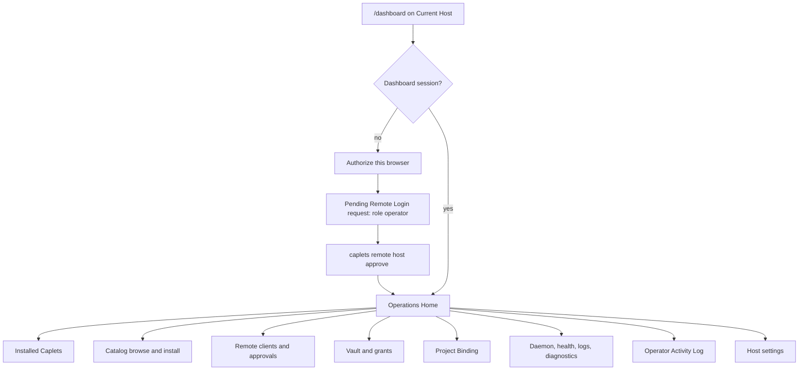
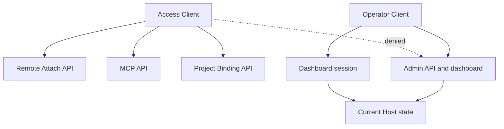
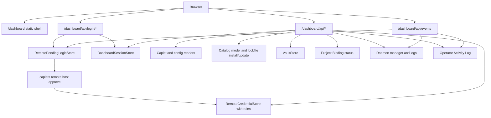
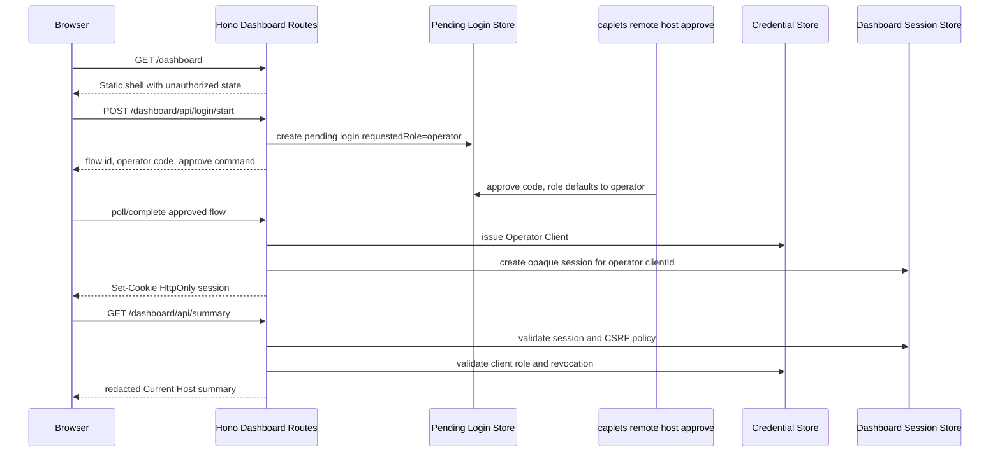

# Caplets Admin Dashboard - Plan

## Goal Capsule

- **Objective:** Add a browser-based Caplets Admin Dashboard served by the same Caplets HTTP runtime that owns MCP, attach, admin, and Project Binding APIs.
- **Product authority:** `STRATEGY.md` frames Caplets around runtime diagnosability, remote auth, Project Binding, and Code Mode-first capability management; `CONCEPTS.md` defines the Current Host, Caplets Admin Dashboard, Remote Client Role, Access Client, Operator Client, and Operator Activity Log; `docs/adr/0003-remote-client-role-boundaries.md` establishes the access/operator authorization split.
- **Open blockers:** None for implementation planning.

---

## Product Contract

### Summary

Caplets should expose an admin dashboard at the Current Host so an operator can manage Caplets, catalog installs, remote clients, Vault, Project Binding state, runtime health, logs, and diagnostics without dropping to the CLI for every action.
The first release administers only the Current Host, while the domain model and UI language stay host-scoped so future multi-host views can enumerate and switch hosts without redefining authority.

### Problem Frame

Caplets already has CLI and HTTP surfaces for remote attach, MCP access, admin control, Project Binding, Vault management, catalog installation, and host approval flows.
Those capabilities are powerful but fragmented across commands and protocols, which makes the live runtime hard to inspect and operate from a browser.

Remote access also has an authorization problem to correct before a dashboard can be safe: current self-hosted access credentials validate as bearer tokens for broad protected routes, including admin control.
Dashboard access should not make ordinary attach credentials more powerful; ordinary Access Clients should be narrowed to runtime access, while Operator Clients should hold host administration authority.

### Key Decisions

- **Serve the dashboard from the Caplets host.** The dashboard is part of the existing HTTP runtime, not a separate service or separate approval system.
- **Administer the Current Host first.** V1 manages the host that served the dashboard session, while host identity remains visible and all authority is scoped per host for later multi-host work.
- **Split remote client authority by role.** Access Clients can use Remote Attach, MCP, and Project Binding APIs; Operator Clients can use dashboard and host administration surfaces.
- **Keep the existing approval lane.** Dashboard authorization requests become Pending Remote Logins with requested role `operator`, and `caplets remote host approve` grants the requested role by default while allowing override.
- **Hide credential material from browser JavaScript.** The browser uses a server-managed dashboard session, while operator bearer and refresh material remain inaccessible to page scripts.
- **Use structured administration, not raw editing.** The dashboard drives catalog install/update, backend/auth setup, Vault, Project Binding, diagnostics, and client administration through explicit operations rather than a config or Caplet file editor.
- **Treat Raw Vault Reveal as a human operator ceremony.** Reveal is included, but only through a dedicated Operator Client action with confirmation, timer, copy, and auto-hide behavior.
- **Make catalog install a primary workflow.** Catalog browsing, inspection, install readiness, setup requirements, warnings, and lockfile-aware update state are first-class dashboard concerns.
- **Record sensitive operator actions.** The Operator Activity Log answers what changed, when it changed, and which Operator Client performed the action without becoming a full compliance audit system.

### Actors

- A1. Current Host Operator: the human managing a Caplets host from the dashboard.
- A2. Server-Local Approver: the human or shell session able to run `caplets remote host approve`, `deny`, and `revoke` on the host machine.
- A3. Browser Dashboard Session: the authenticated browser session for the dashboard UI.
- A4. Access Client: a paired client authorized only for Remote Attach, MCP, and Project Binding.
- A5. Operator Client: a paired client authorized for dashboard and admin operations on a host.
- A6. Caplets Host Runtime: the Hono-based HTTP runtime serving MCP, attach, admin, Project Binding, dashboard, health, and remote-login routes.
- A7. Agent Client: an MCP, attach, or native integration consuming Caplets capabilities.
- A8. Catalog Source: the official or future indexed catalog data used for dashboard browse, inspect, install, and update workflows.

### Requirements

**Dashboard Surface And Host Scope**

- R1. The dashboard must be served by the Caplets HTTP runtime that already serves MCP, attach, admin, Project Binding, remote-login, and health routes.
- R2. The dashboard must have a stable browser entrypoint under the configured Caplets base URL, with `/dashboard` as the product path unless planning finds a conflicting route constraint.
- R3. The dashboard must clearly show the Current Host identity, including enough URL or runtime identity to distinguish which host is being administered.
- R4. V1 dashboard actions must administer only the Current Host.
- R5. The UI and domain language must avoid treating the host as a global singleton, so future multi-host enumeration and switching can reuse the same role and activity concepts.
- R6. Upstream, stacked, Cloud, or connected remote runtimes may appear as connected state, but V1 must not administer those hosts through this dashboard.

**Authorization And Roles**

- R7. Remote Client Roles must distinguish Access Clients from Operator Clients in server-owned credential state.
- R8. Access Clients must be authorized for Remote Attach, MCP, and Project Binding access only.
- R9. Access Clients must not authorize dashboard access, remote-client administration, catalog install or update, Vault administration, Raw Vault Reveal, or generic admin control.
- R10. Operator Clients must authorize dashboard and host administration operations against the host that issued the credentials.
- R11. Admin-control routes must require Operator Client authority, including read-only remote-control commands.
- R12. Access Clients must continue to inspect callable capability surfaces through MCP and attach surfaces rather than admin control.
- R13. Dashboard authorization must use the existing Pending Remote Login approval model instead of adding a separate dashboard approval command.
- R14. An unauthenticated browser request to the dashboard must show an authorization affordance and an approval command using the existing `caplets remote host approve <code>` lane after the user requests access.
- R15. Pending dashboard login requests must identify the requested role as operator in server-local approval surfaces.
- R16. The approval command must grant the requested role by default and allow the Server-Local Approver to override or downgrade the role.
- R17. Dashboard browser sessions must use server-managed session state so page JavaScript cannot read operator bearer tokens or refresh credentials.
- R18. Dashboard logout or revocation must invalidate the dashboard session without disrupting unrelated clients.

**Operations Home And Navigation**

- R19. The default screen must be an Operations Home focused on runtime status, pending attention, and the most important host administration actions.
- R20. Operations Home must link into Caplets, Catalog, Access, Vault, Project Binding, Daemon, Logs, Diagnostics, Activity, and Settings sections.
- R21. The dashboard must prioritize pending approvals, degraded runtime health, missing auth, missing Vault grants, Project Binding problems, catalog updates, and failing Caplets ahead of neutral inventory.
- R22. Every dashboard section must remain usable on mobile, including approval, revocation, catalog install/update, Vault management, reveal, logs, diagnostics, and settings.
- R23. Dense desktop layouts may use tables or split panes, but mobile must provide equivalent actions without horizontal-only workflows.

**Caplets And Catalog Management**

- R24. The dashboard must list installed Caplets with health, exposure status, source, config origin, auth readiness, Vault grant readiness, Project Binding readiness, and available update state where known.
- R25. The dashboard must support structured Caplet lifecycle actions that already exist or have CLI equivalents, including install, update, add backend, configure auth, validate, inspect, and remove where supported.
- R26. The dashboard must browse and search catalog Caplets without forcing the user to leave the Current Host dashboard.
- R27. Catalog detail views must show install readiness, setup requirements, auth requirements, Vault requirements, Project Binding requirements, warnings, mutating behavior, local-control flags, and the primary Code Mode workflow before install.
- R28. Catalog install must use the same provenance-aware, lockfile-aware lifecycle as CLI catalog installs.
- R29. V1 catalog installs must target the Current Host's global Caplets state.
- R30. Project-scoped catalog installs must be deferred until the dashboard can safely bind a project context and explain that target.
- R31. Catalog updates must surface provenance, local edits, content changes, and risk-increasing changes before applying an update.
- R32. After installing or updating a catalog Caplet, the dashboard must show next required actions such as auth login, Vault set, Vault grant, Project Binding, backend check, or exposure validation.
- R33. The dashboard must not include a raw Caplet file editor or raw config editor in v1.

**Remote Clients And Access Control**

- R34. The dashboard must list paired remote clients with role, label, host URL, status, creation or approval time when known, and revocation state.
- R35. The dashboard must show pending Remote Login requests with requested role, origin details available today, expiry, and approve or deny actions for Operator Clients.
- R36. The dashboard must support approving, denying, revoking, and role-changing remote clients when the current user has Operator Client authority.
- R37. Approve and revoke flows must make the role outcome visible before the action completes.
- R38. Revoking the current dashboard's own Operator Client must terminate the dashboard session cleanly.

**Vault Management**

- R39. The dashboard must list Vault keys, metadata, access grants, missing grants, and Caplet references without exposing raw values by default.
- R40. The dashboard must support setting, deleting, granting, revoking, and listing Vault access for the Current Host.
- R41. Raw Vault Reveal must be available to Operator Clients as a dedicated human dashboard action.
- R42. Raw Vault Reveal must require per-key explicit confirmation, show the value inline for a short timer, provide a copy action, auto-hide the value, and avoid bulk reveal or remember-this-choice behavior.
- R43. Raw Vault Reveal must not be reintroduced through generic remote-control `vault_get reveal=true` behavior.
- R44. Vault errors, logs, activity records, and diagnostics must not leak raw Vault values.

**Project Binding, Daemon, Logs, And Diagnostics**

- R45. The dashboard must show Project Binding state, including healthy, pending, degraded, quarantined, and disconnected states where the runtime can report them.
- R46. Project Binding views must identify affected Caplets and explain recoverable actions without blocking unrelated healthy Caplets.
- R47. The dashboard must show daemon or server status, version, bind/public origin information when available, uptime or restart state when available, and health checks.
- R48. The dashboard may trigger a runtime restart and must show reconnecting state while the browser waits for the host to return.
- R49. The dashboard must not expose stop or uninstall controls for the daemon in v1.
- R50. Logs and diagnostics must support live operator-critical updates for pending logins, paired clients, runtime health, Project Binding state, and logs.
- R51. Catalog browsing, catalog details, and installed Caplet inventory may use ordinary request refresh unless planning identifies a low-cost live update path.

**Operator Activity**

- R52. The dashboard must record sensitive Operator Client actions in a host-owned Operator Activity Log.
- R53. The Operator Activity Log must include approvals, denials, revocations, role changes, catalog installs, catalog updates, Vault set, Vault delete, Vault grant, Vault revoke, and Raw Vault Reveal.
- R54. Activity entries must answer what changed, when it changed, and which Operator Client performed the action.
- R55. Activity entries must avoid recording raw Vault values, bearer credentials, refresh credentials, tool arguments, tool outputs, and private local paths unless a path is already part of safe existing diagnostics.
- R56. The Operator Activity Log must be visible in the dashboard and filterable enough to investigate recent sensitive changes.

### Dashboard Composition



### Role Boundary



### Key Flows

- F1. Browser dashboard authorization
  - **Trigger:** A browser opens the dashboard without an authenticated dashboard session.
  - **Actors:** A1, A2, A3, A5, A6
  - **Steps:** The dashboard denies access, offers "Authorize this browser", creates a Pending Remote Login requesting operator role, shows the existing approval command, waits for approval, then establishes a dashboard session.
  - **Outcome:** The browser can administer the Current Host as an Operator Client without browser JavaScript receiving reusable operator token material.

- F2. Ordinary access client remains non-admin
  - **Trigger:** A CLI attach, MCP, or native client uses an existing Access Client credential.
  - **Actors:** A4, A6, A7
  - **Steps:** The client reaches attach, MCP, and Project Binding surfaces as allowed; the same credential is denied for dashboard and admin operations.
  - **Outcome:** Runtime access continues to work while host administration moves to Operator Clients.

- F3. Operations Home triage
  - **Trigger:** An Operator Client opens the dashboard.
  - **Actors:** A1, A3, A5, A6
  - **Steps:** The dashboard loads Current Host identity, runtime health, pending logins, paired clients, Caplet readiness, catalog updates, Vault issues, Project Binding state, and recent activity.
  - **Outcome:** The operator sees the most urgent host state first and can drill into the right admin section.

- F4. Catalog install with setup follow-through
  - **Trigger:** An operator chooses a catalog Caplet from the dashboard.
  - **Actors:** A1, A3, A5, A6, A8
  - **Steps:** The dashboard shows catalog readiness and warnings, applies a lockfile-aware global install to the Current Host after confirmation, then shows required next actions.
  - **Outcome:** Catalog Caplets become installable from the dashboard without losing provenance, setup guidance, or safety warnings.

- F5. Vault reveal ceremony
  - **Trigger:** An operator requests Raw Vault Reveal for one key.
  - **Actors:** A1, A3, A5, A6
  - **Steps:** The dashboard requires explicit confirmation, reveals only the selected key, starts a short timer, provides copy, then hides the value automatically.
  - **Outcome:** Human recovery is possible without turning generic remote control or agent surfaces into reveal channels.

- F6. Current dashboard client revoked
  - **Trigger:** An operator revokes the Operator Client backing the current dashboard session.
  - **Actors:** A1, A3, A5, A6
  - **Steps:** The dashboard records the revocation, invalidates the current session, and returns the browser to the authorization screen.
  - **Outcome:** Revocation is immediate and understandable, including self-revocation.

- F7. Runtime restart from dashboard
  - **Trigger:** An operator restarts the Caplets runtime from the dashboard.
  - **Actors:** A1, A3, A5, A6
  - **Steps:** The dashboard records the action, initiates restart, shows reconnecting state, polls or listens for health recovery, then reloads Current Host state.
  - **Outcome:** Restart is a controlled recovery action rather than a dead browser screen.

### Acceptance Examples

- AE1. Covers R7-R12. Given a client has an Access Client credential, when it calls attach, MCP, or Project Binding routes, then the request is allowed according to existing runtime rules; when it calls dashboard or admin control, then the request is denied for missing Operator Client authority.
- AE2. Covers R13-R18. Given an unauthenticated browser opens the dashboard and clicks "Authorize this browser", when the Server-Local Approver runs `caplets remote host approve <code>`, then the browser receives an authenticated dashboard session for an Operator Client and no operator bearer token is readable by page JavaScript.
- AE3. Covers R15-R16 and R34-R37. Given a pending dashboard login requests operator role, when the Server-Local Approver lists or reviews pending logins, then the requested role is visible and approval can grant or override that role.
- AE4. Covers R24-R33. Given a catalog Caplet requires auth, Vault, and Project Binding setup, when an operator installs it from the dashboard, then the install uses catalog provenance and the dashboard shows required setup actions before presenting the Caplet as ready.
- AE5. Covers R39-R44. Given an Operator Client reveals a Vault key, when the reveal timer expires or the operator hides the value, then the cleartext disappears from the UI and is absent from activity entries and logs.
- AE6. Covers R34-R38. Given an operator revokes the current dashboard's Operator Client, when the revocation completes, then the dashboard session ends and the browser returns to the authorization screen.
- AE7. Covers R45-R51. Given Project Binding is degraded for one project-bound Caplet, when the dashboard loads, then it shows the degraded state and affected Caplet without marking unrelated Caplets unavailable.
- AE8. Covers R1-R6. Given a future implementation adds multi-host enumeration, when it uses existing dashboard concepts, then Access Client, Operator Client, Current Host, and Operator Activity Log semantics remain valid per host.

### Success Criteria

- The dashboard gives a solo Caplets operator a complete Current Host admin surface for routine access, Caplet, catalog, Vault, Project Binding, runtime, logs, diagnostics, and activity workflows.
- Ordinary attach and MCP clients retain runtime access without retaining host administration authority.
- Dashboard authorization works over a tailnet-accessible Caplets URL using the existing self-hosted host approval command.
- Mobile layouts support the same administrative workflows as desktop, even when the information density differs.
- Sensitive operations leave enough activity evidence to investigate recent host changes without leaking secrets.

### Scope Boundaries

- V1 does not include multi-host switching, remote host administration, or a multi-host control plane.
- V1 does not include a raw config editor, raw Caplet file editor, or browser file editor.
- V1 does not include browser stop or uninstall controls for the daemon.
- V1 catalog installs target the Current Host global Caplets state; project-scoped catalog installs are deferred until Project Binding context is explicit in the dashboard.
- V1 Operator Activity Log is not a compliance audit system, long-term SIEM integration, or immutable ledger.
- V1 Raw Vault Reveal is limited to dedicated human dashboard action and must not reopen generic remote-control reveal.

### Dependencies And Assumptions

- The existing Hono HTTP runtime remains the serving boundary for dashboard and API routes.
- The Pending Remote Login flow can carry requested role metadata without replacing the existing `remote host approve` command family.
- Caplets credential storage can persist role and host-scoped credential metadata for existing and new self-hosted clients.
- The dashboard can call structured admin operations rather than reading and writing raw config or Caplet files directly.
- Catalog install and update flows can reuse existing or planned lockfile-aware lifecycle behavior.
- Activity logging can be introduced as host-owned runtime state without changing daemon logs into audit records.

### Outstanding Questions

**Resolve Before Planning:** None.

**Deferred To Planning**

- Decide the dashboard asset packaging and whether development uses the existing package layout or a new workspace package.
- Decide the exact server-side session storage model, cookie settings, and expiration behavior.
- Decide whether live updates use server-sent events, WebSockets, polling, or a mixed strategy per section.
- Decide the persistence format and retention policy for Operator Activity Log v1.
- Decide the exact Current Host identity fields displayed in the header and activity entries.
- Decide how existing unrole-scoped self-hosted credentials migrate, including whether they default to Access Client and how operators upgrade trusted clients.

### Sources / Research

- `STRATEGY.md` for Code Mode-first positioning, remote runtime, Project Binding, and runtime diagnosability.
- `CONCEPTS.md` for Caplets Catalog, Lockfile, Daemon, Vault, Raw Vault Reveal, Project Binding, Remote Login, Pending Remote Login, and role vocabulary.
- `CONTEXT.md` for short-form domain vocabulary.
- `docs/adr/0003-remote-client-role-boundaries.md` for the Access Client and Operator Client boundary.
- `docs/architecture.md` for the existing Hono HTTP server shape and service surfaces.
- `packages/core/src/serve/http.ts` for current service paths and protected route structure.
- `packages/core/src/cli.ts` for existing remote host approval, denial, revocation, Vault, and remote-control CLI workflows.
- `packages/core/src/remote/server-credentials.ts` and `packages/core/src/remote/server-credential-store.ts` for current credential issuance and validation.
- `packages/core/src/remote-control/types.ts` and `packages/core/src/remote-control/dispatch.ts` for current admin command coverage and remote Vault reveal denial.
- `docs/solutions/developer-experience/self-hosted-pending-remote-login-and-attach-positional-url.md` for self-hosted Pending Remote Login behavior.
- `docs/solutions/integration-issues/vault-cli-runtime-integration-fixes.md` for the Raw Vault Reveal safety boundary.
- `docs/brainstorms/2026-06-26-prebuilt-caplets-catalog-requirements.md` and `docs/plans/2026-06-26-001-feat-prebuilt-caplets-catalog-and-lockfile-update-plan.md` for catalog install and lockfile requirements.
- `apps/catalog/PRODUCT.md`, `apps/catalog/DESIGN.md`, `apps/catalog/src/styles/starwind.css`, and `apps/catalog/src/styles/catalog.css` for the public-page Caplets design system that dashboard UI must preserve.
- `$impeccable` product-register guidance for production dashboard UX, accessibility, restrained product color, component state coverage, and anti-slop checks.
- Astro official framework-component and islands docs for using Preact inside an Astro static app.
- Preact official docs for the lightweight interactive component/runtime choice.
- Hono static serving and Vite static asset docs for packaging built dashboard assets into the core Hono runtime.

---

## Planning Contract

### Product Contract Preservation

Product Contract unchanged.
The Product Contract's "Deferred To Planning" items are resolved below by KTD1, KTD4, KTD5, KTD7, KTD8, U1, U3, U4, U5, U8, and the Output Structure; they remain in the Product Contract as historical handoff prompts, not open blockers.

### V1 Action Coverage Resolution

Every workflow named by the Product Contract, Requirements, Acceptance Examples, Implementation Units, or Definition of Done as a v1 Current Host capability must provide its core structured action in v1.
If an underlying CLI or admin operation does not exist for one of those promised workflows, the dashboard work either implements the structured operation or narrows the v1 promise before execution.
Deferred workflows may appear in the dashboard only when they are already listed in Scope Boundaries or Deferred Follow-Up Work, and they must render as disabled, visually non-actionable "Coming soon" affordances that do not count toward v1 completion.
This deferred set includes multi-host administration, project-scoped catalog installs, raw editors, daemon stop/uninstall controls, SIEM or immutable audit retention, and cloud/upstream remote administration.

### Key Technical Decisions

- **KTD1. Persist host-scoped remote client roles in credential state.** `access` and `operator` become explicit stored roles for pending logins, issued clients, status listings, and validation results. Existing unrole-scoped client records migrate to `access` when read, because preserving broad admin authority for legacy access tokens would violate R8-R11.
- **KTD2. Treat Operator Client as an admin role, not a runtime super-token.** MCP, Remote Attach, and Project Binding routes remain access-client surfaces. Dashboard and `/v1/admin` routes require operator authority. Dashboard APIs expose admin read models for project and runtime state instead of making browser code reuse Project Binding or attach endpoints directly.
- **KTD3. Keep the existing approval command and add role metadata to it.** Remote login creation accepts a requested role, dashboard authorization requests `operator`, and `caplets remote host approve <code>` grants the requested role by default. CLI override flags support explicit `--role access` or `--role operator`; host listing commands display requested and granted roles.
- **KTD4. Back the browser with an opaque server-side dashboard session.** The approval flow still creates an Operator Client, but the browser receives only an `HttpOnly` session cookie. The host-owned session store persists a session secret hash, the backing operator `clientId`, expiry metadata, and CSRF material so ordinary daemon restart does not force re-approval; it does not store reusable bearer or refresh tokens in browser-readable state. V1 uses a durable host-owned state file following the existing lock-guarded, temp-file-rename persistence pattern used for remote server credential state, with expired-session cleanup on read/write, `lastUsedAt` updates only after session and backing-client validation succeed, a 12-hour absolute session timeout, a 1-hour idle timeout, and session and CSRF secret rotation when login completes.
- **KTD5. Build the dashboard as Astro plus Preact static assets served by core Hono.** The dashboard frontend lives in a new `apps/dashboard` Astro static app with Preact for interactive dashboard state, then packages its built assets into `@caplets/core` for the existing Hono app to serve under `/dashboard`. It must not introduce a second server runtime or make the public catalog app a runtime dependency of the self-hosted server.
- **KTD6. Add dedicated dashboard APIs instead of exposing raw remote-control passthrough.** The dashboard calls structured `/dashboard/api/*` endpoints for host summary, clients, Caplets, catalog, Vault, Project Binding, runtime, logs, diagnostics, and activity. These endpoints can reuse CLI and remote-control internals, but their input/output contracts are dashboard-specific, redacted, and role-checked.
- **KTD7. Use request/response for inventory and SSE for operator-critical changes.** Catalog browsing, catalog details, and installed Caplet inventory use ordinary refresh. Pending logins, client revocations, runtime health, Project Binding status, log tailing, and activity updates use a single dashboard SSE channel where the implementation can reuse existing attach event patterns. The event contract must define event IDs or cursors, a replay window for operator-critical state changes, log-tail drop/backpressure behavior, heartbeat/reconnect behavior, and ordering expectations between state-change and log-tail events.
- **KTD8. Make Operator Activity Log a redacted host-owned JSONL store.** Activity entries are append-only at the API level, bounded to the most recent 10,000 entries or 10 MiB, whichever cap is reached first, and separate from daemon logs. They record actor, action, target, outcome, and safe metadata; secret values, bearer tokens, refresh tokens, raw tool payloads, and private local paths are excluded.
- **KTD9. Keep Raw Vault Reveal out of generic remote control.** Dashboard reveal uses a dedicated operator-only endpoint that returns one selected cleartext value for a single response and records a redacted activity event. Existing remote-control reveal rejection remains in place.
- **KTD10. Package official catalog data through core-owned catalog primitives.** Dashboard catalog APIs consume the same catalog model and lockfile lifecycle as the CLI. Any official catalog snapshot needed by the server is generated or copied into a core-owned artifact so the dashboard does not depend on `apps/catalog` internals.
- **KTD11. Use `$impeccable` and the public-page design system as dashboard design authority.** Dashboard implementation must run `$impeccable` against the public-page/catalog surface before UI build or polish, then preserve the Caplets product-register design vocabulary: warm light product surfaces, charred ink, rare ember accents, flat map-like panels, ash borders, compact Inter typography, monospace only for machine-facing labels, and no generic SaaS or neon devtool dashboard styling.

### Route Authority Matrix

| Surface                                   | Authority                                          | Notes                                                                                                          |
| ----------------------------------------- | -------------------------------------------------- | -------------------------------------------------------------------------------------------------------------- |
| `/dashboard` static entry and assets      | Public shell, operator session for data            | Unauthenticated users see authorization state only; no host data is embedded into the public shell.            |
| `/dashboard/api/login/*`                  | Public bootstrap plus pending login proof          | Creates and polls dashboard Pending Remote Login requests; completion creates an `HttpOnly` dashboard session. |
| `/dashboard/api/*` except login           | Dashboard session backed by active Operator Client | Enforces CSRF on unsafe methods and validates backing client is not revoked before each action.                |
| `/v1/admin`                               | Operator Client bearer token                       | Existing access credentials are denied, including read-only remote-control commands.                           |
| `/v1/mcp`, Remote Attach, Project Binding | Access Client bearer token                         | These remain runtime access surfaces and do not grant dashboard or admin authority.                            |
| remote login start/poll/complete/cancel   | Existing public pending-login contract             | Extended with requested role metadata; existing access login defaults stay compatible.                         |
| credential self-revoke                    | Current credential owner                           | Allows a client to revoke itself; dashboard operator revocation uses dashboard APIs and records activity.      |
| health and version discovery              | Public                                             | Discovery advertises dashboard and route links without leaking operator state.                                 |

### High-Level Technical Design





### Security Findings Applied

- Hono's cookie helpers support server-side cookie setting and deletion; dashboard session cookies should use a fixed name, `HttpOnly`, scoped `Path`, explicit `SameSite`, and `Secure` when the serving origin is HTTPS. Source: <https://hono.dev/docs/helpers/cookie>.
- Hono has built-in secure headers and CSRF middleware that fit the dashboard route group; use them instead of custom header/cross-site checks unless a route-specific reason forces lower-level handling. Sources: <https://hono.dev/docs/middleware/builtin/secure-headers> and <https://hono.dev/docs/middleware/builtin/csrf>.
- OWASP session guidance supports opaque, high-entropy session IDs, server-side session state, renewal on privilege changes, and invalidation on logout or revocation. Source: <https://cheatsheetseries.owasp.org/cheatsheets/Session_Management_Cheat_Sheet.html>.
- MDN's `Set-Cookie` reference reinforces that `HttpOnly` blocks JavaScript access, `SameSite` constrains cross-site sending, and `Secure` only sends cookies over HTTPS. Source: <https://developer.mozilla.org/en-US/docs/Web/HTTP/Reference/Headers/Set-Cookie>.
- The current repo already pins Hono to a patched current line (`^4.12.27` in `packages/core/package.json`), so this plan does not include a Hono dependency upgrade unit.

### System-Wide Impact

- Self-hosted credentials become role-aware. This touches credential persistence, pending login state, CLI approval/listing commands, HTTP route authorization, remote-control tests, and docs.
- `/v1/admin` changes from "any valid self-hosted bearer token" to "active Operator Client only." Existing attach/MCP clients keep runtime capability but lose broad host administration.
- Dashboard routes add a browser-facing CSRF/session boundary to a server that currently mostly authenticates bearer clients.
- Catalog install/update becomes available through the server runtime, so dashboard APIs must reuse existing provenance, lockfile, warning, and risk-increase behavior rather than creating a parallel install path.
- Vault reveal moves from a CLI-only human recovery action to a browser operator action while preserving the generic remote-control reveal denial.
- Core package build/release gains static dashboard asset packaging.

### Assumptions

- Existing unrole-scoped remote clients should become Access Clients on read, and operators who need remote admin should explicitly approve or upgrade an Operator Client.
- A persisted server-side dashboard session can use the approved Operator Client as identity without sending reusable operator bearer or refresh token material to browser JavaScript.
- The first dashboard can show one Current Host and host-scoped labels even if future multi-host control later adds a host list.
- Browser-level responsive verification is in scope for this feature, even if the repo needs a small dashboard-specific browser smoke script.
- The activity log can be a bounded local JSONL store in v1; immutable audit storage and SIEM export are future work.

### Risks And Mitigations

- **Risk: Role migration accidentally preserves admin access for legacy clients.** Mitigation: parse missing roles as `access`, add route-level regression tests, and update existing serve HTTP tests that currently prove access credentials can call `/v1/admin`.
- **Risk: Dashboard session becomes a second authorization model that drifts from device tokens.** Mitigation: every session stores a backing operator `clientId`, revalidates that client on each request, and terminates when the client is revoked.
- **Risk: Static asset packaging creates a build cycle with existing apps.** Mitigation: keep dashboard assets core-owned and treat `apps/catalog` as design/reference input only; shared catalog data must move through core-owned generated artifacts.
- **Risk: Raw Vault Reveal leaks through logs, activity, errors, or UI state.** Mitigation: isolate reveal in one endpoint, prohibit bulk reveal, redact activity schemas, and add tests that inspect returned errors/activity payloads.
- **Risk: The dashboard becomes too wide for a first shippable slice.** Mitigation: keep all v1 sections present, but require every promised Current Host workflow to be actionable in v1. Workflows that are explicitly deferred may appear only as disabled, visually non-actionable "Coming soon" affordances and must not count toward v1 completion; do not add raw editors or multi-host control to fill gaps.
- **Risk: The dashboard visually drifts from public Caplets pages.** Mitigation: build with Astro plus Preact, reuse the existing public-page Tailwind/OKLCH token vocabulary, run `$impeccable` before major UI work and before final polish, and verify the resulting product UI against the catalog/public-page design system rather than inventing an admin-only theme.

---

## Output Structure

```text
packages/core/src/dashboard/
  activity-log.ts
  api.ts
  auth.ts
  catalog.ts
  routes.ts
  session-store.ts
  static-assets.ts
  types.ts
apps/dashboard/
  astro.config.mjs
  package.json
  src/pages/index.astro
  src/components/DashboardApp.tsx
  src/components/
  src/lib/api.ts
  src/lib/events.ts
  src/lib/state.ts
  src/styles/dashboard.css
  src/views/
    access.ts
    activity.ts
    caplets.ts
    catalog.ts
    diagnostics.ts
    logs.ts
    operations-home.ts
    project-binding.ts
    runtime.ts
    settings.ts
    vault.ts
packages/core/test/
  dashboard-activity.test.ts
  dashboard-api.test.ts
  dashboard-browser-smoke.test.ts
  dashboard-session.test.ts
  dashboard-ui.test.ts
scripts/
  build-dashboard-assets.mjs
```

The frontend source is a new Astro static app under `apps/dashboard`. The invariant is that published dashboard assets are included with `@caplets/core` and served by the same Hono process; Astro and Preact are build/runtime frontend choices only, not an additional Caplets server.

---

## Implementation Units

### Unit Index

| Unit | Theme                                                   | Depends On |
| ---- | ------------------------------------------------------- | ---------- |
| U1   | Remote client roles and credential migration            | None       |
| U2   | Route authorization and admin boundary                  | U1         |
| U3   | Dashboard bootstrap, session, cookies, and CSRF         | U1, U2     |
| U4   | Dashboard API read model and host summary               | U3         |
| U5   | Operator activity and access-control actions            | U3, U4     |
| U6   | Caplets and catalog lifecycle APIs                      | U3, U4, U5 |
| U7   | Vault management and reveal ceremony API                | U3, U5     |
| U8   | Project Binding, runtime, logs, diagnostics, and events | U3, U4, U5 |
| U9   | Astro and Preact responsive dashboard frontend          | U3-U8      |
| U10  | Packaging, docs, discovery, and release notes           | U1-U9      |

### U1 - Remote Client Roles And Credential Migration

**Goal:** Make remote client role a durable, host-scoped credential attribute used by pending login, issued client, status, validation, CLI listing, and tests.

**Requirements:** R7-R18, R34-R38; F1-F2; AE1-AE3.

**Files:**

- `packages/core/src/remote/server-credentials.ts`
- `packages/core/src/remote/server-credential-store.ts`
- `packages/core/src/cli.ts`
- `packages/core/test/remote-pairing.test.ts`
- `packages/core/test/remote-login-cli.test.ts`

**Approach:**

- Add `RemoteClientRole = "access" | "operator"` and carry it through issued credentials, pending login status, client status, validated client output, and stored state.
- Extend `createPendingLogin` with `requestedRole`, defaulting to `access` for existing attach/CLI login flows and `operator` for dashboard bootstrap.
- Extend `approvePendingLogin` with optional granted role override. If omitted, grant the pending request's role.
- Parse state version 1 records without role as `access`; either bump state version or use tolerant parsing while preserving the existing file shape for unrelated fields.
- Update `remote host clients`, `remote host logins`, and JSON output to show requested/granted role.
- Add CLI approval options for explicit role override without adding a separate dashboard approval command.
- Update remote CLI commands that call `/v1/admin` so they request or require Operator Client credentials, and so legacy Access Client credentials fail with explicit "operator role required" upgrade guidance.

**Test Scenarios:**

- A newly created ordinary pending login defaults to requested role `access`.
- A dashboard-created pending login requests `operator` and approval grants `operator` by default.
- Approval can override `operator` to `access` and `access` to `operator` when the approver passes an explicit role.
- Stored clients and pending logins without role parse as `access`.
- Client and pending-login CLI text/JSON outputs include role without printing token material.
- Remote CLI admin/control commands do not silently retry with Access Client credentials; they request operator pairing or print operator-upgrade guidance.

**Verification:**

- `pnpm --filter @caplets/core test -- test/remote-pairing.test.ts test/remote-login-cli.test.ts`

### U2 - Route Authorization And Admin Boundary

**Goal:** Enforce the access/operator split across protected Hono routes and remote-control dispatch entrypoints.

**Requirements:** R7-R12, R17-R18, R43; F2; AE1.

**Files:**

- `packages/core/src/serve/http.ts`
- `packages/core/src/remote/server-credential-store.ts`
- `packages/core/src/remote-control/dispatch.ts`
- `packages/core/test/serve-http.test.ts`
- `packages/core/test/remote-control-dispatch.test.ts`

**Approach:**

- Replace the single "valid bearer" route helper with explicit role-aware helpers such as access-required and operator-required authorization.
- Apply operator-required authorization to `/v1/admin` and dashboard API routes.
- Keep MCP, Remote Attach, and Project Binding routes on access-required authorization.
- Keep credential self-revocation available to the current credential owner while ensuring operator revocation of other clients goes through dashboard/admin actions.
- Update tests that currently show access credentials can reach `/v1/admin` so they now assert denial.
- Preserve the existing remote-control Vault reveal denial even when the bearer token is operator.

**Test Scenarios:**

- Access Client credentials can call MCP, attach, and Project Binding routes according to existing behavior.
- Access Client credentials cannot call `/v1/admin` or dashboard API routes.
- Operator Client credentials can call `/v1/admin`.
- Operator Client credentials cannot use generic remote-control `vault_get reveal=true`.
- Revoked clients fail every protected route regardless of role.

**Verification:**

- `pnpm --filter @caplets/core test -- test/serve-http.test.ts test/remote-control-dispatch.test.ts`

### U3 - Dashboard Bootstrap, Session, Cookies, And CSRF

**Goal:** Add the unauthenticated dashboard entrypoint, Pending Remote Login bootstrap, server-side session store, logout, revocation handling, and browser security middleware.

**Requirements:** R1-R3, R13-R18, R22, R34-R38; F1, F6; AE2-AE3, AE6.

**Files:**

- `packages/core/src/serve/http.ts`
- `packages/core/src/dashboard/auth.ts`
- `packages/core/src/dashboard/routes.ts`
- `packages/core/src/dashboard/session-store.ts`
- `packages/core/src/dashboard/types.ts`
- `packages/core/test/dashboard-session.test.ts`
- `packages/core/test/serve-http.test.ts`

**Approach:**

- Add `/dashboard` and `/dashboard/api/login/*` to service paths and version discovery.
- Serve the static shell to unauthenticated browsers without embedding host secrets or operator state.
- Implement login start/poll/complete endpoints that create a Pending Remote Login with requested role `operator`, display the existing approval command, and establish a dashboard session after approval.
- Store session records in a durable host-owned state file with a hashed session secret, backing operator `clientId`, creation time, expiry, last-used time, and CSRF metadata.
- Protect session state with lock-guarded read/modify/write, temp-file rename persistence, expired-session cleanup, and bounded idle-time updates so restart survival and revocation checks do not race each other.
- Set a fixed session cookie with `HttpOnly`, path scoping, `SameSite`, and `Secure` when the effective origin is HTTPS.
- Rotate the session secret and CSRF material when login completes; never reuse the pending-login flow ID or operator code as a dashboard session identifier.
- Reuse existing Pending Remote Login expiry, quota, cancel, and denial behavior so public dashboard login bootstrap cannot bypass host pairing protections.
- Require CSRF protection on unsafe dashboard API methods.
- Validate on every dashboard API request that the backing Operator Client still exists, is role `operator`, and is not revoked.
- Implement logout and self-revocation session invalidation.

**Test Scenarios:**

- Opening `/dashboard` without a session returns the shell and no host data.
- Starting dashboard authorization creates a pending login requesting `operator` and returns the existing approval command shape.
- Completing an approved flow sets an `HttpOnly` cookie and does not return bearer or refresh token material.
- Session expiry enforces the 12-hour absolute timeout and 1-hour idle timeout.
- Restarting the host process preserves an unexpired dashboard session while still revalidating the backing Operator Client.
- A session created before runtime reconstruction reloads from durable state, preserves expiry metadata, updates idle time only after validation, and fails after the backing Operator Client is revoked.
- Dashboard login start respects existing Pending Remote Login quotas and expiry.
- Unsafe dashboard API requests without valid CSRF proof are rejected.
- Revoking the backing Operator Client invalidates the session.
- Logout deletes the session and cookie.

**Verification:**

- `pnpm --filter @caplets/core test -- test/dashboard-session.test.ts test/serve-http.test.ts`

### U4 - Dashboard API Read Model And Host Summary

**Goal:** Provide redacted Current Host dashboard data through dedicated operator-only API endpoints.

**Requirements:** R1-R6, R19-R24, R34-R35, R39, R45-R47, R52-R56; F3; AE7-AE8.

**Files:**

- `packages/core/src/dashboard/api.ts`
- `packages/core/src/dashboard/routes.ts`
- `packages/core/src/dashboard/types.ts`
- `packages/core/src/serve/http.ts`
- `packages/core/test/dashboard-api.test.ts`

**Approach:**

- Add dashboard API endpoints for session, host identity, operations summary, installed Caplets, remote clients, pending logins, Vault status, Project Binding state, and section counts, with summary links/placeholders for runtime, logs, diagnostics, and activity surfaces owned by U8 and U5.
- Build the summary read model from existing core readers, lockfile state, credential status, Vault metadata, Project Binding status, and service path/public origin helpers.
- Redact secrets, raw Vault values, access/refresh tokens, unsafe local paths, and raw tool payloads from every response.
- Include host identity fields that are stable enough for future multi-host UI: current host URL/base path, public origin if known, stack identity where available, server version, and role/session identity.
- Return mobile-friendly response shapes that do not require table-only rendering.

**Test Scenarios:**

- The summary endpoint returns Current Host identity, urgent attention items, and section counts without secrets.
- Client and pending-login endpoints include role and revocation/expiry state.
- Vault status endpoints list keys and grants without raw values.
- Project Binding degraded state identifies affected Caplets without degrading unrelated Caplets.
- API snapshots avoid private local paths except where existing diagnostics already expose safe paths.

**Verification:**

- `pnpm --filter @caplets/core test -- test/dashboard-api.test.ts`

### U5 - Operator Activity And Access-Control Actions

**Goal:** Add a redacted Operator Activity Log and dashboard actions for approving, denying, revoking, and role-changing remote clients.

**Requirements:** R34-R38, R52-R56; F1, F3, F6; AE3, AE6.

**Files:**

- `packages/core/src/dashboard/activity-log.ts`
- `packages/core/src/dashboard/api.ts`
- `packages/core/src/dashboard/routes.ts`
- `packages/core/src/remote/server-credential-store.ts`
- `packages/core/test/dashboard-activity.test.ts`
- `packages/core/test/dashboard-api.test.ts`

**Approach:**

- Introduce a host-owned JSONL activity store with typed entries, schema validation, redaction helpers, and bounded retention.
- Enforce v1 retention by keeping the newest 10,000 entries or 10 MiB of JSONL data, whichever cap is reached first.
- Record activity for approvals, denials, revocations, role changes, dashboard login completion, and dashboard logout where useful.
- Own the dashboard activity listing endpoint used by the Activity section and Operations Home recent-activity summary.
- Add dashboard actions for pending login approve/deny, client revoke, and client role change.
- Make role outcome visible in API responses before and after action completion.
- Terminate the current dashboard session if its backing Operator Client is revoked or downgraded.

**Test Scenarios:**

- Approval, denial, revocation, and role-change actions write activity entries with actor, target, action, outcome, and safe metadata.
- Activity entries never include bearer tokens, refresh tokens, raw Vault values, or private payloads.
- Revoking the active operator client returns an unauthenticated/session-ended response on the next dashboard API request.
- Role-changing an Operator Client to Access terminates dashboard authority.
- Activity listing supports recent filtering or cursoring without loading unbounded logs into memory.
- Retention trimming preserves newest entries and never writes partial JSONL records.

**Verification:**

- `pnpm --filter @caplets/core test -- test/dashboard-activity.test.ts test/dashboard-api.test.ts`

### U6 - Caplets And Catalog Lifecycle APIs

**Goal:** Expose installed Caplets, catalog search/detail, global catalog install, update, setup follow-through, and safety warnings through dashboard APIs.

**Requirements:** R24-R33, R52-R56; F3-F4; AE4.

**Files:**

- `packages/core/src/dashboard/catalog.ts`
- `packages/core/src/dashboard/api.ts`
- `packages/core/src/catalog/*`
- `packages/core/src/cli/install.ts`
- `packages/core/src/cli/lockfile.ts`
- `scripts/generate-catalog-index.ts`
- `packages/core/test/catalog-model.test.ts`
- `packages/core/test/caplets-lockfile.test.ts`
- `packages/core/test/dashboard-api.test.ts`

**Approach:**

- Add dashboard catalog APIs for search, detail, install readiness, install, update readiness, and update.
- Reuse catalog model types and lockfile-aware install/update functions instead of shelling out to CLI commands.
- Ensure dashboard global installs target the same global Caplets root and lockfile path used by remote-control catalog installs.
- Surface setup follow-through after install/update: auth login, Vault set/grant, Project Binding, backend check, exposure validation, and Code Mode workflow hints.
- Generate or copy official catalog data into a core-owned artifact when dashboard server APIs need an official seed. Keep `apps/catalog` as a consumer/reference, not the source of truth for server runtime data.
- Record install and update activity, including warnings and risk-increase acknowledgement metadata but not private source credentials.

**Test Scenarios:**

- Catalog search/detail returns setup, auth, Vault, Project Binding, warnings, mutating behavior, and install command metadata.
- Dashboard install writes the same lockfile shape as CLI install and records activity.
- Update readiness surfaces local edits, source changes, content changes, and risk increases before applying.
- Risk-increasing updates require explicit dashboard confirmation.
- Project-scoped install is not offered in v1.

**Verification:**

- `pnpm --filter @caplets/core test -- test/catalog-model.test.ts test/caplets-lockfile.test.ts test/dashboard-api.test.ts`

### U7 - Vault Management And Reveal Ceremony API

**Goal:** Add operator-only dashboard Vault management and a dedicated Raw Vault Reveal ceremony without weakening remote-control safety.

**Requirements:** R39-R44, R52-R56; F5; AE5.

**Files:**

- `packages/core/src/dashboard/api.ts`
- `packages/core/src/dashboard/routes.ts`
- `packages/core/src/vault/index.ts`
- `packages/core/src/remote-control/dispatch.ts`
- `packages/core/test/dashboard-api.test.ts`
- `packages/core/test/remote-control-dispatch.test.ts`

**Approach:**

- Add dashboard endpoints for Vault key status, list, set, delete, grant, revoke, and access listing.
- Add a dedicated reveal endpoint that accepts one key, requires explicit confirmation input, returns cleartext only in the response body, and records a redacted activity event.
- Keep reveal timer, copy, hide, and no-bulk behavior in the frontend; keep server endpoint single-key and non-caching.
- Ensure errors, diagnostics, logs, and activity use existing redaction helpers.
- Keep generic remote-control `vault_get reveal=true` denied, including for Operator Client bearer tokens.

**Test Scenarios:**

- Vault list/status responses never include raw values.
- Set, delete, grant, and revoke actions record activity with redacted metadata.
- Reveal returns only the requested key value to an active operator dashboard session.
- Reveal activity does not include the raw value.
- Generic remote-control reveal remains rejected.

**Verification:**

- `pnpm --filter @caplets/core test -- test/dashboard-api.test.ts test/remote-control-dispatch.test.ts`

### U8 - Project Binding, Runtime, Logs, Diagnostics, And Events

**Goal:** Add dashboard APIs and live updates for Project Binding, daemon/runtime health, logs, diagnostics, restart, and operator-critical event streams.

**Requirements:** R45-R51, R52-R56; F3, F7; AE7.

**Files:**

- `packages/core/src/dashboard/api.ts`
- `packages/core/src/dashboard/routes.ts`
- `packages/core/src/daemon/logs.ts`
- `packages/core/src/daemon/manager.ts`
- `packages/core/src/project-binding/*`
- `packages/core/src/serve/http.ts`
- `packages/core/test/dashboard-api.test.ts`

**Approach:**

- Add dashboard read endpoints for Project Binding status, daemon/server status, bind/public origin, version, health checks, recent logs, and diagnostics summary.
- Add restart endpoint where a daemon manager is available, recording a redacted activity entry when restart is invoked; omit stop/uninstall controls.
- Add dashboard SSE endpoint for pending login changes, client revocations, activity entries, runtime health, Project Binding status, and log tail updates.
- Define the SSE contract with event IDs or cursors, replay for operator-critical state changes, log-tail drop/backpressure policy, heartbeat/reconnect behavior, and bounded keepalive/disconnect handling.
- Show restart/reconnecting state through health polling or SSE recovery.

**Test Scenarios:**

- Project Binding status returns healthy/degraded/quarantined/disconnected state with affected Caplets.
- Runtime status includes safe version/origin/bind information and omits unsafe process details.
- Logs endpoint redacts known sensitive values and supports bounded reads.
- Restart is absent or disabled when no daemon manager exists.
- Restart records a redacted activity entry when it is invoked.
- SSE emits typed events, stops cleanly on disconnect, and resumes after reconnect with missed revocation, activity, and runtime-health events replayed within the v1 replay window.

**Verification:**

- `pnpm --filter @caplets/core test -- test/dashboard-api.test.ts test/serve-http.test.ts`

### U9 - Astro And Preact Responsive Dashboard Frontend

**Goal:** Build the complete mobile-responsive Astro + Preact dashboard UI against the dashboard APIs and session model while preserving Caplets public-page design language.

**Requirements:** R1-R6, R14, R19-R56; F1-F7; AE2-AE8.

**Files:**

- `apps/dashboard/astro.config.mjs`
- `apps/dashboard/package.json`
- `apps/dashboard/src/pages/index.astro`
- `apps/dashboard/src/components/DashboardApp.tsx`
- `apps/dashboard/src/components/*`
- `apps/dashboard/src/lib/api.ts`
- `apps/dashboard/src/lib/events.ts`
- `apps/dashboard/src/lib/state.ts`
- `apps/dashboard/src/styles/dashboard.css`
- `apps/dashboard/src/views/*`
- `packages/core/test/dashboard-browser-smoke.test.ts`
- `packages/core/test/dashboard-ui.test.ts`

**Approach:**

- Build a static, asset-only Astro dashboard shell with Preact as the interactive UI framework and no separate server runtime.
- Run `$impeccable` with the public-page/catalog target before UI implementation and again during final polish; treat `PRODUCT.md`, `DESIGN.md`, and catalog styles as the visual source of truth.
- Reuse or adapt the existing public-page token vocabulary from catalog styles: OKLCH linen/paper/parchment surfaces, charred ink text, ash dividers, rare ember accents, compact Inter hierarchy, and monospace for machine-facing labels.
- Implement authorization screen, approval command display, polling, session restore, logout, and self-revocation handling.
- Implement Operations Home plus sections for Caplets, Catalog, Access, Vault, Project Binding, Runtime/Daemon, Logs, Diagnostics, Activity, and Settings.
- Add a UI state matrix for each dashboard section covering loading, empty, error, stale/disconnected, partial-data, success, and permission/session-ended states, including required copy or fallback behavior for operator-critical workflows.
- Use dense but scannable layouts on desktop and equivalent stacked/action-sheet flows on mobile.
- Use icon buttons and tooltips for common actions, clear confirmation dialogs for destructive or sensitive actions, and no nested page-section cards. On mobile and touch contexts, icon-only actions must expose visible labels or menu/action-sheet labels; tooltips are supplemental desktop help, not the sole action explanation.
- Preserve keyboard navigation, visible focus, dialog focus trapping, screen-reader names for icon-only controls, live-region treatment for async status changes, and mobile touch targets.
- Keep Raw Vault Reveal UI explicit: per-key confirmation, short timer, copy, hide, no bulk reveal, no remembered approval.
- Use dashboard SSE for live operator-critical events and ordinary fetch refresh for catalog/inventory.
- Add UI tests for state transitions and a real-browser smoke check for desktop and mobile viewports. The browser smoke test must use Playwright or equivalent browser automation, not happy-dom alone.
- Do not introduce React, Next, Remix, SvelteKit, or a second app server for this surface. Preact is the component framework; Astro is the static app shell.

**Test Scenarios:**

- Unauthorized dashboard shows authorize action and approval command after start.
- Operations Home prioritizes pending approvals, degraded health, missing setup, updates, and recent activity.
- Each dashboard section covers loading, empty, error, stale/disconnected, partial-data, success, and permission/session-ended states.
- Access section supports approve, deny, revoke, and role-change flows with visible role outcome.
- Catalog detail/install surfaces setup requirements and warnings before install.
- Vault reveal hides automatically and does not remain in state after timer/hide.
- Dashboard tokens, component shapes, color usage, and density remain consistent with the public Caplets catalog/product pages: rare ember, flat panels, ash borders, no decorative gradients, no ghost-card shadows, no generic dark admin theme.
- Keyboard focus, icon-button accessible names, dialog focus trapping, async status announcements, and touch targets work in core workflows.
- Mobile and touch views expose icon-only actions through visible labels or labeled menus/action sheets, not tooltip-only affordances.
- Mobile viewport exposes the same actions without horizontal-only tables or overlapping text.

**Verification:**

- `pnpm --filter @caplets/dashboard typecheck`
- `pnpm --filter @caplets/dashboard build`
- `pnpm --filter @caplets/core test -- test/dashboard-ui.test.ts`
- `pnpm --filter @caplets/core test -- test/dashboard-browser-smoke.test.ts`

### U10 - Packaging, Docs, Discovery, And Release Notes

**Goal:** Make the dashboard discoverable, packaged with `@caplets/core`, documented, and covered by repo-level gates.

**Requirements:** R1-R6, R13-R18, R22-R23, R52-R56; AE1-AE8.

**Files:**

- `packages/core/package.json`
- `packages/core/rolldown.config.ts`
- `apps/dashboard/package.json`
- `apps/dashboard/astro.config.mjs`
- `scripts/build-dashboard-assets.mjs`
- `packages/core/src/serve/http.ts`
- `docs/architecture.md`
- `CONTEXT.md`
- `CONCEPTS.md`
- `docs/adr/0003-remote-client-role-boundaries.md`
- `.changeset/*`

**Approach:**

- Add `@caplets/dashboard` to the workspace as an Astro static app using Preact and Tailwind.
- Add dashboard asset build to the core package build without introducing a second runtime.
- Ensure packaged `dist` includes dashboard assets and static route serving works from installed package output.
- Add dashboard links to version discovery and root discovery without exposing operator data.
- Update architecture/docs for route authority, dashboard session model, role migration, activity log, and catalog install scope.
- Add a changeset for user-facing package behavior and CLI/API authorization changes.
- Keep docs generated checks passing if any generated references change.

**Test Scenarios:**

- Built package output contains dashboard assets and Hono can serve them.
- Dashboard app typecheck/build passes independently before core packaging consumes its output.
- Version discovery advertises dashboard entry and admin/dashboard route links safely.
- Docs describe Access vs Operator behavior and legacy credential migration.
- Package runtime check passes with dashboard assets present.

**Verification:**

- `pnpm --filter @caplets/core build`
- `pnpm --filter @caplets/dashboard build`
- `pnpm docs:check`
- `pnpm build`

---

## Verification Contract

### Focused Gates

- `pnpm --filter @caplets/core test -- test/remote-pairing.test.ts test/remote-login-cli.test.ts`
- `pnpm --filter @caplets/core test -- test/serve-http.test.ts test/remote-control-dispatch.test.ts`
- `pnpm --filter @caplets/core test -- test/dashboard-session.test.ts test/dashboard-api.test.ts test/dashboard-activity.test.ts test/dashboard-ui.test.ts`
- `pnpm --filter @caplets/core test -- test/dashboard-browser-smoke.test.ts`
- `pnpm --filter @caplets/dashboard typecheck`
- `pnpm --filter @caplets/dashboard build`
- `pnpm --filter @caplets/core test -- test/catalog-model.test.ts test/caplets-lockfile.test.ts`
- `pnpm --filter @caplets/core build`

### Browser Gates

- Start a built Caplets HTTP server with dashboard enabled.
- Open `/dashboard` over the reachable local or tailnet URL.
- Verify unauthenticated state, authorization request, approval-command display, session completion, Operations Home, Access, Catalog, Vault Reveal, Activity, Runtime/Logs, and logout flows.
- Capture or inspect at least one desktop viewport and one mobile viewport. The mobile run must verify no horizontal-only workflows, clipped button labels, overlapping text, or inaccessible destructive/sensitive actions.
- Verify static assets load from the installed/built package output, not only from source checkout paths.

### Full Repo Gates

- `pnpm format:check`
- `pnpm lint`
- `pnpm typecheck`
- `pnpm docs:check`
- `pnpm test`
- `pnpm build`
- `pnpm verify` before final PR readiness if runtime cost is acceptable in the working session.

### Security Regression Checklist

- Access Client cannot call `/v1/admin` or any dashboard data/action endpoint.
- Operator Client can call `/v1/admin` but generic remote-control Vault reveal remains denied.
- Dashboard browser JavaScript cannot read bearer tokens, refresh tokens, or raw session secrets.
- Unsafe dashboard API methods require CSRF protection.
- Revoking or downgrading the backing Operator Client terminates the dashboard session.
- Activity/log/error payloads do not include raw Vault values, bearer tokens, refresh tokens, raw tool payloads, or private source credentials.
- Legacy unrole-scoped clients parse as Access Clients.

---

## Definition Of Done

- The Caplets HTTP runtime serves `/dashboard` and dashboard static assets from the same Hono server that serves MCP, attach, admin, Project Binding, remote-login, and health routes.
- Remote client roles are persisted, shown in CLI/dashboard surfaces, and enforced so Access Clients are runtime-only while Operator Clients hold admin authority.
- Dashboard authorization uses Pending Remote Login and the existing `caplets remote host approve <code>` lane, with role override support and no separate dashboard approval command.
- The dashboard provides usable Current Host sections for Operations Home, Caplets, Catalog install/update, Access, Vault including reveal, Project Binding, Runtime/Daemon, Logs, Diagnostics, Activity, and Settings.
- Any deferred workflow surfaced in the dashboard is clearly disabled, non-actionable, labeled "Coming soon," and excluded from v1 completion criteria.
- Catalog install/update uses existing catalog model, provenance, lockfile, warnings, and risk-increase behavior.
- Raw Vault Reveal is available only through the dedicated dashboard ceremony and remains unavailable through generic remote control.
- Sensitive operator actions write redacted activity entries.
- Desktop and mobile dashboard flows have been browser-verified.
- Focused gates, browser gates, and full repo gates pass or any skipped gate is documented with a concrete blocker.
- User-facing authorization behavior changes have a changeset and updated docs.

---

## Deferred Follow-Up Work

- Multi-host enumeration, switching, and remote host administration beyond the Current Host.
- Project-scoped catalog installs from the dashboard.
- Raw Caplet file editing, raw config editing, and browser file editing.
- Immutable audit storage, SIEM export, or long-term compliance retention for Operator Activity Log.
- Browser stop/uninstall daemon controls.
- Dashboard-managed upstream/stacked/cloud remote administration.
