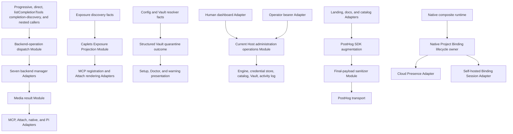
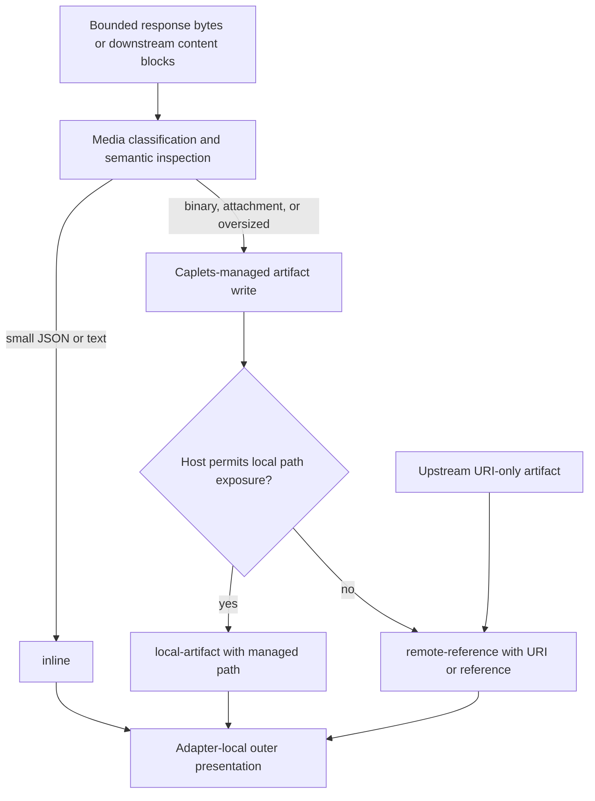
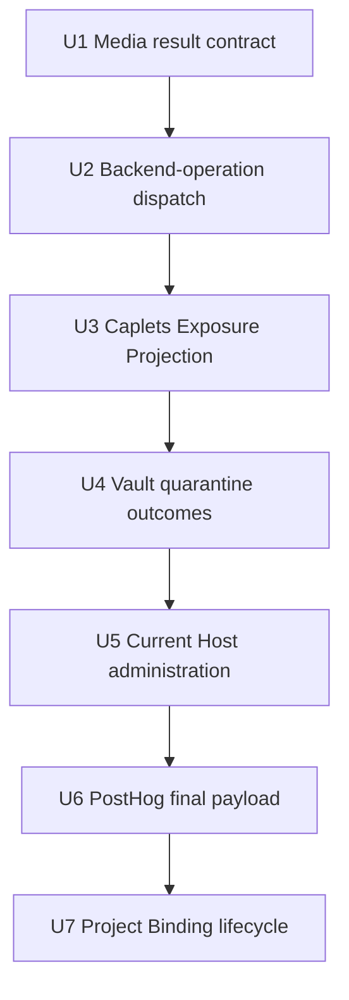
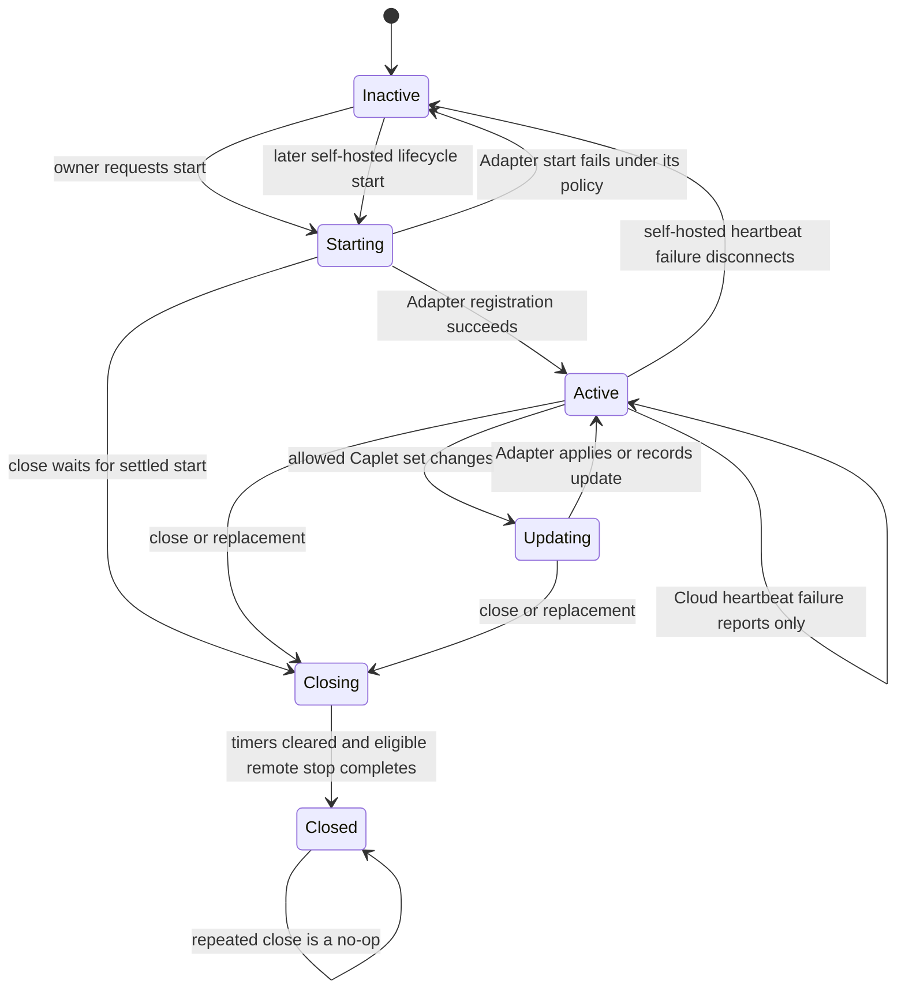
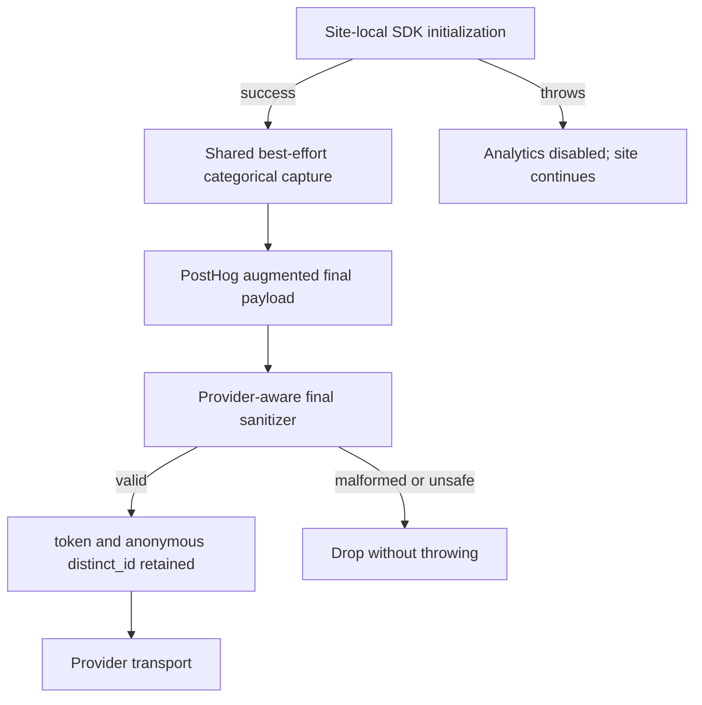

# Caplets Architecture Deepening - Plan

## Goal Capsule

- **Objective:** Deepen seven proven Caplets seams so non-inline results, backend dispatch, exposure registration, Vault quarantine facts, Current Host administration, PostHog privacy enforcement, and Native Project Binding lifecycle each have one authoritative Module and a small Interface.
- **Product authority:** `STRATEGY.md`, `CONTEXT.md`, `CONCEPTS.md`, `docs/adr/0001-code-mode-default-exposure.md`, `docs/adr/0002-media-artifacts-for-non-inline-results.md`, and `docs/adr/0003-remote-client-role-boundaries.md` define the behavior that this refactor must preserve or restore.
- **Execution profile:** Land exactly seven sequential, behavior-complete, independently reviewable clean-cutover commits in U-ID order. Characterize observable behavior at each Interface before deleting the shallow or duplicated path it replaces.
- **Stop conditions:** Stop and re-plan if a `remote-reference` would need filesystem resolution, if backend dispatch would need to own result presentation, if Caplets Exposure Projection would need callbacks or execution objects, if Current Host work would broaden Access Client authority or generic Raw Vault Reveal, if PostHog enforcement would remove required anonymous transport identity or the active provider projects cannot be verified to discard IP data, or if Project Binding would require one shared retry policy for Cloud and self-hosted transports.
- **Tail ownership:** Each unit owns its focused tests, deletion test, dead-code removal, and any behavior-required documentation or Changesets entry. Generated artifacts remain untouched unless a unit changes their authoritative source.
- **Open blockers:** None.

---

## Product Contract

### Summary

Deepen seven existing Caplets Modules in a fixed risk- and Locality-informed sequence, starting with the canonical Media result contract and then moving the backend-operation dispatch that must preserve it. The refactor restores accepted ADR behavior, removes duplicated selection and prose parsing, gives adapters stable outcomes to render, and concentrates lifecycle and privacy policy at real seams without adding product features, compatibility shims, or parallel legacy paths.

### Problem Frame

Caplets already has useful deep Implementations for Media artifact storage, exposure discovery, Vault resolution, dashboard administration collaborators, browser event builders, and both Project Binding transports. The remaining friction is at their Interfaces: several production paths bypass shared policy, callers reconstruct facts from strings or parallel snapshots, adapters repeat selection and orchestration, and tests exercise transport ceremony instead of the behavior-owning Seam.

That weakens Leverage because a correct implementation does not pay back across every caller. It weakens Locality because one behavioral change must be reproduced in several managers, adapters, or tests. The seven selected candidates all pass the deletion test once deepened: deleting the resulting Module would force material policy or lifecycle complexity back into multiple callers, while deleting the current forwarding or parsing path removes little useful behavior.

### Selected Product Decisions

- A canonical internal Media result with exactly three discriminants crosses the Media Seam: `inline`, `local-artifact`, and `remote-reference`.
- A `local-artifact` may carry a Caplets-managed filesystem path only when the host capability context enables local-path exposure.
- A `remote-reference` carries a reference or URI and has neither a filesystem path nor `pathResolution`; no implementation may collapse `path ?? uri` into path semantics.
- Host capability context owns local-path-versus-reference exposure. Backend managers do not infer host locality.
- Adapter-specific outer presentation remains local to each Adapter. Core result classification does not dictate terminal, MCP, Attach, native, or browser wording.
- U1 precedes U2. Backend-operation dispatch must return the U1 result unchanged.
- Code Mode remains the default exposure under ADR-0001, with progressive and direct exposure preserved as explicit alternatives.
- Remote Client Roles are exact and disjoint under ADR-0003 whenever remote credentials authenticate a role-gated request: Access Clients may use MCP, Remote Attach, and Project Binding but not Current Host administration; Operator Clients may use dashboard/admin surfaces but not Access-only runtime routes. Neither role is a superset of the other. The credential-owner self-revoke route remains authenticated but role-neutral for both roles. Configured `development_unauthenticated` runtime access remains a separate compatibility path and does not synthesize an Access Client.
- Per-site PostHog initialization remains local. Final-payload enforcement is provider-aware and preserves the public PostHog token plus anonymous `distinct_id`, while preventing known-user or person-profile attribution. PostHog’s project-level IP data capture setting must separately be verified as **Discard**; `$geoip_disable` prevents enrichment but does not prove source-IP storage is disabled.
- Native Project Binding has exactly two production Adapters: Cloud Presence and self-hosted Binding Sessions. Their common lifecycle invariants share one owner, while their failure policies remain distinct.

### Actors

- A1. **Agent caller:** consumes Code Mode, progressive, direct MCP, Attach, or native results and must receive faithful result and exposure semantics.
- A2. **Current Host Operator:** administers the Current Host through the cookie-and-CSRF dashboard Adapter or the Operator bearer Adapter.
- A3. **Public-site visitor:** generates categorical landing, docs, or catalog analytics without known-user or person-profile attribution.
- A4. **Native remote client:** composes local and upstream Caplets while Native Project Binding starts, updates, replaces, and closes.
- A5. **Maintainer:** changes and verifies behavior through the deep Module Interface rather than through shallow forwarding or transport ceremony.

### Key Flows

- F1. **Result production:** A backend Adapter produces bounded output, the Media Module classifies it as `inline`, `local-artifact`, or `remote-reference`, backend-operation dispatch returns it unchanged, and the outer host Adapter renders it.
- F2. **Backend execution:** Progressive, direct, completion-discovery, and nested Caplet callers submit one common operation to backend-operation dispatch, which selects one of seven manager Adapters.
- F3. **Exposure registration:** Exposure discovery supplies source facts to Caplets Exposure Projection; MCP and Attach Adapters render registration and callable identity without parallel snapshot lookups.
- F4. **Vault recovery:** Config loading quarantines only affected Caplets, emits a structured Vault quarantine outcome, preserves current warning prose, and lets Setup and Doctor render their own outputs without parsing text.
- F5. **Current Host administration:** A dashboard session, validated Operator bearer, or verified-loopback configured `development_unauthenticated` Adapter yields a trusted host-scoped Operator principal, Current Host administration executes a semantic query or command, and the Adapter serializes the structured outcome; non-loopback unauthenticated administration fails closed.
- F6. **Browser telemetry:** A site Adapter initializes PostHog locally, typed categorical events enter shared best-effort dispatch, PostHog augments the payload, and the final-payload sanitizer allows only the required provider envelope, anonymous transport identity, privacy controls, and approved categorical properties.
- F7. **Native Project Binding:** The native composite asks one lifecycle owner to start, update, replace, or close; the owner enforces common ordering while the selected Cloud or self-hosted Adapter applies its own protocol and failure policy.

### Requirements

**Cross-cutover discipline**

- R1. The work must land as seven sequential, behavior-complete commits in the order U1 through U7, with U1 completed before U2 changes `packages/core/src/tools.ts` or `packages/core/src/engine.ts`.
- R2. Every unit must complete a clean cutover: migrate every caller, replace shallow tests with stronger Interface tests, remove obsolete forwarding or parsing code, and leave no shim, alias, fallback, or parallel authority.

**Media result contract**

- R3. All Media-capable result producers must use the canonical `inline`, `local-artifact`, and `remote-reference` result contract while preserving status, structured content, errors, integrity metadata, and bounded-response rules.
- R4. Host capability context must be the sole owner of local-path exposure; `remote-reference` must omit filesystem path and `pathResolution`, while outer Adapters remain free to render references or links locally.
- R5. GraphQL operation results and engine-backed HTTP Actions must traverse the production Media path. GraphQL keeps the existing 1 MiB bounded-text policy as its inline threshold and uses a separate named 100 MiB artifact hard-cap policy; HTTP Actions receive an inline threshold distinct from their configured hard cap. GraphQL HTTP-200 `errors` classification occurs before artifact presentation hides the body.
- R6. Progressive MCP conversion must preserve every downstream content block, its order and payload, `structuredContent`, `isError`, and non-Caplets `_meta`; it must not discard non-text blocks or synthesize a JSON fence as a substitute for them.

**Backend-operation dispatch**

- R7. One backend-operation dispatch Module must select among `DownstreamManager`, `OpenApiManager`, `GoogleDiscoveryManager`, `GraphQLManager`, `HttpActionManager`, `CliToolsManager`, and `CapletSetManager` for check, list, get, call, compact, and search operations.
- R8. Dispatch must preserve U1 results byte-for-byte and field-for-field at the handoff, while MCP-only resources, resource templates, prompts, and completion remain outside the common Interface.

**Caplets Exposure Projection**

- R9. Caplets Exposure Projection must be registration-ready for progressive Caplets, Code Mode Caplets, direct tools, direct resources, direct resource templates, direct prompts, and completions while retaining safe hidden-Caplet breadcrumbs.
- R10. MCP registration, Attach rendering, and Code Mode callable identity must consume the resolved Projection without raw-snapshot rehydration, enabled-config fallback, callbacks, engine references, sandbox policy, authentication, or transport policy inside the Projection Module. Reload must retain the last resolved Projection or fail closed until asynchronous discovery completes, never reconcile an optimistic static snapshot into callable state.

**Caplets Vault quarantine outcomes**

- R11. The config Module must return producer-owned structured Vault quarantine outcomes containing the already-known recovery facts so Setup and Doctor never infer behavior from warning punctuation or wording.
- R12. Vault deepening must preserve best-effort overlay loading, quarantine of only affected Caplets, all four current resolution reasons, stored-key remapping, current human warning prose, global-versus-remote recovery target semantics, redaction, and Operator-only remote Vault administration.

**Current Host administration**

- R13. One Current Host administration operations Module must own eligible read models, Caplet and catalog administration, remote-client mutations, safe Vault administration, structured outcomes, redaction, Operator Activity Log emission, and actor-session termination decisions.
- R14. The human dashboard and Operator bearer must remain two distinct Adapters: the dashboard owns cookies, CSRF, browser ceremony, HTTP presentation, and trusted development-principal synthesis only when `development_unauthenticated` is paired with a verified loopback listener; a non-loopback unauthenticated listener fails closed for dashboard and Current Host administration. The bearer Adapter owns exact Operator-role validation and HTTP presentation. Neither Adapter accepts request-supplied actor identity, and both pass a trusted host-scoped Operator principal to the same Module.
- R15. Raw Vault Reveal must remain a dashboard-only human ceremony with confirmation, no-store response handling, ephemeral UI display, and redacted activity; generic remote control must continue rejecting it.

**PostHog final-payload enforcement**

- R16. PostHog final-payload sanitization must run after SDK augmentation for landing, docs, and catalog, preserve the final envelope, public project token, anonymous `distinct_id`, and approved categorical properties, and enforce `$process_person_profile: false` plus `$geoip_disable: true` on every accepted event regardless of incoming values. It removes raw URLs and referrers, page title, person mutation fields, and unknown application properties. Before production or preview telemetry release, the active PostHog project’s IP data capture configuration must be verified and recorded as **Discard**; client payload settings alone do not satisfy source-IP privacy.
- R17. Each site must retain local SDK initialization and remain functional when initialization, final-hook processing, or capture fails synchronously; provider failure must leave analytics disabled or drop the event without interrupting module evaluation, page listeners, or primary site behavior.

**Native Project Binding lifecycle**

- R18. One Native Project Binding lifecycle owner must enforce start, active update, replacement, and close ordering; coalesce duplicate start work; prevent stop before successful start; cancel timers; and make close idempotent across both production Adapters.
- R19. Cloud must retain report-only heartbeat failure behavior, while self-hosted Binding Sessions retain exact unsupported suppression, disconnect-on-heartbeat-failure, and later re-registration; lifecycle failure must not broaden Project Binding Quarantine or remove unrelated Caplets. Under remote-credential authentication, MCP, Attach, and every Project Binding route require the exact Access role and reject Operator bearers, while dashboard/admin routes require the exact Operator role. An active Project Binding WebSocket must revalidate its durable Client ID’s current, non-revoked Access role and the authoritative active Map record before every control mutation; heartbeat and end/close transitions serialize so a stale second socket cannot reactivate an ended record. Configured `development_unauthenticated` runtime access remains unchanged.
  - **Active-session invariant:** Re-read the durable Client ID, authoritative Map-record state, and unexpired `expiresAt` inside the per-record queue immediately before each client mutation executes; work accepted before a later revoke, demotion, expiry, end, or close must still fail when it reaches the queue.

**Evidence and release**

- R20. Every unit must have happy, edge, failure, and integration scenarios at the deepest valid Interface, with Adapter tests narrowed to host-specific rendering, authorization, transport, and lifecycle behavior.
- R21. Documentation and generated artifacts change only when shipped behavior or durable architecture requires them, and each user-facing package change carries a Changesets entry under repository conventions.

### Acceptance Examples

- AE1. **Local versus remote artifact:** Given identical oversized response bytes, when a local host permits path exposure, then the result is `local-artifact` with a managed path; when an HTTP, Attach, Cloud, or other path-hidden host handles it, then the result is `remote-reference` with the same URI and integrity facts but no path or `pathResolution`.
- AE2. **Oversized GraphQL error:** Given a GraphQL HTTP-200 JSON body over the inline threshold but below the hard cap and containing `errors`, when the operation runs, then the bytes become a Media artifact or reference and the call remains `isError: true`.
- AE3. **Mixed MCP content:** Given downstream text plus image or resource blocks and structured content, when the result passes through progressive execution, then every block remains in its original order and no replacement JSON-fence block appears.
- AE4. **Transparent dispatch:** Given any of the seven backend kinds returns a result containing `remote-reference`, `isError`, and downstream `_meta`, when common dispatch selects that Adapter, then the caller receives those fields unchanged and dispatch does not inspect host path policy.
- AE5. **Projection truth:** Given direct-only, disabled, setup-required, Project Binding-quarantined, and ready Code Mode Caplets, when MCP registration and Code Mode declarations render, then only ready projected identities are callable and no enabled-config fallback leaks hidden identities.
- AE6. **Vault copy independence:** Given the human Vault warning wording changes while its structured facts do not, when Setup and Doctor run, then their status, key, target, and recovery command remain correct without regex changes.
- AE7. **Administration parity:** Given the same eligible Current Host mutation through a dashboard session and an Operator bearer, when each succeeds, then both use the same policy, redaction, outcome, and actor-attributed activity; an Access Client remains forbidden and bearer Raw Vault Reveal remains rejected.
- AE8. **Final PostHog payload:** Given an augmented PostHog payload with `token`, anonymous `distinct_id`, categorical fields, raw URL, person mutation fields, and an unknown app field, when the final hook runs, then token and `distinct_id` survive while the prohibited fields are absent.
- AE9. **Analytics failure isolation:** Given `posthog.init`, the final hook, or `posthog.capture` throws in any site Adapter, when that module loads and page interactions continue, then no exception escapes and the primary interaction still completes.
- AE10. **Distinct binding failures:** Given a Cloud heartbeat fails, when the lifecycle remains active, then the error is reported without forced re-registration; given a self-hosted heartbeat fails, when a later lifecycle start occurs, then the old session is disconnected and a new Binding Session registers.

### Success Criteria

- All four ADR-0002 violations named by U1 are covered through production wiring rather than manager-only fixtures.
- No common operation caller contains a seven-way backend selection tree or positional optional-manager padding after U2.
- MCP registration no longer rebuilds source maps from `ExposureSnapshot`, and Code Mode execution no longer falls back to every enabled Caplet after U3.
- Setup and Doctor contain no Vault-warning regex or warning-substring behavior branch after U4.
- Current Host policy, activity, redaction, and session-ended decisions are tested directly through the operations Interface after U5.
- All three sites install the same final-payload policy and prove init, hook, and capture failure isolation after U6.
- Native composition has one lifecycle owner, two production Adapters, no `LocalPresenceManager` alias, and preserved adapter-specific failure loops after U7.

### Scope Boundaries

**In scope**

- The seven named clean cutovers and only the behavioral defects needed to make each Interface truthful.
- Focused Interface, Adapter, and cross-layer integration tests listed in each unit.
- `docs/architecture.md` updates for the completed Media and Current Host ownership changes.
- Public telemetry privacy wording corrections that distinguish anonymous provider routing identity from known-user/person attribution and user credentials.
- Changesets for U1, U2, U3, U5, and U7 observable package behavior.
- The U1 Changeset-backed replacement of existing exported `CapletResultMetadata.artifacts` / `CapletArtifact` presentation metadata required to represent remote references without filesystem semantics.

**Out of scope**

- New backend kinds, configuration syntax, generated config or Code Mode API schema fields, unrelated public protocol fields, Media download endpoints, remote-reference resolvers, retry systems, telemetry providers, or analytics-provider abstraction.
- Moving backend request construction, host rendering, Code Mode execution, sandbox policy, authentication, or transport behavior into the Media or Projection Modules.
- Multi-host dashboard administration, dashboard redesign, a new dashboard approval lane, Access Client privilege expansion, or generic Raw Vault Reveal.
- Changing current Caplets Vault warning prose, adding remote Setup behavior, changing Vault storage or grants, or copying values between runtime-owned Vaults.
- Upgrading PostHog, moving SDK initialization into the shared Module, adding known-user analytics, or carrying browser identity into CLI/runtime telemetry.
- Folding foreground `runProjectBindingSession`, Mutagen orchestration, Remote Attach polling, exposure quarantine policy, Remote Profile selection, or a unified retry algorithm into the Native lifecycle owner.
- Maintaining historical implementation plans as live compatibility documents; prior plans remain decision and pattern anchors.

### Dependencies and Assumptions

- ADR-0001, ADR-0002, and ADR-0003 remain accepted and require no amendment.
- `posthog-js@1.395.0` remains the pinned browser provider contract for U6.
- Current behavior and accepted decisions captured by the cited prior plans are implementation anchors subordinate to this Product Contract and accepted ADRs; this plan deepens their ownership without reopening product scope.
- U1 and U2 are a hard dependency because both change `packages/core/src/tools.ts` and `packages/core/src/engine.ts`. U3 through U7 follow the fixed delivery order so each review starts from a behavior-complete predecessor.
- External PostHog documentation and the pinned SDK source are load-bearing only for U6’s provider-side IP-discard gate; repository code, tests, domain documents, ADRs, and prior plans resolve every other decision.

### Sources and Research

- `STRATEGY.md`
- `CONTEXT.md`
- `CONCEPTS.md`
- `docs/agents/domain.md`
- `docs/adr/0001-code-mode-default-exposure.md`
- `docs/adr/0002-media-artifacts-for-non-inline-results.md`
- `docs/adr/0003-remote-client-role-boundaries.md`
- `docs/plans/2026-07-01-001-refactor-caplets-exposure-projection-plan.md`
- `docs/plans/2026-07-03-001-feat-caplets-admin-dashboard-plan.md`
- `docs/plans/2026-06-22-001-feat-caplets-vault-plan.md`
- `docs/plans/2026-06-28-002-feat-telemetry-observability-loop-plan.md`
- `docs/plans/2026-06-25-001-feat-self-hosted-project-binding-plan.md`
- The source and test paths named in the Implementation Units below.
- [PostHog IP data capture controls](https://posthog.com/docs/privacy/data-collection#ip-data-capture)
- [`posthog-js@1.395.0` source warning that client `ip` configuration has no effect](https://unpkg.com/posthog-js@1.395.0/lib/src/posthog-core.js)
- [PostHog IP-redaction guidance](https://posthog.com/tutorials/web-redact-properties#hiding-customer-ip-address)

---

## Planning Contract

### Product Contract Preservation

The Product Contract above is the direct planning bootstrap from the user-approved seven-candidate scope and accepted repository decisions. Planning added no product feature. It resolves only ownership, migration, sequencing, test-surface, release, and documentation decisions needed to execute that fixed scope.

### Key Technical Decisions

- KTD1. **Put the canonical result inside the Media Module.** Add a discriminated internal result representation under `packages/core/src/media/` with exactly `inline`, `local-artifact`, and `remote-reference`. The Interface carries observed status/body/content/integrity facts without prescribing outer host copy.
- KTD2. **Separate bounded acquisition, semantic classification, and presentation.** Shared Media Implementation owns bounded bytes, MIME/attachment policy, thresholding, storage, checksum, filename, and path visibility. Keep the existing `DEFAULT_MAX_RESPONSE_BYTES` policy at 1 MiB; introduce a distinct named 100 MiB artifact hard-cap policy aligned with OpenAPI and Google Media, and pass it explicitly for GraphQL operation output. GraphQL retains backend-local `errors` classification over already-bounded bytes before representation selection hides the inline body. Host Adapters own display wording and link affordances.
- KTD3. **Use one named runtime with two deliberate capabilities.** Construct the backend-operation dispatch once with all seven named manager Adapters and normalize only the six common operations. Exported `handleServerTool` changes from positional managers to `{ operations, mcp }`: `operations` owns common backend dispatch, while `mcp` preserves the separately named downstream resource/prompt/completion capability. This is an intentional released `@caplets/core` contract break documented by a Changeset.
- KTD4. **Make Projection entries registration-ready, not executable.** Each of the seven entry kinds carries the resolved source facts its renderers need. MCP callbacks, Attach revisions and route maps, Code Mode execution, authentication, and transport remain Adapter-local.
- KTD5. **Return Vault facts once.** The config Module emits a discriminated Vault quarantine outcome in the same loop that removes the affected Caplet. Generic warning presentation remains available; Setup and Doctor consume data, not copy.
- KTD6. **Use one Current Host semantic operations Interface.** The Module receives a trusted host-scoped Operator principal plus a Current Host query or command and returns a structured outcome, including actor activity and session-ended state. Dashboard and bearer Adapters retain authentication and serialization. `development_unauthenticated` may synthesize a development principal only on a verified loopback listener; non-loopback unauthenticated administration fails closed.
- KTD7. **Enforce PostHog privacy at both relevant boundaries.** A provider-specific Module accepts the augmented capture envelope and returns a sanitized envelope or drop. It preserves only the required structural envelope, public token, anonymous `distinct_id`, and approved categorical properties, and enforces `$process_person_profile: false` plus `$geoip_disable: true`; it is not a generic analytics-provider Interface. Because browser requests still reveal a source IP, release readiness separately requires PostHog’s project-level IP data capture configuration to be verified as **Discard**.
- KTD8. **Make initialization and dispatch best effort at the shared policy level.** Each site still calls `posthog.init` locally with flags, referrer persistence, and campaign-parameter capture disabled so pre-hook `/flags` traffic cannot carry browser navigation facts. Local failure containment leaves analytics disabled and allows module evaluation to continue. Shared capture dispatch and final sanitization are total and no-throw.
- KTD9. **Own only common Native lifecycle invariants.** The lifecycle owner coordinates when to start, update, replace, and close. Cloud and self-hosted Adapters own protocol state, timer callbacks, error classification, and intentionally different recovery policy.
- KTD10. **Replace, do not layer.** Every unit uses the deletion test: new Interface tests land first, all callers migrate in the same unit, and obsolete forwarding, fallback, regex, alias, or orchestration code is removed before the unit is reviewable.

### High-Level Technical Design

#### Architecture and data flow

Each thickening targets one real Seam. The Adapters keep variation that belongs to their host or transport; the Module hides policy or lifecycle complexity that callers should not relearn.

#### Canonical Media result flow

`remote-reference` never acquires a filesystem path or `pathResolution`. Markdown links that genuinely name downstream filesystem paths remain separate presentation hints and do not redefine the canonical Media contract.

#### Fixed delivery order

U1 to U2 is a semantic dependency. The remaining arrows are delivery dependencies that preserve the requested commit order and isolate risk; U7 also relies semantically on U3’s stable exposure and quarantine authority.

#### Native Project Binding lifecycle

The owner enforces ordering and race invariants. It does not make the two failure loops identical.

#### PostHog privacy gauntlet

### Sequence and Dependencies

1. **U1 restores ADR-0002 first.** It changes result types and the two shared hot files, then proves production engine and host behavior.
2. **U2 moves only selection.** It consumes U1’s final result contract and must not normalize it again.
3. **U3 deepens registration truth.** It follows the engine and dispatch cutover so the Projection Interface is built on stable manager selection and result behavior.
4. **U4 removes a contained in-process parser detour.** This lower-risk producer-to-consumer cutover provides a clean review checkpoint before authorization-sensitive work.
5. **U5 centralizes Current Host policy.** It follows U4 so Vault diagnostic and recovery facts are already stable before broader safe Vault administration moves behind the operations Interface.
6. **U6 closes the public-site privacy gap.** It is isolated after core administration changes because it lives in separate private workspace packages and has a distinct provider contract.
7. **U7 moves concurrent lifecycle ownership last.** It builds on U3’s projection authority and carries the highest race and transport-policy risk.

### System-Wide Impact

- **Result fidelity:** MCP content blocks, HTTP-like envelopes, GraphQL error state, Media integrity metadata, Attach/native forwarding, and Pi presentation all share one result truth without sharing one presentation.
- **Agent/tool parity:** Code Mode, progressive, direct MCP, Attach, and native surfaces consume the same resolved exposure identities; hidden or quarantined Caplets do not reappear through fallback.
- **Authorization:** Remote Client Roles are exact, not hierarchical, on role-gated remote-credential routes. Current Host administration accepts only validated Operator Client principals or a verified-loopback development principal; bearer-authenticated MCP, Attach, and Project Binding accept only Access Clients, including active Project Binding message revalidation; credential self-revoke accepts either authenticated role but only for the caller’s own credential. Request data never supplies actor identity, configured `development_unauthenticated` runtime access remains unchanged, and non-loopback unauthenticated listeners expose no dashboard or Current Host administration authority.
- **Privacy:** PostHog keeps the minimum anonymous transport identity needed for ingestion while final-payload policy prevents raw navigation and person-profile mutation fields from leaving any public site; the provider project’s verified **Discard** setting prevents source-IP retention that client payload hooks cannot control.
- **Lifecycle:** Native Project Binding becomes easier to reason about without moving quarantine, Mutagen, Remote Attach, or transport-specific recovery into the lifecycle Interface.
- **Maintenance:** Each candidate’s Interface becomes its primary test surface, increasing Leverage and Locality while shrinking adapter fixtures and setup ceremony.

### Edge Cases and Failure Conditions

- **Media:** Exact threshold boundaries, `HEAD`, missing MIME, attachment disposition, non-2xx responses, HTTP-200 GraphQL errors, aborted streams, advertised and streamed hard-cap overflow, unsafe artifact roots, path-hidden hosts, URI-only references, image-only MCP results, and mixed ordered blocks.
- **Dispatch:** Inspect requests that must not start an Adapter, check-method name normalization, nested Caplet sets, invalid args rejected before Adapter invocation, selected Adapter errors passed through, and MCP-only operations rejected outside their separate implementation.
- **Projection:** All seven entry kinds, skipped non-direct MCP discovery, hidden reasons, sanitized diagnostics, namespace-qualified identity, reload removal/update, static-to-resolved transition, stale Attach revisions, and absence of Code Mode fallback.
- **Vault:** Missing, ungranted, unavailable, and invalid-key-source outcomes; remapped stored keys; multiple issues per Caplet; project and Markdown source paths; remote recovery target; loader failure; unaffected sibling retention; and secret redaction.
- **Current Host:** Missing or Access principal, expired Pending Remote Login, unknown client, self-revocation, self-demotion, another Operator’s mutation, session-store lock contention, catalog conflicts, unavailable control context, safe Vault redaction, double activity emission, and Raw Vault Reveal isolation.
- **PostHog:** Null or malformed final payload, missing required token or anonymous identity, unknown SDK/app properties, raw URL/referrer/title, person mutation fields, init failure before listeners, hook failure, capture failure, absent env configuration, and provider-version drift.
- **Project Binding:** Concurrent starts, close during start, close during remote replacement, repeated close, failed reload, unchanged allowed IDs, update before active registration, timer cancellation, failed remote stop, exact versus nonmatching unsupported errors, Cloud report-only heartbeat failure, self-hosted disconnect/re-registration, owner isolation, and Access Client authorization.

### Risks and Mitigations

| Risk                                                                           | Unit   | Mitigation                                                                                                                                                |
| ------------------------------------------------------------------------------ | ------ | --------------------------------------------------------------------------------------------------------------------------------------------------------- |
| GraphQL artifactization hides `errors` and turns an error into success.        | U1     | Classify the already-bounded GraphQL body before representation selection and require an oversized HTTP-200 error scenario.                               |
| URI-only results regain fake path semantics through metadata or Pi rendering.  | U1, U2 | Make `remote-reference` a distinct discriminant, forbid path and `pathResolution`, and assert preservation through dispatch and Pi.                       |
| Dispatch erases backend types or becomes a second behavior owner.              | U2     | Limit the Interface to six common operations, construct it with seven named Adapters, and keep validation, Media policy, and MCP-only behavior outside.   |
| Projection becomes a callback registry or retains a second snapshot authority. | U3     | Delete raw-snapshot parameters and fallback maps; require declarative registration facts and Adapter-local callbacks.                                     |
| Structured Vault outcomes drift from current human output or leak secrets.     | U4     | Produce facts and warning text in the same config loop, retain prose assertions, and test redaction and target mapping separately.                        |
| Current Host migration weakens authorization or duplicates activity.           | U5     | Pass validated principals, add direct Interface authorization tests, compare both Adapters, and delete route-local activity only after parity passes.     |
| PostHog sanitization either drops ingestion or retains person data.            | U6     | Pin the focused provider-contract fixture to token plus anonymous `distinct_id`, deny person mutation/raw fields, and exercise all three installed hooks. |
| Lifecycle ownership accidentally unifies Cloud and self-hosted failure policy. | U7     | Keep policy in the two Adapters and test the two failure loops independently through one owner.                                                           |
| Concurrent refactor leaves dead paths that still appear authoritative.         | All    | Treat deletion as part of each unit’s done signal and forbid compatibility aliases, fallback parsing, and parallel selection.                             |

### Alternative Approaches Considered

- **Patch each Media bypass independently:** rejected because it recreates MIME, threshold, storage, block, and reference policy across producers and fails the deletion test.
- **Keep `backendFor` and wrap the engine trees:** rejected because layering preserves the shallow forwarding objects and leaves multiple selection authorities.
- **Put callbacks and engine objects into Projection entries:** rejected because it expands the Interface, reduces testability, and moves execution into the wrong Module.
- **Add typed Vault facts beside regex fallbacks:** rejected because two authorities would remain and warning-copy changes could still alter behavior.
- **Make dashboard routes the Current Host Module:** rejected because the Operator bearer Adapter would still duplicate policy and activity.
- **Install the current property-only PostHog filter directly:** rejected because it runs at the wrong shape and removes required provider fields.
- **Unify Cloud and self-hosted Project Binding into one retry state machine:** rejected because only lifecycle ordering is shared; failure and recovery policy intentionally varies by Adapter.
- **Land all seven in one commit:** rejected because it would erase reviewable deletion tests and make result, authorization, privacy, and concurrency regressions difficult to isolate.

### Documentation, Generated Artifacts, and Release Decisions

| Unit | Documentation / generated artifacts                                                                                                                                                                                                                                                                                                                                                                                                                                                                                                                             | Changeset decision                                                                           |
| ---- | --------------------------------------------------------------------------------------------------------------------------------------------------------------------------------------------------------------------------------------------------------------------------------------------------------------------------------------------------------------------------------------------------------------------------------------------------------------------------------------------------------------------------------------------------------------- | -------------------------------------------------------------------------------------------- |
| U1   | Update `docs/architecture.md` for GraphQL operation results, the three canonical variants, and host-owned presentation. No schema or Code Mode generation.                                                                                                                                                                                                                                                                                                                                                                                                      | Required for observable `@caplets/core` result metadata and `@caplets/pi` rendering changes. |
| U2   | No documentation or generated artifact change; the Changeset carries the exported `handleServerTool` migration contract.                                                                                                                                                                                                                                                                                                                                                                                                                                        | Required for the intentional released `@caplets/core` Interface break.                       |
| U3   | Existing Projection glossary and architecture text already state the intended authority; no generated artifact change.                                                                                                                                                                                                                                                                                                                                                                                                                                          | Required for corrected `@caplets/core` registration and Code Mode callable visibility.       |
| U4   | No documentation or generated artifact change because warning and CLI/Doctor output remain stable.                                                                                                                                                                                                                                                                                                                                                                                                                                                              | None while public output stays unchanged.                                                    |
| U5   | Update `docs/architecture.md` for the Current Host operations Module and its two Adapters.                                                                                                                                                                                                                                                                                                                                                                                                                                                                      | Required for observable Operator bearer activity and Current Host administration behavior.   |
| U6   | Correct `docs/product/anonymous-telemetry.md` and `apps/docs/src/content/docs/privacy/indexing.mdx`: no known-user/person-profile attribution or user credentials are retained, while PostHog’s configured public project token and anonymous `distinct_id` remain solely for provider routing. Correct `docs/product/telemetry-provider-readiness.md` so the PostHog project-level **Discard IP data** setting is a recorded release gate and `$geoip_disable` is not misrepresented as a source-IP storage control. No lockfile or generated artifact change. | None; all affected apps and `@caplets/web-observability` are private workspace packages.     |
| U7   | No documentation or generated artifact change; the lifecycle contract gains observable watch-driven allowed-Caplet updates and stronger cleanup ordering.                                                                                                                                                                                                                                                                                                                                                                                                       | Required for corrected `@caplets/core` Project Binding lifecycle behavior.                   |

### Critical Files

| Path                                                      | Why it is critical                                                                                                 |
| --------------------------------------------------------- | ------------------------------------------------------------------------------------------------------------------ |
| `packages/core/src/http/response.ts`                      | Existing deep Media Implementation for bounded response classification and artifact writing.                       |
| `packages/core/src/media/artifacts.ts`                    | Managed storage, URI, checksum, filename, path visibility, and safe resolution behavior.                           |
| `packages/core/src/tools.ts`                              | Progressive wrapper, result annotation, artifact metadata defect, and current shallow backend selection.           |
| `packages/core/src/engine.ts`                             | Manager construction, production Media options, progressive/direct entrypoints, and repeated dispatch trees.       |
| `packages/core/src/exposure/projection.ts`                | Named adapter-neutral source of exposure identity and availability.                                                |
| `packages/core/src/serve/session.ts`                      | MCP registration rehydration and Code Mode enabled-config fallback to delete.                                      |
| `packages/core/src/config.ts`                             | Producer already holding every Vault quarantine fact before warning formatting.                                    |
| `packages/core/src/serve/http.ts`                         | Human dashboard and Operator bearer Adapters plus current direct administration orchestration.                     |
| `packages/core/src/remote-control/dispatch.ts`            | Generic bearer dispatch that must delegate eligible Current Host operations but retain Raw Vault Reveal rejection. |
| `packages/web-observability/src/privacy.ts`               | Current unused property-only PostHog filter and established categorical allowlist.                                 |
| `apps/landing/src/scripts/observability.ts`               | Representative local PostHog initialization and direct capture Adapter.                                            |
| `packages/core/src/native/service.ts`                     | Composite lifecycle ordering and self-hosted Binding Session Adapter.                                              |
| `packages/core/src/cloud/presence.ts`                     | Cloud Presence Adapter and misleading `LocalPresenceManager` alias.                                                |
| `docs/adr/0001-code-mode-default-exposure.md`             | Code Mode default and alternate exposure contract.                                                                 |
| `docs/adr/0002-media-artifacts-for-non-inline-results.md` | Local path versus remote reference decision.                                                                       |
| `docs/adr/0003-remote-client-role-boundaries.md`          | Access versus Operator authority and Raw Vault Reveal decision.                                                    |

---

## Implementation Units

### U1. Make Media artifacts the canonical non-inline result contract

- **Goal:** Deepen the established Media Module so every result producer crosses one `inline` / `local-artifact` / `remote-reference` Interface and every host Adapter renders that result without inventing locality.
- **Requirements:** R1-R6, R20-R21; F1; AE1-AE3.
- **Dependencies:** None.
- **Files:**
  - **Create:** `packages/core/src/media/results.ts`
  - **Modify:** `packages/core/src/media/artifacts.ts`, `packages/core/src/media/index.ts`, `packages/core/src/http/response.ts`, `packages/core/src/graphql.ts`, `packages/core/src/http-actions.ts`, `packages/core/src/result-content.ts`, `packages/core/src/tools.ts`, `packages/core/src/engine.ts`, `packages/core/src/caplet-sets.ts`, `packages/core/src/serve/http.ts`, `packages/core/src/serve/index.ts`, `packages/core/src/index.ts`, `packages/pi/src/index.ts`
  - **Tests:** `packages/core/test/media-artifacts.test.ts`, `packages/core/test/graphql.test.ts`, `packages/core/test/http-actions.test.ts`, `packages/core/test/result-content.test.ts`, `packages/core/test/downstream.test.ts`, `packages/core/test/tools.test.ts`, `packages/core/test/runtime.test.ts`, `packages/core/test/native.test.ts`, `packages/core/test/caplet-sets.test.ts`, `packages/core/test/serve-http.test.ts`, `packages/core/test/serve-session.test.ts`, `packages/core/test/attach-api.test.ts`, `packages/pi/test/pi.test.ts`
  - **Documentation / release:** `docs/architecture.md`, `.changeset/*.md`
- **Approach:**
  - Define the canonical internal Media result in `packages/core/src/media/results.ts` using the three selected discriminants. Reuse observed fields such as URI, managed path, filename, MIME type, byte length, and checksum; do not invent filesystem fields for a reference.
  - Keep the canonical Media result type internal under `packages/core/src/media/`. Replace the existing exported `CapletArtifact` presentation metadata with a `presentation`-discriminated union: `local-path` retains `displayPath` and `pathResolution`, while `reference` carries `reference` and forbids both filesystem fields. `CapletResultMetadata.artifacts` uses that union, Markdown remains an Adapter-local presentation hint, and `packages/core/src/index.ts` does not root-export the internal result, `MediaArtifact`, or HTTP reader options.
  - Keep storage safety, URI construction, checksum, naming, permission, root, and symlink behavior in `packages/core/src/media/artifacts.ts`. A hidden path does not become a remotely resolvable path; it yields `remote-reference` to callers.
  - Pass path exposure as an explicit host capability at runtime/engine construction, never infer it from a transport label. In-process hosts that can access the managed artifact filesystem may enable it, including `CapletsRuntime`, local CLI/Code Mode construction, local native, and native Pi/OpenCode; every remote or hosted boundary forces it off, including HTTP serve/session factories, Attach, and Cloud.
  - Propagate the inline threshold, hard-cap, artifact directory, and path-exposure capability recursively through every `CapletSetManager` child runtime so nested HTTP Actions use the same Media contract.
  - In `serveHttp`, `serveHttpWithSessionFactory`, and `serveHttpWithUpstream`, construct one sanitized `{ ...callerEngineOptions, exposeLocalArtifactPaths: false }` before any MCP, Attach, session, or upstream-native factory closure captures options. Pass that same object through the outer HTTP engine and `createUpstreamNativeService` composite local engine so no caller `true` can leak local-overlay paths through a remotely served MCP or Attach surface.
  - Deepen `readHttpLikeResponse` so bounded acquisition and representation selection serve OpenAPI, Google Discovery, HTTP Actions, and GraphQL operation output. GraphQL schema and introspection readers remain bounded-text control paths.
  - Let GraphQL inspect the already-bounded operation body for `errors` before representation selection. Preserve redirects, 401/403 redaction, timeout mapping, status headers, and `isError` on both inline and artifactized bodies.
  - Add a named engine-level Media inline threshold to `CapletsEngineOptions` and forward it through `selectHttpLikeOptions`. Keep each configurable HTTP-like backend’s maximum response bytes as its hard failure cap. Do not repurpose `DEFAULT_MAX_RESPONSE_BYTES`: it remains the 1 MiB inline/control-reader policy. Introduce a separate named 100 MiB artifact hard-cap policy and pass it explicitly for GraphQL operation results without adding new config syntax.
  - Change progressive MCP annotation to preserve the original ordered `content` blocks. Keep explicit field projection behavior, but delete canonical conversion through `textBlocksToString` where it discards non-text blocks or creates a JSON-fence substitute.
  - Replace `addStructuredArtifact`’s `path ?? uri` model. Structured `local-artifact` metadata may feed an Adapter’s absolute-path presentation; structured `remote-reference` metadata carries its reference and never `pathResolution`. Existing Markdown filesystem-link detection remains a separate presentation hint.
  - Update Pi’s Adapter-local parser and rendering so local artifacts render as managed paths and remote references render as references or links. Pi must not require `displayPath` plus `pathResolution` for every artifact.
- **Execution note:** Start with failing production-path tests for oversized GraphQL, engine-configured HTTP Action thresholding, mixed MCP blocks, URI-only metadata, and Pi reference rendering. Preserve the existing Media safety suite before broadening callers.
- **Patterns to follow:** `readHttpLikeResponse`, `writeMediaArtifact`, `resolveMediaArtifact`, the direct-result preservation in `CapletsEngine.executeDirectTool`, and host path suppression in HTTP serve, Attach, and Cloud construction.
- **Test scenarios:**
  - **Happy:** Small GraphQL JSON and HTTP Action text remain `inline`; binary, attachment, and oversized output become `local-artifact` when an in-process host can access the managed artifact filesystem; the same bytes become `remote-reference` with identical URI, filename, MIME, length, and checksum when HTTP serve, Attach, Cloud, or another boundary hides local paths.
  - **Happy:** Progressive and direct MCP calls preserve original text, image/resource-like blocks, structured content, `isError`, and downstream `_meta`, with only Caplets metadata added once.
  - **Edge:** Exercise exactly-at-1-MiB and one-byte-over GraphQL inline behavior, the 100 MiB GraphQL hard cap by advertised length and streamed bytes, configurable HTTP Action threshold boundaries, attachment without MIME, `HEAD`, empty body, path-hidden artifact storage, URI-only upstream artifact, image-only MCP content, mixed content ordering, and non-2xx inline or artifact envelopes.
  - **Failure:** Preserve content-length and streamed hard-cap cancellation without allocating the full 100 MiB GraphQL fixture, abort/timeout mapping, unsafe root/output/symlink rejection, failed-response output-path protection, GraphQL auth redaction, and no attempt to resolve a `remote-reference` against the local artifact root for presentation.
  - **Integration:** Run real `CapletsEngine` and nested Caplet-set HTTP Actions through progressive and direct execution with an inline threshold lower than the hard cap; require the nested path-hidden result to remain a `remote-reference`. Route a GraphQL oversized HTTP-200 `errors` response through the same Media Implementation; prove `CapletsRuntime` and local native construction may expose managed paths while HTTP serve/session factories force reference-only results even when caller engine options request path exposure. Start `serveHttpWithUpstream` with caller `exposeLocalArtifactPaths: true` and exercise both its upstream composite MCP and Attach paths; each returns reference presentation with no managed path or `pathResolution`. Verify Pi renders a reference without `relative-to-mcp-server` or any local-path affordance.
- **Deletion test:** Remove the GraphQL operation `readGraphQlText` bypass, the progressive content replacement path, the structured `path ?? uri` fallback, Pi’s all-artifacts-are-paths parser, and every remote serve factory closure that can capture unsanitized engine options. Deleting the deepened Media Module afterward would force streaming limits, MIME policy, storage, checksums, naming, path exposure, and result discrimination back into multiple producers and Adapters.
- **Verification:** U1 is complete when focused Media, GraphQL, HTTP Action, result-content, tools, nested runtime, HTTP serve/upstream composite MCP and Attach, and Pi suites prove the three variants, block fidelity, and non-overridable host path boundary through production wiring; `@caplets/core` and `@caplets/pi` type/package gates accept the new result contract; architecture text and Changesets entries match the observable behavior.

### U2. Centralize backend-operation dispatch at the manager Seam

- **Goal:** Replace seven shallow forwarding objects and three engine selection trees with one deep backend-operation dispatch Module that preserves U1 results unchanged.
- **Requirements:** R1-R2, R7-R8, R20-R21; F2; AE4.
- **Dependencies:** U1.
- **Files:**
  - **Create:** `packages/core/src/backend-operation-dispatch.ts`, `packages/core/test/backend-operation-dispatch.test.ts`
  - **Modify:** `packages/core/src/tools.ts`, `packages/core/src/engine.ts`, `packages/core/src/caplet-sets.ts`, `packages/core/src/index.ts`
  - **Tests:** `packages/core/test/tools.test.ts`, `packages/core/test/http-actions.test.ts`, `packages/core/test/google-discovery.test.ts`, `packages/core/test/openapi.test.ts`, `packages/core/test/cli-tools.test.ts`, `packages/core/test/downstream.test.ts`, `packages/core/test/caplet-sets.test.ts`, `packages/core/test/serve-session.test.ts`, `packages/core/test/native.test.ts`
  - **Release:** `.changeset/*.md`
- **Approach:**
  - Add one backend-operation dispatch Module constructed once with the seven named manager Adapters. Its small Interface normalizes check, listTools, getTool, callTool, compact, and search.
  - Move backend discriminant selection and check-method name normalization into that Module. Keep each manager’s caching, auth, request construction, errors, Media production, `compact`, and `search` Implementation local.
  - Deliberately change exported `handleServerTool` to receive one named runtime object such as `{ operations: BackendOperationDispatch, mcp: McpOperationAdapter }` rather than downstream plus six optional positional managers. Export the minimal runtime, dispatch constructor, and Interface from `packages/core/src/index.ts`, and document the released `@caplets/core` break in a Changeset.
  - Replace `CapletsEngine.listCompletionTools`, `listTools`, and `callTool` selection trees with the runtime’s `operations` dispatch. Keep engine reload, invalidation, Project Binding guards, and MCP-only direct operations in the engine.
  - Give each `CapletSetManager` child runtime its own complete named runtime object over its child managers so nested Caplets use the same Interface without rebuilding forwarding objects per call.
  - Keep MCP resources, resource templates, prompts, reads, prompt retrieval, completion, and the MCP-specific `compactResource`, `compactResourceTemplate`, `compactPrompt`, `searchResources`, and `searchPrompts` methods behind the runtime’s separately named `mcp` capability, implemented directly by the child or root `DownstreamManager`. Do not move generic tool `compact` or `search` out of the six-operation backend dispatch, add MCP-only methods to that dispatch, or generalize `mcpBackendFor` into the common operation set.
  - Keep the exported dispatch surface narrow: advanced external callers construct one named manager bundle per runtime, while ordinary callers continue through `CapletsEngine`; no caller constructs seven forwarding objects per operation.
- **Execution note:** Add Interface selection tests before migrating callers, then delete optional manager fixtures and positional padding in the same unit.
- **Patterns to follow:** Existing seven managers’ common method sets, the engine’s complete manager construction, and the child runtime construction in `packages/core/src/caplet-sets.ts`.
- **Test scenarios:**
  - **Happy:** For each backend discriminator, every one of the six common operations reaches exactly the matching Adapter and no other Adapter; progressive and direct engine paths select the same Adapter.
  - **Happy:** Invoke the exported `handleServerTool` public contract with one named runtime and a real MCP manager; resources, resource templates, reads, prompts, prompt retrieval, and completion still work through `runtime.mcp`, while a non-MCP server never enters that capability.
  - **Edge:** Normalize the five current check method names; prove `inspect` stays registry-local and starts no Adapter; prove nested Caplet sets list and call a child through child dispatch; keep GraphQL field-selection restrictions in wrapper policy.
  - **Failure:** Invalid call args fail before Adapter invocation; a selected Adapter’s `TOOL_NOT_FOUND`, timeout, auth, or structured error passes through unchanged; non-MCP resource/prompt/template/completion remains unsupported without entering common dispatch.
  - **Integration:** Retain real OpenAPI, Google Discovery, HTTP Action, CLI, MCP resource/prompt/completion, and nested Caplet wrapper scenarios after replacing positional construction. Pass a U1 result containing mixed blocks, `local-artifact`, `remote-reference`, `isError`, and downstream `_meta` through progressive and direct dispatch and assert the handoff is unchanged; package type/build gates prove the root-exported runtime contract is consumable.
- **Deletion test:** Delete `backendFor`, every six-method forwarding literal, the old positional `DownstreamManager` plus optional-manager `handleServerTool` signature, engine selection trees, optional-slot padding, and child positional dispatch. Deleting the new Module must then recreate seven-way selection in progressive, direct, `listCompletionTools` completion-discovery, and nested callers; deleting `runtime.mcp` must break MCP resource, prompt, and completion behavior rather than silently moving it into common dispatch.
- **Verification:** U2 is complete when the new Interface suite covers all seven Adapters and six common operations, the exported named runtime preserves real MCP-only operations, migrated integration suites retain their behavior, no common caller switches on backend kind, U1 result variants remain unmodified, and the `@caplets/core` Changeset documents the intentional `handleServerTool` Interface break.

### U3. Make Caplets Exposure Projection registration-ready

- **Goal:** Deepen Caplets Exposure Projection so MCP and Attach Adapters render registration and Code Mode callable identity directly from one adapter-neutral Interface.
- **Requirements:** R1-R2, R9-R10, R20-R21; F3; AE5.
- **Dependencies:** U2.
- **Files:**
  - **Modify:** `packages/core/src/exposure/projection.ts`, `packages/core/src/exposure/discovery.ts`, `packages/core/src/serve/session.ts`, `packages/core/src/attach/api.ts`, `packages/core/src/native/service.ts`, `packages/core/src/engine.ts`
  - **Tests:** `packages/core/test/exposure-projection.test.ts`, `packages/core/test/serve-session.test.ts`, `packages/core/test/code-mode-mcp.test.ts`, `packages/core/test/attach-api.test.ts`, `packages/core/test/exposure-discovery.test.ts`, `packages/core/test/native.test.ts`
  - **Release:** `.changeset/*.md`
- **Approach:**
  - Make each Projection entry kind carry the source registration facts already present in discovery: resolved visible and source Caplet identity, schemas, annotations, resource metadata, prompt arguments, downstream route identity, shadowing, and Code Mode declaration guidance where relevant.
  - Keep availability policy in exposure discovery: disabled, setup-required, missing Project Binding context, Project Binding Quarantine, discovery failure, and empty surface. Keep sanitized hidden breadcrumbs and declarative routes in Projection.
  - Remove the raw `ExposureSnapshot` parameter from `CapletsMcpSession.reconcileFromProjection` and delete its Code Mode find plus progressive/tool/resource/template/prompt maps. Render one projected entry at a time and attach engine callbacks locally.
  - Make reload reconciliation generation-safe: retain the last resolved Projection for presentation, but bind every registration and callback to the matching monotonic engine/config generation and fail callback execution closed after the engine changes until that generation’s Projection resolves. Sequence refreshes and discard any out-of-order completion so an older discovery result cannot replace a newer Projection. Remove immediate `staticExposureSnapshot(...)` reconciliation.
  - Feed only the last resolved, generation-matched projected Code Mode identities into both `EngineNativeCapletsService` construction paths and `codeModeNativeTools`. Delete `currentExposureSnapshot()`, `lastExposureSnapshot`, and every `enabledServers()` fallback so initial, failed, hidden, direct-only, or quarantined identities cannot enter native declarations or the sandbox allowlist; `exposureSnapshot()` returns each discovery result directly rather than retaining a second raw authority.
  - Keep `buildAttachProjection` as an Adapter renderer. Revision hashing, export IDs, route maps, stale checks, URI decoding, completion normalization, and engine invocation remain Attach-local.
  - Do not expand this unit into native local/remote merge lifecycle work; U7 owns the relevant Native Project Binding lifetime change.
- **Execution note:** Strengthen Projection Interface fixtures across all seven kinds before deleting MCP rehydration maps and Code Mode fallback.
- **Patterns to follow:** `discoverExposureSnapshot`, existing safe diagnostics in `buildExposureProjection`, prior decisions in `docs/plans/2026-07-01-001-refactor-caplets-exposure-projection-plan.md`, and Attach’s current projection-only manifest input.
- **Test scenarios:**
  - **Happy:** One mixed discovery snapshot projects progressive, Code Mode, direct tool, resource, resource template, prompt, and completion entries with every registration fact needed by MCP and Attach; callbacks are absent.
  - **Happy:** MCP registers progressive and direct tools, concrete resources, templates, and prompts from Projection; `code_mode` describes and executes exactly the ready projected Code Mode identities; Attach renders all seven kinds with stable routes and revision.
  - **Edge:** Preserve skipped surface discovery for non-direct MCP, `direct_and_code_mode`, prompt arguments, resource URI versus downstream URI, MIME and size, allow/forbid/namespace shadowing, reload removal/update, and initial registration followed by resolved refresh.
  - **Failure:** Disabled, setup-required, missing-context, quarantined, discovery-failed, and empty-surface Caplets remain non-callable with sanitized breadcrumbs; stale or wrong-kind Attach exports fail before engine execution; an empty refreshed Code Mode set removes the tool rather than using enabled config; native Code Mode fails closed before initial discovery and after failed refresh; callback invocation during delayed reload rejects a prior-generation registration rather than executing new same-ID configuration.
  - **Integration:** Through HTTP Attach manifest/invoke, prove reload changes revision and prevents an old export from invoking a newly hidden Caplet. Through MCP, delay discovery during a same-ID backend/exposure change and prove prior-generation callbacks fail closed until the matching Projection reconciles. Resolve two overlapping refreshes newest-first and prove the older completion is discarded. Through native Code Mode, prove hidden and quarantined handles remain absent before initial discovery, after failed refresh, and after resolved refresh.
- **Deletion test:** Delete all MCP raw-snapshot lookup maps, the engine’s `currentExposureSnapshot()`/`lastExposureSnapshot` cache, native and Code Mode snapshot/config/`enabledServers()` fallbacks, optimistic `staticExposureSnapshot(...)` reload reconciliation, and duplicate refresh authority. Deleting Projection generation binding afterward must recreate stale-callback and out-of-order-refresh guards; deleting Projection itself must recreate ordering, registration facts, completion derivation, route identity, shadowing, and diagnostic sanitization in MCP, Attach, and native rendering.
- **Verification:** U3 is complete when Projection tests own policy, MCP/Attach/native tests own only rendering and route handoff, prior-generation callbacks and out-of-order refreshes fail closed, Code Mode has no alternate identity source, hidden diagnostics remain safe, and the `@caplets/core` Changeset describes the corrected callable-surface behavior.

### U4. Return Caplets Vault quarantine outcomes instead of parsing recovery prose

- **Goal:** Keep Vault quarantine facts at the config Seam as structured outcomes and let Setup, Doctor, and generic warning presentation consume them without a fabricated Adapter seam.
- **Requirements:** R1-R2, R11-R12, R20; F4; AE6.
- **Dependencies:** U3 as the fixed delivery predecessor; no runtime dependency on Projection.
- **Files:**
  - **Modify:** `packages/core/src/config.ts`, `packages/core/src/cli.ts`, `packages/core/src/cli/doctor.ts`
  - **Tests:** `packages/core/test/config.test.ts`, `packages/core/test/cli.test.ts`, `packages/core/test/doctor-cli.test.ts`
- **Approach:**
  - Make Vault-origin local-overlay warnings distinguishable by a structured discriminant and attach the facts already present in `quarantineUnresolvedReferenceCaplets`: source kind and path, affected Caplet ID, reference path and name, optional remapped stored key and effective key, resolution reason, recovery target, and recoverable quarantine state.
  - Produce that outcome in the same loop that removes the affected Caplet. Keep `formatVaultReferenceWarning` as the config-owned human formatter and preserve its current text and command ordering.
  - Update `vaultSetupStatusesForInstalled` to select structured Vault outcomes by discriminant and Caplet ID, preserving ready, unresolved, and unknown states plus ordered deduplicated recovery commands and current messages.
  - Update Doctor’s Vault section to map the same outcome into its JSON and Markdown presentation. Derive global versus remote target from data, not the presence of `--remote` in copy.
  - Leave engine, native, and generic CLI callers that only print warning messages as presentation-only consumers.
- **Execution note:** Extend current prose-based fixture coverage to assert structured facts first, then remove both parsers only after Setup and Doctor output parity is established.
- **Patterns to follow:** `ConfigVaultResolution`, source-aware overlay loading, current affected-sibling quarantine tests, and Doctor’s existing safe JSON/Markdown result shapes.
- **Test scenarios:**
  - **Happy:** A granted reference interpolates with no outcome; one unresolved reference emits one typed recoverable outcome, removes only its Caplet, and preserves healthy siblings and source maps; Setup and Doctor render the same recovery behavior as today.
  - **Edge:** Cover global config, project config, Markdown Caplet file, all four reasons, multiple unresolved references, remapped stored key versus reference name, public metadata remaining literal, ordered command deduplication, and global versus remote target. Vary warning prose and punctuation while holding the structured outcome fixed and assert Setup and Doctor return identical status, key, target, and recovery command facts.
  - **Failure:** Loader failure leaves requested Setup statuses unknown and Doctor non-OK without fabricated issues; invalid key source suggests Doctor rather than set/grant; no raw Vault value or sensitive resolver detail enters outcome, copy, JSON, or Markdown.
  - **Integration:** Install, restore, and update paths that attach Vault setup statuses continue non-blocking behavior; runtime and native config loaders still print current warning prose; remote-target config loading retains `--remote` presentation without giving Access Clients Vault administration authority.
- **Deletion test:** Delete Setup’s message substring and regex extraction and delete Doctor’s `vaultIssueFromWarning`. Do not leave a prose fallback. Deleting the producer-owned structured outcome afterward must force both consumers to reconstruct the same facts.
- **Verification:** U4 is complete when config tests prove structured facts and narrow quarantine, Setup and Doctor outputs remain behaviorally stable, punctuation changes no longer affect classification, all parser branches are gone, and no docs, generated artifacts, or Changesets entry is needed.

### U5. Move Current Host administration behind a deep operations Module

- **Goal:** Concentrate shared Current Host policy and outcomes behind one Interface consumed by the human dashboard and Operator bearer Adapters while preserving their distinct authentication and presentation.
- **Requirements:** R1-R2, R13-R15, R20-R21; F5; AE7.
- **Dependencies:** U4.
- **Files:**
  - **Create:** `packages/core/src/current-host/operations.ts`, `packages/core/test/current-host-administration.test.ts`, `apps/dashboard/src/lib/ephemeral-reveal.ts`, `apps/dashboard/src/lib/ephemeral-reveal.test.ts`
  - **Modify:** `packages/core/src/serve/http.ts`, `packages/core/src/dashboard/catalog.ts`, `packages/core/src/remote-control/dispatch.ts`, `packages/core/src/remote-control/types.ts`, `packages/core/src/dashboard/activity-log.ts`, `apps/dashboard/src/lib/api.ts`, `apps/dashboard/src/components/DashboardApp.tsx`
  - **Tests:** `packages/core/test/dashboard-session.test.ts`, `packages/core/test/dashboard-activity.test.ts`, `packages/core/test/dashboard-api.test.ts`, `packages/core/test/dashboard-catalog.test.ts`, `packages/core/test/dashboard-vault.test.ts`, `packages/core/test/dashboard-runtime.test.ts`, `packages/core/test/serve-http.test.ts`, `packages/core/test/remote-control-dispatch.test.ts`, `apps/dashboard/src/lib/api.test.ts`, `apps/dashboard/src/lib/ephemeral-reveal.test.ts`
  - **Browser QA:** Run the live dashboard Raw Vault Reveal ceremony, confirm the secret appears only after explicit confirmation, wait through the configured reveal TTL, and verify it disappears without persistence across refresh or navigation.
  - **Documentation / release:** `docs/architecture.md`, `.changeset/*.md`
- **Approach:**
  - Add a Current Host administration operations Module whose Interface accepts a trusted host-scoped Operator principal and a semantic Current Host query or command, then returns a structured outcome.
  - Move eligible host read-model construction, catalog and Caplet administration mapping, pending-login and remote-client mutations, safe Vault administration, activity emission, redaction, and `sessionEnded` decisions into the Module.
  - Use existing `CapletsEngine`, `RemoteServerCredentialStore`, catalog/control collaborators, `FileVaultStore`, and `DashboardActivityLog` inside the Implementation; do not expose those collaborators through the Interface. Keep `DashboardSessionStore` in the human Adapter rather than coupling browser session ceremony to the shared Module.
  - Keep dashboard login/Pending Remote Login ceremony, cookies, CSRF, `DashboardSessionStore` validation/deletion, route paths, HTTP status/JSON mapping, browser state, and cookie expiry in the human Adapter. It receives the acting principal from `DashboardSessionStore.validate`; the Module computes `sessionEnded`, and the Adapter consumes it to delete the acting session and expire the cookie.
  - In configured `development_unauthenticated` mode, synthesize the existing trusted host-local development Operator principal only when the HTTP Adapter verifies a loopback listener. Never derive actor identity from request fields; fail dashboard and Current Host administration closed on non-loopback unauthenticated listeners; real remote `/v1/admin` requests still require an exact Operator bearer.
  - Change the Operator bearer Adapter so successful token validation retains the validated client principal instead of discarding it. Keep missing/invalid bearer and Access Client rejection local. Retain `remote-control/dispatch.ts` command-selection branches for `install`, `update`, and `vault_*` as the compatibility-preserving Adapter from existing `RemoteCliRequest` values to the operations Module, while deleting their delegated orchestration bodies.
  - Keep generic engine execution, MCP/Attach/Project Binding operations, auth flow mechanics, credential-owner self-revoke, and non-administration remote commands outside this Module. Split role-neutral authenticated-client middleware from exact Access-route middleware so both Access and Operator Clients can revoke only their own credential while Operator bearers remain barred from Access-only runtime routes.
  - Leave Raw Vault Reveal entirely in the dashboard Adapter. Retain exact confirmation, no-store response, ephemeral UI display, and generic remote-control rejection.
  - Extract the Raw Vault Reveal expiry into a scheduler-injected dashboard helper consumed by `DashboardApp`; fake-timer behavior tests prove replace/cancel/expire semantics without adding a DOM test stack, while live browser QA proves the UI actually wires the helper and never persists the value.
- **Execution note:** Establish direct operations-Interface tests with in-memory or filesystem-local collaborators before replacing route orchestration. Migrate one semantic operation family at a time inside the unit, but do not land a partial dual path.
- **Patterns to follow:** `DashboardSessionStore.validate`, `DashboardActivityLog` redaction and bounds, `RemoteServerCredentialStore` role checks, existing dashboard structured routes, and `dispatchRemoteCliRequest` safe error envelopes.
- **Test scenarios:**
  - **Happy:** An Operator principal reads Current Host summary and safe state; installs or updates a catalog Caplet; approves or denies a Pending Remote Login; revokes or changes a client role; and sets, grants, revokes, or deletes safe Vault state with normalized outcomes and actor-attributed activity.
  - **Edge:** Cover expired approval, unknown client, catalog local-modification/risk conflict, bounded activity pagination, redacted origin and source facts, an Operator administratively revoking or demoting itself, another Operator’s revocation, both Access and Operator credential-owner self-revoke through the role-neutral route, verified-loopback `development_unauthenticated` synthesis of the trusted host-local development principal while ignoring request actor data, and `sessionEnded` only for the acting principal.
  - **Failure:** Missing or malformed principal, Access Client administration, Operator Client MCP/Attach/Project Binding access, cross-client use of credential self-revoke, and non-loopback unauthenticated dashboard/admin requests fail before mutation; invalid semantic input and unavailable control context map to current safe errors; session-store lock contention stays service-unavailable rather than becoming logout; failure activity contains no secret, token, path, raw payload, or duplicate success entry.
  - **Integration:** Exercise one representative read and mutation through both a loopback dashboard session and exact Operator bearer and compare policy/outcomes/activity; preserve dashboard cookie and CSRF behavior; prove `/v1/admin` rejects missing bearer and Access Client, bearer-authenticated MCP/Attach/Project Binding routes reject Operator clients, both Access and Operator Clients can revoke only their own credential through `DELETE /v1/remote/client`, configured `development_unauthenticated` runtime routes remain usable without an Access principal, and non-loopback unauthenticated dashboard/admin and Raw Vault Reveal fail closed; preserve durable invalidation when the backing Operator Client is revoked or demoted.
  - **Integration:** Raw Vault Reveal still requires the dashboard confirmation path, returns no-store, logs only redacted confirmation metadata, and is rejected when forged through generic bearer remote control. Focused browser QA proves the revealed value disappears after the configured UI timer and does not persist across refresh or navigation.
- **Deletion test:** Delete eligible route-local orchestration, dashboard catalog’s generic dispatch bridge, duplicated redaction/activity/session-ended calculations, and the delegated `installCaplets` / `updateCapletsFromLockfile` / `dispatchVault` orchestration bodies. Retain `/v1/admin` command-selection branches as the Operator bearer Adapter, separate role-neutral self-revoke from exact Access-route authentication, and keep generic Raw Vault Reveal rejection. Deleting the operations Module afterward must recreate policy and outcome mapping across both Adapters.
- **Verification:** U5 is complete when direct Interface tests cover policy without login ceremony, both Adapters prove authorization and serialization parity, Operator bearer activity records the real client ID, exact role middleware preserves both roles’ credential-owner self-revoke without cross-client authority, Raw Vault Reveal remains isolated and passes its live expiry/persistence browser check, configured development runtime access remains compatible while non-loopback administration fails closed, no duplicate activity path remains, architecture text names the Module, and the `@caplets/core` Changesets entry records observable administration behavior.

### U6. Enforce Anonymous Telemetry at PostHog’s final-payload Seam

- **Goal:** Make `@caplets/web-observability` own provider-aware final-payload sanitization and no-throw capture policy while each public site retains local SDK initialization.
- **Requirements:** R1-R2, R16-R17, R20-R21; F6; AE8-AE9.
- **Dependencies:** U5 as the fixed delivery predecessor; no runtime dependency on Current Host administration.
- **Files:**
  - **Create:** `packages/web-observability/src/posthog.ts`, `packages/web-observability/test/posthog-provider-contract.test.ts`
  - **Modify:** `packages/web-observability/src/privacy.ts`, `packages/web-observability/src/index.ts`, `apps/landing/src/scripts/observability.ts`, `apps/docs/src/scripts/observability.ts`, `apps/catalog/src/scripts/observability.ts`, `docs/product/anonymous-telemetry.md`, `docs/product/telemetry-provider-readiness.md`, `apps/docs/src/content/docs/privacy/indexing.mdx`
  - **Tests:** `packages/web-observability/test/web-observability.test.ts`, `apps/landing/test/observability.test.ts`, `apps/docs/test/observability.test.ts`, `apps/catalog/test/observability.test.ts`
- **Approach:**
  - Add a PostHog-specific Module with two responsibilities behind one small Interface: sanitize the final augmented capture envelope or drop it, and dispatch typed categorical events through an app-supplied capture capability without throwing.
  - Keep `buildWebEvent` as the pre-SDK categorical authoring check. Keep Sentry filtering separate because it has a different provider shape and no evidence supports a provider-neutral sanitizer.
  - At the final PostHog hook, preserve top-level event identity/timing fields, `properties.token`, anonymous `properties.distinct_id`, and approved categorical properties. Enforce `$process_person_profile: false` and `$geoip_disable: true` independently on every accepted event, overwriting absent, opposite, or malformed values. Remove raw current/referrer URLs, page title, `$set`, `$set_once`, `$unset`, known person-profile fields, unknown application properties, and unapproved SDK additions.
  - Treat the public token and anonymous `distinct_id` as required transport identity, not user authentication or permission to retain person data. Do not carry that identity into CLI or runtime telemetry.
  - Keep local initialization but pass the shared no-throw sanitizer as `before_send` in the initial `posthog.init` options together with `advanced_disable_flags: true`, `save_referrer: false`, and `save_campaign_params: false`, so PostHog cannot issue pre-hook `/flags` traffic containing token, anonymous identity, or in-memory initial URL/referrer facts. Wrap each init call so synchronous failure leaves analytics disabled and allows module evaluation, pageview setup, and listeners to continue; set the local `posthogEnabled` guard only after `posthog.init` returns successfully.
  - Route all three site capture functions through the shared best-effort dispatch policy. Synchronous capture failure is swallowed without affecting the user interaction.
  - Delete `filterPostHogProperties` and its property-only test; do not leave an alias, direct per-site filter, or direct unguarded capture path.
  - Correct public privacy copy to prohibit known-user/person-profile attribution, user credentials, management keys, and token-shaped application data while stating that the configured public PostHog project token and anonymous `distinct_id` remain solely for provider routing. Retain stronger exclusions for raw URLs, source identity, Caplet identity, raw search text, replay, and identity handoff to runtime telemetry.
  - Correct provider readiness documentation and release evidence: the active production and preview PostHog projects must use **Settings → Project → General → IP data capture configuration → Discard**. `$geoip_disable` remains required to suppress GeoIP enrichment but is not evidence that request-source IP storage is disabled. The release owner records the verified setting and review date; U6 cannot complete if that external setting cannot be confirmed.
- **Execution note:** Start with the focused provider-contract fixture at the pinned PostHog version, then prove the installed hook and failure boundary independently in all three site Adapters.
- **Patterns to follow:** Existing categorical allowlists and `buildWebEvent`, Sentry’s total filtering style, current local Astro/Starlight/catalog initialization, and the privacy decisions in `docs/plans/2026-06-28-002-feat-telemetry-observability-loop-plan.md`.
- **Test scenarios:**
  - **Happy:** A realistic augmented final envelope retains event, UUID/timestamp, public token, anonymous `distinct_id`, and valid categorical properties; the sanitizer sets `$process_person_profile` to `false` and `$geoip_disable` to `true`, and all raw URL, referrer, title, person mutation, person profile, and unknown app fields are absent.
  - **Edge:** Null or malformed payload drops without throwing; absent, `true`, string, numeric, or otherwise malformed `$process_person_profile` becomes literal `false`; absent, `false`, string, numeric, or otherwise malformed `$geoip_disable` becomes literal `true`; unknown `$` properties are not admitted by prefix; nested objects and arrays cannot enter categorical fields; absent env performs no init or capture; the provider SDK version fixture documents the exact required transport allowlist.
  - **Failure:** In each landing, docs, and catalog suite, cover three independent synchronous throws: `posthog.init` leaves analytics disabled while module evaluation and listeners continue; an injected sanitizer/hook exception inside the installed `before_send` closure returns `null` without escaping; `posthog.capture` is absorbed while the click/search/copy interaction continues. Malformed payload drop remains a separate edge case.
  - **Integration:** Capture the `before_send` hook and init options passed by each site’s local `posthog.init`; assert flags, referrer persistence, and campaign capture are disabled and the provider fixture makes no `/flags` request. Feed the same augmented payload through each installed hook and assert token plus anonymous `distinct_id` survive while prohibited fields disappear. Preserve each site’s categorical event behavior and keep catalog’s Sentry server path separate.
  - **Documentation:** Review product and public privacy content to ensure they distinguish the configured public provider project token plus anonymous transport identity from user credentials and known-user/person attribution and state that no browser identity is handed into CLI/runtime telemetry. Review provider readiness evidence to confirm production and preview PostHog projects discard IP data and do not claim `$geoip_disable` controls source-IP storage. Do not add exact-copy assertions for narrative privacy prose; provider-envelope and installed-hook integration tests own the durable code behavior.
- **Deletion test:** Delete the unused property-only filter, three direct dispatch implementations, and any unguarded initialization path. Deleting the new Module afterward must recreate final allowlisting, provider-envelope preservation, drop behavior, and non-blocking dispatch in all three site Adapters.
- **Verification:** U6 is complete when the shared and focused provider-contract suites prove the exact final payload, all three app suites prove init/hook/capture failure isolation and installed-hook behavior, public privacy wording is accurate, the release owner has recorded production/preview PostHog **Discard IP data** verification, private package type/build gates pass, and no dependency, lockfile, generated artifact, or Changesets change is needed.

### U7. Deepen Native Project Binding lifecycle ownership across both remote Adapters

- **Goal:** Give common Native Project Binding lifecycle invariants one owner while keeping Cloud and self-hosted protocol and failure policies explicit in their Adapters.
- **Requirements:** R1-R2, R18-R21; F7; AE10.
- **Dependencies:** U6 as the fixed delivery predecessor and U3 for stable Projection and Project Binding Quarantine authority.
- **Files:**
  - **Create:** `packages/core/src/native/project-binding-lifecycle.ts`
  - **Modify:** `packages/core/src/native/service.ts`, `packages/core/src/cloud/presence.ts`, `packages/core/src/cloud/client.ts`, `packages/core/src/serve/http.ts`
  - **Tests:** `packages/core/test/cloud-presence.test.ts`, `packages/core/test/native-remote.test.ts`, `packages/core/test/serve-http.test.ts`, `packages/core/test/project-binding-integration.test.ts`
  - **Release:** `.changeset/*.md`
- **Approach:**
  - Add a Native Project Binding lifecycle owner at the existing native composition Seam. Its Interface owns composite ordering and race guards for start, allowed-Caplet update, remote replacement, and close.
  - Preserve creation authority in native option/profile resolution. Cloud mode constructs `ProjectBindingSessionManager` with `CapletsCloudClient`; eligible self-hosted loopback mode constructs the self-hosted Binding Session Adapter for the Attach project-binding routes.
  - Keep Cloud registration, heartbeat, update, stop, and `onError` behavior in `packages/core/src/cloud/presence.ts` and `packages/core/src/cloud/client.ts`. A Cloud heartbeat error reports and remains active; do not force disconnect or re-registration.
  - Keep self-hosted session creation, heartbeat, delete, exact legacy unsupported detection, disconnect, and later re-registration in its Adapter. Moving that class out of the overloaded `native/service.ts` Implementation is allowed inside the new Module, but its policy must remain explicit and independently tested.
  - Make the owner capture the authoritative local allowed-Caplet set on initial load and consume every successful source update from both `CompositeNativeCapletsService.reload` and `DefaultNativeCapletsService`’s watch-driven `local.onToolsChanged`. Serialize Adapter update calls per active lifecycle, deduplicate unchanged IDs, and coalesce rapid pending updates to the newest accepted set; an older in-flight update must settle before the one newest pending set is sent, so older completion can never overwrite newer remote IDs. Retain the last accepted set without Adapter update when a source update fails. Supply the latest accepted set to every initial or replacement registration, including updates accepted before or during deferred start. The owner also enforces no stop before successful start, one active start, close-old-before-start-new replacement, close-during-replacement suppression, timer cancellation, and idempotent close.
  - Require each Cloud and self-hosted Adapter to run heartbeat, allowed-ID update, and cleanup remote mutations through one serialized state-mutation chain. Accept no new mutation after closing or replacement starts; drain the in-flight mutation and the one coalesced latest pending allowed-ID update accepted before close, then issue final stop/delete so cleanup is the last remote mutation. Never permit parallel heartbeat/update writes whose completion order can regress remote state.
  - Make replacement a commit-after-cleanup transaction: keep the old Adapter installed while its final cleanup runs, install/start the new Adapter only after cleanup succeeds, and on stop/delete failure retain the old Adapter in a cleanup-failed terminal state that accepts no heartbeat/update but permits cleanup retry. Dispose the never-started candidate locally without a remote stop. A failed replacement never leaves a new Adapter installed-but-unstarted or mixed old/new ownership.
  - Preserve fire-and-forget startup diagnostics and the availability of local and non-project remote Caplets when binding startup fails. Project Binding Quarantine and callable-surface hiding remain owned by discovery/Projection and call guards.
  - Replace the Cloud-borrowed `NativeProjectBindingManager` type with the lifecycle owner’s Interface. Migrate tests from `LocalPresenceManager` to `ProjectBindingSessionManager` and delete both `LocalPresenceManager` aliases rather than preserving a third-Adapter impression.
  - Keep foreground `runProjectBindingSession`, Mutagen, workspace leases, Remote Attach polling/reconnect, Remote Profile selection, namespace merge, telemetry, and generic tool execution outside the lifecycle owner. Harden the self-hosted HTTP/WebSocket Adapter separately: at upgrade, retain the authenticated durable Client ID; before every active socket control message, read that client’s current credential-store record and require non-revoked exact `access` role and matching binding ownership. Do not revalidate the handshake token on every message because token rotation must not kill a still-authorized client; exempt the existing `development_unauthenticated` sentinel path.
  - Serialize every self-hosted HTTP/WebSocket mutation through one per-record queue with explicit origin. For a client heartbeat, snapshot the authoritative record’s current generation and pre-mutation `expiresAt`, validate current non-revoked exact `access` role, ownership, Map identity, active state, and unexpired lease, then build a candidate next record/lease without mutating the authoritative object. After any awaited candidate persistence/network write, re-read credentials and re-check Map identity, active state, captured generation, and the captured pre-mutation expiry against the new current time; only then copy candidate fields into the authoritative record and acknowledge. If authority or the original lease expires while the write is in flight, never commit the candidate: run trusted server-enforced terminal cleanup in the same queue, remove/deactivate the authoritative record and any candidate lease, then close the socket. Trusted cleanup triggered by revocation, demotion, auth failure, expiry, socket error, prune, or server close bypasses the failed client-role check but still requires captured ownership plus authoritative Map identity and serializes behind started work. No queued or stale client work can set `active = true` again.
  - Route lease expiry and `pruneExpiredProjectBindingSessions` through trusted terminal cleanup on the same per-record queue; the prune timer never deletes the Map directly. Client heartbeat/end requires `expiresAt > now` before mutation and again after awaited writes. A post-TTL message cannot renew a record merely because the next prune tick has not run, and prune racing an in-flight write remains terminal.
- **Execution note:** Characterize shared ordering with injected recording Adapters first, then move Composite calls behind the owner, then move/delete aliases and distributed lifecycle calls. Use deterministic fake timers for heartbeat and close races.
- **Patterns to follow:** `CompositeNativeCapletsService.replaceRemote` close-before-start ordering, `ProjectBindingSessionManager` timer injection, self-hosted session integration in `packages/core/test/native-remote.test.ts`, and Access Client ownership tests in `packages/core/test/serve-http.test.ts`.
- **Test scenarios:**
  - **Happy:** Initial composite creation captures the authoritative local allowed-Caplet set and starts once; successful explicit reload and a watch-driven local tool-set change each update the active binding with the new set once; Cloud keeps PATCH behavior, self-hosted keeps cached-ID/heartbeat behavior; remote replacement closes the old lifecycle before starting the new one; normal close tears down one active lifecycle.
  - **Edge:** Concurrent starts coalesce; unchanged IDs from either source deduplicate; any failed source update retains the last accepted set and emits no Adapter update; updates before or during a deferred start become the registration’s authoritative initial set for both Adapters; rapid allowed-ID sets A, B, then C while A is deferred start only A and then coalesced C, with C as final remote state; close queues behind accepted state work; close while start is pending performs no remote stop without an ID; close during replacement prevents new start; repeated close is a no-op; timers stop before in-flight mutations drain. Rotating an active Access Client’s token does not close its authorized socket because message authorization follows durable Client ID state, not the stale handshake token.
  - **Failure:** Start failure remains a scoped diagnostic and preserves unrelated tools; Cloud heartbeat failure calls its reporter and does not re-register; self-hosted 503 can retry on a later lifecycle start; exact legacy unsupported latches silently; another unsupported error reports and remains retryable; self-hosted heartbeat failure disconnects and a later start creates a fresh session; heartbeat/update rejection during closing cannot reactivate or mutate a cleaned-up binding. Revocation, demotion to Operator, missing durable client state, or ownership mismatch after WebSocket upgrade closes the socket with a policy code, ends its binding record, and cannot renew the lease.
  - **Failure:** Open two sockets for one binding, race one socket’s end/close against the other’s heartbeat, and cover both orderings. Only the authoritative active record may mutate; terminal cleanup wins, the Map record and active lease cannot be recreated, and all later messages on the stale socket close with a policy error.
  - **Failure:** Defer one record mutation, queue a later heartbeat, revoke or demote the owning Access Client before the queued heartbeat runs, then release the queue. The queued heartbeat re-reads authorization at execution time, closes with a policy error, and cannot update state, renew the lease, or reactivate the binding.
  - **Failure:** Start an authorized heartbeat and defer its lease write, revoke or demote the client while that write is in flight, then release it. Post-write revalidation fails, the heartbeat is not acknowledged, trusted in-queue cleanup deactivates/removes the record and lease despite the now-failed Access role, and no later stale message can recreate it.
  - **Failure:** Make the old Cloud stop or self-hosted delete fail during replacement. The candidate never starts or becomes current, the old Adapter enters cleanup-failed with no further heartbeat/update, retry can attempt cleanup again, and no mixed owner state, leaked timer, or installed-but-unstarted new presence remains.
  - **Failure:** Advance fake time past `expiresAt` but stop before the prune interval fires, then send a heartbeat. In-queue expiry validation rejects it and trusted cleanup removes/deactivates the record and lease rather than extending the TTL.
  - **Integration:** Defer `ProjectBindingWorkspaceStore.writeLease` after an authorized heartbeat has built but not committed its candidate state, then revoke/demote the owner or advance beyond the captured pre-mutation expiry before releasing the write. Assert the authoritative record never receives the candidate TTL/state, the socket closes, server-enforced cleanup removes or terminalizes the candidate lease and Map record, the heartbeat receives no success, and a second socket’s later heartbeat cannot revive the binding.
  - **Integration:** In `native-remote.test.ts`, a watch-driven `local.onToolsChanged` update changes the binding without explicit `Composite.reload`, unchanged IDs do not repeat the update, failed source updates retain the last accepted set, and updates before/during deferred start seed the eventual registration. Use deferred heartbeat/update operations to prove replacement or close drains them and makes stop/delete the final remote mutation. Through the real self-hosted HTTP Adapter, an owning Access Client connects, a second exact Operator revokes or demotes it through Current Host administration, the next socket heartbeat is denied and the lease is not renewed; token rotation alone preserves the socket; cross-client ownership and an Operator bearer are denied; configured development runtime access remains unchanged; `/v1/admin` stays exact Operator-only. Cloud preserves project files, PATCH updates, and offline close.
  - **Integration:** Through the real WebSocket server, connect two sockets to one owned binding, defer the first heartbeat write, close/end the peer, then release the heartbeat and try another message from the stale peer. Assert the end transition is the final persisted state, the binding is absent/inactive, cleanup does not retain its workspace as an active lease, and no stale object reference can renew it.
  - **Integration:** Through the real credential store and WebSocket server, hold the per-record queue with a deferred first mutation, enqueue a heartbeat, revoke or demote the durable client, then release the first mutation. Assert the queued heartbeat performs no write and the final lease timestamp/state are unchanged by post-revocation work.
  - **Integration:** Defer `ProjectBindingWorkspaceStore.writeLease` after an authorized heartbeat begins, revoke/demote the owner through Current Host administration, then release the write. Assert the socket closes, server-enforced cleanup removes or terminalizes the persisted lease and Map record, the heartbeat receives no success, and a second socket’s later heartbeat cannot revive the binding.
  - **Integration:** For both Cloud and self-hosted Adapters, defer allowed-ID update A, enqueue B then C from mixed watch and explicit sources, and request close. Assert B is coalesced away, C starts only after A settles, cleanup starts only after C, and the final remote ID set observed before terminal cleanup is C rather than stale A or B.
  - **Integration:** Defer and reject old Adapter cleanup during replacement; assert the composite still identifies only the cleanup-failed old owner, the candidate has no remote start/stop, retrying cleanup is possible, and only a later successful cleanup permits one new start.
  - **Integration:** With fake time and a deferred workspace write, cover both post-TTL/pre-prune heartbeat and prune-versus-in-flight-heartbeat orderings through the real HTTP/WebSocket Adapter. Assert the Map record, persisted lease, socket result, and workspace-retention decision all remain terminal after expiry.
  - **Quarantine integration:** Binding transport degradation never hides healthy local or non-project remote Caplets and never creates a second quarantine state outside Caplets Exposure Projection.
- **Deletion test:** Delete distributed `startPresence`, direct optional update/close calls, the Cloud-borrowed manager type, `LocalPresenceManager` aliases, and any duplicate coordinator. Deleting the owner afterward must recreate lifecycle ordering and race guards in composite construction, reload, replacement, and close; deleting either Adapter must recreate its protocol and failure policy in the composite.
- **Verification:** U7 is complete when shared-owner tests prove initial/pre-start/update/replace/close invariants, deduplicated explicit and watch-driven updates, last-good retention, and cleanup-after-in-flight serialization; Cloud and self-hosted suites prove distinct update/failure loops; real HTTP integration proves durable-client revocation/demotion teardown, token-rotation continuity, exact remote-credential role separation, development runtime compatibility, authoritative-record liveness, two-socket end/heartbeat serialization, and no post-revocation or post-end lease renewal; unrelated tool availability remains stable; no foreground or quarantine behavior moved into the owner; and the `@caplets/core` Changeset records the corrected lifecycle behavior.
- **U7 authorization/concurrency verification:** Heartbeats stage candidate state without mutating the authoritative record; queued client work revalidates authorization, captured generation/expiry, and authoritative-record identity before and after awaited writes; trusted server terminal cleanup removes candidate persistence after role loss or expiry; prune uses the same queue; two-socket end/heartbeat and prune/write races are terminal; rapid allowed-ID updates are latest-wins and non-overlapping; replacement commits only after retryable old cleanup; and cleanup is the final remote mutation.

---

## Verification Contract

Planning was read-only. No formatter, linter, test, build, package-manager, repository-wide verification, commit, or push command was executed while producing this plan.

| Gate                                                                                                                                                                                                                                                                                                                                                                                                                                                                                                                                                                       | Units             | Required outcome                                                                                                                                                                                                                                                                                                                                                                                                                                                                                                                                                 |
| -------------------------------------------------------------------------------------------------------------------------------------------------------------------------------------------------------------------------------------------------------------------------------------------------------------------------------------------------------------------------------------------------------------------------------------------------------------------------------------------------------------------------------------------------------------------------- | ----------------- | ---------------------------------------------------------------------------------------------------------------------------------------------------------------------------------------------------------------------------------------------------------------------------------------------------------------------------------------------------------------------------------------------------------------------------------------------------------------------------------------------------------------------------------------------------------------- |
| Media and result focused suites: `packages/core/test/media-artifacts.test.ts`, `packages/core/test/graphql.test.ts`, `packages/core/test/http-actions.test.ts`, `packages/core/test/result-content.test.ts`, `packages/core/test/downstream.test.ts`, `packages/core/test/tools.test.ts`, `packages/core/test/runtime.test.ts`, `packages/core/test/native.test.ts`, `packages/core/test/caplet-sets.test.ts`, `packages/core/test/serve-http.test.ts`, `packages/core/test/serve-session.test.ts`, `packages/core/test/attach-api.test.ts`, `packages/pi/test/pi.test.ts` | U1, U2            | Three canonical variants, bounded failures, GraphQL error classification, nested-runtime propagation, mixed-block fidelity, transparent dispatch, host capability boundaries, and Pi reference presentation pass through real production paths.                                                                                                                                                                                                                                                                                                                  |
| Backend dispatch and representative Adapter suites: `packages/core/test/backend-operation-dispatch.test.ts`, `packages/core/test/openapi.test.ts`, `packages/core/test/google-discovery.test.ts`, `packages/core/test/cli-tools.test.ts`, `packages/core/test/caplet-sets.test.ts`                                                                                                                                                                                                                                                                                         | U2                | All seven Adapters and six common operations select correctly; nested dispatch works; no positional or alternate selection path remains.                                                                                                                                                                                                                                                                                                                                                                                                                         |
| Projection and host-renderer suites: `packages/core/test/exposure-projection.test.ts`, `packages/core/test/exposure-discovery.test.ts`, `packages/core/test/serve-session.test.ts`, `packages/core/test/code-mode-mcp.test.ts`, `packages/core/test/attach-api.test.ts`, `packages/core/test/native.test.ts`                                                                                                                                                                                                                                                               | U3                | All seven entry kinds render from Projection; hidden identities never become callable; generation-matched reload, stale callback, overlapping refresh, and native Code Mode behavior remain correct; and no raw snapshot/config fallback or engine snapshot cache exists.                                                                                                                                                                                                                                                                                        |
| Vault outcome suites: `packages/core/test/config.test.ts`, `packages/core/test/cli.test.ts`, `packages/core/test/doctor-cli.test.ts`                                                                                                                                                                                                                                                                                                                                                                                                                                       | U4                | Producer facts, narrow quarantine, Setup status, Doctor JSON/Markdown, targets, remaps, redaction, and loader failures remain correct without prose parsing; changing warning wording or punctuation leaves structured status, key, target, and command facts identical.                                                                                                                                                                                                                                                                                         |
| Current Host Interface and Adapter suites: `packages/core/test/current-host-administration.test.ts`, dashboard test families, `packages/core/test/serve-http.test.ts`, `packages/core/test/remote-control-dispatch.test.ts`, `apps/dashboard/src/lib/api.test.ts`, `apps/dashboard/src/lib/ephemeral-reveal.test.ts`, plus focused live dashboard QA                                                                                                                                                                                                                       | U5                | Direct policy coverage, two-Adapter parity, exact role-gated remote-credential routes, role-neutral owner-only self-revoke for Access and Operator Clients, loopback-only development administration, development runtime compatibility, non-loopback denial, session invalidation, actor activity, redaction, scheduler-tested and browser-confirmed Raw Vault Reveal expiry/non-persistence all hold.                                                                                                                                                          |
| Web observability and provider-contract suites: `packages/web-observability/test/web-observability.test.ts`, `packages/web-observability/test/posthog-provider-contract.test.ts`, and all three app observability suites                                                                                                                                                                                                                                                                                                                                                   | U6                | Final payload retains the public provider token and anonymous `distinct_id`, rejects credentials, person mutation, and prohibited fields, and each Adapter survives init, hook, and capture failures without breaking site behavior.                                                                                                                                                                                                                                                                                                                             |
| Project Binding owner and transport suites: `packages/core/test/cloud-presence.test.ts`, `packages/core/test/native-remote.test.ts`, `packages/core/test/serve-http.test.ts`, `packages/core/test/project-binding-integration.test.ts`                                                                                                                                                                                                                                                                                                                                     | U7                | Initial and watch-driven updates, coalesced latest-wins allowed-ID serialization, cleanup-last ordering, failed-cleanup replacement atomicity/retry, distinct Cloud/self-hosted failure policies, durable-client revocation/demotion teardown, execution-time authorization for queued work, token-rotation continuity, exact remote-credential Access ownership with Operator denial, development runtime compatibility, authoritative Map-record liveness, two-socket terminal-state serialization, timer cleanup, and unrelated Caplet availability all hold. |
| Active Project Binding authorization race suites: deferred queued work, staged candidate lease writes, role mutation, lease expiry/pruning, and two sockets through `packages/core/test/serve-http.test.ts`                                                                                                                                                                                                                                                                                                                                                                | U7                | Authoritative state is unchanged before commit; pre/post-write durable-client authorization, captured-generation and pre-mutation-expiry validation, trusted cleanup of candidate persistence after role loss or TTL, serialized pruning, authoritative-record identity, no post-revocation/expiry acknowledgement, and no active lease or Map-record resurrection hold under deterministic interleavings.                                                                                                                                                       |
| Package type and build gates for `@caplets/core`, `@caplets/pi`, `@caplets/web-observability`, landing, docs, catalog, and dashboard as touched                                                                                                                                                                                                                                                                                                                                                                                                                            | U1-U7             | New internal contracts compile across package seams and built consumers use only the clean-cutover Interfaces.                                                                                                                                                                                                                                                                                                                                                                                                                                                   |
| Documentation and release checks                                                                                                                                                                                                                                                                                                                                                                                                                                                                                                                                           | U1, U2, U3, U5-U7 | Architecture and privacy docs match shipped behavior; production and preview PostHog project settings have recorded **Discard IP data** evidence; required Changesets entries exist for observable package changes; no unnecessary schema, Code Mode, benchmark, or lockfile artifact changes appear.                                                                                                                                                                                                                                                            |
| Standard CI verification and Changesets status on supported Node versions                                                                                                                                                                                                                                                                                                                                                                                                                                                                                                  | Whole plan        | The repository’s normal CI quality, package, docs, generated-artifact, benchmark, build, and release-policy checks accept the completed seven-commit branch.                                                                                                                                                                                                                                                                                                                                                                                                     |

No test may assert only source text, an implementation literal, or the presence of a helper. Each named behavioral scenario must exercise an observable result, state transition, authorization decision, privacy outcome, or integration handoff; narrative copy is reviewed directly rather than locked by substring tests.

---

## Definition of Done

- R1-R21 and AE1-AE10 are satisfied by the seven U-ID units with no launch-blocking question left open.
- U1 through U7 exist as seven sequential, independently reviewable, behavior-complete commits in the fixed order.
- U1 is complete before U2, and U2 preserves the canonical U1 result without reclassification or presentation.
- `inline`, `local-artifact`, and `remote-reference` are the only canonical internal Media result discriminants; `remote-reference` has no filesystem path or `pathResolution` anywhere in the internal contract.
- Host capability context alone decides whether a managed path is exposed, and every outer Adapter owns its own presentation.
- Common backend operations have one dispatch owner, all seven manager Adapters are migrated, nested Caplets use the same Module, and MCP-only operations remain separate.
- Caplets Exposure Projection is registration-ready and remains free of callbacks, engine references, auth, sandbox, and transport policy; MCP and Attach no longer rehydrate parallel exposure state.
- Caplets Vault quarantine facts cross the config Seam as data, current warning and CLI/Doctor behavior remains stable, and both regex parser detours are deleted.
- Current Host administration has one operations Interface and two real Adapters; role-gated remote-credential Client Roles are exact while credential-owner self-revoke remains role-neutral, development administration authority is loopback-only while configured development runtime access remains compatible, Operator activity, redaction, session-ended outcomes, non-loopback denial, and dashboard-only Raw Vault Reveal expiry/non-persistence are verified.
- PostHog final-payload policy is installed in landing, docs, and catalog; token and anonymous `distinct_id` survive; person mutation, raw URL, and unknown application fields do not; init, hook, and capture failures are non-blocking in every site; and production/preview provider readiness records verified **Discard IP data** settings rather than treating `$geoip_disable` as source-IP storage control.
- Native Project Binding has one lifecycle owner and exactly two production Adapters with initial/explicit/watch-driven ID authority, coalesced latest-wins state serialization, cleanup-last mutation ordering, retryable failed-cleanup replacement atomicity, preserved distinct failure policies, execution-time durable-client and authoritative-record reauthorization for queued active-socket work, two-socket terminal-state serialization, exact remote-credential Access authorization with Operator denial, token-rotation continuity, and development runtime compatibility; aliases and distributed orchestration are removed; Project Binding Quarantine remains narrow and Projection-owned.
- Active Project Binding heartbeats stage candidate state and commit only after post-await authorization, generation, authoritative-record, and captured-expiry checks; trusted server cleanup and pruning remove candidate persistence through the same queue after role loss or TTL; no queued, in-flight, post-TTL, or second-socket heartbeat can mutate or resurrect an unauthorized, expired, or ended lease.
- Each unit passes its deletion test. No compatibility shim, deprecated alias, fallback parser, duplicate dispatch, second exposure authority, direct unguarded PostHog path, or alternate lifecycle coordinator remains.
- Focused Interface and Adapter evidence, package type/build evidence, documentation checks, standard CI verification, and Changesets status satisfy the Verification Contract.
- `docs/architecture.md`, `docs/product/anonymous-telemetry.md`, `docs/product/telemetry-provider-readiness.md`, and the public privacy page are updated exactly where required; `CONTEXT.md`, `CONCEPTS.md`, ADRs, config schema, Code Mode generated artifacts, benchmarks, and lockfile remain unchanged unless execution uncovers a direct behavior-authority conflict and the plan is revised before proceeding.
- Required Changesets entries cover U1, U2, U3, U5, and U7 observable package behavior; private-only U6 changes do not create a synthetic release.
- Abandoned experiments, dead helpers, obsolete tests, optional-manager padding, aliases, and other scaffolding from unsuccessful approaches are removed before completion.
