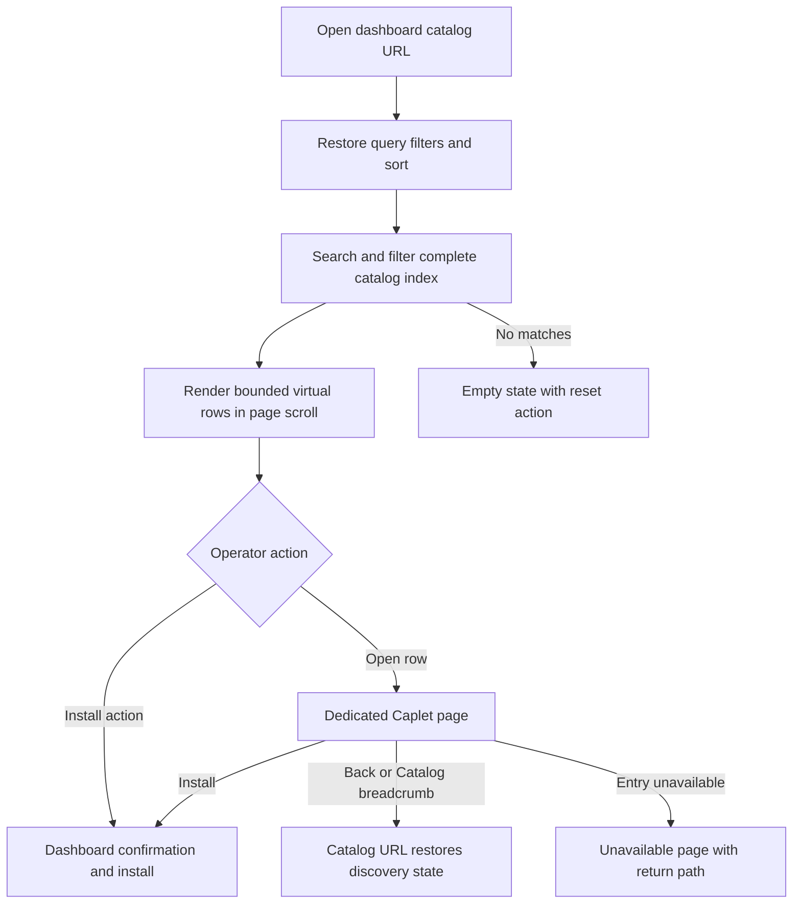
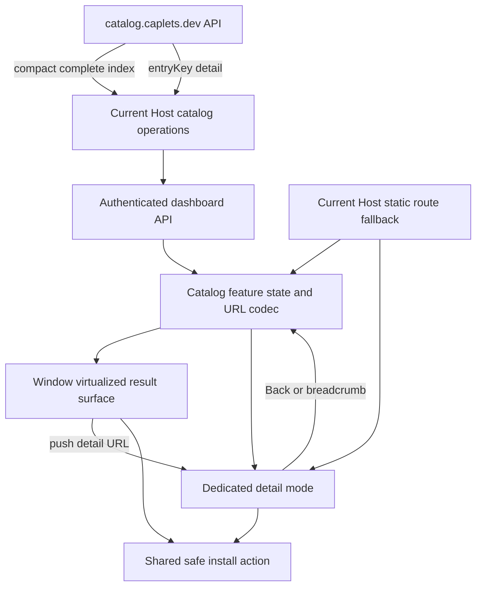
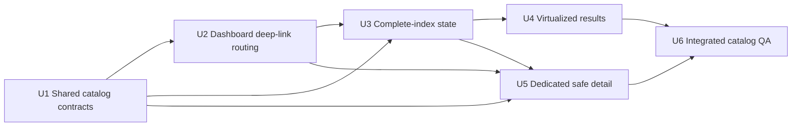

# Dashboard Catalog Parity - Plan

## Goal Capsule

- **Objective:** Give the built-in dashboard catalog the public catalog's complete-set browsing, virtualization, URL-backed state, and dedicated Caplet pages without copying the public site's visual treatment.
- **Product authority:** The public catalog's established behavior, the dashboard's Operator Client workflows, and the decisions confirmed in this Product Contract.
- **Open blockers:** None. The plan resolves route identity, complete-index delivery, static deep-link serving, virtualization ownership, and safe detail states.

---

## Product Contract

### Summary

The dashboard catalog will provide behavioral parity with the public catalog inside the existing operator-console design system. Operators will browse the complete catalog through a virtualized result table, preserve discovery state in the URL, and inspect or install each Caplet from a shareable dedicated page.

### Problem Frame

The public catalog already treats discovery as a complete-index workflow: search, filters, sorting, counts, URL state, and virtualization all operate over the full catalog. Its result list remains bounded as the catalog grows, and each entry has a canonical inspection route.

The dashboard currently requests at most 100 matches, derives filters from that subset, renders every returned row, and keeps detail inspection in the list page. This makes the dashboard behavior diverge from the public catalog, prevents complete discovery, increases rendering cost with result count, and makes individual Caplets impossible to bookmark or share within the operator console.

### Key Decisions

- **Behavioral parity, not visual cloning.** Reuse the public catalog's discovery, navigation, state, accessibility, and responsive behavior while retaining the dashboard shell, tokens, controls, and operator-focused presentation.
- **Complete index, not remote paging.** Search, filter, sort, count, and virtualization apply to the complete catalog rather than a capped or progressively loaded subset.
- **Dedicated pages, not an in-page inspector.** Each Caplet has a stable dashboard URL that owns inspection and installation; the list remains focused on discovery.
- **URL-backed list state.** Query, scope, setup, tag, and sort survive sharing and browser history. Exact pixel-level scroll restoration is not required.
- **Page scrolling.** The catalog participates in the dashboard page's normal scroll flow rather than introducing a nested result-list scroll region.

### Actors

- A1. **Operator:** An authenticated user browsing, inspecting, and installing Caplets on the Current Host.
- A2. **Current Host:** Serves the dashboard, retrieves catalog data, authorizes installation, and records operator actions.
- A3. **Catalog service:** Provides the complete versioned catalog index and entry content used by the dashboard.

### Requirements

**Complete discovery and URL state**

- R1. The dashboard must make the complete catalog available to search, filters, sorting, counts, and tag choices without a user-visible result ceiling.
- R2. Query, source scope, setup readiness, tag, and sort must be represented in the catalog URL and restored on direct load, Back, and Forward navigation.
- R3. Search and every filter or sort change must apply to the complete catalog and update the visible match count.
- R4. Changing search, filters, or sort must reset results to the beginning while preserving focus on the control that initiated the change.
- R5. Resetting filters must clear query and filters, restore the default ranking, update the URL, and return focus to search.

**Virtualized result browsing**

- R6. The result surface must virtualize rows with bounded overscan so the rendered DOM remains bounded when the catalog contains at least 10,000 entries.
- R7. Virtualization must use page scrolling and must not introduce a nested vertical result-list scrollbar.
- R8. Result rows must retain stable identity and predictable responsive height estimates across desktop, tablet, mobile, and narrow-mobile layouts.
- R9. Each row must expose the Caplet name, trust signal, concise description, install count, readiness or safety signals, and an available installation action.
- R10. Activating non-action row space must navigate to that Caplet's detail page, while explicit links, installation actions, and modified clicks retain their normal behavior.
- R11. The virtualized list must preserve semantic row structure, accessible position and count information, keyboard access, and focus for rendered controls.

**Dedicated Caplet pages**

- R12. Every catalog entry must have a stable, shareable dashboard route based on its catalog identity rather than only its display name.
- R13. A Caplet page must provide a Catalog breadcrumb or equivalent return path and entry-specific page metadata.
- R14. A Caplet page must show trust and repository identity, icon, name, description, install readiness, warnings, readable CAPLET.md content, and the authenticated installation action.
- R15. A Caplet page must expose source path, workflow, install count, revision, content hash, auth readiness, setup readiness, Project Binding readiness, and required or optional setup actions when available.
- R16. Unreadable content must have a clear unavailable state and must not present installation as safe or available when the required inspection contract cannot be satisfied.
- R17. A missing, suppressed, or no-longer-indexed entry must produce a dedicated unavailable page with a route back to catalog search.

**Operator workflow and presentation**

- R18. Installation from either the result list or detail page must retain the dashboard's existing confirmation, authorization, activity logging, readiness review, and error handling.
- R19. The feature must use the dashboard's existing design system and operator-console navigation rather than copying the public catalog's branding or page chrome.
- R20. Loading, success, empty, failure, copy, and installation states must be communicated through accessible text or announcements rather than color alone.
- R21. Motion used for state changes must respect reduced-motion preferences, and no content may depend on an entrance animation to become visible.

### Catalog Navigation Flow



### Key Flows

- F1. **Browse and refine the complete catalog**
  - **Trigger:** A1 opens the dashboard catalog directly or returns through browser history.
  - **Actors:** A1, A2, A3
  - **Steps:** The page restores URL state, obtains the complete index, applies discovery controls, and renders only the current virtual window.
  - **Outcome:** A1 can inspect the full match set without a capped result count or unbounded DOM.
  - **Covered by:** R1-R11, R20-R21

- F2. **Open and share a Caplet**
  - **Trigger:** A1 opens a result row, follows its link, or visits a shared detail URL.
  - **Actors:** A1, A2, A3
  - **Steps:** The dashboard resolves the catalog identity and presents the entry's inspection, readiness, metadata, and installation surface.
  - **Outcome:** The Caplet is independently addressable and inspectable without list-page selection state.
  - **Covered by:** R10, R12-R17, R19-R20

- F3. **Return to discovery**
  - **Trigger:** A1 uses Back, Forward, or the Catalog return path from a detail page.
  - **Actors:** A1, A2
  - **Steps:** The catalog route restores query, filters, and sort from the URL and renders the corresponding result set.
  - **Outcome:** A1 resumes the same discovery context without exact pixel-level scroll restoration being required.
  - **Covered by:** R2-R5, R13

- F4. **Install from discovery or detail**
  - **Trigger:** A1 invokes an available installation action.
  - **Actors:** A1, A2
  - **Steps:** The dashboard presents its existing review and typed confirmation, authorizes the operation, installs on the Current Host, and reports the result.
  - **Outcome:** Catalog parity does not weaken operator safety or bypass existing administrative controls.
  - **Covered by:** R9, R14, R16, R18, R20

### Acceptance Examples

- AE1. **Complete-set discovery**
  - **Covers R1, R3, R6.**
  - **Given:** The catalog contains more than 100 entries and includes a match beyond the first 100.
  - **When:** A1 searches for that match.
  - **Then:** The match is discoverable, the count reflects all matches, and only a bounded virtual window is mounted.

- AE2. **Direct URL restoration**
  - **Covers R2-R5.**
  - **Given:** A catalog URL contains non-default query, scope, setup, tag, and sort values.
  - **When:** A1 opens the URL directly.
  - **Then:** Every control and the result set reflect those values; resetting returns to default ranking and focuses search.

- AE3. **Browser history across detail navigation**
  - **Covers R2, R10, R12-R13.**
  - **Given:** A1 filtered the catalog and opened a Caplet detail page.
  - **When:** A1 uses Back.
  - **Then:** The catalog restores the prior query, filters, and sort without requiring exact pixel-level scroll restoration.

- AE4. **Virtualized responsive browsing**
  - **Covers R6-R8, R11, R21.**
  - **Given:** The catalog contains 10,000 entries.
  - **When:** A1 scrolls at desktop, tablet, mobile, and narrow-mobile widths.
  - **Then:** DOM row count stays bounded, row positions remain stable, controls remain keyboard accessible, and reduced-motion settings are respected.

- AE5. **Empty result recovery**
  - **Covers R3-R5, R20.**
  - **Given:** The active discovery state matches no entries.
  - **When:** The result set updates.
  - **Then:** The dashboard announces zero matches, shows a reset action, and returns focus to search after reset.

- AE6. **Unavailable entry**
  - **Covers R16-R17.**
  - **Given:** A shared detail URL resolves to an absent entry or an entry without readable content.
  - **When:** A1 opens it.
  - **Then:** The page explains the unavailable state, provides a catalog return path, and does not expose an unsafe installation action.

- AE7. **Safe installation**
  - **Covers R14, R18, R20.**
  - **Given:** A1 chooses Install from a result row or detail page.
  - **When:** The operation requires confirmation or reports a readiness warning.
  - **Then:** The existing dashboard review, authorization, activity logging, success feedback, and safe error handling remain in effect.

### Success Criteria

- The dashboard can discover and count entries beyond the former 100-result ceiling.
- A 10,000-entry catalog keeps a bounded number of result rows mounted throughout scrolling and filtering.
- Catalog URLs reproduce query, scope, setup, tag, and sort state on direct load and browser navigation.
- Every result links to an independently loadable dashboard detail page with the full inspection and installation contract.
- Search, filter, sort, reset, row navigation, copy, and installation flows remain keyboard operable and produce accessible state feedback.
- Desktop, tablet, mobile, and narrow-mobile layouts remain usable without nested vertical result scrolling.

### Scope Boundaries

- Visual cloning of the public catalog's branding, header, or page chrome is out of scope.
- Server-side paging, infinite loading, and loading additional results during scroll are out of scope.
- Exact pixel-level scroll restoration after returning from detail is not required; restoring URL-backed discovery state is required.
- Changes to the public catalog's behavior or visual design are out of scope unless needed to preserve a shared behavioral contract.
- Project-scoped installation remains out of scope; the dashboard continues to administer the Current Host's global catalog lifecycle.

### Dependencies / Assumptions

- The versioned catalog service continues to provide a complete index with stable entry identities and the metadata needed for list and detail presentation.
- The dashboard remains an authenticated Current Host surface with existing installation authorization, confirmation, activity logging, and safe-error behavior.
- Catalog identities remain stable enough to support durable detail links; exact route encoding is a planning decision.
- The existing dashboard detail contract remains the authority for operator-only readiness and setup actions that the public catalog does not own.

### Sources / Research

- `apps/catalog/src/scripts/virtual-results.ts` — public complete-index URL state, page-scroll virtualization, row navigation, focus, and responsive estimates.
- `apps/catalog/src/components/ResultList.astro` — public result semantics, bounded initial markup, status signals, install actions, and resettable empty state.
- `apps/catalog/src/pages/caplets/[entryKey].astro` and `apps/catalog/src/components/CapletDetail.astro` — public canonical detail route and inspection surface.
- `apps/dashboard/src/components/DashboardApp.tsx` — current dashboard result cap, local state, full-row rendering, in-page detail, installation workflow, and operator readiness data.
- `packages/core/src/current-host/operations.ts` and `packages/core/src/catalog/types.ts` — dashboard catalog operation and entry contracts.
- `docs/brainstorms/2026-06-27-catalog-search-virtualized-results-requirements.md` — established complete-set, 10,000-entry, virtualization, URL-state, responsive, and accessibility requirements.

---

## Planning Contract

**Product Contract preservation:** No R/A/F/AE scope changed. The planning-owned questions were resolved into the decisions and units below.

### Key Technical Decisions

- KTD1. **Expose a compact complete-index projection through the catalog API.** Extend the existing versioned list endpoint with a compact-index view rather than sending every entry's CAPLET.md body to the dashboard. Define the projection in `@caplets/core` so the public catalog producer and Current Host consumer share entry identity, ranking, readiness, warning, icon, and install-command semantics.
- KTD2. **Use `entryKey` as the canonical dashboard route and catalog-action identity.** Build base-path-safe detail URLs with encoded catalog entry keys, decode defensively, and resolve detail through the existing catalog entry API. Server-side catalog installation accepts the stable `entryKey`, resolves the current detail, and derives the display ID/source command rather than trusting client-supplied summary fields.
- KTD3. **Keep catalog acquisition behind Current Host operations with hard resource bounds.** Add a complete-index operation and evolve detail lookup to stable entry identity; the dashboard browser continues to call only its own authenticated host. The host validates downstream envelopes, applies a five-second timeout, rejects compact responses over 32 MiB or 10,000 entries and detail responses over 2 MiB, bounds strings/URLs/tags before retention, and classifies every limit violation as `DOWNSTREAM_PROTOCOL_ERROR`.
- KTD4. **Serve deep links through the static dashboard shell.** The dashboard remains a static Astro build. Current Host static routing falls back from `/dashboard/catalog/<encoded-entry-key>` to the emitted catalog shell, after which React selects list or detail mode from the browser location.
- KTD5. **Mirror the public URL-state policy.** One pure codec owns `q`, `scope`, `setup`, `tag`, and `sort`. Control changes use `replaceState`, popstate replays without rewriting, defaults are omitted, malformed values normalize, and list-to-detail navigation uses normal history so Back restores the encoded discovery state.
- KTD6. **Reuse TanStack virtual-core in the dashboard browser layer.** Add `@tanstack/virtual-core` directly to the dashboard workspace and adapt the public catalog's window virtualizer, overscan, stable keys, responsive estimates, focus behavior, and page-scroll model to React. Do not add a second vertical scrolling region or render parallel mobile and desktop result trees.
- KTD7. **Make detail safety an authoritative state machine.** Detail is `loading`, `available`, `unavailable`, or `failed`. Only `available` detail with readable content and an installable command enables confirmation. A row Install action first fetches current detail by `entryKey` in place; failure leaves the action non-installable. The authenticated install endpoint independently resolves the same current detail and rejects absent, suppressed, unreadable, stale, summary-only, or command-mismatched requests, so direct API calls cannot bypass UI gating.
- KTD8. **Extract a dashboard catalog feature module.** Keep `DashboardApp` as the shell/router and move discovery state, route helpers, virtual rows, and detail presentation into focused catalog files. Reuse the existing confirmation/action callback so Operator authorization, activity logging, lockfile behavior, and safe errors remain centralized.
- KTD9. **Keep downstream CAPLET.md inert.** Present CAPLET.md with the dashboard's existing escaped plain-text `<pre>` treatment; do not interpret raw HTML or construct links from catalog Markdown. Repository links remain separately validated `https:` URLs and any new-tab link carries `rel="noopener noreferrer"`.

### High-Level Technical Design



The complete index is fetched once for a mounted catalog feature and retained while list and detail modes change. Filtering, sorting, tag derivation, counts, and ranking are pure client operations over that snapshot. Detail is fetched independently by `entryKey`, so direct links do not depend on list selection or list-summary content.

List-to-detail, direct-load, and Forward transitions focus the detail page heading (`tabIndex={-1}`) after the requested entry resolves. Back or breadcrumb return restores focus to the originating row-title link when mounted; otherwise it focuses the catalog heading or search control without forcing exact scroll restoration.

### Output Structure

```text
apps/dashboard/src/components/catalog/
  CatalogPage.tsx
  CatalogResults.tsx
  CatalogDetailPage.tsx
  catalog-state.ts
  catalog-route.ts
```

Exact filenames may consolidate when one file would remain shallow, but state/route logic must stay independently testable and `DashboardApp.tsx` must not retain the full catalog implementation.

### Sequencing



### System-Wide Impact

- **Catalog API:** Adds a compact complete-index representation while preserving the existing full-list and per-entry contracts for current consumers.
- **Current Host:** Adds index retrieval and stable-entry detail selection without moving catalog policy into the HTTP adapter.
- **Dashboard static serving:** Introduces one narrow catalog deep-link fallback; other dashboard routes and asset traversal protections remain unchanged.
- **Dashboard browser:** Replaces capped remote search and in-page selection with one complete snapshot, URL state, window virtualization, and route-level detail.
- **Package surface:** Adds the already-used `@tanstack/virtual-core` dependency to `apps/dashboard`; published runtime package behavior changes because the built-in dashboard is bundled by `@caplets/core`.

### Risks and Mitigations

- **Oversized catalog payload:** A full `CatalogEntry[]` includes readable content and does not scale to 10,000 entries. Mitigate with KTD1's compact projection and fetch content only for detail.
- **Static deep-link 404:** Client routing alone cannot satisfy a direct nested URL. Mitigate with KTD4 and focused static-route tests under root and configured base paths.
- **Route collisions or malformed keys:** Display IDs are not globally stable. Mitigate with encoded `entryKey`, defensive decoding, and explicit unavailable behavior.
- **Stale async detail:** Rapid navigation can resolve requests out of order. Abort or correlate detail loads so an older response cannot overwrite the active URL.
- **Virtualizer offset drift:** The sticky dashboard shell and responsive row content can skew window measurements. Use bounded row content, document-offset measurement, resize remeasurement, and browser QA at all four target widths.
- **Accessibility regression from virtualization:** Removed DOM nodes can disrupt focus and semantics. Keep real links/actions, role-based row semantics, full `aria-rowcount`, correct `aria-rowindex`, active-control focus, and reduced-motion behavior.
- **Safety regression from summary or direct-API fallback:** Never treat a list projection or client-side disabled control as sufficient installation evidence. Enforce KTD7 unconditionally in both UI preflight and the authenticated server-side catalog install operation.

### Assumptions

- The public catalog API can add a compact representation without changing public catalog page behavior.
- The catalog's existing `entryKey` remains the source-stable identity for both official and community entries, including Multi-Backend Caplet File parents.
- Exact responsive estimates begin with the public catalog's 72/168/188/320 pixel values and may be tuned during browser verification without changing the Product Contract.
- Returning near the previously opened row is best-effort; URL-backed discovery state is the required restoration contract.

### Sources and Patterns

- `apps/catalog/src/scripts/virtual-results.ts` and `apps/catalog/test/virtual-results.test.ts` are the behavioral oracle for complete-index filtering, URL state, page-scroll virtualization, responsive estimates, focus, click routing, and cleanup.
- `apps/catalog/src/lib/search-row.ts`, `apps/catalog/src/lib/catalog-store.ts`, and `apps/catalog/src/pages/api/v1/catalog/index.ts` define the current public index and count/rank enrichment.
- `apps/catalog/src/pages/api/v1/catalog/entries/[entryKey].ts` is the stable detail lookup contract.
- `apps/dashboard/src/lib/paths.ts` is the required base-path-safe URL primitive.
- `apps/dashboard/src/components/DashboardApp.test.tsx` supplies the React/happy-dom harness; new catalog tests should mirror its API mocking and history cleanup.
- `packages/core/src/current-host/catalog-operations.ts` is the deep Current Host catalog seam; `packages/core/src/serve/http.ts` remains an adapter.
- `packages/core/test/dashboard-catalog.test.ts` and `packages/core/test/dashboard-static.test.ts` own the host API and static-serving contracts.

---

## Implementation Units

### U1. Shared compact index and stable detail contracts

- **Goal:** Deliver a complete, compact catalog index and stable-entry detail lookup through the public catalog API, Current Host operations, and dashboard HTTP adapter.
- **Requirements:** R1-R3, R9, R12, R14-R17; F1-F2; AE1, AE6.
- **Dependencies:** None.
- **Files:**
  - Modify `packages/core/src/catalog/types.ts`
  - Modify the relevant exports under `packages/core/src/catalog/`
  - Modify `apps/catalog/src/lib/catalog-store.ts`
  - Modify `apps/catalog/src/pages/api/v1/catalog/index.ts`
  - Modify `apps/catalog/src/pages/api/v1/catalog/entries/[entryKey].ts` only if response classification needs strengthening
  - Modify `apps/catalog/test/catalog-api.test.ts`
  - Modify `packages/core/src/current-host/operations.ts`
  - Modify `packages/core/src/current-host/catalog.ts`
  - Modify `packages/core/src/current-host/catalog-operations.ts`
  - Modify `packages/core/src/serve/http.ts`
  - Modify `packages/core/test/dashboard-catalog.test.ts`
- **Approach:** Define a shared compact index entry that excludes readable content but retains stable identity, rank/count, display, trust, readiness, warning, icon, and install-command fields. Add a compact view to the existing versioned list endpoint. Add Current Host complete-index and stable-key catalog-install operations; make official detail resolve through the per-entry API by encoded `entryKey`, while local-source helpers may project local entries through the same identity contract. Read response bodies through bounded streaming helpers before JSON parsing, validate collection/field limits and envelopes, and preserve timeout/safe-error behavior at the Current Host boundary. On install, authorize the Operator, re-resolve current detail by `entryKey`, derive the actual source/display ID, compare the current command with any confirmed command identity, and reject every unavailable, unreadable, stale, or summary-only target before invoking the existing installer.
- **Execution note:** Start with failing API and Current Host tests proving the former 100-entry ceiling and ID-only detail lookup are insufficient.
- **Patterns to follow:** `apps/catalog/src/lib/search-row.ts`, `apps/catalog/src/lib/catalog-store.ts`, `packages/core/src/current-host/catalog-operations.ts`, and the envelope validation in `packages/core/src/current-host/catalog.ts`.
- **Test scenarios:**
  - Covers AE1. A compact index response with 150 entries returns all 150 through the dashboard API, including an entry beyond position 100.
  - Compact index entries omit `contentMarkdown` while retaining `entryKey`, count/rank, tags, readiness, warnings, icon, source identity, and install command.
  - A detail request by an encoded repository-qualified `entryKey` returns the matching entry even when another entry shares its display ID.
  - Missing detail is machine-distinguishable from a timeout, non-success response, or malformed downstream envelope.
  - Official downstream timeout and invalid-response behavior retain `SERVER_UNAVAILABLE` and `DOWNSTREAM_PROTOCOL_ERROR` safe errors.
  - Oversized, over-count, over-cardinality, and over-length compact/detail responses are rejected as `DOWNSTREAM_PROTOCOL_ERROR` without retaining partial attacker-controlled data.
  - Direct authenticated install requests cannot bypass detail readability/installability checks or substitute a stale command, source, or display ID.
  - Existing local-source detail/setup-action tests and global install/activity tests remain green.
- **Verification:** The public API and dashboard host expose complete compact index data, stable-entry detail, and unchanged installation side effects without content leakage into the index.

### U2. Base-path-safe catalog routing and static deep-link fallback

- **Goal:** Make list and detail URLs directly loadable, refreshable, shareable, and compatible with configured dashboard base paths.
- **Requirements:** R2, R10, R12-R13, R17, R19; F2-F3; AE3, AE6.
- **Dependencies:** U1.
- **Files:**
  - Create `apps/dashboard/src/components/catalog/catalog-route.ts`
  - Modify `apps/dashboard/src/lib/paths.ts`
  - Modify `apps/dashboard/src/components/DashboardApp.tsx`
  - Modify `apps/dashboard/src/components/DashboardApp.test.tsx`
  - Modify `packages/core/src/dashboard/routes.ts`
  - Modify `packages/core/test/dashboard-static.test.ts`
- **Approach:** Extend dashboard location parsing so `catalog` remains the shell RouteKey while an optional decoded `entryKey` selects detail mode. Generate list and detail hrefs through `dashboardPath`. Preserve the originating list URL in history state for the detail breadcrumb, with the plain catalog route as fallback. In static serving, map only nested catalog routes without file extensions to the existing catalog shell after normal decode/traversal safety checks.
- **Execution note:** Characterize current dashboard route/base-path behavior before adding the nested catalog case.
- **Patterns to follow:** `apps/dashboard/src/lib/paths.ts`, `DashboardApp`'s existing `navigate`/popstate handling, public `encodeURIComponent(entry.entryKey)` links, and `dashboardStaticResponse` path safety.
- **Test scenarios:**
  - Direct `/dashboard/catalog/<encoded-entryKey>` and the equivalent configured-base-path URL serve the catalog shell and load detail mode.
  - Malformed encoding and traversal-shaped paths do not escape the static directory or resolve as catalog detail.
  - List and detail URL helpers round-trip entry keys containing colons and encoded source-path characters.
  - Normal row navigation pushes detail history; Back restores the prior list URL; Forward restores detail.
  - List-to-detail, direct-load, and Forward transitions focus the resolved detail heading; Back/breadcrumb return focuses the originating mounted row link or the catalog heading/search fallback.
  - A direct/shared detail load uses `/dashboard/catalog` as its return path when no originating list state exists.
- **Verification:** Nested catalog URLs work on initial request, refresh, Back, Forward, and non-root mounts without broadening the static fallback.

### U3. Complete-index state and URL-backed discovery

- **Goal:** Replace capped remote query state with one complete index snapshot and deterministic local discovery controls.
- **Requirements:** R1-R5, R20-R21; F1, F3; AE1-AE3, AE5.
- **Dependencies:** U1, U2.
- **Files:**
  - Create `apps/dashboard/src/components/catalog/catalog-state.ts`
  - Create `apps/dashboard/src/components/catalog/CatalogPage.tsx`
  - Create `apps/dashboard/src/components/catalog/catalog-state.test.ts`
  - Create `apps/dashboard/src/components/catalog/CatalogPage.test.tsx`
  - Modify `apps/dashboard/src/components/DashboardApp.tsx`
- **Approach:** Fetch the complete index once per mounted feature, retain the last complete snapshot through list/detail transitions, and derive tags, rank/name sorting, filters, and counts from pure functions. Initialize the five discovery dimensions from the URL, normalize unknown values, omit defaults when serializing, use `replaceState` for control changes, and replay popstate without rewrite loops. Reset virtual position on refinements while preserving the active control; Reset restores defaults and focuses search.
- **Patterns to follow:** `apps/catalog/src/lib/search-filter.ts`, `apps/catalog/src/scripts/virtual-results.ts`, dashboard API error handling, and the existing dashboard React test harness.
- **Test scenarios:**
  - Covers AE1. Search finds an entry beyond the former first 100 and the match count reflects the complete snapshot.
  - Covers AE2. Direct URL values hydrate query, scope, setup, tag, and sort; unknown values normalize to defaults.
  - Scope, setup, tag, name sort, and rank sort operate over the full index; tags derive from the full snapshot rather than visible virtual rows.
  - Control changes update URL state without adding history spam, preserve unrelated query parameters, reset results to the beginning, and retain initiating-control focus.
  - Covers AE5. Zero matches announce the result and expose Reset; Reset restores defaults, URL, count, and search focus.
  - First-load failure exposes Retry; superseded requests cannot overwrite a newer successful snapshot.
- **Verification:** Discovery behavior is deterministic from index plus URL, no request includes a search query or 100-entry limit, and all five dimensions survive direct load and browser history.

### U4. Window-virtualized responsive result surface

- **Goal:** Render a bounded, accessible result window in page scroll while preserving public-catalog row behavior and dashboard presentation.
- **Requirements:** R6-R11, R19-R21; F1; AE1, AE4-AE5.
- **Dependencies:** U3.
- **Files:**
  - Modify `apps/dashboard/package.json`
  - Modify `pnpm-lock.yaml`
  - Create `apps/dashboard/src/components/catalog/CatalogResults.tsx`
  - Create `apps/dashboard/src/components/catalog/CatalogResults.test.tsx`
  - Modify `apps/dashboard/src/components/catalog/CatalogPage.tsx`
  - Remove superseded result-grid/loading helpers from `apps/dashboard/src/components/DashboardApp.tsx`
- **Approach:** Add the same `@tanstack/virtual-core` version used by the public catalog. Use a window virtualizer with overscan 8, stable `entryKey` keys, list document offset, resize remeasurement, and public responsive estimates as initial values. Render one responsive row tree with role-based table semantics, real title links, isolated Install and Copy controls, full `aria-rowcount`, correct `aria-rowindex`, bounded descriptions/statuses, and no nested vertical scroller. Copy uses the existing accessible clipboard success toast; rejection announces failure and exposes the command for manual selection. Row Install fetches current detail by `entryKey` in place, then enters the shared confirmation only when KTD7 is satisfied.
- **Execution note:** Prove bounded rendering with 10,000 deterministic fixtures before tuning visual estimates.
- **Patterns to follow:** `apps/catalog/src/scripts/virtual-results.ts`, `apps/catalog/src/components/ResultList.astro`, and `apps/catalog/test/virtual-results.test.ts`.
- **Test scenarios:**
  - Covers AE4. A 10,000-entry index reports 10,000 matches while mounted result rows remain bounded during initial render, scrolling, filtering, and sorting.
  - Page scroll drives the virtualizer; the result surface has no nested vertical overflow region.
  - Stable row keys preserve the correct entries after rank/name sort and filter changes.
  - Desktop, tablet, mobile, and narrow-mobile estimates switch at the defined breakpoints and resize triggers remeasurement.
  - An unmodified primary click on non-interactive row space navigates; title links, Install/Copy controls, and modified clicks keep native behavior.
  - Rows expose semantic row structure, `aria-rowindex`, total `aria-rowcount`, keyboard-accessible controls, accessible count/copy/install changes, and reduced-motion-safe scrolling; clipboard rejection leaves a manually selectable command.
  - Unmount removes window scroll, resize, media-query, and virtualizer subscriptions.
- **Verification:** Large result sets keep bounded DOM and correct semantics across all target widths without duplicating desktop/mobile trees.

### U5. Dedicated detail page and shared safe installation

- **Goal:** Replace the in-page inspector with a route-level Caplet page that preserves full operator inspection and installation safety.
- **Requirements:** R12-R20; F2, F4; AE3, AE6-AE7.
- **Dependencies:** U1, U2, U3.
- **Files:**
  - Create `apps/dashboard/src/components/catalog/CatalogDetailPage.tsx`
  - Create `apps/dashboard/src/components/catalog/CatalogDetailPage.test.tsx`
  - Modify `apps/dashboard/src/components/catalog/CatalogPage.tsx`
  - Modify `apps/dashboard/src/components/DashboardApp.tsx`
  - Modify `packages/core/test/dashboard-catalog.test.ts` if server-side install-readiness enforcement changes
- **Approach:** Drive detail from route identity and explicit request state, not list selection. Extract and reuse the existing warning, escaped plain-text CAPLET.md, readiness, setup-action, metadata, Copy, confirmation, and installation presentation. Abort or correlate navigation requests. Render distinct unavailable and transient-failure states with return/retry actions. Focus the resolved detail heading after list-to-detail, direct-load, and Forward transitions; restore the originating mounted row link or catalog heading/search fallback on return. Keep one install function for row and detail entry points: row invocation first fetches current detail in place, and both paths remain disabled until detail is available, readable, installable, and accepted by the server-side KTD7 validation.
- **Execution note:** Add state-transition tests before deleting the in-page fallback, because stale detail and unsafe summary fallback are plausible regressions.
- **Patterns to follow:** Existing `CatalogDetailPanel`, `SafetyWarnings`, `installReviewSummary`, `useActionConfirm`, public `CapletDetail.astro`, and Current Host activity tests.
- **Test scenarios:**
  - Direct encoded detail route loads by `entryKey`, renders entry-specific title/context, and does not require an index selection.
  - Available detail shows trust/repository, warnings, inert escaped CAPLET.md, workflow, counts, revision/hash, three readiness states, setup actions, copy feedback, and install review; only validated `https:` repository links are clickable.
  - Covers AE6. Missing/suppressed, unreadable, malformed-key, timeout, and server-failure states remain distinct; unsafe states expose no enabled install.
  - Rapid A-to-B navigation cannot display A's late response under B's URL.
  - Covers AE7. Row installation fetches and validates current detail before shared typed confirmation; row and detail paths call the same stable-key endpoint, disable duplicate submission, refresh host state, and announce success or safe failure.
  - Copy succeeds with an accessible toast; clipboard rejection announces failure and leaves the command manually selectable on list and detail surfaces.
  - Detail entry focuses its heading; breadcrumb/Back focuses the originating mounted row link or the documented catalog fallback and returns to the originating filtered list URL or plain catalog route.
- **Verification:** Every Caplet route is independently inspectable, safe failures never fall back to summary installation, and existing Operator lifecycle behavior remains intact.

### U6. Integrated catalog parity verification

- **Goal:** Prove the end-to-end dashboard behavior in the bundled Current Host surface and remove superseded catalog code.
- **Requirements:** R1-R21; F1-F4; AE1-AE7.
- **Dependencies:** U4, U5.
- **Files:**
  - Modify `apps/dashboard/src/components/DashboardApp.test.tsx` only for shell-level integration cases
  - Modify `packages/core/test/dashboard-catalog.test.ts`
  - Modify `packages/core/test/dashboard-static.test.ts`
  - Modify `.changeset/fix-dashboard-catalog-source.md`
  - Remove obsolete catalog list/detail helpers from `apps/dashboard/src/components/DashboardApp.tsx`
- **Approach:** Exercise the built dashboard through Current Host authentication with representative official/community, Multi-Backend, warning, unreadable, missing, and 10,000-entry fixtures. Verify browser history, responsive page-scroll virtualization, focus, reduced motion, detail safety, and installation. Keep the public catalog suite as a parity oracle rather than moving dashboard behavior into it.
- **Execution note:** Browser verification is required; happy-dom tests cannot establish real window measurement, focus, overflow, or responsive layout.
- **Patterns to follow:** `packages/core/test/dashboard-catalog.test.ts`, `packages/core/test/dashboard-static.test.ts`, `apps/catalog/test/virtual-results.test.ts`, and the `ce-test-browser` affected-page workflow.
- **Test scenarios:**
  - The bundled dashboard authenticates, loads all matches, navigates to a detail deep link, refreshes it, installs after confirmation, and returns to preserved list state.
  - A 10,000-entry fixture keeps mounted rows bounded during real scrolling at desktop, tablet, mobile, and narrow-mobile widths.
  - No nested vertical result scrollbar appears; horizontal overflow remains limited to layouts that require it.
  - Keyboard search/filter/reset/row/detail/copy/install flows move or retain visible focus at the documented destination and produce accessible announcements, including clipboard rejection.
  - Reduced-motion mode avoids smooth scrolling or transition-dependent visibility.
  - Missing and unreadable detail routes remain non-installable after refresh and Back/Forward.
- **Verification:** Focused API/component/static suites pass, browser QA covers the affected routes and widths, the built core package contains the new dashboard assets, and no obsolete in-page inspector or capped query path remains.

---

## Verification Contract

| Gate                       | Scope                                                                                                    | Required result                                                                                                                                   |
| -------------------------- | -------------------------------------------------------------------------------------------------------- | ------------------------------------------------------------------------------------------------------------------------------------------------- |
| Catalog API tests          | `pnpm --filter @caplets/catalog test -- test/catalog-api.test.ts`                                        | Compact/full API views and stable detail outcomes pass.                                                                                           |
| Current Host catalog tests | `pnpm --filter @caplets/core test -- test/dashboard-catalog.test.ts test/dashboard-static.test.ts`       | Complete index, detail identity, install safety, activity, and deep-link serving pass.                                                            |
| Dashboard component tests  | `pnpm test -- apps/dashboard/src/components/catalog apps/dashboard/src/components/DashboardApp.test.tsx` | URL state, virtualization, detail states, history, accessibility, and shared install behavior pass.                                               |
| Public parity oracle       | `pnpm --filter @caplets/catalog test -- test/virtual-results.test.ts`                                    | Existing public behavior remains green.                                                                                                           |
| Dashboard typecheck/build  | `pnpm --filter @caplets/dashboard typecheck` and `pnpm --filter @caplets/dashboard build`                | React/Astro types pass and every dashboard static route builds.                                                                                   |
| Core package build         | `pnpm --filter @caplets/core build`                                                                      | Updated dashboard assets are copied into the built-in runtime package.                                                                            |
| Browser verification       | Run `ce-test-browser` for `/dashboard/catalog` and one encoded detail route                              | Real page scrolling, bounded rows, Back/Forward, refresh, focus, responsive widths, reduced motion, and no nested vertical overflow are observed. |
| Final repository gate      | `pnpm verify`                                                                                            | Format, lint, generated checks, types, all tests, benchmarks, and build pass.                                                                     |

---

## Definition of Done

- U1-U6 are implemented in dependency order and every cited R/F/AE is either verified or explicitly blocked by evidence that changes the Product Contract.
- The dashboard browses the complete compact index; no browser request or host response imposes the former 100-result ceiling.
- A 10,000-entry result set keeps mounted rows bounded and uses page scrolling at all four responsive targets.
- Query, scope, setup, tag, and sort round-trip through direct URLs and Back/Forward without rewrite loops.
- Every catalog entry has a refreshable, base-path-safe dashboard detail route keyed by `entryKey`.
- Missing, unreadable, malformed, timed-out, and failed detail states remain distinguishable and non-installable.
- Row and detail installation preserve Operator authorization, confirmation, activity logging, readiness review, duplicate-submit protection, and safe feedback.
- Keyboard, focus, ARIA count/index, empty reset, responsive, and reduced-motion contracts pass component and browser verification.
- Public catalog API and virtualization tests remain green; the dashboard retains its own visual language.
- The changeset describes catalog API sourcing, behavioral parity, dedicated routes, virtualization, and test-state isolation.
- `pnpm verify` passes, abandoned experiments and superseded in-page catalog code are removed, and the final diff contains no compatibility shim for the capped query path.
