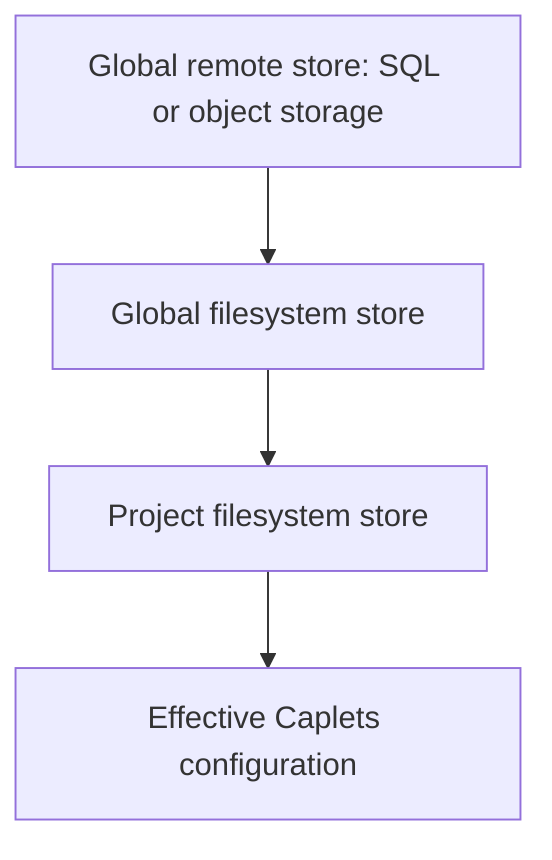
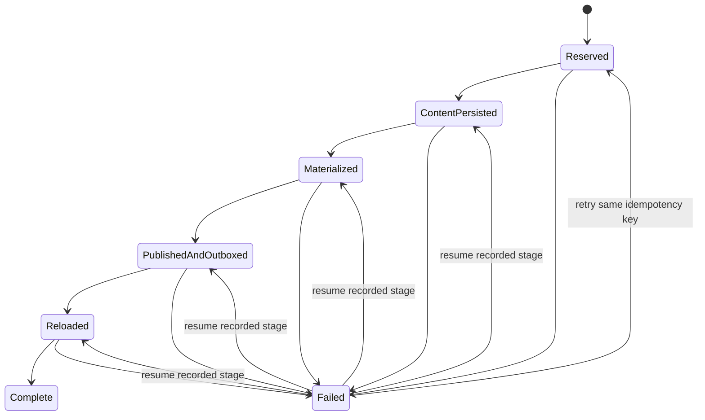
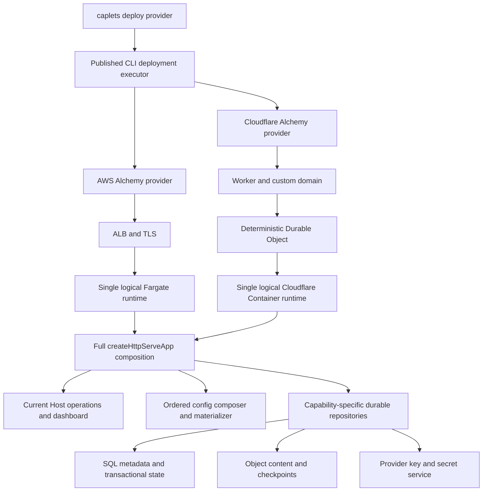
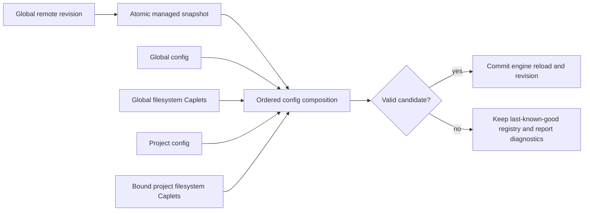
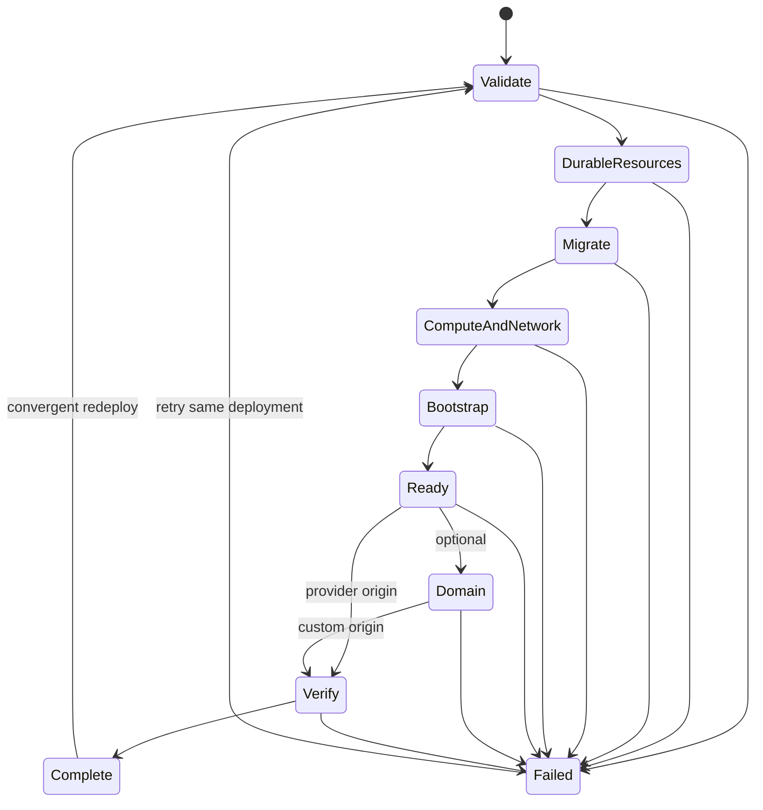

# Portable Cloud Runtime Deployment - Plan

## Goal Capsule

- **Objective:** Let an operator deploy a complete, durable remote Caplets runtime to AWS or Cloudflare with one command.
- **Product authority:** The confirmed Product Contract governs behavior; the Planning Contract governs implementation; repository conventions govern details neither contract fixes.
- **Execution profile:** Deep, cross-cutting code work across core runtime storage, Project Binding, dashboard/control, published CLI packaging, and provider infrastructure.
- **Stop conditions:** Stop rather than narrow scope if a provider cannot run the full remote surface, if a migration could destroy durable state, or if operator credentials or Vault material would enter deployment state or logs.
- **Storage dependency gate:** U1-U9 MUST NOT execute until `docs/plans/2026-07-11-003-feat-composable-shared-storage-plan.md` lands and this cloud plan is re-deepened against its Writable Authority, staged-ID reservation, provider matrix, shared dashboard-session, and generation contracts. U10 may run only as explicitly carved-out feasibility research; it does not authorize implementation.
- **Tail ownership:** LFG owns implementation, focused and full verification, simplification, independent review, review fixes, changeset, PR creation, and CI repair.

---

## Product Contract

### Summary

Add `caplets deploy <cloud>` for one-command deployment of a complete single-instance remote Caplets runtime, including the operator dashboard, to AWS or Cloudflare.
Keep filesystem storage as the zero-configuration local default while allowing cloud deployments to use portable SQL or object-storage backends beneath ordered filesystem overlays.

### Problem Frame

The repository provides a self-hosted remote runtime whose durable configuration and state depend on local filesystem paths and a persistent mounted volume.
That model works for a conventional single host, but the repository does not define a full-runtime AWS or Cloudflare deployment, and cloud redeploys cannot assume that local process storage survives.
The runtime also stores some state in memory, while Caplet definitions, operator credentials, setup data, Project Binding workspaces, and catalog mutations follow separate filesystem paths.
A Caplet source adapter alone would therefore not make the complete remote runtime durable in cloud environments.

No user deployment attempt has been observed yet.
The v1 requirements are based on the desired operator experience and verified constraints in the current codebase rather than a demonstrated production workaround.

### Key Decisions

- **Portable durable runtime:** Cloud deployment must make the complete remote runtime restart-safe instead of only packaging the current filesystem-bound host.
- **Single logical instance:** V1 targets one logical runtime instance and does not promise cross-replica coordination.
- **Two remote storage families:** SQL and object storage are separate adapter families because their capabilities differ; supported SQL engines share consistent behavior through Drizzle.
- **Filesystem remains the default:** Existing local use requires no remote store, and filesystem sources continue to work as overlays when a remote store is configured.
- **Explicit mutation scope:** `--remote`, `--global`, and `--project` select where an install, update, or other supported write is persisted.
- **Dashboard is part of the runtime:** Every cloud deployment includes the operator dashboard because it is the primary configuration and administration surface.

The source-resolution order is fixed from lowest to highest priority:



Later sources win same-identity collisions, while the runtime retains shadow provenance for operator inspection.

### Actors

- A1. **Operator:** Supplies cloud credentials, deploys and configures the runtime, administers Caplets, and uses the dashboard.
- A2. **Remote client:** Authenticates to the deployed runtime and uses its MCP, attach, control-authorized, and Project Binding capabilities according to granted access.

### Requirements

**Deployment experience**

- R1. `caplets deploy <cloud>` must fully provision a usable remote Caplets runtime from one command when the operator has valid provider credentials.
- R2. V1 must support both AWS and Cloudflare as deployment targets through the Alchemy-powered deployment workflow.
- R3. The command must support an optional custom domain and may expose provider-specific customizations without requiring them for a default deployment.
- R4. A successful deployment must leave the operator with the endpoint and authentication path needed to administer and use the runtime without logging into the host filesystem.
- R5. Re-running deployment for the same target must preserve durable runtime state unless the operator explicitly requests destructive replacement.

**Runtime completeness and durability**

- R6. The deployed instance must include the remote MCP, attach, control, health, Project Binding, authentication, and operator-dashboard surfaces expected from the self-hosted remote runtime.
- R7. Durable operator configuration, credentials, setup state, Project Binding data, Caplet data, and administrative metadata must survive a normal runtime restart or redeployment.
- R8. Process-bound sessions may require reconnection after restart, but their loss must not erase durable configuration, credentials, or workspace data.
- R9. The operator dashboard must be available in every cloud deployment and must support configuration and administration of that deployed instance.

**Storage and source composition**

- R10. Filesystem storage must remain the default when no remote store is configured.
- R11. A runtime may compose a global remote store, a global filesystem store, and a project filesystem store at the same time.
- R12. Source precedence must be global remote store, then global filesystem store, then project filesystem store, with each later source having higher priority.
- R13. Same-identity collisions must activate the highest-priority definition and retain lower-priority source provenance as shadows.
- R14. Remote storage support must include an object-storage family suitable for S3-compatible services and a SQL family with consistent SQLite, MySQL, and PostgreSQL behavior.
- R15. SQL portability should use Drizzle so supported SQL engines can be swapped without changing user-facing Caplets storage semantics.
- R16. Storage-family differences must remain visible where their capabilities materially differ rather than being hidden behind a lowest-common-denominator contract.

**Mutation scope and compatibility**

- R17. `--remote` must write to the backend store configured on the target remote runtime.
- R18. `--global` must write to the global filesystem scope, and `--project` must write to the project filesystem scope.
- R19. A scoped write that creates the same Caplet identity in a higher-priority source must take effect through the normal shadowing policy.
- R20. Existing local filesystem workflows and deployments that configure no remote store must continue to behave without migration or additional setup.

### Key Flows

- F1. **One-command cloud deployment**
  - **Trigger:** An operator runs `caplets deploy aws` or `caplets deploy cloudflare` with valid provider credentials.
  - **Actors:** A1
  - **Steps:** The command resolves defaults and optional domain settings, provisions the runtime and durable services, configures secure operator access, and waits for readiness.
  - **Outcome:** The operator receives a usable remote endpoint and can open the deployed dashboard.
  - **Covered by:** R1-R9

- F2. **Ordered source resolution**
  - **Trigger:** The runtime loads or reloads Caplet definitions from configured sources.
  - **Actors:** A1, A2
  - **Steps:** The runtime reads the global remote store, global filesystem store, and project filesystem store in precedence order, then records any definitions hidden by later sources.
  - **Outcome:** Clients see one effective definition per identity, and operators can determine its active and shadowed origins.
  - **Covered by:** R10-R16

- F3. **Scoped remote administration**
  - **Trigger:** An operator performs a supported install or update with `--remote`, `--global`, or `--project`.
  - **Actors:** A1
  - **Steps:** The runtime routes the mutation to the selected scope, persists it, and refreshes the effective configuration.
  - **Outcome:** The intended store changes, and normal precedence determines whether the new value becomes active or remains shadowed.
  - **Covered by:** R17-R19

- F4. **Restart and redeployment**
  - **Trigger:** The cloud provider restarts the runtime or the operator redeploys it.
  - **Actors:** A1, A2
  - **Steps:** The runtime reconnects to durable state, reconstructs its effective configuration, and resumes serving the full remote surface.
  - **Outcome:** Durable operator and workspace state remains available; clients reconnect where process-bound sessions ended.
  - **Covered by:** R5-R9

### Acceptance Examples

- AE1. **Covers R1-R4.** Given valid AWS credentials and no optional customization, when an operator runs `caplets deploy aws`, then one command produces a ready remote endpoint and an accessible authenticated operator dashboard.
- AE2. **Covers R1-R4.** Given valid Cloudflare credentials and a custom domain, when an operator runs the Cloudflare deployment with that domain, then the complete runtime and dashboard are available on the requested domain.
- AE3. **Covers R11-R13.** Given the same Caplet identity in all three configured sources, when configuration is resolved, then the project filesystem definition is active and the global filesystem and remote definitions are retained as shadows.
- AE4. **Covers R11-R13.** Given an identity in the remote store and global filesystem only, when configuration is resolved, then the global filesystem definition is active and the remote definition is retained as a shadow.
- AE5. **Covers R17-R19.** Given a remote SQL store and a higher-priority filesystem override, when an operator updates the Caplet with `--remote`, then the SQL record changes while the filesystem definition remains active until its override is removed.
- AE6. **Covers R5-R9.** Given a configured runtime with operator credentials and Project Binding workspace data, when the instance is redeployed normally, then the configuration, credentials, dashboard access, and workspace data remain available while transient clients reconnect.
- AE7. **Covers R10 and R20.** Given an existing local installation with no remote store, when it upgrades to this feature, then it continues loading and mutating filesystem Caplets without new configuration.

### Success Criteria

- An operator can deploy and administer a complete remote instance on either AWS or Cloudflare without manually assembling infrastructure or editing files on the host.
- Both provider deployments retain all required durable state across a normal redeployment.
- The dashboard is reachable and usable for operator configuration on both providers.
- Filesystem-only local behavior remains compatible, including existing precedence and project overlay behavior.
- SQL engine selection and object-store selection do not change the source precedence or scoped-write contract.

### Scope Boundaries

- Horizontal scaling, active-active replicas, and distributed session coordination are deferred beyond v1.
- A Caplets-operated SaaS control plane or multi-tenant hosting service is outside this feature; operators deploy into cloud accounts they control.
- Additional cloud providers are deferred until AWS and Cloudflare satisfy the same product contract.
- Provider-specific optimizations may be planned, but they must not reduce the required remote-runtime or dashboard behavior.

### Dependencies / Assumptions

- Operators already have valid credentials and permission to provision resources in the selected cloud account.
- Alchemy supports or can express the provider resources required by the chosen AWS and Cloudflare deployment shapes.
- Each v1 deployment represents one logical runtime instance even when the provider restarts or replaces its compute process.
- AWS and Cloudflare offer suitable durable services for the required SQL or object-storage family and the runtime's other durable state.
- No production cloud-hosting attempt has yet supplied usage evidence; the first deployment work should validate these assumptions against real provider behavior.

### Planning Resolutions

- AWS uses a single ECS/Fargate task behind an Application Load Balancer; Cloudflare uses a Worker and deterministic Durable Object in front of one Container. Ordinary Lambda and plain Workers do not host the full stateful Node runtime.
- Durable state uses capability-specific repositories: SQL transactions for relational state, object storage for blobs/checkpoints, provider key management for encryption keys, and in-memory stores only for transient sessions.
- V1 deployment customization includes deployment identity/stage, provider region or placement where applicable, optional custom domain, stable JSON output, and provider-specific settings exposed only when they preserve the common runtime contract.

### Sources / Research

- `packages/core/src/caplet-source/types.ts` and `packages/core/src/caplet-source/bundle.ts` establish a source-neutral read contract and a non-filesystem source implementation.
- `packages/core/src/config.ts` defines current filesystem loading, ordered config composition, same-identity replacement, and shadow provenance.
- `packages/core/src/current-host/catalog-operations.ts` shows that current host install and update operations target filesystem paths and a local lockfile.
- `packages/core/src/serve/http.ts` defines the full self-hosted HTTP, attach, control, Project Binding, authentication, and dashboard-serving runtime.
- `packages/core/src/project-binding/workspaces.ts` and `packages/core/src/remote/server-credential-store.ts` define local durable workspace and credential state.
- `Dockerfile` and `docker-compose.yml` define the current single-host persistence model around a mounted `/data` volume.
- `alchemy.run.ts` currently deploys the public sites and catalog database, not the full remote runtime.
- `docs/plans/2026-06-29-001-feat-multi-backend-caplet-files-plan.md` records the existing multi-backend Caplet-file expansion and namespace behavior.

---

## Planning Contract

### Product Contract Preservation

Product Contract changed only to replace its three planning-owned questions with the resolved implementation choices above; R1-R20, A1-A2, F1-F4, AE1-AE7, success criteria, and scope boundaries are unchanged.

### Key Technical Decisions

- **KTD1. Run the full Node runtime in containers, not request functions.** AWS deploys one ECS/Fargate service task behind an Application Load Balancer; Cloudflare deploys one Container reached through a Worker and deterministically addressed Durable Object. Lambda and plain Workers may participate in bounded provisioning or ingress work, but their process lifetimes cannot satisfy the full HTTP, streaming, WebSocket, attach, Project Binding, and dashboard contract.
- **KTD2. Preserve one logical instance through durable identity and fencing.** Each deployment has a stable deployment ID and a lease with expiry, renewal, and monotonically increasing fencing generation. Every canonical SQL mutation, object-manifest publication, checkpoint publication, audit outbox commit, and migration commit atomically rejects stale generations. Rolling updates may overlap physical processes, but only the current generation may mutate state.
- **KTD3. Ship provider deployment with the published CLI.** `@caplets/core` owns pure deploy request/result types, validation, formatting, and an injected executor seam. `packages/cli` owns Alchemy and provider implementations because the existing root `alchemy.run.ts` is repository-site infrastructure and Alchemy is currently only a root development dependency.
- **KTD4. Pin and wrap Alchemy 0.93.x.** Provider modules use one runtime-specific Alchemy app/stage, deterministic resource identities, explicit state-store selection, `finalize()` on successful apply, and non-destructive retention for durable resources. Cloudflare uses first-party Worker, Container, D1, R2, domain, and asset resources; AWS requires custom Alchemy resources for ECS/Fargate, load balancing, registry, database, certificate, and DNS because Alchemy 0.93.x does not expose those first-party.
- **KTD5. Add remote configuration as an ordered input, not a flattened composite source.** A remote snapshot is parsed and materialized first, followed by the existing global config, global Caplet files, project config, and project Caplet files. This keeps cross-backend identity replacement, active-source metadata, and shadow provenance intact.
- **KTD6. Materialize remote assets atomically.** Remote Caplet revisions become path-safe, revision-addressed local snapshots before parsing and execution because OpenAPI, GraphQL, Google Discovery, CLI scripts, and other references still require host filesystem paths. A failed or partial snapshot never replaces the last-known-good revision.
- **KTD7. Use capability-specific durable repositories.** Remote Caplet records, operator/access credentials, upstream OAuth/OIDC token bundles, Vault ciphertext/grants, setup attempts, audit activity, and Project Binding workspaces retain their domain operations instead of collapsing into generic key/value storage. Dashboard and transport sessions remain transient. Filesystem implementations remain the defaults; SQL/object/provider implementations are injected at the existing runtime composition roots.
- **KTD8. Keep Project Binding local-authoritative and session-scoped.** A durable logical workspace stores checkpoint content, metadata, setup receipts, lease recovery, accepted binding generation, and expected checkpoint revision; transport session IDs and sockets remain transient. Cloud restore materializes the checkpoint, then the currently accepted local authority reconciles from a fresh manifest. Stale or divergent clients enter reconciliation/quarantine instead of publishing. The dashboard observes binding/checkpoint/quarantine state but cannot mutate bound project files in v1.
- **KTD9. Route administration through Current Host operations and a durable mutation state machine.** Dashboard and remote control/CLI share validation, authorization, persistence, audit, revision, reload, and recovery semantics. `--remote` targets the selected deployment's durable remote repository; `--global` and `--project` retain local filesystem meaning. A remote mutation reserves its idempotency key and candidate revision, persists content, materializes and validates, atomically publishes the active revision with an audit outbox record, reloads the engine, then marks completion; retry resumes from the recorded stage.
- **KTD10. Separate liveness from readiness.** Liveness proves the process responds. Readiness additionally proves schema compatibility, repository connectivity, fencing ownership, key availability, workspace recovery, effective configuration load, dashboard assets/API, route registration, and authenticated external-origin access.
- **KTD11. Make deploy convergent with a two-phase first-owner claim.** Before remote claim, the CLI generates the operator credential and stable claim ID locally and atomically stages a pending Remote Profile. The provider secret channel delivers only a deployment-bound, high-entropy verifier with expiry. The unowned runtime accepts that matching claim exactly once, stores only the credential verifier, and rejects replay, wrong-deployment, expired, or post-ownership claims. Authenticated readiness finalizes the local profile; retries with the same claim ID recover the existing outcome without minting another operator.
- **KTD12. Use forward-compatible migrations and explicit backend changes.** Deploy applies backward-compatible expand migrations under the logical-instance lease before new compute becomes ready. Rollback uses an older compatible binary rather than destructive down-migrations. Changing an existing deployment's backend identity fails closed until a separately planned export/import operation exists.

### Protocol and Interaction Contracts

**Deployment progress and completion**

- Each phase emits ordered states from `pending`, `running`, `succeeded`, `skipped` or `converged`, `failed`, and `interrupted`.
- Human output shows the active phase, retained resources, and one recovery command without exposing secrets. JSON emits a stable operation/deployment identity, monotonically ordered events, redacted resource identifiers, terminal status, retryability, and final endpoints/profile only after those artifacts are usable.
- Abort or ordinary phase failure exits nonzero and preserves durable resources. Retrying the same deployment resumes from persisted state.
- Custom-domain failure is terminal `degraded`: the command exits nonzero, reports the verified provider endpoint as usable, keeps the prior route and data intact, and gives a domain-only retry action. Completion becomes `ready` only after authenticated verification of the requested custom origin.

**Dashboard operational status**

- Runtime status is one of `loading`, `ready`, `degraded`, `not_ready`, `recovering`, or `unknown`.
- The dashboard leads with the overall status and last-updated time, then shows redacted per-component readiness for migrations, fencing, Caplet store, credential/OAuth stores, Vault key access, workspace checkpoint store, effective config revision, and externally advertised routes.
- Every non-ready component maps its stable failure code to a safe recovery command or documentation link. Stale data is labeled `unknown`; it is never displayed as healthy.

**Project Binding observation**

- Binding observation states are `unbound`, `connecting`, `restoring`, `reconciling`, `ready`, `disconnected`, `quarantined`, and `recovering`.
- The dashboard shows logical workspace identity, accepted binding generation, checkpoint revision, sync timestamp, affected Caplet IDs, redacted reason, and the local `caplets attach` recovery action.
- Loading, empty, stale, and error states remain read-only. Only a fresh local-authoritative attach client can advance a binding generation or publish the next checkpoint.

**Project Binding checkpoint contract**

- The server generates an immutable `workspaceId` for the logical workspace. `fingerprintProjectRoot()` remains a local lookup hint only; its path-derived value is neither portable identity nor authority.
- The client persists a non-secret binding receipt in the user auth directory beside, but separate from, Remote Profiles. It is keyed by host identity, authenticated client fingerprint, and local project fingerprint, and records the `workspaceId`, accepted binding generation, checkpoint revision/digest, and any pending attach attempt ID. Binding never writes metadata into the project repository.
- The durable runtime record stores the `workspaceId`, authoritative client fingerprint, accepted attach attempt ID, binding generation, checkpoint pointer/revision/digest, logical lease, last sync, and redacted quarantine state. Checkpoint file objects are immutable/content-addressed in object storage; transactional metadata holds only their manifest and active pointer.
- Attach is a crash-safe conditional handshake: the client first stages a unique attempt ID in its local receipt, then submits its expected generation/checkpoint plus a fresh local manifest. The runtime atomically accepts that pair and attempt ID, increments generation once, and returns the same accepted result when the pending attempt is replayed after a lost response.
- An accepted transport restores the prior checkpoint only into a new ephemeral materialization. Reconciliation compares it with the fresh local manifest; local differences become the candidate next checkpoint, but nothing writes from the cloud materialization back into the developer's project. Content objects publish before one fenced checkpoint-pointer commit, after which the client receipt advances and binding-required Caplets become ready.
- A stale or divergent attach quarantines that attempt/session without changing the accepted generation, checkpoint, or a still-ready authoritative workspace. Only failure of the currently accepted generation can quarantine its dependent Caplets. Unrelated Caplets and administrative surfaces remain available.
- Moving authority to another clone or recovering a lost receipt requires an explicit operator-authenticated local `caplets attach --rebind <workspace>` flow. It fences prior transports, advances generation once, and still requires local-manifest reconciliation before ready. The dashboard remains observational and cannot transfer authority or resolve content.

**AWS network and permission defaults**

- Default deployment owns a VPC with public subnets for the Application Load Balancer and private subnets for Fargate and SQL across at least two availability zones.
- Private tasks reach ECR, logs, Secrets Manager, KMS, and object storage through least-privilege VPC endpoints where supported; NAT is provisioned only for runtime egress that endpoints cannot satisfy.
- Security groups allow internet ingress only to the load balancer, load-balancer traffic only to the runtime target group, runtime traffic only to SQL/object/key dependencies, and no direct public SQL/runtime access. Existing-VPC mode validates equivalent subnets, routing, and security-group edges before apply.
- Deploy-time provider credentials are separate from the narrower runtime task identity. Generated policy tests prove required allows and denial of unrelated infrastructure, DNS, deployment-state, and cross-deployment access.

**Cloudflare storage bridge and permissions**

- The Worker/Durable Object ingress owns D1, R2, and provider-key bindings. The Container reaches domain repository operations through Cloudflare's same-machine `outboundByHost` handler, which runs in the trusted Workers runtime with those bindings and the platform-supplied `ctx.containerId`.
- The handler derives deployment scope from `ctx.containerId`, overwrites any caller-supplied identity, and requires the current fencing generation. It exposes domain repository operations rather than arbitrary SQL, bucket, or key APIs and preserves transaction/revision, conditional object publication, error-code, timeout, idempotency, and readiness semantics expected by core.
- No Cloudflare account credential or bridge secret enters the Container. Repository traffic uses a virtual hostname handled outside the container sandbox; the handler can deny cross-deployment access while ordinary runtime egress remains separately governed.

**Credential and Vault rotation**

- Upstream OAuth/OIDC token bundles use an encrypted async repository and resolve current credentials at request time.
- Vault uses versioned envelope encryption. AWS wraps data-encryption keys with a deployment-scoped KMS key. Cloudflare v1 uses versioned Worker Secret/Secrets Store bindings available only to the trusted outbound-handler bridge; it does not claim a Cloudflare KMS primitive. New writes use the current key version; resumable rewrap tracks progress, supports mixed-version reads during rotation, verifies all records before old-key revocation, and never emits plaintext or key material to the Container, Alchemy outputs, logs, or repository payloads.

The canonical remote-mutation recovery path is:



The first-owner bootstrap closes the remote/local commit window:

```mermaid
sequenceDiagram
  participant CLI as Local deploy CLI
  participant Secret as Provider secret channel
  participant Host as Unowned runtime
  CLI->>CLI: Generate credential and claim ID; stage pending Remote Profile
  CLI->>Secret: Provision deployment-bound verifier and expiry
  Secret->>Host: Bind verifier without exposing credential
  CLI->>Host: Claim ownership and prove credential possession
  Host->>Host: Atomically create first operator and consume claim
  Host-->>CLI: Existing claim outcome on retry
  CLI->>Host: Authenticated readiness probe
  CLI->>CLI: Finalize Remote Profile
```

### High-Level Technical Design

The same full runtime composition is deployed behind provider-specific ingress and persistence adapters:



Configuration keeps source identities through merge and materialization:



Deployment is a resumable convergence lifecycle rather than a fire-and-forget provisioner:



Project Binding separates local authority, durable recovery, and transient transport:

```mermaid
sequenceDiagram
  participant Local as Local project and attach client
  participant Runtime as Cloud runtime materialization
  participant Durable as Workspace checkpoint store
  Local->>Runtime: Bind with project fingerprint and fresh manifest
  Durable->>Runtime: Restore last committed checkpoint
  Runtime->>Local: Reconcile; local content wins conflicts
  Local->>Runtime: Propagate required project files
  Runtime->>Durable: Publish objects, then atomic checkpoint revision
  Runtime-->>Local: Binding ready and Caplets callable
  Note over Runtime: Compute restarts; transport session is lost
  Local->>Runtime: Reconnect to same logical workspace
  Durable->>Runtime: Restore checkpoint and lease metadata
  Local->>Runtime: Reconcile from fresh local manifest
```

### Durable State Matrix

| State category                                                                        | V1 durability                  | Repository capability                                                           | Restart behavior                                                     |
| ------------------------------------------------------------------------------------- | ------------------------------ | ------------------------------------------------------------------------------- | -------------------------------------------------------------------- |
| Remote Caplets, assets, and lock state                                                | Durable                        | Revisioned Caplet repository plus atomic object snapshot                        | Re-materialize committed revision                                    |
| Operator/access credentials and pending login records                                 | Durable                        | Transactional credential repository                                             | Preserve roles, revocation, and rotation state                       |
| Upstream OAuth/OIDC token bundles                                                     | Durable                        | Encrypted token repository with request-time resolution                         | Preserve refresh/rotation state without freezing startup credentials |
| Vault values and grants                                                               | Durable                        | Versioned envelope-encrypted Vault repository plus separate provider key source | Resume key rotation and fail closed when key access is unavailable   |
| Setup approvals and attempts                                                          | Durable                        | Approval/attempt repository with bounded retention                              | Resume from retained setup state                                     |
| Audit activity                                                                        | Durable with bounded retention | Append/query repository plus transactional outbox                               | Preserve operation history without duplicate append on retry         |
| Project Binding files, metadata, receipts, generation, and logical lease              | Durable                        | Object checkpoint plus transactional metadata                                   | Restore then reconcile from the accepted local authority             |
| Dashboard, MCP, attach, WebSocket, event stream, Code Mode live heap, in-flight OAuth | Transient                      | Process memory or ephemeral session files                                       | End or require sign-in with stable restart/reconnect guidance        |
| Alchemy resource state                                                                | Deployment-only                | One selected Alchemy state store                                                | Never acts as application data storage                               |

### Assumptions and Implementation Constraints

- Cloudflare accounts used for deployment support Containers and required Durable Object, D1, R2, domain, and Worker features.
- AWS provider modules may use custom Alchemy resources, but they must preserve Alchemy lifecycle/state semantics and deterministic identities.
- The runtime image remains Node-based and includes the dashboard build; cloud composition reuses the complete HTTP application rather than `packages/core/src/cloud/runtime-http.ts`.
- SQL adapters share a tested Drizzle contract across SQLite, MySQL, and PostgreSQL while allowing dialect-specific migrations and drivers. Cloudflare D1 is a distinct SQLite-family adapter because it is a remote binding with different limits.
- S3 compatibility is a behavioral profile. Correctness uses only verified common object operations and does not depend on AWS-only ACL, KMS-header, notification, replication, Object Lock, tagging, or website features that R2 lacks.
- Dashboard sessions are transient in v1; operator credentials and authorization records survive, so redeploy may require sign-in but cannot strand administration.
- Direct dashboard mutation of bound projects is excluded from v1. Project content changes originate locally and propagate through `caplets attach`.
- Live provider proof is a release gate, not optional evidence. Isolated AWS and Cloudflare credentials/accounts must be available before provider units and global completion can be claimed.

### Sequencing

1. Run U10's real-provider feasibility gate before changing core architecture; stop if either provider cannot satisfy the full runtime or storage boundary.
2. Establish ordered source composition and atomic materialization.
3. Extract async capability-specific repositories while preserving file defaults.
4. Implement SQL/object Caplet repositories and Project Binding checkpoints against those contracts.
5. Deepen the full HTTP/Current Host composition, readiness, dashboard observability, and scoped mutations.
6. Add the published CLI deployment contract and Alchemy lifecycle.
7. Implement AWS and Cloudflare provider stacks in parallel against the same runtime contract.
8. Run real-engine differential, provider parity, restart, browser, packaging, generated-artifact, and full verification before documentation and release metadata.

### System-Wide Impact

- **Authentication and secrets:** Deploy becomes a trusted first-owner bootstrap. Operator/access separation, CSRF, Remote Login approval, Vault reveal restrictions, secret rotation, and redacted audit/output remain intact.
- **Data lifecycle:** Local files cease to be the only persistence mechanism. Forward migrations, fencing, checkpoints, retention, garbage collection, and non-destructive redeploy semantics become release responsibilities.
- **Runtime lifecycle:** Cloud compute may restart with empty local disk. Bootstrap must restore durable state and materialized snapshots before readiness.
- **Agent and UI parity:** CLI JSON/control and dashboard share Current Host operations. MCP and attach remain capability-access surfaces, not administration backdoors.
- **Packaging:** The published CLI gains production deployment dependencies and provider modules; package-boundary and packed-install tests must prevent accidental root-repo coupling.
- **Operations:** Readiness, deployment phases, logical instance identity, schema/config revisions, fencing generation, and redacted provider failures become observable.

### Risks and Mitigations

- **Alchemy AWS coverage is incomplete:** Pinned Alchemy 0.93.12 includes first-party VPC, subnet, route, NAT/internet-gateway, and security-group resources, but still lacks first-party ECS, ALB, ECR, RDS, ACM, and Route53 resources. Use the network resources directly, isolate the remaining custom resources behind provider modules, test full lifecycle transitions, and keep the verified patch pinned.
- **Async persistence broadens call chains:** Current file stores expose synchronous methods in HTTP and helper paths. Convert contracts and callers before provider implementations, with file-adapter characterization tests at every boundary.
- **Remote assets can break runtime managers:** Config parsing alone is insufficient for referenced files. Require atomic, path-safe materialization and last-known-good reload tests before any cloud integration.
- **Singleton rollouts can overlap:** Fargate and Cloudflare rolling deployments may briefly run two processes. Fence migrations and canonical mutations by logical-instance lease; readiness requires lease ownership.
- **Provider storage is not interchangeable:** D1 differs from local SQLite, and R2 omits S3 controls. Use contract tests for the common behavior and explicit capability descriptors for differences.
- **Secrets can leak through infrastructure tooling:** Keep provider credentials out of runtime state, keep Vault keys separate from ciphertext, wrap deployment secrets, redact outputs, and test state/log payloads.
- **Project Binding can overwrite local work if recovery is naïve:** Treat local content as authoritative, restore cloud checkpoints only into remote materialization, and quarantine unresolved binding conflicts rather than writing back.
- **One-command deployment can hide partial failure:** Emit stable phase/result schemas, preserve prior healthy routes/data, and make retries converge from persisted deployment identity.
- **Provider feasibility could invalidate the architecture late:** Run U10 against real accounts before U1 and record go/no-go evidence for full Node networking, streaming/WebSocket behavior, Cloudflare bridge access, and Alchemy custom-resource recovery.
- **AWS networking can be insecure or account-dependent:** Own a secure default VPC topology and validate equivalent supplied VPCs rather than assuming a default VPC.
- **Cloudflare bindings are unavailable inside the Container:** Use the scoped internal repository bridge and prove its auth, transaction, timeout, error, fencing, and readiness behavior.
- **First-owner bootstrap spans local and remote commits:** Stage a pending local profile before a conditional one-time claim and test crashes at every boundary.

### External Research That Shapes the Plan

- Pinned Alchemy 0.93.12 supports Cloudflare Worker, Website/assets, Container, D1, R2, custom-domain, secret, and remote-state resources. Its AWS surface now includes EC2 network primitives plus Lambda, IAM, S3, DynamoDB, SQS, SSM, and related primitives, but not the ECS/ALB/ECR/RDS/ACM/Route53 resources required here: <https://github.com/alchemy-run/alchemy/tree/v0.93.12/alchemy/src/aws> and <https://github.com/alchemy-run/alchemy/blob/v0.93.12/alchemy/src/aws/ec2/index.ts>.
- Alchemy writes `creating` state before invoking a resource handler and commits handler output only after success. Custom AWS create paths therefore must use deterministic deployment tags or provider idempotency tokens plus discovery on replay; Alchemy state alone cannot recover a resource created just before process interruption: <https://github.com/alchemy-run/alchemy/blob/v0.93.12/alchemy/src/apply.ts> and <https://github.com/alchemy-run/alchemy/blob/v0.93.12/alchemy/src/resource.ts>.
- Alchemy's engine has create/update/delete handler phases plus internal state-read and stack-destroy behavior; a custom `Resource` has no `ReadContext`, while `finalize()` removes state-known orphaned resources during apply: <https://github.com/alchemy-run/alchemy/blob/v0.93.12/alchemy/src/context.ts>, <https://github.com/alchemy-run/alchemy/blob/v0.93.12/alchemy/src/apply.ts>, and <https://github.com/alchemy-run/alchemy/blob/v0.93.12/alchemy-web/src/content/docs/concepts/state.mdx>.
- Ordinary Lambda is short-lived and capped at 15 minutes, so it cannot host the full runtime: <https://docs.aws.amazon.com/lambda/latest/dg/gettingstarted-limits.html>.
- Cloudflare Containers use Worker/Durable Object routing, rolling replacement, and ephemeral disk: <https://developers.cloudflare.com/containers/platform-details/architecture/>.
- Cloudflare documents Container-to-Worker binding access through same-machine outbound handlers: a Container calls a virtual HTTP hostname, trusted Worker code receives the request with `ctx.containerId`, and that code can access D1, R2, Durable Objects, secrets, and other Worker bindings without exposing provider credentials to the Container: <https://developers.cloudflare.com/containers/platform-details/workers-connections/> and <https://developers.cloudflare.com/containers/platform-details/outbound-traffic/>.
- Cloudflare Durable Object WebSocket hibernation and migrations require explicit durable metadata and append-only migration history: <https://developers.cloudflare.com/durable-objects/best-practices/websockets/> and <https://developers.cloudflare.com/durable-objects/reference/durable-objects-migrations/>.
- R2 exposes a subset of S3 behavior, and D1 exposes a constrained SQLite-family service: <https://developers.cloudflare.com/r2/api/s3/api/> and <https://developers.cloudflare.com/d1/sql-api/sql-statements/>.
- `docs/research/2026-07-11-cloud-runtime-provider-feasibility.md` records the primary-source documentary pre-gate, conditional provider verdicts, contradicted literal custom-resource read assumption, and mandatory residual U10 live matrix. It does not pass U10.
- `docs/solutions/developer-experience/self-hosted-pending-remote-login-and-attach-positional-url.md` establishes the current pending-login trust flow and supersedes the historical Pairing Code shape.
- `docs/solutions/integration-issues/vault-cli-runtime-integration-fixes.md` requires Vault-aware runtime loading, server-enforced Raw Vault Reveal, and transactional grant mutation.
- `docs/solutions/architecture-patterns/native-daemon-service-management.md` establishes transactional install/configuration, separate lifecycle operations, health verification, rollback, and retained provider diagnostics.

---

## Implementation Units

### U10. Real-provider architecture feasibility gate

- **Goal:** Falsify the load-bearing AWS and Cloudflare runtime assumptions in isolated real accounts before core storage and composition work begins.
- **Requirements:** R1-R9, R14-R16; F1, F4.
- **Dependencies:** None.
- **Files:** `packages/cli/src/deploy/feasibility/` (new), `packages/cli/test/deploy-feasibility.test.ts` (new), `packages/cli/test/fixtures/feasibility/` (new), `Dockerfile`.
- **Approach:** Deploy a minimal production Node image through the intended provider path. Use Alchemy's first-party AWS network resources, then prove one representative custom ECS/ALB-family resource through create/update/delete plus explicit AWS `Describe*` discovery/adoption, deterministic recovery after interruption, and cleanup; Alchemy 0.93.12 has no framework-dispatched custom-resource read phase. Also prove ALB/Fargate streaming/WebSocket behavior. Cloudflare proves Worker/DO/Container routing and Container access to the D1/R2/key repository bridge through a same-machine outbound handler. Record provider limits and a go/no-go result that must pass before U1/U2.
- **Execution note:** This is credentialed proof, not a mock-only spike; retain reusable provider lifecycle fixtures and delete only isolated gate resources.
- **Test scenarios:**
  - AWS public origin serves authenticated HTTP, sustained streaming, and WebSocket traffic from the minimal image.
  - One AWS custom Alchemy resource converges after interrupted apply and cleans up without deleting retained data.
  - Cloudflare Worker/DO reaches one Container and the Container performs authenticated bridge transactions against D1/R2/key bindings.
  - Container restart proves local disk is disposable and required state can be restored through the intended boundary.
  - Any unsupported account entitlement, lifecycle, bridge, or protocol constraint fails the gate with evidence before U1 begins.
- **Verification:** Both real-account gates pass and their reusable provider fixtures establish the architecture assumed by U7/U8.

### U1. Ordered remote source composition and materialization

- **Goal:** Add the remote source as the lowest-priority config input and materialize each committed remote revision into one atomic local snapshot without changing filesystem-only behavior.
- **Requirements:** R10-R16, R19-R20; F2; AE3, AE4, AE7.
- **Dependencies:** U10.
- **Files:** `packages/core/src/caplet-source/types.ts`, `packages/core/src/caplet-source/index.ts`, `packages/core/src/caplet-source/materialize.ts` (new), `packages/core/src/config.ts`, `packages/core/src/engine.ts`, `packages/core/test/caplet-source.test.ts`, `packages/core/test/config.test.ts`, `packages/core/test/runtime.test.ts`.
- **Approach:** Keep `CapletSource` read-only and reuse `parseCapletSource`. Introduce a parsed remote input carrying provenance and revision, add it before existing inputs, and preserve the current cross-family remove-then-merge behavior. Materialize into a staging directory, validate normalized paths and references, then atomically switch the active revision. Trigger explicit coalesced reload after remote revision changes; retain filesystem watchers for overlays.
- **Patterns to follow:** Config input ordering and shadows in `packages/core/src/config.ts`; path normalization and bundle parity in `packages/core/src/caplet-source`; last-known-good reload in `packages/core/src/engine.ts`.
- **Test scenarios:**
  - Covers AE3 and AE4. The same ID in remote/global/project sources selects project, records both lower shadows in order, then activates each lower source as higher sources are removed.
  - Covers AE7. With no remote input, config, source, shadow, watcher, and mutation behavior matches existing filesystem-only fixtures.
  - Bundle and filesystem fixtures parse to equivalent Caplet summaries and reject missing referenced assets.
  - Traversal, absolute, duplicate, corrupt, and interrupted snapshots fail without replacing the active revision.
  - OpenAPI, GraphQL, Google Discovery, and CLI/script references resolve from the restored snapshot after empty-disk restart.
  - A failed remote reload leaves the registry and exposure projection at the last-known-good revision and reports diagnostics.
- **Verification:** Focused source/config/runtime tests prove precedence, provenance, atomicity, referenced assets, and compatibility.

### U2. Capability-specific durable state contracts

- **Goal:** Extract async durable repository contracts from concrete file stores while preserving every filesystem adapter as the zero-config default.
- **Requirements:** R6-R10, R20; F4; AE6, AE7.
- **Dependencies:** U10.
- **Files:** `packages/core/src/remote/server-credential-store.ts`, `packages/core/src/auth/store.ts`, `packages/core/src/dashboard/activity-log.ts`, `packages/core/src/setup/local-store.ts`, `packages/core/src/setup/runner.ts`, `packages/core/src/vault/index.ts`, `packages/core/src/current-host/operations.ts`, `packages/core/src/current-host/client-operations.ts`, `packages/core/src/current-host/vault-operations.ts`, `packages/core/src/serve/http.ts`, `packages/core/test/remote-server-credential-store.test.ts`, `packages/core/test/auth.test.ts`, `packages/core/test/dashboard-activity-log.test.ts`, `packages/core/test/setup.test.ts`, `packages/core/test/vault.test.ts`.
- **Approach:** Define domain operations for server credentials, upstream OAuth/OIDC tokens, activity, setup, and Vault instead of generic CRUD. Convert HTTP/Current Host/auth refresh call chains to await interfaces. Keep file implementations and locking semantics as defaults. Separate Vault key sourcing from ciphertext/grant persistence and retain server-enforced Raw Vault Reveal. Dashboard sessions remain ephemeral.
- **Execution note:** Add characterization coverage for each file store before converting call chains to async.
- **Patterns to follow:** Credential state transitions and atomic replacement in `packages/core/src/remote/server-credential-store.ts`; request-time credential refresh in `docs/solutions/integration-issues/stale-remote-profile-credentials-refresh.md`; Vault-aware execution and grant rules in `docs/solutions/integration-issues/vault-cli-runtime-integration-fixes.md`.
- **Test scenarios:**
  - Existing file-store fixtures produce unchanged credential, role, revocation, activity-retention, setup, Vault, and upstream OAuth outcomes through the new interfaces.
  - Concurrent pending-login quota, one-time approval/completion, refresh rotation/replay, revoke, and role updates remain atomic.
  - Upstream OAuth/OIDC bundles survive restart, resolve current tokens immediately before requests, and preserve refresh/rotation behavior.
  - Vault ciphertext and grants persist while the repository never receives plaintext keys; missing provider key access fails closed.
  - Versioned Vault rotation resumes after interruption, supports mixed key versions during rewrap, verifies completion, then rejects the revoked old key.
  - Forged Raw Vault Reveal context remains rejected through dashboard/control adapters.
  - Injected fake repositories receive HTTP, auth, and Current Host operations instead of being replaced internally by new file stores.
- **Verification:** Focused credential/auth/activity/setup/Vault tests pass with file defaults and async fake repositories.

### U3. SQL and object remote repositories

- **Goal:** Implement revisioned remote Caplet storage and cloud durable-state adapters for SQL and S3-compatible object services without claiming unsupported provider equivalence.
- **Requirements:** R7, R11, R14-R17, R19; F2-F4; AE3-AE6.
- **Dependencies:** U1, U2.
- **Files:** `packages/core/src/caplet-source/remote-store.ts` (new), `packages/core/src/caplet-source/sql.ts` (new), `packages/core/src/caplet-source/object.ts` (new), `packages/core/src/storage/` (new), `packages/core/src/current-host/catalog-operations.ts`, `packages/core/src/current-host/operations.ts`, `packages/core/package.json`, `packages/core/test/caplet-source.test.ts`, `packages/core/test/remote-caplet-store.test.ts` (new), `packages/core/test/current-host-catalog-operations.test.ts`, `pnpm-lock.yaml`.
- **Approach:** Define one remote Caplet repository behavior—snapshot, revision, conditional install/update, lock manifest, and non-secret locator—with separate SQL and object implementations/capability descriptors. Use Drizzle with dialect-owned migrations and explicit drivers for SQLite, MySQL, PostgreSQL, and D1-family behavior. Use conditional object writes and an atomic manifest pointer; publish content before metadata and garbage-collect unreferenced objects after commit. Add transactional implementations for state categories whose domain contracts fit SQL.
- **Execution note:** Build the adapter contract suite first and run it unchanged against every dialect/profile.
- **Patterns to follow:** Filesystem install/lock semantics in `packages/core/src/cli/install.ts` and `packages/core/src/cli/lockfile.ts`; provider differences from official D1/R2/S3 guidance.
- **Test scenarios:**
  - The same Caplet repository contract passes for file, SQLite, MySQL, PostgreSQL, D1-family, S3 fake, and R2-profile implementations.
  - Concurrent writes with one expected revision produce exactly one commit and one stable conflict on SQL and object adapters.
  - Retrying an idempotency key returns the original outcome without a new revision or duplicate audit entry.
  - Migration replay is no-op; incompatible or failed migration keeps readiness false and preserves the previous schema/data.
  - Changing configured backend identity fails before replacement and leaves the prior runtime/store ready.
  - Object interruption leaves the previous manifest active and later garbage collection removes only unreferenced objects.
  - SQL/object/bundle/filesystem fixtures parse to equivalent Caplet summaries and referenced-asset outcomes.
  - A paused lease holder resumes after generation turnover and every stale SQL, object-manifest, checkpoint, audit, and migration write is atomically rejected.
  - The unchanged concurrent operation trace runs against real SQLite, MySQL, PostgreSQL, D1, S3, and R2 and produces normalized revisions, conflicts, idempotency outcomes, and committed snapshots.
- **Verification:** Dialect/profile contract tests prove transaction, revision, migration, object conditional-write, restart, and non-secret result behavior.

### U4. Durable Project Binding checkpoints and reconnect

- **Goal:** Restore a bound project's logical workspace after compute replacement while keeping the local project authoritative and transport sessions transient.
- **Requirements:** R6-R8, R11-R13; F2, F4; AE3, AE6.
- **Dependencies:** U2, U3.
- **Files:** `packages/core/src/project-binding/workspaces.ts`, `packages/core/src/project-binding/session.ts`, `packages/core/src/project-binding/execution-context.ts`, `packages/core/src/project-binding/types.ts`, `packages/core/src/project-binding/receipts.ts` (new), `packages/core/src/serve/http.ts`, `packages/core/test/project-binding-workspaces.test.ts`, `packages/core/test/project-binding-session.test.ts`, `packages/core/test/project-binding-execution-context.test.ts`, `packages/core/test/serve-http.test.ts`.
- **Approach:** Implement the Project Binding checkpoint contract above. Separate server-generated logical workspace identity/checkpoint/lease metadata from path-derived local lookup hints, ephemeral materialization paths, and transport IDs. Add a user-auth-directory receipt store and a crash-safe attach attempt handshake before incrementing generation. Publish content objects before the fenced checkpoint revision. On restart, restore the checkpoint into an empty materialization, then require a new transport session and fresh local manifest reconciliation before exposing binding-required Caplets. Stale/divergent attempts quarantine without degrading a still-ready accepted workspace. Keep dashboard Project Binding routes observational with the defined read-only states.
- **Patterns to follow:** Workspace retention/lease/setup receipts in `packages/core/src/project-binding/workspaces.ts`; Project Binding and Quarantine definitions in `CONCEPTS.md`.
- **Test scenarios:**
  - Covers AE6. A committed workspace checkpoint, metadata, receipts, and logical lease restore after empty-disk compute replacement; old transport returns stable restart guidance and reconnect uses the same logical workspace.
  - Local files changed while the runtime is down win reconciliation; stale remote checkpoint content never writes back over the local project.
  - Interrupted checkpoint publication retains the prior revision.
  - A response lost after generation acceptance replays the locally staged attach attempt and returns the same generation instead of incrementing again or stranding the receipt.
  - Required-binding retry exhaustion quarantines only dependent Caplets; unrelated Caplets and administration stay available, and successful rebind clears relevant quarantine.
  - Dashboard exposes status, revision, sync, and quarantine diagnostics but has no successful edit/upload/delete/checkpoint/conflict-resolution mutation.
  - Active leases prevent cleanup; stale inactive workspaces still obey retention and capacity limits.
  - Two divergent clients with the same project fingerprint reconnect in both orders; only the accepted binding generation publishes, and the stale client enters explicit reconciliation/quarantine.
  - A stale client's rejected attach does not change a concurrently ready authoritative workspace; only that stale transport and its binding-dependent execution context are quarantined.
  - Dashboard state transitions cover unbound, connecting, restoring, reconciling, ready, disconnected, quarantined, and recovering with correct revision/timestamps and local attach recovery guidance.
- **Verification:** Project Binding unit and HTTP integration tests prove recovery, local authority, quarantine containment, and read-only dashboard behavior.

### U5. Portable full-runtime composition, scoped administration, and readiness

- **Goal:** Inject portable repositories into the existing full HTTP runtime and make dashboard/control mutations, reload, audit, liveness, and readiness coherent.
- **Requirements:** R4, R6-R9, R17-R19; F1, F3, F4; AE1, AE2, AE5, AE6.
- **Dependencies:** U1-U4.
- **Files:** `packages/core/src/serve/http.ts`, `packages/core/src/serve/index.ts`, `packages/core/src/serve/portable-runtime.ts` (new), `packages/core/src/current-host/operations.ts`, `packages/core/src/current-host/catalog-operations.ts`, `packages/core/src/remote-control/types.ts`, `packages/core/src/remote-control/dispatch.ts`, `packages/core/src/cli.ts`, `packages/core/src/index.ts`, `packages/core/rolldown.config.ts`, `packages/core/package.json`, `packages/core/test/serve-http.test.ts`, `packages/core/test/dashboard-api.test.ts`, `packages/core/test/cli-remote.test.ts`, `packages/core/test/package-boundaries.test.ts`.
- **Approach:** Deepen `createHttpServeApp`; do not build on the limited cloud runtime adapter. Inject repositories, materialization, fencing, and readiness checks. Route remote mutation through Current Host operations and the durable staged mutation/outbox state machine with context/scope, expected revision, idempotency, active/shadow result, audit ID, and recovery action. Preserve access/operator role separation and dashboard CSRF. Expose cheap liveness separately from component readiness and render the defined dashboard operational-status states.
- **Patterns to follow:** Existing full route inventory and Current Host operations; last-known-good engine reload; dashboard/control authorization and activity conventions.
- **Test scenarios:**
  - Full app parity covers health, readiness, MCP, attach, admin control, Remote Login, dashboard login/assets/API, and Project Binding under configured base paths.
  - A remote write commits, materializes, reloads, publishes revision, and appears immediately in dashboard/control/attach views before success returns.
  - With a higher filesystem override, remote mutation changes only the remote revision and reports the filesystem active plus remote shadow.
  - Local `--global` and `--project` never mutate a deployment; ambiguous combined targets fail before any write.
  - Access credentials can use allowed MCP/attach/Project Binding routes but receive authorization failure on control/dashboard; operator credentials and CSRF behave unchanged.
  - Liveness remains responsive while a repository or migration is unavailable; readiness stays false with redacted component code.
  - Restart preserves durable categories while transient sessions terminate with stable reconnect guidance.
  - Failure after each mutation stage resumes from the recorded stage, never duplicates audit, and never reports a committed-but-unloaded revision as complete.
  - Dashboard status transitions cover loading, ready, degraded, not-ready, recovering, and unknown; stale health cannot appear ready and each redacted component failure exposes the correct recovery action.
- **Verification:** HTTP, dashboard, control, CLI, package-boundary, and portable-runtime tests prove complete surface parity and scoped behavior.

### U6. Published deploy command and Alchemy lifecycle

- **Goal:** Add a stable `caplets deploy aws|cloudflare` contract and a published Alchemy executor that converges one deployment identity and bootstraps its first operator safely.
- **Requirements:** R1-R5, R9; F1, F4.
- **Dependencies:** U5.
- **Files:** `packages/core/src/cli/deploy.ts` (new), `packages/core/src/cli.ts`, `packages/core/src/cli/commands.ts`, `packages/core/src/remote/profiles.ts`, `packages/core/test/deploy-cli.test.ts` (new), `packages/cli/src/index.ts`, `packages/cli/src/deploy.ts` (new), `packages/cli/src/deploy/alchemy.ts` (new), `packages/cli/src/deploy/types.ts` (new), `packages/cli/package.json`, `packages/cli/rolldown.config.ts`, `packages/cli/test/deploy.test.ts` (new), `packages/cli/test/package.test.ts`, `pnpm-lock.yaml`.
- **Approach:** Register a closed provider union with optional name/stage/region/domain and stable human/JSON outputs. Emit the defined ordered phase-state contract and terminal ready/degraded/failed/interrupted results through an injected executor. Keep Alchemy state separate from runtime state and retain durable resources by default. Stage the locally generated credential/claim in a pending Remote Profile, deliver only the deployment-bound expiring verifier through the provider secret channel, atomically consume it on first-owner claim, prove possession through authenticated readiness, then finalize the profile.
- **Patterns to follow:** `CliIO` operation injection and stable JSON output; current Remote Login profile persistence; Alchemy phase/state/secret/finalize guidance.
- **Test scenarios:**
  - Provider validation, customization, abort, human progress, ordered JSON events, retained-resource messaging, and ready/degraded/failed/interrupted terminal results work without invoking provider SDKs in core tests.
  - Crash before local staging, after local staging, before remote claim, after remote claim, before authenticated readiness, and before profile finalization resumes the same claim without a second operator.
  - Bootstrap rejects race, replay, wrong deployment, expired verifier, post-ownership claim, and possession failure without changing ownership.
  - A second complete deploy is converged/no-op and does not regenerate credentials, storage IDs, or domains.
  - Custom-domain failure returns degraded/nonzero with a usable provider endpoint and domain-only retry; only verified custom origin returns ready.
  - Destructive replacement without explicit acknowledgement fails closed.
  - Secrets do not appear in arguments, JSON/human output, Alchemy state fixtures, logs, or error messages.
  - The packed CLI contains provider modules and production dependencies and runs outside the monorepo.
- **Verification:** Core CLI contract tests and packed CLI tests prove deterministic progress, secure resumable bootstrap, packaging, and lifecycle behavior.

### U7. AWS deployment provider

- **Goal:** Provision the complete runtime on AWS as one fenced ECS/Fargate service with durable SQL/object/key services, dashboard ingress, TLS, and restart-safe rollout.
- **Requirements:** R1-R9, R14-R16; F1, F4; AE1, AE6.
- **Dependencies:** U3, U5, U6, U10.
- **Files:** `packages/cli/src/deploy/aws.ts` (new), `packages/cli/src/deploy/aws-resources/` (new), `packages/cli/src/deploy/aws-network.ts` (new), `packages/cli/test/deploy-aws.test.ts` (new), `packages/cli/test/fixtures/aws/` (new), `Dockerfile`.
- **Approach:** Use Alchemy 0.93.12's first-party VPC/subnet/route/NAT/internet-gateway/security-group, IAM, and S3 resources where their contracts fit. Implement deterministic custom resources for ECR, ECS/Fargate, ALB/target groups, RDS, Secrets Manager/KMS, ACM, Route53, and any unsupported endpoint/policy seam. Every custom create path uses provider idempotency tokens or deployment tags plus `Describe*` discovery/adoption so interruption before Alchemy output commit converges instead of duplicating. Default to public ALB subnets and private Fargate/SQL subnets across two availability zones, least-privilege endpoints/egress, `ip` target groups, and explicit security-group edges; validate equivalent supplied-VPC inputs. Separate deploy identity from a narrower runtime task role, set desired runtime count to one, pin image digest, fence rollout overlap, enable health/circuit-breaker rollback, retain data resources, and cut over domains after provider-origin readiness.
- **Execution note:** U10 must already prove the real provider path; deterministic lifecycle tests precede the mandatory full AWS smoke.
- **Patterns to follow:** Alchemy custom-resource lifecycle/state semantics; ECS networking/rolling deployment and Secrets Manager official guidance.
- **Test scenarios:**
  - Create, describe/reconcile, idempotent update, supplied/default VPC validation, mutable domain update, failed rollout rollback, retained-data destroy, and explicit destructive teardown produce expected resource transitions.
  - Generated IAM and network policies allow only required deployment/runtime edges and deny unrelated infrastructure, DNS, deployment-state, cross-deployment, direct-runtime, and direct-SQL access.
  - Provider-origin deployment reaches authenticated dashboard, MCP, attach, control, health/readiness, streaming, and WebSocket paths.
  - Restart/redeploy with empty compute disk preserves Caplets, credentials, upstream OAuth, Vault grants, audit, setup, and Project Binding checkpoint.
  - Custom-domain certificate/DNS failure leaves provider endpoint and data healthy; successful smoke promotes the new domain.
  - Lease generation turnover rejects every delayed stale-holder mutation.
- **Verification:** Deterministic provider lifecycle tests and mandatory credentialed AWS smoke prove public-path parity, persistence, least privilege, and rollback.

### U8. Cloudflare deployment provider

- **Goal:** Provision the complete runtime on Cloudflare through Worker/Durable Object/Container ingress with D1/R2/key adapters, dashboard assets, custom domain, and restart-safe recovery.
- **Requirements:** R1-R9, R14-R16; F1, F4; AE2, AE6.
- **Dependencies:** U3, U5, U6, U10.
- **Files:** `packages/cli/src/deploy/cloudflare.ts` (new), `packages/cli/src/deploy/cloudflare-runtime/` (new), `packages/cli/src/deploy/cloudflare-runtime/repository-bridge.ts` (new), `packages/cli/test/deploy-cloudflare.test.ts` (new), `packages/cli/test/fixtures/cloudflare/` (new), `Dockerfile`.
- **Approach:** Use first-party Alchemy Worker, Container, D1, R2, assets/domain, and secret resources. Configure the Container class with a repository virtual hostname whose `outboundByHost` handler runs in the trusted Workers runtime with D1/R2/versioned-secret bindings and platform-supplied `ctx.containerId`. The handler derives deployment scope, overwrites caller identity, rejects stale fencing generations, and exposes only domain repository operations with bounded D1 batches, conditional R2 publication, timeouts, stable errors, and readiness. Pin compatibility date and append-only migrations, deterministically address one Durable Object/Container, set application maximum to one, treat disk as ephemeral, retain data resources, and keep deploy credentials and Vault key material out of Container bindings.
- **Execution note:** U10 must already prove the real outbound-handler bridge and provider path; local emulation remains secondary to the mandatory full Cloudflare smoke.
- **Patterns to follow:** Alchemy 0.93.12 Worker/Container/D1/R2/Website resources; Cloudflare Container outbound handlers, binding connections, Durable Object WebSocket, D1, and R2 official limits.
- **Test scenarios:**
  - Create/read/idempotent update, append-only migration, compatibility-date pin, retained-data delete, and custom-domain lifecycle are deterministic.
  - Bridge identity derivation, deployment isolation, transaction/revision, timeout, stable error, fencing, D1/R2/versioned-key availability, and readiness behavior match core repository contracts.
  - Container bindings contain no account-wide Cloudflare credential or key material; the outbound handler allows only same-deployment repository operations and denies caller-supplied identity, stale-generation, domain, Alchemy-state, and unrelated-resource access.
  - Worker/DO/Container routing exposes authenticated dashboard, MCP, attach, control, health/readiness, streaming, and WebSocket behavior.
  - Container relocation or restart with fresh disk restores remote revision and Project Binding checkpoint without data loss.
  - D1/R2 outage leaves liveness distinguishable from readiness and resumes after recovery.
  - R2 behavior avoids unsupported S3 controls; D1 behavior avoids local SQLite file assumptions.
- **Verification:** Deterministic lifecycle/bridge tests and mandatory credentialed Cloudflare smoke prove full-surface parity, least privilege, and durable recovery.

### U9. Cross-provider verification, documentation, and release metadata

- **Goal:** Prove both provider deployments satisfy one product contract, document operation and recovery, update generated artifacts, and prepare the user-facing package release.
- **Requirements:** R1-R20; F1-F4; AE1-AE7.
- **Dependencies:** U1-U8, U10.
- **Files:** `packages/core/test/portable-runtime.test.ts` (new), `packages/cli/test/deploy.test.ts`, `packages/cli/test/provider-parity.test.ts` (new), `package.json`, `docs/product/` relevant deployment documentation, `docs/agents/domain.md` when domain vocabulary changes, `.changeset/` new package changeset, generated schema/API/benchmark artifacts only when their sources changed.
- **Approach:** Add one provider-neutral parity suite plus credential-gated AWS and Cloudflare smoke scripts. Document credentials, deployment identity, domain cutover, first operator profile, storage selection, scoped writes, Project Binding recovery, readiness diagnostics, redeploy, retained-data teardown, and provider limitations. Regenerate only authoritative artifacts affected by source changes and add changesets for `@caplets/core` and `caplets`.
- **Test scenarios:**
  - Covers AE1-AE7. The same observable deployment, precedence, scoped-write, restart, dashboard, and local-compatibility scenarios pass against both provider results.
  - Browser verification logs into the deployed/local test dashboard, inspects storage and Project Binding state, performs supported remote administration, and confirms bound-project mutation controls are absent.
  - Published documentation commands and JSON examples match actual CLI schemas without exposing secrets.
  - Install the packed packages in a temporary project and deploy-contract dry run without monorepo-only files.
- **Verification:** Provider parity, focused browser tests, generated checks, docs checks, package tests, full `pnpm verify`, and applicable live smokes pass.

---

## Verification Contract

### Focused gates

- **Core source and composition:** `pnpm --filter @caplets/core test -- test/caplet-source.test.ts test/config.test.ts test/runtime.test.ts`.
- **Durable state and Project Binding:** run the focused server-credential, upstream-auth, activity, setup, Vault, workspace, Project Binding session, and execution-context Vitest files in `@caplets/core`.
- **HTTP and administration:** run `serve-http`, dashboard API, remote CLI/control, Current Host catalog, and portable-runtime tests in `@caplets/core`.
- **Published CLI and providers:** run deploy CLI, provider lifecycle/parity, and packed-package tests in `caplets`.
- **Generated contracts:** run `pnpm schema:check` when `packages/core/src/config.ts` changes the public config schema and `pnpm code-mode:check-api` when native Code Mode exports change.
- **Documentation:** run `pnpm docs:check` after operational docs and generated references are current.

### Provider smoke gates

- AWS smoke requires isolated test credentials/account resources and proves public provider origin, authenticated dashboard, MCP/control/attach, streaming/WebSocket, scoped remote mutation, restart persistence, custom-domain cutover, and rollback.
- Cloudflare smoke requires an isolated account/zone with Containers, Durable Objects, D1, and R2 enabled and proves the same externally observable contract.
- Each live smoke uses deterministic test deployment identity, records created resources, retains data during rollout tests, and destroys only its own resources in cleanup.
- Provider credentials and runtime secrets must not appear in stdout, JSON results, snapshots, test artifacts, Alchemy state fixtures, or logs.
- Real-engine differential tests run the same migration, fencing-turnover, concurrent revision, idempotency, and snapshot trace against SQLite, MySQL, PostgreSQL, D1, S3, and R2.

### Final gates

- `pnpm typecheck`
- `pnpm build`
- `pnpm verify`
- `pnpm changeset status --since=origin/main` when a remote baseline is available

### Evidence expectations

- Every behavior-changing unit starts from a failing or characterization test at its narrowest durable contract.
- U10 requires real-account feasibility evidence before U1/U2 begin.
- U7 and U8 require both deterministic lifecycle evidence and successful live provider smoke.
- Live-smoke unavailability is a blocker to provider-unit and global completion; do not claim unexercised provider behavior.
- A deployment is not verified by infrastructure apply alone; the externally advertised origin must pass authenticated application probes.

---

## Definition of Done

### Global completion

- This artifact remains `artifact_readiness: requirements-only` until the composable shared-storage plan lands and this cloud plan is reconciled and re-deepened; its current implementation units are not executable.
- Successful credentialed AWS and Cloudflare smoke proves that both providers produce the same full remote runtime and dashboard contract through `caplets deploy <cloud>`.
- Filesystem-only local behavior remains zero-configuration and backward compatible.
- Remote, global filesystem, and project filesystem sources compose in the confirmed order with active/shadow provenance.
- Durable state restores after compute replacement; transient sessions end with stable reconnect guidance.
- Project Binding remains local-authoritative, restores durable checkpoints, quarantines only dependent Caplets, and exposes no dashboard project-mutation path.
- Remote writes are revisioned, idempotent, scoped, audited, reloaded, and parity-visible before success.
- Provider resources, migrations, compatibility dates, image digests, and data-retention choices are deterministic and non-destructive by default.
- Operator/access authorization, CSRF, Vault reveal restrictions, secret separation, and redaction remain enforced.
- Focused tests, real-engine differential tests, provider lifecycle/parity and live-smoke tests, browser tests, generated checks, docs checks, package tests, and `pnpm verify` pass.
- User-facing package changes have a valid changeset.
- Dead-end provider experiments, temporary migration paths, debug output, and unused compatibility scaffolding are removed.

### Per-unit completion

- **U10:** Real-account AWS and Cloudflare feasibility gates pass before core architecture work begins.
- **U1:** Ordered composition, atomic materialization, referenced assets, shadows, last-known-good reload, and filesystem compatibility are proven.
- **U2:** Async repository interfaces preserve every file-adapter domain contract and inject correctly through HTTP/Current Host.
- **U3:** SQL dialect and object profiles pass shared revision, migration, concurrency, idempotency, restart, and security tests.
- **U4:** Project Binding checkpoint/reconnect, local authority, quarantine containment, leases, and dashboard read-only behavior are proven.
- **U5:** Full HTTP/dashboard/control parity, scoped mutations, readiness, audit, and role separation are proven.
- **U6:** Published CLI deployment phases, convergence, first-owner bootstrap, secret redaction, and package contents are proven.
- **U7:** AWS deterministic lifecycle tests and mandatory live smoke pass.
- **U8:** Cloudflare deterministic lifecycle/bridge tests and mandatory live smoke pass.
- **U9:** Cross-provider parity, browser, documentation, generated, release, and full-repository gates pass.
