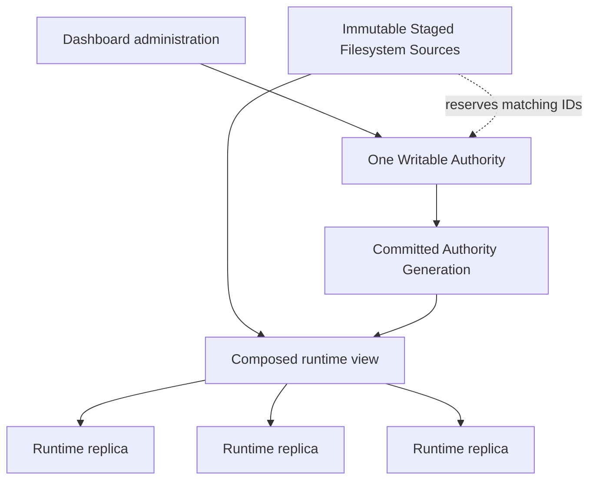
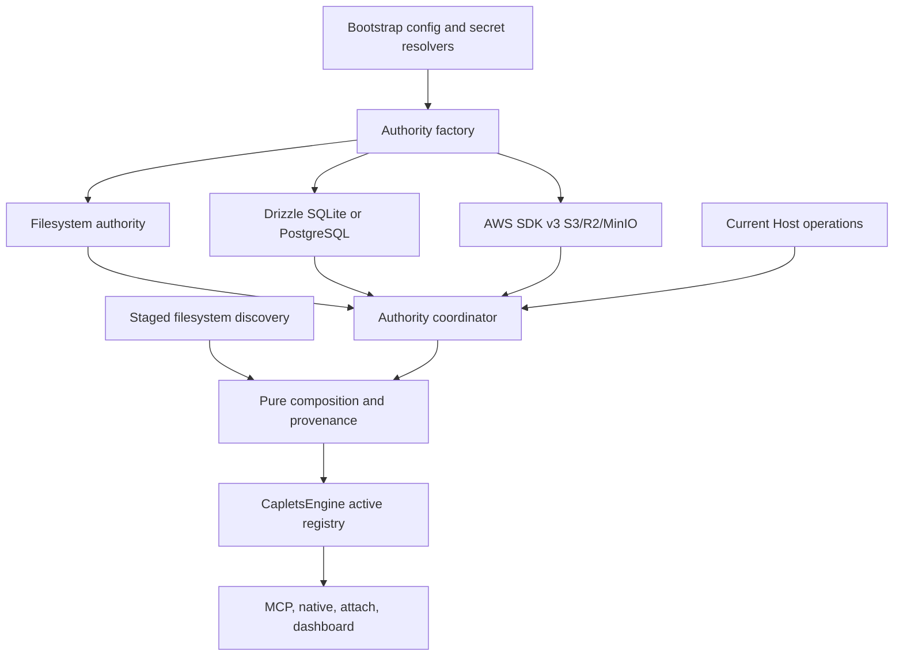
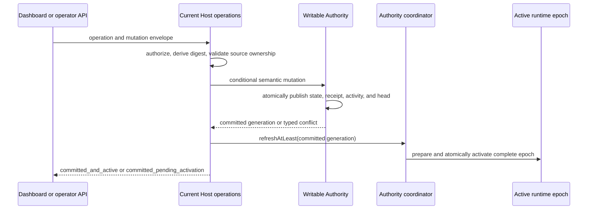
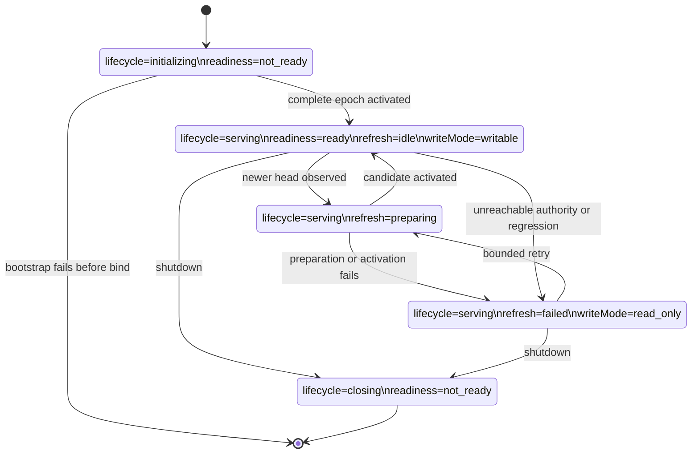

# Composable Shared Storage - Plan

## Goal Capsule

- **Objective:** Let a horizontally scaled Caplets deployment combine immutable filesystem Caplets staged with each replica and one shared Writable Authority for dashboard-managed state.
- **Product authority:** The confirmed Product Contract governs behavior; the Planning Contract governs implementation; repository conventions govern details neither contract fixes.
- **Execution profile:** Deep, cross-cutting code work across configuration, engine lifecycle, Current Host administration, durable security state, Drizzle SQL, S3-compatible storage, migration tooling, dashboard surfaces, and provider verification.
- **Stop conditions:** Stop rather than narrow scope if a provider cannot enforce conditional generation commits, if migration or restore can destroy or partially expose durable state, if plaintext Vault, credential, or authority secrets would enter persisted state or diagnostics, or if the unchanged live compatibility suite cannot run successfully against isolated AWS S3 and Cloudflare R2 targets.
- **Tail ownership:** LFG owns implementation, focused and full verification, simplification, independent review, eligible review fixes, changeset, PR creation, and CI repair.

---

## Product Contract

### Summary

Caplets will support one writable filesystem, Drizzle-backed SQLite or PostgreSQL, or S3-compatible authority per deployment while continuing to load immutable Caplet files staged with the runtime.
All replicas will consume the same committed Current Host state, and staged filesystem definitions will remain authoritative for their IDs.

### Problem Frame

Caplets currently discovers configuration and Caplet documents from local files, watches local paths for changes, and persists Vault, credentials, dashboard sessions, activity, setup approvals, and related state in files.
This works for a single runtime but makes dashboard mutations replica-specific in a horizontally scaled container deployment.

A shared volume can expose the same files to several replicas, but it does not establish coherent multi-record commits, cross-replica reloads, or safe concurrent administration.
Operators need a network-accessible authority without giving up image-baked or mounted Caplet files.

### Key Decisions

- **One writable authority:** Each deployment selects one writable authority rather than mixing writable providers by domain; this prevents ambiguous ownership and split-brain administration.
- **Composable read-only files:** Staged filesystem Caplets remain independent read-only inputs and may coexist with any authority.
- **Filesystem IDs are reserved:** A dashboard-managed definition cannot shadow, edit, or delete a staged filesystem definition with the same ID.
- **Semantic provider parity:** Providers must expose the same Caplets consistency and security behavior without sharing one lowest-common-denominator physical layout.
- **Current Host is the deployment:** In horizontally scaled mode, Current Host means the logical deployment represented by all replicas sharing the authority, not one container process.
- **Bounded runtime scope:** Durable correctness and security state are shared; active transport, Attach, Project Binding, and Code Mode sessions remain replica-local in the first release.
- **Focused provider targets:** SQL authorities use Drizzle ORM with SQLite and PostgreSQL dialects; SQLite serves simple single-host deployments, while PostgreSQL is the SQL option for horizontal scaling. The S3 authority uses one compatibility layer verified against AWS S3, Cloudflare R2, and MinIO.



### Actors

- A1. **IT operator:** Configures the deployment, authority connection, staged sources, encryption material, backup, and load-balancer behavior.
- A2. **Dashboard operator:** Manages Current Host Caplets, credentials, Vault state, settings, clients, and approvals through structured administration operations.
- A3. **Runtime replica:** Loads staged sources, consumes committed Authority Generations, executes Caplets, and reports storage health.
- A4. **Shared authority:** Persists mutable Current Host state and enforces the provider-specific mechanism behind Caplets' consistency contract.

### Requirements

**Storage topology and source composition**

- R1. Every deployment must have exactly one Writable Authority selected from the existing filesystem provider, a Drizzle-backed SQLite or PostgreSQL provider, or an S3-compatible provider.
- R2. Every non-filesystem authority must continue to compose with immutable filesystem sources staged or mounted with the runtime.
- R3. A Staged Filesystem Source must reserve its Caplet ID against creation, installation, update, or deletion through the Writable Authority.
- R4. A collision between a staged ID and authority-managed state must be visible as a source conflict rather than resolved by silent shadowing.
- R5. Existing precedence among global and project filesystem sources must remain compatible unless separately changed by an explicit product decision.
- R6. Filesystem-only deployments must retain their current behavior and must not require S3, SQL, or a network service.

**Shared Current Host state**

- R7. The authority must store dashboard-created or catalog-installed Caplet definitions, their update metadata, and mutable Current Host settings.
- R8. The authority must store encrypted Vault values and grants so every replica resolves the same reference under the same authorization decision.
- R9. Vault encryption material must be consistent across replicas without persisting plaintext secrets in the authority or Caplets configuration.
- R10. The authority must store authentication and authorization state required for any replica to validate, refresh, approve, deny, or revoke access.
- R11. Security decisions that affect execution, including setup approvals, must be consistent across replicas.
- R12. Dashboard sessions and administrative activity must represent the logical Current Host rather than an individual replica.
- R13. Every authority-managed Caplet must retain stable source provenance suitable for diagnostics, collision reporting, and Vault grant identity without relying on a local file path.

**Consistency, concurrency, and reloads**

- R14. Each successful administrative mutation must produce one committed Authority Generation that replicas can distinguish from earlier generations.
- R15. Replicas must consume only committed state and must never expose a partially applied multi-record administrative mutation.
- R16. Concurrent mutations based on stale state must be rejected or retried safely rather than silently losing a completed update.
- R17. A committed generation must become visible to every healthy replica without a process restart and within a documented refresh interval.
- R18. A failed reload must leave the replica serving its last known-good generation and expose a degraded health state.
- R19. Initial startup with a configured but unreachable or invalid shared authority must fail rather than silently omit authority-managed state.
- R20. Mutations must fail while the authority is unavailable; replicas may continue read and execution behavior from their last known-good in-memory generation.
- R21. Storage health must expose the selected provider, connectivity, active generation, refresh status, and degraded or read-only operation without exposing secrets.

**Provider and security contract**

- R22. SQL authorities must use Drizzle ORM with SQLite and PostgreSQL dialects while preserving one logical storage contract and migration history across both dialects.
- R23. The S3 authority must support AWS S3, Cloudflare R2, and MinIO through one provider layer, with endpoint, addressing, region, credential, strong-consistency, and conditional-write differences handled without changing Caplets behavior or stored-state meaning.
- R24. Authority credentials must support deployment-native secret injection and must never be written into project Caplet files, dashboard activity, diagnostics, or logs.
- R25. Secret-bearing records must remain encrypted at rest before they reach a provider that Caplets does not itself trust with plaintext.
- R26. Backup and restore must preserve authority generation, provenance, Vault grants, encrypted values, and authentication state as one compatible deployment state.

**Migration and operational boundary**

- R27. Operators must have an explicit migration path from existing writable filesystem state into a newly selected S3 or SQL authority.
- R28. Migration must detect staged-ID collisions, preserve provenance and security state, and avoid live bidirectional synchronization between providers.
- R29. Active MCP, Attach, Project Binding, and Code Mode sessions may remain bound to the replica that created them, with connection affinity documented as an operational requirement.
- R30. Replica-local logs, recovery journals, temporary artifacts, and rebuildable observed-output caches do not need authority persistence in the first release.

### Key Flows

- F1. **Start a scaled deployment**
  - **Trigger:** A1 starts two or more replicas with identical staged sources and one configured shared authority.
  - **Actors:** A1, A3, A4
  - **Steps:** Each replica validates the authority, loads its latest committed generation, composes it with staged sources, and reports its active generation.
  - **Outcome:** Every replica exposes the same Caplets and security decisions while preserving staged-file provenance.
  - **Covered by:** R1-R6, R13-R15, R19, R21
- F2. **Commit a dashboard mutation**
  - **Trigger:** A2 creates or changes mutable Current Host state.
  - **Actors:** A2, A3, A4
  - **Steps:** The serving replica validates source ownership and expected generation, commits the mutation, then all healthy replicas observe and load the new generation.
  - **Outcome:** The mutation becomes one coherent Current Host change without restarting replicas.
  - **Covered by:** R3-R4, R7-R17
- F3. **Handle concurrent administration**
  - **Trigger:** Two operators mutate state from the same earlier generation.
  - **Actors:** A2, A3, A4
  - **Steps:** The first valid commit advances the generation; the second operation detects stale state and returns a conflict or safely retries against current state.
  - **Outcome:** Neither completed mutation is silently overwritten.
  - **Covered by:** R14-R16, R22-R23
- F4. **Continue through an authority interruption**
  - **Trigger:** A4 becomes unavailable after replicas have loaded a valid generation.
  - **Actors:** A2, A3, A4
  - **Steps:** Replicas retain their last-known-good runtime view, reject mutations, and expose degraded health until the authority recovers and a valid generation is refreshed.
  - **Outcome:** Existing execution can continue without presenting stale administration as healthy writable state.
  - **Covered by:** R18-R21
- F5. **Adopt a shared authority**
  - **Trigger:** A1 converts an existing filesystem deployment to S3 or SQL storage.
  - **Actors:** A1, A4
  - **Steps:** Migration inventories writable state, reports collisions and unsupported records, writes one initial Authority Generation, and leaves staged files untouched.
  - **Outcome:** The deployment can start against the new authority without two writable sources.
  - **Covered by:** R26-R28

### Acceptance Examples

- AE1. **Filesystem ID reservation**
  - **Covers R3-R4.** Given staged Caplet `github`, when a dashboard operator tries to create or install authority-managed `github`, then the operation fails with source information and the staged definition remains active.
- AE2. **Cross-replica visibility**
  - **Covers R7, R14-R17.** Given replicas A and B on the same committed generation, when A commits a dashboard-created Caplet, then B exposes it after refresh without restart.
- AE3. **Concurrent update conflict**
  - **Covers R16, R22-R23.** Given two mutations based on generation 10, when one commits generation 11 first, then the other cannot overwrite generation 11 as an unconditional last writer.
- AE4. **Last-known-good operation**
  - **Covers R18, R20-R21.** Given a healthy replica serving generation 11, when the authority becomes unreachable, then existing Caplet execution continues from generation 11 while writes fail and health reports degradation.
- AE5. **Fail-closed startup**
  - **Covers R19.** Given a deployment configured for PostgreSQL authority with no reachable database, when a fresh replica starts without a loaded generation, then startup fails instead of exposing only staged Caplets.
- AE6. **Cluster-wide revocation**
  - **Covers R10, R14-R17.** Given a remote client accepted by two replicas, when an operator revokes it, then subsequent validation fails on both replicas after the committed revocation refreshes.
- AE7. **Vault consistency**
  - **Covers R8-R9, R25.** Given a granted Vault reference used by a Caplet, when requests execute through different replicas, then both resolve the same encrypted value under the same grant decision without persisting plaintext in the authority.
- AE8. **Scale replacement**
  - **Covers R14, R17, R26.** Given all existing replicas are replaced, when new replicas start against the authority and identical staged sources, then they reconstruct the same Current Host state and active generation.

### Success Criteria

- Representative deployments run at least two replicas against PostgreSQL and S3 authorities and pass creation, update, deletion, Vault, credential revocation, restart, scale-replacement, conflict, and interruption scenarios.
- A single-host SQLite deployment passes the same durable-state, migration, conflict, Vault, credential, backup, and recovery contracts that apply without cross-replica coordination.
- The S3 conformance suite runs against AWS S3, Cloudflare R2, and MinIO without provider-specific state formats or behavior forks.
- Filesystem-only behavior remains compatible with existing focused configuration, Vault, credential, dashboard, and reload contracts.
- Backend conformance tests demonstrate the same observable generation, conflict, failure, provenance, and security behavior for filesystem, S3, and SQL authorities.
- No accepted concurrent mutation is lost, no replica consumes partial committed state, and no plaintext Vault or credential value appears in provider records intended to remain encrypted.
- Operator documentation can describe one supported deployment model without requiring knowledge of provider-internal record layout.

### Scope Boundaries

**Deferred for later**

- Failover or migration of active MCP, Attach, Project Binding, and Code Mode sessions between replicas.
- Aggregated runtime logs, recovery journals, temporary artifacts, and observed-output caches across replicas.
- SQL dialects beyond SQLite and PostgreSQL, including distributed SQLite services with distinct consistency contracts.
- Provider-specific key-management integrations beyond the portable encryption and secret-injection contract.
- Provider-neutral encryption-key rotation or bulk re-encryption; the first release requires stable key continuity and rejects key changes until an explicit offline rotation contract is scoped.
- Event-driven propagation optimizations when bounded polling or equivalent refresh already satisfies the documented interval.

**Outside this product's identity**

- Multiple simultaneous writable authorities or per-domain writable-provider selection.
- Bidirectional live synchronization between filesystem, S3, and SQL providers.
- Automatic conflict merging or last-writer-wins behavior for concurrent administration.
- Active-active cross-region replication semantics owned by Caplets rather than the selected authority.
- Editing or deleting deployment-staged filesystem definitions through the dashboard.

### Dependencies and Assumptions

- Every replica in one deployment receives identical staged filesystem content; Caplets does not synchronize container images or mounted files.
- The load balancer can preserve affinity for live connection-oriented sessions that remain replica-local.
- AWS S3, Cloudflare R2, and MinIO can satisfy Caplets' required object operations, but each supported service must pass the same compatibility and concurrency suite rather than relying on an S3-compatible label.
- Deployment operators can provide one stable Vault encryption secret or equivalent key material to every replica.
- The current demand is a product hypothesis rather than evidence from a tested production deployment, so representative multi-replica verification is part of acceptance.

### Planning Resolutions

- Semantic durable state is divided into typed domain records beneath one atomic generation commit; successful state changes, receipts, and success activity publish together. Monotonic session touches and rejected/conflicted security events use a separate typed auxiliary contract with no generation advance.
- S3 stores immutable generation objects and conditionally advances one small head object; correctness never depends on listing or multi-key transactions.
- SQLite and PostgreSQL use separate checked-in Drizzle migration histories and dialect-specific transaction mechanics behind one semantic authority contract.
- Replicas reconcile through bounded head polling with an immediate post-commit trigger; provider notifications may accelerate later versions but are not correctness dependencies.
- Authority access credentials and Vault key material remain deployment-native inputs; persisted records contain only encrypted values and safe key identifiers.
- Migration, backup, restore, and authority cutover are explicit server-local operations with dry-run, empty-target, verification, and rollback boundaries.

### Sources and Research

- Current source precedence and provenance: `packages/core/src/config.ts`, especially `loadConfigWithSources`, `mergeConfigInputsWithSources`, and the source/shadow types.
- Reusable non-filesystem parsing: `packages/core/src/caplet-files-bundle.ts` and `packages/core/src/caplet-source/`.
- Last-known-good reload behavior and synchronous construction pressure: `packages/core/src/engine.ts`, `packages/core/src/runtime.ts`, and `packages/core/src/native/service.ts`.
- Current durable stores: `packages/core/src/vault/`, `packages/core/src/remote/server-credential-store.ts`, `packages/core/src/auth/store.ts`, `packages/core/src/dashboard/`, and `packages/core/src/setup/local-store.ts`.
- Current administration boundary: `packages/core/src/current-host/`, `packages/core/src/remote-control/dispatch.ts`, and `packages/core/src/serve/http.ts`.
- Existing cache-store precedent: `packages/core/src/observed-output-shapes/`.
- Related cloud plan whose storage units must consume this plan: `docs/plans/2026-07-11-002-feat-portable-cloud-runtime-deployment-plan.md`.
- Institutional learnings: `docs/solutions/integration-issues/stale-remote-profile-credentials-refresh.md`, `docs/solutions/integration-issues/vault-cli-runtime-integration-fixes.md`, `docs/solutions/architecture-patterns/native-daemon-service-management.md`, and `docs/solutions/developer-experience/self-hosted-pending-remote-login-and-attach-positional-url.md`.
- Drizzle SQLite, PostgreSQL, transactions, and migrations: <https://orm.drizzle.team/docs/get-started-sqlite>, <https://orm.drizzle.team/docs/get-started-postgresql>, <https://orm.drizzle.team/docs/transactions>, and <https://orm.drizzle.team/docs/migrations>.
- AWS SDK v3 and conditional S3 writes: <https://docs.aws.amazon.com/sdk-for-javascript/v3/developer-guide/javascript_s3_code_examples.html> and <https://docs.aws.amazon.com/AmazonS3/latest/userguide/conditional-writes.html>.
- Cloudflare R2 S3 compatibility and consistency: <https://developers.cloudflare.com/r2/api/s3/api/> and <https://developers.cloudflare.com/r2/reference/consistency/>.
- MinIO S3 compatibility: <https://docs.min.io/aistor/developers/>.
- SQLite WAL, isolation, and backup: <https://sqlite.org/wal.html>, <https://sqlite.org/isolation.html>, and <https://sqlite.org/backup.html>.
- PostgreSQL locking, transaction isolation, and backup: <https://www.postgresql.org/docs/current/explicit-locking.html>, <https://www.postgresql.org/docs/current/transaction-iso.html>, and <https://www.postgresql.org/docs/current/backup.html>.

---

## Planning Contract

### Product Contract Preservation

Product Contract changed only to resolve planning-owned questions, standardize confirmed glossary terms, and record the first-release key-rotation exclusion; R1-R30, A1-A4, F1-F5, AE1-AE8, and success criteria are unchanged.

### Key Technical Decisions

- **KTD1. Expose generation and auxiliary authority operations, not independently publishable repositories.** The provider surface is `readHead`, `readGeneration`, semantic `commit(commandEnvelope)`, and typed `readAuxiliary`/`commitAuxiliary` for monotonic session touches and bounded rejected/conflicted security events. Semantic commits publish one candidate snapshot containing the domain delta, success activity, and idempotency receipt; auxiliary writes never advance or impersonate a generation and must satisfy non-resurrection, redaction, retention, watermark, and ambiguous-outcome semantics. Domain services cannot publish split writes.
- **KTD2. Separate bootstrap configuration from authority-managed configuration.** `loadAuthorityBootstrap(globalPath, env, secretResolver)` reads provider kind, namespace, connection/endpoint fields, deployment-native credential references, polling policy, and Vault-key reference only from the global raw document. Project parsing recognizes those keys only to reject them. Resolved credentials and key bytes never enter public `CapletsConfig`, generations, health, diagnostics, or schemas.
- **KTD3. Publish ordered, bounded, self-describing Authority Generations.** Each generation contains opaque CAS/provenance `id`, provider-assigned monotonic `sequence` scoped to `authorityId`, predecessor ID, logical schema version, deterministic digest, timestamp, provenance, and complete domain references. The committing provider validates predecessor ID/sequence at CAS; readers validate authoritative head identity, increasing sequence, and the referenced generation digest without traversing every historical predecessor. All providers enforce the same 64 MiB complete-generation ceiling. Retention keeps the active generation, prior 20 committed generations or seven days (whichever retains more), pinned rollback/backup watermarks, and in-flight epochs; cleanup is race-safe and reports quota exhaustion finitely.
- **KTD4. Classify every physical source before composition.** Bootstrap builds a `SourceInventory` whose paths are exactly one of authority-owned, staged, replica-local, client-local, or migration input. Legacy global writable config/Caplet roots/lockfile belong to the default filesystem authority; project roots remain staged. Shared mode composes only bootstrap-declared and project staged roots, never the untouched migrated writable source. Preserve precedence within staged roots and reject duplicate ownership or staged/authority ID collisions.
- **KTD5. Preserve synchronous filesystem APIs and add one async host assembly path for shared authorities.** `loadConfig`, `new CapletsEngine`, `new CapletsRuntime`, and `createNativeCapletsService` keep filesystem-only behavior. If they encounter shared-authority bootstrap they fail with finite `ASYNC_AUTHORITY_REQUIRED` guidance. HTTP/stdio/native host assembly awaits provider initialization and the first valid prepared runtime epoch before binding, connecting, or advertising readiness.
- **KTD6. Activate immutable runtime epochs, not mutable registries.** A `PreparedRuntimeView` owns the composed config, registry, backend managers, authorized Vault resolution view, and MCP/native projections for one Authority Generation and local Exposure Generation. Preparation never mutates or closes the active epoch; activation is one synchronous pointer swap. Requests retain one epoch through completion, and prior managers close only after their in-flight reference count reaches zero. Authority generation ID/sequence and replica-local Exposure Generation remain distinct.
- **KTD7. Use the stable Drizzle line with an explicit native SQLite packaging decision.** Pin exact `drizzle-orm@0.45.2`, development-only `drizzle-kit@0.31.10`, `postgres@3.4.9`, and `better-sqlite3@12.11.1`; do not use ranges or Drizzle v1 RC APIs. Keep separate checked-in dialect migrations, run runtime migrators explicitly, and never run `push`, generate migrations in production, or migrate during module import. Fresh packed-package tests own native prebuild/source-build compatibility.
- **KTD8. Treat SQLite as a Node-only, local single-host authority.** The selected better-sqlite3 build must report SQLite at or above the WAL-reset fix and the tested matrix records its exact version. Use a canonical local path, `foreign_keys=ON`, WAL, `synchronous=FULL`, a finite busy timeout, short immediate write transactions, bounded checkpoints, and the driver backup API. Reject documented network/shared paths and never advertise SQLite on Bun, shared volumes, or multiple hosts; PostgreSQL is the horizontal SQL path.
- **KTD9. Use AWS SDK v3 for one bounded S3/R2/MinIO protocol.** Configure checksum calculation/validation to `WHEN_REQUIRED`; use signed HTTPS single-request `PutObject`, `GetObject`, and maintenance-only `DeleteObject`, with the provider-neutral 64 MiB generation limit and no multipart in v1. Unique immutable candidates carry canonical SHA-256 and a commit deadline; writers refuse head CAS after expiry, and cleanup may delete only unreferenced expired candidates. One head advances via `If-None-Match:*` or exact opaque ETag `If-Match`; listing is never correctness, ETag is never a content hash, and a fresh-prefix probe proves conditions.
- **KTD10. Reconcile by bounded portable polling, not provider notifications.** Healthy and degraded replicas start every next head attempt no later than 2.5 seconds after the prior attempt completes; jitter/backoff is capped by that interval. R17 and recovery bound end-to-end visibility to 2.5 seconds plus configured finite provider-read and activation deadlines. Local commits trigger immediate checks. Notifications may accelerate later versions but never determine correctness.
- **KTD11. Keep Current Host operations as the administration policy seam.** The server creates `CurrentHostOperationContext` from active epoch authority/current-host identity, principal, request origin, and active generation; host identity is never client supplied. Mutations carry expected generation, one intent-stable idempotency key, and a server-derived canonical request digest. Dashboard and operator-only remote administration use the same typed operations; Access Clients and MCP/Code Mode projections never gain host administration.
- **KTD12. Resolve and decrypt secret material only at its owning authorized runtime boundary.** Shared mode requires one stable injected encryption-key reference and never auto-generates or rotates it. Bootstrap authority credentials resolve outside the selected authority before each operation/lease. Runtime identities are least-privilege: S3 credentials are prefix/verb scoped; PostgreSQL runtime DML is schema-scoped and separate from maintenance DDL; local authority paths use restrictive process permissions. Records contain Vault AEAD, encrypted OAuth/OIDC/replay payloads, and one-way-verifiable or encrypted session/CSRF material. Authorization precedes decrypt/replay; only the requested granted value decrypts.
- **KTD13. Keep lifecycle operations server-local with external key continuity and source fencing.** Lifecycle credentials/keys come only from deployment-native references; archive headers are authenticated as associated data and archives never contain key bytes, credentials, resolver output, or private paths. Migration verifies all serving writers stopped/read-only, holds an exclusive source-namespace fence from inventory through target verification, rechecks the full source digest, and invalidates staging on any raced write. Restore validates an unselected empty namespace through normal secret/authorization/session/replay behavior, then emits cutover coordinates; it never hot-switches, rewinds live state, or synchronizes providers.
- **KTD14. Make this plan the storage substrate for portable cloud deployment.** `docs/plans/2026-07-11-002-feat-portable-cloud-runtime-deployment-plan.md` is quarantined at `requirements-only`; its U1-U9 cannot execute until this substrate lands and the cloud plan is re-deepened without remote-lowest precedence, MySQL/D1 core-authority parity, transient dashboard sessions, or duplicate durable-store ownership.

### Assumptions

- A logical Current Host receives a persisted deployment UUID from its authority namespace; public origin and serving replica URL remain separate metadata.
- Idempotency receipts are scoped by Current Host, principal, key, and canonical request digest, retained for 24 hours subject to a capacity that rejects new mutations rather than evicting a live receipt, and replayed only after authentication/authorization and before stale-generation rejection.
- Successful activity commits in its Authority Generation; rejected/conflicted attempts use bounded server-derived auxiliary events with attempted-generation/idempotency anchors and no false advance.
- Session semantic changes are generations. Throttled `lastUsedAt` uses auxiliary conditional `max` updates that cannot create/replace/resurrect a missing or revoked session; backup captures auxiliary state at a watermark.
- A reader accepts a newer authoritative head after validating authority identity, increasing sequence, and referenced generation digest; predecessor continuity is enforced by the writer's head CAS. Lower sequence or equal sequence/different ID is regression: retain the epoch and disable writes.
- Administrative publication is limited to 60 semantic commits per principal and 300 per Current Host per minute with finite retry guidance. Provider-neutral generation, receipt, event, session, and activity limits are preflighted before persistence; quota exhaustion never partially commits.
- Credentialed isolated-prefix AWS S3 and Cloudflare R2 runs are prerequisites for U4/U9/global completion; absent live credentials block support claims.

### High-Level Technical Design

The runtime keeps bootstrap, staged discovery, authority persistence, and active execution as separate boundaries:



An accepted administration mutation publishes state and audit as one generation, then reports whether the serving replica activated it:



Replica health uses orthogonal state rather than one overloaded status: `lifecycle = initializing|serving|closing|closed`, `readiness = not_ready|ready`, `authorityConnectivity = unknown|reachable|unreachable`, `refresh = idle|polling|preparing|activating|failed`, and `writeMode = writable|read_only`. Readiness requires one active epoch; outage after activation remains serving/read-only; an invalid newer generation retains the active epoch and disables writes; cold failure never binds.



### Output Structure

```text
packages/core/src/storage/
├── types.ts
├── composition.ts
├── factory.ts
├── coordinator.ts
├── filesystem-authority.ts
├── conformance.ts
├── sql/
│   ├── authority.ts
│   ├── schema-sqlite.ts
│   ├── schema-postgres.ts
│   ├── migrate.ts
│   └── migrations/
│       ├── sqlite/
│       └── postgres/
├── s3-authority.ts
├── migration.ts
└── backup.ts
```

The tree names ownership, not exact final decomposition; provider-specific implementation remains internal unless a proven embedder contract requires public exports.

### System-Wide Impact

- **Configuration and generated schema:** Global bootstrap configuration gains a strict authority union and secret-reference fields. Project configuration must reject authority selection. Both committed JSON Schema artifacts change.
- **Runtime construction:** Shared providers require async initialization before serve/native host readiness while public filesystem-only construction remains synchronous.
- **Authentication and authorization:** Remote-client state, dashboard sessions, setup approvals, upstream OAuth tokens, Vault ciphertext/grants, and operator activity become logical Current Host state. Local Cloud access-client credentials remain local.
- **Administration parity:** Dashboard and operator-only remote administration share `CurrentHostOperations`; no storage administration appears through ordinary Caplet MCP or Code Mode handles.
- **Data lifecycle:** Schema migrations, Authority Generation retention, orphan cleanup, backup, restore, provider cutover, and encryption-key continuity become release responsibilities.
- **Reload semantics:** Filesystem watches remain staged-source accelerators. Authority head polling becomes the portable source of truth, and failed composition or activation retains the prior whole runtime view.
- **Packaging:** Core gains Drizzle, Postgres.js, and modular AWS SDK dependencies that must remain lazy behind provider selection and pass packed-package ESM boundary tests.
- **Related plans:** Portable cloud deployment must depend on this storage substrate and remove conflicting source precedence, provider matrix, and durable repository assumptions before implementation.

### Risks and Mitigations

- **Async conversion can break public APIs:** Keep existing synchronous filesystem entry points and add an async host assembly path; characterize file-backed behavior before changing call chains.
- **Atomicity can leak across domain wrappers:** Make the authority mutation, not individual store adapters, own state, success activity, receipt, and generation publication; parameterize all providers through one conformance trace.
- **S3-compatible does not mean behaviorally identical:** Depend only on the tested object CRUD/CAS subset, run live AWS/R2 and pinned MinIO matrices, fail startup capability probes that ignore conditions, and preserve provider-specific safe diagnostics.
- **SQLite can corrupt or stall under unsafe deployment:** Require a fixed SQLite runtime, local storage, bounded busy handling, tested backup APIs, and no NFS/EFS/shared-volume support claim.
- **SQL migrations can race replicas:** Run explicit server-local migration before readiness, serialize migration ownership, keep dialect histories separate, and make replicas verify rather than auto-apply schema changes.
- **Last-known-good can become partially replaced:** Prepare a complete immutable runtime epoch—including managers, authorized Vault view, assets, and MCP/native projections—before one pointer swap; retain the old epoch for in-flight requests and retire it only afterward.
- **Secrets can leak through config, provider errors, or backups:** Keep credential resolvers and key material out of authority records, encrypt secret-bearing records before provider persistence, and seed redaction tests across errors, diagnostics, activity, export, and recovery artifacts.
- **High-frequency sessions can create generation storms:** Throttle last-used updates and separate failed-attempt security events from semantic state generations while preserving atomic activity for accepted mutations.
- **Migration or restore can lose state:** Inventory every durable domain, require a stopped/read-only source and empty destination, publish once, verify through the normal provider, preserve the source, and refuse online generation rewind.
- **Overlapping plans can duplicate incompatible storage code:** Keep the cloud deployment plan non-executable until this substrate lands and that plan is re-deepened against it.

### Documentation and Operational Notes

- Document provider selection, secret injection, SQLite limits, PostgreSQL TLS/SCRAM and separate runtime/maintenance roles, S3 prefix/verb policies, restrictive local permissions, provider endpoints, migration fencing, backup/restore, generation and orphan retention, quotas/rate limits, connection affinity, health hierarchy, and recovery.
- Document that provider credentials, Vault keys, and authority choice are infrastructure-owned and cannot be edited through dashboard or agent-facing administration.
- Add a support matrix naming exact tested Node, SQLite, PostgreSQL, MinIO image digest, Drizzle, better-sqlite3, Postgres.js, AWS SDK, AWS S3, and Cloudflare R2 versions; do not claim Bun shared-authority, arbitrary S3-compatible, wire-compatible PostgreSQL, or untested provider support.
- Add a changeset for the user-facing `@caplets/core` and `caplets` package capabilities.

### Sequencing

1. Establish U1's provider-neutral contracts, source ownership, provenance, bootstrap parser, and conformance semantics without instantiating absent providers.
2. Complete U2's filesystem authority, staged composition, bundle materialization contract, and legacy characterization.
3. Implement U3, then U4 against the same conformance trace. Provider research may run in parallel, but package manifests, lockfile, and CI workflow have one serialized owner.
4. Complete U6's authority-domain codecs and candidate-snapshot security boundary, while U5 coordinator mechanics may develop against fakes.
5. Finish U5 host assembly and immutable-epoch activation against all providers and U6 snapshots.
6. Complete U7 administration/UI, then U8 lifecycle operations.
7. Run U9 deterministic, two-process, browser, packed-package, and credentialed live provider gates before release claims.

---

## Implementation Units

### U1. Authority contract, bootstrap configuration, and provenance

- **Goal:** Define one generation-shaped authority contract, strict bootstrap/source inventory, ordered generations, stable provenance, safe health, and reusable semantic conformance traces.
- **Requirements:** R1-R7, R13-R16, R21, R24; F1, F3; AE1, AE3, AE5.
- **Dependencies:** None.
- **Files:** `packages/core/src/storage/types.ts` (new), `packages/core/src/storage/factory.ts` (new), `packages/core/src/storage/conformance.ts` (new), `packages/core/src/config.ts`, `packages/core/src/vault/types.ts`, `packages/core/src/vault/access.ts`, `packages/core/src/cli.ts`, `packages/core/src/cli/inspection.ts`, `packages/core/src/cli/vault.ts`, `packages/core/src/current-host/vault-operations.ts`, `packages/core/src/catalog-indexing/eligibility.ts`, `packages/core/test/storage-contract.test.ts` (new), `packages/core/test/config.test.ts`, `packages/core/test/config-validation.test.ts`, `packages/core/test/vault.test.ts`, `schemas/caplets-config.schema.json`, `apps/landing/public/config.schema.json`, `apps/landing/test/schema-assets.test.ts`.
- **Approach:** Define semantic and auxiliary authority reads/commits with ordered generation ID/sequence/predecessor, mutation envelope, atomic success activity/receipt, monotonic session touches, event watermarks, logical host identity, export/restore, quotas, and orthogonal health. Add `loadAuthorityBootstrap` and `SourceInventory`; keep resolved secrets outside `CapletsConfig`, reject project authority fields/duplicate ownership, and use discriminated provenance. U1 defines provider registration only.
- **Execution note:** Start with failing contract, provenance, bootstrap, source-ownership, generation-order, and schema tests; keep existing filesystem parsing green.
- **Patterns to follow:** `mergeConfigInputsWithSources`; finite Current Host outcomes; current source formatters/indexers; `scripts/generate-config-schema.ts`.
- **Test scenarios:**
  - Legacy filesystem defaults classify global writable config/Caplet root/lockfile as authority, project roots as staged, and operational/client paths correctly; explicit shared bootstrap excludes migration-input roots from composition.
  - SQLite, PostgreSQL, and S3 variants accept only their fields; project config rejects them; secret resolvers never enter effective config, health, diagnostics, or schema examples.
  - Authority provenance has stable record/generation identity without a fake path; staged identity is mount-path independent; every current formatter, Vault grant, and catalog indexer handles both.
  - Same generation ID is a no-op; valid N→N+k reads the authoritative snapshot directly; lower sequence, equal sequence/different ID, wrong authority, corrupt digest, and writer-side broken predecessor fail safely.
  - Receipt replay precedes stale conflict after authentication/authorization; changed payload fails. Live-receipt capacity rejects new mutations rather than evicting replay safety.
  - Atomic semantic traces cover Caplet+lock+activity+receipt, session+activity, client revocation+activity, and Vault ciphertext+grant+activity. Auxiliary traces cover conditional monotonic touch, non-resurrection, bounded redacted failed events, watermark export/restore, and ambiguous outcomes.
  - 64 MiB generation, domain cardinality, 60/principal and 300/host per-minute publication, retention pins, quota exhaustion, and cleanup races behave identically across conformance fakes.
  - Health redaction seeds DSNs, signed URLs, keys, paths, Vault values, tokens, and provider payloads.
  - Both committed config schemas regenerate identically to runtime validation.
- **Verification:** Contract/config/schema/Vault tests prove source ownership, ordered generations, semantic atomicity, stable provenance, finite health, and unchanged filesystem defaults.

### U2. Filesystem authority, staged composition, and authority bundles

- **Goal:** Implement the default filesystem authority and compose immutable staged sources plus executable authority-managed Caplet bundles without changing legacy filesystem-only behavior.
- **Requirements:** R1-R7, R13-R18, R20-R21; F1-F4; AE1-AE4.
- **Dependencies:** U1.
- **Files:** `packages/core/src/storage/composition.ts` (new), `packages/core/src/storage/filesystem-authority.ts` (new), `packages/core/src/storage/bundle-cache.ts` (new), `packages/core/src/caplet-files.ts`, `packages/core/src/caplet-files-bundle.ts`, `packages/core/src/config.ts`, `packages/core/test/storage-composition.test.ts` (new), `packages/core/test/storage-filesystem-authority.test.ts` (new), `packages/core/test/storage-bundle-cache.test.ts` (new), `packages/core/test/caplet-files.test.ts`, `packages/core/test/config.test.ts`.
- **Approach:** Extract one pure composition path, preserve precedence among staged global/project inputs, and reject authority/staged collisions. The filesystem authority publishes immutable generation directories then atomically replaces one head file. Authority-managed Caplets are versioned bundles containing the entry document and all relative assets with normalized paths, modes where relevant, lengths, and digests; preparation materializes a disposable content-addressed replica cache and rebases path fields before managers are built. Staged inputs retain original paths.
- **Execution note:** Characterize existing effective config byte-for-byte before extraction; prove bundle execution rather than only parsed path strings.
- **Patterns to follow:** `mergeConfigInputsWithSources`, `loadCapletFilesFromMap`, best-effort discovery, private atomic Vault writes, and last-known-good loading.
- **Test scenarios:**
  - Source-ownership truth table covers legacy global writable roots, explicit immutable global mount, project staged roots, and post-migration shared mode; every path has one owner.
  - Covers AE1. Staged `github` rejects authority create/install/update/delete with both safe provenances and no generation.
  - Existing staged precedence/shadows are unchanged; distinct authority IDs compose successfully.
  - OpenAPI, Google Discovery or GraphQL file input, CLI cwd/script, and nested Caplet-set assets execute from materialized bundles; missing/traversing/corrupt/oversized assets fail before activation.
  - Startup collision fails readiness; later collision retains the prior view. Different staged fingerprints are visible and never claimed converged.
  - Two writers yield one head update and one conflict; interrupted candidates and corrupt/digest-invalid generations never move head.
  - Failed preparation cleans candidate caches; retired-generation caches remain until no active epoch references them.
- **Verification:** Focused composition/filesystem/bundle tests and the shared conformance trace prove reservation, executable assets, atomic head, failure retention, source ownership, and legacy equivalence.

### U3. Drizzle SQLite and PostgreSQL authorities

- **Goal:** Implement SQLite and PostgreSQL authorities with one semantic contract, dialect-specific schemas/migrations, bounded concurrency, and safe packaging.
- **Requirements:** R1-R2, R7-R9, R13-R16, R19, R21-R22, R24-R26; F3; AE3 provider portion.
- **Dependencies:** U1.
- **Files:** `packages/core/src/storage/sql/authority.ts` (new), `packages/core/src/storage/sql/schema-sqlite.ts` (new), `packages/core/src/storage/sql/schema-postgres.ts` (new), `packages/core/src/storage/sql/migrate.ts` (new), `packages/core/src/storage/sql/migrations/sqlite/` (new), `packages/core/src/storage/sql/migrations/postgres/` (new), `packages/core/test/storage-sqlite-authority.test.ts` (new), `packages/core/test/storage-postgres-authority.test.ts` (new), `packages/core/test/storage-sql-migrations.test.ts` (new), `packages/core/package.json`, `pnpm-lock.yaml`.
- **Approach:** Pin exact Drizzle 0.45.2/Kit 0.31.10, Postgres.js 3.4.9, and better-sqlite3 12.11.1. Maintain one logical authority schema version and two append-only checked-in migration histories with prior-version and digest checks. SQLite uses local better-sqlite3, immediate transactions, fixed safety pragmas, busy/checkpoint bounds, and maintenance-exclusive migration. PostgreSQL creates an undeletable singleton head row; every commit uses one `sql.begin()` connection, transaction-local lock/statement timeouts, locks head first `FOR UPDATE`, resolves receipt/expected generation, writes all state, and updates head. Server-local migration owns a fixed advisory lock; startup only verifies.
- **Execution note:** Build the conformance trace before adapters; run real independent SQLite connections and containerized PostgreSQL pools.
- **Patterns to follow:** Repository ESM packaging, injected async store health, checked-in generated artifacts, official Drizzle migrators, and finite safe errors.
- **Test scenarios:**
  - Packed install loads better-sqlite3 on supported Node 22/24, reports a fixed SQLite version, and rejects Bun, unsafe SQLite versions, shared/network paths, or missing native support without affecting filesystem imports.
  - Fresh authorities migrate to the same logical schema; replay is a no-op; newer/missing/reordered/checksum-tampered history, interrupted migration, and competing migrators fail closed.
  - Covers AE3 provider portion. Two independent writers yield one commit/receipt/activity/head and one conflict; any failed domain write rolls all back.
  - SQLite proves finite busy handling, WAL/FULL/foreign-key pragmas, checkpoints, crash/reopen, concurrent-writer backup, and canonical restore.
  - PostgreSQL acquires head first, bounds held-lock/deadlock/serialization outcomes, returns connections, and configures TLS, pool, shutdown, and prepared statements/pooler support explicitly.
  - Socket loss immediately before/after COMMIT reconnects and resolves the idempotency receipt before retry or outcome; no ambiguous duplicate is created.
  - Fixtures for every logical version normalize to the same canonical state across dialects.
- **Verification:** Exact dependency resolution, packed ESM/native loading, dialect conformance, migration history, concurrency, unknown-outcome, backup, and shutdown tests pass.

### U4. AWS S3, Cloudflare R2, and MinIO authority

- **Goal:** Implement one AWS SDK v3 object authority with a bounded conditional-generation protocol verified unchanged against AWS S3, R2, and MinIO.
- **Requirements:** R1-R2, R7-R9, R13-R16, R19, R21, R23-R26; F3; AE3 provider portion.
- **Dependencies:** U1, U3. U3 owns the initial manifest/lock baseline; U4 extends it serially.
- **Files:** `packages/core/src/storage/s3-authority.ts` (new), `packages/core/test/storage-s3-authority.test.ts` (new), `packages/core/test/storage-s3-conformance.test.ts` (new), `packages/core/test/fixtures/storage/` (new), `packages/core/package.json`, `pnpm-lock.yaml`, `.github/workflows/ci.yml`.
- **Approach:** Pin the reviewed modular AWS SDK v3 client. Use request-time least-privilege prefix credentials and `WHEN_REQUIRED` checksums; publish unique immutable ≤64 MiB candidate objects with SHA-256 and commit deadlines, then advance head through `IfNoneMatch:\"*\"` or opaque ETag `IfMatch`. Writers never CAS expired candidates; cleanup deletes only unreferenced expired candidates. Signed HTTPS Put/Get/Delete is correctness-critical; listing is maintenance. A fresh-key probe proves conditions. Only 412 is conflict; 409/404/ambiguous responses require head/receipt reread.
- **Execution note:** Implement fault-injected protocol proof first, then run the unchanged suite against digest-pinned MinIO and isolated AWS/R2 prefixes; live failures or missing credentials block completion.
- **Patterns to follow:** Bounded provider errors/redaction; official AWS conditional-write/data-integrity guidance; R2 operation/consistency matrix; pinned MinIO compatibility evidence.
- **Test scenarios:**
  - Create/replace/stale conditions succeed/fail exactly; ignored conditions, missing ETag, inconsistent reread, malformed head, external deletion, version/delete-marker surprise, or probe cleanup failure fail capability/readiness.
  - Two barrier-synchronized writers create unique candidates and one head winner; lost 2xx replay returns one generation.
  - A writer paused between candidate PUT and head CAS races cleanup: cleanup cannot delete before deadline, the writer refuses CAS after expiry, and only expired unreferenced candidates are removed.
  - Exact 64 MiB succeeds and limit+1 performs no request; multipart is rejected and optional CRC headers are absent.
  - Corrupted GET fails SHA-256 even with plausible metadata/ETag; all ETag shapes remain opaque.
  - Credentials/endpoint/region/TLS/timeout/abort/throttle/5xx errors are finite/redacted. Runtime credentials cannot access outside-prefix or maintenance-only operations.
  - Request-time credential rotation is used by the next operation; shutdown aborts work and destroys clients.
  - The unchanged capability/CAS suite passes AWS S3, R2, and digest-pinned MinIO.
- **Verification:** Deterministic protocol/fault tests and blocking live provider suites prove the supported object subset, CAS, integrity, limits, cleanup, rotation, and redaction.

### U5. Async authority coordinator and immutable runtime epochs

- **Goal:** Initialize every provider before serving, reconcile ordered generations, and atomically activate complete runtime epochs while preserving synchronous filesystem entry points.
- **Requirements:** R2-R6, R13-R21, R29-R30; F1-F4; AE1-AE6, AE8.
- **Dependencies:** U1-U4, U6.
- **Files:** `packages/core/src/storage/coordinator.ts` (new), `packages/core/src/engine.ts`, `packages/core/src/runtime.ts`, `packages/core/src/index.ts`, `packages/core/src/native.ts`, `packages/core/src/serve/http.ts`, `packages/core/src/serve/index.ts`, `packages/core/src/serve/stdio.ts`, `packages/core/src/serve/session.ts`, `packages/core/src/serve/native-session.ts`, `packages/core/src/native/service.ts`, `packages/core/src/cloud/runtime-adapter.ts`, `packages/core/test/storage-coordinator.test.ts` (new), `packages/core/test/engine.test.ts`, `packages/core/test/runtime.test.ts`, `packages/core/test/serve-http.test.ts`, `packages/core/test/native.test.ts`, `packages/core/test/native-remote.test.ts`.
- **Approach:** Export one async host assembly function that loads bootstrap, creates the provider/coordinator, activates the first valid `PreparedRuntimeView`, then binds/connects. Synchronous entry points reject shared bootstrap. Poll within KTD10, coalesce refresh, validate identity/sequence/chain, materialize assets, authorize/decrypt snapshot state, build managers and MCP/native projections, then swap one epoch pointer. Requests retain one epoch; failed candidates dispose independently; old managers retire after in-flight use. Health exposes orthogonal lifecycle/readiness/connectivity/refresh/write fields plus observed/active generation, exposure generation, staged fingerprint, lag, deadline, and safe failure.
- **Execution note:** Characterize current reload, manager invalidation, live MCP projection, and native projection first; prove candidate failure before changing swap order.
- **Patterns to follow:** Existing reload debounce/pending logic, `NativeCapletsService.reload()`, session projection discovery, and facade-owned async refresh.
- **Test scenarios:**
  - Filesystem constructors stay synchronous; every synchronous API with shared bootstrap fails `ASYNC_AUTHORITY_REQUIRED`; HTTP/stdio/native assembly never binds/connects before first epoch.
  - Cold authority/schema/key/digest/collision failure returns readiness 503 without listener readiness; liveness remains separate.
  - Same head is a no-op; valid N→N+k catch-up works; regression, wrong identity, or corrupt referenced generation retains the epoch and disables writes.
  - A commit on A triggers immediate refresh; B starts its next head attempt within 2.5 seconds after the prior attempt completes, then finishes read and activation within their configured deadlines. Fake clocks and two processes prove both healthy and outage-recovery bounds.
  - Parse, asset, decrypt, manager, projection, or activation failure leaves registrations/routes/counters untouched. An in-flight request sees one epoch; retirement waits for release.
  - Authority outage after activation keeps existing execution from the active epoch while writes fail; recovery activates the newest valid generation.
  - Poll backoff, coalescing, shutdown-during-refresh, close/abort, and credential rotation leak no timers/managers or post-close reconnect.
  - Health transition table covers cold failure, healthy start, outage, invalid newer generation, same/new-head recovery, regression, shutdown, and committed-pending-activation.
- **Verification:** Engine/runtime/session/native/serve tests prove fail-closed bootstrap, bounded monotonic catch-up, atomic epoch activation, request consistency, last-known-good, health, and filesystem compatibility.

### U6. Durable security, session, approval, activity, and domain codecs

- **Goal:** Classify and move every shared correctness/security record behind async authority domain codecs while preserving client/replica-local ownership and existing authorization.
- **Requirements:** R8-R16, R18-R26; F2-F4; AE3-AE7.
- **Dependencies:** U1, U2.
- **Files:** `packages/core/src/vault/index.ts`, `packages/core/src/vault/store.ts`, `packages/core/src/vault/keys.ts`, `packages/core/src/remote/server-credential-store.ts`, `packages/core/src/auth/store.ts`, `packages/core/src/auth.ts`, `packages/core/src/downstream.ts`, `packages/core/src/cli/auth.ts`, `packages/core/src/google-discovery/manager.ts`, `packages/core/src/dashboard/session-store.ts`, `packages/core/src/dashboard/activity-log.ts`, `packages/core/src/setup/local-store.ts`, `packages/core/src/setup/runner.ts`, `packages/core/src/cloud/runtime-adapter.ts`, `packages/core/src/cli.ts`, `packages/core/src/serve/http.ts`, `packages/core/test/vault.test.ts`, `packages/core/test/remote-server-credential-store.test.ts` (new), `packages/core/test/remote-pairing.test.ts`, `packages/core/test/auth.test.ts`, `packages/core/test/downstream.test.ts`, `packages/core/test/google-discovery.test.ts`, `packages/core/test/openapi.test.ts`, `packages/core/test/dashboard-session.test.ts`, `packages/core/test/dashboard-activity.test.ts`, `packages/core/test/setup-runner.test.ts`, `packages/core/test/cli.test.ts`.
- **Approach:** Add typed snapshot readers/command codecs for Vault ciphertext/grants, remote-server pairing/pending/client/replay records, encrypted upstream OAuth/OIDC bundles, dashboard sessions and auxiliary activity, success/failed activity, setup approvals, and receipts. Stable provenance replaces path-based grant identity. Shared mode requires injected key material, authorizes before receipt/decrypt/replay, and never materializes an enumerable plaintext Vault. Session touches are conditional monotonic patches outside semantic generations. Remote Profiles, hosted Cloud auth, staged files, setup attempts, live sessions/workspaces, journals/logs/caches/telemetry/temp/locks remain client or replica local. Activity uses action-specific server-derived allowlists.
- **Execution note:** Characterize each file implementation and every constructor/caller before async conversion; inspect raw adapter bytes for secret proof.
- **Patterns to follow:** Remote credential state/replay transitions; request-time credential refresh learning; Vault grant/reveal boundaries; bounded session/activity retention.
- **Test scenarios:**
  - File adapters preserve current outcomes through async interfaces; every classified record has exactly one ownership boundary.
  - Missing/mismatched shared key or attempted auto-generation fails before readiness. Raw generations/exports contain no Vault plaintext, OAuth/ID/refresh token, client secret, session secret, CSRF value, replay secret, DSN, or credential.
  - Authorization precedes receipt lookup and decrypt; only one granted reference decrypts. Stable grants work across replicas mounting staged content at different paths.
  - Remote-client approval/refresh/role/revocation on A is enforced on B. Setup grant/deny/revoke on A controls execution on B after refresh; stale content hash/generation cannot approve.
  - Session create/logout/role-change/revocation plus receipt/activity is atomic. Touch vs logout/revoke/cleanup cannot resurrect or extend a revoked session; restore near idle expiry preserves behavior.
  - Lost-response replay creates one mutation/generation/activity; changed payload fails. Success activity is derived atomically; rejected/conflict events are typed, bounded, redacted, and do not claim commit.
  - Provider errors and every metadata/label/result channel are seeded with secrets; raw authority, activity, exports, logs, diagnostics, CLI human/JSON, and agent results contain none.
  - Local Cloud auth, Remote Profiles, setup attempts, live sessions/workspaces, journals/logs/caches/telemetry/temp/locks are absent from authority snapshots and migration inventory.
- **Verification:** Domain/caller tests prove unchanged file behavior, complete ownership classification, encryption/verification before persistence, authorize-before-decrypt/replay, cross-replica security, non-resurrection, atomic activity, and redaction.

### U7. Current Host administration, dashboard CRUD, and operator API parity

- **Goal:** Route every durable administration action through one active-epoch Current Host facade and expose equivalent dashboard/operator behavior, including Caplets, settings, setup approvals, and storage health.
- **Requirements:** R3-R4, R7-R17, R20-R25; F2-F4; AE1-AE7.
- **Dependencies:** U5, U6.
- **Files:** `packages/core/src/current-host/operations.ts`, `packages/core/src/current-host/catalog-operations.ts`, `packages/core/src/current-host/client-operations.ts`, `packages/core/src/current-host/vault-operations.ts`, `packages/core/src/current-host/caplet-operations.ts` (new), `packages/core/src/current-host/settings-operations.ts` (new), `packages/core/src/remote-control/types.ts`, `packages/core/src/remote-control/client.ts`, `packages/core/src/remote-control/dispatch.ts`, `packages/core/src/cli/install.ts`, `packages/core/src/serve/http.ts`, `apps/dashboard/src/components/DashboardApp.tsx`, `apps/dashboard/src/components/DashboardApp.test.tsx`, `apps/dashboard/src/styles/globals.css`, `packages/core/test/current-host-administration.test.ts`, `packages/core/test/current-host-catalog-operations.test.ts`, `packages/core/test/remote-control-client.test.ts`, `packages/core/test/remote-control-dispatch.test.ts`, `packages/core/test/dashboard-api.test.ts`, `packages/core/test/dashboard-catalog.test.ts`, `packages/core/test/dashboard-vault.test.ts`, `packages/core/test/dashboard-runtime.test.ts`.
- **Approach:** Extend `CurrentHostOperations` with server-created host context and typed Caplet/settings/setup/client/Vault operations. Split catalog acquisition from persistence. Remote dispatch receives an active-runtime facade and never constructs engines/files. Mutations preserve intent keys; after commit, bounded `refreshAtLeast(G)` returns active or pending. The dashboard preserves stale drafts and offers refresh/review before resubmission; pending is durable success with generation, duplicate controls disabled, bounded automatic/manual status refresh, and active/degraded transitions. Health leads with writability/action, with provider/generation/lag diagnostics secondary. Access Clients stay denied, Raw Vault Reveal human-gated, lifecycle local.
- **Execution note:** Add semantic facade and dashboard/operator parity tests before UI forms; delete per-request server engine construction rather than adding a shared-mode branch.
- **Patterns to follow:** Current Host discriminants/safe outcomes, dashboard CSRF/session checks, operator/access roles, and structured dashboard operations.
- **Test scenarios:**
  - Staged conflict through both adapters returns equivalent safe provenance, no write, and no success activity.
  - Caplet create/install/update/delete, settings update, and setup grant/revoke commit exactly once and become visible cross-replica.
  - Setup grant on A enables execution on B only after activation; revoke disables later execution; stale grant/revoke conflicts.
  - A stale conflict preserves submitted values, identifies the changed generation, refreshes current state for review, and resubmits only with the new generation/key intent.
  - Same key replays across replicas; changed payload fails; wrong persisted host identity is denied even when URLs match.
  - Active commit reads immediately. Pending activation shows committed generation, disables duplicate submission, polls status within bounds, permits manual status retry, and transitions to active or degraded without discarding success.
  - Remote list/execute/complete/status captures one epoch and constructs no engine during refresh.
  - Dashboard/operator results share operation, generation, redaction, and one activity; Access Clients cannot inspect/administer.
  - Health entry prioritizes writable/read-only/degraded and safe action; secondary details show provider, connectivity, generations, lag, and redacted failure.
  - Keyboard operation, visible/deterministic focus, labels, live status/error announcements, non-color-only indicators, and narrow/desktop layouts preserve every action. Raw Vault Reveal remains absent remotely.
- **Verification:** Facade, CLI install, remote client/dispatch, dashboard API/component, role, CSRF, parity, read-your-write, conflict, redaction, setup, and two-replica scenarios pass.

### U8. Migration, backup, restore, and authority lifecycle CLI

- **Goal:** Provide typed server-local inventory, migration, backup, restore, schema migration, and verified cutover coordinates without hot switching or synchronization.
- **Requirements:** R9, R13-R15, R24-R28; F5; AE1, AE7-AE8.
- **Dependencies:** U2-U7.
- **Files:** `packages/core/src/storage/migration.ts` (new), `packages/core/src/storage/backup.ts` (new), `packages/core/src/cli/storage.ts` (new), `packages/core/src/cli.ts`, `packages/core/src/cli/auth.ts`, `packages/core/src/cli/setup-caplet.ts`, `packages/core/src/cli/vault.ts`, `packages/core/test/storage-migration.test.ts` (new), `packages/core/test/storage-backup.test.ts` (new), `packages/core/test/cli-storage.test.ts` (new), `packages/core/test/cli.test.ts`, `packages/core/test/cli-completion.test.ts`.
- **Approach:** Each domain exposes typed inventory with count/schema/redacted digest and exclusions; no glob sweep. Dry-run/apply verifies stopped/read-only writers, acquires one exclusive source namespace fence through destination behavioral verification, rechecks the complete source digest, and invalidates staging on any race. It requires stable provenance, external key fingerprint, and empty unselected target. Backup authenticates the clear header as associated data and encrypts the body. Lifecycle emits verified coordinates for operator redeploy and never edits config or selects partial state.
- **Execution note:** Build inventory/exclusion, corruption, ambiguous-write, and dry-run failures before apply; source/config stay untouched.
- **Patterns to follow:** Async Commander and `CliIO`; install staging/rollback; daemon `--dry-run`/JSON; pure typed credential migrations.
- **Test scenarios:**
  - Inventory includes identity/schema/head/generation, authority Caplets/lock/settings, Vault ciphertext/grants, server pairing/pending/client/replays, encrypted OAuth/OIDC, sessions/auxiliary activity, success activity, failed-event watermark, setup approvals, and unexpired receipts.
  - Inventory excludes key bytes, provider credentials, Remote Profiles, Cloud auth, staged files, setup attempts, live sessions/workspaces, journals/logs/caches/telemetry/temp/locks; unknown/malformed host-owned records block apply.
  - Adjacent OAuth, `cloud-auth.json`, Remote Profile credentials, setup attempts, and unknown JSON prove only typed shared records import and no plaintext emits.
  - Staged collision or ambiguous/missing path-based grant mapping blocks apply. Two mount paths enforce the same migrated stable grant; raw destination/backup has no absolute source path.
  - Fenced empty-target migration publishes once, verifies through the adapter, rechecks source digest, emits cutover coordinates, and leaves source/config untouched; a raced ordinary writer blocks migration and invalidates staging.
  - SQL/S3 ambiguous commit resolves via receipt/read-back; concurrent lifecycle commands yield one maintenance owner.
  - Backup/restore uses external keys and authenticated headers, rejects header/body corruption, wrong key, non-empty target, provider/schema mismatch, and interruption, preserves receipts/watermark, and proves Vault/OAuth/session/revocation/replay.
  - PostgreSQL export, better-sqlite3 backup, and S3 export restore canonically.
  - In shared mode host-owned Vault/auth/setup/catalog/settings commands use authority once or fail before local writes; client-local remote/Cloud commands remain local.
- **Verification:** Lifecycle tests prove normative inventory/exclusions, stable-provenance conversion, external-key authenticated round-trip, unselected staging, normal-adapter behavioral read-back, ambiguity resolution, redaction, and executable rollback.

### U9. Provider matrix, packaging, generated artifacts, documentation, and release gate

- **Goal:** Prove all provider and user surfaces meet one contract, publish dependencies safely, document exact support, and prepare release.
- **Requirements:** R1-R30; F1-F5; AE1-AE8; all Success Criteria.
- **Dependencies:** U1-U8.
- **Files:** `scripts/test-storage-providers.ts` (new), `package.json`, `packages/core/package.json`, `packages/core/rolldown.config.ts`, `packages/core/src/index.ts`, `packages/core/test/package-boundaries.test.ts`, `packages/core/test/storage-provider-matrix.test.ts` (new), `packages/core/test/storage-multi-replica.test.ts` (new), `packages/core/test/dashboard-ui.test.ts`, `apps/landing/test/schema-assets.test.ts`, `schemas/caplets-config.schema.json`, `apps/landing/public/config.schema.json`, `docker-compose.yml`, `.github/workflows/ci.yml`, `README.md`, `packages/core/README.md` (new), `docs/product/self-hosting.md` (new), `docs/agents/domain.md`, `.changeset/`.
- **Approach:** Keep providers lazy/internal; verify fresh packed ESM/native installation on supported Node 22/24 and safe early rejection on Bun shared-provider selection. `pnpm storage:test:providers` owns pinned PostgreSQL/MinIO fixtures plus two-process traces; `--live=aws,r2` runs isolated prefixes with unchanged commands and redacted evidence. Regenerate schemas, document exact versions/operations, and keep the cloud plan quarantined until later reconciliation.
- **Execution note:** Deterministic, packed-package, and browser gates precede live targets; AWS/R2 evidence is blocking, not optional.
- **Patterns to follow:** Package boundary tests, config schema generation, Docker self-hosting, changesets, and dashboard browser verification.
- **Test scenarios:**
  - Fresh tarball imports filesystem without evaluating providers, loads each selected Node provider with declared dependencies, and shuts down Postgres/S3/native resources.
  - Filesystem, SQLite, PostgreSQL, MinIO, AWS S3, and R2 execute the same generation/conflict/provenance/security trace within documented boundaries.
  - Two OS runtime processes sharing PostgreSQL and two sharing MinIO converge through mutation, approval, session validation/revocation, outage/recovery, lost refresh hint, and full replacement.
  - R29: MCP, Attach, Project Binding, and Code Mode live IDs created on A cannot resume on B while durable Current Host state is shared and affinity guidance is emitted.
  - R30: seeded logs, recovery journals, setup attempts, temporary artifacts, and observed-output caches never enter snapshots, migration, backup, or restore.
  - Dashboard browser creates authority Caplets, shows staged entries read-only, handles stale conflict/pending activation/degradation/recovery, and remains usable at desktop/mobile widths.
  - Runtime and landing schemas match; docs contain no credentials, shared-SQLite/hot-switch/raw-provider pattern, or arbitrary compatibility claim.
  - Live evidence records commit, lock versions, Node/SQLite/PostgreSQL/MinIO versions, provider profile, timestamp, and result without account/bucket/prefix secrets.
- **Verification:** Named provider orchestration, two-process, browser, package, schema, docs, changeset, full verify, and blocking live compatibility gates establish release readiness.

## Verification Contract

### Focused gates

| Scope                    | Gate                                                                                                                                                                                                                                                                                                                                           | Proves                                                                                                                                                                                   |
| ------------------------ | ---------------------------------------------------------------------------------------------------------------------------------------------------------------------------------------------------------------------------------------------------------------------------------------------------------------------------------------------- | ---------------------------------------------------------------------------------------------------------------------------------------------------------------------------------------- |
| Bootstrap and contracts  | `pnpm --filter @caplets/core test -- test/storage-contract.test.ts test/config.test.ts test/config-validation.test.ts test/vault.test.ts && pnpm schema:check`                                                                                                                                                                                 | Source ownership, ordered generations, atomic command semantics, provenance, strict bootstrap, redaction, and generated schema parity                                                    |
| Filesystem compatibility | `pnpm --filter @caplets/core test -- test/storage-composition.test.ts test/storage-filesystem-authority.test.ts test/storage-bundle-cache.test.ts test/caplet-files.test.ts test/config.test.ts`                                                                                                                                               | Legacy equivalence, staged reservation, executable assets, atomic filesystem head, and failure retention                                                                                 |
| SQL authorities          | `pnpm --filter @caplets/core test -- test/storage-sqlite-authority.test.ts test/storage-postgres-authority.test.ts test/storage-sql-migrations.test.ts`                                                                                                                                                                                        | Exact Drizzle/driver packaging, dialect parity, transactions, migrations, unknown outcomes, backup, and conflicts                                                                        |
| S3 authority             | `pnpm --filter @caplets/core test -- test/storage-s3-authority.test.ts test/storage-s3-conformance.test.ts`                                                                                                                                                                                                                                    | Immutable single-put publication, conditional head, capability probing, provider normalization, integrity, faults, limits, and redaction                                                 |
| Runtime coordination     | `pnpm --filter @caplets/core test -- test/storage-coordinator.test.ts test/engine.test.ts test/runtime.test.ts test/native.test.ts test/native-remote.test.ts test/serve-http.test.ts`                                                                                                                                                         | Async bootstrap, bounded ordered refresh, immutable epochs, in-flight consistency, health, last-known-good, and shutdown                                                                 |
| Durable callers          | `pnpm --filter @caplets/core test -- test/vault.test.ts test/remote-server-credential-store.test.ts test/remote-pairing.test.ts test/auth.test.ts test/downstream.test.ts test/google-discovery.test.ts test/openapi.test.ts test/dashboard-session.test.ts test/dashboard-activity.test.ts test/setup-runner.test.ts test/serve-http.test.ts` | Normative ownership, encrypted/verified records, authorize-before-decrypt/replay, cross-replica revocation/approval, non-resurrection, activity atomicity, and no client-local migration |
| Administration parity    | `pnpm --filter @caplets/core test -- test/current-host-administration.test.ts test/current-host-catalog-operations.test.ts test/remote-control-client.test.ts test/remote-control-dispatch.test.ts test/dashboard-api.test.ts test/dashboard-catalog.test.ts test/dashboard-vault.test.ts test/dashboard-runtime.test.ts`                      | Dashboard/operator parity, active-epoch reads, roles, setup, conflicts, pending activation, health, CRUD, and source reservation                                                         |
| Lifecycle CLI            | `pnpm --filter @caplets/core test -- test/storage-migration.test.ts test/storage-backup.test.ts test/cli-storage.test.ts test/cli.test.ts test/cli-completion.test.ts`                                                                                                                                                                         | Typed inventory/exclusions, stable provenance, external keys, authenticated backup, staging/read-back, ambiguity resolution, and rollback                                                |
| Provider and replicas    | `pnpm --filter @caplets/core test -- test/storage-provider-matrix.test.ts test/storage-multi-replica.test.ts && pnpm storage:test:providers`                                                                                                                                                                                                   | Pinned PostgreSQL/MinIO services, two OS processes, bounded convergence, replica-local live sessions, and excluded local artifacts                                                       |
| Package and schemas      | `pnpm --filter @caplets/core test -- test/package-boundaries.test.ts && pnpm schema:check`                                                                                                                                                                                                                                                     | Fresh packed ESM/native install, lazy providers, declared dependencies, exports, and config parity                                                                                       |
| Dashboard                | `pnpm test -- apps/dashboard/src/components/DashboardApp.test.tsx packages/core/test/dashboard-ui.test.ts && pnpm --filter @caplets/dashboard typecheck && pnpm --filter @caplets/dashboard build`                                                                                                                                             | Component/UI states, accessibility/responsiveness checks, and packaged dashboard assets                                                                                                  |

### Provider integration gates

- Deterministic CI runs fault-injected S3 plus supported Node/better-sqlite3/SQLite, pinned PostgreSQL, and digest-pinned MinIO through `pnpm storage:test:providers`.
- Release validation MUST run `pnpm storage:test:providers -- --live=aws,r2` against parallel-safe isolated prefixes. Missing credentials or a live failure blocks R23, U4, U9, and global completion.
- Multi-replica verification starts two OS runtime processes against PostgreSQL and MinIO, drops refresh hints, races mutations, injects outages, and proves the KTD10 bound.
- `ce-test-browser` exercises staged-read-only, authority-managed, conflict, pending-activation, degraded, and recovered dashboard states against a real Current Host at desktop and mobile widths.

### Repository gates

- `pnpm --filter @caplets/core typecheck`
- `pnpm --filter @caplets/core test`
- `pnpm --filter @caplets/core build`
- `pnpm schema:check`
- `pnpm docs:check`
- `pnpm verify`

---

## Definition of Done

### Global completion

- The artifact remains `implementation-ready`, and Product Contract scope and stable IDs remain intact.
- Exactly one Writable Authority owns mutable Current Host state; source inventory gives every path one owner; Staged Filesystem Sources remain readable and immutable.
- Filesystem, SQLite, PostgreSQL, AWS S3, Cloudflare R2, and MinIO pass their documented authority/conformance boundaries, including blocking isolated-prefix AWS/R2 live proof.
- Every successful mutation commits domain state, receipt, activity, and one ordered generation atomically; ambiguous outcomes resolve without duplication.
- Healthy replicas meet the explicit refresh bound, activate only complete immutable epochs, keep each request on one epoch, and retain last-known-good on failure/regression.
- Staged conflicts, stale/regressed heads, outages, invalid credentials, incompatible schemas, and restore failures produce finite redacted diagnostics without loss or fallback.
- Every normative shared security record is encrypted or one-way verified before persistence; authorization precedes decrypt/replay; session touches cannot resurrect revocation; client/replica-local records remain absent.
- Lifecycle commands use typed inventory, external key continuity, authenticated backup, empty unselected staging, representative behavioral read-back, operator cutover coordinates, and executable rollback.
- Existing filesystem APIs/behavior, published agent capability boundaries, and replica-local MCP/Attach/Project Binding/Code Mode sessions remain compatible and verified.
- Generated schemas, exact dependency/image matrix, packed package, changeset, operator docs, deterministic/two-process/browser/live provider gates, and `pnpm verify` pass.
- The cloud deployment plan remains non-executable until this substrate lands and that plan is reconciled/re-deepened; no conflicting storage implementation is active.
- Abandoned experiments, duplicate composition paths, obsolete concrete-store construction, per-request remote engines, debug scaffolding, and dead provider code are removed.

### Per-unit completion

| Unit | Done when                                                                                                                                                                                             |
| ---- | ----------------------------------------------------------------------------------------------------------------------------------------------------------------------------------------------------- |
| U1   | Generation-shaped authority, bootstrap/source inventory, ordered identities, provenance, safe health, atomic traces, and generated schemas are coherent with filesystem defaults.                     |
| U2   | Filesystem authority, staged composition, executable bundles, cache lifecycle, reservation, atomicity, failure retention, and legacy equivalence pass.                                                |
| U3   | Exact stable Drizzle/better-sqlite3/Postgres.js packages, SQLite/PostgreSQL contracts, logical migrations, concurrency, ambiguity, backup, and packed install pass.                                   |
| U4   | The same bounded object/CAS/capability suite passes deterministic faults plus live AWS S3, R2, and digest-pinned MinIO; absent live evidence is incomplete.                                           |
| U5   | Async host assembly and immutable epoch activation meet ordering/refresh/health/in-flight/last-known-good contracts without breaking synchronous filesystem consumers.                                |
| U6   | Every normative record has one owner; shared secrets are encrypted/verified; authorization, cross-replica decisions, non-resurrection, atomic activity, and raw-byte redaction pass.                  |
| U7   | Dashboard/operator administration shares one active-epoch policy facade and all CRUD, setup, idempotency, activation, conflict, audit, role, health, and UI states pass.                              |
| U8   | Migration/backup/restore covers and excludes the normative records, converts provenance, preserves external keys/receipts/watermarks, behaviorally verifies staging, and emits safe cutover/rollback. |
| U9   | Pinned provider, two-process, replica-local negative, browser, package, schema, docs, changeset, full repository, and blocking live gates pass.                                                       |
