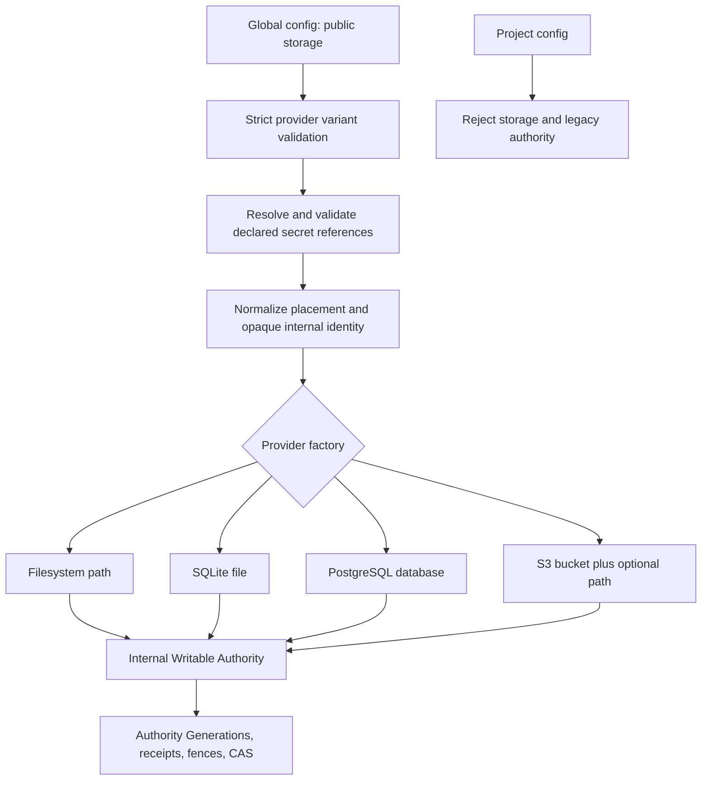
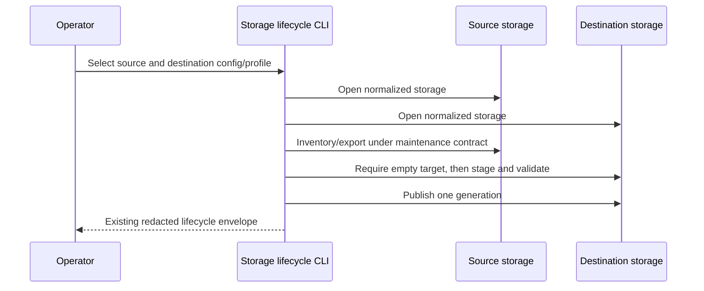

# Provider-Shaped Storage Configuration - Plan

## Goal Capsule

- **Objective:** Replace the operator-facing `authority` bootstrap with one intuitive, provider-shaped `storage` configuration while preserving the internal Writable Authority consistency protocol.
- **Product authority:** The decisions confirmed in this conversation govern the public shape; `docs/plans/2026-07-11-003-feat-composable-shared-storage-plan.md` continues to govern provider consistency, staged-source composition, lifecycle safety, and replica behavior.
- **Execution profile:** Deep clean cutover across configuration, provider construction, lifecycle CLI/API surfaces, dashboard presentation, generated artifacts, tests, and operator documentation.
- **Stop conditions:** Stop rather than reintroduce public authority/namespace aliases, weaken migration or restore isolation, expose resolved secret material, or change opaque generation/CAS semantics as an incidental consequence of the configuration redesign.
- **Tail ownership:** LFG owns implementation, behavioral verification, simplification, review, eligible fixes, changeset and documentation cleanup after the behavior works, PR update, and CI repair.

---

## Product Contract

### Summary

Operators configure where Caplets stores mutable Current Host state through a top-level `storage` object.
Each provider exposes its own physical addressing model instead of a generic authority ID and namespace.
Internally, Caplets continues to use one Writable Authority, Authority Generations, receipts, provenance, maintenance fencing, and compare-and-swap identities.

### Problem Frame

The current global configuration exposes an internal architecture term and forces unlike providers into the same public shape:

- every provider is nested beneath `authority`;
- every provider requires `authorityId` and `namespace`;
- PostgreSQL exposes `connectionRef` even though the factory actually uses the separate `credentialRef` value as its connection string;
- S3 calls its object-key placement boundary a namespace rather than a path;
- secret-reference fields require users to understand both the `*Ref` suffix and the `env:`/`file:`/`vault:` value syntax;
- dashboard and CLI copy expose authority identity as if it were an operator setting.

This shape is technically uniform but operationally misleading.
A PostgreSQL operator selects a database, an S3 operator selects a bucket and optional path, a SQLite operator selects a database file, and a filesystem operator selects or accepts a local storage directory.

### Actors

- A1. **IT operator:** Selects a storage provider and supplies its physical location and secret references.
- A2. **Dashboard operator:** Observes storage health and generation progress without configuring or seeing opaque authority identity.
- A3. **Automation author:** Uses generated JSON Schema, named storage profiles, lifecycle JSON, and package APIs.
- A4. **Runtime replica:** Normalizes provider-shaped storage into the unchanged internal Writable Authority protocol.

### Requirements

**Public configuration**

- R1. The global configuration must accept only top-level `storage`; the former top-level `authority` key must fail strict validation with no compatibility alias.
- R2. Public provider variants must not accept `authorityId`, `namespace`, `connectionRef`, `credentialRef`, `vaultKeyRef`, or `databasePath`.
- R3. Omitting `storage` must retain the existing zero-configuration filesystem default.
- R4. `storage` must remain infrastructure-owned and global-only; project configuration declaring either `storage` or legacy `authority` must fail closed in normal and best-effort loading paths.

**Provider-shaped placement**

- R5. Filesystem storage must accept an optional `path`; when omitted, it must retain the existing config-adjacent default directory, and an explicit relative path must resolve against the declaring global configuration directory before provider construction.
- R6. SQLite storage must require `path`, resolve a relative value against the declaring global configuration directory before provider construction, and treat the normalized file as its physical isolation boundary.
- R7. PostgreSQL storage must require `connection`; the database selected by that connection must be the physical isolation boundary, with no operator-selectable in-database namespace.
- R8. S3 storage must require `bucket` and `region`, accept optional `path`, and treat the bucket root or normalized path as its physical isolation boundary.
- R9. S3 path normalization must make surrounding slashes equivalent, reject ambiguous or unsafe interior segments, and apply the same canonical root to every object family, capability probe, migration stage, cleanup, and auxiliary record.

**Secrets and runtime normalization**

- R10. Public secret-bearing selectors must use concise names whose values remain explicit secret references: PostgreSQL `connection`, optional S3 `credentials`, and common `vaultKey`.
- R11. A declared secret reference that is unresolved, resolves to an empty string, or resolves to zero bytes must fail before provider construction without exposing resolved material; omitted S3 credentials may continue to use the AWS SDK default credential chain.
- R12. Public `pollIntervalMs` may remain as the advanced common refresh control.
- R13. The loader must normalize public storage into one fixed, opaque internal Current Host authority identity and provider lifecycle scope, and provider activation must reject an authority whose health, head, or namespace disagrees with that normalized identity.
- R14. Staged filesystem composition, source-owner value `authority`, authority provenance, generation identities, receipts, fencing, and CAS request payloads must retain their existing internal meanings.

**Lifecycle, automation, and presentation**

- R15. Named profiles must use `CAPLETS_STORAGE_PROFILE_<NAME>` only, where `<NAME>` is canonical uppercase ASCII matching `[A-Z][A-Z0-9_]*`; noncanonical names fail before environment lookup, and `CAPLETS_AUTHORITY_PROFILE_<NAME>` must not activate or resolve a profile.
- R16. Migration and restore destinations must be selected solely by their provider configuration; the public `--target-namespace` and exported `targetNamespace` options must be removed.
- R17. Existing machine-readable inventory, migration, backup, schema, health, and CAS payloads may retain opaque `authorityId` and internal `namespace` coordinates where required for protocol compatibility and correlation within the explicitly selected storage; those coordinates are not globally unique physical-store identifiers.
- R18. Human CLI and dashboard copy must say Storage or Storage Generation and must not present Authority ID as a user-selected setting; dashboard state must retain the unmodified opaque wire identity separately from its display projection.
- R19. The canonical schema, landing schema mirror, generated configuration reference, package documentation, self-hosting guide, and release changeset must teach only the provider-shaped `storage` contract.
- R20. The package root must expose only the provider-shaped `StorageBootstrap`, secret-free `LoadedStorageBootstrap`, and `loadStorageBootstrap` config-facing API, with no authority-bootstrap aliases, resolved secret material, or wildcard factory exports.

### Key Flows

- F1. **Start with provider-shaped storage**
  - **Trigger:** A1 starts Caplets with a global `storage` object or with storage omitted.
  - **Actors:** A1, A4
  - **Steps:** The loader validates the provider variant, resolves declared references, derives the provider’s physical boundary, normalizes opaque internal identity, and constructs the provider through the existing async or synchronous runtime path.
  - **Outcome:** The runtime exposes one valid generation or fails before serving; no public authority or namespace setting participates.
  - **Covered by:** R1-R14

- F2. **Operate through a named profile**
  - **Trigger:** A1 or A3 runs inventory, schema, backup, restore, or migration through a named profile.
  - **Actors:** A1, A3, A4
  - **Steps:** The CLI resolves `CAPLETS_STORAGE_PROFILE_<NAME>`, opens the provider-shaped config, relies on existing empty-target and fencing checks for destructive operations, and emits the existing redacted lifecycle envelope.
  - **Outcome:** Automation selects storage without legacy authority vocabulary or a namespace override.
  - **Covered by:** R15-R17

- F3. **Administer shared state from the dashboard**
  - **Trigger:** A2 views health or submits a generation-checked mutation.
  - **Actors:** A2, A4
  - **Steps:** The dashboard displays provider, connectivity, writability, refresh state, and generation sequence while retaining the full expected-generation identity only in memory and the request payload.
  - **Outcome:** The operator understands storage health, and stale writes still fail through exact CAS.
  - **Covered by:** R14, R17-R18

### Acceptance Examples

- AE1. Given a global PostgreSQL `storage` object with `connection: "env:CAPLETS_POSTGRES_URL"`, when Caplets starts, then it opens the database selected by the resolved connection through Caplets' fixed internal schema and exposes no public namespace or authority selector.
- AE2. Given two S3 configurations using the same bucket and different normalized paths, when each commits state, then neither can read, list for correctness, clean, or advance the other path’s state.
- AE3. Given omitted S3 path, an empty path, or slash-only path, when storage opens, then all forms select the bucket-root Caplets directory and no object key begins with `/`, `default/`, or `undefined/`.
- AE4. Given a global or project config containing legacy `authority`, or a `storage` provider containing a removed legacy field, when validation runs, then it fails without provider construction or fallback.
- AE5. Given a dashboard health response containing opaque authority and generation IDs, when the UI renders and submits a mutation, then raw IDs are absent from rendered copy but the exact unmodified expected generation is sent and stale conflicts still refresh safely.
- AE6. Given a package-root consumer loading any provider-shaped storage configuration, when it inspects the runtime value and TypeScript surface, then it sees only storage-named config-facing fields and unresolved references, never authority-bootstrap aliases or resolved secret bytes.

### Scope Boundaries

#### In scope

- Clean public configuration and config-facing package API cutover.
- Provider-native physical placement and secret-reference names.
- Internal normalization needed to preserve existing storage protocols.
- Lifecycle selector/profile changes required by removal of public namespace.
- Storage-centered human UI/CLI copy and generated/manual documentation.

#### Deferred to Follow-Up Work

- Versioning or redesigning machine-readable lifecycle JSON to replace opaque authority coordinates with public storage-location objects.
- Automated editing or migration of already-written pre-merge development configurations.
- General cloud deployment automation such as `caplets deploy aws`.

#### Outside this change

- Renaming `WritableAuthority`, `AuthorityGeneration`, internal SQL/S3 records, source provenance, CAS envelopes, maintenance fences, or provider conformance concepts.
- Changing Caplet Namespace Shadowing Policy or namespace aliases, which concern Caplet identity collisions rather than storage placement.
- Supporting multiple writable providers or multiple PostgreSQL logical tenants inside one database.

---

## Planning Contract

### Key Technical Decisions

- KTD1. **The public boundary is `storage`; the protocol boundary remains Writable Authority.** Export provider-shaped `StorageBootstrap`, a secret-free `LoadedStorageBootstrap`, and a public `loadStorageBootstrap` wrapper from the package root. An internal/trusted-provider resolved context owns fixed identity, canonical placement, and resolved secrets; runtime assembly calls the private loader directly, while the public wrapper returns only its redacted loaded projection. Replace the factory wildcard with an explicit root allowlist: `AuthorityProviderFactory`, `AuthorityProviderLookupResult`, `AuthorityProviderRegistryMissError`, `lookupAuthorityProvider`, `registerAuthorityProvider`, and `registeredAuthorityProviders`; provider and generation protocol types retain authority terminology where they express ownership and consistency.
- KTD2. **Use provider-shaped strict variants.** Filesystem and SQLite use `path`; PostgreSQL uses `connection`; S3 uses `bucket`, `region`, and optional `path`; optional S3 credentials use `credentials`; the common encryption selector is `vaultKey`. The value syntax (`env:`, `file:`, or `vault:`) communicates that the value is a reference, so `*Ref` suffixes are unnecessary.
- KTD3. **One physical boundary contains one opaque Current Host identity.** Normalize config to the fixed internal authority ID `current-host` and fixed internal lifecycle namespace `default`. These values identify the logical Current Host only within the selected config/profile, not the physical store across independent lifecycle invocations. Provider activation verifies its namespace plus health/head identity before exposing the first generation. Direct authority injection remains a protocol-level test/embedding seam and host assembly applies the same identity check whenever normalized storage is present.
- KTD4. **PostgreSQL is singleton-per-database through one fixed schema.** Keep internal identity columns with fixed derived values, but qualify migrations, runtime queries, advisory locks, verification, and cleanup through the internal `caplets` schema so role-specific `search_path` cannot create parallel stores. The connection-selected database supplies public isolation. Bootstrap treats an existing `caplets` schema without recognized Caplets migration and identity metadata as a collision and fails before DDL, publication, or cleanup.
- KTD5. **S3 path is an explicit constructor input.** Canonicalize public path once, pass the canonical physical root separately from lifecycle namespace, and prohibit fallback from path to namespace. Store every object family beneath `<path>/.caplets/` (bucket root uses `.caplets/`) and reserve `.caplets` as a user path segment so root, parent, and child storage paths cannot overlap provider-owned listing or cleanup prefixes. Conditional first bootstrap creates the head/identity record; any pre-existing provider-owned keyspace without a valid matching head fails before mutation or cleanup.
- KTD6. **Declared references fail deterministically.** The loader distinguishes omitted optional S3 credentials from a declared reference that resolves to no value, an empty string, or zero bytes. PostgreSQL connection and shared Vault key failures surface before network/provider work and remain redacted.
- KTD7. **Lifecycle automation changes only where the public config leaks.** Rename named-profile environment variables and remove target-namespace options. Preserve existing empty-target, config-path guarding, fencing, read-back, JSON envelope, and opaque identity behavior rather than introducing a physical-locator or machine-API redesign; lifecycle callers remain responsible for selecting distinct physical source and destination stores.
- KTD8. **No legacy bridge.** The branch is unmerged, so schemas, parsers, exports, examples, profile names, and tests cut over together without aliases, deprecation warnings, or compatibility re-exports.

### High-Level Technical Design

### Assumptions

- The public storage contract has not shipped, so rejecting all legacy names is acceptable and preferred.
- A fixed internal `current-host`/`default` identity is safe because every supported public configuration selects exactly one physical storage boundary and activation validates identity agreement; lifecycle output is meaningful only with its selected config/profile context.
- The fixed PostgreSQL `caplets` schema is internal infrastructure; public configuration cannot select or override it, and existing schemas without valid Caplets metadata are never implicitly adopted.
- S3 stores provider-owned keys beneath a reserved `.caplets` segment at bucket root or below the configured path, requires a valid head/identity record before adopting an existing keyspace, and never cleans outside that segment.
- Existing direct provider APIs and conformance fixtures may keep explicit internal authority IDs and namespaces because they exercise the protocol rather than user configuration.
- The current machine-readable lifecycle JSON is consumed by automation and remains stable unless a separate versioned redesign is approved; callers correlate an envelope with the config/profile that produced it.
- Source and destination config paths must select distinct physical stores. This refactor preserves exact-config-path rejection and does not attempt provider-specific physical alias detection.

### System-Wide Impact

- **Configuration:** Global parsing, project filtering, defaults, secret resolution, JSON Schema, generated docs, and public exports change together.
- **Runtime:** Sync filesystem behavior remains; SQLite, PostgreSQL, and S3 still require async host preparation.
- **Storage:** PostgreSQL isolation becomes database-only at the public boundary; S3 gains root/path addressing independent of internal identity.
- **Lifecycle:** Profiles and destination selection use storage vocabulary while migration, backup, restore, and fencing guarantees remain.
- **Dashboard:** Human copy stops exposing authority identity; mutation wire payloads retain exact generation identity.
- **Agent and automation parity:** Generated schema and CLI help expose the same accepted shape, while structured lifecycle outputs remain parseable.

### Risks and Mitigations

- **S3 root contamination:** A superficial namespace rename could produce `/head.json` or clean another prefix. Centralize path normalization and exercise every object family at root and non-root paths.
- **PostgreSQL accidental tenancy:** Leaving configurable internal keys would contradict database isolation. Derive fixed identity values and reject legacy fields strictly.
- **Secret fallback:** An unresolved declared S3 credential could silently fall back to workload credentials. Track declaration separately from resolution and fail it before provider creation.
- **CLI split-brain:** Updating profile resolution without generic shared-context detection would bypass shared state. Change both call paths and cover a non-storage command through the profile-only environment.
- **Restore/migration self-targeting:** Distinct config files can still select one physical store, while reliable cross-provider alias equality would require a new locator protocol. Preserve exact-config-path rejection, document distinct physical stores as a lifecycle precondition, and retain empty-target, fencing, digest, and read-back protections.
- **Generated drift:** Runtime schema, canonical schema, landing mirror, and docs reference can diverge. Regenerate in dependency order and run both check commands.

### Sources and Research

- `packages/core/src/config.ts` — strict public schema, raw bootstrap loading, project filtering, secret resolution, and filesystem default.
- `packages/core/src/storage/factory.ts` — provider construction and current redundant PostgreSQL connection selector.
- `packages/core/src/storage/s3-authority.ts` — namespace-derived S3 root used by every object family.
- `packages/core/src/storage/sql/schema-postgres.ts` and `packages/core/src/storage/sql/migrate.ts` — internal SQL identity and schema verification.
- `packages/core/src/cli/storage.ts` and `packages/core/src/cli.ts` — lifecycle selectors, profile environment contract, and shared CLI context detection.
- `apps/dashboard/src/components/DashboardApp.tsx` — visible authority identity and opaque expected-generation CAS behavior.
- `docs/solutions/developer-experience/self-hosted-pending-remote-login-and-attach-positional-url.md` — generated configuration is a public API; unlike that compatibility case, this cutover intentionally has no hidden alias.
- `docs/solutions/integration-issues/vault-cli-runtime-integration-fixes.md` — validation and runtime must resolve identity and secrets through the same context.

---

## Implementation Units

### U1. Public storage schema and bootstrap normalization

- **Goal:** Establish the strict provider-shaped public contract and a single internal normalization boundary.
- **Requirements:** R1-R4, R10-R14, R20; F1; AE1, AE4, AE6
- **Dependencies:** None
- **Files:** `packages/core/src/config.ts`, `packages/core/src/index.ts`, `packages/core/test/storage-contract.test.ts`, `packages/core/test/config.test.ts`
- **Approach:** Replace `ConfigInput.authority`, config-facing bootstrap types/loaders, top-level schema, filesystem default, global/project checks, and secret selectors with storage equivalents. Keep a non-public normalized authority context with fixed internal identity and resolved secrets; expose only its secret-free loaded projection through the package-root wrapper. Rename config-facing exports without retaining aliases, and replace wildcard factory exports with the KTD1 allowlist. Make declared-reference resolution reject missing or empty material before provider construction while preserving omitted S3 workload-identity behavior.
- **Patterns to follow:** Strict discriminated unions and global-only `serve` filtering in `packages/core/src/config.ts`; secret redaction and source inventory assertions in `packages/core/test/storage-contract.test.ts`.
- **Test scenarios:**
  - Covers AE4. Accept every new provider variant and reject top-level `authority` plus each removed legacy provider field.
  - Omitted storage and explicit filesystem storage produce equivalent default behavior.
  - Global storage survives raw bootstrap loading but does not enter effective `CapletsConfig` or project-owned source maps.
  - Project `storage` and project legacy `authority` fail in normal, isolated, and best-effort overlay paths while ordinary staged Caplets still compose.
  - A declared PostgreSQL connection, S3 credentials selector, or Vault key that resolves to no value, an empty string, or zero bytes fails with provider/reference context and no resolved secret bytes.
  - Omitted S3 credentials remain distinguishable from every unresolved or empty declared credentials reference.
  - Covers AE6. Package-root runtime values and TypeScript assertions expose only storage-named, secret-free config-facing types and the named provider/factory allowlist.
- **Verification:** Focused config/storage contract tests demonstrate one accepted public shape, deterministic rejection, global ownership, and secret containment.

### U2. Provider placement and runtime construction

- **Goal:** Map normalized storage to provider-native physical boundaries without changing internal authority semantics.
- **Requirements:** R5-R14; F1; AE1-AE3
- **Dependencies:** U1
- **Files:** `packages/core/src/storage/factory.ts`, `packages/core/src/storage/coordinator.ts`, `packages/core/src/storage/s3-authority.ts`, `packages/core/src/storage/sql/authority.ts`, `packages/core/src/storage/sql/schema-postgres.ts`, `packages/core/src/storage/sql/migrate.ts`, `packages/core/src/storage/sql/migrations/postgres/0000_initial.sql`, `packages/core/src/storage/sql/migrations/postgres/0001_head_guard.sql`, `packages/core/src/storage/sql/migrations/postgres/0002_maintenance_lease.sql`, `packages/core/src/engine.ts`, `packages/core/src/runtime.ts`, `packages/core/src/serve/http.ts`, `packages/core/src/serve/stdio.ts`, `packages/core/test/storage-s3-authority.test.ts`, `packages/core/test/storage-s3-conformance.test.ts`, `packages/core/test/storage-sqlite-authority.test.ts`, `packages/core/test/storage-postgres-authority.test.ts`, `packages/core/test/storage-provider-boundary.test.ts`, `packages/core/test/serve-http.test.ts`
- **Approach:** Resolve explicit filesystem and SQLite relative paths against the declaring global config directory and normalize them before provider construction; map the resulting paths to existing roots, resolve PostgreSQL connection directly, pin PostgreSQL to the internal `caplets` schema, and pass S3 a canonical physical root independent from fixed lifecycle identity. Validate provider identity and owned-store metadata at activation and ensure every runtime assembly route consumes the normalized storage loader. Preserve direct provider protocol options where they are not public config.
- **Execution note:** Start with characterization of current provider-generation behavior, then add failing root/path, search-path, provider-identity, and config-to-runtime cases before changing provider boundaries.
- **Patterns to follow:** Central S3 key helpers and conditional-write tests; async provider preparation in the runtime coordinator; existing PostgreSQL and SQLite authority contract fixtures.
- **Test scenarios:**
  - Covers AE1. PostgreSQL connection selects the database and fixed `caplets` schema used by schema and runtime operations; no public field or role-specific search path creates another scope.
  - Different PostgreSQL databases on one server remain isolated; two roles/DSNs with different search paths selecting the same database converge on one schema, head, and concurrent-bootstrap result.
  - Fresh PostgreSQL databases initialize the fixed schema; an existing valid Caplets schema is reused, while foreign, malformed, stale, or insufficiently privileged schema state fails before DDL, publication, or cleanup.
  - A registered/built-in provider whose namespace or health/head authority ID disagrees with normalized storage fails before its first generation is exposed.
  - Filesystem and SQLite relative paths select the same normalized store through direct config and named profiles regardless of process working directory; absolute paths remain unchanged.
  - Covers AE2. Same S3 bucket with different canonical paths cannot read, list for correctness, clean, probe, or publish into each other.
  - Covers AE3. Omitted, empty, and slash-only S3 paths write beneath bucket-root `.caplets/` without a leading slash or synthetic lifecycle prefix.
  - Outer-slash variants normalize identically; traversal, control characters, repeated interior separators, and reserved `.caplets` segments fail before an S3 request.
  - Root, parent, and child path cases exercise listing and cleanup for generations, receipts, auxiliary records, staging, maintenance, and capability probes without cross-path deletion.
  - An empty S3 provider-owned prefix bootstraps its head conditionally; valid matching state is reopened, while arbitrary `.caplets/*` keys, a missing or foreign head, and concurrent first bootstrap fail closed without destructive cleanup.
  - Filesystem default and custom path remain synchronous; SQLite/PostgreSQL/S3 remain async-prepared and fail closed on startup errors.
- **Verification:** Focused provider and HTTP assembly tests pass without changing generation, receipt, fencing, or staged-source expectations.

### U3. Lifecycle CLI, profiles, and public package cutover

- **Goal:** Make storage operations select provider-shaped configurations unambiguously while preserving lifecycle output contracts.
- **Requirements:** R15-R18; F2
- **Dependencies:** U1, U2
- **Files:** `packages/core/src/cli/storage.ts`, `packages/core/src/cli.ts`, `packages/core/src/storage/migration.ts`, `packages/core/src/storage/backup.ts`, `packages/core/src/index.ts`, `packages/core/test/cli-storage.test.ts`, `packages/core/test/storage-migration.test.ts`, `packages/core/test/storage-backup.test.ts`, `packages/core/test/authority-access-session.test.ts`
- **Approach:** Rename the profile environment prefix and user-facing selector diagnostics, update generic CLI shared-context detection, remove target namespace from CLI and exported option types, and derive lifecycle namespace/identity internally. Keep existing structured inventory/migration/backup/schema fields, redaction, source/destination config-path guard, empty-target validation, and provider-backed fences.
- **Patterns to follow:** Role-aware config/profile selection and safe output helpers in `packages/core/src/cli/storage.ts`; staged migration and empty-target guards in migration/backup modules.
- **Test scenarios:**
  - `CAPLETS_STORAGE_PROFILE_PROD` resolves for storage and ordinary shared auth/vault/setup paths; canonical uppercase ASCII names work, case/hyphen/Unicode/empty/colliding forms fail before lookup, and the old prefix alone does not activate or resolve.
  - Direct config and profile selectors open every new provider shape and never disclose config contents or resolved references.
  - `--target-namespace` is rejected, and exported migration/restore option types no longer accept `targetNamespace`.
  - Migration between every supported source/destination provider pair and representative cross-provider backup/restore paths retain config-path guarding, the distinct-store precondition, empty-target rejection, fencing, digest recheck, wrong-key, schema/provider, read-back, content, and CAS guarantees.
  - Inventory, dry-run/apply, backup header, schema status, and health JSON retain their existing envelope kinds and opaque identity fields while excluding DSNs, credentials, Vault keys, database paths, and secret file contents.
  - Human lifecycle output, errors, and shared auth/vault/setup diagnostics say Storage or Storage Generation and never present Authority ID or namespace as an operator-selected setting; structured JSON remains unchanged.
- **Verification:** Focused CLI/lifecycle tests prove input cutover, destination selection, redaction, and structured-output stability.

### U4. Storage-centered dashboard presentation

- **Goal:** Present the operator’s storage model without weakening opaque generation-based mutations.
- **Requirements:** R17-R18; F3; AE5
- **Dependencies:** U1, U2
- **Files:** `apps/dashboard/src/components/DashboardApp.tsx`, `apps/dashboard/src/components/DashboardApp.test.tsx`, `packages/core/src/serve/http.ts`, `packages/core/test/dashboard-authority-mutations.test.ts`, `packages/core/test/serve-http.test.ts`
- **Approach:** Split dashboard state into a strictly validated opaque wire identity retained unchanged for CAS requests and a separate display projection containing provider, connectivity, writability, refresh/lag state, and active/observed sequence. Missing, malformed, stale, or out-of-order wire identity makes Storage unavailable for changes, disables generation-checked mutations, announces the reason without raw IDs, and requires a fresh health read before re-enabling actions. Replace visible and assistive Authority terminology with Storage and Storage Generation. Present mutable records as Storage-managed with provider and generation protection, while retaining the immutable staged distinction; never render Authority ID in health or ownership details.
- **Patterns to follow:** Existing sequence-only conflict notices and `dashboardExpectedGeneration` request construction; do not reuse sanitization/truncation helpers on the opaque request identity.
- **Test scenarios:**
  - Covers AE5. Health, degraded, recovery, lag, conflict, and identity-unavailable views show provider/connectivity/writability/refresh/sequence but never render authority ID, generation UUID, or predecessor UUID.
  - Missing, malformed, stale, and out-of-order wire identities disable every generation-checked action, use the existing status region and refresh-and-review flow, and re-enable mutations only after a fresh complete identity arrives.
  - A mutation sends byte-for-byte-equivalent authority/generation/predecessor identifiers received from the server, including otherwise-valid values that display sanitization or the current length cap would alter; stale conflicts still refresh instead of force-writing.
  - Caplet list, editor, confirmation, dialog, status, tooltip, accessible-name, and accessible-description copy says Storage or Storage Generation, distinguishes Storage-managed from immutable staged Caplets, and exposes no opaque identity.
  - Server and remote-control payload validation retains complete internal identity and rejects malformed expected generations.
- **Verification:** Dashboard component and HTTP mutation tests pass, and a browser pipeline smoke confirms storage-centered visible and assistive labels plus the identity-unavailable mutation gate.

### U5. Generated and operator-facing contract

- **Goal:** Publish only the new storage configuration after behavioral smoke tests confirm U1-U4 work.
- **Requirements:** R19
- **Dependencies:** U1-U4 and their focused smoke verification
- **Files:** `scripts/generate-config-schema.ts`, `scripts/generate-docs-reference.ts`, `schemas/caplets-config.schema.json`, `apps/landing/public/config.schema.json`, `apps/docs/src/content/docs/reference/config.mdx`, `apps/docs/src/content/docs/configuration.mdx`, `packages/core/README.md`, `docs/product/self-hosting.md`, `README.md`, `.changeset/*.md`
- **Approach:** Add Storage as a generated major section, regenerate schema before docs, replace all hand-authored examples and operational wording, explain PostgreSQL database isolation and S3 root/path semantics, remove target-namespace/profile legacy guidance, and add the package changeset. Do not hand-edit generated artifacts.
- **Patterns to follow:** Existing config schema/doc generators, self-hosting evidence boundaries, and package changeset format.
- **Test scenarios:**
  - Every documented filesystem, SQLite, PostgreSQL, and S3 example validates against the runtime schema.
  - Canonical and landing schemas contain `storage` and no public `authority`, `authorityId`, or storage `namespace` field.
  - Generated reference shows provider-specific Storage fields and no legacy profile/environment spelling.
  - Public-doc checks find no plaintext DSN, credential JSON, Vault key, or unsupported AWS/R2 validation claim.
- **Verification:** Generated-file checks and public-doc checks pass with no manual drift.

---

## Verification Contract

| Gate                      | Applies to | Evidence required                                                                                                                                                                                                                 |
| ------------------------- | ---------- | --------------------------------------------------------------------------------------------------------------------------------------------------------------------------------------------------------------------------------- |
| Focused config contract   | U1         | `pnpm --filter @caplets/core test -- test/config.test.ts test/storage-contract.test.ts` passes with explicit clean-cutover and project-boundary cases.                                                                            |
| Focused providers/runtime | U2         | Filesystem, SQLite, PostgreSQL, S3 authority/conformance, and HTTP assembly tests pass, including root/path isolation.                                                                                                            |
| Focused lifecycle CLI     | U3         | CLI storage, migration, backup, access-session, and structured-redaction tests pass.                                                                                                                                              |
| Focused dashboard         | U4         | Dashboard component tests plus Current Host mutation/HTTP tests pass; browser pipeline smoke exercises the changed labels.                                                                                                        |
| Generated artifacts       | U5         | Run generation in schema-then-docs order; `pnpm schema:check` and `pnpm docs:check` pass.                                                                                                                                         |
| Provider integration      | U2-U3      | `pnpm storage:test:providers` passes the unchanged semantic matrix across every supported migration source/destination pair and representative cross-provider backup/restore paths for filesystem, SQLite, PostgreSQL, and MinIO. |
| Public types and build    | U1-U5      | `pnpm typecheck` and affected package builds pass with no config-facing authority export or target namespace option remaining.                                                                                                    |
| Full repository gate      | All        | `pnpm verify` passes after focused behavior and cleanup are complete.                                                                                                                                                             |

Behavioral proof must inspect existing tests before edits, preserve characterization for unchanged internal authority contracts, and add failing or characterization evidence for the new public parser, S3 root/path, PostgreSQL schema pinning, provider identity activation, profile prefix, and dashboard wire/display separation.

---

## Definition of Done

- Every R-ID and AE-ID is satisfied without a legacy compatibility path.
- `storage` is the only accepted public bootstrap key, and each provider exposes only its provider-shaped fields.
- Public PostgreSQL configuration cannot select an in-database namespace; public S3 configuration selects bucket root or canonical path.
- Declared secret references fail deterministically and never appear in effective config, health, diagnostics, lifecycle JSON, logs, backups, or generated docs.
- All runtime, CLI, lifecycle, and dashboard callsites consume normalized storage while internal Writable Authority generation/CAS semantics remain intact.
- Named profiles use only `CAPLETS_STORAGE_PROFILE_*`; target namespace is absent from CLI and exported config-facing APIs.
- Dashboard copy is storage-centered and does not render opaque authority identity, while exact expected-generation requests still work.
- Generated schema/docs, hand-authored guides, and the package changeset describe the final behavior after focused smoke verification.
- Focused tests, provider matrix, generated checks, browser pipeline smoke, typecheck/build, and `pnpm verify` pass.
- Dead-end experiments, temporary diagnostics, compatibility shims, aliases, stale docs, and abandoned scaffolding are absent from the final diff.
