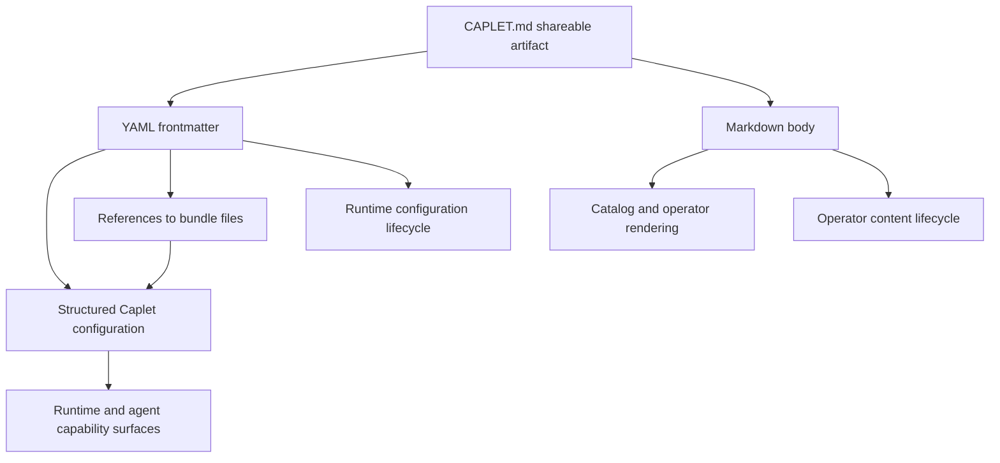
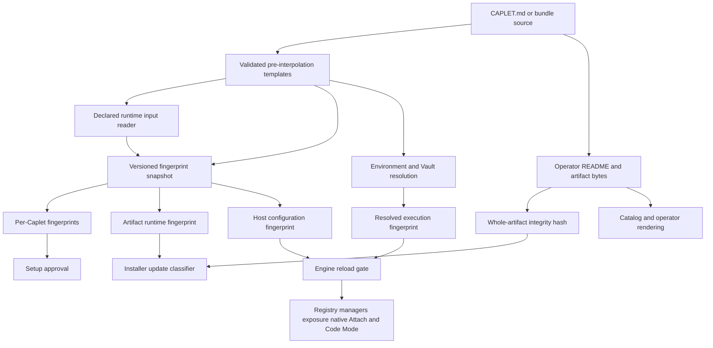
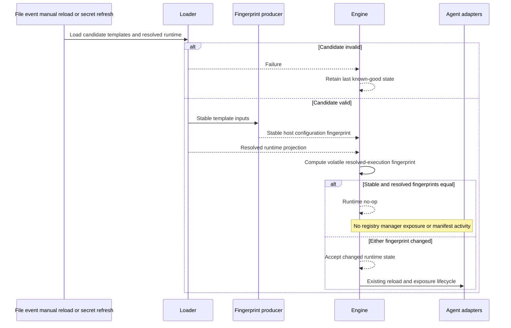
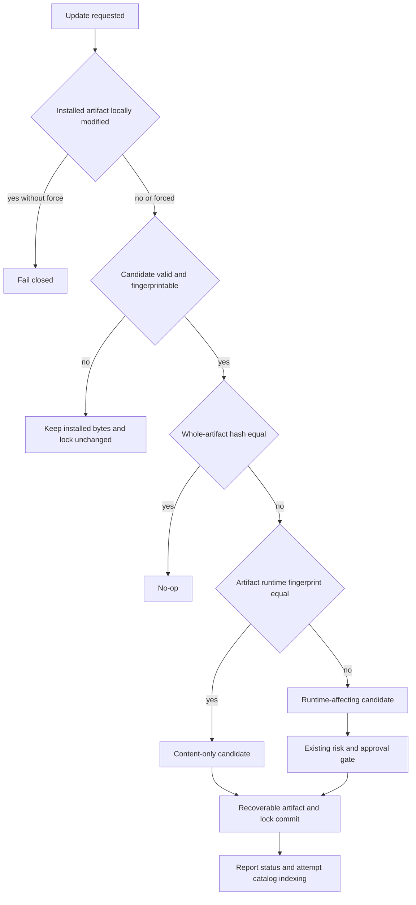

# Caplet Operator README Separation - Plan

## Goal Capsule

- **Objective:** Make YAML frontmatter and supported bundle files explicitly referenced from it the sole sources of Caplet runtime behavior, and redefine the Markdown body as independently managed operator documentation.
- **Product authority:** The Code Mode-first direction in `STRATEGY.md`, canonical Caplet vocabulary in `CONTEXT.md` and `CONCEPTS.md`, and this Product Contract govern the cutover. This contract supersedes prior plan language that treats the Markdown body as agent-facing shared operating context.
- **Execution profile:** Land six dependency-ordered units. Characterize the current parser, setup, reload, installer, and agent-surface contracts before replacing body-bearing runtime paths; complete the official content cutover only after the runtime boundary is enforced.
- **Stop conditions:** Stop and re-plan if runtime change detection would need to hash arbitrary sibling files, if public catalog rendering would need to consume runtime configuration, if lock compatibility requires a version migration, or if implementation would introduce the deferred SQL store.
- **Tail ownership:** Each feature-bearing unit owns focused behavioral tests. The final unit owns generated documentation and catalog outputs, the `@caplets/core` Changeset, package/API checks, full verification, and removal of abandoned compatibility paths.
- **Open blockers:** None.

---

## Product Contract

### Summary

A Caplet Markdown file remains one portable, catalog-friendly artifact with two independent projections: frontmatter supplies structured configuration, while the body supplies human operator documentation. The contract must translate later to structured storage fields plus a `body` value without changing runtime or content semantics.

### Problem Frame

Code Mode does not expose the Markdown body through its normal capability surface, so authors are maintaining agent instructions that agents neither use nor can inspect productively. The body is nevertheless copied into normalized runtime configurations and included in setup content hashing, which makes documentation participate in runtime lifecycle decisions despite providing no runtime value.

This ambiguity couples a shareable document format to the current file-backed configuration representation. It also makes a future structured store harder to model because runtime configuration and operator content do not yet have distinct ownership or update semantics.

### Key Decisions

- **One artifact, two projections:** `CAPLET.md` remains the canonical shareable artifact. Frontmatter and body are interpreted independently rather than creating separate file formats or parallel catalog parsing contracts.
- **Operator README body:** The body documents prerequisites, setup context, troubleshooting, safety considerations, and other Caplet-specific information for human operators. It is not agent operating context.
- **Frontmatter-only runtime authority:** Every runtime-affecting value originates in frontmatter or in a bundle file referenced from frontmatter. Presentation-only frontmatter fields may remain presentation-only; the body never supplies configuration.
- **Independent update lifecycles:** A body-only edit is a content update. It may be detected, published, installed, and rendered without changing runtime configuration, triggering runtime reload, or requiring setup reapproval.
- **No replacement instruction payload:** The cutover does not move the body into a new free-form agent-instruction field. Compact agent-visible capability descriptions remain structured frontmatter metadata; dedicated `useWhen` and `avoidWhen` fields are removed.
- **Clean content cutover:** Official Caplet bodies, examples, templates, and authoring documentation adopt the operator README contract in the same change.

The body has no path to runtime or agent capability surfaces. Referenced bundle files reach runtime configuration only through explicit frontmatter references.

### Actors

- A1. **Caplet operator:** Installs, configures, troubleshoots, and maintains a Caplet, and reads the body as operational documentation.
- A2. **Caplet author:** Publishes one portable Markdown artifact whose frontmatter and README body have distinct responsibilities.
- A3. **Agent caller:** Discovers and invokes Caplets through Code Mode, progressive exposure, direct exposure, Attach, or native integrations without receiving the README body as instructions or call context.
- A4. **Catalog or operator surface:** Ingests and renders the README body for humans while keeping it outside agent-callable capability data.

### Key Flows

- F1. **Share and ingest**
  - **Trigger:** A Caplet author or operator supplies a `CAPLET.md` file or Caplet bundle.
  - **Actors:** A1, A2, A4
  - **Steps:** The artifact is divided into frontmatter and body projections. Frontmatter is validated as structured Caplet data; the body is retained as operator documentation.
  - **Outcome:** One portable artifact supports both runtime configuration and human documentation without mixing their semantics.

- F2. **Configure and expose**
  - **Trigger:** A host loads or reloads a Caplet.
  - **Actors:** A1, A3
  - **Steps:** Runtime behavior is derived only from frontmatter and explicitly referenced bundle files. Agent-facing discovery and invocation surfaces receive only their structured, frontmatter-derived metadata and backend capabilities.
  - **Outcome:** No README body content enters runtime configuration or an agent capability surface.

- F3. **Publish a body-only update**
  - **Trigger:** An author changes only prerequisites, troubleshooting, or other README content.
  - **Actors:** A1, A2, A4
  - **Steps:** The artifact change is recognized as an operator content update and made available to human-facing surfaces.
  - **Outcome:** Operators receive the documentation update without runtime configuration churn or setup reapproval.

- F4. **Publish a configuration update**
  - **Trigger:** An author changes frontmatter or a runtime input referenced from frontmatter.
  - **Actors:** A1, A2, A3
  - **Steps:** The structured configuration projection changes and follows the existing runtime validation, approval, reload, and exposure lifecycle applicable to that field or referenced input.
  - **Outcome:** Runtime-affecting changes remain detectable and governed independently of README content.

### Requirements

**Artifact and authority**

- R1. A Caplet Markdown file must remain a shareable artifact composed of fenced YAML frontmatter and a Markdown body with independently defined semantics.
- R2. Frontmatter and supported bundle files explicitly referenced from it must be the sole sources of runtime-affecting Caplet values, including backend configuration, authentication, exposure, runtime requirements, setup, project binding, and agent-visible capability descriptions.
- R3. Presentation-only frontmatter metadata may remain outside runtime backend configuration without weakening the rule that no runtime value originates in the body.
- R4. The Markdown body must be retained as publishable operator documentation for prerequisites, setup context, troubleshooting, safety considerations, and general Caplet-specific guidance; authors must not place secrets, credentials, private endpoints, customer data, or other sensitive operational material in it.
- R5. Files within a Caplet bundle may remain runtime inputs only when frontmatter references them through a supported path or interpolation mechanism.
- R6. The body must not define, interpolate, override, or implicitly reference runtime configuration.

**Runtime and agent isolation**

- R7. The body must not be present in normalized runtime configurations, including runtime configurations expanded from a multi-backend Caplet file.
- R8. Caplets must not expose the body through agent discovery, search, detail, declaration, registration, invocation, result, Attach, or native integration surfaces.
- R9. Backend managers and downstream capability calls must not receive the body as hidden context, instructions, metadata, or configuration.
- R10. Independent host filesystem access to a source `CAPLET.md` file is outside the Caplets exposure guarantee; Caplets itself must provide no agent-facing route to the body.
- R11. Agent-visible Caplet descriptions must continue to come from frontmatter; backend-owned tool metadata may continue to include downstream selection hints.
- R12. No new free-form agent-instruction field may replace the body as part of this cutover.

**Content and configuration lifecycles**

- R13. Human-facing catalog and operator surfaces must be able to retain and render the body without making it agent-callable.
- R14. A body-only change must be classified as an operator content update rather than a runtime configuration update.
- R15. A body-only change must not trigger runtime reconfiguration, runtime restart or reload, or setup reapproval.
- R16. Artifact integrity and update detection may cover both projections, but they must preserve the distinction between an operator content change and a runtime-affecting configuration change.
- R17. A frontmatter change or a change to a runtime input referenced from frontmatter must continue through the applicable runtime validation, approval, reload, and exposure lifecycle.

**Migration and authoring contract**

- R18. Existing valid third-party Caplet Markdown files must remain parseable without a compatibility mode, while their bodies acquire the new operator-only meaning immediately.
- R19. Official bundled Caplet bodies must be rewritten so agent-directed workflows become operator prerequisites, troubleshooting, safety, or reference documentation where still useful.
- R20. Agent guidance that remains necessary must move to an existing structured frontmatter field or backend-owned tool metadata rather than to another free-form instruction channel.
- R21. Caplet authoring documentation, generated reference material, examples, and templates must describe the body as an operator README and frontmatter as the only runtime authority.
- R22. Tests and historical assumptions that require body preservation in runtime configurations or expanded child configurations must be replaced by coverage of the two-projection contract.

**Structured-storage readiness**

- R23. The artifact contract must permit lossless import into and export from a future structured store where frontmatter maps to structured fields and the Markdown body maps to a distinct body value.
- R24. The meaning of runtime configuration and operator content must remain identical whether a Caplet originated from Markdown or a future structured store.

### Acceptance Examples

- AE1. **Agent inspection excludes README content. Covers R7-R12.** Given a body containing prerequisites and troubleshooting text, when an agent lists, searches, inspects, registers, or invokes the Caplet through any Caplets capability surface, then none of that body text or a body field is present.
- AE2. **Catalog renders README content. Covers R4, R13.** Given the same Caplet, when a human opens its catalog or operator presentation, then the Markdown body is available as rendered documentation and is clearly separate from structured frontmatter.
- AE3. **Body-only update is content-only. Covers R14-R16.** Given an installed Caplet whose frontmatter and referenced runtime inputs are unchanged, when only troubleshooting prose changes, then the content update is detectable and publishable without runtime reload or setup reapproval.
- AE4. **Frontmatter update remains runtime-affecting. Covers R2, R17.** Given an installed Caplet, when its backend, authentication, exposure, or runtime frontmatter changes, then the existing applicable runtime configuration lifecycle runs.
- AE5. **Referenced bundle input remains functional. Covers R5, R17.** Given frontmatter that references an OpenAPI document or another supported bundle file, when the Caplet loads, then the referenced file remains a runtime input and a change to it remains runtime-affecting.
- AE6. **Body cannot interpolate configuration. Covers R6.** Given Markdown body text that resembles a path, variable, secret reference, or backend directive, when the Caplet loads, then that text remains documentation and cannot alter runtime behavior.
- AE7. **Multi-backend body remains singular documentation. Covers R7, R18.** Given a multi-backend Caplet file with one README body, when child runtime configurations are expanded, then each child receives the appropriate frontmatter-derived configuration and none receives a copy of the body.
- AE8. **Markdown and structured storage preserve semantics. Covers R23-R24.** Given equivalent Caplet data imported from Markdown and from a future structured record, when each is rendered for an operator and projected for runtime use, then both produce equivalent operator content and runtime configuration without using body text as configuration.

### Scope Boundaries

- Implementing, selecting, or migrating to a SQL-backed runtime Caplet store is deferred.
- Designing a generic multi-file documentation or asset system is excluded; `CAPLET.md` remains the canonical portable README artifact.
- Adding a replacement free-form agent instruction channel is excluded.
- Automatically grading or rejecting subjective README prose is excluded.
- Preventing an agent with independent filesystem access from opening the shared source file is excluded; the guarantee applies to Caplets-owned capability surfaces.

### Dependencies and Assumptions

- Existing catalog and future operator renderers can transport and render the body for humans without registering it as agent-callable capability data.
- Existing frontmatter fields and referenced bundle-file mechanisms remain sufficient for every runtime behavior that must survive the cutover.
- Official body content can be reviewed and reclassified without preserving obsolete agent-directed prose solely for compatibility.

### Sources and Research

- `packages/core/src/caplet-files-bundle.ts:803-937,1258-1374,1498-1528,1645-1745` defines the strict frontmatter schema and currently copies the body into singular and expanded runtime configurations.
- `packages/core/src/config-runtime.ts:225-238,304-316` currently retains the optional body in normalized runtime configuration.
- `packages/core/src/setup/hash.ts:4-36` currently includes the body in setup content hashing.
- `packages/core/src/registry.ts:13-58,129-158`, `packages/core/src/exposure/projection.ts:417-450`, `packages/core/src/capability-description.ts:3-17`, and `packages/core/src/code-mode/declarations.ts:9-24,40-48` show that the examined agent-facing surfaces already omit the body.
- `apps/catalog/src/lib/markdown.ts:20-29` and `apps/catalog/src/components/CapletDetail.astro:17-22,75-109` show the existing human-facing body rendering path.
- `packages/core/test/caplet-files.test.ts:9-34,115-265` records current body-preservation and catalog-metadata compatibility expectations.
- `apps/docs/src/content/docs/reference/caplet-files.mdx:14-110` and `docs/plans/2026-06-29-001-feat-multi-backend-caplet-files-plan.md:42-62,199-213` retain the agent-facing body semantics this contract supersedes.
- `docs/plans/2026-06-26-002-feat-caplets-catalog-search-site-plan.md:188-201` and `apps/catalog/src/lib/catalog-store.ts:1-12,40-69` demonstrate that existing SQL-backed storage is catalog-scoped rather than runtime Caplet configuration storage.

---

## Planning Contract

### Product Contract Preservation

Product Contract changed: R2 clarifies referenced bundle inputs already allowed by R5; R4 makes the existing shareable/catalog-rendered README boundary explicit by excluding sensitive operational material.

### Key Technical Decisions

| Decision                                                                  | Rationale                                                                                                                                                                                                                                                                                                                               |
| ------------------------------------------------------------------------- | --------------------------------------------------------------------------------------------------------------------------------------------------------------------------------------------------------------------------------------------------------------------------------------------------------------------------------------- |
| Delete `body` from runtime types and values rather than filtering outputs | Backend dispatch receives complete Caplet configurations. Structural removal is the only boundary that prevents hidden body context from reaching managers, expanded children, or future adapters.                                                                                                                                      |
| Produce fingerprints at a pure source-aware boundary                      | A versioned fingerprint snapshot is derived from validated pre-interpolation template semantics, logical declaring-source identity, and a declared-input reader. The producer does not import engine, installer, setup, Caplet-set manager, or Vault orchestration, which prevents circular authority.                                  |
| Separate stable artifact semantics from volatile resolved execution       | Setup and installer use the pre-interpolation snapshot, retaining `$env` and `$vault` reference syntax without resolving secrets. The engine also keeps a non-persisted fingerprint of resolved execution state so credential rotation can reload runtime state without entering lock or approval persistence.                          |
| Name three stable fingerprint scopes                                      | A per-runtime-ID Caplet fingerprint covers one effective expanded child; an artifact runtime fingerprint covers the children owned by one installable artifact; a host configuration fingerprint covers the host’s sorted runtime-ID map plus enumerated runtime-wide behavior options. Each consumer uses the narrowest scope it owns. |
| Fingerprint validated semantics, not raw YAML or physical paths           | Comments, key order, formatting, and different source/install roots are not runtime changes. Canonical frontmatter-derived templates plus logical declared-reference identities and content states are.                                                                                                                                 |
| Keep logical and physical reference identity separate                     | Fingerprints use a logical identity relative to the declaring source. Resolvers use a private physical identity only to read content, enforce boundaries, and detect cycles; host paths and OS error prose never enter snapshots.                                                                                                       |
| Traverse only declared runtime inputs                                     | OpenAPI, Discovery, GraphQL, and Caplet-set references participate in the runtime fingerprint. README links, arbitrary siblings, catalog metadata, unreferenced assets, and `cwd` trees remain outside it.                                                                                                                              |
| Make Caplet-set runtime discovery authoritative                           | `capletsRoot` traversal must share the nested runtime loader’s discovery, precedence, duplicate, merge, and cycle semantics. It fingerprints the effective child configuration the runtime can load, not whichever files a broader bundle scan can find.                                                                                |
| Gate reload before side effects                                           | The engine compares both stable configuration and volatile resolved-execution fingerprints before registry replacement, exposure generation, manager updates, callable-state watcher resets, or reload notifications. Invalid candidates retain the last known-good configuration and fingerprints.                                     |
| Keep artifact integrity distinct from runtime equality                    | Existing whole-artifact hashing continues to protect restore and local-drift safety. A trusted upstream artifact change with an equal artifact runtime fingerprint becomes a content-only update; a changed fingerprint follows the existing risk and replacement lifecycle.                                                            |
| Commit artifact bytes and lock baselines recoverably                      | Candidate validation and fingerprinting finish before mutation. A successful update is reported only after destination bytes and lock baselines form one recoverable matched pair; synchronous lock failure rolls back, and interrupted transitions are repaired or finalized before the next drift check.                              |
| Preserve lockfile v1 additively and safely                                | Keep `installedHash` and `risk.bodyHash` semantics unchanged. Add optional persistence-safe artifact runtime state, live-compute missing legacy baselines, and mark snapshots containing literal secrets or unportable host values live-only instead of persisting a guessing oracle or host correlate.                                 |
| Preserve per-Caplet batch commits                                         | Do not broaden the work into transactional multi-Caplet updates. Complete each Caplet’s artifact-and-lock commit before the next; a later failure may leave prior entries committed, and retry must safely no-op or reclassify them.                                                                                                    |
| Preserve raw catalog rendering                                            | Official and community catalog paths continue to retain raw Markdown and render the body for humans. Public browser access is operator presentation under R13, not a Caplets capability-surface leak under R8-R10.                                                                                                                      |
| Migrate prose without prose-locking tests                                 | Rewrite official bodies and authoring guidance, but test durable parsing, routing, generation, and isolation behavior rather than exact README copy.                                                                                                                                                                                    |

### High-Level Technical Design

The cutover creates two data planes from the same portable artifact. Only stable template semantics and volatile resolved execution state reach runtime equality; operator content never does.

The pure snapshot producer receives validated pre-interpolation semantics, a logical declaring-source identity, and a declared-input reader. It returns per-Caplet fingerprints, an artifact runtime fingerprint, a host configuration fingerprint, and safe input-state facts. The engine separately computes a non-persisted resolved-execution fingerprint after environment and Vault resolution.

Declared references carry two identities: a fingerprinted logical identity normalized relative to the declaring source, and a private physical traversal identity used only for reads, boundary checks, and cycle detection. Read results are discriminated as present with digest, missing, or unreadable; snapshots contain neither absolute roots nor raw error text.

Installer classification preserves local-drift safety, validates without mutation, and commits artifact bytes with lock baselines before status or indexing.

### Implementation Constraints

- Preserve the existing fenced-frontmatter, file-size, and body-size validity limits. An artifact that exceeds those limits is invalid, not a content-only update.
- Preserve last-known-good runtime behavior on parse, validation, or source-resolution failure; update the stored runtime fingerprint only after a successful load.
- Remove `useWhen` and `avoidWhen` from public JSON configuration and generated frontmatter schemas without adding compatibility aliases.
- Preserve frontmatter-derived `description` plus backend-owned tool, resource, resource-template, and prompt content.
- Do not hash `cwd` trees, arbitrary sibling files, Markdown links, or raw `capletsRoot` directories. Resolve only supported frontmatter-declared runtime inputs.
- Represent missing or unreadable declared inputs with safe deterministic categories so deletion and recovery are runtime changes without embedding filesystem error prose.
- Preserve materialized symlink handling, whole-artifact local-drift checks, and current restore force behavior.
- Keep content-only catalog indexing best-effort: an indexing failure may be reported after a successful local content update but must not roll back the installed artifact.
- Canonical persisted snapshots retain environment and Vault reference syntax. Resolved credentials and environment values participate only in the engine’s volatile in-memory execution fingerprint.
- Runtime snapshots with literal secret-bearing values or unportable absolute host values are live-only for installer comparison and must not be written to lockfiles, output, activity records, diagnostics, or telemetry.
- Validate and fingerprint an update candidate before replacing destination bytes. `--force` may override confirmed local drift and acknowledged risk, but it does not bypass candidate parsing, fingerprint construction, or declared-reference traversal.
- Begin catalog indexing only after the destination and lock commit succeeds. Normalize endpoint unavailability and thrown indexer failures into the ancillary indexing result without rolling back or misreporting the completed update.
- Preserve established per-Caplet batch atomicity: committed earlier entries remain committed if a later selected entry fails, and a retry recognizes those completed entries without treating them as drift.

### Sequencing

- U1 removes the forbidden runtime body bridge and establishes characterization coverage.
- U2 defines the shared runtime fingerprint and declared-reference inventory.
- U3 and U4 consume U2 independently for engine lifecycle and installer lifecycle.
- U5 depends on U1 and U4 so the authoring cutover follows the runtime boundary and content-update lifecycle.
- U6 follows U1-U5 and owns generated outputs, release metadata, final verification, and cleanup.

### System-Wide Impact

| Surface                                       | Impact                                                                                                                                                                                                    |
| --------------------------------------------- | --------------------------------------------------------------------------------------------------------------------------------------------------------------------------------------------------------- |
| Core runtime and published types              | `CapletConfig` and `@caplets/core/config-runtime` lose the optional body field; consumers receive a compile-time API cut and a body-free normalized value.                                                |
| Engine and agent adapters                     | README-only edits stop before registry, manager, exposure, native, MCP, Attach, and Code Mode notification work. Template or resolved-execution changes preserve existing fan-out.                        |
| Setup and approval                            | README, catalog-only, and secret-value rotation preserve artifact approval because stable templates retain reference syntax. Runtime templates and declared-input changes use the per-Caplet fingerprint. |
| Install, restore, Current Host, and dashboard | Update results distinguish content-only from runtime-affecting updates while retaining whole-artifact drift protection, recoverable artifact-and-lock commits, and post-commit catalog indexing.          |
| Catalog, authoring, and documentation         | Raw README rendering remains available; official Caplets and generated authoring references adopt operator-focused body semantics.                                                                        |
| Release surface                               | The public core package changes and requires a Changeset. Generated schemas should remain unchanged; generated docs and the official catalog seed should change.                                          |

### Risks and Mitigations

| Risk                                                        | Mitigation                                                                                                                                                                             |
| ----------------------------------------------------------- | -------------------------------------------------------------------------------------------------------------------------------------------------------------------------------------- |
| Consumers disagree about fingerprint scope                  | Define per-Caplet, per-artifact, and host-configuration aggregates in one versioned producer and add adapter-parity fixtures.                                                          |
| Resolved secrets enter persistent equality                  | Fingerprint pre-interpolation templates for setup/install, keep resolved-execution equality engine-local, and never persist raw values or resolution-derived digests.                  |
| Literal secrets or absolute host paths create a lock oracle | Mark unsafe snapshots live-only; compare installed and source state during the operation without writing optional runtime state or sensitive correlates.                               |
| Referenced file changes are suppressed as no-ops            | Include every supported declared input with logical identity and safe present, missing, and unreadable states.                                                                         |
| Documentation changes still trigger agent notifications     | Require both stable and resolved engine fingerprints to be equal before the early no-op and test each notification exit.                                                               |
| Caplet-set traversal disagrees with runtime loading         | Share the runtime discovery/precedence contract, handle `configPath` plus `capletsRoot`, separate logical identity from physical cycle keys, and test relocation.                      |
| Destination and lock baselines diverge on failure           | Stage and validate before mutation, retain rollback state through lock commit, repair interrupted transitions before drift classification, and withhold success/indexing until commit. |
| `--force` mutates from an invalid or disappeared source     | Keep candidate validity and fingerprint construction as non-bypassable gates before replacement.                                                                                       |
| Legacy or restored locks lack runtime state                 | Live-compute absent baselines, persist safe optional state after success even when restored bytes match the prior artifact hash, and keep lock version 1.                              |
| Multi-Caplet updates partially succeed                      | Preserve per-Caplet commits, finish each matched artifact-and-lock pair before advancing, and make retries idempotent for earlier successes.                                           |
| Catalog indexing changes update success                     | Run indexing strictly post-commit and report unavailable/throwing indexers as ancillary outcomes in local and Current Host paths.                                                      |
| New update status is lost by a relay                        | Update local, remote, Current Host, activity, and dashboard unions/renderers together and exercise JSON plus human output.                                                             |
| Official rewrites remove useful agent selection guidance    | Audit each agent-directed body statement; move only necessary compact capability context to `description` and keep the rest operator-facing.                                           |

### Planning Research

- `docs/solutions/integration-issues/vault-cli-runtime-integration-fixes.md` establishes the pure parse versus runtime-aware loader boundary and warns against divergent validation/resolution paths.
- `docs/solutions/architecture-patterns/native-daemon-service-management.md` establishes configuration mutation and runtime lifecycle as separate ownership domains and favors clean cutover over parallel implementations.
- `docs/solutions/architecture-patterns/code-mode-repl-sessions.md` reinforces capability-scoped agent access and body-free discovery boundaries.
- `packages/core/src/engine.ts`, `packages/core/src/native/service.ts`, `packages/core/src/serve/native-session.ts`, `packages/core/src/serve/index.ts`, and `packages/core/src/serve/http.ts` establish the reload-to-agent-notification fan-out that the semantic no-op must stop.
- `packages/core/src/cli/install.ts`, `packages/core/src/cli/lockfile.ts`, and `packages/core/src/current-host/catalog-operations.ts` establish whole-artifact drift safety, v1 lock persistence, update result relays, and best-effort catalog indexing.
- `packages/core/src/caplet-source/parse.ts`, `packages/core/src/caplet-files.ts`, and `packages/core/src/caplet-sets.ts` show why canonicalization needs source provenance, separate logical and physical reference identities, and runtime-authoritative Caplet-set discovery rather than bundle-wide scanning.
- `packages/core/src/config.ts` and `packages/core/src/config-runtime.ts` establish that stable template semantics must be captured before environment/Vault interpolation, while the engine still needs volatile equality after resolution.

---

## Implementation Units

### U1. Remove the body from runtime configuration

**Goal:** Make every normalized Caplet configuration structurally body-free while preserving raw Markdown for content consumers and compact capability descriptions for agents.

**Requirements:** R1-R12, R18, R20, R22; F1-F2; AE1, AE6-AE7.

**Dependencies:** None.

**Files:**

- `packages/core/src/caplet-files-bundle.ts`
- `packages/core/src/config.ts`
- `packages/core/src/config-runtime.ts`
- `packages/core/src/setup/hash.ts`
- `packages/core/test/caplet-files.test.ts`
- `packages/core/test/config.test.ts`
- `packages/core/test/backend-operation-dispatch.test.ts`
- `packages/core/test/registry.test.ts`
- `packages/core/test/code-mode-declarations.test.ts`
- `packages/core/test/attach-api.test.ts`

**Approach:**

- Keep fenced Markdown splitting and body guardrails, but remove the body argument and assignments from singular conversion, plural expansion, child normalization, and returned runtime maps.
- Delete `body` from every runtime union arm, normalized schema, common runtime schema, and interpolation-field allowance. Keep public config parsing strict so a forced legacy body field is rejected rather than silently retained.
- Remove the body from setup hash input immediately; U2 replaces the remaining hand-maintained configuration serialization with the shared per-Caplet runtime fingerprint.
- Preserve the existing registry, exposure, Attach, and Code Mode whitelists. Their role is characterization, not sanitization of a body-bearing source.
- Do not add a replacement free-form instruction property or alter backend manager contracts; dispatch becomes safe because its complete `CapletConfig` input is body-free.

**Execution note:** Add characterization coverage before deleting the duplicated type/schema paths; a green outward-serialization test alone does not prove backend-manager isolation.

**Patterns to follow:**

- Strict frontmatter validation and singular/plural conversion in `packages/core/src/caplet-files-bundle.ts`.
- Explicit registry and projection whitelists in `packages/core/src/registry.ts` and `packages/core/src/exposure/projection.ts`.
- Existing direct-JSON body rejection coverage in `packages/core/test/config.test.ts`.

**Test scenarios:**

1. Load singular fixtures across all backend families with a unique README sentinel, fake YAML, a path-like string, and a secret-looking value; each normalized result has no body key or sentinel while frontmatter-derived fields and normalized references remain intact.
2. Load plural fixtures and assert every expanded child lacks body data while parent/shared and child-specific frontmatter inheritance remains unchanged.
3. Pass a parsed configuration through backend-operation dispatch for check, discovery, and invocation; manager adapters receive no body key or sentinel.
4. Serialize registry summary/detail, generated Code Mode declarations, and local/native Attach manifests; none contain body data, while descriptions remain present and authored `useWhen` or `avoidWhen` properties are absent.
5. Force a legacy body property through the internal normalized parser and assert the strict schema rejects it; direct JSON configuration continues rejecting the property.
6. Compare setup hashes for otherwise identical body-free configurations originating from different README bodies; the values match. Changing setup, auth, exposure, or backend configuration still changes the existing hash input.
7. Keep a backend-advertised resource or prompt named `README.md`; it remains downstream-owned content and is never replaced with the Caplet README.

**Verification:** Every runtime type, parsed value, expanded child, manager input, and agent projection is body-free; catalog/raw Markdown code remains untouched and capability descriptions are unchanged.

### U2. Establish the canonical runtime fingerprint

**Goal:** Give source loaders, setup, engine, and installer one pure snapshot producer with explicit consumer-specific fingerprint scopes.

**Requirements:** R2-R7, R14-R17, R23-R24; F2-F4; AE3-AE8.

**Dependencies:** U1.

**Files:**

- `packages/core/src/caplet-source/runtime-fingerprint.ts` (new)
- `packages/core/src/caplet-source/types.ts`
- `packages/core/src/caplet-files-bundle.ts`
- `packages/core/src/caplet-files.ts`
- `packages/core/src/caplet-source/parse.ts`
- `packages/core/src/caplet-sets.ts`
- `packages/core/src/config.ts`
- `packages/core/src/config-runtime.ts`
- `packages/core/src/setup/hash.ts`
- `packages/core/src/cli/setup-caplet.ts`
- `packages/core/src/cloud/runtime-adapter.ts`
- `packages/core/test/caplet-source.test.ts`
- `packages/core/test/caplet-sets.test.ts`
- `packages/core/test/config.test.ts`
- `packages/core/test/setup-runner.test.ts`

**Approach:**

- Make the fingerprint producer a pure lower-layer module. It accepts validated pre-interpolation template semantics, logical source provenance, and a declared-input reader; it does not import engine, installer, setup, Caplet-set manager, or Vault resolution.
- Return a versioned snapshot with per-runtime-ID Caplet fingerprints, an artifact runtime fingerprint, a host configuration fingerprint, and safe declared-input state. Keep physical traversal keys private.
- Define a Caplet fingerprint from one effective expanded child, its parent/child logical identity, and its declared-input graph. Define an artifact aggregate from the children owned by one installable artifact.
- Define the host configuration aggregate from the sorted runtime-ID map plus explicitly enumerated runtime-wide options that change engine behavior, including paging and exposure defaults.
- Keep `$env` and `$vault` reference syntax in stable snapshots. Do not resolve secret values in the producer; U3 owns the separate non-persisted resolved-execution fingerprint.
- Extend the declared-input reader contract to preserve logical identity while distinguishing present with digest, missing, and unreadable without serializing physical paths or error prose.
- Cover OpenAPI specifications, Google Discovery documents, GraphQL schemas and operation documents, Caplet-set config files, and Caplet-set roots. Ignore `cwd` trees, README links, and arbitrary siblings.
- Make `capletsRoot` recursion use the nested runtime loader’s discovery, precedence, duplicate, `configPath` merge, and cycle behavior. Fingerprint effective nested runtime projections, not a raw directory or the broader portable-bundle candidate set.
- Determine persistence eligibility from the stable snapshot. Literal secret-bearing values and unportable absolute host values produce a live-only snapshot; portable template references and logical relative inputs remain eligible.
- Carry successful snapshots with source/load metadata rather than adding them to `CapletConfig` or agent projections. Make local and hosted setup approval consume the per-Caplet stable fingerprint.

**Patterns to follow:**

- Runtime-aware source resolution and source metadata flow in `packages/core/src/caplet-source/parse.ts`.
- Stable setup hash serialization in `packages/core/src/setup/hash.ts`.
- Last-known-good configuration behavior in `packages/core/src/engine.ts`.

**Test scenarios:**

1. Reach the pure producer through filesystem loading, portable source parsing, and setup identity construction; the same portable fixture yields identical logical inputs and digests.
2. Compute stable fingerprints for semantically identical frontmatter with different YAML comments, key order, formatting, and source roots; values match.
3. Resolve the same `$env` and `$vault` templates to different secret values; stable fingerprints, setup approval, and persistence-safe lock payloads remain equal and contain no resolution-derived material.
4. Use literal bearer/header/client-secret fields and absolute host paths; runtime differences are detectable by live comparison, but optional lock state, outputs, activities, and diagnostics contain no new digest or correlate.
5. Change description, exposure, auth templates, setup, runtime requirements, or backend configuration; the applicable Caplet and containing aggregate fingerprints change.
6. Change only body text or catalog metadata; all stable runtime fingerprints stay equal.
7. Mutate every supported declared input family; the applicable fingerprint changes. Add an arbitrary sibling file, `cwd` file, or README link; it does not.
8. Exercise identical logical references through filesystem and portable readers; present, missing, and unreadable states are distinct and contain no absolute root or OS error text.
9. Fingerprint Caplet sets covering top-level and immediate-directory discovery, deeper ignored candidates, duplicate/precedence behavior, `configPath` plus `capletsRoot` merging, relocation, and a recursive cycle; results match what runtime loading can consume.
10. For a multi-backend parent, change shared metadata and then one child-local field; governed child, artifact, and host aggregates change at the correct scopes.
11. Change a runtime-wide paging or exposure option; only the host configuration fingerprint changes, while an installer compares only its artifact aggregate.
12. Approve setup locally and through the hosted runtime adapter; README, catalog, and resolved-secret changes retain approval, while template or declared-input changes require the applicable recheck.

**Verification:** One pure module owns versioned canonicalization, logical reference traversal, consumer scopes, and persistence eligibility; adapters agree, no secret-derived or host-specific state is persisted, and undeclared content never affects runtime equality.

### U3. Make runtime reload a semantic no-op for content changes

**Goal:** Stop README-only and other runtime-equal file events before registry, manager, exposure, native, MCP, Attach, or Code Mode side effects.

**Requirements:** R7-R17, R22; F2-F4; AE1, AE3-AE5, AE7.

**Dependencies:** U2.

**Files:**

- `packages/core/src/engine.ts`
- `packages/core/test/engine.test.ts`
- `packages/core/test/native.test.ts`
- `packages/core/test/serve-http.test.ts`
- `packages/core/test/attach-api.test.ts`

**Approach:**

- Store the last successful host configuration fingerprint and a separate non-persisted resolved-execution fingerprint. Require both to be equal before the runtime no-op.
- Compute resolved-execution equality after environment and Vault resolution without writing it to lock, setup approval, telemetry, diagnostics, or agent-facing projections.
- Compare a valid candidate before replacing the registry, advancing exposure generation, updating or invalidating managers, resetting callable-state watchers, or emitting reload notifications.
- Treat equality as a successful runtime no-op without changing the meaning of the public reload success result.
- Retain current registry and both fingerprints after parse, validation, Vault, or source-resolution failure. File-watch bookkeeping needed for later additions may continue without becoming an agent-facing event.
- Preserve existing manager invalidation and notification behavior for changed templates, declared inputs, runtime-wide options, or resolved execution values.
- Characterize the downstream fan-out rather than adding body-specific filters in native, MCP, Attach, or Code Mode adapters.

**Execution note:** Start with failing manual-reload and watched-reload integration tests; the bug is lifecycle churn, not serialized payload content.

**Patterns to follow:**

- Last-known-good reload handling in `packages/core/src/engine.ts`.
- Existing `onToolsChanged`, registered-tool reconciliation, and Attach manifest-change tests in the native and serve suites.

**Test scenarios:**

1. Start an engine from a temporary directory Caplet, subscribe to reload, record exposure generation, edit only valid README text, and call reload; success is returned with no registry replacement, generation change, manager activity, or reload callback.
2. Repeat through the filesystem watcher/debounce path; body-only edits produce no runtime event.
3. Attach native service, MCP/native sessions, local/native Attach, and HTTP Attach SSE subscribers; a body-only edit produces no tool update, registration update, manifest invalidation, revision change, or manifest-change event.
4. Change a frontmatter description and then a declared runtime input; each causes one normal reload, manager invalidation where applicable, exposure refresh, and downstream notification.
5. Delete and restore a declared input; both transitions are runtime-affecting and never collapse into a content-only no-op.
6. Keep frontmatter templates fixed, rotate resolved environment and Vault values, and trigger the established refresh/reload path; stable configuration equality remains while volatile execution equality changes and runtime consumers refresh without persisting secret-derived state.
7. Make the candidate artifact invalid through malformed frontmatter or an exceeded artifact/body guardrail; reload fails and retains the prior registry, generation, and fingerprint.
8. Compare Code Mode declarations and Attach manifests before and after a body-only edit; bytes/structured values remain stable while the raw catalog body can change independently.

**Verification:** Runtime-equal file changes cause zero callable-state churn across every subscriber; runtime-different changes and invalid-candidate recovery preserve established behavior.

### U4. Classify trusted content-only install updates

**Goal:** Install and publish trusted README/content changes without runtime risk or approval churn while preserving lockfile compatibility and local-drift safety.

**Requirements:** R13-R18, R23-R24; F1, F3-F4; AE2-AE5, AE8.

**Dependencies:** U2.

**Files:**

- `packages/core/src/cli/install.ts`
- `packages/core/src/cli/lockfile.ts`
- `packages/core/src/cli.ts`
- `packages/core/src/current-host/catalog.ts`
- `packages/core/src/current-host/catalog-operations.ts`
- `apps/dashboard/src/components/DashboardApp.tsx`
- `packages/core/test/cli.test.ts`
- `packages/core/test/current-host-catalog-operations.test.ts`
- `packages/core/test/dashboard-catalog.test.ts`
- `packages/core/test/catalog-indexing.test.ts`

**Approach:**

- Run the existing installed-artifact drift check before source-update classification. A locally modified README remains a conflict unless the operator uses the existing force path.
- Treat an upstream candidate as trusted for content-only classification only when it is resolved through the existing lock entry’s unchanged source identity and established provenance checks. An unverifiable or changed source identity cannot bypass the existing risk and confirmation path.
- After the drift decision, acquire, parse, validate, and fingerprint the candidate without mutating destination bytes, lock baselines, timestamps, activity, or catalog state. `--force` cannot bypass this gate.
- Preserve whole-artifact equality as `noop`. When artifact bytes differ, compare source and clean-installed artifact runtime fingerprints.
- Add a machine-readable `content_updated` outcome for equal runtime fingerprints. Keep runtime-different updates on the existing `updated` risk and approval path.
- Stage the candidate and retain recoverable prior destination state through the atomic lock write. Report success only after destination bytes, `installedHash`, optional safe runtime state, and timestamps form one committed pair.
- On synchronous lock failure, restore the prior matched destination and lock state. Detect an interrupted staged or swapped transition before the next drift check and either finalize the new pair or restore the old pair.
- Keep lockfile version 1. Add optional persistence-safe artifact runtime state, compute installed and source values live for legacy or live-only entries, and persist safe baselines only after a successful commit.
- Do not rename or repurpose `installedHash` or `risk.bodyHash`. Never persist optional state derived from literal secrets or unportable host paths.
- Treat restore as a rewrite event: after successful destination replacement, persist missing safe runtime state even when the whole-artifact hash equals the existing baseline; preserve `installedAt` and advance `updatedAt` only when a lock field changes.
- Preserve Git-pinned restore, materialized symlink, missing destination, force-over-drift, and per-Caplet batch commit behavior. Finish one artifact-and-lock pair before processing the next selected Caplet.
- Carry `content_updated` through local JSON/text, remote CLI, Current Host operations, activity rendering, and dashboard state. Human output distinguishes content from runtime without tests pinning subjective copy.
- Start catalog indexing only after commit. Normalize endpoint unavailability and thrown indexer failures into the ancillary indexing result; never index or emit success activity for an uncommitted candidate.

**Patterns to follow:**

- Whole-artifact integrity and local-drift guards in `packages/core/src/cli/install.ts`.
- Additive optional lock fields in `packages/core/src/cli/lockfile.ts`.
- Current Host result and catalog-index attachment in `packages/core/src/current-host/catalog-operations.ts`.

**Test scenarios:**

1. Install a directory Caplet, change only trusted upstream README text, and update; result is `content_updated`, artifact integrity changes, the artifact runtime fingerprint and approval eligibility stay equal, and catalog indexing runs after commit.
2. Reach the fingerprint producer through install source and destination adapters; equivalent portable source and clean-installed artifacts yield identical logical inputs and digests before update classification.
3. Change frontmatter or a declared runtime input; result remains `updated` and follows existing risk/force behavior.
4. Modify only the installed destination README locally; update fails closed without force even when the source runtime fingerprint is equal.
5. Make the source disappear or make templates/fingerprint traversal invalid after lock read; normal and forced updates preserve destination bytes, lock fields, timestamps, activity, and indexing silence.
6. Inject a lock-writer failure after staged replacement for content-only and runtime updates; the old destination and lock pair remain authoritative and no catalog request occurs.
7. Simulate interruption at staging, destination swap, lock temporary write, and lock replacement boundaries; the next operation recovers or finalizes the pair before local-drift classification.
8. Read a legacy v1 lock without runtime state, live-classify its first body-only update as content-only, and persist a safe optional baseline without changing lock version.
9. Use a legacy entry with a literal secret or absolute host path; live classification succeeds, but lock JSON, output, activity, and diagnostics gain no optional runtime digest or correlate.
10. Restore byte-identical pinned content for a missing destination with a legacy lock; restored status persists missing safe runtime state even though `installedHash` is unchanged. Repeat with force-over-drift and with a failed candidate.
11. Preserve symlink-materialized directory no-op behavior and copying of non-runtime bundle files.
12. Update two selected entries where the first commits and the second disappears, becomes invalid, or hits lock failure; established per-Caplet partial success remains recoverable and retry safely recognizes the first.
13. Return `content_updated` consistently through local JSON, remote response, Current Host operation, activity entry, and dashboard rendering.
14. Force endpoint failure and an indexer throw after a successful content-only commit; installed state and success activity remain, indexing reports unavailable, and a lock failure produces zero indexing calls.

**Verification:** Trusted upstream content updates are committed and publishable but never runtime-risk updates; candidate and lock failures preserve a recoverable artifact-and-baseline pair; local drift remains fail-closed; every status, legacy-lock, restore, batch, and indexing path agrees.

### U5. Cut over authoring and official Caplet content

**Goal:** Make operator README semantics the only current authoring guidance while preserving public catalog rendering and necessary compact agent capability descriptions.

**Requirements:** R4, R11-R13, R18-R22; F1-F3; AE1-AE3, AE6-AE7.

**Dependencies:** U1, U4.

**Files:**

- `packages/core/src/cli/author.ts`
- `scripts/generate-docs-reference.ts`
- `apps/docs/src/content/docs/reference/caplet-files.mdx` (generated)
- `apps/docs/src/content/docs/vault.mdx`
- `caplets/*/CAPLET.md`
- `apps/catalog/src/lib/markdown.ts`
- `apps/catalog/src/components/CapletDetail.astro`
- `apps/catalog/test/markdown.test.ts`
- `packages/core/test/author-cli.test.ts`
- `packages/core/test/catalog-official-index.test.ts`

**Approach:**

- Change authoring templates and generated examples so body content addresses operators: prerequisites, setup context, troubleshooting, safety, and reference material.
- Teach authors to treat README bodies as publishable catalog content and keep secrets, credentials, private endpoints, customer data, and other sensitive operational material out of them.
- Audit every official body. Rewrite agent-directed workflows into operator guidance where useful; delete low-value instruction prose instead of preserving it for compatibility.
- Move only compact context that remains necessary for agent selection into the existing `description` frontmatter field. Remove `useWhen` and `avoidWhen`; do not add a free-form replacement field.
- Keep runtime references explicit in frontmatter. Markdown links and path-like body text remain documentation only.
- Update the generated reference at its generator source, then regenerate the MDX output. Update direct Vault wording that currently describes body text as public metadata.
- Preserve the catalog’s raw `contentMarkdown` and human body rendering path. Do not source operator content from runtime configuration or suppress public browser rendering.
- Keep automated tests focused on authoring shape, frontmatter/body separation, rendered-content routing, and runtime isolation. Human review owns prose quality.

**Patterns to follow:**

- Generated documentation source-of-truth rules in `scripts/generate-docs-reference.ts`.
- Raw catalog split and sanitized Markdown rendering in `apps/catalog/src/lib/markdown.ts`.
- Existing official Caplet frontmatter conventions and catalog-grade metadata in `CONCEPTS.md`.

**Test scenarios:**

1. Generate a new Caplet authoring template; it contains valid frontmatter, an operator-oriented README body, and publishable-content safety guidance without adding an instructions field.
2. Split official-style Markdown in the catalog helper; frontmatter rows and body Markdown remain independent, and the body remains renderable for humans.
3. Build an official catalog entry from an updated Caplet; raw `contentMarkdown` includes its README while resolved runtime configuration has no body.
4. Put path-like text, a Markdown link, and a vault-looking token in a body; none becomes a runtime reference or interpolation input.
5. Confirm capability descriptions added during the prose audit survive registry and Code Mode projection tests from U1.
6. Do not add assertions for exact headlines, workflows, or subjective body wording; review the official corpus manually against the operator README and sensitive-content contracts.

**Verification:** Current authoring surfaces and official artifacts consistently teach and demonstrate operator README semantics; catalog rendering remains intact and no content migration recreates an agent instruction channel.

### U6. Regenerate, release, and verify the clean cutover

**Goal:** Publish synchronized generated artifacts and package metadata after all behavioral units pass.

**Requirements:** R18-R24; AE1-AE8.

**Dependencies:** U1-U5.

**Files:**

- `apps/docs/src/content/docs/reference/caplet-files.mdx`
- `apps/catalog/src/data/official-catalog.json`
- `schemas/caplets-config.schema.json`
- `schemas/caplet.schema.json`
- `apps/landing/public/caplets-config.schema.json`
- `apps/landing/public/caplet.schema.json`
- `.changeset/calm-caplet-readme-contract.md` (new)

**Approach:**

- Regenerate the documentation reference and official catalog index from their authoritative sources after content migration.
- Run schema generation/checks and retain schema outputs unchanged unless the authoritative frontmatter schema changed unexpectedly; never hand-edit them to describe an internal runtime-type deletion.
- Add a minor `@caplets/core` Changeset describing the exported `config-runtime` type cut, frontmatter-only runtime contract, content-only update classification, and preserved operator README rendering.
- Run focused behavioral suites before the full repository gate. Resolve generated drift at source rather than editing generated outputs.
- Remove temporary serializers, compatibility branches, duplicated reference inventories, obsolete body-preservation tests, and experimental fingerprint code before completion.

**Test expectation:** No new unit test belongs solely to this release-integration unit; U1-U5 own behavior. This unit proves generated-artifact freshness, public type/build integrity, and whole-repository compatibility.

**Verification:** Generated docs and catalog data are current, schemas are source-consistent, the Changeset covers the published package change, all focused suites pass, and the full repository gate succeeds with no obsolete body-bearing path.

---

## Verification Contract

| Gate                                               | Applies to | Command                                                                                                                                                                                                                                                                                     | Required outcome                                                                                                                               |
| -------------------------------------------------- | ---------- | ------------------------------------------------------------------------------------------------------------------------------------------------------------------------------------------------------------------------------------------------------------------------------------------- | ---------------------------------------------------------------------------------------------------------------------------------------------- |
| Runtime projection and fingerprint tests           | U1-U2      | `pnpm --filter @caplets/core test -- test/caplet-files.test.ts test/config.test.ts test/caplet-source.test.ts test/caplet-sets.test.ts test/setup-runner.test.ts test/backend-operation-dispatch.test.ts test/registry.test.ts test/code-mode-declarations.test.ts test/attach-api.test.ts` | Body is structurally absent, fingerprints classify declared semantics correctly, setup parity holds, and agent-facing structured hints remain. |
| Reload and notification tests                      | U3         | `pnpm --filter @caplets/core test -- test/engine.test.ts test/native.test.ts test/serve-http.test.ts test/attach-api.test.ts`                                                                                                                                                               | Content-only reloads are side-effect-free; runtime changes and invalid candidates preserve established lifecycle behavior.                     |
| Installer, lock, Current Host, and dashboard tests | U4         | `pnpm --filter @caplets/core test -- test/cli.test.ts test/current-host-catalog-operations.test.ts test/dashboard-catalog.test.ts test/catalog-indexing.test.ts`                                                                                                                            | Content-only classification, legacy v1 locks, restore/drift safety, status relays, and indexing outcomes agree.                                |
| Authoring and official catalog tests               | U5         | `pnpm --filter @caplets/core test -- test/author-cli.test.ts test/catalog-official-index.test.ts`                                                                                                                                                                                           | Author templates and official index generation preserve the two-projection contract.                                                           |
| Catalog rendering tests                            | U5         | `pnpm --filter @caplets/catalog test -- markdown.test.ts`                                                                                                                                                                                                                                   | Frontmatter and README body remain independently rendered with existing sanitization.                                                          |
| Generated documentation and catalog checks         | U5-U6      | `pnpm docs:generate`, `pnpm catalog:generate`, then `pnpm docs:check` and `pnpm catalog:check`                                                                                                                                                                                              | Generated MDX and official catalog data match authoritative sources.                                                                           |
| Public schema and Code Mode API checks             | U1-U6      | `pnpm schema:check` and `pnpm code-mode:check-api`                                                                                                                                                                                                                                          | Frontmatter/public config schemas and Code Mode declarations remain source-consistent; no body field is introduced.                            |
| Static and package verification                    | U1-U6      | `pnpm format:check`, `pnpm lint`, `pnpm typecheck`, and `pnpm build`                                                                                                                                                                                                                        | Source, exported types, apps, and package artifacts compile and conform.                                                                       |
| Changeset validation                               | U6         | `pnpm changeset status --since=origin/main`                                                                                                                                                                                                                                                 | The published `@caplets/core` change has an accepted release entry.                                                                            |
| Full repository gate                               | U6         | `pnpm verify`                                                                                                                                                                                                                                                                               | Formatting, lint, generated APIs/schemas/docs, types, tests, benchmarks, and build all pass in repository order.                               |

Behavioral verification must include these cross-cutting invariants:

- A valid body-only edit changes raw content and whole-artifact integrity but changes no stable template fingerprint, setup approval, resolved-execution fingerprint, exposure generation, manager state, or agent notification.
- Frontmatter templates, runtime-wide options, resolved environment/Vault values, and every supported declared runtime input change the applicable stable or volatile fingerprint and retain their intended reload behavior without persisting secret-derived state.
- Local installed drift remains distinct from a trusted upstream content update and continues to fail closed without force.
- Candidate or lock failure leaves a recoverable matched artifact-and-lock pair; catalog indexing occurs only after commit and cannot roll back or misreport a successful update.
- Legacy and live-only locks classify from installed/source state without migration, secret-derived persistence, or stale restore baselines.
- Public catalog/browser presentation retains the README body; Caplets-owned discovery, invocation, Attach, native, and Code Mode surfaces never do.
- Multi-backend and nested Caplet-set bodies remain operator content and do not multiply into child runtime configurations or fingerprints.

---

## Definition of Done

### Global

- The Product Contract remains unchanged and every applicable R/F/AE is traced to an implementation unit or verification invariant.
- Runtime `CapletConfig` types, schemas, values, expanded children, setup inputs, manager inputs, and agent capability projections contain no README body field or content.
- One pure fingerprint producer owns stable per-Caplet, artifact, and host-configuration scopes; the engine separately tracks volatile resolved-execution equality without persistence.
- README-only and other stable-and-resolved-equal changes are observable content updates without runtime reload, reapproval, manager invalidation, exposure churn, or agent notification.
- Runtime-affecting templates, runtime-wide options, declared inputs, and resolved execution values retain their intended validation, reload, risk, approval, and exposure behavior.
- Lockfile v1, safe optional runtime state, recoverable artifact-and-lock commits, whole-artifact drift safety, restore behavior, per-Caplet batches, symlink materialization, and public catalog rendering remain compatible.
- Official Caplet bodies, templates, examples, direct docs, generated docs, and catalog seed reflect the operator README contract.
- A minor `@caplets/core` Changeset exists and the full verification contract passes.
- Abandoned experiments, duplicate hash/reference logic, stale body-preservation assertions, compatibility shims, generated drift, and temporary scaffolding are removed.

### Per Unit

| Unit | Done signal                                                                                                                                                                                 |
| ---- | ------------------------------------------------------------------------------------------------------------------------------------------------------------------------------------------- |
| U1   | Runtime values and every manager/agent boundary are structurally body-free while compact capability descriptions remain.                                                                    |
| U2   | Versioned per-Caplet, artifact, and host fingerprints are deterministic, source-root independent, declared-reference complete, body-blind, secret-safe, and adapter-consistent.             |
| U3   | Manual and watched content-only reloads cause no engine or adapter side effects; template, declared-input, runtime-wide, and resolved-secret changes still fan out correctly.               |
| U4   | Trusted content-only updates, runtime updates, candidate/lock failures, local drift, restore, legacy/live-only locks, indexing, batches, and every status relay preserve coherent outcomes. |
| U5   | Authoring guidance and official Caplets use operator README semantics, with catalog rendering preserved and no subjective copy tests.                                                       |
| U6   | Generated artifacts, schemas, release metadata, focused checks, and `pnpm verify` are clean and current.                                                                                    |
