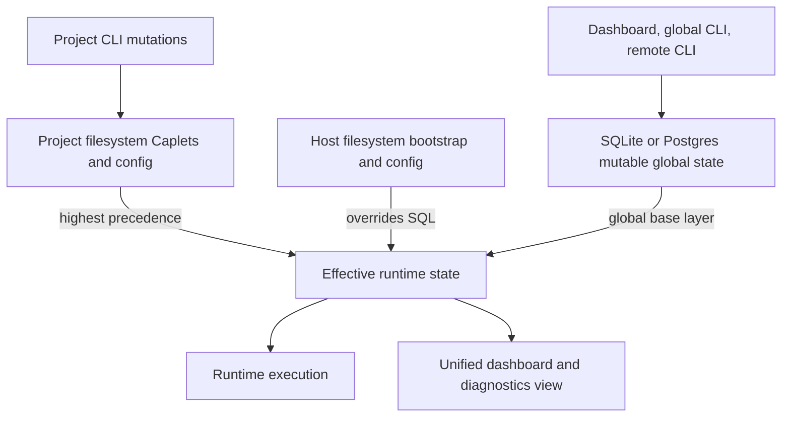
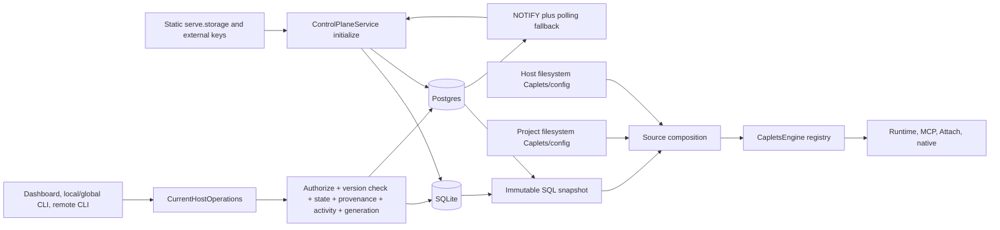
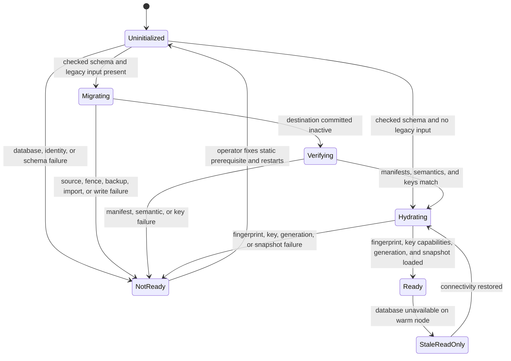

# SQL Storage Backends - Plan

## Goal Capsule

- **Objective:** Add SQLite and Postgres persistence for mutable Caplets control-plane state while preserving filesystem authority and portable Caplet import/export.
- **Product authority:** The confirmed Product Contract below is unchanged; Planning Contract assumptions are implementation bets made by the headless LFG pipeline and must not override an R/F/AE requirement.
- **Execution profile:** Land dependency-ordered units U1-U13, prove each dialect through one shared conformance suite, and finish with the repository `pnpm verify` gate.
- **Stop conditions:** Do not cut over when schema checksums, logical-host identity, filesystem bootstrap fingerprint, legacy-source manifest, external key authority, or source/destination semantic hashes disagree.
- **Tail ownership:** The executor owns implementation, focused verification, cleanup of abandoned approaches, changeset, branch review, PR creation, and CI repair.

---

## Product Contract

### Summary

Caplets will use SQLite by default for a standard single-node installation and Postgres for multiple nodes sharing one logical Current Host.
Filesystem Caplets and configuration remain the authoritative static layer, while SQL stores mutable global control-plane state and project Caplets remain repository files.
Caplet Files and directory bundles become deterministic import/export projections of typed SQL records rather than canonical Markdown blobs stored in the database.

### Problem Frame

Caplets currently persists runtime configuration, global and project Caplet installations, provenance, dashboard sessions, operator activity, credentials, and Vault state in files.
A replaced container cannot retain dashboard or global CLI mutations without external file-state coordination, and multiple service nodes cannot safely share those mutable files.
There is no current SQLite/Postgres control-plane implementation or core SQL migration system.

### Key Decisions

- **Layered authority:** Project filesystem state overrides host filesystem bootstrap state, which overrides SQL-owned global state.
- **Complete control-plane cutover:** Caplet installation state, mutable host configuration, administration state, authentication state, Vault state, and activity move together instead of creating a long-lived mixed persistence model.
- **Backend roles:** SQLite is the zero-configuration single-node default; Postgres is the shared backend for one logical Current Host cluster.
- **Filesystem ownership is immutable through Current Host management:** Dashboard, `--global`, and authenticated `--remote` actions cannot modify an identity or setting owned by the authoritative host filesystem layer; unflagged project CLI may edit project-owned files.
- **Rapid convergence rather than synchronous cluster apply:** A Postgres mutation commits without waiting for every node, and healthy nodes must converge within five seconds.
- **Safe degraded reads:** A warm node may serve its last known-good state during a database outage, but it cannot mutate state and a cold node cannot become ready.
- **Relational Caplet model:** SQL stores typed Caplet, backend, reference, and asset records plus a Markdown body column; Markdown frontmatter is parsed into and generated from that model.
- **SQL toolkit:** Use `drizzle-orm` for runtime access and `drizzle-kit` for schema and migration workflows across SQLite and Postgres.
- **One-host security boundary:** Each SQL Control Plane Store belongs to one logical Current Host; hosted tenancy selects isolated stores outside this storage contract.



| Caplet artifact element       | Canonical SQL representation                             | Export projection                                |
| ----------------------------- | -------------------------------------------------------- | ------------------------------------------------ |
| Common frontmatter            | Typed Caplet columns and related rows                    | Deterministic YAML keys                          |
| Backend configuration         | Backend-kind record plus typed child records             | Backend-specific frontmatter block               |
| Markdown body                 | Markdown body column                                     | Body after frontmatter                           |
| Embedded icon                 | Asset record plus icon reference                         | Relative icon file and frontmatter path          |
| OpenAPI document              | Asset record plus endpoint reference                     | Spec file and `specPath`                         |
| GraphQL schema and operations | Schema/operation asset records plus typed operation rows | Schema/documents and `schemaPath`/`documentPath` |
| Body file link                | Body-reference record targeting an asset                 | Relative Markdown link                           |
| External URL                  | Typed URL field                                          | Same URL without implicit download               |

### Actors

- A1. **Single-node operator:** Runs a standard user or container installation backed by SQLite.
- A2. **Cluster operator:** Runs multiple service nodes against Postgres and deploys one consistent filesystem bootstrap image.
- A3. **Host administrator:** Uses the dashboard or CLI to install Caplets and mutate Current Host control-plane state.
- A4. **Project contributor:** Keeps project Caplets and their provenance in repository filesystem artifacts.
- A5. **Hosted service operator:** Provisions or selects an isolated SQL Control Plane Store for each logical Current Host.

### Requirements

**Storage roles and precedence**

- R1. A standard single-node installation must use SQLite by default without requiring an external database.
- R2. A distributed installation must support Postgres as shared storage for one logical Current Host cluster.
- R3. Effective runtime state must apply precedence in this order: project filesystem sources, host filesystem bootstrap/configuration, then SQL-owned global state.
- R4. The runtime must evaluate filesystem bootstrap/configuration on every startup and supported reload rather than treating it as a one-time seed.
- R5. Dashboard, `--global`, and authenticated `--remote` Current Host mutations that target a host-filesystem-owned identity or setting must be rejected with ownership information; unflagged project CLI mutations may update project-owned files.
- R6. A SQL record shadowed by a filesystem entry must remain stored and automatically become effective when the higher-priority entry disappears.
- R7. The dashboard and diagnostics must show one effective view with each entry's source, ownership, provenance, and shadowed status.

**Mutable control-plane state**

- R8. SQL must own mutable global Caplet bundles, declared bundle inputs, installation provenance, update state, and mutable host configuration.
- R9. SQL must own Current Host clients, credential records, pending approvals, dashboard sessions, Vault values and grants, and Operator Activity Log entries.
- R10. Dashboard operations and CLI operations using `--global` must persist to the local SQL Control Plane Store, while `--remote` mutations must target the selected remote Current Host.
- R11. A project-capable Caplet CLI mutation without a target flag must remain project-first and write project files; `--global` and `--remote` are explicit, exclusive targets. Host-only transfer, recovery, backup, and key-administration commands must reject unless `--global` is explicit.
- R12. Each management mutation must atomically persist its logical state together with required provenance and activity records.
- R13. Concurrent mutations must serialize or return an explicit conflict without silently losing a committed change.
- R14. Database-backed Vault values must retain encryption and reveal/grant boundaries so database access alone does not expose plaintext secrets.
- R15. Daemon logs and large media artifact payloads must remain outside SQL. SQLite uses owner-private host artifact storage by default; Postgres requires one deployment-configured shared object provider reachable by every node, with credentials outside SQL and provider identity bound to the logical host/store.

**Bootstrap and migration lifecycle**

- R16. An existing installation must perform a one-time transactional migration of file-backed runtime/control-plane state, strictly verified global-lockfile-tracked installed Caplets, and their global provenance into the configured SQLite or Postgres backend. Startup performs it automatically only when whole-host/volume writer exclusion is provable; otherwise startup must refuse and the supported one-shot offline command must perform the identical migration after every old replica stops.
- R17. A failed automatic migration must preserve the pre-migration state and must not expose a partially migrated control plane.
- R18. Untracked filesystem Caplets, Caplet configuration, and project lockfiles must remain filesystem-owned; only legacy global Caplets whose paths and bytes match the strict global lockfile manifest migrate automatically, and every other move into SQL requires explicit import.
- R19. Operators must have an offline SQLite-to-Postgres migration with validation, a preserved source backup, and an all-or-nothing destination cutover.
- R20. Storage backend selection and connection settings must come from static deployment configuration rather than mutable SQL state.
- R56. Verified global lockfile Caplets and entries must migrate into SQL as mutable global Caplet state and canonical installation provenance; the legacy files and lockfile become protected recovery data plus fail-closed tombstones only after validated cutover.

**Distributed consistency and availability**

- R21. Every Postgres-backed node classified healthy must observe a committed control-plane mutation within five seconds; a node that has not applied it by the database-time deadline must lose readiness and writer eligibility before it can exceed that window.
- R22. A node whose canonical resolved runtime-affecting bootstrap projection differs from the cluster fingerprint must fail readiness.
- R23. A warm node that loses database access may serve only non-security runtime/configuration reads from its last known-good state and must reject mutations, authentication, administration, approval, role, and Vault authorization decisions until connectivity returns.
- R24. A starting or restarting node without database access must fail readiness rather than serve filesystem-only partial state.
- R25. SQLite and Postgres must provide the same observable control-plane behavior except for documented single-node and distributed operational differences.
- R26. A redacted health summary may expose only backend kind, readiness/connectivity class, migration state, authority/effective token, bootstrap compatibility, stale age, convergence class, and a guidance code without live control-plane authorization; detailed administration diagnostics require live host-administrator authority.
- R57. Postgres rolling upgrades must gate node readiness and write eligibility on an explicit binary/schema/key/manifest compatibility range; incompatible nodes must drain or fail closed before any migration that would make their reads or writes unsafe.

**Caplet portability**

- R27. A SQL-owned Caplet must export as a portable Caplet File or directory bundle that preserves portable runtime-affecting frontmatter, human documentation, catalog presentation metadata, and declared non-secret inputs subject to the host-specific exclusions in R29.
- R28. A valid Caplet File or directory bundle whose canonical portable envelope is at most 256 MiB must import into SQL as mutable global Caplet state after normal validation and filesystem-ownership conflict checks; larger individual artifacts are outside this release's supported portability envelope and reject before staging.
- R29. Export must exclude Vault values, credentials, grants, host-specific paths, and host-specific installation provenance while retaining safe references that identify unresolved setup requirements.
- R30. Import followed by export, and export followed by import, must preserve the Caplet's portable behavior and human-authored content.
- R31. CLI and dashboard import/export operations must produce artifacts usable by project and catalog contribution workflows without requiring access to the source database.
- R32. SQL must be the canonical relational representation of a mutable Caplet rather than a store for its raw Markdown source file.
- R33. Common frontmatter fields must map to typed Caplet columns or related records, while the Markdown body must occupy a dedicated body column.
- R34. Each backend kind must map its frontmatter into typed backend records and child records that preserve the validated runtime model without an opaque Markdown fallback.
- R35. Every embedded binary or text file must map to an asset record containing its owning Caplet, logical relative path, role, media type, content, and content hash.
- R36. Local references in frontmatter or the Markdown body must resolve through asset-reference records while retaining the relative path needed for export.
- R37. A catalog icon must map either to a validated external URL field or to an icon asset reference.
- R38. An OpenAPI endpoint must reference either a spec URL or an OpenAPI asset, while GraphQL schema and operation documents must use typed URL, introspection, operation, or asset references.
- R39. Export must deterministically generate frontmatter, body, and bundle files from relational records without implicitly downloading external URLs.
- R40. Import must reject unsupported or unrepresentable frontmatter fields instead of silently dropping them or retaining an opaque source blob.
- R41. The SQL persistence implementation must use `drizzle-orm` and must manage schema evolution with `drizzle-kit` while preserving one observable storage contract across SQLite and Postgres.
- R42. Export must produce one Markdown file when the Caplet has no local assets and a directory bundle when it does, and both CLI and dashboard results must identify the emitted artifact type and location.

**Security, ownership, and operability**

- R43. SQL data and connection credentials must be treated as security-sensitive through authenticated confidential Postgres transport, owner-restricted SQLite storage, least-privilege service identities, and rotatable credentials kept outside SQL, logs, and exports.
- R44. Reusable authentication material stored in SQL must remain verifier-only or separately encrypted so database reads do not yield usable credentials.
- R45. An Operator Client must be a strict superset of an Access Client, retaining Caplet invocation, MCP, Remote Attach, and Project Binding access while adding Current Host administration authority.
- R46. Dashboard mutations and import/export must require an authorized Operator Client, local global CLI mutations must require host-administrator authority, and remote CLI mutations must require an authenticated Operator Client device.
- R47. Authorization failures must not read, export, stage, or mutate control-plane state.
- R48. Imported artifacts must be treated as untrusted: local references must be canonicalized and confined to the bundle, while absolute paths, traversal, symlinks, embedded secrets, and host-specific references must be rejected.
- R49. Import must preserve source and content-hash provenance, preview the runtime-affecting projection, and require authorized confirmation before activation.
- R50. Import must reject an existing SQL-owned ID by default and provide an explicit audited replacement flow that previews the affected identity and portable/runtime differences.
- R51. An imported Caplet with unresolved setup dependencies must persist in a visible non-runnable setup-required state until remediation and revalidation succeed.
- R52. A shadowed SQL record must remain separately inspectable and targetable, and every mutation must state that effective runtime behavior remains unchanged while the filesystem override exists.
- R53. Dashboard and CLI status must use the availability-independent redacted health summary to label last-known-good state stale/read-only, expose its token/connectivity/convergence class, and show recovery guidance; list/inspect and detailed key/backup data remain live-authority-only.
- R54. Postgres mutation results must identify the committed operation class, aggregate version, and resulting authority/effective token, then distinguish database commit, local application, pending cluster convergence when applicable, and convergence overdue after five seconds.
- R55. Migration backups must preserve encryption and restrictive access, contain no new plaintext secrets, define retention/destruction, invalidate potentially stale authority before rollback readiness, and retain an immutable source host/store/provider/profile/key-version unwrap identity that offline recovery resolves independently of the active destination authority.
- R58. Irreversible host-administrator actions must require a no-side-effect preview and one-time confirmation bound to action, logical-host/store identity, current authority token, affected backup/key versions, expiry, and stated consequences; absent, stale, or mismatched confirmation must change nothing.
- R59. Every database-backed dashboard, local CLI, and remote CLI mutation with an indeterminate outcome must retain its caller-known operation ID plus original target/logical-host/store/operation-namespace/actor binding and look up that target before resubmission. An authoritative same-target `not_committed` result must atomically reserve that operation identity against an in-flight commit; wrong-target, unavailable, stale-namespace, or unproven absence is non-retryable and never authorizes resubmission.

### Key Flows

- F1. **Single-node startup and persistence**
  - **Trigger:** A1 starts a standard installation from a filesystem-configured host or derived container image.
  - **Steps:** The runtime opens or creates SQLite, loads SQL-owned state, applies authoritative host filesystem inputs, and applies any project filesystem inputs.
  - **Outcome:** A dashboard/global CLI mutation survives process restart and container replacement when the SQLite state path is persisted.
  - **Covered by:** R1, R3, R4, R8-R10, R25.
- F2. **Global management mutation**
  - **Trigger:** A3 performs a dashboard operation, a local `--global` CLI mutation, or an authenticated remote `--remote` mutation.
  - **Steps:** The operation authorizes the actor, confirms its target, checks filesystem ownership, atomically commits mutable state with required provenance/activity, advances its aggregate version, and publishes a new effective generation only when the effective snapshot may change.
  - **Outcome:** The operation reports commit and convergence state, remains atomic, and converges across healthy Postgres nodes within five seconds.
  - **Covered by:** R5-R7, R10-R13, R21, R45-R47, R54.
- F3. **Project-scoped install**
  - **Trigger:** A4 runs an unflagged mutating CLI command in project context.
  - **Steps:** The CLI confirms the project target, then writes the project Caplet artifact and project lockfile without creating a SQL-owned record.
  - **Outcome:** The project remains shareable through repository files and overrides global sources in project context.
  - **Covered by:** R3, R11.
- F4. **Existing-install upgrade**
  - **Trigger:** A1 or A2 starts a legacy file-backed installation with SQLite or Postgres configured.
  - **Steps:** Caplets imports runtime/control-plane state and global lockfile provenance transactionally, validates the result, and preserves protected recovery data before completing cutover.
  - **Outcome:** Auth, Project Binding, sessions, approvals, Vault, activity, and global provenance become SQL-owned while filesystem Caplets, configuration files, and project lockfiles remain filesystem-owned.
  - **Covered by:** R16-R18, R43-R47, R55, R56.
- F5. **Postgres node join and outage**
  - **Trigger:** A2 starts a node or an active node loses database access.
  - **Steps:** A joining node validates its resolved bootstrap fingerprint before readiness; a warm disconnected node freezes non-security runtime reads at last-known-good state and fails closed for authorization and administration.
  - **Outcome:** The cluster does not serve conflicting bootstrap projections or honor stale security authority.
  - **Covered by:** R21-R24, R26, R44-R47, R53, R54, R57.
- F6. **Offline backend migration**
  - **Trigger:** A1 moves an existing SQLite installation to Postgres.
  - **Steps:** The operator quiesces writes, migrates and validates all control-plane state, protects the rollback source, then switches the static backend configuration.
  - **Outcome:** Postgres starts with equivalent state, while rollback cannot disclose secrets or reactivate stale authority.
  - **Covered by:** R19, R20, R25, R55.
- F7. **Portable Caplet round-trip**
  - **Trigger:** A3 imports a shared Caplet artifact or exports a SQL-owned Caplet for sharing.
  - **Steps:** Import authorizes the actor, validates the untrusted bundle, previews normalized records, handles collisions/setup requirements, and confirms activation; export deterministically projects authorized records without host secrets or state.
  - **Outcome:** The artifact can move between installations or enter a separate catalog contribution workflow while preserving portable behavior, documentation, embedded assets, and relative references.
  - **Covered by:** R27-R40, R42, R46-R51.
- F8. **CLI target selection**
  - **Trigger:** A3 or A4 invokes a project-capable mutation or a host-only administrative command.
  - **Steps:** A project-capable mutation defaults to project files; `--global` selects local SQL and `--remote` the authenticated remote host. Host-only transfer/recovery/backup/key commands accept only explicit local `--global`.
  - **Outcome:** The command reports one target before and after execution; invalid/no-target host-only invocations reject before work, and remote mutation requires Operator Client authentication.
  - **Covered by:** R10, R11, R45-R47.

### Acceptance Examples

- AE1. **Covers R3, R6, R7.** Given SQL owns Caplet `alpha`, when an image adds a filesystem Caplet with the same ID, then the filesystem version is effective and the SQL version is visible as shadowed; removing the filesystem version makes the SQL version effective again.
- AE2. **Covers R5, R10.** Given a Caplet ID is filesystem-owned, when an administrator tries to update it through the dashboard or global CLI, then the mutation is rejected and identifies the authoritative source.
- AE3. **Covers R11.** Given a project context, when a contributor runs an unflagged mutating CLI command, then its artifact and provenance are written to project files and no SQL record is added.
- AE4. **Covers R16-R18, R56.** Given a legacy installation with lockfile-tracked global installs, untracked filesystem bootstrap Caplets, a global lockfile, project lockfiles, and file-backed runtime state, when automatic migration succeeds, then the verified tracked Caplets/provenance and runtime/control-plane state move into SQL while untracked bootstrap Caplets, configuration files, and project lockfiles remain filesystem-owned.
- AE5. **Covers R21, R22.** Given two Postgres-backed nodes have identical files but resolve an environment-dependent bootstrap value differently, when they join, then the mismatched resolved fingerprint prevents the divergent node from becoming ready.
- AE6. **Covers R23, R24, R44-R47, R53.** Given a running node loses Postgres, then non-security runtime reads use visibly stale last-known-good state while authentication, administration, approvals, roles, and Vault decisions fail closed; a starting node never becomes ready.
- AE7. **Covers R19, R25.** Given writes are quiesced on a SQLite installation, when offline migration to Postgres completes, then Caplets, provenance, configuration, clients, sessions, Vault state, approvals, and activity are equivalent before backend cutover.
- AE8. **Covers R1, R4.** Given a derived image and a persisted SQLite state path, when the container is replaced with a new image, then SQL-owned mutations persist and the new image's filesystem inputs remain authoritative.
- AE9. **Covers R27-R31.** Given a SQL-owned Caplet with frontmatter, README body, catalog icon metadata, and declared non-secret bundle files, when it is exported and imported into a clean SQL backend, then the resulting Caplet has equivalent portable behavior and content.
- AE10. **Covers R29.** Given a SQL-owned Caplet uses Vault-backed setup, when it is exported, then no Vault value, credential, grant, or host path appears in the artifact and the portable configuration still communicates the unresolved setup requirement.
- AE11. **Covers R5, R28.** Given an imported Caplet's ID is already owned by the filesystem layer, when import is attempted, then the operation is rejected rather than creating an immediately shadowed SQL record.
- AE12. **Covers R35-R37, R39.** Given a Caplet uses `catalog.icon: ./assets/icon.svg`, when imported, then SQL stores the SVG as an icon asset and the icon field as its relation; export recreates the relative file and frontmatter path.
- AE13. **Covers R35, R36, R38, R39.** Given an OpenAPI Caplet uses `specPath: ./spec/openapi.yaml`, when imported and exported, then the endpoint references an OpenAPI asset and the same spec bytes are emitted at a valid relative path.
- AE14. **Covers R35, R36, R38, R39.** Given a GraphQL Caplet has a schema file and operation document files, when imported, then SQL stores typed operations with schema/document asset relations and export recreates their `schemaPath` and `documentPath` references.
- AE15. **Covers R36-R39.** Given a body links to a local image and frontmatter uses an external icon URL, when exported, then the body link resolves to an emitted image asset while the external URL remains a URL and is not vendored implicitly.
- AE16. **Covers R10, R11, R46.** Given a project checkout, when a contributor runs an unflagged install, then it targets project files; `--global` targets local SQL, and `--remote` targets the selected remote host only after Operator Client device authentication.
- AE17. **Covers R45.** Given a device has the Operator Client role, when it invokes a Caplet or uses Project Binding, then access succeeds under the same runtime capabilities as an Access Client; the same device may also administer the Current Host.
- AE18. **Covers R48-R51.** Given an imported bundle contains a traversal path, symlink, embedded secret, or host-specific file reference, then import rejects it; given only unresolved setup references remain, import persists a non-runnable setup-required record.
- AE19. **Covers R50.** Given an imported ID already exists in SQL, then import rejects by default and replacement requires an authorized preview and confirmation recorded in Operator Activity.
- AE20. **Covers R52.** Given a filesystem Caplet shadows a SQL record, then the dashboard and CLI can inspect or mutate the dormant SQL record only through an explicitly identified underlying-record action.
- AE21. **Covers R57.** Given old and new Postgres nodes during a rolling upgrade, when the target schema/key/manifest version leaves the old node's declared compatibility range, then that node drains or becomes not-ready before migration activation and cannot read, write, or serve stale authority.
- AE22. **Covers R3, R22.** Given a Postgres cluster on one filesystem bootstrap projection and a validated next image with a different projection, when the host administrator stages the next fingerprint, then new-image nodes remain not-ready until old nodes drain and explicit activation publishes a newer authority generation; abort preserves the old projection and unstaged or mismatched nodes never serve.
- AE23. **Covers R51.** Given an imported Caplet is setup-required, when the operator follows its typed dependency actions, supplies an authorized Vault grant or other required host setup, and revalidates against the current record/token, then it becomes runnable or returns an updated bounded dependency list without partial activation.
- AE24. **Covers R54, R59.** Given a mutation commits but its response is lost, dashboard reload or CLI lookup against the retained original target/binding returns the receipt without duplicate state/activity; if lookup serializes first, its `not_committed` result durably reserves that identity so the paused mutation cannot commit; wrong-store, stale-namespace, and unproven lookups remain non-retryable.
- AE25. **Covers R58.** Given finalize, backup destruction, or key retirement was previewed, when the authority token or affected inventory changes before confirmation, then the stale token rejects and no irreversible state changes.

### Success Criteria

- A standard local install starts with SQLite without external database setup.
- A derived container image can supply static Caplets/configuration while dashboard, global CLI, and authenticated remote CLI mutations survive replacement through persisted SQLite state.
- Two or more Postgres-backed nodes converge on committed control-plane state within five seconds and reject mismatched bootstrap images.
- Automatic legacy migration preserves runtime/control-plane state, moves global lockfile provenance into SQL, and leaves filesystem Caplets, configuration, and project lockfiles under filesystem authority.
- Offline SQLite-to-Postgres migration produces behaviorally equivalent state and retains a rollback source.
- After cutover, SQL-owned control-plane operations no longer depend on mutable shared filesystem files.
- A SQL-owned Caplet can round-trip through a portable Caplet File or bundle without losing portable behavior or leaking host-owned secrets and state.
- SQL-to-Caplet export deterministically reconstructs typed frontmatter, Markdown body content, embedded icons, API specifications, GraphQL documents, and relative references without storing the original Markdown file as the canonical record.
- SQL storage, migrations, and portability operations preserve existing role boundaries, make Operator Client a superset of Access Client, and fail closed when authoritative security state is unavailable.
- Every mutation target, degraded state, and Postgres convergence state is visible and unambiguous to operators.

### Scope Boundaries

- Project Caplets and project lockfiles remain filesystem-backed.
- Postgres provides shared storage for one logical Current Host, not multi-tenant workspace isolation.
- Hosted services must isolate the SQL Control Plane Store for each logical Current Host; customer/workspace routing remains outside this storage layer.
- Offline SQLite-to-Postgres transfer is included; online/dual-write migration and Postgres-to-SQLite transfer are not.
- Daemon logs and large media artifact payloads are not stored in SQL.
- Filesystem-authored Caplets/configuration are not editable through dashboard, `--global`, or authenticated `--remote` Current Host actions; unflagged project CLI remains allowed to modify project-owned files.
- Cross-region active-active conflict resolution is not included beyond the five-second convergence contract for one cluster.
- Direct catalog publishing and whole-database export through the Caplet File format are not included; import/export produces or consumes individual portable Caplet artifacts.
- Individual portable import/export artifacts are limited to 256 MiB of canonical envelope bytes across dashboard, local CLI, and remote CLI; this matches the maximum supported aggregate snapshot envelope and does not imply that transport parts or SQL rows hold the artifact contiguously.

### Dependencies and Assumptions

- SQLite container deployments provide a persistent writable state path for the database file.
- Postgres deployments provide a supported database and stable connectivity from every service node.
- Cluster nodes deploy equivalent authoritative filesystem content and resolve equivalent runtime-affecting bootstrap inputs; the runtime derives a deterministic fingerprint from the canonical resolved projection.
- Every online node and offline maintenance process uses the built-in `file-v1` provider profile in the first release: one versioned no-follow manifest maps each exact purpose/operation to a file-backed key reference and allowed capability, binds every entry to logical-host/store identity, and rejects undeclared providers, algorithms, versions, purposes, or cross-purpose use before readiness. The profile uses owner/service-only regular files with atomic rotation; AES-256-GCM keys encrypt/decrypt active records, distinct HMAC-SHA-256 keys verify credentials and attest bootstrap, node/store canaries, and external recovery checkpoints, an RSA-OAEP-256 public key wraps new backup data keys, and the separately held matching private key is available only to authorized offline recovery. Production Postgres still keeps plaintext root key material outside SQL.
- Existing last-known-good reload behavior remains the basis for warm read-only continuity.
- The implementation adopts `drizzle-orm`, `drizzle-kit`, and `@aws-sdk/client-s3` as new direct core dependencies; planning must pin compatible exact versions and identify any correctness-critical operations that require dialect-specific SQL or provider-specific conditional requests.
- The supported snapshot/convergence envelope is an immutable fixture: at most 2,000 effective Caplets, 100,000 normalized relation/asset/reference rows, 256 MiB encoded snapshot bytes, 100 management writes/second for 10 seconds, and 16 nodes. Dedicated CI Postgres runs 10 warm-ups plus 100 measured samples in each of three runs; nearest-rank p99 must be at most 1.5 seconds for full snapshot load and at most five seconds from commit to every healthy node applying the ordered token, with all three runs passing. Crossing a hard cap fails the write with a capacity error rather than silently weakening the SLO.
- The release-blocking package matrix is explicit: Node 22 and 24 on Ubuntu glibc x64/arm64, macOS x64/arm64, and Windows x64; the repository-pinned Bun stable version on Ubuntu glibc x64 and macOS arm64; and the Debian-based Docker image on Linux x64/arm64. U2 records the exact runner/image/runtime versions in the checked-in matrix; musl/Alpine, Windows arm64, Bun on Windows, and 32-bit targets are unsupported until a later matrix admits them.
- Postgres artifact transport requires a shared S3-compatible provider and bucket/prefix reachable from every node; its credentials and endpoint remain deployment-owned static configuration. SQLite keeps the owner-private filesystem artifact provider.

### Planning Resolutions

- Legacy migration classifies only strict global-lockfile-manifested paths with matching bytes as mutable installed Caplets; it seals and migrates those records/provenance, leaves all untracked bootstrap and project files untouched, and hard-stops on missing, modified, ambiguous, or escaping manifest entries.
- Postgres convergence uses constant-channel notifications only as wake hints plus one-second polling of the ordered `(authorityGeneration, effectiveGeneration)` token; U5's 16-node maximum-envelope benchmark must leave headroom under five seconds.
- External cryptographic authority is capability-scoped by process: online nodes receive separate active-record and Vault-record encrypt-decrypt, credential-verifier compute/verify, bootstrap-attestation, and node-canary operations only; backup creation receives recovery wrap-only; offline local recovery receives recovery unwrap/retire plus recovery-checkpoint authenticate/verify; and an offline U12 transfer principal receives transfer-ID-bound source `active-record`/`vault-record` decrypt-only plus destination `active-record`/`vault-record` encrypt-only, with no key export, credential verification/issuance, checkpoint authentication, recovery unwrap, retirement, or runtime capability.
- Bootstrap identity uses the canonical resolved host-filesystem runtime projection, including normalized paths/platform effects and non-secret interpolation, plus hidden purpose-keyed HMAC commitments or provider-issued immutable versions for runtime-affecting secret inputs. Database authentication secrets may differ per node only after verified TLS peer and SQL store identity agree. SQL/project state, raw secrets, and commitments never appear in diagnostics.
- Recovery uses U7's versioned streaming AEAD envelope with authenticated host/store/schema/generation/epoch/manifest/chunk ordering and one separately erasable wrapped data key per backup.
- Portable Caplet export follows U3's normalized model, deterministic YAML ordering/newlines, NFC relative paths, stable collision-safe allocation, and single-file-versus-directory rules.
- Portable projection is a positive allowlist of runtime Caplet fields, human body/catalog metadata, declared non-secret inputs, and bundle-relative assets/references; host paths, grants, credentials, and host installation state remain SQL-only.
- Backend-specific finite fields and repeated structures use typed tables/child rows; only genuinely extensible schema-validated maps use typed key/value rows.
- U3's differential repository/catalog corpus and generated boundary fixtures are the pre-schema completeness gate for every serialization and table-boundary decision.

### Sources and Research

- `packages/core/src/config.ts:1753-1786,3029-3055` — current global/project load order and source shadowing.
- `packages/core/src/config/paths.ts:59-84,185-220` — current global and project filesystem paths.
- `packages/core/src/cli.ts:3000-3023,3114-3171` — global/project install and update target selection.
- `packages/core/src/cli/install.ts:1506-1537,2219-2240` — current artifact materialization and provenance writes.
- `packages/core/src/current-host/catalog-operations.ts:82-201` — dashboard reuse of global install/update flows.
- `packages/core/src/dashboard/session-store.ts:22-36,132-175` and `packages/core/src/dashboard/activity-log.ts:65-136` — current file-backed dashboard state.
- `packages/core/src/remote/server-credential-store.ts:175-195,720-768` — current file-backed host credentials, clients, and pending logins.
- `packages/core/src/vault/index.ts:50-99,150-245` — current encrypted file-backed Vault values and grants.
- `packages/core/package.json:98-141` — current core dependency surface has no SQL client, ORM, or migration dependency.
- `docs/architecture.md:9-29,113-123,157-161` — source authority, runtime reload, remote behavior, and self-hosting model.
- `CONCEPTS.md:11-21,61-95,265-293` — Caplet File authority, SQL portability, storage layering, lockfile provenance, shadowing, credential authority, and Operator Activity Log vocabulary.

---

## Planning Contract

### Product Contract Preservation

Product Contract unchanged. The implementation decisions below mechanize R1-R59 without changing the reviewed source-precedence, scope, security, portability, migration, confirmation, operation-recovery, or convergence behavior.

### Assumptions

These are unvalidated implementation bets made because LFG runs planning without an interactive scoping checkpoint:

- Static Current Host storage configuration will live under `serve.storage`. No configuration selects SQL from SQL-owned state.
- Omitted storage configuration means SQLite at the existing owner-private Caplets state root. Postgres configuration supplies a stable `logicalHostId`, separate external runtime/migrator/maintenance credential references and verified-TLS policy, and only exposes elevated credentials to the designated process/operation.
- Vault encryption, credential-verifier, bootstrap-attestation, and recovery-bundle keys are separate external purposes with versioned IDs and enforced process capability profiles. SQLite may create owner-private key files; Postgres uses shared purpose/version authority, but online nodes never receive recovery unwrap/retire capability and backup writers receive wrap-only authority.
- Automatic startup migration requires whole-host/volume exclusion of old services/CLIs, verified absence of open legacy handles, atomic relocation into an owner-private sealed snapshot, and pre-capture tombstones. When the platform cannot prove that scope, startup hard-stops and directs the operator to the identical one-shot offline migrator after all replicas stop. Postgres additionally uses one designated migrator while every other node waits not-ready.
- Postgres supports at most 16 ready nodes per logical host in this release; readiness refuses the seventeenth until a larger fan-out has its own benchmarked envelope.
- Dashboard directory-bundle transport uses a bounded ZIP envelope while the portable artifact remains a Caplet directory bundle. CLI import/export uses filesystem paths; remote CLI surfaces use binary-safe artifact references or envelopes, never server-local paths.
- New online storage administration stays on dashboard and CLI surfaces. Destructive recovery, key retirement, and backend cutover are local `--global` host-administrator CLI operations only. Existing MCP, Remote Attach, Project Binding, OpenCode, and Pi invocation access remains unchanged; live agent administration is deferred.

### Key Technical Decisions

- **Paired physical schemas:** Define separate SQLite and Postgres Drizzle schema modules and generated migration streams. They share one domain contract, identifiers, constraints, and canonical codecs; they do not pretend that `sqliteTable` and `pgTable` or their generated SQL are interchangeable.
- **Checked migrations only:** Commit both dialects' generated SQL and `meta/_journal.json`, copy them into `dist`, verify migration checksums before readiness, and never run `drizzle-kit push` in production. SQLite migrations run under an exclusive process/write lock; Postgres migrations run under a constant advisory lock before the runtime pool is opened.
- **Async shell around a synchronous snapshot:** Keep `CapletsEngine` synchronous only over a preinitialized immutable snapshot. Replace public/runtime construction paths that select storage with awaited factories, migrate every local/serve/cloud/native/remote-control callsite, and remove the old synchronous storage-selecting entry point in the same cutover. Reload first refreshes SQL, then composes SQL, host filesystem, and project filesystem sources.
- **One domain store:** A dialect-neutral `ControlPlaneStore` owns store/schema identity, domain aggregates, security/provenance/activity, cluster-node registrations and writer fences, monotonic operation/lifecycle/migration/recovery ledgers, versions, authority/effective/security epochs, and transaction boundaries. Callers never receive dialect handles.
- **Operation-class transactions:** Every mutation allocates an operation ID. Management/effective writes atomically persist state, provenance, activity, receipt, aggregate check, and active writer-fence predicate; replay returns the receipt. Security writes use aggregate/security epochs. Heartbeat, expiry, retention, migration, and recovery use dedicated ledgers. Unknown outcomes resolve only against the original host/store/actor binding. Confirmation consumption atomically creates a monotonic intent; external erasure phases resume idempotently to a terminal receipt rather than pretending filesystem/KMS effects share the SQL transaction.
- **Typed relational Caplets:** Mirror U3's validated portable/`CapletConfig` contract with a base Caplet row, one typed backend row, typed repeating child rows, assets, references, declared inputs, status, and provenance. Use columns for finite fields and typed key/value child rows only for genuinely extensible validated maps; never retain an opaque source blob.
- **Canonical models before schemas and surfaces:** U3 freezes every SQL-owned domain, authority relation, legacy-field policy, portable Caplet projection, deterministic codec, and relational checklist through exhaustive positive/negative corpus gates before U4 generates physical schemas.
- **Dialect-neutral transfer encoding:** Canonically encode timestamps, booleans, JSON values, hashes, bytes, IDs, and row order in application code. SQLite uses text JSON and BLOB; Postgres uses JSONB and an audited `bytea` custom type, but semantic manifests must match byte-for-byte across dialects.
- **Layered authority in one resolver:** Extend `loadConfigWithSources()` and its source/shadow metadata so SQL is the global base, host filesystem overrides it, and project filesystem remains highest. Keep shadowed SQL aggregates separately; do not reconstruct dormant rows from flattened runtime config.
- **Cluster convergence with hard fencing:** Effective/authority commits emit constant-channel wake-ups carrying store ID and ordered authority/effective token; one-second polling is authoritative. Database-time commit deadlines, applied-token heartbeats, and writer leases make a node not-ready/non-writable before five seconds if it has not applied. Every mutation's final predicate includes the active writer fence, and authority activation revokes the old fence then drains/terminates its transactions before publishing the next. U5/U8 measure the maximum envelope; failure selects tuple-indexed incremental materialization before U10.
- **Frozen degraded snapshot plus redacted status:** A warm outage freezes one validated snapshot; filesystem changes never combine with stale SQL. Only non-security runtime reads may use it. Security/auth/Project Binding/Attach/Vault/record/admin paths fail unavailable. A non-authorizing redacted health route exposes only R26 fields so dashboard shell and CLI status work during outage; all list/inspect/detailed diagnostics still require live authority.
- **Role lattice and reauthorization:** One `roleAllows(actual, required)` helper makes Operator satisfy Access and Operator while Access satisfies only Access. Administrative transactions reload client role, revocation, host binding, expiry, and security epoch from SQL instead of trusting middleware/session snapshots.
- **Local host-administrator trust root:** A versioned owner-restricted authority descriptor in the Caplets state root binds logical-host/store identity to the owning OS account/service identity. POSIX owner/mode and Windows owner/DACL checks occur before parsing the non-secret binding or resolving database/key credentials; the matching owner/service identity (and platform administrator, which can already seize the host) may derive the local principal. A provably fresh state root may atomically create one unpinned descriptor before secret resolution; thereafter missing, insecure, mismatched, foreign-owned, or ambiguously preexisting state fails before target access.
- **Pinned storage stack with exit gate:** Tentatively use `drizzle-orm@0.45.3`, `drizzle-kit@0.31.10`, `better-sqlite3@12.11.2`, `pg@8.22.0`, and `@aws-sdk/client-s3@3.1087.0`. Before generating migration history, U2 must prove representative schema generation, checked migration/rollback, dialect-specific locks and transactions, custom bytes, S3-compatible conditional/range/delete behavior, prepared-package loading on Node/Bun, and the declared snapshot/write/fan-out fixture through both dialects; failure reopens this decision. Native drivers stay external to the Rolldown bundle. Generated dialect SQL and `meta/_journal.json` are committed, checksummed, packaged into `dist`, and verified before apply. Postgres migration uses one database-time advisory lock; SQLite uses one exclusive process/write lock and transaction around a fixed schema/search path with parameterized queries. Schema/key/manifest/provider incompatibility blocks activation; rollback is allowed only within the advertised compatibility window with verified backup and old-node drain.
- **Concrete `file-v1` key/capability profile:** `serve.storage.keyProviderManifest` points to a versioned owner/service-only regular JSON manifest opened no-follow and parsed before any referenced secret. Each entry contains `keyId`, algorithm/version, logical-host/store binding, exact purpose (`active-record`, `vault-record`, `credential-verifier`, `bootstrap-attestation`, `node-canary`, `backup-wrap`, `backup-recovery`, `recovery-checkpoint`, or `transfer`), exact operations, and a file reference; duplicate bindings and undeclared algorithms/purposes reject. Active-record and Vault-record use separate 32-byte AES-256-GCM keys; credential-verifier, attestation, canary, and checkpoint purposes use distinct 32-byte HMAC-SHA-256 keys; backup creation sees only an RSA-OAEP-256 public wrapping key; and offline recovery alone sees its matching private key plus checkpoint HMAC capability. The online profile may compute and verify credential HMACs: new verifiers use only the active version, old versions remain verify-only during bounded rotation overlap, and a version cannot retire while a live verifier references it. Online, backup-writer, offline-recovery, transfer-source, and transfer-destination processes receive disjoint generated manifests: transfer can decrypt/re-encrypt only transfer-bound active/Vault ciphertext under separate purposes and can never verify credentials, unwrap recovery bundles, or authenticate recovery checkpoints. U2 owns provider adapters, manifest/capability validation, rotation semantics, and same-store/same-purpose canary tests; U6 owns verifier/reference lifecycle policy. No provider is inferred from ambient cloud identity in this release.
- **Strict migration state machines:** Automatic file migration and offline transfer use immutable fenced sources, inactive generations, verified chunks, protected backups, pre-activation security invalidation on restore, explicit activation, and authorized retention/finalization/destruction. No dual-write or all-rows-in-one-transaction assumption exists.
- **Surface boundary:** `CurrentHostOperations` is the semantic boundary for dashboard HTTP, local/global CLI, and authenticated remote CLI online operations. Dashboard may run online Caplet/client/Vault operations and read redacted storage/key/backup status; remote CLI may run the same online operations/status. Only local `--global` host-administrator CLI may execute key rotation/retirement, backup restore/finalization/destruction, or backend transfer. MCP/Attach/native administration remains out of scope.
- **Deterministic store and performance fixtures:** U2 creates reusable dual-dialect fixtures for the exact store identity/key manifest, all canonical SQL types needed by U3, and the immutable 2,000-Caplet/100,000-row/256-MiB/100-writes-per-second/16-node envelope. Benchmark methodology is fixed to dedicated CI Postgres, database timestamps, 10 warm-ups, 100 nearest-rank samples per run, three independent runs, and all-run pass/fail output; U5/U8/U10 consume the same fixture rather than inventing narrower workloads.

### High-Level Technical Design





### Logical Data Model

- `control_plane_operations` keys idempotency and commit lookup by `(logical_host, store, operation_namespace, authenticated_actor, operation_id)`, retains the original safe receipt plus `reserved`/`committed`/`not_committed`/`superseded_by_restore` effect status, and preserves consumed-ID tombstones across restore; operation lookup atomically reserves absence in the same transaction that returns `not_committed`, so the original request can no longer commit after authoritative absence is reported.
- `cluster_nodes` and `writer_leases` record node identity, database-time heartbeat/expiry, applied authority/effective token, schema/key/manifest/fingerprint capabilities, readiness, and monotonically fenced write eligibility; convergence samples retain commit/apply timestamps.
- `caplets`, `caplet_backends`, backend-kind tables, repeating child tables, `caplet_assets`, `caplet_asset_references`, `caplet_declared_inputs`, and `caplet_status` hold one relational Caplet aggregate.
- `host_settings` stores only `telemetry`, `options.*`, and `namespaceAliases` fields accepted by `MutableHostSettingSchema`, with per-setting provenance, ownership, aggregate version, and dormant/effective projection; deployment/serve/backend/project fields are structurally unrepresentable.
- `installation_provenance` references a logical Caplet identity plus ownership source; legacy global-lock provenance does not require a SQL Caplet foreign key.
- `remote_clients`, credential families/verifiers, pairing and pending-login records, dashboard sessions, OAuth/auth records, Project Binding host metadata/leases, `vault_values`, and `vault_grants` hold security-sensitive state.
- `operator_activity` is append-only to the runtime role. Configured retention runs through a bounded maintenance privilege and leaves a non-sensitive purge receipt.
- `data_migrations`, mapping manifests, transfer generations, operation outcomes/consumed-ID tombstones, retained-bundle inventory, retention/purge watermarks, destruction intents/phases/receipts, finalization, and key-retirement state make retry/recovery durable; these ledgers merge monotonically and are never replaced by restored rows.
- `operation_namespace` is immutable for a store epoch. Normal restore retains it; catastrophic recovery creates a new store ID and namespace, and lookups against an earlier namespace return `stale_namespace`, never `not_committed`.
- Each mutable aggregate has an optimistic version. Only effective-snapshot changes advance effective generation within the current authority generation; restore/cutover activates a strictly newer authority generation, security changes advance security epoch or their aggregate version, and maintenance/migration/recovery state advances dedicated monotonic ledgers.

### Output Structure

```text
packages/core/
├── drizzle/
│   ├── sqlite/
│   └── postgres/
├── drizzle.sqlite.config.ts
├── drizzle.postgres.config.ts
├── scripts/
│   └── copy-control-plane-migrations.mjs
└── src/control-plane/
    ├── config.ts
    ├── types.ts
    ├── errors.ts
    ├── service.ts
    ├── snapshot.ts
    ├── store.ts
    ├── authorization.ts
    ├── health.ts
    ├── schema/
    │   ├── sqlite.ts
    │   └── postgres.ts
    ├── dialect/
    │   ├── sqlite.ts
    │   ├── postgres.ts
    │   └── migrations.ts
    ├── caplets/
    │   ├── model.ts
    │   ├── import.ts
    │   ├── export.ts
    │   └── artifacts.ts
    └── migration/
        ├── legacy.ts
        ├── manifest.ts
        ├── backup.ts
        ├── transfer.ts
        └── restore.ts
```

The per-unit file lists are authoritative; implementation may refine this tree without changing module ownership.

### System-Wide Impact

- **Runtime lifecycle:** Every local, serve, cloud, native, and remote-control composition path must await storage initialization before constructing an engine/runtime. The public storage-selecting constructor becomes an async factory; cold startup has no filesystem-only fallback.
- **Configuration:** `packages/core/src/config.ts` remains the schema authority. Schema generation and public docs must describe static storage selection without exposing connection values.
- **Authorization:** Role semantics change from disjoint equality to a hierarchy, superseding the disjoint-role portion of ADR-0003. Operator sessions retain existing Access capabilities.
- **Data lifecycle:** File-backed security/control-plane adapters become strict legacy readers after validated cutover. Project files, filesystem bootstrap/config, media artifacts, logs, and attach/session heap remain outside SQL.
- **Surface boundary:** Dashboard, local/global CLI, and remote CLI share Current Host proposals, receipts, status, and artifacts. Existing MCP/Attach/native invocation behavior is regression-tested but gains no new storage-administration tools in this feature.
- **Packaging:** Native database drivers and checked migration assets must work from the published `@caplets/core` package, not only the monorepo.
- **Operations:** Readiness must distinguish live, stale/read-only, migration-blocked, identity/fingerprint mismatch, key unavailable, and convergence overdue. Diagnostics must redact endpoint credentials, bind values, source paths, and payloads.

### Risks and Dependencies

- `better-sqlite3` is native and may fall back to `node-gyp`. The release-blocking matrix is Node 22/24 on Linux glibc x64/arm64, macOS x64/arm64, and Windows x64; Bun stable on Linux glibc x64 and macOS arm64; and the Debian-based Docker image on Linux x64/arm64. musl/Alpine, Windows arm64, and 32-bit platforms are unsupported for this release.
- Drizzle's stable 0.45/0.31 line coexists with a v1 release-candidate train. Keep the researched versions pinned together only if the U2 exit gate passes; a v1 upgrade is separate work.
- Runtime Drizzle migrations are transactional per dialect but do not provide a Postgres cluster lock or migration-hash enforcement. Caplets must supply both.
- SQLite table-rebuild migrations require an exclusive window and fresh verified backup. Postgres concurrent indexes require an explicit operational migration outside the transactional runtime migrator.
- A rolling first legacy cutover is unsafe because current file writers do not share one lock. Require deployment-enforced exclusion of pre-upgrade writers, an immutable/read-only source, final under-fence manifest verification, and a designated migrator; never dual-write.
- Source parsers currently tolerate malformed OAuth, activity, session, and role records. Migration must use strict parsers and quarantine malformed non-authoritative activity instead of silently dropping state.
- Database access alone must not enable offline guessing of short codes or expose reusable authority. Credential-verifier and encryption keys are deployment prerequisites, not database rows.
- Cross-dialect transfer stages bounded manifest-verified chunks into an inactive generation and atomically activates only the validated pointer. Capacity preflight still fails before staging when configured limits, WAL, temporary disk, or transaction headroom are insufficient.

---

## Implementation Units

| Unit | Title                                                 | Primary files                                                    | Depends on     |
| ---- | ----------------------------------------------------- | ---------------------------------------------------------------- | -------------- |
| U1   | Role, local authority, target/result contracts        | `current-host/authority.ts`, `serve/http.ts`, `cli.ts`           | —              |
| U2   | Static storage config and SQL-stack exit gate         | `config.ts`, generated schemas/docs, `package.json`, spike tests | U1             |
| U3   | Complete control-plane models and corpus gates        | `control-plane/model/`, portable codec, legacy fixtures          | U2             |
| U4   | Paired schemas and dialect adapters                   | `control-plane/schema/`, `control-plane/dialect/`, `drizzle/`    | U3             |
| U5   | Transactional store and snapshot envelope             | `control-plane/store.ts`, `service.ts`, `types.ts`, benchmarks   | U4             |
| U6   | Injected security repositories and key primitives     | `remote/`, `dashboard/`, `vault/`, `auth/`                       | U5             |
| U7   | Internal startup, legacy migration, and recovery      | `control-plane/migration/`, `service.ts`, legacy readers         | U6             |
| U8   | Internal layered async runtime composition            | `runtime.ts`, `engine.ts`, `control-plane/snapshot.ts`           | U7             |
| U9   | Internal Current Host SQL management                  | `current-host/`, `cli.ts`, `remote-control/`, dashboard slice    | U1, U5-U8      |
| U10  | Atomic SQL activation, convergence, and degraded mode | public consumers, `control-plane/health.ts`, `engine.ts`         | U8, U9         |
| U11  | Portable dashboard/CLI operations                     | import/export, dashboard, CLI, remote-control adapters           | U5, U9, U10    |
| U12  | Offline backend transfer and secure recovery          | transfer, key conversion, descriptor, backup/restore             | U1, U4-U8, U10 |
| U13  | Dashboard, operations, packaging, and rollout         | dashboard app, docs, CI, changeset                               | U9-U12         |

### U1. Establish role, local authority, target, and receipt contracts

- **Goal:** Correct Operator-as-Access behavior and define one target/error/receipt vocabulary plus the local host-administrator trust root before SQL-backed surfaces depend on them.
- **Requirements:** R10-R13, R45-R47, R58-R59; F2, F8; AE3, AE16, AE17, AE24, AE25.
- **Dependencies:** None.
- **Files:** `packages/core/src/remote/server-credentials.ts`, `packages/core/src/remote/server-credential-store.ts`, `packages/core/src/serve/http.ts`, `packages/core/src/cli.ts`, `packages/core/src/current-host/operations.ts`, `packages/core/src/current-host/authority.ts`, `packages/core/src/errors.ts`, `packages/core/test/remote-pairing.test.ts`, `packages/core/test/serve-http.test.ts`, `packages/core/test/cli.test.ts`, `packages/core/test/current-host-administration.test.ts`, `packages/core/test/current-host-authority.test.ts`.
- **Approach:** Add `roleAllows()` and replace Access-route equality checks while keeping exact Operator-only administration/session issuance. Collapse mutating CLI target parsing into one project/global/remote result that rejects every flag combination before work and reports the same target after execution. Require every mutation transport to allocate a caller-known operation/idempotency ID before dispatch; bind it to logical host, store, operation namespace, authenticated actor, and request identity; receipts return it, and an indeterminate response permits lookup-only under that ID. Define safe outcomes for ownership, conflict, unavailable, indeterminate commit, operation class, aggregate version, authority/effective token, local application, convergence, an effect superseded by restore, and `stale_namespace`. Define an operation lookup state (`committed`, `not_committed`, `unknown`, `stale_namespace`) that can only query its original authenticated target; returning `not_committed` must atomically reserve/tombstone that identity so an in-flight original cannot later commit, after which resubmission allocates a new caller-known ID. Add an irreversible-action preview/confirmation token bound to action, logical-host/store/operation namespace, current authority token, affected backups/key versions, consequences, expiry, and one-time use. Define a versioned no-follow authority descriptor union (`unbound`, `bound`, `transfer-pending`) plus owner-authorized compare-and-swap transitions. Validate binding and platform ownership before secrets, but do not require a descriptor from existing non-SQL entrypoints until U2.
- **Patterns to follow:** Existing `CurrentHostOperation`/`CurrentHostOperationOutcome` unions and `toCurrentHostSafeError()` redaction.
- **Test scenarios:**
  - Covers AE17. An Operator can invoke MCP, Remote Attach, and Project Binding routes that require Access; Access cannot invoke administration.
  - Covers AE3 / AE16. No flag selects project, `--global` selects local Current Host, `--remote` selects the authenticated host, and every multi-target combination rejects before work.
  - A credential-store outage returns service unavailable rather than invalid credentials and does not trigger credential deletion.
  - Dashboard, local/global CLI, and remote CLI allocate an operation ID before transport; after a dropped response they perform lookup-only with that original ID. A `committed` receipt is returned without redispatch, `unknown`/unavailable remains non-retryable, and only a durably reserved `not_committed` result permits one resubmission under a new caller-known ID; no path can create duplicate state or activity.
  - A lookup racing a paused first dispatch can return `committed` or atomically reserve `not_committed`; after the latter, the paused dispatch cannot commit. Normal restore preserves lookup results, while catastrophic store replacement returns `stale_namespace`.
  - Descriptor parsing/transition tests reject insecure, foreign-owned, mismatched, malformed, or illegal transfer states; absence preserves existing non-SQL administration in U1, while U2's SQL-required resolver atomically creates an unpinned descriptor only for a provably fresh state root and otherwise rejects absence before database/key credential resolution.
- **Verification:** Existing runtime/admin behavior stays intact, role hierarchy is enforced from one helper, target/result contracts are unambiguous, and platform authority tests prove local trust before secrets or SQL access.

### U2. Add static storage configuration and prove the pinned SQL stack

- **Goal:** Resolve a safe zero-config SQLite store or an explicit Postgres store entirely from deployment-owned configuration, and falsify the tentative ORM/driver choice before migration history exists.
- **Requirements:** R1, R2, R15, R20, R41, R43, R55, R57; F1, F5.
- **Dependencies:** U1.
- **Files:** `packages/core/src/config.ts`, `packages/core/src/config-runtime.ts`, `packages/core/src/config/paths.ts`, `packages/core/src/control-plane/key-provider/file-v1.ts`, `packages/core/src/control-plane/key-provider/manifest.ts`, `packages/core/src/control-plane/artifacts/provider.ts`, `packages/core/src/control-plane/artifacts/filesystem.ts`, `packages/core/src/control-plane/artifacts/s3.ts`, `packages/core/src/control-plane/benchmarks/fixture.ts`, `scripts/storage-stack-check.mjs`, `scripts/storage-package-check.mjs`, `packages/core/package.json`, generated JSON schemas and derived docs, `packages/core/rolldown.config.ts`, `package.json`, `pnpm-lock.yaml`, dual-dialect schema/lock/transaction/bytes/packaging and benchmark spike fixtures/tests, `.github/workflows/ci.yml`.
- **Approach:** Add strict `serve.storage` configuration with SQLite default path; Postgres logical-host identity, connection-string environment reference, verified TLS policy, migration designation, `file-v1` manifest reference, retention settings, safety caps, and the immutable benchmark envelope. Generate distinct online, migrator, maintenance, backup-writer, offline-recovery, transfer-source, and transfer-destination manifests; a protected transfer ledger retains source recovery authority independently, but transfer manifests never receive recovery unwrap. Before resolving secrets, atomically create/load U1's no-follow owner-restricted authority descriptor, require it for every SQL path, and pin backend/logical-host/store identity only after first verified initialization. Resolve environment/file secrets through one bounded resolver; owner/service-owned regular files, no-follow/reparse-safe open, POSIX `0600` or equivalent Windows DACL, stable identity around a bounded read, and content/path redaction. Parse and validate the provider manifest before referenced keys; enforce exact algorithms, byte lengths, purpose/operation allowlists, logical-host/store binding, and manifest/key-version rollback prevention. Compute hidden HMAC/provider-version commitments for runtime-affecting secret interpolation; after Postgres connect, bind database-auth diversity to verified TLS peer and SQL store identity. Only the designated process resolves each privileged manifest. Pin/externalize the stack only after the dual-dialect and exact-envelope spike passes.
- **SQLite zero-config key bootstrap:** On a provably fresh owner-private state root, U2 atomically generates the local `file-v1` manifest and every required SQLite purpose key with no-follow owner-only files before pinning the store; an existing/partial/insecure key directory never regenerates or overwrites material and instead fails with recovery guidance. Postgres always requires explicitly provisioned shared manifests/keys.
- **Static artifact provider:** `serve.storage.artifacts` defaults to an owner-private filesystem root beside SQLite state. Postgres requires an S3-compatible endpoint, verified-TLS policy, bucket, logical-host/store prefix, and environment/file credential references; configuration rejects node-local paths. Provider adapters expose conditional immutable put, head, ranged get, and idempotent delete, bind every object key and canary to provider/bucket/prefix/logical-host/store identity, and keep credentials out of SQL/diagnostics. Every Postgres node must verify the same shared provider canary before artifact operations are enabled.
- **Package matrix ownership:** U2 creates `pnpm storage:package:check`, CI job `storage-package-matrix`, and the tuple-result manifest contract, then blocks U3 on every base packed driver/runtime/provider tuple. U4 extends the same command and manifests with packaged checked migrations before U5; U13 performs the release-publisher rerun before publish.
- **Test scenarios:**
  - Covers R1. Missing storage config resolves one owner-private SQLite path, creates the complete local `file-v1` profile atomically on a fresh root, and starts without an external service or manual key setup; an injected partial-create fault resumes safely or fails without replacing any committed key.
  - Postgres rejects missing logical-host ID, absent or aliased role credentials, credentialed diagnostics, non-verifying non-loopback transport, runtime roles that inherit/escalate to migrator/maintenance, unavailable key capabilities, or a TLS-peer/store-identity mismatch.
  - Malformed or symlinked provider manifests, wrong key sizes/algorithms/store/purpose, capability escalation, key-version rollback, node/store canary mismatch, driver bundling, fixture drift, incorrect nearest-rank math, and any exact-version dual-dialect or package/runtime matrix failure reject.
  - Fresh SQLite and Postgres-node state roots create a secure unpinned descriptor before secret resolution, pin one verified store ID exactly once, and reject symlink swaps, concurrent conflicting pins, backend/logical-host drift, or foreign store IDs.
  - SQLite's omitted artifact config creates one owner-private local root. Postgres rejects missing/local-only artifact config, insecure transport, provider/bucket/prefix drift, credential leakage, or a cross-node canary mismatch; a two-client S3-compatible fixture proves conditional put/head/range/delete and common visibility.
  - Secret-file references reject insecure mode/DACL, foreign ownership, non-regular type, symlink/reparse/identity swap, and oversized input without exposing content or sensitive paths; online and non-designated processes cannot resolve migrator, maintenance, backup-wrap, recovery-unwrap/retire, checkpoint-authentication, or source/destination transfer authority. Credential-verifier rotation writes only the active HMAC version, verifies only bounded live versions, blocks referenced-version retirement, and no profile can inherit, alias, or invoke another purpose.
  - Two nodes with unequal runtime-affecting secret commitments reject bootstrap compatibility without exposing raw values or commitments, while distinct database passwords that authenticate to the same verified peer/store remain compatible.
  - Before U3 freezes models, the exact pinned versions pass the representative dual-dialect spike and packed install/load/open/query smoke on every supported Node/Bun/OS/architecture and Debian-image target from the release matrix; any failure stops the plan for toolkit reselection.
- **Verification:** Config generation is current, sensitive values are absent from public/diagnostic output, and the exit gate records a passing dual-dialect contract plus complete supported native-driver matrix.

### U3. Freeze complete control-plane and portable models with corpus gates

- **Goal:** Prove the complete canonical model for every SQL-owned runtime/control-plane entity plus the portable Caplet projection, relational mapping, and deterministic codecs before physical schemas or migration history exist.
- **Requirements:** R8-R18, R21-R40, R42-R59; F4, F7; AE4, AE9-AE20, AE23-AE25.
- **Dependencies:** U2.
- **Files:** `packages/core/src/control-plane/model/`, `packages/core/src/control-plane/caplets/model.ts`, `packages/core/src/control-plane/caplets/portable-codec.ts`, `packages/core/src/control-plane/migration/legacy-model.ts`, `packages/core/src/caplet-files-bundle.ts`, `packages/core/src/caplet-source/bundle.ts`, `packages/core/src/caplet-source/filesystem.ts`, `packages/core/src/catalog/icon.ts`, exhaustive repository/catalog/legacy-state fixtures, `packages/core/test/control-plane-model-corpus.test.ts`, `packages/core/test/caplet-portability-corpus.test.ts`, `packages/core/test/caplet-portability-boundaries.test.ts`.
- **Approach:** Define canonical versioned domain models and relational checklists for mutable host settings, Caplets, provenance, target-bound operation reservations/outcomes and consumed-ID tombstones, operation namespaces, confirmation previews/consumption, security/auth/client/session/approval/Project Binding/Vault state, Operator Activity, authority/effective/security versions, cluster-node leases and writer fences, migrations, backups, recovery, retention, external-destruction intents/phases/receipts, catastrophic-recovery checkpoints, and quarantine. For every legacy domain, publish a versioned mapping manifest covering absent/empty values, keys, references, clocks, authority, encryption/key versions, ownership, lossless destination, and rejection/quarantine policy. Separately define a portable model distinct from runtime `CapletConfig`, retaining normalized frontmatter, Markdown body, catalog metadata, declared non-secret inputs, assets, and typed references. Canonicalize paths, reference identity, field order, newlines, and collision-safe allocation; keep external URLs typed and unfetched. Differentially map exhaustive file-backed/Caplet corpora into canonical models, encode/decode without SQL, export portable Caplets, parse again, and compare complete semantics plus bytes.
- **Execution note:** Generate a positive and negative boundary fixture for every canonical field, backend/domain discriminant, absent/empty value, extensible map, repeating child, composite key, expiry/replay transition, body construct, asset class, reference form, and malformed legacy record. Any unrepresentable valid state or ambiguous authority transition blocks U4 rather than becoming a later schema or migration patch.
- **Patterns to follow:** `BundleCapletSource`, `FilesystemCapletSource` realpath confinement, `parseCapletSource()`, `normalizeBundleLocalPath()`, icon URL policy, and atomic destination publication.
- **Test scenarios:**
  - Covers AE9-AE15. Every backend kind, Markdown body, catalog icon, OpenAPI/GraphQL document, binary/text asset, body link, and external URL round-trips with equal portable projection and bytes.
  - The full valid corpus and generated boundaries survive parse -> portable model -> deterministic export -> parse without field or byte loss.
  - Every file-backed auth/client/session/approval/Project Binding/Vault/activity/host-setting/global-provenance fixture maps to exactly one canonical entity graph with preserved keys, references, expiry, versions, encryption metadata, and an explicit malformed/loss policy.
  - Operation corpus cases prove reservation, commit, authoritative absence, replay, supersession, normal restore, and catastrophic namespace replacement are unambiguous before schema work.
  - Traversal, symlink/hardlink/device, case/NFC collision, archive expansion limits, embedded credentials/private keys, host paths, dangling references, and unsupported fields reject in the pure codec before storage exists.
  - Covers AE18-AE20. The model represents setup-required state, default SQL-ID collision, explicit underlying SQL replacement, and filesystem-ownership rejection without conflating effective and dormant records.
- **Verification:** The complete domain and portable corpus/boundary gates pass before U4 generates either schema, every accepted legacy field has one lossless canonical destination or explicit quarantine rule, two unchanged portable exports are byte-deterministic, and the positive portable allowlist cannot name host security/deployment fields.

### U4. Create paired schemas, migrations, and dialect adapters

- **Goal:** Establish semantically equivalent SQLite/Postgres persistence and checked schema evolution from U3's frozen field and relationship contract.
- **Requirements:** R8, R12-R14, R21, R25, R32-R44, R57-R59.
- **Dependencies:** U3.
- **Files:** `packages/core/drizzle.sqlite.config.ts`, `packages/core/drizzle.postgres.config.ts`, `packages/core/drizzle/sqlite/`, `packages/core/drizzle/postgres/`, `packages/core/src/control-plane/schema/sqlite.ts`, `packages/core/src/control-plane/schema/postgres.ts`, `packages/core/src/control-plane/dialect/sqlite.ts`, `packages/core/src/control-plane/dialect/postgres.ts`, `packages/core/src/control-plane/dialect/migrations.ts`, `packages/core/scripts/copy-control-plane-migrations.mjs`, `scripts/storage-package-check.mjs`, `packages/core/package.json`, `.github/workflows/ci.yml`, `packages/core/test/control-plane-schema.test.ts`, `packages/core/test/control-plane-dialects.test.ts`.
- **Approach:** Implement every U3 canonical entity and relationship in paired schemas, including operation outcomes/consumed-ID tombstones, cluster-node leases/writer fences, and external-destruction ledgers; add dialect codecs, migration checksum/compatibility registry, SQLite PRAGMAs/permissions/online-backup support, and Postgres runtime/migration pool separation. Classify each migration as compatible expand/backfill or incompatible contract, publish its binary/schema/key/manifest range and rollback manifest, and require a verified schema-aware backup plus old-node drain before incompatible activation. Use generated reviewed migrations, Postgres advisory serialization, SQLite immediate/exclusive transactions and transactional table rebuilds, fixed schema/search path, and parameterized Drizzle queries. A successful migration remains rollback-eligible through a configured window using a reviewed down migration or schema-version-aware restore; destructive contract/finalization cannot run until rollback evidence, retained-backup decryptability, and old-key retention pass. Add CI Postgres service coverage.
- **Execution note:** Generate migrations only after both schema modules match U3's full canonical checklist; review paired up/down-or-restore manifests before runtime migrators can consume them. Automatic startup may apply only migrations whose compatibility policy is safe for the observed cluster; maintenance-only contract/finalization steps require explicit local host-administrator execution.
- **Patterns to follow:** Repository generated-artifact checks (`schema:check`, `code-mode:check-api`) and package build asset-copy scripts.
- **Test scenarios:**
  - Fresh and already-current databases migrate idempotently in both dialects.
  - A failing migration rolls back domain changes and blocks readiness; checksum drift, incompatible binary/schema/key/manifest ranges, and newer unsupported schema reject before reads or writes.
  - Generated migrations plus every custom codec/query family execute against the pinned SQLite and Postgres versions; schema introspection proves required constraints/indexes/types, while invalid identifiers and unsafe search paths fail.
  - Concurrent Postgres starters elect one migration runner; a second SQLite process cannot become a writer.
  - The configured Postgres runtime login is non-owner/non-superuser/`NOINHERIT`, cannot `SET ROLE`, run DDL, or update/delete activity; only the designated locked migrator can use migration DDL, and only the separately configured maintenance login can perform bounded retention.
  - Typed host-setting rows enforce U3/config field constraints and cannot encode deployment-owned `serve.storage`, credentials, key configuration, `serve.*`, Caplet backend maps, or project configuration.
  - After a migration commits successfully, an injected new-release failure can return each dialect to the prior supported schema/data state within the rollback window; restore/down-migration/finalization faults leave one declared schema authority, and expired rollback windows fail closed rather than pretending downgrade is possible.
- **Verification:** Paired migration/checksum/compatibility/rollback checks pass, packaged migrations load from `dist`, and the same schema conformance plus successful-upgrade rollback assertions pass on temporary SQLite and CI Postgres.

### U5. Implement the transactional store and freeze the supported snapshot envelope

- **Goal:** Persist U3's Caplet aggregate and typed host settings behind one dialect-neutral repository, with operation-class transaction semantics and a measured convergence envelope.
- **Requirements:** R8-R15, R21, R25, R32-R47, R52-R54, R57-R59.
- **Dependencies:** U4.
- **Files:** `packages/core/src/control-plane/types.ts`, `packages/core/src/control-plane/store.ts`, `packages/core/src/control-plane/service.ts`, `packages/core/src/control-plane/authorization.ts`, `packages/core/src/control-plane/health.ts`, `packages/core/src/control-plane/dialect/sqlite.ts`, `packages/core/src/control-plane/dialect/postgres.ts`, `packages/core/src/control-plane/caplets/repository.ts`, `packages/core/test/control-plane-store-contract.test.ts`, `packages/core/test/control-plane-transactions.test.ts`, `packages/core/test/control-plane-caplets.test.ts`, `packages/core/test/control-plane-snapshot-envelope.test.ts`, `packages/benchmarks/`.
- **Approach:** Define immutable aggregate IDs, store identity plus operation namespace, database-time expiry, security epoch, effective generation, operation lookup/reservation, and one conformance harness per dialect. Management/effective-state writes atomically include required provenance, Operator Activity, operation receipt, aggregate version, writer fence, and any effective-generation increment. Operation lookup for an unseen identity acquires the same aggregate/operation lock as dispatch, then atomically inserts a durable `not_committed` reservation before returning; dispatch may commit only by consuming its pre-existing live reservation, so absence and commit have one serial order. Persist one-time confirmation previews and monotonic external-destruction intents. Security-authority writes use aggregate versions/security epoch and required audit. Heartbeats, expiry cleanup, retention, migration, and recovery use dedicated versions/ledgers and do not invalidate unrelated previews or refresh effective snapshots. Unknown commit outcomes return lookup-safe operation IDs rather than blind retries; restore preserves or supersedes every consumed ID.
- **Execution note:** Derive caps from U2 safety settings and support at most 16 ready Postgres nodes. At the maximum corpus and write burst, require p99 SQL read/decode/allocation with 16 notification-suppressed refreshers to finish within 1.5 seconds. Reserve explicit end-to-end budgets of 1.1 seconds for poll detection, 1.0 for U8 filesystem composition, 0.9 for network/scheduling jitter, and 0.5 for atomic publication/observation; U8 must measure its budget and U10 must prove total p99 at or below five seconds before activation. Any component or total failure selects generation-indexed incremental materialization before U10.
- **Patterns to follow:** Existing typed Current Host operation outcomes, bounded/redacted dashboard activity metadata, benchmark threshold checks, and application-level errors instead of driver errors.
- **Test scenarios:**
  - A management state change, required provenance/activity, operation receipt, aggregate version, and any effective generation increment commit or roll back together at every injected failure.
  - Concurrent writes to one aggregate version produce one commit and one explicit conflict; unrelated aggregate writes do not conflict.
  - Session expiry, heartbeat, retention, and migration-ledger writes neither bump effective generation nor invalidate unrelated management proposals.
  - Lost Postgres acknowledgement and dropped dashboard/remote-control responses after commit resolve or replay by the pre-dispatch operation ID with the identical receipt and no duplicate state/activity.
  - Confirmation preview creation has no domain side effect; consume-plus-action is atomic, and absent, expired, stale-authority, changed-inventory, mismatched-action, or replayed tokens leave every protected row unchanged.
  - Wrong logical-host identity, stale security epoch, revoked role, or unavailable authoritative store prevents commit.
  - A transaction paused after its first statement cannot commit after its writer lease is revoked or authority generation advances; the final guarded write rejects and leaves no domain/provenance/activity/receipt fragment.
  - Operation lookup requires the same authenticated target binding as dispatch; a receipt created on host A is not found or disclosed through host B.
  - A deterministic race pauses dispatch before commit while lookup claims the same operation identity; exactly one serial result is possible, `not_committed` is durable, and resubmission under a new ID cannot duplicate the original effect.
  - Faults before and after every external byte/key deletion phase resume idempotently from the durable intent; no row reports destruction while material remains, and retries never destroy unrelated material.
  - SQLite and Postgres persist U3's complete corpus to semantically equal aggregates and produce the same deterministic portable projections.
  - At maximum rows/bytes/write burst and 16 notification-suppressed refreshers, p99 SQL read/decode/allocation is at most 1.5 seconds; a failing sample blocks full-snapshot architecture rather than being accepted as unspecified headroom.
  - With 16 ready Postgres nodes, a seventeenth registration is recorded as capacity-rejected, receives no readiness or writer lease, and does not revoke, delay, or perturb the existing nodes.
- **Verification:** No caller receives a dialect handle, conformance and portable projections are equivalent, every successful management mutation has its required safe receipt/activity/provenance, and U8 starts only after the snapshot/fan-out gate passes.

### U6. Move security state behind SQL repositories and add key/retention lifecycles

- **Goal:** Implement mutable security/control-plane SQL repositories and key/retention primitives behind the internal activation boundary without weakening verifier, expiry, replay, encryption, reveal, rotation, or retention behavior.
- **Requirements:** R8-R15, R43-R47, R55, R57-R58; AE10, AE17, AE25.
- **Dependencies:** U5.
- **Files:** `packages/core/src/remote/server-credential-store.ts`, `packages/core/src/remote/server-credentials.ts`, `packages/core/src/dashboard/session-store.ts`, `packages/core/src/dashboard/activity-log.ts`, `packages/core/src/auth/store.ts`, `packages/core/src/vault/crypto.ts`, `packages/core/src/vault/keys.ts`, `packages/core/src/vault/index.ts`, `packages/core/src/current-host/vault-operations.ts`, `packages/core/src/control-plane/key-provider/file-v1.ts`, `packages/core/src/control-plane/security/key-rotation.ts`, `packages/core/src/control-plane/authorization.ts`, `packages/core/src/serve/http.ts`, `packages/core/test/control-plane-security-state.test.ts`, `packages/core/test/control-plane-key-rotation.test.ts`, `packages/core/test/control-plane-key-provider.test.ts`, `packages/core/test/remote-pairing.test.ts`, `packages/core/test/dashboard-session.test.ts`, `packages/core/test/dashboard-activity.test.ts`, `packages/core/test/vault.test.ts`.
- **Approach:** Implement asynchronous repository interfaces behind the internal SQL service while retaining file-backed production stores and strict U7 legacy readers until U10. Enforce `file-v1` before persistence: store-bound/purpose-bound AAD, high-entropy verifier hashes and versioned HMAC verifiers for short codes, low-entropy pending-approval invalidation during migration, refresh-family replay handling, and live session/role checks. Persist key inventory, monotonic purge watermarks, external-destruction intents/receipts, and one store/purpose-bound encrypted node-canary record per active key version; every ready node must decrypt and verify the same label before serving. Keep only provider-neutral keyring metadata in SQL; store purpose/algorithm/version with each keyed record, support active/decrypt-only overlap, prove every node's new-key capability, then retire an old version only after live-record decryptability, retained-bundle inventory, tombstone scans, destruction receipts, and the retirement watermark permit it. Online and backup-writer manifests deny recovery unwrap; offline recovery denies online/write capabilities; transfer manifests deny recovery unwrap and cross-transfer/cross-purpose use. Run bounded Operator Activity purges through the maintenance identity and leave a non-sensitive receipt.
- **Patterns to follow:** Existing remote token rotation/replay logic, dashboard absolute/idle timeout and CSRF, Vault grant identity `(capletId, referenceName, origin)`, and the Vault integration learning's transactional rollback rule.
- **Test scenarios:**
  - Role demotion/revocation races an in-flight admin mutation and prevents commit; Operator retains Access behavior.
  - Refresh replay, pending approval expiry/cancel/races, session idle/absolute expiry, and CSRF behave identically on both dialects.
  - Failed Vault value-plus-grant creates and overwrites roll back both; grant remapping replaces authority rather than accumulating it.
  - Single-store rotation primitives keep old records readable, write only the selected new version, refuse retirement while any live record or retained bundle needs the old version, and leave no old-version record before removal; cluster activation remains unavailable until U10.
  - Runtime roles cannot update/delete activity; maintenance can purge only expired activity and cannot read unrelated secrets.
  - Online, backup-writer, offline-recovery, transfer-source, and transfer-destination manifests deny every cross-purpose and cross-transfer operation; transfer cannot compute/verify credential HMACs, unwrap recovery bundles, or authenticate recovery checkpoints, runtime database credentials cannot assume migrator/maintenance roles, and maintenance cannot read unrelated secrets.
  - Two runtime nodes with labels that both claim one key version but resolve divergent provider material fail the shared canary/identity check; the divergent node never becomes ready or obtains a writer lease.
  - Backup inventory prevents old-key retirement until every retained bundle expires or is destroyed with a receipt; inventory/purge watermarks never regress.
  - Raw tables, backups, exports, logs, diagnostics, and activity contain no sentinel plaintext token/cookie/CSRF/Vault/DB password.
- **Verification:** Security-state contracts pass on both dialects; provider/capability enforcement, cryptographic canary, verifier, replay, re-encryption, reveal, rotation, retention, external-destruction, and lifecycle tests prove no positive authorization survives a request boundary/outage, no ready node carries the wrong effective key identity, and no key retires while a live record or retained recovery bundle still requires it.

### U7. Add initialization, automatic legacy migration, and protected recovery

- **Goal:** Build and fault-test fresh initialization, allowed legacy migration, and protected recovery behind the internal activation boundary without exposing partial, competing, or replayed authority.
- **Requirements:** R1, R2, R12-R18, R20, R25, R43-R47, R55-R59; F4; AE4, AE25.
- **Dependencies:** U6.
- **Files:** `packages/core/src/control-plane/migration/legacy.ts`, `packages/core/src/control-plane/migration/legacy-model.ts`, `packages/core/src/control-plane/migration/exclusion.ts`, `packages/core/src/control-plane/migration/exclusion/linux.ts`, `packages/core/src/control-plane/migration/exclusion/macos.ts`, `packages/core/src/control-plane/migration/exclusion/windows.ts`, `packages/core/native/windows-exclusion-helper/**`, `packages/core/scripts/build-windows-exclusion-helper.mjs`, `packages/core/src/control-plane/migration/manifest.ts`, `packages/core/src/control-plane/migration/backup.ts`, `packages/core/src/control-plane/migration/restore.ts`, `packages/core/src/control-plane/migration/catastrophic-recovery.ts`, `packages/core/src/control-plane/migration/key-conversion.ts`, `packages/core/src/control-plane/service.ts`, `packages/core/src/cli.ts`, `packages/core/src/cli/lockfile.ts`, `packages/core/src/cli/install.ts`, strict legacy state readers, `packages/core/test/control-plane-startup.test.ts`, `packages/core/test/control-plane-legacy-migration.test.ts`, `packages/core/test/control-plane-restore.test.ts`, `packages/core/test/control-plane-catastrophic-recovery.test.ts`, `packages/core/test/control-plane-key-conversion.test.ts`, platform exclusion fixtures/tests, `packages/core/test/caplets-lockfile.test.ts`.
- **Approach:** Reuse U3's strict parsers/model inside an internal initialization state machine with source allowlist, manifest, inactive generation, verification, activation, and confirmed restore/retention/finalization/destruction; U10 is the only production caller. Strictly parse the global lockfile, prove each tracked Caplet path is confined and its bytes match the recorded identity/hash, and migrate only those files plus reviewed runtime/control-plane state. Automatic migration first acquires the new-process migration mutex and closes the legacy namespace before reading it: on POSIX it requires one dedicated rename boundary containing the complete mutable legacy set and no bootstrap/config/project-owned content, atomically relocates that boundary into an unpredictable owner-private sealed path, publishes type-inverting tombstones at every old mutable path, then scans all relocated file and directory device/inodes through Linux `/proc` or macOS `lsof`; no later legacy open through the old namespace can reach mutable bytes. On Windows, the packaged signed Restart Manager helper acquires and holds share-deny handles for every legacy file/directory, rejects existing handles and foreign service/SID owners, performs the relocation/tombstones, and retains the handles through source sealing. A handle that existed through relocation either remains observable and hard-stops or closes before the final rehash and can no longer reopen the sealed path. If that isolated POSIX rename boundary, complete file-and-directory handle coverage, whole-host/volume coverage, tombstone durability, or immutability is unprovable—including another container PID namespace sharing the volume—automatic startup refuses migration and directs the operator to the identical `caplets storage migrate --global --offline` migrator in a one-shot process after every old replica is stopped. This is a supported path, not a bypass. Run the actual prior packaged daemon/CLI against tombstones. Postgres permits one migrator while all other nodes remain not-ready.
- **Windows helper package gate:** U7 owns `scripts/storage-platform-check.mjs`, the `pnpm storage:platform:check` command, and CI job `storage-exclusion-windows`. Before U8 begins it builds every supported Windows-architecture helper from reviewed source, embeds its checksum/publisher manifest in the packed core artifact, and verifies checksum plus Authenticode publisher before invocation. PR fixtures use a dedicated test publisher to prove valid/tampered/wrong-publisher behavior; the publish workflow substitutes the release publisher and refuses an absent, unsigned, or mismatched helper. U13 only reruns this completed gate.
- **Recovery format:** Stream a versioned AEAD envelope whose header binds host/store, source backend, schema checksums, authority/effective/security tokens, entity manifest, and an immutable provider-qualified recovery-key reference. Each chunk authenticates ordinal, length, prior digest, and header digest; a terminal manifest rejects stream tampering. Generate one data key per backup, wrap under recovery wrap-only authority, inventory bundles monotonically, and persist a target-bound R58 destruction intent before external I/O. Destruction advances durable idempotent phases for bytes and separately stored wrapped key, verifies absence, and only then records a non-sensitive terminal receipt; retries resume the intent without repeating or widening the target.
- **Restore order:** Fence all serving/writing nodes; read and preserve current non-restorable lifecycle ledgers, target-bound operation outcomes, and consumed-ID tombstones; stage the historical domain state into an inactive generation; merge current and restored bundle inventory/finalization/destruction/key-retirement knowledge, external-destruction intents, and consumed IDs, rescan managed backup storage, and reapply the current retention/purge cutoff. Mark each committed outcome whose effect is absent from the restored domain as `superseded_by_restore`, retaining its original receipt and forbidding redispatch under that ID. Allocate an authority generation and security epoch strictly greater than both current and restored values; invalidate every restored session, token/client family, pending approval, role, credential, Project Binding lease, and Vault grant; verify semantics/decryptability; then atomically switch the authority pointer with the fresh ordered authority/effective token, notify, and force every node to hydrate. No restored row or historical lifecycle watermark is authoritative before activation.
- **Catastrophic recovery:** Normal restore retains store ID and operation namespace. For SQL-loss recovery, the offline command requires two operator-configured owner-restricted checkpoint locations, at least one outside both SQL and managed backup storage, plus the dedicated independently keyed `recovery-checkpoint` HMAC capability. Each canonical checkpoint is an authenticated monotonic chain record containing generation, prior-record digest, logical-host ID, store ID/operation namespace/security epoch, provider/key commitments, complete backup inventory, pending destruction intents, and immutable destruction/purge receipts without plaintext keys. For every checkpoint advance, recovery writes and fsyncs generation N as `prepared` at both locations, rereads and verifies both, then atomically compare-and-swaps the owner-restricted authority descriptor from N-1/digest to N/digest as the sole commit point; replica promotion is repairable bookkeeping. A higher unselected prepared generation is discarded, a selected generation with one valid replica repairs the other before any destructive action or readiness, and no matching valid replica hard-stops. External destruction first commits its pending intent this way and commits the verified terminal receipt in a later generation, so SQL loss cannot resurrect erased material. Catastrophic restore inventories every configured backup/key location, proves the old store destroyed or administratively isolated under R58 confirmation, stages a newly generated store ID/operation namespace/security epoch and invalidated credentials, commits its checkpoint/descriptor generation, then roll-forwards the matching restored-SQL authority marker; restart resumes that order, and readiness requires SQL, descriptor, and both replicas to match. All nodes/credentials rebind. Old operation IDs return `stale_namespace`, never authoritative absence; an old store/credential cannot rejoin automatically.
- **Execution note:** Tombstones are published before the sealed source is read. A pre-activation abort removes tombstones only after restoring the exact sealed source; durable activation leaves tombstones and retains recoverable bytes only in the protected bundle. Add fault seams, previous-binary exclusion tests, and the protected restore primitive before happy-path cutover; U12 reuses them.
- **Patterns to follow:** Existing installation transaction journals, owner-private atomic file writes, strict lockfile parser, and daemon service lifecycle rollback.
- **Test scenarios:**
  - Covers AE4. An exhaustive fixture migrates exactly lockfile-tracked, hash-matching global Caplets/provenance and allowed runtime state; untracked bootstrap Caplets/config and every project Caplet/lockfile remain byte-identical and absent from SQL.
  - Fault after process/handle exclusion, source relocation, tombstone publication, source rehash, backup chunk, schema, each entity insert, staged commit, invalidation, verification, authority-token activation, or finalization; restart yields exactly one authority.
  - A live/unknown legacy writer, unacquired writer lock, active daemon, mutable source, malformed/lossy authoritative security/config record, changed hash, lockfile mismatch, missing key, nonempty destination, or divergent manifest hard-stops with SQL inactive on SQLite and Postgres. A malformed non-authoritative activity record is instead preserved in the typed quarantine with source bytes/hash, reason, and audit provenance and does not silently disappear.
  - Wrong host/store/key/schema, tampered header/chunk, truncation, extension, duplication, reordering, and destroyed wrapped key all reject restore; rotate-then-restore remains valid until the last retained bundle expires.
  - Concurrent authentication fails closed through every fenced restore phase; the authority pointer changes only after higher-epoch invalidation is durable.
  - The actual prior packaged daemon and global CLI fail against tombstones throughout final verification/activation. If process/open-handle coverage cannot be proven immediately after namespace closure, automatic migration restores the exact sealed source and removes tombstones before refusing startup; SQL stays inactive, and the identical one-shot command retries only after every old replica stops.
  - Platform fixtures prove POSIX atomic namespace closure followed by complete relocated file/directory handle scans, and Windows Restart Manager share-deny enforcement plus service/SID identity; an old process racing every boundary either appears in the final scan or can no longer reach mutable bytes. Incomplete PID-namespace/shared-volume coverage refuses automatic startup migration, and the documented one-shot path succeeds only after old replicas stop.
  - Restoring a generation-40 backup over generation 60 allocates a newer authority token, and every Postgres node applies the restored snapshot despite the lower historical effective value.
  - Create backup B0, then B1, restore B0, and prove B1 remains inventoried/decryptable, its key cannot retire early, destruction receipts and purge watermarks do not regress, and expired data is not resurrected.
  - Missing, stale, mismatched, or reused backup-destruction confirmation leaves bytes, wrapped key, inventory, and receipts unchanged.
  - Missing, stale, mismatched, expired, or reused restore confirmation leaves active generation, authority, security epoch, sessions, grants, backup inventory, and receipts unchanged.
  - A mutation whose acknowledgement was lost commits after backup B0; restoring B0 preserves its consumed operation ID as `superseded_by_restore`, lookup returns that terminal result on the original target, and replay or cross-target lookup cannot re-execute or disclose it.
  - Faulting external backup/key destruction at every database/I/O boundary leaves a resumable intent; restart reconciles actual material before emitting a terminal receipt, and restore cannot regress the intent or resurrect destroyed data.
  - Normal restore preserves store ID/operation namespace. Catastrophic recovery without SQL fails on a missing/stale checkpoint, incomplete backup/key inventory, or reachable old authority; success creates a new store/namespace/epoch, invalidates all restored credentials, returns `stale_namespace` for old operation IDs, and prevents old nodes from rejoining.
  - Fault before/after each checkpoint replica write/fsync/verify, descriptor CAS, replica promotion, external deletion, terminal-receipt generation, and restored-SQL marker yields one descriptor-selected generation; unselected preparations never authorize recovery, one selected replica repairs the other, and no destructive action or readiness occurs until both authenticated replicas agree.
- **Verification:** Internal fresh/migrated SQLite and Postgres pass fence/fault/restore/downgrade/confirmation drills; `pnpm storage:platform:check` and the named Linux/macOS/Windows exclusion jobs record passing prior-binary/exclusion/one-shot evidence before U8, the packed Windows helper passes signature/checksum/tamper checks, catastrophic recovery proves one new authority without replay, and no public path activates SQL before U10's schema/store/key/fingerprint/generation checks.

### U8. Compose SQL, host filesystem, and project filesystem through awaited runtime factories

- **Goal:** Build SQL/host/project composition and awaited storage factories behind an internal injection boundary while production entrypoints retain legacy filesystem authority until U10's atomic activation.
- **Requirements:** R1-R7, R20, R22-R26, R52-R54; F5; AE1, AE2, AE5, AE20.
- **Dependencies:** U7.
- **Files:** `packages/core/src/config.ts`, `packages/core/src/config-runtime.ts`, `packages/core/src/runtime.ts`, `packages/core/src/cloud/runtime-adapter.ts`, `packages/core/src/engine.ts`, `packages/core/src/registry.ts`, `packages/core/src/remote-control/dispatch.ts`, `packages/core/src/serve/index.ts`, `packages/core/src/serve/http.ts`, `packages/core/src/serve/stdio.ts`, `packages/core/src/native/service.ts`, `packages/core/src/caplet-source/runtime-fingerprint.ts`, `packages/core/src/control-plane/snapshot.ts`, package entry-point/docs files, `packages/core/test/config.test.ts`, `packages/core/test/runtime.test.ts`, `packages/core/test/engine.test.ts`, `packages/core/test/runtime-fingerprint.test.ts`, `packages/core/test/control-plane-runtime.test.ts`.
- **Approach:** Add SQL source/ownership kinds to the merge resolver; compose U7's initialized immutable SQL snapshot at the global base, retain dormant SQL rows outside flattened runtime config, and reject before public exposure on backend, logical-host/store/operation-namespace, key/capability/canary, schema/manifest/compatibility, active-authority, bootstrap-fingerprint, or staged-activation mismatch. Split bootstrap from effective/runtime fingerprints; canonicalize host filesystem inputs, include U2's hidden secret commitments/provider versions, and never expose them. SQLite adopts a validated changed fingerprint with a fresh authority generation; Postgres accepts only current or staged-next fingerprints and delegates activation to U10. Keep `CapletsEngine` synchronous over an initialized snapshot and build awaited internal factories for every full service path. Measure the exact U2 fixture load/materialization p99; any failed run selects tuple-keyed incremental materialization before U10.
- **Host-setting boundary:** SQL may own only `telemetry`, `options.*`, and `namespaceAliases` fields validated by a new `MutableHostSettingSchema`. Host/project files override those fields individually. `serve.*`, storage/database/TLS/key configuration, Caplet backend maps, catalog source content, executable tools, and project configuration remain filesystem/deployment-owned and cannot be inserted into `host_settings`.
- **Patterns to follow:** `mergeConfigInputsWithSources()`, `reloadOnce()` last-known-good swap, manager registry invalidation, domain-separated runtime fingerprinting, existing exposure generation, and asynchronous package factory conventions.
- **Test scenarios:**
  - Covers AE1/AE20. SQL -> host -> project shadow chains expose every Caplet layer; explicit underlying SQL mutations report `effectiveChanged=false`; removal reactivates the unchanged SQL row.
  - A SQL mutable host setting shadowed by a host/project value remains inspectable; ordinary effective-setting mutation rejects with source/owner, and override removal reactivates the unchanged SQL value.
  - Covers AE2. SQL-targeting dashboard/global/remote actions reject a filesystem-owned identity with source/owner; unflagged project CLI continues to mutate project files.
  - Covers AE5. Equal files with different resolved runtime inputs or hidden secret commitments produce a bootstrap mismatch and fail readiness without revealing values or commitments; distinct database credentials to the same verified store remain compatible.
  - Each internally injected local, serve, cloud, native, and remote-control factory waits for U7 migration/hydration and cannot observe an early filesystem-only engine; production entrypoints still select the unchanged legacy path.
  - Reload failure leaves the previous complete generation; it never publishes mixed SQL/filesystem state.
  - A single-node SQLite restart with a validated changed image adopts its new fingerprint and authority generation atomically; failure preserves the prior complete fingerprint/snapshot.
  - A supported runtime reload that changes and removes host/project Caplets and settings rereads filesystem inputs, recomposes one complete SQL -> host -> project generation, reactivates newly unshadowed SQL rows, and never publishes a mixed snapshot; SQLite adopts the validated local fingerprint atomically, while Postgres keeps a changed fingerprint staged/not-ready until U10's cluster activation flow.
- **Verification:** Internal factory and resolver tests prove one ownership/provenance composition, the 1.0-second p99 composition budget passes, production behavior remains legacy-authoritative, and Code Mode/exposure behavior has not changed before activation.

### U9. Implement SQL-backed Current Host management behind the activation boundary

- **Goal:** Build one authorized application service for every future global/remote mutation while project mutations remain filesystem-backed, and validate the operator slice without activating SQL production authority.
- **Requirements:** R5-R15, R21, R43-R47, R52-R54, R59; F2, F3, F8; AE2, AE3, AE16, AE17, AE20, AE24.
- **Dependencies:** U1, U5, U6, U7, U8.
- **Files:** `packages/core/src/current-host/operations.ts`, `packages/core/src/current-host/catalog-operations.ts`, `packages/core/src/current-host/client-operations.ts`, `packages/core/src/current-host/vault-operations.ts`, `packages/core/src/cli.ts`, `packages/core/src/cli/install.ts`, `packages/core/src/remote-control/dispatch.ts`, `packages/core/src/remote-control/types.ts`, `packages/core/src/serve/http.ts`, `apps/dashboard/src/lib/api.ts`, `apps/dashboard/src/components/DashboardApp.tsx`, `packages/core/test/current-host-administration.test.ts`, `packages/core/test/current-host-catalog-operations.test.ts`, `packages/core/test/cli-remote.test.ts`, `packages/core/test/remote-control-dispatch.test.ts`, `packages/core/test/control-plane-management.test.ts`.
- **Approach:** Extend `CurrentHostOperations` with storage-backed list/inspect/mutate/status/operation-lookup contracts and inject `ControlPlaneService` into an internal management path. Keep existing production global materialization until U10; the injected path never writes global files, while project-first behavior is unchanged. Authorize before reads, reauthorize in transaction, reserve every caller-known operation identity before work, and return one receipt shape across dashboard/global/remote test surfaces. Lost acknowledgement persists non-sensitive operation target/context and resolves only against that target; commit with local apply failure remains committed/pending rather than claiming rollback. Browser-driving effective -> underlying SQL preserves source/owner/shadow context and repeats no-effective-change consequences in preview/receipt.
- **Patterns to follow:** Existing Current Host façade, remote-control envelope, project install journal, activity redaction, dashboard parallel refresh/API client, and cookie/CSRF middleware.
- **Test scenarios:**
  - Covers AE3/AE16. A configured remote profile does not change unflagged project-first behavior; project files change and neither SQL target changes.
  - Access, revoked Operator, CSRF failure, and local process without owner/service authority fail before source read/staging/target query/activity.
  - Dashboard and CLI concurrent mutations at one generation yield one commit and one conflict with identical safe result shape.
  - Commit succeeds but local apply fails: result remains committed and reports local apply failure/pending rather than claiming rollback.
  - Dropping a dashboard or CLI response after commit yields `unknown`; dashboard reload and explicit CLI lookup recover the original receipt, a still-unknown result offers guidance but no retry, and only `not_committed` enables resubmission with a new operation ID.
  - Operation lookup racing dispatch proves that `not_committed` first reserves the identity and prevents the paused original from committing across dashboard, local/global CLI, and remote adapters.
  - Changing the selected remote host after an unknown outcome does not query or disclose the prior host's receipt; lookup remains pinned to the original authenticated target.
  - Browser-driving effective -> underlying SQL detail preserves source/owner/shadow context and repeats the no-effective-change consequence in preview and receipt.
  - Dashboard/global CLI can inspect and explicitly target a mutable SQL host setting; a filesystem-owned value rejects ordinary mutation with owner/source, while the dormant SQL value remains visible and reactivates when the override disappears.
- **Verification:** Injected SQL management never writes the global Caplets root or legacy lockfile, every future management surface uses Current Host operations, project portability remains unchanged, the ownership slice works in browser tests, and production global filesystem authority remains unchanged until U10.

### U10. Activate SQL storage with Postgres convergence, health, and degraded operation

- **Goal:** Atomically cut every storage-selecting production path to SQL only after management and convergence are complete, keep healthy nodes within five seconds, and make stale, partial, or security-authority states impossible to misread.
- **Requirements:** R21-R26, R53-R54, R57-R59; F1, F2, F5; AE5, AE6, AE8, AE21, AE22, AE24, AE25.
- **Dependencies:** U8, U9.
- **Files:** `packages/core/src/control-plane/health.ts`, `packages/core/src/control-plane/service.ts`, `packages/core/src/control-plane/dialect/postgres.ts`, `packages/core/src/control-plane/snapshot.ts`, `packages/core/src/control-plane/security/key-rotation.ts`, `packages/core/src/engine.ts`, `packages/core/src/runtime.ts`, `packages/core/src/cli.ts`, `packages/core/src/cli/code-mode.ts`, `packages/core/src/cli/doctor.ts`, `packages/core/src/attach/server.ts`, `packages/core/src/cloud/runtime-http.ts`, `packages/core/src/cloud/runtime-adapter.ts`, `packages/core/src/native/service.ts`, `packages/core/src/remote-control/dispatch.ts`, `packages/core/src/serve/index.ts`, `packages/core/src/serve/http.ts`, `apps/dashboard/src/lib/api.ts`, `apps/dashboard/src/components/DashboardApp.tsx`, affected CLI/Code Mode/Attach/cloud/runtime tests, `packages/core/test/postgres-convergence.test.ts`, `packages/core/test/control-plane-degraded.test.ts`, `packages/core/test/control-plane-key-rotation.test.ts`, `packages/core/test/dashboard-api.test.ts`.
- **Approach:** First implement ordered-token polling/notifications, complete-snapshot coalescing, node heartbeat/applied-token tracking, readiness/writer leases, database-enforced per-commit authority/writer fencing, and U5/U8 budget measurement while U6-U9 remain dark. Every management transaction carries authority generation, writer epoch, and lease identity through its final guarded statement; revoked or expired identity aborts even if the transaction began while valid. Ready nodes advertise schema/manifest/fingerprint capabilities and must prove identical store-bound key canaries/provider commitments; same-fingerprint compatible binaries may roll, incompatible steps drain old nodes, and Postgres key activation waits for every ready node to prove new versions before writes switch, re-encryption, retained-bundle rescan, and retirement. Key retirement uses a persisted external-destruction intent and consumes U1's R58 preview confirmation. For a filesystem change, stage one next fingerprint; next nodes connect not-ready, old nodes remain authoritative, and maintenance activation drains old nodes then advances authority generation. Abort removes pre-activation state; reverse rollout uses the same drain. Enforce hard per-stage deadlines within the five-second envelope: timeout marks the node non-ready/stale and revokes its writer lease rather than merely recording a slow sample. Once end-to-end p99 is at most five seconds, atomically migrate every live CLI, Code Mode, doctor, Attach, cloud, native, remote-control, serve, and dashboard consumer to awaited factories/Current Host operations; run U7 migration; remove synchronous storage selectors and legacy global writers. Freeze warm snapshots on disconnect, allow only declared stale reads, fail security/admin live, and atomically rehydrate before clearing stale.
- **Patterns to follow:** Engine serialized reload, last-known-good swap, generation polling, and safe HTTP health models.
- **Test scenarios:**
  - Covers R21. Suppressed notifications still converge by tuple polling in under five seconds at the declared envelope; out-of-order events and an old effective value under a newer authority generation never regress authority.
  - A sustained write burst coalesces refreshes without starvation; exceeding configured size/rate caps rejects safely instead of violating the SLO silently.
  - One partitioned node changes status from pending to overdue while healthy nodes remain converged; receipts do not falsely claim all-node apply.
  - Covers AE6. Warm non-security reads are visibly stale; auth/admin/Project Binding/Attach/Vault/import/export/mutation fail 503; cold start never becomes ready.
  - Filesystem changes during outage do not alter the frozen effective snapshot; reconnect publishes one current complete generation.
  - Covers AE21/AE22. Same-fingerprint compatible binaries roll without unsafe writes; incompatible schema nodes drain before migration; a changed-image fingerprint stages with next nodes not-ready, activates only after old-node drain, supports pre-activation abort, and rejects downgrade/unstaged nodes.
  - All ready nodes advertise a new key version before cluster activation; a missing or partitioned old node loses readiness and its writer lease, new writes use only the active version, re-encryption completes, and retirement still waits for live records plus retained-backup inventory.
  - A transaction paused across lease revocation, authority activation, or node-overdue transition fails its final commit fence; fault injection proves no old-authority domain row, activity, provenance, or receipt commits after the new writer epoch.
  - Equal key-version labels backed by different provider material fail the common canary/commitment check, keep the node non-ready, and expose only a redacted key-compatibility error.
  - Artificial delay beyond any detection/composition/publication deadline revokes readiness/writer eligibility and returns stale/unavailable before the five-second bound; no path remains nominally healthy while over budget.
  - Before activation, public paths still use legacy filesystem authority; after the cutover, every live consumer awaits SQL readiness, no legacy global writer remains, and the first Postgres management mutation converges with notifications suppressed.
  - With 16 ready Postgres nodes, a seventeenth join fails the configured-capacity readiness check and obtains no writer lease; the original nodes keep their tokens, leases, and convergence deadline.
- **Verification:** LSP/reference migration leaves no synchronous storage-selecting consumer. The availability-independent R26 health contract exposes only backend kind, readiness/connectivity class, migration state, authority/effective token, bootstrap-compatibility class, stale age, convergence class, and guidance code; schema tests prove store IDs, current/next fingerprint values, key IDs/material, backup inventory, paths, and control-plane records are absent. A separate live-authorized detailed-diagnostics contract exposes store plus current/next fingerprint and key compatibility metadata without secrets and fails unavailable when authority cannot be revalidated. All component budgets and end-to-end p99 satisfy five seconds, key/fingerprint rollovers and the 16/17-node boundary are exercised, and browser-observed production paths use only activated Current Host SQL authority.

### U11. Expose portable operations through dashboard and CLI

- **Goal:** Deliver import preview/activation/replacement, setup remediation/revalidation, export, effective/underlying inspection, and status through the dashboard, local/global CLI, and authenticated remote CLI.
- **Requirements:** R15, R27-R31, R42, R46-R54, R59; F7; AE9-AE20, AE23, AE24.
- **Dependencies:** U5, U9, U10.
- **Files:** `packages/core/src/current-host/operations.ts`, `packages/core/src/current-host/vault-operations.ts`, `packages/core/src/control-plane/caplets/import.ts`, `packages/core/src/control-plane/caplets/export.ts`, `packages/core/src/control-plane/artifacts/provider.ts`, `packages/core/src/control-plane/artifacts/filesystem.ts`, `packages/core/src/control-plane/artifacts/s3.ts`, `packages/core/src/control-plane/artifacts/sessions.ts`, `packages/core/src/media/artifacts.ts`, `packages/core/src/serve/http.ts`, `packages/core/src/cli.ts`, `packages/core/src/remote-control/dispatch.ts`, `apps/dashboard/src/lib/api.ts`, `apps/dashboard/src/components/DashboardApp.tsx`, `packages/core/test/caplet-portability-surfaces.test.ts`, `packages/core/test/control-plane-artifact-sessions.test.ts`, `packages/core/test/control-plane-artifact-provider.test.ts`, `packages/core/test/serve-http.test.ts`, `packages/core/test/cli-remote.test.ts`.
- **Approach:** Persist inert import proposal/session metadata in SQL and canonical envelope bytes only through U2's statically configured artifact provider, keyed by immutable manifest hash, provider identity, target host/store, actor, expected generation/version, ownership/collision policy, consequences, and expiry. SQLite uses the owner-private local provider; every Postgres node uses the same verified S3-compatible bucket/prefix and no node-local fallback. Enforce a 256-MiB canonical-artifact cap, 16-MiB immutable storage-part cap, and transactionally reserved per-actor 1-GiB/24-hour quota. Remote HTTP/CLI upload and download use authenticated expiring `caplets://artifacts/{hostId}/{artifactId}` references scoped to actor, host/store, provider, operation, direction, byte length, SHA-256, MIME type, and 15-minute expiry. Upload uses 1-MiB chunks with offset/hash verification and resumable status; finalize first conditionally publishes and verifies every immutable external part plus the whole-envelope digest, then commits its SQL manifest/proposal reference. If SQL finalize fails, unreferenced parts remain reserved to the session and resumable/collectable; no SQL row claims absent bytes. Download is range-capable and revocable across parts. No remote response claims a client-local path; local CLI alone may return one. Preview accepts only a finalized reference, validates portable bytes without a domain mutation, and returns a separately quoted proposal. Confirmation consumes once, reauthorizes, and atomically clears quarantine; expiry cleanup retains terminal session/proposal receipts, creates a durable provider-bound external-destruction intent, verifies part absence before releasing quota, and reconciles orphan parts after crashes.
- **Patterns to follow:** Current Host operation union, media artifact reference safety, remote client request-time credential refresh, and dashboard preserved-context error handling.
- **Test scenarios:**
  - Preview through dashboard, global CLI, and remote CLI yields the same proposal hash/diff and performs no mutation or execution.
  - Activation succeeds once; stale generation, changed bytes, revoked actor, consumed/expired proposal, filesystem ownership, or unconfirmed replacement fails atomically.
  - Repeated bounded previews reserve quota without unbounded retained bytes; expiry/consumption atomically changes proposal state and creates one destruction intent, while faulted cleanup resumes and never reports bytes removed before verified absence.
  - Text-only and binary bundle exports resolve to identical logical artifacts; remote results contain no server path or host/security data.
  - Remote upload/download covers actor/host/store/operation-bound expiry, offset/hash mismatch, disconnect/resume, quota reservation, external-object/SQL-finalize faults, range download, revocation, cleanup reconciliation, and absence of server-local paths.
  - In a two-node Postgres fixture, node A uploads/finalizes, node B previews/range-downloads/consumes, and node A or a replacement node completes cleanup after faults; provider/bucket/prefix drift fails before any SQL proposal claims the parts.
  - The same artifact at exactly 256 MiB imports/exports through dashboard, local CLI, and remote CLI using multiple bounded storage parts; a one-byte-larger envelope rejects before quota reservation or artifact staging on every surface.
  - Browser-driving import covers selection, preview, rejection/replacement/setup decisions, cancellation, retry, success, and return to effective Caplet detail.
  - Covers AE23. Dashboard and global/remote CLI enumerate setup dependencies, route an authorized Vault grant or other remediation, reject stale revalidation, and transition the same record to runnable only after current-token revalidation.
  - CLI status proves live -> stale/read-only -> recovered human and JSON output, retains one stable field set, exits zero for an observed allowed stale snapshot, and blocked mutations fail nonzero with recovery guidance.
  - Existing MCP/Attach/native invocation and manifest-revision behavior has no new admin tools and does not regress.
- **Verification:** One Current Host semantic implementation serves dashboard and CLI adapters, portable operations are browser-observed before U13 integration, and agent/native surfaces remain intentionally unchanged.

### U12. Add offline SQLite-to-Postgres transfer and secure rollback

- **Goal:** Move the whole SQLite control plane into Postgres with a fail-closed one-authority handoff, semantic verification, bounded staging, and rollback only before irreversible destination activation.
- **Requirements:** R10, R11, R19, R20, R25, R43-R47, R55-R59; F6, F8; AE7, AE25.
- **Dependencies:** U1, U4, U5, U6, U7, U8, U10.
- **Files:** `packages/core/src/control-plane/migration/transfer.ts`, `packages/core/src/control-plane/migration/manifest.ts`, `packages/core/src/control-plane/migration/backup.ts`, `packages/core/src/control-plane/migration/restore.ts`, `packages/core/src/control-plane/migration/key-conversion.ts`, `packages/core/src/control-plane/operations.ts`, `packages/core/src/current-host/authority.ts`, `packages/core/src/current-host/operations.ts`, `packages/core/src/cli.ts`, `packages/core/test/control-plane-transfer.test.ts`, `packages/core/test/control-plane-restore.test.ts`, `packages/core/test/current-host-authority.test.ts`, packaged CLI integration fixtures.
- **Approach:** Consume U1's target/receipt/descriptor contracts: offline start/cutover/rollback/finalize require local `--global`; every other target rejects before credentials, sources, fences, backups, destination, or activity. Quiesce/checkpoint/integrity-check SQLite, take a driver-consistent encrypted recovery backup, and record one transfer ID, preserved logical-host/store/operation namespace, canonical manifest, and old/new descriptor bindings in both ledgers. Resolve unrelated source `active-record`/`vault-record` decrypt-only and destination `active-record`/`vault-record` encrypt-only capabilities scoped to that transfer; neither profile can unwrap recovery bundles or act on another transfer. Stream reversible active and Vault ciphertext through bounded in-memory decrypt/re-encrypt without persisting/logging plaintext, preserve only high-entropy one-way verifiers, invalidate non-rekeyable low-entropy/pending authority, and compare one-time transfer-keyed semantic commitments before destroying the ephemeral key. Recovery keys remain bound to source bundles. Rehash and seal SQLite under one fresh writer fence and one database transaction/critical section that rejects older fences and atomically records the authoritative hash plus seal. Postgres opens `cutover-pending` read-only after the static switch. Transfer chunks, ledgers, and pending rows are explicitly rollback-safe staging. Finalize revalidates seal, ledgers, manifest, confirmation, authority, destination fence, and U10's node set; the single durable destination activation marker is the irreversible boundary, activates a fresh authority token, waits for suppressed-notification hydration, enables writes, then rebinds the descriptor. Before that marker, rollback discards Postgres staging, restores the descriptor, carries security invalidations back into SQLite, then unseals it; after that marker every state is roll-forward-only and rollback/reverse transfer rejects even if no application write occurred.
- **Execution note:** Keep start/cutover/rollback/finalize human-operated and offline; do not expose them through MCP/Attach/native administration.
- **Patterns to follow:** U1 target/receipt contracts, U7 manifests/backups/ledgers/restore, and the same dialect-neutral codecs/conformance queries.
- **Test scenarios:**
  - Covers AE7. Equivalent normalized state, portable/effective projection, ciphertext decryptability, provenance, activity, consumed operation IDs, and monotonic lifecycle ledgers exist before pointer activation.
  - No flag, `--remote`, a mixed target, or unauthorized local invocation rejects before source/destination/secret access and changes no fence, backup, activity, or transfer state; accepted results report `--global`.
  - Live writer, busy WAL, corrupt source, nonempty/wrong-host destination, key mismatch, capacity/WAL/temp-disk failure, or manifest mismatch aborts before activation.
  - Source and destination begin with unrelated keyrings under a declared offline-transfer profile: Vault ciphertext re-encrypts under destination versions, high-entropy verifiers preserve behavior, recovery bundles remain decryptable through the recorded immutable source-recovery authority after static config changes, and no runtime/migrator/maintenance fallback or plaintext reaches SQL, logs, receipts, or diagnostics.
  - Cutover confirmation acquires the fresh source fence; one SQLite transaction/critical section invalidates non-rekeyable authority, advances security epoch, computes the final canonical hash, and records the seal. Crash or an old-fence write attempt leaves either the prior unsealed authority or the one sealed hash, never an activatable intermediate.
  - A short-code approval invalidated during destination conversion remains invalid after every rollback/resume path; transfer profiles cannot unwrap recovery bundles or use another transfer's capability.
  - Fault after any chunk, final sealed-source rehash, invalidation, SQLite seal, descriptor transition, static-config restart, Postgres pending activation, durable destination activation, descriptor rebind, rollback, or finalize leaves at most one writable authority and a resumable or explicitly recoverable journal state.
  - Source rehash/seal faults and old-fence write attempts at every statement boundary either leave SQLite unsealed and retryable or sealed at the one recorded hash; none can activate a stale snapshot.
  - Old SQLite configuration refuses readiness after the source seal; Postgres remains read-only before the durable destination activation marker; pre-marker rollback restores the sealed SQLite authority with security invalidations preserved, while post-marker rollback/reverse transfer rejects even if no application write has occurred.
  - Two destination nodes with notifications suppressed must apply the fresh authority token, common key canary, and writer epoch before the durable activation marker can enable writes; a failed candidate before that marker leaves SQLite rollback available, and a failure after it is roll-forward only.
  - A transaction paused on SQLite before sealing or on Postgres before activation cannot commit after its writer fence changes; no old-authority receipt/activity/domain row appears after the durable marker.
  - Missing, expired, mismatched, reused, or stale cutover/finalize confirmation changes no protected state; non-TTY execution cannot bypass either token, and source backup/finalization/key destruction advances only through durable external-destruction intents.
- **Verification:** A real SQLite fixture transfers one-way to CI Postgres through the typed multi-chunk protocol, restarts under both static backend configurations at every journal boundary, and proves atomic source fencing/sealing, crash-safe descriptor rebind, pre-activation rollback with preserved invalidations, roll-forward-only post-activation recovery, fresh authority activation, destination hydration, source operation-namespace preservation, and denial of recovery unwrap/cross-transfer use.

### U13. Complete dashboard UX, operations, packaging, documentation, and rollout

- **Goal:** Make ownership, storage, migration, stale state, convergence, import/export, and recovery understandable, accessible, operable, and shippable.
- **Requirements:** R7, R21-R31, R42-R59; all success criteria.
- **Dependencies:** U9, U10, U11, U12.
- **Files:** `apps/dashboard/src/lib/api.ts`, `apps/dashboard/src/lib/paths.ts`, `apps/dashboard/src/components/DashboardApp.tsx`, a focused Caplets page/route module, affected dashboard primitives/styles and dashboard tests, `packages/core/src/dashboard/types.ts`, `packages/core/src/serve/http.ts`, `packages/core/scripts/copy-control-plane-migrations.mjs`, `packages/core/scripts/build-windows-exclusion-helper.mjs`, `packages/core/native/windows-exclusion-helper/**`, `scripts/storage-package-check.mjs`, `packages/core/package.json`, `.github/workflows/ci.yml`, `docs/architecture.md`, `docs/adr/0003-remote-client-role-boundaries.md`, `docs/agents/domain.md`, `docs/product/storage-backends.md`, `packages/core/README.md`, `.changeset/`.
- **Approach:** Finish U9/U11 with a persistent host health/authority banner across every dashboard route; effective Caplets list at `/dashboard/caplets`; effective/underlying detail at `/dashboard/caplets/:id`; import/export in that context; and storage/key/backup/convergence diagnostics at existing `/dashboard/runtime`, linked from the banner. Detail back-navigation returns to the list, browser history preserves context, and setup links carry a same-origin validated return path. Remove unrequired list filters from this delivery. The interaction matrix covers status/list refresh, mutation, operation lookup, import/setup/revalidation, export, and convergence across loading, empty, success, pending/partial, conflict, stale, unavailable, indeterminate, lookup-resolved, interrupted, retry-disabled, and preserved context. Require keyboard completion, focus management, semantic labels/live announcements, accessible diffs, touch targets, and existing breakpoints. Add CI Postgres, packaged migrations/drivers, explicit Node/Bun/OS/architecture matrix, Debian smoke, and a changeset. Document executable SQLite, Postgres outage, backup/restore, confirmed key retirement/destruction, rolling upgrade, legacy rollback, transfer, and recovery procedures; update the role ADR.
- **Native-helper release rerun:** U13 reruns U7's already-blocking signed-helper package gate with the release publisher, verifies the resulting packed artifact on every supported Windows architecture, and fails publish on any absent, unsigned, wrong-publisher, or checksum-mismatched helper.

| Dashboard surface           | Route ownership and navigation                                                                                                                                                                                                             |
| --------------------------- | ------------------------------------------------------------------------------------------------------------------------------------------------------------------------------------------------------------------------------------------ |
| Health/authority banner     | Global shell on every `/dashboard/*` route; status action opens `/dashboard/runtime`.                                                                                                                                                      |
| Effective Caplets           | `/dashboard/caplets`; rows expose source, owner, provenance, shadow chain, setup, and runnable status.                                                                                                                                     |
| Effective/underlying detail | `/dashboard/caplets/:id`; every effective and underlying record exposes source, ownership, provenance, and shadow status; direct URL/reload work, and Back preserves prior context.                                                        |
| Import/export/setup         | Actions remain in Caplets list/detail; setup links target existing authorized routes with a validated same-origin return path.                                                                                                             |
| Host diagnostics            | Existing `/dashboard/runtime`; availability-independent status is exactly the redacted R26 model, while a separately live-authorized detail view owns store/fingerprint/key/backup metadata and the effective-entry provenance diagnostic. |

- **Execution note:** Browser-drive each vertical slice in U9/U11, then run one final integrated pass here; source-level UI assertions are not substitutes.
- **Patterns to follow:** Existing dashboard parallel refresh/API client and primitives, architecture/ADR conventions, generated artifact checks, and Changesets release workflow.
- **Test scenarios:**
  - Direct URL, reload, browser Back, banner-to-runtime navigation, and validated setup return preserve the expected list/detail context while live/stale/not-ready state remains visible.
  - Browser-driving list, effective detail, every underlying layer, and the live-authorized diagnostic view show identical source, ownership, provenance, and shadow status; the redacted R26 health response contains none of those entries or any forbidden detailed field.
  - Unknown mutation outcome survives dashboard reload, resolves by operation ID to committed/not-committed/still-unknown/stale-namespace, and never exposes retry until definitely not committed and durably reserved; other async states preserve proposal/record context.
  - Keyboard and screen-reader flows complete underlying inspection/mutation, import confirmation, export download, and stale/convergence recovery at supported breakpoints.
  - Import preview is escaped/inert; SVG/text assets cannot execute; confirmation/replacement/CSRF/authorization errors preserve the proposal safely.
  - Fresh Debian container SQLite with persisted state survives replacement; Postgres two-node smoke converges with notifications disabled.
  - Packed `@caplets/core` loads SQLite and both migration directories on the declared Node/Bun/platform matrix; unsupported platforms fail with documented guidance.
  - Every documented backup, normal restore, catastrophic SQL-loss recovery, key rotation, automatic and one-shot legacy migration, migration rollback, rolling upgrade, and SQLite-to-Postgres procedure is exercised from clean fixtures; commands, platform/authority prerequisites, external-checkpoint custody, destructive boundaries, expected receipts, and fail-closed states match the running system.
- **Verification:** Integrated browser behavior matches the Product Contract, CI exercises real Postgres and the declared native matrix, package smoke passes, runbooks match executable commands/config, and the changeset covers every user-facing package.

## Verification Contract

| Gate                         | Applies to            | Command / evidence                                                                                                                                                                                | Done signal                                                                                                              |
| ---------------------------- | --------------------- | ------------------------------------------------------------------------------------------------------------------------------------------------------------------------------------------------- | ------------------------------------------------------------------------------------------------------------------------ |
| SQL-stack exit gate          | U2                    | `pnpm storage:stack:check`; CI job `storage-stack` over Node 22/24, SQLite, Postgres, an S3-compatible service, and packed runtime                                                                | Every `storage-stack-<runtime>-<arch>.json` passes before U3                                                             |
| Canonical corpus gate        | U3                    | Full legacy/domain/portable positive-negative corpus, deterministic codecs, and versioned per-domain mapping manifests                                                                            | Every accepted source state has one lossless destination or declared quarantine before U4                                |
| Focused core contracts       | U1-U12                | `pnpm --filter @caplets/core test -- <affected test files>`                                                                                                                                       | Each unit's behavioral contracts pass before its dependents begin                                                        |
| Dialect migration artifacts  | U4 onward             | `pnpm storage:schema:check` plus every-version upgrade/rollback fixtures                                                                                                                          | Both generated trees/checksums match U3 and every intermediate schema checkpoint passes                                  |
| Config/public artifacts      | U2, U7, U13           | `pnpm schema:check && pnpm code-mode:check-api && pnpm docs:check`                                                                                                                                | No stale generated/public artifact                                                                                       |
| Legacy exclusion/platform    | U7                    | `pnpm storage:platform:check`; CI jobs `storage-exclusion-linux`, `storage-exclusion-macos`, and `storage-exclusion-windows` run prior-binary, race, handle, one-shot, and signed-helper fixtures | Every `storage-exclusion-<os>-<arch>.json` passes before U8                                                              |
| Type and lint                | Every completed slice | `pnpm typecheck && pnpm lint`                                                                                                                                                                     | No diagnostics                                                                                                           |
| SQLite integration           | U4-U12                | Core schema/migration tests from U4, store conformance from U5, and transfer tests in U12 using owner-private SQLite files                                                                        | Each owning unit's fresh, restart, failure, and migration paths pass                                                     |
| Postgres integration         | U4-U12                | Owning-unit schema/conformance/convergence/transfer tests with `CAPLETS_TEST_POSTGRES_URL`; CI fails if service is absent                                                                         | Real Postgres semantics pass on Node 22/24                                                                               |
| Dashboard/browser verticals  | U9, U11, U13          | Build/launch the dashboard host and browser-drive ownership, import/export, stale, unknown-commit, and convergence paths                                                                          | Observed UI states, navigation, and downloads match receipts                                                             |
| Package/native-driver matrix | U2, U4, U13           | `pnpm storage:package:check`; U2-owned CI job `storage-package-matrix` covers declared Node/Bun/OS/architecture tuples, packed drivers, migrations, artifacts, and helper                         | U2 base manifests pass before U3; U4 migration-asset manifests pass before U5; U13 release manifests pass before publish |
| Full repository gate         | U13 after U1-U12      | `pnpm verify`                                                                                                                                                                                     | Formatting, lint, generated APIs/schemas/docs, types, tests, benchmarks, and build pass                                  |

Additional mandatory evidence:

- Run the same `ControlPlaneStore` conformance suite against SQLite and real Postgres.
- Fault-inject every mutation, legacy migration, transfer, restore, and finalization phase that can split state from provenance/activity/generation, source from destination authority, or old from new security authority.
- Measure Postgres convergence from database commit timestamp with notification suppressed at the declared maximum snapshot/write envelope; every healthy node applies within five seconds.
- In a two-node Postgres fixture backed by one S3-compatible service, upload/finalize on one node, preview/range-download/consume on the other, and cleanup after node replacement all succeed; provider/bucket/prefix or canary divergence fails before any SQL manifest claims absent bytes.
- Scan raw databases, encrypted backups, exported artifacts, errors, diagnostics, logs, and activity using sentinel secrets; no plaintext appears outside intended one-time credential/Vault responses.
- Verify migration manifests by application-level canonical streaming; do not rely on dialect-specific aggregate SQL for cross-backend hashes.
- Confirm unauthorized import/export/transfer does not read the target or source, consume/stage artifacts, create a backup/fence/proposal, write activity, or resolve secret connection material.
- Complete a rolling key-version rotation and old-key retirement drill, then restore a protected backup and prove all pre-restore authority is unusable before readiness.

---

## Definition of Done

- U1-U13 satisfy their listed requirements, test scenarios, and verification outcomes.
- Product source precedence is project filesystem > host filesystem > SQL, with dormant SQL rows inspectable and ordinary filesystem-owned mutations rejected. SQL records carry backend/store/operation-namespace ownership, target identity, version, and source provenance.
- SQLite is the working zero-config single-node default; Postgres is a working shared one-host backend with real two-node convergence evidence.
- Every SQL mutation follows its operation-class transaction: dispatch and authoritative-absence lookup serialize through one durable operation reservation; effective-state changes atomically include required provenance/activity/receipt and advance effective generation; security, expiry, heartbeat, restore, retention, migration, and recovery use dedicated audited/versioned ledgers.
- Every commit is fenced by the active authority generation, writer epoch, and lease at its final guarded statement; missed convergence deadlines revoke readiness/write eligibility before five seconds.
- Operation outcomes and consumed IDs remain target-bound and non-replayable across lost acknowledgements, normal restore, catastrophic namespace replacement, and backend transfer; superseded/stale-namespace results remain inspectable only on their original authenticated target.
- External backup/key/source destruction uses durable intent, idempotent phases, reconciliation, and terminal receipts; database state never claims erasure before external material is verified absent.
- Every ready Postgres node proves the same store/purpose-bound provider key identity with a shared canary; offline transfer uses only transfer-bound source/destination capabilities, cannot unwrap recovery bundles, and retains source recovery authority until protected destruction completes.
- Postgres artifact sessions use one verified shared S3-compatible provider: cross-node upload, preview, download, consumption, failover, and cleanup work without node affinity, while SQLite keeps owner-private local artifact bytes.
- Security decisions are live-authority-only; warm outage behavior is visibly stale/read-only and cold startup never serves partial state.
- Automatic migration moves only strictly lockfile-tracked global Caplets/provenance plus reviewed runtime/control-plane state, preserves protected recovery data, leaves untracked bootstrap Caplets/config/project lockfiles untouched, and refuses startup when whole-host/volume exclusion is not provable; the documented one-shot path then runs only after every old replica stops.
- Normal restore preserves store identity and operation namespace. Catastrophic SQL-loss recovery requires the external checkpoint plus complete backup/key inventory, creates a new store/namespace/security epoch, invalidates all old credentials and authority, and returns `stale_namespace` for old operation IDs.
- SQL-owned Caplets round-trip deterministically through portable file/bundle artifacts across dashboard, local/global CLI, and authenticated remote CLI without host secrets or paths.
- Operator is a strict Access superset while administration remains Operator-only and transactionally reauthorized.
- Generated migrations, schemas, docs, migration assets, package exports, dashboard UI, changeset, and CI configuration are current.
- `pnpm verify` and the real-Postgres CI matrix pass.
- Abandoned experiments, duplicate adapters, temporary compatibility paths, plaintext fixtures, and unused migration scaffolding are removed before shipping.

---

## Planning Sources and Research

- `packages/core/src/config.ts`, `packages/core/src/engine.ts`, and `packages/core/src/caplet-source/runtime-fingerprint.ts` — existing source composition, atomic reload, and canonical fingerprint seams.
- `packages/core/src/caplet-files-bundle.ts` and `packages/core/src/caplet-source/` — strict Caplet parsing, normalized local references, and confinement patterns; runtime projection currently discards portable body/catalog state.
- `packages/core/src/current-host/`, `packages/core/src/serve/http.ts`, `packages/core/src/cli.ts`, and `packages/core/src/remote-control/` — shared administration boundary and target/auth callsites.
- `packages/core/src/remote/server-credential-store.ts`, `packages/core/src/dashboard/`, `packages/core/src/auth/store.ts`, and `packages/core/src/vault/` — legacy state formats and verifier/encryption invariants.
- `docs/solutions/integration-issues/vault-cli-runtime-integration-fixes.md` — transactional Vault/grant identity and runtime/reload consistency.
- `docs/solutions/integration-issues/stale-remote-profile-credentials-refresh.md` — request-time credential refresh for explicit and background paths.
- `docs/solutions/developer-experience/self-hosted-pending-remote-login-and-attach-positional-url.md` — pending approval, possession, verifier, and role workflow.
- `docs/solutions/architecture-patterns/native-daemon-service-management.md` — static install contract and rollback-safe lifecycle ownership.
- Drizzle ORM official PostgreSQL, migrations, transactions, indexes/constraints, and column-type documentation: <https://orm.drizzle.team/docs/get-started-postgresql>, <https://orm.drizzle.team/docs/migrations>, <https://orm.drizzle.team/docs/transactions>, <https://orm.drizzle.team/docs/indexes-constraints>, <https://orm.drizzle.team/docs/column-types>.
- Drizzle, better-sqlite3, and node-postgres source/package evidence as of 2026-07-14: <https://github.com/drizzle-team/drizzle-orm>, <https://github.com/WiseLibs/better-sqlite3>, <https://github.com/brianc/node-postgres>.
- AWS SDK for JavaScript S3 client package evidence as of 2026-07-14: <https://www.npmjs.com/package/@aws-sdk/client-s3>, <https://github.com/aws/aws-sdk-js-v3>.
