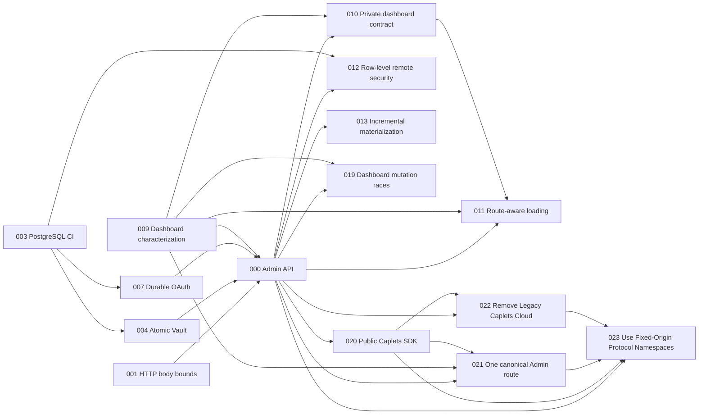

# Caplets Improvement Plans

Audit date: 2026-07-19  
Admin API decision sessions: 2026-07-20–21 (ADRs 0007 and 0008)
Planned against: `ac12a174`  
Audit depth: standard, hotspot-weighted  
Status vocabulary: `TODO`, `IN PROGRESS`, `BLOCKED`, `DONE`, `STALE`

## Baseline

- Monorepo: TypeScript, pnpm workspaces, Node >=22, Turbo, Vitest.
- Full repository gate: `pnpm verify`.
- Focused package gates use `pnpm --filter <package> test|typecheck|build`.
- Latest inspected `main` CI run succeeded.
- `pnpm audit --prod --audit-level high` found no high/critical dependency vulnerability at audit time.
- Root `tsc --noEmit --pretty false` exited 0 at audit time.
- No source code was modified during the audit. Plans and domain/architecture decision documents are the deliverables of the later Admin API decision session.

## Recommended execution order

Plan 000 is the implemented Admin API semantic migration anchor, and Plan 020 completes its public SDK package seam. Plan 021 applies ADR 0008's exclusive dual-credential Admin authentication before release. Plan 022 then removes the legacy hosted Caplets Cloud product surface, and Plan 023 is the final pre-release integration gate: it moves every surviving protocol to the fixed origin-root topology, regenerates public artifacts, and deletes all old routes and frozen v1 Admin compatibility.

| Plan                                                   | Finding / direction                        |      Impact |  Effort | Fix risk | Depends on              | Status      |
| ------------------------------------------------------ | ------------------------------------------ | ----------: | ------: | -------: | ----------------------- | ----------- |
| [000](000-migrate-admin-api.md)                        | Resource-oriented Admin API migration      |        HIGH |      XL |     HIGH | 001, 003, 004, 007, 009 | COMPLETE    |
| [001](001-bound-http-request-bodies.md)                | Bound HTTP request bodies                  |        HIGH |       S |      LOW | —                       | COMPLETE    |
| [002](002-enforce-code-mode-execution-budgets.md)      | Hard Code Mode timeout ceiling             |        HIGH |       M |   MEDIUM | —                       | TODO        |
| [003](003-run-postgresql-contracts-in-ci.md)           | Run PostgreSQL contracts in CI             |        HIGH |       M |      LOW | —                       | COMPLETE    |
| [004](004-make-vault-set-and-grant-atomic.md)          | Atomic SQL Vault set-and-grant             |        HIGH |       M |     HIGH | 003                     | COMPLETE    |
| [005](005-bound-http-runtime-sessions.md)              | Bound/expire HTTP runtime sessions         |        HIGH |       M |   MEDIUM | —                       | TODO        |
| [006](006-prune-expired-code-mode-logs.md)             | Physically prune expired Code Mode logs    |        HIGH |       S |      LOW | —                       | TODO        |
| [007](007-guard-oauth-flow-completion.md)              | Durable guarded backend OAuth flows        |        HIGH |       L |     HIGH | 003                     | COMPLETE    |
| [008](008-trigger-sites-for-shared-package-changes.md) | Deploy sites on shared-package changes     |        HIGH |       S |      LOW | —                       | TODO        |
| [009](009-cover-dashboard-mutations-and-csrf.md)       | Characterize dashboard mutations/CSRF      |        HIGH |       S |      LOW | —                       | COMPLETE    |
| [010](010-type-dashboard-private-contract.md)          | Type dashboard-private HTTP contracts      |        HIGH |       S |      LOW | 000, 009                | TODO        |
| [011](011-load-dashboard-data-by-route.md)             | Route-aware Admin resource loading         |        HIGH |       M |   MEDIUM | 000, 009, 010           | TODO        |
| [012](012-use-row-level-remote-security-operations.md) | Row-level remote-security operations       |        HIGH |       L |     HIGH | 000, 003                | TODO        |
| [013](013-incrementally-materialize-stored-caplets.md) | Incremental stored-Caplet materialization  |        HIGH |       L |     HIGH | 000                     | TODO        |
| [014](014-sync-contributor-instructions.md)            | Synchronize contributor instructions       |      MEDIUM |       S |      LOW | —                       | TODO        |
| [015](015-separate-compact-catalog-reads.md)           | Compact catalog read model                 |        HIGH |       M |   MEDIUM | —                       | TODO        |
| [016](016-add-caplet-authoring-preflight.md)           | Direction: authoring preflight             | Product bet |       M |   MEDIUM | —                       | TODO        |
| [017](017-spike-self-hosted-https-project-binding.md)  | Direction: self-hosted HTTPS binding spike | Product bet | M spike |     HIGH | —                       | TODO        |
| [018](018-add-per-caplet-benchmark-flights.md)         | Direction: per-Caplet benchmark flights    | Product bet |       M |   MEDIUM | —                       | TODO        |
| [019](019-fix-dashboard-mutation-races.md)             | Fix dashboard mutation races               |        HIGH |       S |   MEDIUM | 000, 009                | COMPLETE    |
| [020](020-publish-caplets-sdk.md)                      | Publish the full public Caplets SDK        |        HIGH |      XL |     HIGH | 000 contract            | COMPLETE    |
| [021](021-use-one-canonical-admin-route.md)            | One canonical dual-credential Admin route  |        HIGH |       L |     HIGH | 000, 009, 020           | IN PROGRESS |
| [022](022-remove-legacy-caplets-cloud.md)              | Remove Legacy Caplets Cloud                |        HIGH |      XL |     HIGH | 000, 020                | TODO        |
| [023](023-use-fixed-origin-protocol-namespaces.md)     | Use Fixed-Origin Protocol Namespaces       |        HIGH |      XL |     HIGH | 000, 020, 021, 022      | TODO        |

## Dependency graph

Plans omitted from the graph are independent at the source-contract level, though they may still conflict mechanically. In particular 001/005 touch HTTP composition, 003/004/007/012 touch authoritative storage and concurrency, and 000/009/010/011/013/019/021/023 touch Admin, dashboard, and Caplet Record seams. Plan 020 is the completed public-client package slice over Plan 000's semantic contract. Plan 021 preserves its exclusive credential-selection Interface for Plan 023. Plan 022 removes the legacy hosted product surface after 000 and 020; Plan 023 depends directly on 000, 020, 021, and 022 and is the final release-topology gate.

## Suggested waves

### Wave A — containment and verification

Execute 001, 002, 003, 005, 006, 008, 009, and 014. These bound resource use, restore CI/deploy/test coverage, and characterize the dashboard before protocol migration.

### Wave B — Admin API prerequisites and semantic migration

1. Execute 004 and 007 after 003 is green in CI.
2. Execute 000 only after 001, 003, 004, 007, and 009 are complete.
3. Treat completed Plan 000 as the authoritative semantic, storage, authentication, and streaming baseline. Its two mounts, root OpenAPI location, and frozen v1 Admin Adapter are implemented history, not the release target.
4. Treat completed Plan 020 as the authoritative SDK package and curated-client baseline. Plan 023 regenerates its route-dependent artifacts.

### Wave C — final pre-release integration gates

1. Complete 021 after 000, 009, and 020. Preserve its exclusive bearer/session/development credential selection and one-authority seam, but do not release its old service-root route locations.
2. Execute 022 after 000 and 020, sequenced after 021 in this release wave. Delete Cloud/hosted modes and targets, treat any supplied URL as a generic remote, and atomically migrate self-hosted profiles to generic remote while leaving stored Cloud credentials untouched and unread. Preserve generic Current Host remote and Project Binding support plus unrelated Cloudflare/Alchemy deployment infrastructure.
3. Execute 023 only after 000, 020, 021, and 022 are complete. It is the final pre-release gate: `GET /` returns `302` to `/dashboard`; the only protocol namespaces are `/.well-known/caplets`, `/api`, `/api/openapi.json`, `/api/v1/*`, `/api/v2/admin/*`, exact unversioned `/mcp`, `/dashboard` and `/dashboard/*`, `/dashboard/_astro/*`, and `/dashboard/api/*`. Current Host URLs are origins, slash variants and old paths return `404`, v1 Admin is deleted, and OpenAPI, SDK, dashboard, and CLI artifacts land together without aliases or fallbacks.

### Wave D — post-migration deepening

- Execute 010 after 000 and 009, then 011 after 010.
- Execute 012 after 000 and 003 so row-level operations preserve Admin ETag generations.
- Execute 013 after 000 so cache materialization reuses the streaming descriptor/source seam.
- Execute 015 independently with its focused data-integrity/performance gates.

### Wave E — product bets

- 016 is a bounded implementation: static, non-mutating authoring preflight.
- 017 is deliberately spec-first. Do not enable self-hosted HTTPS binding unless the spike verdict is `PROCEED`.
- 018 adds benchmark evidence without changing runtime behavior.

## Findings mapped to plans

| Audit # | Finding                                                 | Plan |
| ------: | ------------------------------------------------------- | ---: |
|       1 | Unbounded HTTP JSON bodies                              |  001 |
|       2 | Unbounded caller-selected Code Mode timeout             |  002 |
|       3 | Non-atomic SQL Vault value/grant mutation               |  004 |
|       4 | PostgreSQL contract suites skip in CI                   |  003 |
|       5 | Unbounded MCP/fallback Attach sessions                  |  005 |
|       6 | Expired Code Mode logs retained physically              |  006 |
|       7 | OAuth flow node locality and unsafe completion          |  007 |
|       8 | Deploy filters omit shared packages                     |  008 |
|       9 | Dashboard destructive mutation/CSRF coverage gap        |  009 |
|      10 | Full dashboard refresh on every route/mutation          |  011 |
|      11 | Remote-security normalized rows rewritten as aggregate  |  012 |
|      12 | Stored Caplets fully materialized twice                 |  013 |
|      13 | Residual dashboard-private wire-type drift              |  010 |
|      14 | Contributor instructions drift from root manifest/gates |  014 |
|      15 | Compact catalog list parses full content                |  015 |

## Direction options selected

| Direction                                      | Plan | Decision boundary                                                                                                                                                                                                             |
| ---------------------------------------------- | ---: | ----------------------------------------------------------------------------------------------------------------------------------------------------------------------------------------------------------------------------- |
| Resource-oriented Current Host Admin Interface |  000 | ADR 0007 remains authoritative for semantic operations, resource behavior, authentication policy, streaming, and SDK generation; ADR 0008 and Plan 023 replace its route topology and frozen v1 Admin Adapter before release. |
| First-class Caplet authoring preflight         |  016 | Ship static validation only; no backend starts, Vault resolution, or publication.                                                                                                                                             |
| Self-hosted HTTPS Project Binding              |  017 | Spike trust/sync topology first; implementation is blocked without a secure reachable sync endpoint and lifecycle proof.                                                                                                      |
| Per-Caplet benchmark flights                   |  018 | Keep live runs opt-in and claims evidence-based; compare equivalent backend availability.                                                                                                                                     |

## Considered and rejected

These candidates were investigated and intentionally not planned:

- **Ambiguous mixed-auth fallback:** ADR 0008 permits two credential forms on one canonical Admin route only through presence-based exclusive selection; an invalid bearer never falls back to a dashboard cookie.
- **Permanent dual v1/v2 Admin evolution:** rejected for release. Plan 023 deletes v1 Admin; only surviving non-Admin v1 protocols move beneath `/api/v1/*`.
- **JSON/base64 v2 bundles:** Plan 000 uses bounded streaming multipart upload/export and ephemeral staging.
- **Node-local backend OAuth flows:** Plan 007 moves encrypted pending state into Authoritative Host State.
- **Docker workspace manifest failure:** recent release builds succeeded, and the current core/dashboard Turbo edge plus nested-build bridge did not establish a reproducible failure. Revisit only with a clean-build reproduction.
- **Convenience PostgreSQL single-owner role:** accepted by ADR 0006; not a vulnerability finding.
- **Code Mode default exposure / flat-tool defaults:** accepted product and architecture decisions (ADR 0001 and strategy docs).
- **Durable Code Mode heaps:** intentionally in-memory/session-scoped by current design; only timeout/log retention gaps were promoted.
- **Hosted Cloud control-plane implementation:** remains separately owned and is not planned here. Plan 022 removes this repository's legacy hosted product integration while preserving generic Current Host remote and Project Binding support and unrelated Cloudflare/Alchemy deployment infrastructure.
- **Dashboard placeholder pages:** current files are active implementations; route performance/contract gaps were promoted instead.
- **SQL-authoritative filesystem precedence:** ADR 0005 explicitly keeps project/global Caplet files above SQL records.
- **HTTP proxy environment support:** standard convention and not promoted as SSRF without a violated trust boundary.
- **CLI child-process tree termination:** plausible hardening, but no surviving-descendant leak was established from current tests; investigate before filing.

## Audit coverage and exclusions

Audited deeply: core HTTP/admin/auth boundaries, Code Mode runner/session/log paths, SQL Host State and migrations, Vault, Project Binding, dashboard data/mutation seams, catalog persistence, CI/release/deploy workflows, dependencies, and benchmark direction.

Audited at medium depth: CLI command surface, native adapters, docs/tooling, public apps, package boundaries.

Not exhaustively audited: every catalog Caplet definition, platform-specific daemon managers, generated artifact contents, opt-in live benchmark results, the separately owned hosted Cloud server, and every low-churn utility. Plans should re-read current files before execution and stop on drift.

## Execution protocol

For each plan:

1. Change status to `IN PROGRESS`.
2. Confirm `git rev-parse --short HEAD` and run the plan's drift checks against cited files/symbols.
3. Follow steps in order; do not absorb adjacent cleanup.
4. Run every focused verification gate and required smoke scenario.
5. Add a changeset only where the plan requires one; otherwise use repository `no changeset` policy.
6. Mark `DONE` only when machine-checkable criteria and manual smoke evidence both pass. Mark `BLOCKED` with the exact failed gate and evidence; do not improvise past escape hatches.

If source drift invalidates excerpts or contracts, mark the plan `STALE` and refresh it before implementation.
