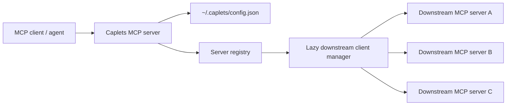

# Caplets Progressive MCP Disclosure PRD

## 1. Executive Summary

**Problem Statement**: MCP clients that connect directly to many servers receive a large, flat tool surface up front. This creates context bloat, weak tool selection, name-collision risk, and poor discoverability when an agent only needs to know which capability domain to inspect next.

**Proposed Solution**: Caplets is a local MCP server that reads downstream MCP server definitions from `~/.caplets/config.json` and exposes each enabled downstream server as one top-level, skill-like MCP tool. Each generated server tool uses the configured server ID as the tool name and the configured `name`/`description` as its capability card, then progressively discloses that server's underlying tools through operations such as `search_tools`, `list_tools`, `get_tool`, and `call_tool`.

**Success Criteria**:

- Initial Caplets `tools/list` response exposes one tool per enabled downstream server and is at least 70% smaller than direct aggregation for a fixture containing 5 downstream servers and 50 total downstream tools.
- Agents can discover and invoke the correct downstream tool in <= 3 Caplets tool calls for at least 90% of benchmark tasks.
- Caplets preserves downstream MCP tool results without lossy transformation in 100% of protocol-compatible test fixtures.
- Misconfigured, unavailable, or failing downstream servers return structured Caplets errors within configured timeouts and never expose secrets.
- MVP passes regression coverage for config validation, discovery, search, duplicate tool names, forwarding, downstream failures, and secret redaction.

## 2. User Experience & Functionality

### User Personas

- **Agent power user**: Runs multiple MCP servers locally and wants less tool flooding in agent clients.
- **AI tool builder**: Wants to expose curated capability domains without writing custom MCP proxy code for every downstream server.
- **MCP server author**: Wants their server to remain available through standard MCP semantics while benefiting from better capability-level discovery.

### Primary User Flow

1. User installs and configures Caplets as an MCP server in their MCP client.
2. User creates `~/.caplets/config.json` with downstream server definitions and Caplets options.
3. Each downstream server entry uses the supported MCP server configuration shape plus a required `description`.
4. Client calls Caplets `tools/list` and sees one top-level tool per enabled downstream server, for example `linear`, `chrome-devtools`, and `context7`.
5. Agent chooses the relevant server tool based on its skill-like tool name and description.
6. Agent calls that server tool with an operation such as `get_server`, `search_tools`, `list_tools`, or `get_tool`.
7. Agent calls the same server tool with `operation: "call_tool"`, an exact downstream tool name, and a JSON object of arguments.
8. Caplets forwards the request to that server's downstream MCP process and returns the downstream result.

### User Stories

**Story 1**: As an agent power user, I want Caplets to show my MCP servers by name and description first so that agents choose a capability domain before seeing every tool.

Acceptance Criteria:

- Caplets reads `~/.caplets/config.json` from the current user's home directory by default.
- Every configured server requires a stable server key and non-empty `description`.
- Caplets `tools/list` returns one generated top-level MCP tool per enabled server.
- Each generated server tool uses the configured server ID as the MCP tool name.
- Each generated server tool description includes the configured display `name` and Markdown-capable `description`.
- Disabled servers are omitted from `tools/list`.
- Caplets `tools/list` never exposes raw command arguments, env values, headers, tokens, full raw config, or downstream server tools directly.
- Caplets process startup validates config but does not block on starting every downstream server.
- The first live operation against a generated server tool starts or connects to the relevant downstream server.
- Successfully started stdio servers stay running alongside Caplets until Caplets exits or the downstream process dies.
- If a downstream stdio process dies, Caplets marks cached status unavailable and the next relevant operation may attempt one restart with backoff.
- Remote HTTP/SSE servers are connected lazily and reused when supported by the MCP SDK transport.

**Story 2**: As an agent, I want to list and search tools for a selected server so that I can inspect only the relevant tool surface.

Acceptance Criteria:

- Each generated server tool supports `operation: "list_tools"` and returns a compact list of that server's MCP tools.
- Each generated server tool supports `operation: "get_tool"` and returns one downstream tool's full metadata by exact downstream tool name.
- `get_tool` refreshes stale downstream tool metadata according to `toolCacheTtlMs` before resolving the exact downstream tool name.
- Tool results preserve downstream `name`, `description`, `inputSchema`, and annotations when available.
- Caplets forwards downstream tool annotations as-is and does not infer, normalize, or add Caplets-specific risk labels in MVP.
- `operation: "search_tools"` supports deterministic case-insensitive lexical search across that server's downstream tool names and descriptions.
- `search_tools` is scoped to the selected generated server tool; MVP does not provide cross-server tool search because `tools/list` is already the server discovery layer.
- `search_tools` supports an optional `limit`, defaults to 20 results, and rejects values above 50.
- `search_tools` uses fresh cached tool metadata from that server's managed downstream process and starts that server if needed.
- Duplicate downstream tool names across different servers are supported because tool names are only resolved inside a generated server tool.

**Story 3**: As an agent, I want to call an underlying tool through Caplets so that I can use downstream MCP capabilities without connecting to each server directly.

Acceptance Criteria:

- `operation: "call_tool"` requires exact downstream `tool` and a JSON object `arguments`.
- `call_tool` requires the exact downstream tool name; Caplets does not use fuzzy matching, aliases, or auto-correction for execution.
- The selected generated server tool is the server namespace, so `call_tool` does not accept a `server` argument in MVP.
- Caplets preserves downstream tool names exactly and does not support flattened namespaced identifiers such as `server.tool` in MVP.
- Caplets forwards calls to downstream MCP `tools/call` using the selected server connection.
- Before `call_tool` resolves the exact downstream tool name, Caplets refreshes stale downstream tool metadata according to `toolCacheTtlMs`.
- `call_tool` requires the requested downstream tool to appear in fresh-enough cached `tools/list` metadata before forwarding; absent tools return `TOOL_NOT_FOUND` and are not forwarded.
- Unknown operation, unknown tool, malformed Caplets request shape, startup timeout, call timeout, and downstream protocol failure return structured errors.
- Malformed generated-server-tool payloads use `REQUEST_INVALID`, including missing required operation fields, invalid field types, invalid `call_tool.arguments`, and operation-specific extra fields.
- Extra fields that do not belong to the selected operation are malformed Caplets request shapes and must be rejected rather than ignored.
- Caplets does not perform heavy local validation of downstream tool arguments; once routing fields are valid, the selected downstream MCP server remains the source of truth for argument validation and tool semantics.
- `TOOL_NOT_FOUND` may include nearby same-server suggestions for debugging, but suggestions are informational only and must never be invoked automatically.
- Downstream tool results are returned without lossy transformation, including text, structured content, images, resource links, and `isError` when supported by the SDK/protocol.
- Tool names are resolved only within the selected server namespace.

**Story 4**: As a user, I want configuration failures to be obvious and safe so that I can fix setup issues without leaking credentials.

Acceptance Criteria:

- Caplets validates config with clear errors before serving discovery results.
- Unsupported transports or unsupported config fields produce actionable validation messages.
- Each generated server tool supports `operation: "check_server"`, verifies or starts/connects to that managed downstream server if needed, calls downstream `tools/list`, refreshes cached status and tool metadata, and returns server availability status, tool count when available, safe error details when unavailable, and elapsed timing data.
- `check_server` must not invoke any downstream tool.
- Env values, tokens, headers, and secret-looking fields are redacted from errors and logs.
- Downstream server startup has a default timeout of 10 seconds and can be overridden per server.
- Tool calls have a default timeout of 60 seconds and can be overridden per server.

**Story 5**: As a user, I want to authenticate remote HTTP/SSE MCP servers from the Caplets CLI so that OAuth-backed servers can be used without putting access tokens in config.

Acceptance Criteria:

- `caplets auth login <server>` performs OAuth setup for configured remote servers with `auth.type: "oauth2"`.
- The command opens a browser-based authorization code flow with PKCE and receives the callback on a loopback URL.
- `caplets auth login <server> --no-open` supports headless terminals and remote shells by printing the authorization URL and accepting manual completion input.
- Successful auth writes a token bundle to `~/.caplets/auth/<server>.json` using owner-only file permissions where supported.
- The Caplets MCP server uses stored OAuth tokens for subsequent HTTP/SSE requests without exposing tokens through MCP tools, generated descriptions, logs, or errors.
- Auth failures are reported with structured, redacted errors.
- Re-running `caplets auth login <server>` replaces the stored token bundle for that server atomically.
- `caplets auth list` lists configured remote OAuth servers and safe token status without printing access tokens, refresh tokens, or raw token-store contents.
- `caplets auth logout <server>` deletes the stored token bundle for a configured remote OAuth server.

### MVP Tool Surface

Caplets exposes dynamic MCP tools:

- One top-level MCP tool per enabled configured server.
- The generated MCP tool name is the configured server ID, for example `linear`, `chrome-devtools`, or `context7`.
- Caplets does not prefix generated tool names in MVP; the server ID is the MCP tool name exactly.
- The generated MCP tool description is the full server capability card, built from configured `name` and exact configured `description`.
- Generated tool descriptions append a short standard protocol hint, roughly: `Use this tool to inspect and call tools from the {server} MCP server. Start with search_tools or list_tools; use get_tool for schema; use call_tool to invoke.`
- The standard protocol hint should stay under 35 words.
- Disabled servers are omitted from Caplets `tools/list`.
- Caplets does not expose every downstream tool directly in its own `tools/list`.

Each generated server tool supports these operations:

- `get_server`: Returns the full configured capability card for the selected server without starting the downstream process.
- `check_server`: Validates that the selected downstream server can start, initialize, and return its tool list without invoking any downstream tool.
- `list_tools`: Lists compact downstream tool entries for the selected server.
- `search_tools`: Searches downstream tools for the selected server. Supports optional `limit`, defaults to 20 results, and rejects values above 50.
- `get_tool`: Returns full metadata for one exact downstream tool.
- `call_tool`: Invokes one exact downstream tool with a JSON object of arguments.

Generated server tool input schema:

- `operation` is required and must be one of `get_server`, `check_server`, `list_tools`, `search_tools`, `get_tool`, or `call_tool`.
- `get_server` accepts no extra fields.
- `get_server` returns only configured capability-card data and does not start, initialize, or probe the downstream server.
- `get_server` is intentionally provisional in MVP; it may be pruned later if generated top-level server tool descriptions prove sufficient.
- `check_server` accepts no extra fields.
- `list_tools` accepts no extra fields.
- `search_tools` requires `query` and accepts optional `limit`.
- `get_tool` requires `tool`.
- `call_tool` requires `tool` and `arguments`; `arguments` must be a JSON object and is not optional.
- `tool` fields are plain strings, not enums of downstream tool names.
- Generated server tool schemas must remain stable even when downstream tool lists change.
- Unknown operations return `UNKNOWN_OPERATION`.
- Operation-specific request validation is strict: fields not defined for the selected `operation` are rejected as malformed Caplets request shapes.

### Configuration

MVP supports one documented config file at `~/.caplets/config.json`:

```json
{
  "$schema": "https://raw.githubusercontent.com/spiritledsoftware/caplets/main/schemas/caplets-config.schema.json",
  "version": 1,
  "defaultSearchLimit": 20,
  "maxSearchLimit": 50,
  "mcpServers": {
    "filesystem": {
      "name": "Project Files",
      "description": "Read, search, and edit local project files.",
      "command": "npx",
      "args": ["-y", "@modelcontextprotocol/server-filesystem", "/home/ianpascoe/code"],
      "env": {
        "EXAMPLE_TOKEN": "${EXAMPLE_TOKEN}"
      },
      "cwd": "/home/ianpascoe/code",
      "startupTimeoutMs": 10000,
      "callTimeoutMs": 60000,
      "toolCacheTtlMs": 30000,
      "disabled": false
    },
    "remote-docs": {
      "name": "Remote Docs",
      "description": "Search hosted documentation through a remote Streamable HTTP MCP server.",
      "transport": "http",
      "url": "https://mcp.example.com/mcp",
      "auth": {
        "type": "oauth2",
        "clientId": "$env:REMOTE_DOCS_CLIENT_ID",
        "authorizationUrl": "https://mcp.example.com/oauth/authorize",
        "tokenUrl": "https://mcp.example.com/oauth/token",
        "scopes": ["mcp:tools"]
      },
      "callTimeoutMs": 60000,
      "toolCacheTtlMs": 30000
    }
  }
}
```

Requirements:

- `mcpServers` is required for MVP.
- `$schema` is optional and exists only for JSON Schema-aware editor validation.
- `version` is optional for MVP and defaults to 1 when omitted. If present, MVP accepts only `1` and rejects unsupported versions with `CONFIG_INVALID`.
- Allowed top-level keys in MVP are `$schema`, `version`, `defaultSearchLimit`, `maxSearchLimit`, and `mcpServers`; unknown top-level keys are rejected with `CONFIG_INVALID`.
- The committed JSON Schema lives at `schemas/caplets-config.schema.json`, is generated from the Zod runtime config schema, and CI must fail when the committed schema drifts from the generated output.
- Unknown keys inside each server config are rejected with `CONFIG_INVALID`, except fields that belong to the tracked standard MCP server schema plus Caplets-owned additions documented here.
- `mcpServers` is the only accepted top-level server configuration key for downstream MCP servers in MVP.
- `defaultSearchLimit` and `maxSearchLimit` are optional top-level Caplets options. Future Caplets options should remain top-level unless they are specific to one downstream server.
- Caplets' native config shape follows the shared/standard `mcpServers` convention used by tools such as Pi's MCP adapter, with Caplets-specific metadata added per server.
- Each server key is the stable server ID. It must match `^[a-zA-Z0-9_-]{1,64}$` and be unique within the file.
- The server ID becomes the generated MCP tool name exactly.
- Valid example IDs include `linear`, `chrome-devtools`, and `context7`. Spaces, dots, slashes, colons, and Unicode are rejected in MVP.
- `name` is required, human-readable display text for discovery responses, and must be 1-80 characters.
- Discovery responses must clearly distinguish `server` as the stable routing ID from `name` as display-only text.
- `description` is required and must be at least 10 non-whitespace characters.
- `description` must be at most 1500 characters and is returned exactly as configured.
- `description` may contain Markdown syntax because the primary reader is an LLM, but MVP treats it as opaque text: Caplets does not render, sanitize, transform, or interpret Markdown.
- Caplets should reuse or closely track existing MCP server config validation semantics where practical rather than inventing a new dialect.
- Each server config must define exactly one connection shape:
  - Stdio: `command` is required; optional `args`, `env`, and `cwd` are allowed.
  - Remote: `url` is required and `transport` must be `http` or `sse`.
- `transport` defaults to `stdio` when `command` is present. For remote servers, `http` means MCP Streamable HTTP and is preferred; `sse` means the legacy HTTP+SSE transport for compatibility.
- Remote `url` must be `https://` except loopback development URLs such as `http://localhost`, `http://127.0.0.1`, and `http://[::1]`.
- `startupTimeoutMs`, `callTimeoutMs`, `toolCacheTtlMs`, and `disabled` are optional for all transports.
- `env` interpolation should align with existing MCP client practice where possible. MVP should support Pi-style `${VAR}` and `$env:VAR` references for config values that carry secrets, resolving from Caplets' process environment and redacting resolved values everywhere.
- The same interpolation and redaction rules apply to remote `url`, auth tokens, auth headers, OAuth client credentials, and OAuth token fields.
- Caplets must not support shell command substitution for MCP server config values in MVP.
- Remote server auth supports `auth.type: "none" | "bearer" | "headers" | "oauth2"`:
  - `none`: no additional auth material.
  - `bearer`: requires `token`; Caplets sends `Authorization: Bearer <token>` on every HTTP/SSE request and never places tokens in query strings.
  - `headers`: requires a `headers` object of static string headers, intended for non-standard API-key schemes. Caplets validates header names, rejects hop-by-hop or transport-controlled headers, interpolates values, and redacts values everywhere.
  - `oauth2`: supports interactive OAuth for MCP-compliant HTTP/SSE servers through `caplets auth login <server>`. MVP accepts optional `authorizationUrl`, `tokenUrl`, `issuer`, `clientId`, `clientSecret`, `scopes`, and `redirectUri`; Caplets sends bearer access tokens on every HTTP/SSE request.
- `caplets auth login <server>` is the required MVP user flow for OAuth-backed remote servers unless valid tokens already exist in the Caplets auth store.
- `caplets auth login <server>` validates that `<server>` is a configured remote server with `auth.type: "oauth2"`, discovers or reads authorization metadata, starts an OAuth authorization code flow with PKCE, opens the user's browser, listens on a loopback callback URL, exchanges the code for tokens, and writes the token bundle to Caplets' local auth store.
- `caplets auth login <server> --no-open` must print the authorization URL and allow the user to paste the final callback URL, authorization code, or provider-issued authorization token into the CLI. It may also continue listening on the loopback callback URL when practical.
- Manual OAuth completion must validate `state`, apply the stored PKCE verifier, reject mismatched callback URLs or codes, and redact pasted secrets from logs and errors.
- OAuth authorization requests must include a state parameter and PKCE challenge. OAuth token requests must verify state and include the PKCE verifier.
- For MCP-compliant OAuth servers, Caplets must include the target server resource indicator in authorization and token requests when required by the MCP authorization specification.
- The default OAuth token store is `~/.caplets/auth/<server>.json`; files must be created with owner-only permissions when the platform supports it.
- Token bundles are runtime auth state, not server description state. They must not be embedded in generated MCP tool descriptions, `get_server`, logs, or structured errors.
- The Caplets MCP server reads OAuth tokens from the auth store lazily before remote operations. Updating tokens with `caplets auth login <server>` should not require editing config and should be designed to work without restarting Caplets when practical.
- `caplets auth list` reports configured OAuth remote servers as missing, authenticated, or expired and must not enumerate arbitrary orphan token files outside the configured server set.
- `caplets auth logout <server>` removes the local token bundle for a configured OAuth remote server and is allowed even when the server is currently disabled.
- Caplets may refresh expired OAuth tokens when a refresh token and token endpoint are available, and should persist refreshed token bundles atomically back to the auth store.
- If OAuth metadata is not fully configured, `caplets auth login <server>` should use MCP/OAuth discovery where available, including safe handling of `WWW-Authenticate` metadata from the remote server.
- HTTP 401/403 responses from remote servers return structured auth errors with safe challenge metadata when available. Caplets must parse `WWW-Authenticate` enough to classify auth-required/auth-failed cases without leaking credentials.
- Remote auth error payloads use safe fields only: `server`, `status`, `message`, `authType`, optional redacted `challenge`, and optional `nextAction: "run_caplets_auth_login"`.
- Streamable HTTP clients must preserve MCP protocol-version and session semantics, including `MCP-Protocol-Version` and `Mcp-Session-Id` behavior, through the official SDK transport where possible.
- `toolCacheTtlMs` defaults to 30000. `0` means refresh downstream `tools/list` on every metadata operation.
- `get_tool` and `call_tool` must ensure cached downstream tool metadata is fresh enough according to `toolCacheTtlMs` before exact downstream tool-name resolution.
- `call_tool` must resolve against fresh-enough downstream `tools/list` metadata and must not forward a call for a tool absent from that metadata in MVP.
- `disabled` defaults to false. Disabled servers are omitted from normal discovery, never appear in search results, are never started, and cannot be inspected or invoked until re-enabled and Caplets is restarted.
- Disabled servers are omitted from generated `tools/list` to preserve the token-saving purpose of Caplets.
- MVP supports stdio, MCP Streamable HTTP, and legacy HTTP+SSE downstream servers. Streamable HTTP is preferred for remote servers; SSE exists for compatibility.
- OpenCode's `mcp` config shape is a compatibility reference, not Caplets' native MVP shape: OpenCode uses local/remote entries under `mcp`, local `command` as an array, `environment` instead of `env`, and `{env:NAME}`-style interpolation in its broader config system. Automatic OpenCode config import/normalization is deferred.

### Non-Goals

- No hosted service, SaaS registry, team sync, or remote management.
- No GUI or config editor.
- No attempt to standardize every MCP client config format.
- No automatic import from other MCP clients.
- No GUI OAuth onboarding in MVP; OAuth setup is CLI-driven through `caplets auth login <server>`.
- No mandatory dynamic client registration in MVP. Caplets may use it when an MCP/OAuth server advertises support, but a configured `clientId` path must work.
- No `tags` field in MVP; users can include tag-like Markdown in `description` when helpful.
- No separate `whenToUse` or `avoidWhen` fields in MVP; users can include those sections in Markdown-formatted `description`.
- No permissions engine, policy language, sandboxing, or general-purpose credential manager beyond the local OAuth token store required for remote MCP auth.
- No semantic/vector search in MVP.
- No MCP resources, prompts, sampling, elicitation, roots, or Apps support in MVP.
- No cross-server tool composition, planning, or result summarization.
- No automatic trust scoring of downstream servers or tools.
- No multi-user daemon mode.

## 3. AI System Requirements

### Tool Requirements

Caplets is itself an MCP server and must implement the MCP server tools surface using `@modelcontextprotocol/sdk`.

Downstream interactions required for MVP:

- Start stdio MCP servers from validated config on first relevant capability operation and keep successful processes running alongside the Caplets process.
- Initialize downstream MCP clients over stdio, Streamable HTTP, or legacy HTTP+SSE with bounded concurrency and structured status for servers that fail to start or authenticate.
- Resolve configured bearer/header auth and stored OAuth tokens before remote HTTP/SSE operations.
- Call downstream `tools/list` for selected servers.
- Call downstream `tools/call` for `operation: "call_tool"` inside a generated server tool.
- Refresh stale downstream tool metadata before `get_tool` and `call_tool` exact-name resolution according to `toolCacheTtlMs`.
- Require downstream tools to be present in fresh-enough `tools/list` metadata before forwarding `call_tool`.
- Preserve downstream schemas and result content.
- Normalize Caplets-owned errors while keeping downstream results protocol-compatible.

### Progressive Disclosure Behavior

Caplets must optimize the first cognitive layer for the agent:

- Level 0: Caplets `tools/list` exposes only generated server/caplet tools, one per enabled downstream server.
- Level 1: The agent selects a generated server tool by server ID, display name, and description.
- Level 2: The selected server tool discloses its full capability card and downstream tool metadata through `get_server`, `list_tools`, `search_tools`, and `get_tool`.
- Level 3: The selected server tool invokes one downstream tool through `operation: "call_tool"` with exact downstream `tool` and a JSON object `arguments`.

Progressive disclosure is not a security boundary. The PRD treats it as a context-management and tool-selection strategy.

### Evaluation Strategy

Create a benchmark fixture with at least:

- 5 downstream server configs.
- 50 total downstream tools.
- 10 tasks that require selecting a server before tool inspection.
- 10 tasks that require searching tools after server discovery.
- 3 duplicate tool-name cases across different servers.
- 1 unavailable or misconfigured server.

Metrics:

- Initial tool-list token reduction vs direct aggregation.
- Tool selection accuracy.
- Number of Caplets calls before correct invocation.
- Timeout/error classification accuracy.
- Secret redaction coverage.
- Fidelity of forwarded downstream tool results.

## 4. Technical Specifications

### Architecture Overview

Caplets runs as a local stdio MCP server.



Core modules:

- `src/cli.ts`: CLI entrypoint, including `caplets auth login <server>` for OAuth setup.
- `src/index.ts`: MCP server bootstrap and dynamic generated server-tool registration.
- `src/config.ts`: Config loading, schema validation, defaults, and redaction helpers.
- `src/auth.ts`: Remote auth resolution, OAuth flow orchestration, token storage, token refresh, and auth redaction helpers.
- `src/registry.ts`: Server metadata registry and search over server descriptions.
- `src/downstream.ts`: Managed MCP client lifecycle, stdio process supervision, remote transport setup, timeouts, and connection reuse.
- `src/tools.ts`: Generated server-tool operation handlers and response shaping.
- `src/errors.ts`: Structured error codes and safe error serialization.

### Data Model

`CapletsConfig`:

- `$schema?: string`
- `version?: 1`
- `defaultSearchLimit?: number`
- `maxSearchLimit?: number`
- `mcpServers: Record<string, CapletServerConfig>`

`CapletServerConfig`:

- `name: string`
- `description: string`
- `transport?: "stdio" | "http" | "sse"`
- `command?: string`
- `args?: string[]`
- `env?: Record<string, string>`
- `cwd?: string`
- `url?: string`
- `auth?: RemoteAuthConfig`
- `startupTimeoutMs?: number`
- `callTimeoutMs?: number`
- `toolCacheTtlMs?: number`
- `disabled?: boolean`

`RemoteAuthConfig`:

- `{ type: "none" }`
- `{ type: "bearer"; token: string }`
- `{ type: "headers"; headers: Record<string, string> }`
- `{ type: "oauth2"; authorizationUrl?: string; tokenUrl?: string; issuer?: string; clientId?: string; clientSecret?: string; scopes?: string[]; redirectUri?: string }`

`StoredOAuthTokenBundle`:

- `server: string`
- `accessToken: string`
- `refreshToken?: string`
- `tokenType?: string`
- `expiresAt?: string`
- `scope?: string`
- `metadata?: Record<string, unknown>`

`CapletServerSummary`:

- `server: string`
- `name: string`
- `description: string`
- `disabled?: boolean`
- `status: "disabled" | "not_started" | "starting" | "available" | "unavailable"`
- `lastError?: SafeErrorSummary`

`CapletServerDetail`:

- `server: string`
- `name: string`
- `description: string`

`CapletToolRef`:

- `server: string`
- `tool: string`
- `description?: string`
- `inputSchema?: unknown`
- `annotations?: unknown`

`GeneratedServerToolRequest`:

- `operation: "get_server" | "check_server" | "list_tools" | "search_tools" | "get_tool" | "call_tool"`
- `query?: string`
- `limit?: number`
- `tool?: string`
- `arguments: Record<string, unknown>`

Requirements:

- `tool` is the exact downstream MCP tool name.
- `call_tool.arguments` must be a JSON object. Missing arguments, arrays, strings, numbers, booleans, and null are malformed Caplets request shapes in MVP.
- Operation-specific fields are exclusive to their operations. For example, `tool` is invalid on `list_tools`, `query` is invalid on `get_tool`, and `arguments` is invalid outside `call_tool`.
- `server` is the exact configured Caplets server key and the generated top-level MCP tool name.
- Caplets does not invent escaped, flattened, or globally unique tool names in MVP.
- Caplets does not expose downstream tool names as enum values in generated server tool input schemas.
- `list_tools` returns compact downstream tool entries: `tool`, `description`, annotations when available, and `hasInputSchema`.
- `get_tool` returns full downstream metadata for one exact downstream tool in the selected server.
- `get_tool` and `call_tool` both use fresh-enough cached metadata for exact downstream tool-name resolution.
- `call_tool` returns `TOOL_NOT_FOUND` without forwarding when the exact downstream tool name is absent from fresh-enough metadata.
- `search_tools` returns compact matches by default: `tool`, `description`, annotations when available, and `hasInputSchema`, but not full `inputSchema`.
- `search_tools` results are scoped to the generated server tool that was called.

### Integration Points

- File system: reads `~/.caplets/config.json`.
- MCP SDK server: exposes Caplets over stdio.
- MCP SDK client: connects to downstream stdio, Streamable HTTP, and legacy HTTP+SSE servers.
- Node child process runtime: launches configured downstream commands.
- Caplets CLI: runs `caplets auth login <server>` for OAuth-backed remote servers.
- Browser/loopback OAuth: opens the authorization URL and receives the OAuth callback on localhost for configured OAuth servers.
- Local auth store: reads and writes OAuth token bundles under `~/.caplets/auth`.
- Remote transport headers: preserves required MCP protocol-version and session headers for Streamable HTTP servers.

### Error Codes

Caplets errors should be structured and stable:

- `CONFIG_NOT_FOUND`
- `CONFIG_INVALID`
- `REQUEST_INVALID`
- `SERVER_NOT_FOUND`
- `SERVER_UNAVAILABLE`
- `SERVER_START_TIMEOUT`
- `UNKNOWN_OPERATION`
- `TOOL_NOT_FOUND`
- `TOOL_CALL_TIMEOUT`
- `AUTH_REQUIRED`
- `AUTH_FAILED`
- `AUTH_REFRESH_FAILED`
- `DOWNSTREAM_PROTOCOL_ERROR`
- `DOWNSTREAM_TOOL_ERROR`
- `UNSUPPORTED_TRANSPORT`
- `INTERNAL_ERROR`

### Security & Privacy

- Caplets must never expose raw env values or known credential fields in tool responses.
- Caplets must redact secret-looking strings from logs and structured errors.
- Caplets must never expose remote auth headers, bearer tokens, OAuth access tokens, refresh tokens, authorization codes, client secrets, or full token-store contents through MCP responses.
- OAuth authorization codes and token responses must be handled only inside the CLI/auth layer and written only to the configured auth store.
- OAuth access tokens must be sent to remote MCP servers only in the `Authorization` header, never in query strings.
- Caplets must not pass through credentials received from the upstream MCP client to downstream remote MCP servers; downstream remote auth uses only the configured/stored credentials for that specific downstream server.
- Caplets must treat downstream tool metadata and results as untrusted content.
- Caplets must not claim that progressive disclosure prevents tool execution risk.
- Caplets must not infer safety properties from downstream metadata or transform downstream annotations into Caplets-owned risk labels in MVP.
- Destructive downstream tools remain subject to the MCP client's own confirmation and trust model.
- Downstream MCP servers remain authoritative for tool argument validation and execution semantics.
- Caplets should avoid unnecessary restarts or repeated process churn once a downstream stdio server is successfully managed.
- Caplets should terminate managed downstream stdio server processes when Caplets exits.
- Caplets should cache each managed server's `tools/list` metadata for `toolCacheTtlMs` and refresh stale metadata on tool metadata operations.
- `check_server` should always refresh downstream `tools/list` for the selected server and update cached metadata/status.

### Testing Requirements

Add automated tests for:

- File system reads `~/.caplets/config.json`.
- Valid config loading from a temp home directory.
- Optional config version defaulting to 1 and unsupported version rejection.
- Unknown top-level and server config key rejection.
- Server ID pattern validation.
- Server ID validation covers allowed hyphens/underscores and rejects spaces, dots, slashes, colons, and Unicode.
- Required display `name` validation.
- Display name vs server ID routing behavior.
- Generated server tool operation discriminator validation.
- Strict operation-specific request-shape validation, including rejection of extra fields on otherwise valid operations.
- Missing config and invalid config.
- Required `description` validation.
- `description` maximum length validation and exact response preservation.
- Secret redaction in validation and runtime errors.
- Remote auth config validation for `none`, `bearer`, `headers`, and `oauth2`.
- Header auth validation rejects hop-by-hop and transport-controlled headers.
- OAuth token-store path derivation from server ID and owner-only file permission behavior where supported.
- `caplets auth login <server>` success flow: loads config, validates OAuth server config, performs PKCE callback exchange against a mocked OAuth server, and stores a token bundle.
- `caplets auth login <server> --no-open` prints the authorization URL and completes via pasted callback URL, pasted authorization code/token, or loopback callback when available.
- Manual OAuth completion validates state/PKCE and rejects mismatched, expired, malformed, or already-used completion input.
- `caplets auth login <server>` failure behavior for missing server, non-remote server, non-OAuth server, denied callback, token exchange failure, and secret redaction.
- Remote HTTP/SSE clients use bearer/header/OAuth auth material without leaking it in responses or logs.
- OAuth refresh success and failure behavior, including atomic token-store update on success and `AUTH_REFRESH_FAILED` on refresh failure.
- Remote 401/403 classification into `AUTH_REQUIRED` or `AUTH_FAILED` with safe challenge metadata.
- Remote auth error payload shape includes only `server`, `status`, `message`, `authType`, redacted `challenge`, and `nextAction` when relevant.
- Streamable HTTP protocol-version and session-header behavior is covered by transport tests.
- Generated `tools/list` exposes one safe capability card per enabled server and omits disabled servers.
- `get_server` returns exact full server descriptions without starting, initializing, or probing downstream processes.
- `list_tools` returns compact downstream tool metadata and `get_tool` preserves full downstream tool metadata including `inputSchema`.
- Server-scoped `search_tools` deterministic lexical matching.
- Capped search result behavior: default `limit` 20, max `limit` 50, no pagination in MVP.
- Server-scoped `search_tools` startup and failure behavior.
- `check_server` success, unavailable server, timeout, and secret redaction behavior.
- `toolCacheTtlMs` behavior, including default TTL, stale refresh, and `0` refresh-every-time mode.
- `get_tool` and `call_tool` refresh stale metadata before exact downstream tool-name resolution.
- Disabled server behavior: omitted from generated `tools/list`, not callable, never returned by search, and never started.
- Duplicate tool names across servers.
- Successful `operation: "call_tool"` forwarding.
- `call_tool` refuses to forward absent tools after fresh-enough metadata resolution and returns `TOOL_NOT_FOUND`.
- Downstream server startup timeout.
- Downstream process death and one-restart-with-backoff behavior.
- Downstream tool call timeout.
- Downstream protocol failure.
- Unavailable server status reporting.

Verification commands for implementation:

```sh
pnpm format:check
pnpm lint
pnpm typecheck
pnpm test
pnpm build
```

If no test runner exists yet, implementation must add one before claiming MVP completeness.

## 5. Risks & Roadmap

### Phased Rollout

**MVP: Local progressive MCP gateway**

- Read `~/.caplets/config.json`.
- Validate `mcpServers` config with required descriptions.
- Require restart after config changes while keeping config loading, registry construction, and downstream client lifecycle modular enough for later hot reload.
- Expose one generated top-level MCP tool per enabled downstream server.
- Support server-scoped diagnostics, tool listing, lexical search, tool metadata lookup, and explicit tool invocation through each generated server tool.
- Support managed downstream stdio server lifecycles, remote HTTP/SSE transports, startup/call timeouts, structured errors, and secret redaction.
- Support bearer, static-header, and OAuth2 auth for remote HTTP/SSE servers.
- Provide `caplets auth login <server>` for OAuth browser/PKCE setup and local token storage.
- Start downstream stdio servers on first relevant capability operation rather than blocking Caplets process startup.
- Support server-scoped tool search with fresh cached metadata and bounded startup for missing processes.
- Add regression tests and benchmark fixture.

**v1.1: Better discovery and operations**

- Explicit config reload support, with `tools/list_changed` notification where appropriate.
- Optional tags and structured usage guidance.
- Better search ranking while remaining deterministic.
- Health-check command for validating all configured servers.
- Cache downstream `tools/list` results with invalidation controls.
- OAuth device-code fallback and richer auth-store management commands such as status, refresh, and logout.
- Optional downstream tool metadata change detection, with appropriate freshness signals or `tools/list_changed` behavior when generated top-level tool descriptions/schemas are affected.

**v2.0: Broader MCP coverage**

- Explore resources and prompts progressive disclosure.
- Optional policy hooks for allow/deny decisions.
- Optional import helpers for common MCP client config files.
- Optional semantic search over server and tool metadata.

### Technical Risks

- **Config fragmentation**: MCP clients differ on config shape. MVP mitigates this by documenting and supporting exactly `mcpServers`.
- **Client expectations**: Some clients may expect every downstream tool in `tools/list`. MVP intentionally exposes one generated server/caplet tool per downstream server instead.
- **Lifecycle cost**: Keeping downstream stdio servers running improves freshness but consumes local resources and may surface startup failures earlier. MVP mitigates this with bounded startup, process reuse, status reporting, and partial failures.
- **Unsafe downstream behavior**: Downstream tools may be destructive. MVP mitigates this by avoiding safety claims and preserving MCP client confirmation flows.
- **Metadata quality**: Bad server descriptions weaken discovery. MVP mitigates this with required descriptions and minimum validation, then improves with tags/usage guidance in v1.1.
- **Protocol drift**: MCP surfaces evolve. MVP constrains scope to tools and uses the official SDK to reduce compatibility risk.

### Open Product Decisions

- None currently unresolved for MVP scope.
